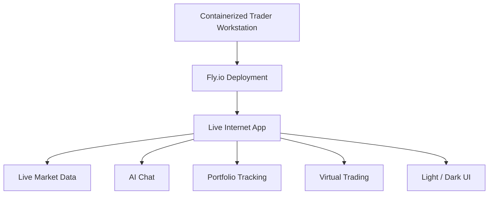
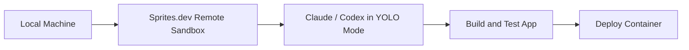
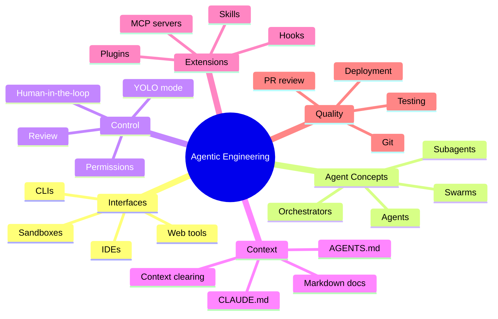
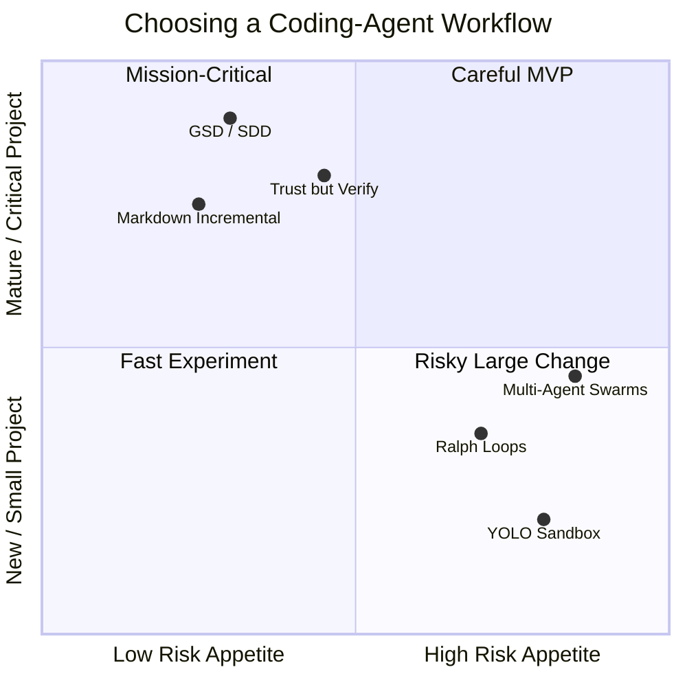
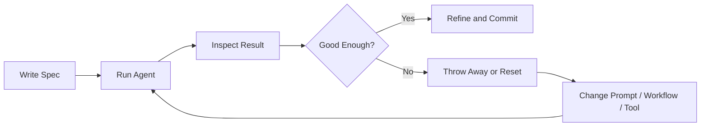
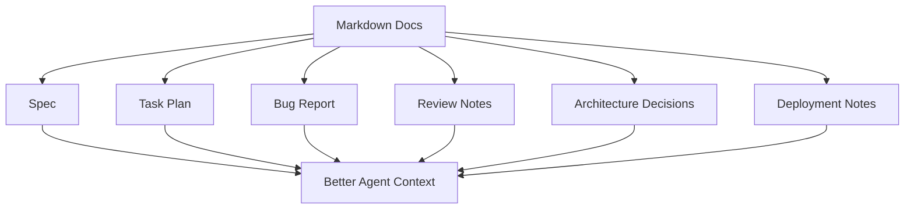
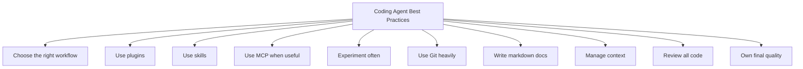

# 093 - Day 5 - Final Deployment, Course Wrap-Up & Coding Agent Best Practices

## Lesson Information

| Item     | Details                                                           |
| -------- | ----------------------------------------------------------------- |
| Lesson   | 093                                                               |
| Duration | 9 min                                                             |
| Week     | Week 3 - Agentic Engineering Frontier                             |
| Module   | Week 3 Day 5 - Gas Town, Swarms, Capstone                         |
| Topic    | Final deployment, course wrap-up, and coding-agent best practices |

---

## Core Summary

This final lesson wraps up the course by showing the final deployment of the Trader Workstation and reviewing the most important coding-agent best practices.

The final app was deployed live to the internet using **Fly.io**, the same company behind **Sprites.dev**. The deployed app includes:

* live market data
* AI chat
* portfolio tracking
* virtual trading
* environment variables configured correctly
* a polished light-mode interface

The broader message is that coding agents are powerful, but developers must still own the workflow, the architecture, the context, and the final code quality.

---

## Learning Objectives

By the end of this lesson, learners should be able to:

* Understand how the final project was deployed.
* Compare the strengths of Claude Agent Teams, Codex, GSD, and swarm-style workflows.
* Choose coding-agent workflows based on project maturity and risk.
* Apply best practices for plugins, skills, MCP servers, Git, markdown, and context management.
* Understand why the developer remains responsible for code quality.

---

## Final Deployment

The instructor had a short conversation with Codex about where to deploy the final Trader Workstation.

They agreed that **Fly.io** was a strong choice because the project was already containerized.

Codex then:

1. discussed deployment options
2. recommended Fly.io
3. wrote a deployment script
4. helped run the script
5. configured environment variables
6. deployed the app live on the internet

The final deployed app was available at:

```text id="b7ti9s"
finally-ed.fly.dev
```

The deployment took around **15 minutes**.

---

## Deployed App Features

The deployed Trader Workstation included:

* live market data
* portfolio state
* AI assistant chat
* virtual trades
* correct environment variable setup
* internet-accessible deployment
* clean light-mode UI



---

## Final Orchestrator Reflection

The instructor reviewed the different orchestration approaches used throughout the capstone.

| Orchestrator           | Final Impression                              |
| ---------------------- | --------------------------------------------- |
| **GSD**                | Most disciplined and reliable                 |
| **Claude Agent Teams** | Favorite developer experience                 |
| **Gastown**            | Powerful and highly parallel, but chaotic     |
| **Codex**              | Best final result in this capstone            |
| **Sprites.dev**        | Excellent sandbox for YOLO-mode coding agents |

The instructor’s personal conclusion:

* **Favorite workflow experience:** Claude Agent Teams
* **Best final capstone result:** Codex
* **Best safety environment for YOLO mode:** Sprites.dev

---

## Why Sprites.dev Was Powerful

Sprites.dev made it possible to run coding agents in a remote sandbox.

This means the instructor could use agents in YOLO mode while keeping the local machine safe.



The key benefit is safety.

YOLO mode can be useful because agents can move quickly without asking for permission every few seconds. But YOLO mode is risky on a local machine. A sandbox makes this much safer.

---

## Student Challenge

The instructor encourages learners to take the final repo and try one of the workflows themselves.

Possible directions:

* deploy the app
* add user login
* add a users table
* extend the trading workstation
* improve the AI assistant
* try a different model
* try GSD with a cheaper or open-source model
* try Codex or Claude with a more advanced workflow
* build a different project with a similar “wow factor”

The key idea is that coding agents make software development feel like a **choose-your-own-adventure story**.

A strong specification gives the learner a stable foundation, but the project can go in many different directions.

---

## Course Wrap-Up Theme

The course ends by returning to the Andrej Karpathy idea that programming is being refactored.

Modern programmers now need to understand a new layer of abstraction involving:

* agents
* subagents
* prompts
* context
* memory
* modes
* permissions
* tools
* plugins
* skills
* hooks
* MCP
* LSP
* slash commands
* workflows
* IDEs
* CLIs
* sandboxing
* orchestration

The main point is that the profession is changing quickly.

There is no perfect manual yet, so developers must experiment and build their own mental model.

---

## The New Coding-Agent Landscape



---

## Most Important Mindset

The single most important lesson is:

```text id="uf4qyn"
Be willing to experiment.
```

There is not always one correct workflow.

A good developer should try different approaches:

* start with a clear spec
* let the agent build
* inspect the result
* throw it away if needed
* try again with a different workflow
* compare outcomes
* keep what works

Coding agents make experimentation cheap.

---

## Choosing the Right Workflow

The instructor recommends choosing the workflow based on:

* project maturity
* risk level
* codebase size
* model capability
* personal skill level
* preferred working style

---

## Workflow Decision Chart



---

## Recommended Approach by Project Type

### Mission-Critical or Large Codebases

For important, mature, or complex codebases, use more controlled workflows.

Recommended practices:

* work incrementally
* use many markdown files
* manage context carefully
* use spec-driven design
* use GSD-style workflows
* trust but verify
* review everything carefully

Best fit:

```text id="je7dpg"
GSD / SDD / Incremental Markdown Workflow
```

---

### MVPs and New Builds

For new builds, prototypes, or lower-risk projects, faster workflows can be useful.

Recommended practices:

* use YOLO mode only in a sandbox
* use Sprites.dev or a managed environment
* try Ralph loops
* use multi-agent orchestration
* move quickly, then review carefully

Best fit:

```text id="hnly2g"
YOLO Sandbox / Ralph Loops / Multi-Agent Swarms
```

---

## Pick the Right Tool for Your Skill Level

Different developers may prefer different interfaces.

| Developer Type             | Recommended Starting Point                   |
| -------------------------- | -------------------------------------------- |
| Beginner or still learning | IDE-based agents                             |
| Comfortable developer      | Claude Code or Codex CLI                     |
| Experienced engineer       | CLI tools, sandboxing, multi-agent workflows |
| Risk-sensitive developer   | GSD, markdown-heavy workflows                |
| Experiment-focused builder | YOLO mode in a sandbox                       |

The best tool is not universal. It depends on how you like to work.

---

## Plugins First

The instructor recommends starting with plugins.

Plugins are usually easier to adopt because many tools provide official or popular plugins.

Good plugin choices are usually:

* popular
* actively used
* relevant to your project
* focused on a clear capability

Example plugin categories:

* feature development
* code simplification
* professional frontend generation
* documentation
* framework-specific support

---

## Skills Next

After plugins, the next step is usually skills.

Skills help agents perform specific kinds of work more consistently.

A skill can define:

* process rules
* formatting requirements
* domain-specific behavior
* coding conventions
* review steps
* testing expectations

Skills are useful when your project has repeated patterns or specialized requirements.

---

## MCP Servers

MCP servers can also be useful when the agent needs access to external tools, documentation, or data sources.

The instructor mentions that something like **Context7** can be valuable when it gives the agent exactly the documentation or context it needs.

MCP servers are another way to extend the agent’s abilities beyond ordinary code generation.

---

## Use Trial and Error

Do not expect the first attempt to be perfect.

A practical coding-agent workflow often looks like this:



The ability to throw away a bad run and try again is one of the biggest advantages of agentic coding.

---

## Git Is Your Friend

Heavy Git usage is essential.

Git gives you the ability to:

* checkpoint progress
* compare changes
* revert bad agent work
* create branches
* isolate experiments
* review diffs
* recover from mistakes

A strong workflow is:

```text id="r2c7u5"
Small task → Agent change → Review diff → Test → Commit
```

Do not let agents make massive unreviewed changes without checkpoints.

---

## Markdown as Coordination Memory

Markdown is one of the most important tools in agentic engineering.

Use markdown files for:

* project specs
* task plans
* bug reports
* implementation notes
* review logs
* testing checklists
* architecture decisions
* deployment instructions



Markdown keeps the project understandable for both humans and agents.

---

## Manage Context Proactively

Context management is a major skill when working with coding agents.

In Claude Code, the instructor recommends using:

```text id="h7tysz"
/context
```

Use it often to understand what the agent currently has in context.

Do not wait until the context window becomes messy or compacted.

A better workflow is:

1. write important information into markdown
2. update `CLAUDE.md` or `AGENTS.md`
3. clear the conversation context
4. restart with a cleaner context
5. continue from the written project memory

Example:

```text id="exnw8a"
Write the current implementation status to docs/status.md.
Update AGENTS.md with the important project rules.
Then I will clear context and continue from the docs.
```

---

## CLAUDE.md and AGENTS.md

Different tools may expect different instruction files.

| Tool        | Common Instruction File |
| ----------- | ----------------------- |
| Claude Code | `CLAUDE.md`             |
| Codex       | `AGENTS.md`             |

These files help agents understand:

* project rules
* coding standards
* architecture
* commands
* testing steps
* constraints
* preferred workflow

They act as persistent project memory.

---

## Own the Code Quality

The final and most important best practice is:

```text id="c3m1h7"
You own the quality of the code you push.
```

Even if an AI agent wrote the code, the developer is responsible for it.

Do not push code that you do not understand or stand behind.

---

## Avoid Agent Slop

The instructor warns against letting coding agents generate low-quality “slop.”

Common signs of agent slop include:

* too many unnecessary files
* excessive README files
* random test files
* unnecessary abstractions
* inconsistent naming
* messy formatting
* over-engineered solutions
* decorative emojis in professional code
* changes outside the requested scope

Be strict.

Keep the code sharp, focused, and maintainable.

---

## Final Best Practices Checklist



---

## Practical Checklist

Before accepting agent-generated code, ask:

* Does the code solve the actual task?
* Did it change only the intended files?
* Can I explain the implementation?
* Did I review the diff?
* Did I run the tests?
* Did I remove unnecessary files?
* Is the code consistent with the project style?
* Is the context documented in markdown?
* Is this code good enough for me to stand behind?

---

## Key Takeaways

1. The final Trader Workstation was deployed live on the internet using Fly.io.

2. Codex helped choose the deployment target, write the script, configure the environment, and deploy the app.

3. Claude Agent Teams was the instructor’s favorite developer experience.

4. Codex produced the strongest final result in the capstone.

5. Sprites.dev is powerful because it enables safe YOLO-mode work in a sandbox.

6. There is no single perfect coding-agent workflow.

7. Choose tools based on project risk, maturity, and your personal working style.

8. Plugins, skills, MCP servers, Git, markdown, and context management are core parts of modern agentic engineering.

9. Experimentation is essential.

10. The developer owns the final code quality.

---

## Reflection Questions

1. Why was Fly.io a good deployment choice for this project?

2. Why is YOLO mode safer in a remote sandbox?

3. When should you use a disciplined GSD-style workflow?

4. When is a faster YOLO or swarm workflow appropriate?

5. Why are markdown files so important for coding agents?

6. How does proactive context management improve agent performance?

7. What does it mean to “own the code” when an AI agent wrote much of it?

8. What project could you build next using the same agentic workflow?

---

## Final Course Message

This course ends with a clear message: coding agents are changing software development, but they do not remove the need for engineering judgment.

The most effective developer is not the one who blindly trusts agents. The most effective developer is the one who can guide them well.

That means:

* writing clear specs
* choosing the right workflow
* using plugins and skills
* managing context
* working safely in sandboxes
* using Git carefully
* reviewing code ruthlessly
* deploying confidently
* experimenting continuously

Agentic engineering is not just about asking an AI to write code.

It is about learning how to manage a powerful, fast, fallible, and constantly changing set of tools.

The developer remains the orchestrator.

The developer owns the final result.

Roll up your sleeves, keep experimenting, and build something worth showing.
