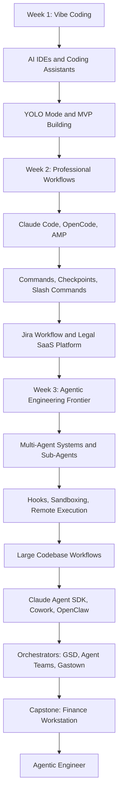
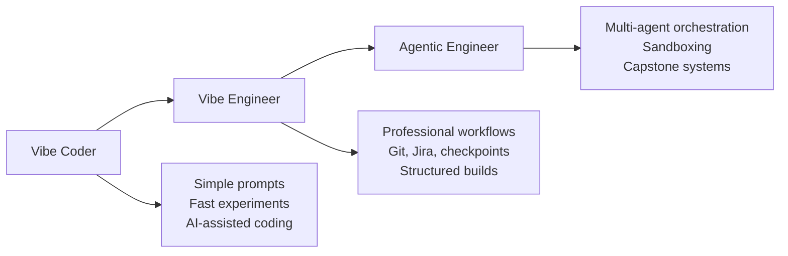

# 094 - Day 5 - Course Recap: From Vibe Coding to Agentic Engineer

## Lesson Information

| Item     | Details                                   |
| -------- | ----------------------------------------- |
| Lesson   | 094                                       |
| Duration | 5 minutes                                 |
| Week     | Week 3 - Agentic Engineering Frontier     |
| Module   | Week 3 Day 5 - Gas Town, Swarms, Capstone |

---

## Main Topic

This final lesson recaps the full journey from **vibe coding** to becoming an **agentic engineer**.

The course began with simple prompting and AI-assisted coding, then gradually moved toward professional workflows, multi-agent systems, orchestration, sandboxing, large codebases, and full capstone projects.

By the end of the course, learners are expected to understand how to use coding agents not just as helpers, but as part of a complete engineering workflow.

---

## Learning Objectives

After this lesson, learners should be able to:

* Review the major concepts covered throughout the course.
* Understand the progression from simple AI coding to agentic engineering.
* Recognize the value of agents, sub-agents, orchestration, sandboxing, and remote workflows.
* Reflect on the projects built during the course.
* Continue building personal and professional projects using AI coding agents.

---

## Course Journey Overview

---

## Key Concepts

### 1. From Vibe Coding to Vibe Engineering

At the beginning of the course, the focus was on **vibe coding**: using AI tools to quickly build, experiment, and explore ideas.

Learners were introduced to tools such as:

* Cursor
* GitHub Copilot
* Codex
* Antigravity
* AI IDE plugins
* `agents.md`
* YOLO-style workflows

This stage was about learning how to move fast, experiment creatively, and let AI coding agents help with implementation.

---

### 2. From Vibe Engineering to Professional Workflows

The course then moved into more structured engineering workflows.

Learners explored:

* Claude Code
* OpenCode
* AMP
* Slash commands
* Checkpoints
* Ralph loops
* Jira-based workflows
* Git push workflows
* Legal SaaS platform development

This stage showed that AI coding agents are not only useful for quick experiments. They can also support real engineering processes when combined with planning, version control, task tracking, and review.

---

### 3. From Single-Agent Workflows to Multi-Agent Systems

In Week 3, the course entered the **agentic engineering frontier**.

The focus shifted from one agent helping with one task to multiple agents working together.

Important topics included:

* Multi-agent systems
* Sub-agents
* Hooks
* Sandboxing
* Remote execution
* Mobile-based agent workflows
* GitHub issue workflows
* Large codebase workflows
* Claude Agent SDK
* Claude Cowork
* OpenClaw
* Claude Agent Teams
* GSD
* Gastown

This stage demonstrated how agents can be coordinated, delegated, and orchestrated to build larger systems.

---

## Project Recap

Although the course officially included four commercial projects, the instructor notes that learners actually built six projects in total.

### Projects Mentioned

| Project                               | Description                                        |
| ------------------------------------- | -------------------------------------------------- |
| First-Person Shooter                  | A fun early project built during the first day     |
| Space Invaders                        | Another early game project                         |
| Commercial MVP                        | A more practical product-style application         |
| Legal SaaS Platform                   | A professional workflow project using Jira and Git |
| Trading / Finance Workstation         | A major capstone-style build                       |
| Massive API Fix with Codex Sub-Agents | A final advanced agentic engineering task          |

---

## Evolution of the Learner

---

## Important Takeaways

### Build More Than You Watch

The most important message of the recap is simple:

> The goal is to build.

The course provides tools, workflows, mental models, and examples, but the real value comes from using them in personal projects, professional work, and experiments.

---

### AI Coding Agents Are an Alien Tool

The instructor refers to AI coding agents as a powerful “alien tool” inspired by Andrej Karpathy’s framing.

The key idea is that these tools are new, strange, powerful, and still evolving. Learners now have a practical manual for using them effectively.

---

### Share Your Work

Learners are encouraged to:

* Share completed projects.
* Post course certificates.
* Write about lessons learned.
* Compare different agent platforms.
* Share insights on LinkedIn.
* Continue building in public.

Sharing helps others learn and also helps the learner build credibility as an agentic engineer.

---

## Why This Lesson Matters

This lesson is the closing reflection for **Week 3 Day 5 - Gas Town, Swarms, Capstone**.

It matters because it connects the entire learning journey:

* From simple prompts to agent orchestration.
* From small apps to SaaS platforms.
* From single-agent coding to multi-agent teams.
* From coding experiments to professional engineering workflows.
* From vibe coder to agentic engineer.

By completing this lesson, learners understand the full arc of the course and are encouraged to continue applying these skills in real projects.

---

## Final Summary

In **094 - Day 5 - Course Recap: From Vibe Coding to Agentic Engineer**, the instructor closes the course by reviewing the complete journey.

The course began with simple AI coding tools and playful experimentation. It then moved into more serious workflows with Claude Code, OpenCode, AMP, Jira, Git, and SaaS development. Finally, it reached advanced agentic engineering topics such as multi-agent teams, sandboxing, remote execution, orchestrators, Gastown, Codex sub-agents, and a finance workstation capstone.

The main message is clear:

Learners are no longer just vibe coders.
They are not only vibe engineers.
They are now **agentic engineers**.

The next step is to keep building, share the work, and apply these agentic engineering skills to real projects.
