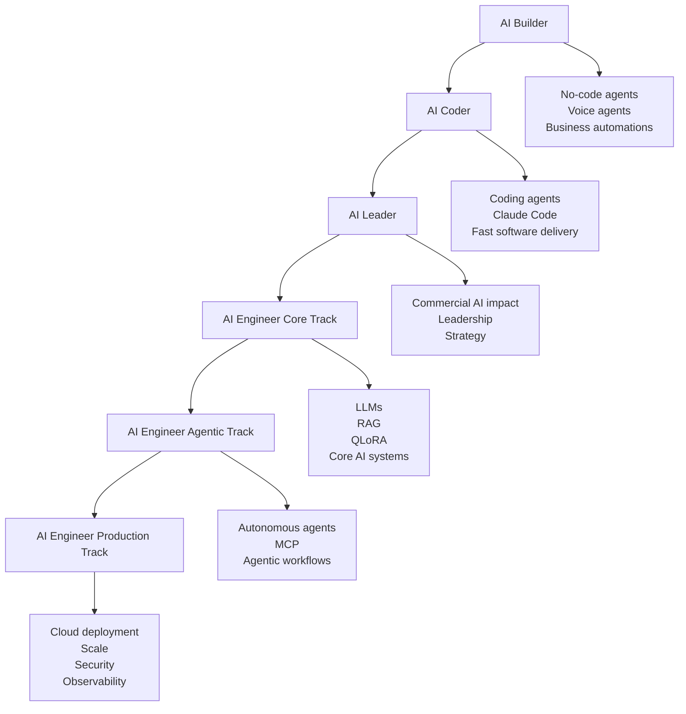
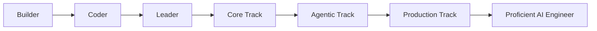

# 095 - Bonus Lecture - Your Exclusive Links

## Lesson Information

| Item     | Details   |
| -------- | --------- |
| Lesson   | 095       |
| Duration | 3 minutes |
| Week     | Bonus     |
| Module   | Bonus     |

---

## Main Topic

This bonus lecture provides exclusive links and recommended next steps after completing the course.

The instructor shares links to related courses, explains how the courses fit together, and gives learners a suggested learning path for continuing toward AI engineering, applied AI engineering, or forward-deployed engineering roles.

---

## Learning Objectives

After this lesson, learners should be able to:

* Identify the instructor’s related courses and what each one focuses on.
* Understand how the courses connect with each other.
* Choose a suitable next course based on their goals and technical level.
* Understand the pricing and discount-link timing.
* Plan a continued learning path after finishing this course.

---

## Exclusive Course Links

The bonus lecture includes special-price links for the instructor’s courses.

| Course                       | Focus                                                                         |
| ---------------------------- | ----------------------------------------------------------------------------- |
| AI Builder                   | Create agents, voice agents, and automations in n8n                           |
| AI Coder                     | Use Claude Code and coding agents to build software faster                    |
| AI Leader                    | Apply generative AI and agentic AI for business impact                        |
| AI Engineer Core Track       | Learn LLM engineering, RAG, QLoRA, and core AI engineering skills             |
| AI Engineer Agentic Track    | Build autonomous AI agents and MCP-based systems                              |
| AI Engineer Production Track | Deploy LLMs and agents at scale with reliability, observability, and security |

> Note: The original lesson mentions “Claim your special price here,” but no actual URLs are included in the provided text.

---

## How the Courses Fit Together

The instructor explains that the six courses are designed to complement one another with very little overlap. Each course covers a different part of the AI learning journey.

---

## Course Breakdown

### 1. AI Builder

This course is for learners who want to create agents and voice agents for business use without writing code.

It is suitable for:

* Non-technical learners
* Business owners
* Automation builders
* People who want practical AI workflows quickly

---

### 2. AI Coder

This course focuses on using coding agents such as Claude Code to deliver software at high speed.

It is suitable for:

* Developers
* Indie hackers
* Technical founders
* Learners who want to build apps faster with AI coding agents

---

### 3. AI Leader

This course focuses on applying generative AI and agentic AI for real business impact.

It is suitable for:

* Founders
* Managers
* Team leads
* Business professionals
* Leaders in startups or large companies

---

### 4. AI Engineer Core Track

This course teaches learners how to select, apply, and optimize LLMs for real-world commercial problems.

It covers topics such as:

* LLM engineering
* RAG
* QLoRA
* Applied AI systems
* Model selection and optimization

This track is more technical and is aimed at learners who want to become AI engineers.

---

### 5. AI Engineer Agentic Track

This course focuses on autonomous AI agents and agentic systems.

It is suitable for learners who want to go deeper into:

* AI agents
* Agent orchestration
* MCP
* Autonomous workflows
* Advanced agentic engineering patterns

---

### 6. AI Engineer Production Track

This is the most advanced course in the sequence.

It focuses on deploying LLMs and agents at scale with:

* Cloud infrastructure
* Reliability
* Observability
* Security
* Production-grade engineering practices

This track is best for learners who are already technical or who have completed earlier courses.

---

## Recommended Learning Path

The instructor says the courses can be taken in any order, but the most natural progression is:

A practical recommended order is:

1. AI Builder
2. AI Coder
3. AI Leader
4. AI Engineer Core Track
5. AI Engineer Agentic Track
6. AI Engineer Production Track

Completing all six courses and shipping the projects can prepare learners for roles such as:

* AI Engineer
* Applied AI Engineer
* Forward-Deployed Engineer

---

## Audience Guide

| Course Group                    | Best For                                          |
| ------------------------------- | ------------------------------------------------- |
| AI Builder, AI Coder, AI Leader | Broad audience, technical or non-technical        |
| AI Engineer Core Track          | Technical or aspiring-technical learners          |
| AI Engineer Agentic Track       | Learners interested in advanced agent systems     |
| AI Engineer Production Track    | Advanced learners ready for production deployment |

---

## Pricing and Discount Notes

The instructor explains that the course links use reliable monthly discount coupons.

Important details:

* Udemy may sometimes show a cheaper price directly.
* Udemy’s lowest-price coupons usually expire after five days.
* Instructors can only create a limited number of coupons per course each month.
* The provided links are intended to stay active for the full month.
* Discounts are refreshed around the 5th of each month.
* There may be a short window when a link temporarily shows the regular price.
* If that happens, learners are advised to check again later.

---

## Why This Bonus Lecture Matters

This bonus lecture helps learners decide what to do after finishing the course.

It provides:

* A map of the instructor’s broader course ecosystem.
* A suggested path for continued AI learning.
* Guidance for both non-technical and technical learners.
* A clearer route toward becoming a proficient AI engineer.

Instead of ending the course without direction, this lecture gives learners a next step.

---

## Final Summary

In **095 - Bonus Lecture - Your Exclusive Links**, the instructor thanks learners for completing the course and shares special-price links to related courses.

The lecture explains how six courses fit together: AI Builder, AI Coder, AI Leader, AI Engineer Core Track, AI Engineer Agentic Track, and AI Engineer Production Track.

The main message is that learners can continue in any order, but the natural path is to move from no-code AI building, to coding agents, to AI leadership, then into deeper AI engineering, agentic systems, and production deployment.

This bonus lesson acts as a roadmap for learners who want to continue building skills and move toward roles such as AI engineer, applied AI engineer, or forward-deployed engineer.

---

# Bài luyện tập

## Mục tiêu

## Đề bài

## Yêu cầu hoàn thành

- [ ] 
- [ ] 
- [ ] 

## Kết quả / lời giải

## Ghi chú
