# 001 – Sức mạnh của Claude Code và Claude Cowork

## 1. Thông tin bài học

| Nội dung                    | Chi tiết                                                                                          |
| --------------------------- | ------------------------------------------------------------------------------------------------- |
| **Tên bài học**             | The Power of Claude Code & Cowork                                                                 |
| **Phần học**                | Giới thiệu khóa học, bí quyết học tập và lời chào mừng                                            |
| **Chủ đề chính**            | Ứng dụng AI tác nhân để tự động hóa công việc, nghiên cứu, phân tích dữ liệu và xây dựng phần mềm |
| **Công cụ được giới thiệu** | Claude Chat, Claude Code và Claude Cowork                                                         |
| **Giảng viên**              | Ryan Ahmed                                                                                        |

---

## 2. Giới thiệu khóa học

Khóa học **Claude Masterclass** tập trung vào ba công cụ chính:

1. **Claude Chat** – giao tiếp, đặt câu hỏi, phân tích và tạo nội dung.
2. **Claude Code** – hỗ trợ xây dựng, chỉnh sửa và kiểm tra các dự án phần mềm.
3. **Claude Cowork** – cho phép AI làm việc trực tiếp với tệp, thư mục và các công cụ văn phòng.

Mục tiêu của khóa học không chỉ là hướng dẫn cách trò chuyện với AI, mà còn giúp người học biết cách sử dụng Claude như một **đồng nghiệp kỹ thuật số** có khả năng thực hiện công việc thực tế.

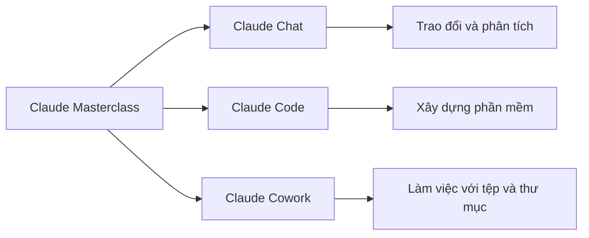

---

## 3. Giới thiệu giảng viên

Ryan Ahmed là:

* Trợ lý giáo sư.
* Giảng viên trực tuyến có nhiều khóa học bán chạy.
* Người có niềm đam mê với trí tuệ nhân tạo và giáo dục.
* Đã giảng dạy cho hơn nửa triệu học viên trên toàn thế giới.
* Có bằng thạc sĩ tập trung vào AI.
* Có bằng tiến sĩ kỹ thuật.
* Có bằng MBA chuyên ngành tài chính.
* Điều hành một kênh YouTube về AI, khoa học dữ liệu và Agentic AI.
* Từng tổ chức các chương trình đào tạo doanh nghiệp cho nhiều ngân hàng và tổ chức tài chính như Discover, Jefferies, RBC, Barclays và HSBC.

---

## 4. Ý tưởng chính của bài học

Bài học giới thiệu giá trị cốt lõi của Claude Code và Claude Cowork:

> Người dùng có thể mô tả mục tiêu bằng ngôn ngữ tự nhiên, sau đó AI sẽ phân tích yêu cầu, chia công việc thành các nhiệm vụ nhỏ và thực hiện chúng bằng những công cụ phù hợp.

Thay vì chỉ trả lời câu hỏi, AI có thể:

* Điều khiển trình duyệt.
* Tìm kiếm và tổng hợp thông tin.
* Đọc tài liệu PDF.
* Làm việc với tệp và thư mục.
* Tạo bảng tính Excel.
* Xây dựng mô hình tài chính.
* Tạo báo cáo và biểu đồ.
* Thiết kế trang web và tờ quảng cáo.
* Viết và chỉnh sửa mã nguồn.
* Xây dựng ứng dụng hoàn chỉnh.

---

## 5. Mục tiêu học tập

Sau khi hoàn thành bài học, người học có thể:

* Phân biệt AI tác nhân với chatbot thông thường.
* Hiểu Claude có thể thực hiện hành động thay vì chỉ tạo văn bản.
* Hiểu cách Claude Cowork làm việc với tệp, thư mục và bảng tính.
* Hiểu vai trò của Claude Code trong phát triển phần mềm.
* Nhận biết một số tình huống tự động hóa thực tế.
* Nhận thức được các rủi ro khi cấp quyền cho AI thực hiện những hành động nhạy cảm.
* Hình thành tư duy sử dụng Claude như một đồng nghiệp kỹ thuật số.

---

# 6. Khái niệm trọng tâm

## 6.1. Agentic AI là gì?

**Agentic AI**, hay AI tác nhân, là hệ thống AI có khả năng:

1. Nhận mục tiêu từ người dùng.
2. Phân tích mục tiêu.
3. Tạo kế hoạch thực hiện.
4. Chia kế hoạch thành các nhiệm vụ nhỏ.
5. Sử dụng công cụ để thực hiện nhiệm vụ.
6. Quan sát kết quả.
7. Điều chỉnh hành động khi cần.
8. Trả lại kết quả cuối cùng.

### Chu trình hoạt động của AI tác nhân

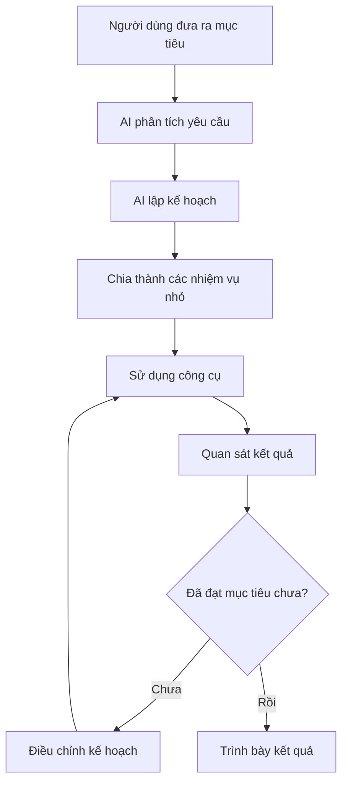

AI tác nhân không nhất thiết hoàn thành mọi việc chỉ trong một bước. Nó có thể lặp lại chu trình:

> Quan sát → suy luận → hành động → kiểm tra → điều chỉnh.

---

## 6.2. AI tác nhân khác gì với chatbot thông thường?

| Chatbot thông thường            | AI tác nhân                           |
| ------------------------------- | ------------------------------------- |
| Chủ yếu trả lời bằng văn bản    | Có thể thực hiện hành động            |
| Chờ từng câu hỏi của người dùng | Có thể tự chia nhiệm vụ               |
| Ít sử dụng công cụ bên ngoài    | Có thể dùng trình duyệt, tệp và API   |
| Không trực tiếp thay đổi dự án  | Có thể tạo hoặc chỉnh sửa tệp         |
| Thường hoàn thành một lượt      | Có thể thực hiện quy trình nhiều bước |
| Đưa ra hướng dẫn                | Có thể trực tiếp làm công việc        |

### Ví dụ

**Chatbot thông thường:**

> Đây là cách bạn có thể tìm khách sạn tại Tokyo.

**AI tác nhân:**

> Tôi sẽ mở trang đặt phòng, nhập địa điểm, chọn ngày, lọc theo ngân sách và đánh giá, sau đó tổng hợp ba lựa chọn tốt nhất.

---

## 6.3. Claude Chat

Claude Chat phù hợp với những nhiệm vụ như:

* Đặt câu hỏi.
* Giải thích kiến thức.
* Tóm tắt nội dung.
* Viết và chỉnh sửa văn bản.
* Phân tích ý tưởng.
* Lập kế hoạch.
* Trao đổi và phản biện.

Claude Chat là giao diện tương tác cơ bản giữa người dùng và Claude. Tuy nhiên, khi được kết hợp với công cụ, Claude có thể chuyển từ việc chỉ trò chuyện sang thực hiện hành động.

---

## 6.4. Claude Code

Claude Code được sử dụng trong các quy trình liên quan đến phát triển phần mềm.

Claude Code có thể hỗ trợ:

* Đọc cấu trúc dự án.
* Hiểu mã nguồn hiện có.
* Tạo tệp mới.
* Chỉnh sửa mã.
* Sửa lỗi.
* Viết kiểm thử.
* Chạy lệnh trong môi trường phát triển.
* Xây dựng giao diện.
* Tích hợp API.
* Tạo ứng dụng hoàn chỉnh.

### Quy trình làm việc điển hình

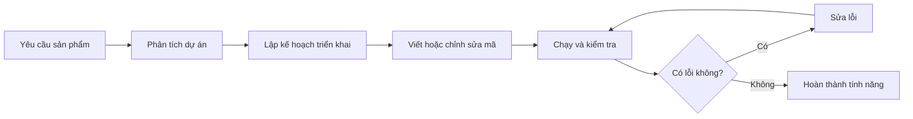

Điểm quan trọng là người dùng không nhất thiết phải viết từng dòng mã. Tuy nhiên, người dùng vẫn cần:

* Mô tả yêu cầu rõ ràng.
* Kiểm tra kết quả.
* Thử nghiệm ứng dụng.
* Đánh giá tính bảo mật.
* Xác minh mã trước khi triển khai.

---

## 6.5. Claude Cowork

Claude Cowork có thể được hiểu là một **môi trường thực thi công việc**, nơi Claude làm việc trực tiếp với tài liệu và thư mục của người dùng.

Claude Cowork có thể:

* Đọc nhiều tệp trong một thư mục.
* Phân tích PDF.
* Tìm kiếm thông tin trên Internet.
* Tạo tệp Excel.
* Tạo báo cáo.
* Xây dựng mô hình tài chính.
* Chạy phân tích độ nhạy.
* Tạo biểu đồ.
* Lưu kết quả trực tiếp vào thư mục làm việc.

### Luồng hoạt động

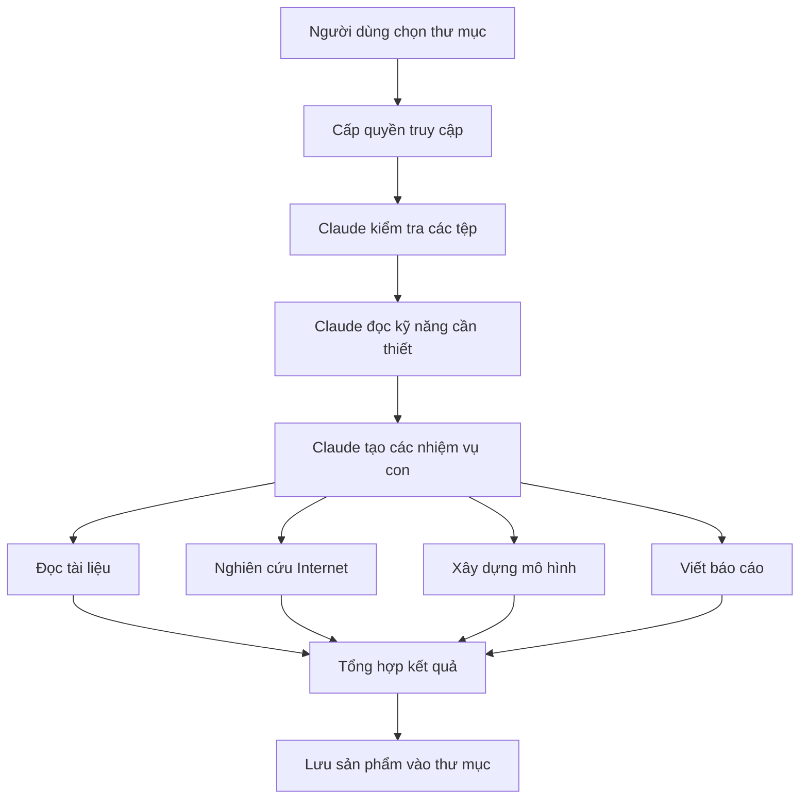

---

# 7. Các bản trình diễn trong bài học

## 7.1. Demo 1 – Tìm khách sạn tại Tokyo

### Yêu cầu mẫu

Người dùng yêu cầu Claude:

* Tìm ba khách sạn tốt nhất.
* Khu vực Shibuya, trung tâm Tokyo.
* Từ ngày 1 đến ngày 4 tháng 4.
* Ngân sách tối đa 300 USD mỗi đêm.
* Tìm kiếm trên Booking.com.
* Khách sạn từ bốn sao trở lên.
* Điểm đánh giá ít nhất 8/10.
* Xếp hạng kết quả theo giá trị nhận được.
* Không đặt câu hỏi bổ sung.
* Chỉ tìm và trình bày các lựa chọn tốt nhất.

### Những hành động AI thực hiện

Claude có thể:

1. Mở trình duyệt.
2. Truy cập trang đặt phòng.
3. Nhập địa điểm Shibuya.
4. Chọn ngày nhận và trả phòng.
5. Đặt giới hạn ngân sách.
6. Lọc khách sạn từ bốn sao.
7. Lọc điểm đánh giá từ 8/10.
8. Đọc các kết quả.
9. So sánh giá, vị trí và đánh giá.
10. Trình bày ba lựa chọn tốt nhất.

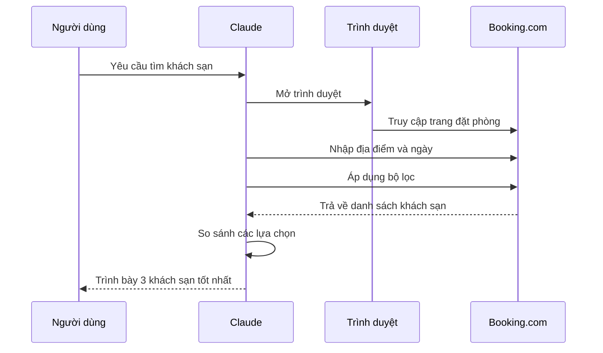

### Bài học rút ra

Demo này cho thấy AI có thể:

* Hiểu yêu cầu bằng ngôn ngữ tự nhiên.
* Điều khiển giao diện web.
* Thực hiện quy trình nhiều bước.
* Quan sát ảnh chụp màn hình.
* Tự tạo nhiệm vụ phụ.
* Tổng hợp kết quả theo tiêu chí của người dùng.

---

## 7.2. Cảnh báo khi cho AI thực hiện giao dịch

Giảng viên không khuyến khích cấp ngay thông tin thẻ tín dụng cho AI để tự động đặt khách sạn.

Nguyên nhân:

* Hệ thống AI vẫn đang trong quá trình thử nghiệm.
* AI có thể chọn sai dịch vụ hoặc sai ngày.
* Giá có thể thay đổi tại thời điểm thanh toán.
* Có thể phát sinh phí ẩn.
* Chính sách hủy phòng có thể không phù hợp.
* Việc cấp dữ liệu tài chính tạo ra rủi ro bảo mật.

### Nguyên tắc sử dụng an toàn

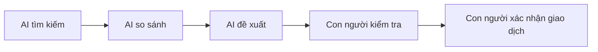

Nên để AI hỗ trợ ở các bước:

* Tìm kiếm.
* Lọc.
* Phân tích.
* So sánh.
* Chuẩn bị thông tin.

Con người nên trực tiếp xác nhận ở các bước:

* Thanh toán.
* Ký hợp đồng.
* Gửi dữ liệu nhạy cảm.
* Xóa dữ liệu quan trọng.
* Triển khai hệ thống lên môi trường thật.

---

## 7.3. Demo 2 – Nghiên cứu và xây dựng mô hình tài chính

Trong demo thứ hai, Claude Cowork được cấp quyền làm việc với một thư mục chứa báo cáo thị trường căn hộ dạng PDF.

### Mục tiêu

Claude được yêu cầu đóng vai trò như một:

> Chuyên viên phân tích tài chính bất động sản cấp tổ chức.

Claude phải:

* Đọc báo cáo thị trường căn hộ.
* Nghiên cứu thêm trên Internet.
* Xây dựng mô hình tài chính trong Excel.
* Tạo mô hình động.
* Chạy phân tích độ nhạy.
* Tạo biểu đồ.
* Viết báo cáo tổng hợp.

### Các nhiệm vụ con

Claude tự chia công việc thành nhiều nhiệm vụ:

1. Đọc kỹ năng xử lý PDF.
2. Đọc kỹ năng làm việc với Excel.
3. Phân tích báo cáo thị trường.
4. Tìm kiếm dữ liệu bổ sung.
5. Xây dựng các giả định.
6. Tạo mô hình tài chính.
7. Tính toán dòng tiền.
8. Chạy phân tích độ nhạy.
9. Tạo biểu đồ.
10. Viết báo cáo cuối cùng.

### Cấu trúc mô hình tài chính có thể bao gồm

| Trang tính  | Nội dung                     |
| ----------- | ---------------------------- |
| Assumptions | Các giả định đầu vào         |
| Market Data | Dữ liệu thị trường           |
| Acquisition | Giá mua và chi phí giao dịch |
| Financing   | Khoản vay và lãi suất        |
| Revenue     | Doanh thu dự kiến            |
| Expenses    | Chi phí vận hành             |
| Cash Flow   | Dòng tiền theo thời gian     |
| Returns     | IRR, NPV và lợi nhuận        |
| Sensitivity | Phân tích độ nhạy            |
| Charts      | Biểu đồ tài chính            |
| Summary     | Tóm tắt kết quả đầu tư       |

### Giá trị của demo

Demo thể hiện khả năng kết hợp nhiều công cụ trong cùng một quy trình:

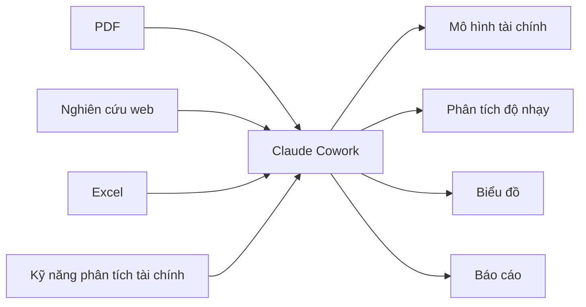

Đây là điểm khác biệt lớn giữa AI tác nhân và công cụ tạo văn bản đơn giản: AI có thể phối hợp nhiều nguồn dữ liệu và tạo ra một sản phẩm hoàn chỉnh.

---

## 7.4. Demo 3 – Tạo trang web và tờ quảng cáo

Claude Code có thể được sử dụng để tạo:

* Landing page.
* Trang giới thiệu sản phẩm.
* Tờ quảng cáo.
* Nội dung truyền thông.
* Giao diện phù hợp với nhận diện thương hiệu.
* Các thành phần giao diện tái sử dụng.

Người dùng có thể cấu hình cho AI:

* Giọng văn của thương hiệu.
* Màu sắc.
* Phong cách hình ảnh.
* Quy tắc typography.
* Khoảng cách và bố cục.
* Cấu trúc trang.
* Phong cách lời kêu gọi hành động.

### Quy trình tổng quát

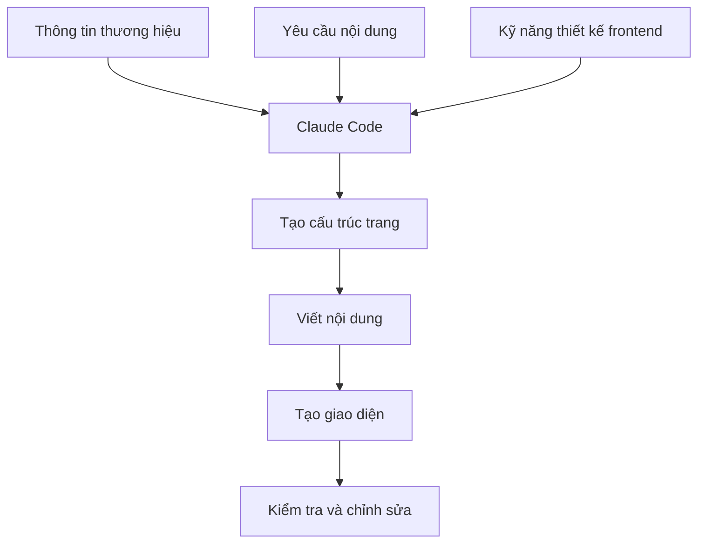

---

## 7.5. Demo 4 – Xây dựng ứng dụng theo dõi calo

Demo cuối giới thiệu một ứng dụng theo dõi lượng calo được xây dựng bằng Claude Code mà người hướng dẫn không cần tự viết từng dòng mã.

### Chức năng của ứng dụng

1. Người dùng tải ảnh món ăn lên.
2. Ứng dụng gửi ảnh đến API phân tích hình ảnh.
3. AI nhận diện các loại thực phẩm.
4. Hệ thống ước tính lượng calo.
5. Người dùng chọn các món muốn thêm.
6. Tổng lượng calo được cập nhật vào nhật ký.

### Ví dụ thực phẩm được nhận diện

* Cá hồi.
* Khoai tây non.
* Các món ăn hoặc thành phần khác xuất hiện trong ảnh.

### Luồng xử lý

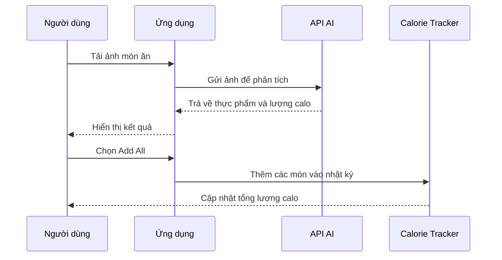

### Các thành phần kỹ thuật có thể có

* Giao diện tải ảnh.
* API nhận diện hình ảnh.
* Mô hình AI đa phương thức.
* Hệ thống ước tính lượng calo.
* Trạng thái ứng dụng.
* Nhật ký thực phẩm.
* Cơ sở dữ liệu hoặc bộ nhớ cục bộ.
* Màn hình thống kê.

---

# 8. Claude sử dụng “Skills” như thế nào?

Trong bài học, giảng viên đề cập đến khái niệm **skills**.

Skill có thể được hiểu là một tập hợp:

* Hướng dẫn.
* Quy trình.
* Quy tắc.
* Công cụ.
* Kiến thức chuyên môn.
* Tiêu chuẩn đầu ra.

Một skill giúp Claude biết cách xử lý một loại công việc cụ thể.

### Ví dụ

| Skill                    | Công dụng                          |
| ------------------------ | ---------------------------------- |
| PDF skill                | Đọc và trích xuất thông tin từ PDF |
| Excel skill              | Tạo bảng tính và công thức         |
| Financial modeling skill | Xây dựng mô hình tài chính         |
| Frontend design skill    | Tạo giao diện web                  |
| Research skill           | Tìm kiếm và tổng hợp nguồn         |
| Reporting skill          | Viết báo cáo chuyên nghiệp         |

### Mối quan hệ giữa Agent, Tool và Skill

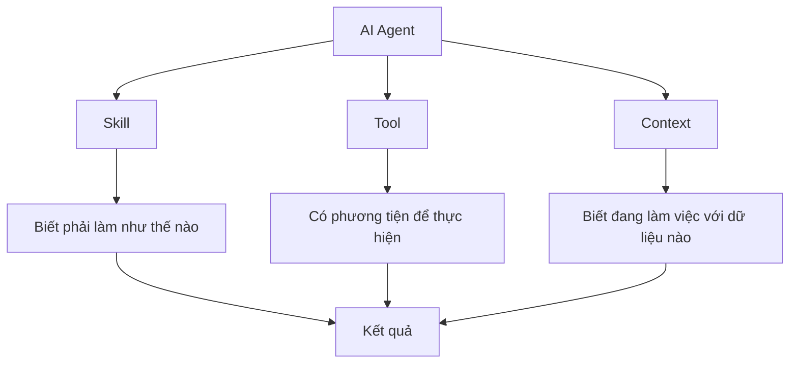

* **Agent** quyết định hành động.
* **Skill** hướng dẫn cách thực hiện.
* **Tool** cung cấp khả năng thực thi.
* **Context** cung cấp dữ liệu và mục tiêu.

---

# 9. Tư duy “Claude là đồng nghiệp kỹ thuật số”

Bài học muốn người học thay đổi cách nhìn về AI.

Thay vì suy nghĩ:

> Tôi sẽ hỏi Claude một câu hỏi.

Hãy suy nghĩ:

> Tôi có thể giao cho Claude một nhiệm vụ hoàn chỉnh như thế nào?

### Công thức giao việc

Một yêu cầu tốt thường bao gồm:

```text
Vai trò
+ Mục tiêu
+ Dữ liệu đầu vào
+ Các tiêu chí
+ Công cụ hoặc nguồn cần sử dụng
+ Định dạng đầu ra
+ Giới hạn
+ Điều kiện xác nhận
```

### Ví dụ

```text
Bạn là một chuyên viên phân tích tài chính bất động sản.

Hãy đọc báo cáo PDF trong thư mục này, nghiên cứu thêm dữ liệu thị
trường đáng tin cậy và xây dựng một mô hình tài chính Excel.

Mô hình phải bao gồm:
- Các giả định đầu vào.
- Doanh thu và chi phí.
- Dòng tiền.
- IRR và NPV.
- Phân tích độ nhạy.
- Biểu đồ.
- Trang tóm tắt.

Không tự tạo số liệu khi không có nguồn. Hãy ghi chú rõ mọi giả định.
```

---

# 10. Lợi ích của Claude Code và Claude Cowork

## 10.1. Tiết kiệm thời gian

AI có thể tự động hóa những công việc lặp lại như:

* Định dạng dữ liệu.
* Tạo bảng tính.
* Đọc nhiều tài liệu.
* Tổng hợp báo cáo.
* Viết mã mẫu.
* Tạo giao diện ban đầu.

## 10.2. Kết hợp nhiều công cụ

Claude có thể phối hợp:

* Trình duyệt.
* Tệp PDF.
* Tài liệu văn bản.
* Bảng tính.
* Mã nguồn.
* API.
* Thư mục dự án.

## 10.3. Hỗ trợ người không chuyên

Người dùng không cần phải thành thạo tất cả các công cụ kỹ thuật để tạo sản phẩm ban đầu.

Ví dụ:

* Người làm tài chính có thể tạo ứng dụng nội bộ.
* Người làm marketing có thể tạo landing page.
* Người quản lý có thể tạo bảng theo dõi.
* Người nghiên cứu có thể tổng hợp tài liệu.
* Người mới học lập trình có thể tạo nguyên mẫu ứng dụng.

## 10.4. Tăng khả năng thử nghiệm

AI giúp tạo nguyên mẫu nhanh hơn, từ đó người dùng có thể:

* Thử nhiều ý tưởng.
* So sánh nhiều phương án.
* Nhận phản hồi sớm.
* Giảm chi phí xây dựng phiên bản đầu tiên.

---

# 11. Hạn chế và rủi ro

Claude Code và Claude Cowork rất mạnh, nhưng không nên được xem là hoàn toàn chính xác.

## 11.1. AI có thể tạo thông tin sai

Claude có thể:

* Hiểu sai yêu cầu.
* Sử dụng giả định không phù hợp.
* Tạo số liệu không có nguồn.
* Viết công thức sai.
* Tạo mã có lỗi.
* Bỏ sót trường hợp đặc biệt.

## 11.2. Kết quả chính xác cao không đồng nghĩa với hoàn toàn đúng

Trong demo, giảng viên ước tính mô hình tài chính đạt khoảng 90–95% độ chính xác. Tuy nhiên, con số này chỉ là đánh giá của giảng viên đối với ví dụ cụ thể, không phải bảo đảm chung cho mọi mô hình do AI tạo ra.

Các kết quả tài chính vẫn cần được kiểm tra bởi:

* Chuyên viên phân tích.
* Kế toán.
* Kiểm toán viên.
* Chuyên gia đầu tư.
* Người hiểu bối cảnh của dự án.

## 11.3. Rủi ro bảo mật

Cần thận trọng khi cấp quyền truy cập vào:

* Thông tin thẻ tín dụng.
* Tài khoản ngân hàng.
* Mật khẩu.
* Khóa API.
* Dữ liệu khách hàng.
* Hồ sơ y tế.
* Dữ liệu tài chính nội bộ.
* Mã nguồn bí mật.
* Tài liệu doanh nghiệp.

## 11.4. Rủi ro khi cấp quyền ghi tệp

AI có thể:

* Ghi đè tệp.
* Xóa nhầm dữ liệu.
* Thay đổi cấu trúc dự án.
* Chỉnh sửa nhiều tệp ngoài phạm vi mong muốn.
* Tạo nội dung không tương thích.

### Biện pháp phòng tránh

* Sao lưu dữ liệu trước khi thực hiện.
* Dùng Git cho dự án mã nguồn.
* Làm việc trên nhánh riêng.
* Giới hạn thư mục được truy cập.
* Kiểm tra danh sách thay đổi.
* Không tự động triển khai ngay lên production.
* Yêu cầu AI trình bày kế hoạch trước khi chỉnh sửa lớn.

---

# 12. Mô hình kiểm soát “Human in the Loop”

Một quy trình an toàn nên luôn có sự giám sát của con người.

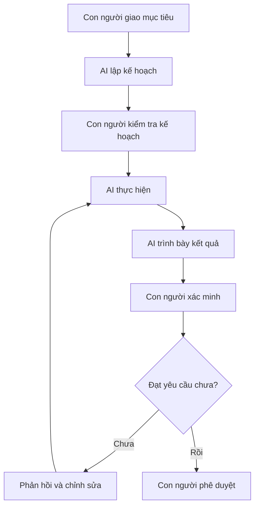

Con người chịu trách nhiệm cuối cùng đối với:

* Quyết định tài chính.
* Giao dịch.
* Nội dung pháp lý.
* Dữ liệu nhạy cảm.
* Kết quả triển khai.
* Chất lượng sản phẩm.

---

# 13. Quy trình thực hành đề xuất

## Bước 1: Chọn một nhiệm vụ nhỏ

Ví dụ:

* Đọc một báo cáo PDF.
* Tạo bảng tóm tắt.
* Tạo một trang web đơn giản.
* Phân tích một thư mục dữ liệu.
* Viết một công cụ nhỏ.

## Bước 2: Chuẩn bị dữ liệu

* Đặt các tệp cần thiết vào một thư mục riêng.
* Xóa hoặc ẩn thông tin nhạy cảm.
* Đặt tên tệp rõ ràng.
* Chuẩn bị mô tả yêu cầu.

## Bước 3: Viết yêu cầu có cấu trúc

Nêu rõ:

* Claude đang đóng vai trò gì.
* Mục tiêu cần đạt.
* Các tệp cần sử dụng.
* Những nhiệm vụ phải thực hiện.
* Định dạng đầu ra.
* Tiêu chí chất lượng.
* Những hành động không được phép thực hiện.

## Bước 4: Yêu cầu lập kế hoạch

Trước một nhiệm vụ lớn, có thể yêu cầu:

```text
Hãy kiểm tra các tệp và trình bày kế hoạch thực hiện trước.
Chưa chỉnh sửa hoặc tạo tệp cho đến khi kế hoạch hoàn thành.
```

## Bước 5: Theo dõi nhiệm vụ con

Kiểm tra xem Claude có:

* Đọc đúng tệp không.
* Sử dụng đúng công cụ không.
* Tạo đúng nhiệm vụ con không.
* Hoạt động ngoài phạm vi không.

## Bước 6: Xác minh đầu ra

* Kiểm tra số liệu.
* Kiểm tra công thức.
* Chạy thử mã nguồn.
* Kiểm tra liên kết.
* Đọc báo cáo.
* So sánh với dữ liệu gốc.

---

# 14. Ví dụ ứng dụng thực tế

| Lĩnh vực      | Ứng dụng                          |
| ------------- | --------------------------------- |
| Du lịch       | Tìm và so sánh khách sạn          |
| Tài chính     | Xây dựng mô hình dòng tiền        |
| Bất động sản  | Phân tích báo cáo thị trường      |
| Marketing     | Tạo landing page và tờ quảng cáo  |
| Phần mềm      | Xây dựng ứng dụng từ yêu cầu      |
| Giáo dục      | Tạo tài liệu và bài tập           |
| Nghiên cứu    | Đọc PDF và tổng hợp nguồn         |
| Kinh doanh    | Tạo báo cáo và bảng điều khiển    |
| Dữ liệu       | Làm sạch và phân tích dữ liệu     |
| Quản lý dự án | Tạo kế hoạch và theo dõi nhiệm vụ |

---

# 15. Kiến thức cần ghi nhớ

## Agentic AI không chỉ là chat

AI tác nhân có thể sử dụng công cụ và thực hiện chuỗi hành động để đạt được mục tiêu.

## Claude Cowork là môi trường thực thi nhiệm vụ

Claude Cowork cho phép Claude làm việc với tài liệu, thư mục và các sản phẩm văn phòng.

## Claude Code hỗ trợ phát triển phần mềm

Claude Code có thể đọc dự án, chỉnh sửa mã, chạy kiểm thử và xây dựng ứng dụng.

## Yêu cầu rõ ràng quyết định chất lượng đầu ra

Claude cần được cung cấp:

* Bối cảnh.
* Vai trò.
* Mục tiêu.
* Ràng buộc.
* Định dạng kết quả.
* Tiêu chí đánh giá.

## Con người vẫn phải kiểm tra

AI có thể làm nhanh nhưng không phải lúc nào cũng đúng. Những hành động quan trọng cần được con người xác minh và phê duyệt.

---

# 16. Sơ đồ tổng kết bài học

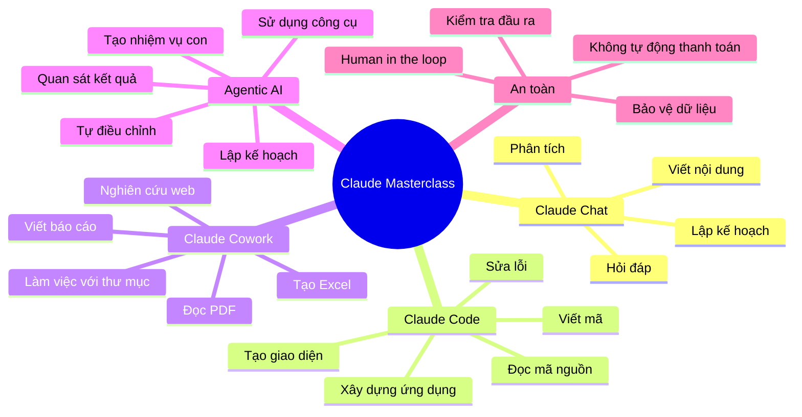

---

# 17. Câu hỏi ôn tập

## 17.1. Câu hỏi tự luận

1. Agentic AI khác chatbot thông thường ở điểm nào?
2. Claude Cowork có thể làm việc với những loại tệp và công cụ nào?
3. Claude Code có vai trò gì trong phát triển phần mềm?
4. Tại sao AI cần chia một công việc lớn thành các nhiệm vụ nhỏ?
5. Trong demo tìm khách sạn, Claude đã thực hiện những bước nào?
6. Vì sao không nên cấp ngay thông tin thẻ tín dụng cho AI?
7. Claude đã kết hợp những công cụ nào để xây dựng mô hình tài chính?
8. Skill đóng vai trò gì trong hoạt động của AI tác nhân?
9. Tại sao người dùng vẫn phải kiểm tra mô hình tài chính do AI tạo?
10. “Claude là đồng nghiệp kỹ thuật số” có ý nghĩa như thế nào?

---

## 17.2. Câu hỏi trắc nghiệm

### Câu 1

Điểm khác biệt chính của Agentic AI là gì?

A. Chỉ trả lời bằng văn bản
B. Có thể tự lập kế hoạch và sử dụng công cụ
C. Không cần dữ liệu đầu vào
D. Luôn đưa ra kết quả chính xác

**Đáp án: B**

### Câu 2

Claude Cowork phù hợp nhất với nhiệm vụ nào?

A. Chỉ dịch một từ
B. Đọc PDF, nghiên cứu và tạo mô hình Excel
C. Chỉ phát video
D. Chỉ tạo mật khẩu

**Đáp án: B**

### Câu 3

Trong demo tìm khách sạn, tiêu chí đánh giá tối thiểu là bao nhiêu?

A. 5/10
B. 6/10
C. 7/10
D. 8/10

**Đáp án: D**

### Câu 4

Claude Code chủ yếu được sử dụng cho mục đích nào?

A. Phát triển phần mềm
B. Đặt vé máy bay
C. Chỉnh sửa video chuyên nghiệp
D. Thực hiện thanh toán ngân hàng

**Đáp án: A**

### Câu 5

Hành động nào nên được con người xác nhận trực tiếp?

A. Tóm tắt một đoạn văn
B. Sắp xếp tiêu đề
C. Thanh toán bằng thẻ tín dụng
D. Tạo danh sách nhiệm vụ

**Đáp án: C**

---

## 17.3. Câu hỏi đúng hoặc sai

1. Agentic AI chỉ có thể trả lời bằng văn bản.
   **Sai**

2. Claude Cowork có thể làm việc trực tiếp với tệp và thư mục.
   **Đúng**

3. Kết quả do Claude tạo ra luôn chính xác tuyệt đối.
   **Sai**

4. Claude Code có thể hỗ trợ xây dựng ứng dụng.
   **Đúng**

5. Người dùng nên cấp toàn bộ thông tin tài chính cho AI ngay từ đầu.
   **Sai**

6. Một AI agent có thể tự chia nhiệm vụ lớn thành nhiều nhiệm vụ nhỏ.
   **Đúng**

7. Mô hình tài chính do AI tạo không cần được kiểm tra.
   **Sai**

8. Skills giúp Claude biết cách thực hiện một loại nhiệm vụ cụ thể.
   **Đúng**

---

# 18. Bài tập thực hành

## Bài tập 1 – Phân tích tài liệu

Chuẩn bị một tệp PDF và yêu cầu Claude:

* Tóm tắt nội dung chính.
* Trích xuất số liệu quan trọng.
* Tạo bảng tổng hợp.
* Ghi rõ thông tin nào chưa chắc chắn.

## Bài tập 2 – Tạo bảng tính

Yêu cầu Claude tạo một bảng Excel quản lý chi tiêu gồm:

* Ngày.
* Danh mục.
* Nội dung.
* Số tiền.
* Tổng chi theo tháng.
* Biểu đồ chi tiêu.
* Cảnh báo khi vượt ngân sách.

## Bài tập 3 – Xây dựng ứng dụng nhỏ

Sử dụng Claude Code để tạo ứng dụng:

* Theo dõi thói quen.
* Quản lý công việc.
* Tính lượng calo.
* Ghi chú học tập.
* Theo dõi tiến độ khóa học.

## Bài tập 4 – Đánh giá rủi ro

Chọn một nhiệm vụ AI có thể thực hiện và trả lời:

1. AI cần quyền truy cập nào?
2. Dữ liệu nhạy cảm nào có thể bị lộ?
3. Hành động nào cần con người xác nhận?
4. Cần sao lưu những dữ liệu nào?
5. Tiêu chí nào dùng để kiểm tra kết quả?

---

# 19. Tóm tắt bài học

Bài học giới thiệu sức mạnh của **Claude Chat, Claude Code và Claude Cowork** trong thời đại AI tác nhân.

Claude không chỉ có khả năng trả lời câu hỏi mà còn có thể:

* Hiểu mục tiêu bằng ngôn ngữ tự nhiên.
* Tự lập kế hoạch.
* Chia công việc thành nhiệm vụ nhỏ.
* Sử dụng trình duyệt và các công cụ khác.
* Đọc PDF.
* Nghiên cứu thông tin.
* Tạo bảng tính và mô hình tài chính.
* Xây dựng trang web.
* Tạo ứng dụng hoàn chỉnh.
* Làm việc trực tiếp trong thư mục dự án.

Thông điệp quan trọng nhất của bài học là:

> Hãy xem Claude như một đồng nghiệp kỹ thuật số có khả năng hỗ trợ thực hiện công việc, thay vì chỉ xem Claude là một chatbot trả lời câu hỏi.

Tuy nhiên, AI vẫn có thể mắc lỗi. Vì vậy, người dùng phải kiểm tra kết quả, bảo vệ dữ liệu nhạy cảm và giữ quyền xác nhận cuối cùng đối với các hành động quan trọng.

---

# Bài luyện tập

## Mục tiêu


## Đề bài


## Yêu cầu hoàn thành

- [ ] 
- [ ] 
- [ ] 

## Kết quả / lời giải


## Ghi chú
