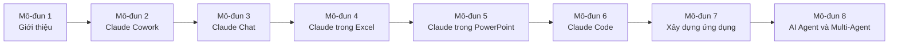
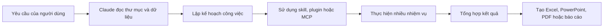
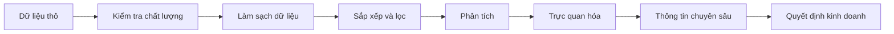
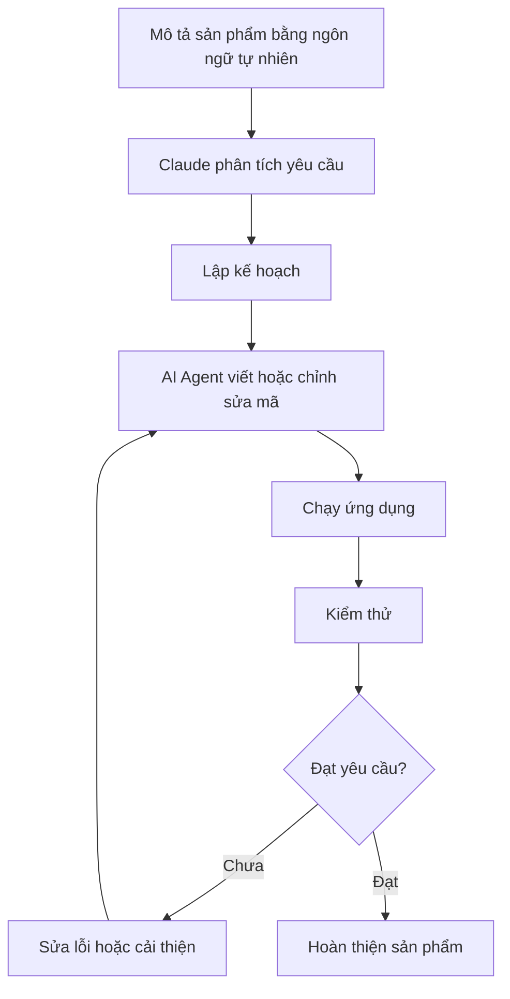
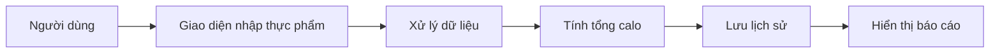
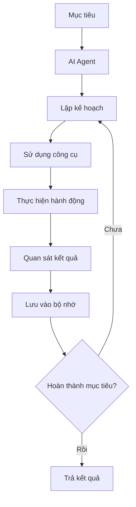
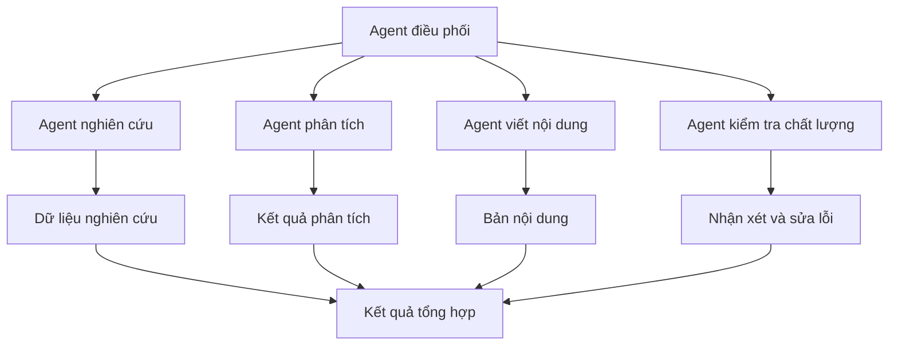
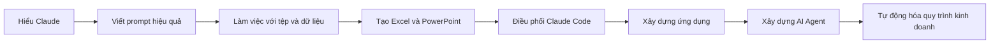

# 002 — Tổng quan lộ trình Claude Masterclass

## 1. Thông tin bài học

| Nội dung            | Chi tiết                                                                                                          |
| ------------------- | ----------------------------------------------------------------------------------------------------------------- |
| **Phần**            | Giới thiệu Masterclass, bí quyết học tập và thông điệp chào mừng                                                  |
| **Chủ đề**          | Tổng quan toàn bộ khóa học Claude Masterclass                                                                     |
| **Trọng tâm**       | Hiểu cấu trúc khóa học và mối liên hệ giữa Claude Cowork, Claude Chat, Claude Code, Excel, PowerPoint và AI Agent |
| **Phương pháp học** | Học thông qua thực hành và xây dựng sản phẩm cụ thể                                                               |

---

## 2. Ý tưởng chính

Bài học giới thiệu **bản đồ tổng thể của khóa Claude Masterclass**.

Khóa học được xây dựng theo trình tự tăng dần:

1. Làm quen với Claude và phương pháp học.
2. Sử dụng Claude Cowork để làm việc với tệp và thư mục.
3. Thành thạo Claude Chat và kỹ thuật viết prompt.
4. Ứng dụng Claude trong Excel.
5. Ứng dụng Claude trong PowerPoint.
6. Sử dụng Claude Code để xây dựng giao diện và phần mềm.
7. Xây dựng ứng dụng hoàn chỉnh.
8. Xây dựng hệ thống AI Agent và Multi-Agent.

Các kỹ năng ở mô-đun đầu sẽ tiếp tục được sử dụng và mở rộng trong những mô-đun sau.

---

## 3. Mục tiêu học tập

Sau khi hoàn thành bài học, học viên có thể:

* Hiểu cấu trúc của toàn bộ khóa Claude Masterclass.
* Xác định mục tiêu và sản phẩm đầu ra của từng mô-đun.
* Hiểu cách các mô-đun phụ thuộc và bổ trợ cho nhau.
* Nhận biết sự khác nhau giữa Claude Cowork, Claude Chat và Claude Code.
* Hiểu vai trò của plugin, skill và Model Context Protocol.
* Hình dung lộ trình từ sử dụng Claude cơ bản đến xây dựng AI Agent.
* Lập kế hoạch học tập và thực hành phù hợp.

---

# 4. Bản đồ tổng thể khóa học



Lộ trình này có thể được chia thành bốn giai đoạn chính:

```text
Giai đoạn 1: Làm quen
    └── Mô-đun 1

Giai đoạn 2: Sử dụng Claude trong công việc
    ├── Mô-đun 2: Claude Cowork
    ├── Mô-đun 3: Claude Chat
    ├── Mô-đun 4: Excel
    └── Mô-đun 5: PowerPoint

Giai đoạn 3: Xây dựng sản phẩm
    ├── Mô-đun 6: Claude Code
    └── Mô-đun 7: Xây dựng ứng dụng

Giai đoạn 4: Tự động hóa nâng cao
    └── Mô-đun 8: AI Agent và Multi-Agent
```

---

# 5. Nội dung chi tiết từng mô-đun

## Mô-đun 1 — Giới thiệu Claude Masterclass

### Nội dung chính

Mô-đun đầu tiên giúp học viên:

* Làm quen với cấu trúc khóa học.
* Nắm được các bí quyết để học hiệu quả.
* Hiểu cách tiếp cận Claude trong công việc thực tế.
* Xem các bản trình diễn nhanh về Claude Code và Claude Cowork.

### Mục tiêu

Học viên xây dựng được một **bản đồ tư duy tổng thể** trước khi bắt đầu các nội dung chuyên sâu.

### Sản phẩm đầu ra

* Kế hoạch học tập cá nhân.
* Danh sách mục tiêu cần đạt.
* Hiểu sơ bộ về Claude Cowork và Claude Code.

---

## Mô-đun 2 — Claude Cowork

Claude Cowork tập trung vào việc sử dụng Claude để làm việc trực tiếp với các tệp và thư mục trên máy tính.

### Nội dung chính

Học viên sẽ học cách:

* Cấp quyền cho Claude làm việc với thư mục.
* Tạo và chỉnh sửa bảng tính Excel.
* Xây dựng bài thuyết trình PowerPoint.
* Thực hiện nghiên cứu chuyên sâu.
* Tạo báo cáo và tài liệu PDF.
* Thực hiện nhiều nhiệm vụ đồng thời.
* Kết hợp kết quả từ nhiều tác vụ khác nhau.

### Skill, plugin và MCP

Mô-đun này giới thiệu ba khái niệm quan trọng:

#### Claude Skill

Skill là một tập hợp hướng dẫn hoặc khả năng chuyên biệt giúp Claude thực hiện một nhóm công việc cụ thể.

Ví dụ:

* Thiết kế giao diện.
* Phân tích tài chính.
* Tạo báo cáo.
* Nghiên cứu thị trường.

#### Plugin

Plugin mở rộng khả năng của Claude cho một lĩnh vực hoặc quy trình cụ thể.

Một số nhóm plugin có thể bao gồm:

* Tài chính.
* Marketing.
* Pháp lý.
* Phân tích dữ liệu.
* Phát triển phần mềm.

Học viên không chỉ sử dụng plugin có sẵn mà còn học cách tạo plugin riêng.

#### Model Context Protocol — MCP

MCP là giao thức giúp mô hình AI kết nối với:

* Công cụ bên ngoài.
* Hệ thống dữ liệu.
* Tệp tin.
* API.
* Ứng dụng doanh nghiệp.

### Dự án thực hành

* Tạo bảng tính Excel.
* Tạo bài thuyết trình PowerPoint.
* Thực hiện nghiên cứu chuyên sâu.
* Xây dựng mô hình dự báo tài chính.
* Tạo plugin tùy chỉnh.
* Kết hợp nhiều AI Agent để tạo báo cáo, PowerPoint và PDF.

### Quy trình Claude Cowork



---

## Mô-đun 3 — Claude Chat

Mô-đun này tập trung vào việc tương tác trực tiếp với Claude thông qua hội thoại.

### Nội dung chính

Học viên sẽ học:

* Kỹ thuật Prompt Engineering.
* Cách mô tả yêu cầu rõ ràng.
* Cách cung cấp bối cảnh.
* Cách xác định vai trò cho AI.
* Cách quy định định dạng đầu ra.
* Cách cải thiện prompt qua nhiều vòng phản hồi.

### Các ứng dụng chính

Claude Chat có thể được sử dụng cho:

* Sáng tạo nội dung.
* Sinh mã nguồn.
* Học chủ đề mới.
* Phân tích hình ảnh.
* Giải quyết vấn đề.
* Viết và chỉnh sửa tài liệu.
* Lập kế hoạch dự án.
* Hỗ trợ quá trình học lập trình.

### Claude như một đối tác lập kế hoạch

Thay vì chỉ đặt câu hỏi đơn lẻ, học viên sẽ sử dụng Claude như một **planning partner** — đối tác hỗ trợ lập kế hoạch.

Claude có thể hỗ trợ:

* Chia mục tiêu lớn thành nhiệm vụ nhỏ.
* Xác định thứ tự ưu tiên.
* Phát hiện rủi ro.
* Đề xuất phương án thực hiện.
* Kiểm tra tiến độ.
* Điều chỉnh kế hoạch.

### Cấu trúc prompt cơ bản

```text
Vai trò
  ↓
Bối cảnh
  ↓
Nhiệm vụ
  ↓
Yêu cầu và ràng buộc
  ↓
Định dạng kết quả
  ↓
Tiêu chí đánh giá
```

Ví dụ:

```markdown
Bạn là một chuyên gia phân tích dữ liệu.

Bối cảnh:
Tôi có một bảng dữ liệu bán hàng gồm doanh thu, khu vực và thời gian.

Nhiệm vụ:
Phân tích xu hướng doanh thu và xác định các khu vực hoạt động tốt nhất.

Yêu cầu:
- Nêu ba phát hiện quan trọng.
- Chỉ ra dữ liệu bất thường.
- Đề xuất hành động kinh doanh.

Định dạng:
Trình bày bằng bảng Markdown và phần kết luận ngắn.
```

---

## Mô-đun 4 — Claude trong Excel

Mô-đun này hướng dẫn cách tích hợp và sử dụng Claude trong quy trình phân tích dữ liệu bằng Excel.

### Nội dung chính

Học viên sẽ học cách:

* Thiết lập Claude trong Excel.
* Phân tích bảng dữ liệu.
* Tạo thông tin chuyên sâu từ dữ liệu.
* Sắp xếp và lọc dữ liệu.
* Xử lý dữ liệu bị thiếu.
* Phát hiện điểm bất thường.
* Tạo biểu đồ và trực quan hóa dữ liệu.
* Xây dựng các mô hình tài chính nâng cao.

### Quy trình phân tích dữ liệu



### Dự án thực hành

* Làm sạch bảng dữ liệu.
* Xử lý ô trống và giá trị thiếu.
* Tạo công thức Excel.
* Tạo báo cáo doanh thu.
* Phân tích xu hướng.
* Xây dựng mô hình dự báo tài chính.
* Tạo dashboard trực quan.

---

## Mô-đun 5 — Claude trong PowerPoint

Mô-đun này tập trung vào việc sử dụng Claude để xây dựng và chỉnh sửa bài thuyết trình.

### Nội dung chính

Học viên sẽ học cách:

* Tạo bài thuyết trình mới.
* Xây dựng cấu trúc slide.
* Viết và chỉnh sửa tiêu đề.
* Tóm tắt nội dung dài thành slide.
* Thêm hình ảnh.
* Tạo ý tưởng trình bày.
* Chỉnh sửa bài thuyết trình có sẵn.
* Tóm tắt một tệp PowerPoint hoàn chỉnh.

### So sánh các công cụ

Khóa học sẽ so sánh khả năng tạo bài thuyết trình của:

| Công cụ               | Trọng tâm                                          |
| --------------------- | -------------------------------------------------- |
| **Claude**            | Phân tích nội dung, cấu trúc và khả năng tùy chỉnh |
| **Microsoft Copilot** | Tích hợp chặt chẽ với hệ sinh thái Microsoft 365   |
| **NotebookLM**        | Tổng hợp và trình bày nội dung từ nguồn tài liệu   |

Việc so sánh giúp học viên hiểu:

* Điểm mạnh của từng công cụ.
* Hạn chế của từng công cụ.
* Công cụ nào phù hợp với từng tình huống.
* Khi nào nên kết hợp nhiều công cụ.

### Quy trình tạo PowerPoint

```text
Chủ đề
   ↓
Nghiên cứu nội dung
   ↓
Xây dựng câu chuyện
   ↓
Tạo dàn ý slide
   ↓
Viết nội dung
   ↓
Thêm biểu đồ và hình ảnh
   ↓
Kiểm tra tính nhất quán
   ↓
Hoàn thiện bài thuyết trình
```

---

## Mô-đun 6 — Nền tảng Claude Code

Đây là một trong những mô-đun quan trọng nhất của khóa học.

Mặc dù tên là Claude Code, học viên không nhất thiết phải có kinh nghiệm lập trình trước đó.

### Tư duy quan trọng

Người học không cần tự viết toàn bộ mã nguồn. Thay vào đó, người học sẽ:

* Mô tả yêu cầu bằng ngôn ngữ tự nhiên.
* Giao nhiệm vụ cho AI Agent.
* Kiểm tra kế hoạch.
* Theo dõi các thay đổi.
* Chạy và kiểm thử sản phẩm.
* Yêu cầu AI sửa lỗi hoặc cải thiện thiết kế.

Vai trò của người học chuyển từ:

```text
Người trực tiếp viết từng dòng mã
```

sang:

```text
Người quản lý và điều phối một nhóm AI Agent viết mã
```

### Các chế độ làm việc

Học viên sẽ tìm hiểu sự khác nhau giữa:

#### Plan Mode

Claude phân tích yêu cầu và lập kế hoạch trước khi chỉnh sửa mã nguồn.

Phù hợp khi:

* Dự án lớn.
* Yêu cầu chưa rõ ràng.
* Có nhiều tệp liên quan.
* Thay đổi có nguy cơ ảnh hưởng hệ thống.

#### Normal Mode

Claude thực hiện công việc theo từng yêu cầu và có sự kiểm soát của người dùng.

Phù hợp khi:

* Sửa lỗi nhỏ.
* Thay đổi một thành phần.
* Cần xem xét từng bước.

#### Auto-Accept Mode

Claude có thể tự động chấp nhận và thực hiện nhiều thay đổi.

Phù hợp khi:

* Nhiệm vụ đã rõ ràng.
* Dự án thử nghiệm.
* Người dùng hiểu phạm vi thay đổi.

Cần thận trọng khi sử dụng chế độ này trong dự án quan trọng.

### Dự án thực hành

* Tạo landing page.
* Cài đặt skill thiết kế giao diện.
* Cải thiện thiết kế bằng frontend design skill.
* Tạo slash command riêng.
* Chạy slash command có sẵn.
* Thực hiện code review.
* Phát triển tính năng.
* Thực hiện phân tích đối thủ cạnh tranh.
* Tạo chiến lược marketing bằng plugin.

### Một số plugin được giới thiệu

* Code Review.
* Feature Development.
* Ralph Wiggum.
* Plugin nghiên cứu đối thủ.
* Plugin xây dựng chiến lược marketing.

### Quy trình Claude Code



---

## Mô-đun 7 — Xây dựng ứng dụng bằng Claude Code

Mô-đun này đưa các kiến thức Claude Code vào một dự án hoàn chỉnh.

### Dự án chính

Học viên sẽ xây dựng một **ứng dụng theo dõi calo** mà không cần tự viết từng dòng mã.

### Các bước chính

1. Xác định yêu cầu của ứng dụng.
2. Lập danh sách tính năng.
3. Tạo giao diện.
4. Xây dựng chức năng nhập dữ liệu.
5. Tính toán lượng calo.
6. Hiển thị kết quả.
7. Kiểm thử ứng dụng.
8. Sửa lỗi.
9. Cải thiện trải nghiệm người dùng.
10. Nâng cấp thiết kế bằng frontend design skill.

### Kiến trúc đơn giản



### Kỹ năng đạt được

* Chuyển ý tưởng thành yêu cầu sản phẩm.
* Làm việc với Claude Code theo từng giai đoạn.
* Quản lý tác vụ phát triển phần mềm.
* Kiểm tra kết quả do AI tạo ra.
* Cải thiện giao diện và trải nghiệm người dùng.
* Xây dựng một sản phẩm hoạt động thực tế.

---

## Mô-đun 8 — Xây dựng AI Agent bằng Claude Code

Mô-đun cuối tập trung vào việc sử dụng Claude Code để tự động hóa các quy trình kinh doanh và xây dựng hệ thống AI Agent.

### AI Agent là gì?

AI Agent là một hệ thống có khả năng:

1. Nhận mục tiêu.
2. Phân tích nhiệm vụ.
3. Lập kế hoạch.
4. Sử dụng công cụ.
5. Thực hiện hành động.
6. Ghi nhớ thông tin.
7. Đánh giá kết quả.
8. Tiếp tục cho đến khi hoàn thành mục tiêu.

### Nội dung chính

Học viên sẽ học:

* Các framework xây dựng AI Agent.
* Agent sử dụng công cụ.
* Agent có bộ nhớ.
* Sub-agent.
* Multi-agent.
* Điều phối nhóm AI Agent.
* Tự động hóa quy trình kinh doanh.
* Xây dựng hệ thống agent mà không cần trực tiếp viết mã.

### Cấu trúc một AI Agent



### Hệ thống Multi-Agent

Trong hệ thống Multi-Agent, mỗi agent có thể đảm nhiệm một vai trò riêng.



### Ví dụ ứng dụng

Một nhóm agent có thể được sử dụng để:

* Nghiên cứu thị trường.
* Phân tích đối thủ cạnh tranh.
* Viết chiến lược marketing.
* Tạo bài thuyết trình.
* Kiểm tra tính chính xác.
* Xuất báo cáo PDF.

---

# 6. Sự phụ thuộc giữa các mô-đun

Các mô-đun không hoạt động độc lập hoàn toàn. Chúng được thiết kế để kế thừa kiến thức lẫn nhau.

| Mô-đun   | Kiến thức nền cần có       | Được sử dụng ở                       |
| -------- | -------------------------- | ------------------------------------ |
| Mô-đun 1 | Không yêu cầu              | Toàn bộ khóa học                     |
| Mô-đun 2 | Hiểu tổng quan Claude      | Excel, PowerPoint, nghiên cứu, Agent |
| Mô-đun 3 | Hiểu giao tiếp với Claude  | Tất cả các mô-đun phía sau           |
| Mô-đun 4 | Prompt và xử lý tệp        | Phân tích tài chính, báo cáo         |
| Mô-đun 5 | Prompt, nghiên cứu và tệp  | Báo cáo, thuyết trình của Agent      |
| Mô-đun 6 | Prompt Engineering         | Xây dựng ứng dụng và Agent           |
| Mô-đun 7 | Claude Code                | Dự án AI Agent nâng cao              |
| Mô-đun 8 | Claude Code, plugin và MCP | Tự động hóa quy trình thực tế        |

---

# 7. Tiến trình phát triển kỹ năng



Quá trình học có thể được hiểu theo bốn cấp độ:

| Cấp độ                         | Vai trò của học viên                                     |
| ------------------------------ | -------------------------------------------------------- |
| **1. Người sử dụng**           | Đặt câu hỏi và nhận câu trả lời                          |
| **2. Người cộng tác**          | Làm việc với Claude để tạo tài liệu và phân tích dữ liệu |
| **3. Người điều phối**         | Quản lý AI Agent để xây dựng phần mềm                    |
| **4. Người thiết kế hệ thống** | Xây dựng quy trình tự động hóa và hệ thống Multi-Agent   |

---

# 8. Sản phẩm đầu ra của khóa học

Khóa học không chỉ trình bày lý thuyết. Mỗi phần đều hướng đến một đầu ra cụ thể.

| Nhóm kỹ năng      | Sản phẩm đầu ra                                          |
| ----------------- | -------------------------------------------------------- |
| Claude Cowork     | Tệp, báo cáo nghiên cứu, Excel, PowerPoint, PDF          |
| Claude Chat       | Prompt, nội dung, kế hoạch, phân tích và lời giải        |
| Excel             | Bảng dữ liệu sạch, biểu đồ, dashboard, mô hình tài chính |
| PowerPoint        | Bài thuyết trình hoàn chỉnh                              |
| Claude Code       | Landing page, tính năng phần mềm, slash command          |
| Xây dựng ứng dụng | Ứng dụng theo dõi calo hoạt động được                    |
| AI Agent          | Agent có công cụ, bộ nhớ và khả năng phối hợp            |
| Multi-Agent       | Nhóm agent tự động thực hiện quy trình phức tạp          |

---

# 9. Phương pháp học hiệu quả

## 9.1. Học bằng cách thực hành

Không nên chỉ xem video. Sau mỗi bài, học viên cần tự xây dựng lại nội dung được trình diễn.

```text
Xem hướng dẫn
   ↓
Tự thực hiện lại
   ↓
Thay đổi yêu cầu
   ↓
Quan sát kết quả
   ↓
Phát hiện lỗi
   ↓
Cải thiện quy trình
```

## 9.2. Không sao chép prompt một cách máy móc

Học viên cần hiểu:

* Prompt đang giải quyết vấn đề gì?
* Claude cần bối cảnh nào?
* Đầu ra phải có định dạng gì?
* Làm sao kiểm tra kết quả?
* Làm sao áp dụng vào công việc thực tế?

## 9.3. Lưu lại sản phẩm thực hành

Nên tổ chức thư mục theo cấu trúc:

```text
claude-masterclass/
├── module-01-introduction/
├── module-02-cowork/
│   ├── excel/
│   ├── powerpoint/
│   ├── research/
│   └── plugins/
├── module-03-chat/
│   └── prompts/
├── module-04-excel/
├── module-05-powerpoint/
├── module-06-claude-code/
├── module-07-app-project/
└── module-08-ai-agents/
```

## 9.4. Luôn kiểm tra kết quả do AI tạo ra

AI có thể tạo nội dung không chính xác hoặc mã nguồn chưa tối ưu. Học viên cần:

* Kiểm tra dữ liệu.
* Chạy thử mã nguồn.
* Xác minh công thức.
* Đọc lại nội dung.
* Kiểm tra nguồn nghiên cứu.
* Đánh giá tính bảo mật.
* Xem xét các thay đổi trước khi áp dụng.

---

# 10. Những điểm cần lưu ý

## Claude không thay thế hoàn toàn con người

Claude có thể hỗ trợ thực hiện công việc nhanh hơn, nhưng người dùng vẫn cần chịu trách nhiệm về:

* Xác định mục tiêu.
* Đưa ra quyết định.
* Kiểm tra chất lượng.
* Xác minh thông tin.
* Quản lý rủi ro.
* Bảo vệ dữ liệu.

## Không nên bật tự động hoàn toàn ngay từ đầu

Khi sử dụng Claude Code hoặc AI Agent, nên bắt đầu với phạm vi nhỏ.

```text
Tác vụ nhỏ
   ↓
Kiểm tra kết quả
   ↓
Tăng mức tự động hóa
   ↓
Thêm công cụ
   ↓
Thêm bộ nhớ
   ↓
Chuyển sang Multi-Agent
```

## Cần chú ý quyền truy cập dữ liệu

Khi Claude được cấp quyền làm việc với thư mục, tệp, API hoặc dữ liệu doanh nghiệp, cần kiểm tra:

* Claude được phép truy cập thư mục nào?
* Có dữ liệu nhạy cảm hay không?
* Tệp nào được phép chỉnh sửa?
* Có cơ chế sao lưu hay không?
* Có cần phê duyệt trước khi thực hiện hành động hay không?

---

# 11. Vì sao bài học này quan trọng?

Một bản đồ khóa học rõ ràng giúp học viên:

* Không bị choáng ngợp bởi lượng kiến thức lớn.
* Biết kỹ năng nào cần học trước.
* Hiểu mục đích của từng mô-đun.
* Nhận thấy mối liên hệ giữa các công cụ.
* Có thể theo dõi tiến độ học tập.
* Biết sản phẩm nào cần hoàn thành.
* Chuyển kiến thức từ bài học sang công việc thực tế.

Bài học này đóng vai trò như một **bản đồ định hướng** cho toàn bộ Claude Masterclass.

---

# 12. Câu hỏi ôn tập

## Câu 1

Claude Masterclass được tổ chức theo nguyên tắc nào?

**Trả lời:** Các mô-đun được xây dựng tăng dần về độ phức tạp. Kiến thức ở mô-đun trước được sử dụng và mở rộng trong mô-đun sau.

## Câu 2

Claude Cowork khác Claude Chat như thế nào?

**Trả lời:** Claude Chat chủ yếu tập trung vào tương tác hội thoại, trong khi Claude Cowork có thể làm việc với tệp, thư mục và nhiều loại sản phẩm đầu ra như Excel, PowerPoint hoặc PDF.

## Câu 3

Claude Code có bắt buộc người học phải biết lập trình không?

**Trả lời:** Không bắt buộc. Người học có thể mô tả yêu cầu bằng ngôn ngữ tự nhiên và quản lý các AI Agent thực hiện công việc lập trình.

## Câu 4

Mô-đun nào tập trung vào xây dựng một ứng dụng hoàn chỉnh?

**Trả lời:** Mô-đun 7, với dự án xây dựng ứng dụng theo dõi calo.

## Câu 5

Mô-đun cuối cùng tập trung vào nội dung gì?

**Trả lời:** Xây dựng AI Agent, Sub-agent, Multi-Agent, agent có công cụ, bộ nhớ và khả năng tự động hóa quy trình.

## Câu 6

Vì sao Prompt Engineering là kỹ năng nền tảng?

**Trả lời:** Vì cách mô tả mục tiêu, bối cảnh, yêu cầu và định dạng đầu ra ảnh hưởng trực tiếp đến chất lượng kết quả trong hầu hết các mô-đun.

## Câu 7

Những đầu ra thực tế nào được tạo trong khóa học?

**Trả lời:** Bảng tính Excel, bài thuyết trình PowerPoint, báo cáo PDF, landing page, ứng dụng theo dõi calo và hệ thống AI Agent.

---

# 13. Bài tập thực hành

## Bài tập 1 — Lập kế hoạch học tập

Tạo bảng theo mẫu:

| Mô-đun | Mục tiêu cá nhân         | Sản phẩm cần hoàn thành | Trạng thái   |
| ------ | ------------------------ | ----------------------- | ------------ |
| 1      | Hiểu lộ trình khóa học   | Kế hoạch học tập        | Chưa bắt đầu |
| 2      | Thành thạo Claude Cowork | Báo cáo và bảng tính    | Chưa bắt đầu |
| 3      | Cải thiện prompt         | Thư viện prompt cá nhân | Chưa bắt đầu |
| 4      | Phân tích dữ liệu        | Dashboard Excel         | Chưa bắt đầu |
| 5      | Tạo slide chuyên nghiệp  | Bài thuyết trình        | Chưa bắt đầu |
| 6      | Làm quen Claude Code     | Landing page            | Chưa bắt đầu |
| 7      | Xây dựng ứng dụng        | Calorie Tracker         | Chưa bắt đầu |
| 8      | Xây dựng Agent           | Hệ thống Multi-Agent    | Chưa bắt đầu |

## Bài tập 2 — Xác định quy trình cá nhân

Chọn một công việc bạn thường xuyên thực hiện, chẳng hạn:

* Tổng hợp báo cáo.
* Phân tích dữ liệu.
* Viết nội dung.
* Tạo bài thuyết trình.
* Nghiên cứu đối thủ.
* Xây dựng website.

Sau đó xác định:

1. Công việc nào Claude Chat có thể hỗ trợ?
2. Công việc nào cần Claude Cowork?
3. Công việc nào cần Claude Code?
4. Có thể sử dụng plugin hoặc MCP ở đâu?
5. Phần nào có thể chuyển thành AI Agent?

---

# 14. Tóm tắt bài học

Claude Masterclass được thiết kế theo lộ trình từ cơ bản đến nâng cao:

```text
Giới thiệu
   ↓
Claude Cowork
   ↓
Claude Chat và Prompt Engineering
   ↓
Claude trong Excel
   ↓
Claude trong PowerPoint
   ↓
Claude Code
   ↓
Xây dựng ứng dụng
   ↓
AI Agent và Multi-Agent
```

Ba ý chính cần ghi nhớ:

1. **Các mô-đun có tính kế thừa:** kỹ năng học trước sẽ được tái sử dụng ở phần sau.
2. **Mỗi phần đều tạo ra sản phẩm thực tế:** không chỉ học lý thuyết mà còn xây dựng Excel, PowerPoint, ứng dụng và AI Agent.
3. **Học bằng cách thực hành:** học viên cần tự xây dựng lại các bản demo và điều chỉnh chúng cho phù hợp với công việc của mình.

Mục tiêu cuối cùng của khóa học không chỉ là biết cách trò chuyện với Claude, mà là có khả năng sử dụng Claude để:

* Phân tích dữ liệu.
* Tạo tài liệu.
* Xây dựng phần mềm.
* Điều phối AI Agent.
* Tự động hóa các quy trình công việc thực tế.

---

# Bài luyện tập

## Mục tiêu


## Đề bài


## Yêu cầu hoàn thành

- [ ] 
- [ ] 
- [ ] 

## Kết quả / lời giải


## Ghi chú
