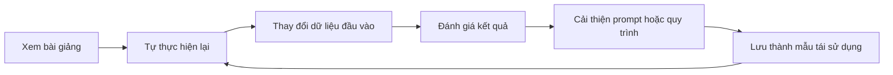
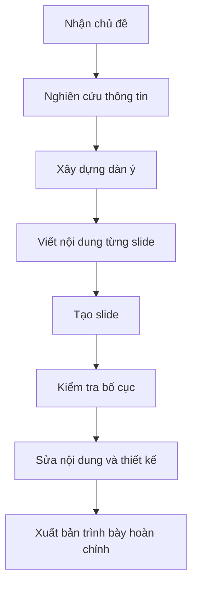
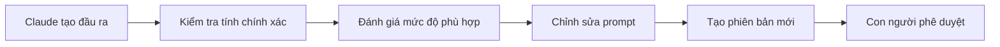
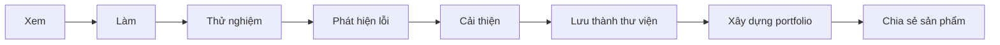

# 003 – Những bí quyết để học khóa Masterclass hiệu quả

## 1. Thông tin bài học

| Nội dung                  | Chi tiết                                                                                |
| ------------------------- | --------------------------------------------------------------------------------------- |
| **Phần học**              | Giới thiệu Masterclass, bí quyết thành công và lời chào                                 |
| **Chủ đề**                | Key Success Tips – Những bí quyết học tập hiệu quả                                      |
| **Mục tiêu chính**        | Biết cách tiếp cận khóa học để ghi nhớ kiến thức tốt hơn và tạo ra các sản phẩm thực tế |
| **Phương pháp trọng tâm** | Học chủ động, thực hành thường xuyên, xây dựng dự án và liên tục cải thiện kết quả      |

---

## 2. Ý tưởng chính

Để đạt được kết quả tốt trong khóa học, người học không nên chỉ xem video một cách thụ động.

Thay vào đó, hãy:

* Cài đặt và sử dụng các công cụ ngay khi học.
* Tự xây dựng lại từng nội dung minh họa.
* Hoàn thành các bài tập thực hành.
* So sánh kết quả của mình với kết quả của giảng viên.
* Xây dựng một thư viện prompt và câu lệnh cá nhân.
* Lưu lại những quy trình hiệu quả thành mẫu có thể tái sử dụng.
* Phát triển các dự án thành portfolio cá nhân.
* Chia sẻ sản phẩm để xây dựng thương hiệu nghề nghiệp.

---

## 3. Mục tiêu học tập

Sau khi hoàn thành bài học này, học viên có thể:

1. Phân biệt giữa **học chủ động** và **xem bài giảng thụ động**.
2. Biết cách xây dựng lại các demo bằng dữ liệu và tệp của riêng mình.
3. Tạo một thư viện cá nhân gồm prompt, câu lệnh và quy trình làm việc.
4. Chuyển các quy trình thành công thành template hoặc skill có thể tái sử dụng.
5. Tự đánh giá chất lượng đầu ra của Claude thay vì chấp nhận kết quả ngay lập tức.
6. Xây dựng portfolio từ các dự án trong khóa học.
7. Sử dụng LinkedIn để chia sẻ sản phẩm và phát triển thương hiệu cá nhân.
8. Điều chỉnh tốc độ và chất lượng video trên Udemy để phù hợp với khả năng học tập.

---

# 4. Các bí quyết thành công

## 4.1. Học bằng cách thực hành

Bí quyết quan trọng nhất là:

> **Learn by doing – Học bằng cách làm.**

Claude, AI Agent và các công cụ AI chỉ thực sự trở thành kỹ năng khi người học trực tiếp sử dụng chúng.

Không nên chỉ:

* Xem giảng viên thao tác.
* Ghi nhớ các nút bấm.
* Sao chép kết quả mà không hiểu quy trình.
* Chuyển sang bài tiếp theo khi chưa thử lại.

Nên thực hiện:

1. Cài đặt công cụ được giới thiệu.
2. Thực hiện lại demo ngay sau khi xem.
3. Sử dụng dữ liệu hoặc tệp của riêng mình.
4. Thử thay đổi yêu cầu đầu vào.
5. Quan sát cách Claude phản hồi.
6. Sửa prompt và chạy lại.
7. Ghi lại những gì hoạt động tốt.

### Chu trình học chủ động



---

## 4.2. Học chủ động và học thụ động

### Học thụ động

Học thụ động thường bao gồm:

* Chỉ xem video.
* Không cài đặt công cụ.
* Không làm lại demo.
* Không hoàn thành bài tập.
* Không kiểm tra xem mình có thực sự hiểu hay không.

Người học có thể cảm thấy nội dung rất dễ hiểu khi đang xem, nhưng lại không thể tự thực hiện khi bắt đầu làm việc độc lập.

### Học chủ động

Học chủ động yêu cầu người học:

* Dừng video để thực hành.
* Tự đặt câu hỏi.
* Thử nhiều cách giải quyết.
* Chấp nhận việc tạo ra kết quả chưa hoàn hảo.
* Phân tích lỗi.
* Điều chỉnh và thực hiện lại.

| Học thụ động                | Học chủ động                    |
| --------------------------- | ------------------------------- |
| Chỉ xem video               | Vừa xem vừa thực hành           |
| Dùng dữ liệu của giảng viên | Dùng dữ liệu của bản thân       |
| Chấp nhận kết quả đầu tiên  | Kiểm tra và cải thiện kết quả   |
| Ghi nhớ thao tác            | Hiểu nguyên tắc                 |
| Nhanh quên                  | Ghi nhớ lâu hơn                 |
| Khó áp dụng vào công việc   | Có khả năng chuyển giao kỹ năng |

---

## 4.3. Tự xây dựng lại từng demo

Sau mỗi demo, hãy cố gắng tái tạo lại kết quả mà không phụ thuộc hoàn toàn vào hướng dẫn.

Ví dụ, khi khóa học trình bày cách sử dụng Claude để tạo một landing page, người học có thể:

* Thay đổi tên sản phẩm.
* Sử dụng nội dung của doanh nghiệp riêng.
* Thay đổi đối tượng khách hàng.
* Thử một phong cách thiết kế khác.
* Bổ sung thêm các phần mới.
* Yêu cầu Claude sửa lỗi hoặc tối ưu mã nguồn.

Điều quan trọng không phải là tạo ra sản phẩm giống hệt giảng viên, mà là hiểu được:

* Vì sao prompt được viết như vậy?
* Claude đã xử lý yêu cầu theo cách nào?
* Đầu ra có thể được cải thiện ở đâu?
* Quy trình này có thể áp dụng vào công việc nào khác?

---

## 4.4. Hoàn thành các bài tập thực hành

Khóa học cung cấp nhiều cơ hội thực hành trong gần như tất cả các module.

Quy trình được khuyến nghị:

1. Đọc yêu cầu bài tập.
2. Tạm dừng video.
3. Tự giải quyết bài tập.
4. Ghi lại phương pháp đã sử dụng.
5. Xem lời giải của giảng viên.
6. So sánh hai kết quả.
7. Rút ra cách làm tốt hơn.

Không nên xem ngay lời giải khi chưa thử làm, vì điều đó làm giảm khả năng:

* Tư duy độc lập.
* Phân tích vấn đề.
* Viết prompt.
* Gỡ lỗi.
* Đánh giá chất lượng đầu ra.

---

## 4.5. Xây dựng thư viện prompt cá nhân

Trong quá trình học, hãy lưu lại những prompt tạo ra kết quả tốt.

Một thư viện prompt có thể được tổ chức như sau:

```text
prompt-library/
├── research/
│   ├── summarize-document.md
│   ├── compare-competitors.md
│   └── extract-key-insights.md
├── content/
│   ├── write-linkedin-post.md
│   ├── create-blog-outline.md
│   └── rewrite-professionally.md
├── coding/
│   ├── review-code.md
│   ├── debug-error.md
│   └── generate-feature.md
├── documents/
│   ├── analyze-excel.md
│   ├── create-presentation.md
│   └── write-report.md
└── agents/
    ├── task-planning.md
    ├── tool-selection.md
    └── workflow-automation.md
```

Mỗi prompt nên bao gồm:

* Mục đích sử dụng.
* Dữ liệu đầu vào cần cung cấp.
* Prompt hoàn chỉnh.
* Định dạng đầu ra mong muốn.
* Ví dụ kết quả tốt.
* Các lỗi thường gặp.
* Phiên bản đã cải tiến.

### Mẫu ghi chép prompt

```markdown
# Tên prompt

## Mục đích

Mô tả vấn đề mà prompt giải quyết.

## Dữ liệu đầu vào

- Loại tài liệu:
- Đối tượng người đọc:
- Mục tiêu:
- Giọng văn:

## Prompt

Nội dung prompt hoàn chỉnh.

## Kết quả mong muốn

Mô tả cấu trúc và chất lượng đầu ra.

## Điều chỉnh đã thử

- Phiên bản 1:
- Phiên bản 2:
- Phiên bản tốt nhất:
```

---

## 4.6. Lưu quy trình thành skill hoặc template

Một prompt đơn lẻ thường chỉ giải quyết một nhiệm vụ nhỏ. Khi nhiều prompt và thao tác được kết hợp với nhau, chúng tạo thành một quy trình làm việc.

Ví dụ, quy trình tạo bài thuyết trình có thể gồm:



Khi quy trình hoạt động tốt, hãy lưu nó thành:

* Checklist.
* Prompt template.
* Claude Skill.
* Hướng dẫn thao tác chuẩn.
* Tệp mẫu.
* Workflow tự động.
* Bộ câu lệnh có thể chạy lại.

Điều này giúp:

* Giảm thời gian thực hiện công việc lặp lại.
* Tăng tính nhất quán.
* Hạn chế bỏ sót bước.
* Dễ dàng chia sẻ cho đồng nghiệp.
* Có thể áp dụng cho nhiều dự án khác nhau.

---

## 4.7. So sánh kết quả của Claude với đánh giá cá nhân

Claude có thể tạo ra kết quả nhanh, nhưng đầu ra không phải lúc nào cũng chính xác hoặc phù hợp.

Người học không nên mặc định rằng:

> Claude tạo ra nội dung thì nội dung đó chắc chắn đúng.

Hãy kiểm tra:

### Độ chính xác

* Thông tin có đúng không?
* Có chi tiết nào được suy đoán hoặc bịa ra không?
* Số liệu có cần xác minh không?

### Mức độ phù hợp

* Nội dung có đúng đối tượng không?
* Có giải quyết đúng vấn đề không?
* Giọng văn có phù hợp không?

### Chất lượng

* Cấu trúc có rõ ràng không?
* Có nội dung lặp lại không?
* Có phần nào quá chung chung không?
* Kết quả có thể sử dụng ngay hay cần chỉnh sửa?

### Tính an toàn

* Có tiết lộ dữ liệu nhạy cảm không?
* Có đưa ra lời khuyên vượt quá phạm vi chuyên môn không?
* Có sử dụng tài liệu có bản quyền không phù hợp không?

### Quy trình đánh giá đầu ra



Claude nên được xem là một cộng sự hỗ trợ, không phải là người đưa ra quyết định cuối cùng.

---

## 4.8. Phát triển tư duy cải tiến liên tục

Kết quả đầu tiên hiếm khi là kết quả tốt nhất.

Một quy trình AI hiệu quả thường trải qua nhiều vòng cải tiến:

```text
Yêu cầu ban đầu
      ↓
Kết quả phiên bản 1
      ↓
Phân tích điểm chưa tốt
      ↓
Bổ sung ngữ cảnh và ràng buộc
      ↓
Kết quả phiên bản 2
      ↓
Đánh giá và chỉnh sửa
      ↓
Kết quả hoàn thiện
```

### Ví dụ

Prompt ban đầu:

```text
Hãy viết một bài đăng LinkedIn về AI.
```

Prompt cải tiến:

```text
Hãy viết một bài đăng LinkedIn bằng tiếng Việt dài khoảng
180–220 từ về cách AI Agent giúp nhân viên văn phòng giảm
các công việc lặp lại.

Đối tượng đọc là nhân viên công nghệ và quản lý sản phẩm.

Bài viết cần:
- Mở đầu bằng một vấn đề thực tế.
- Đưa ra ba lợi ích cụ thể.
- Có một ví dụ ngắn.
- Giọng văn chuyên nghiệp nhưng gần gũi.
- Kết thúc bằng một câu hỏi khuyến khích thảo luận.
```

Prompt thứ hai cung cấp:

* Bối cảnh rõ ràng.
* Đối tượng người đọc.
* Độ dài.
* Cấu trúc.
* Giọng văn.
* Yêu cầu đầu ra cụ thể.

Do đó, kết quả thường tốt và ổn định hơn.

---

# 5. Xây dựng portfolio dự án

Giảng viên khuyến nghị học viên phát triển một portfolio gồm các sản phẩm thực tế.

Các dự án trong khóa học có thể bao gồm:

* Ứng dụng AI.
* Landing page.
* Báo cáo phân tích.
* Bảng tính Excel.
* Bài thuyết trình.
* Công cụ tự động hóa.
* AI Agent.
* Workflow sử dụng Claude Code.
* Quy trình xử lý tài liệu bằng Claude Cowork.

## Vì sao portfolio quan trọng?

Nhà tuyển dụng thường quan tâm đến khả năng thực hiện công việc thực tế hơn là việc người học đã xem bao nhiêu giờ video.

Một portfolio tốt có thể chứng minh:

* Khả năng phân tích vấn đề.
* Kỹ năng sử dụng AI.
* Kỹ năng viết prompt.
* Khả năng xây dựng sản phẩm.
* Khả năng kiểm tra và cải thiện đầu ra.
* Khả năng trình bày kết quả.

## Cấu trúc một dự án portfolio

Mỗi dự án nên có:

```text
Tên dự án
├── Vấn đề cần giải quyết
├── Đối tượng sử dụng
├── Công cụ được sử dụng
├── Quy trình thực hiện
├── Prompt hoặc workflow chính
├── Hình ảnh hoặc video minh họa
├── Kết quả đạt được
├── Khó khăn và cách khắc phục
└── Hướng phát triển tiếp theo
```

Không nên chỉ đăng ảnh kết quả cuối cùng. Hãy trình bày cả quá trình tư duy và cách AI được sử dụng để giải quyết vấn đề.

---

# 6. Xây dựng thương hiệu cá nhân

Sau khi hoàn thành một dự án, hãy chia sẻ sản phẩm trên các nền tảng nghề nghiệp, đặc biệt là LinkedIn.

Nội dung chia sẻ có thể bao gồm:

* Vấn đề bạn muốn giải quyết.
* Công cụ AI đã sử dụng.
* Quy trình xây dựng sản phẩm.
* Những khó khăn đã gặp.
* Bài học rút ra.
* Hình ảnh hoặc video demo.
* Liên kết đến GitHub hoặc sản phẩm trực tuyến.

### Quy trình phát triển thương hiệu cá nhân


Khi chia sẻ đều đặn, người học có thể:

* Tăng khả năng được nhà tuyển dụng chú ý.
* Kết nối với những người cùng lĩnh vực.
* Nhận phản hồi từ cộng đồng.
* Chứng minh tiến trình học tập.
* Tạo uy tín trong lĩnh vực AI.

---

# 7. Sử dụng Udemy hiệu quả

## 7.1. Điều chỉnh tốc độ video

Udemy cho phép thay đổi tốc độ phát video.

Tùy vào mức độ quen thuộc với nội dung, người học có thể chọn:

| Tốc độ    | Trường hợp sử dụng                                 |
| --------- | -------------------------------------------------- |
| **0.75×** | Khi giảng viên nói nhanh hoặc nội dung khó         |
| **1×**    | Tốc độ tiêu chuẩn                                  |
| **1.25×** | Khi đã có kiến thức nền                            |
| **1.5×**  | Khi đang ôn tập hoặc nội dung tương đối quen thuộc |

Không nên luôn sử dụng tốc độ cao. Với những phần có nhiều thao tác kỹ thuật, nên giảm tốc độ hoặc tạm dừng để thực hành.

---

## 7.2. Điều chỉnh chất lượng video

Các video trong khóa học được ghi ở độ phân giải cao, tối đa khoảng **1080p**.

Udemy có thể tự động điều chỉnh độ phân giải dựa trên kết nối Internet.

Người học có thể:

1. Chọn biểu tượng bánh răng trong trình phát video.
2. Mở phần cài đặt chất lượng.
3. Chọn độ phân giải phù hợp.

Nên sử dụng chất lượng cao khi cần quan sát:

* Nội dung mã nguồn.
* Câu lệnh.
* Giao diện phần mềm.
* Văn bản nhỏ.
* Thao tác chi tiết trên màn hình.

---

# 8. Chứng chỉ hoàn thành khóa học

Sau khi hoàn thành đầy đủ các module, người học có thể nhận chứng chỉ hoàn thành của Udemy.

Chứng chỉ có thể được sử dụng để:

* Chia sẻ trên LinkedIn.
* Bổ sung vào hồ sơ cá nhân.
* Trình bày với nhà tuyển dụng hiện tại.
* Hỗ trợ hồ sơ xin việc.
* Ghi nhận quá trình học tập.

Tuy nhiên, chứng chỉ chỉ là một phần của kết quả khóa học.

Giá trị lớn hơn đến từ:

```text
Kiến thức
   +
Kỹ năng thực hành
   +
Dự án portfolio
   +
Khả năng giải quyết vấn đề
   +
Thương hiệu cá nhân
```

---

# 9. Kế hoạch hành động cho mỗi bài học

Sau mỗi bài giảng, người học có thể thực hiện checklist sau:

* [ ] Tôi đã hiểu mục tiêu chính của bài học.
* [ ] Tôi đã cài đặt hoặc mở công cụ cần thiết.
* [ ] Tôi đã thực hiện lại demo.
* [ ] Tôi đã sử dụng dữ liệu của riêng mình.
* [ ] Tôi đã hoàn thành bài tập thực hành.
* [ ] Tôi đã so sánh kết quả với giảng viên.
* [ ] Tôi đã kiểm tra chất lượng đầu ra của Claude.
* [ ] Tôi đã cải thiện prompt ít nhất một lần.
* [ ] Tôi đã lưu prompt hoặc workflow hiệu quả.
* [ ] Tôi đã ghi lại nội dung có thể đưa vào portfolio.

---

# 10. Công thức học tập được đề xuất

Có thể tóm tắt phương pháp học của bài này bằng công thức:

```text
Xem → Làm → Sai → Phân tích → Cải thiện → Lưu lại → Chia sẻ
```

Hoặc dưới dạng sơ đồ:



---

# 11. Những sai lầm cần tránh

## Chỉ xem mà không thực hành

Cảm giác hiểu khi xem video không đồng nghĩa với khả năng tự thực hiện.

## Sao chép prompt mà không hiểu

Một prompt chỉ thực sự hữu ích khi người học hiểu:

* Prompt giải quyết vấn đề gì.
* Vì sao cần từng phần trong prompt.
* Khi nào cần điều chỉnh.
* Dữ liệu nào cần cung cấp.

## Chấp nhận ngay kết quả đầu tiên

Claude có thể tạo ra nội dung hợp lý nhưng vẫn chứa lỗi, thiếu ngữ cảnh hoặc chưa đáp ứng đúng mục tiêu.

## Không lưu lại quy trình thành công

Nếu không ghi chép, người học sẽ phải xây dựng lại prompt và workflow từ đầu trong những lần sử dụng sau.

## Chỉ quan tâm đến chứng chỉ

Chứng chỉ không thể thay thế cho kỹ năng thực tế và các dự án có thể trình diễn.

## Không chia sẻ sản phẩm

Một dự án chỉ nằm trên máy tính cá nhân sẽ tạo ra ít cơ hội hơn một dự án được trình bày rõ ràng trên LinkedIn, GitHub hoặc portfolio cá nhân.

---

# 12. Câu hỏi ôn tập

## Câu 1

Sự khác biệt chính giữa học chủ động và học thụ động là gì?

**Gợi ý trả lời:**
Học chủ động yêu cầu người học trực tiếp thực hành, thử nghiệm, đánh giá và cải thiện kết quả. Học thụ động chủ yếu chỉ tiếp nhận nội dung mà không áp dụng.

## Câu 2

Vì sao nên xây dựng lại demo bằng tệp của riêng mình?

**Gợi ý trả lời:**
Việc sử dụng dữ liệu cá nhân giúp người học hiểu sâu hơn, phát hiện các tình huống mới và biết cách chuyển kiến thức sang công việc thực tế.

## Câu 3

Một thư viện prompt cá nhân nên lưu những nội dung nào?

**Gợi ý trả lời:**
Thư viện nên lưu mục đích, prompt hoàn chỉnh, dữ liệu đầu vào, định dạng đầu ra, ví dụ kết quả, lỗi thường gặp và các phiên bản cải tiến.

## Câu 4

Vì sao không nên chấp nhận ngay đầu ra đầu tiên của Claude?

**Gợi ý trả lời:**
Vì đầu ra có thể thiếu chính xác, chưa đúng đối tượng, quá chung chung hoặc không đáp ứng đầy đủ yêu cầu.

## Câu 5

Những sản phẩm nào có thể được đưa vào portfolio?

**Gợi ý trả lời:**
Ứng dụng AI, landing page, báo cáo, bài thuyết trình, bảng tính, công cụ tự động hóa, Claude Skill và AI Agent.

## Câu 6

Thương hiệu cá nhân hỗ trợ sự nghiệp như thế nào?

**Gợi ý trả lời:**
Thương hiệu cá nhân giúp người học thể hiện năng lực, tiếp cận nhà tuyển dụng, xây dựng mạng lưới và nhận phản hồi từ cộng đồng.

## Câu 7

Khi nào nên giảm tốc độ phát video?

**Gợi ý trả lời:**
Khi nội dung khó, giảng viên nói nhanh hoặc bài học có nhiều thao tác kỹ thuật cần thực hành theo.

---

# 13. Bài tập thực hành

## Bài tập 1: Xây dựng thư viện prompt

Tạo một thư mục có tên `personal-prompt-library` và bổ sung tối thiểu năm prompt thuộc các nhóm:

* Nghiên cứu.
* Viết nội dung.
* Lập trình.
* Phân tích tài liệu.
* Lập kế hoạch.

## Bài tập 2: Tái tạo một demo

Chọn một demo trong khóa học và thực hiện lại bằng dữ liệu của riêng bạn.

Ghi lại:

* Prompt ban đầu.
* Kết quả đầu tiên.
* Điểm chưa tốt.
* Prompt đã cải thiện.
* Kết quả cuối cùng.

## Bài tập 3: Chuẩn bị dự án portfolio

Chọn một dự án trong khóa học và viết phần giới thiệu gồm:

* Tên dự án.
* Vấn đề.
* Giải pháp.
* Công cụ.
* Quy trình.
* Kết quả.
* Bài học rút ra.

## Bài tập 4: Chia sẻ trên LinkedIn

Viết một bài đăng ngắn giới thiệu dự án, kèm:

* Một ảnh minh họa.
* Ba điều đã học.
* Một khó khăn đã giải quyết.
* Liên kết đến dự án nếu có.
* Một câu hỏi để khuyến khích người đọc thảo luận.

---

# 14. Vì sao bài học này quan trọng?

Kỹ năng sử dụng Claude không được hình thành chỉ bằng việc ghi nhớ các câu lệnh.

Kỹ năng bền vững đến từ quá trình:

* Thực hành lặp lại.
* Làm việc với dữ liệu thực tế.
* Đánh giá đầu ra.
* Phân tích lỗi.
* Cải thiện prompt.
* Chuẩn hóa quy trình.
* Xây dựng sản phẩm hoàn chỉnh.

Những học viên áp dụng phương pháp này thường:

* Ghi nhớ kiến thức lâu hơn.
* Tự tin hơn khi làm việc độc lập.
* Tạo ra đầu ra có chất lượng tốt hơn.
* Có khả năng chuyển kiến thức sang công việc thực tế.
* Xây dựng được portfolio có giá trị.

---

# 15. Tổng kết

Bài học **Key Success Tips** trình bày những nguyên tắc quan trọng để đạt được hiệu quả cao nhất trong Claude Masterclass.

Các nguyên tắc cốt lõi gồm:

1. Học bằng cách thực hành.
2. Không xem video một cách thụ động.
3. Hoàn thành các bài tập trước khi xem lời giải.
4. Xây dựng lại demo bằng dữ liệu riêng.
5. Tạo thư viện prompt và câu lệnh cá nhân.
6. Lưu workflow thành template hoặc skill.
7. Luôn đánh giá đầu ra của Claude bằng tư duy con người.
8. Cải tiến kết quả qua nhiều vòng lặp.
9. Xây dựng portfolio dự án thực tế.
10. Chia sẻ sản phẩm để phát triển thương hiệu cá nhân.
11. Điều chỉnh tốc độ và chất lượng video phù hợp.
12. Xem chứng chỉ là sự ghi nhận, không phải mục tiêu duy nhất.

> **Thông điệp quan trọng:**
> Đừng chỉ học cách sử dụng Claude. Hãy xây dựng khả năng giải quyết vấn đề, đánh giá chất lượng và biến AI thành một phần trong quy trình làm việc thực tế của bạn.

---

# Bài luyện tập

## Mục tiêu


## Đề bài


## Yêu cầu hoàn thành

- [ ] 
- [ ] 
- [ ] 

## Kết quả / lời giải


## Ghi chú
