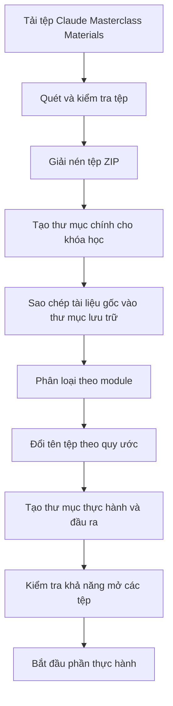
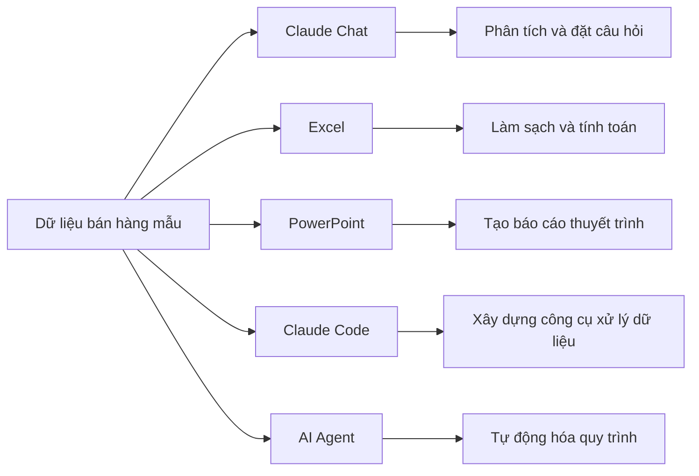
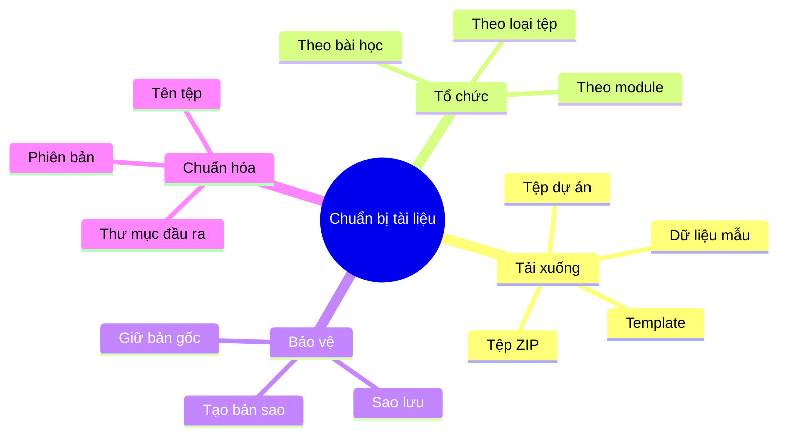

# 004 — Tải xuống tài liệu Claude Masterclass

## 1. Thông tin bài học

| Nội dung           | Chi tiết                                                                      |
| ------------------ | ----------------------------------------------------------------------------- |
| **Phần học**       | Giới thiệu Masterclass, bí quyết học hiệu quả và lời chào mừng                |
| **Chủ đề**         | Tải xuống tài liệu của khóa học                                               |
| **Mục tiêu chính** | Chuẩn bị đầy đủ tài nguyên trước khi bắt đầu các phần thực hành               |
| **Tài nguyên**     | Dữ liệu mẫu, template, tệp thực hành, thư mục dự án và các tài liệu liên quan |

---

## 2. Ý tưởng chính

Trước khi bắt đầu các phần thực hành, học viên cần tải xuống và tổ chức đầy đủ:

* Tài nguyên của khóa học.
* Bộ dữ liệu mẫu.
* Template có sẵn.
* Tệp ví dụ.
* Thư mục dự án.
* Tài liệu hướng dẫn hoặc tệp tham khảo.

Việc chuẩn bị trước giúp quá trình học diễn ra liên tục, hạn chế việc phải dừng video để tìm kiếm hoặc tải bổ sung tài liệu.

---

## 3. Tải tài liệu khóa học

[Tải xuống Claude Masterclass Materials](https://att-c.udemycdn.com/2026-03-16_20-48-37-db2ee3bc9fcdd8ed1479f9a6bb47f2d5/original.zip?response-content-disposition=attachment%3B+filename%3DClaude%2BMasterclass%2BMaterials.zip&Expires=1784470149&Signature=wKYx-sers-CpBOK1B5O8TunucP0Unqjrw6z8VcdSIL~QvgsossquAQun6A7RFNP9syZKV9MzhfdIxalv0AMOHb-D57PrfBsHo0SLO6juWZozqw4RrVRCS4PuKxzNG3XAf2dctjbaymhBA-xkwcbSQe~Xk1u15skbA7niZKjJL9u-YtN0bV1q33Suzuz8X05rAUmvEVeXHA-JbWJH4ix~kahQDEoVE9FZozXnpAnofp9MA-WYaBMw-suwgpAhBcvou7uemU80wSkwEg~JrHPIRBPChA7Q9L6XM6~DOXPkiEuKGBfbr6K-n2~ibR1iIKjSqgdOAk9DFe1REKu6lQ7wCQ__&Key-Pair-Id=K3MG148K9RIRF4)

> **Lưu ý:** Đây là liên kết tải xuống có thời hạn. Nếu liên kết không còn hoạt động, hãy mở lại bài học trên Udemy để lấy liên kết mới.

Sau khi tải xuống, hãy giải nén tệp:

```text
Claude Masterclass Materials.zip
```

---

## 4. Mục tiêu học tập

Sau khi hoàn thành bài học này, học viên có thể:

1. Hiểu lý do cần chuẩn bị tài liệu trước mỗi phần học.
2. Nhận biết các loại tài nguyên được sử dụng trong khóa học.
3. Thiết lập một thư mục học tập rõ ràng trên máy tính.
4. Tổ chức dữ liệu, template và tệp dự án theo từng module.
5. Áp dụng quy tắc đặt tên tệp thống nhất.
6. Tái sử dụng bộ dữ liệu mẫu trong nhiều bài thực hành khác nhau.
7. Hạn chế nhầm lẫn hoặc mất tệp trong quá trình học.

---

# 5. Các khái niệm trọng tâm

## 5.1. Tổ chức tài nguyên khóa học

**Tổ chức tài nguyên khóa học** là quá trình phân loại các tệp dựa trên mục đích sử dụng, module và loại nội dung.

Một bộ tài liệu có thể bao gồm:

| Loại tài nguyên | Mục đích                                                |
| --------------- | ------------------------------------------------------- |
| `datasets`      | Chứa dữ liệu dùng cho Excel, phân tích và trực quan hóa |
| `templates`     | Chứa các mẫu tài liệu, báo cáo hoặc slide               |
| `prompts`       | Chứa prompt mẫu và hướng dẫn tương tác với Claude       |
| `examples`      | Chứa các kết quả hoặc dự án mẫu                         |
| `projects`      | Chứa các bài thực hành và dự án hoàn chỉnh              |
| `outputs`       | Chứa sản phẩm do học viên tạo ra                        |
| `references`    | Chứa tài liệu tham khảo bổ sung                         |

Tài nguyên được tổ chức tốt sẽ giúp học viên:

* Tìm tệp nhanh hơn.
* Biết tệp nào thuộc bài học nào.
* Tránh chỉnh sửa nhầm tệp gốc.
* Dễ dàng sao lưu hoặc chia sẻ dự án.
* Theo dõi tiến độ học tập rõ ràng hơn.

---

## 5.2. Thiết lập thư mục cục bộ

Học viên nên tạo một thư mục chính dành riêng cho khóa học.

Ví dụ:

```text
Claude-Masterclass/
├── 00-original-materials/
├── 01-claude-chat/
├── 02-claude-cowork/
├── 03-claude-code/
├── 04-excel/
├── 05-powerpoint/
├── 06-ai-agents/
├── 07-projects/
├── prompts/
├── templates/
├── datasets/
└── outputs/
```

### Giải thích cấu trúc

* `00-original-materials/`: lưu tài liệu gốc, không chỉnh sửa trực tiếp.
* `01-claude-chat/`: bài tập liên quan đến Claude Chat.
* `02-claude-cowork/`: bài tập liên quan đến Claude Cowork.
* `03-claude-code/`: mã nguồn và dự án lập trình.
* `04-excel/`: dữ liệu, bảng tính và báo cáo Excel.
* `05-powerpoint/`: template và bài thuyết trình.
* `06-ai-agents/`: workflow và bài tập về AI Agent.
* `07-projects/`: các dự án tổng hợp.
* `prompts/`: thư viện prompt cá nhân.
* `templates/`: các mẫu có thể tái sử dụng.
* `datasets/`: dữ liệu dùng chung.
* `outputs/`: sản phẩm cuối cùng của học viên.

---

## 5.3. Tách tài liệu gốc và tài liệu thực hành

Không nên chỉnh sửa trực tiếp các tệp vừa tải xuống.

Thay vào đó, hãy duy trì hai phiên bản:

```text
Tệp gốc
   ↓ Sao chép
Tệp thực hành
   ↓ Chỉnh sửa và thử nghiệm
Kết quả hoàn chỉnh
```

Ví dụ:

```text
00-original-materials/
└── sales-data.xlsx

04-excel/lesson-01/
└── sales-data-practice.xlsx

outputs/excel/
└── sales-analysis-final.xlsx
```

Cách làm này giúp bạn có thể quay lại dữ liệu ban đầu khi:

* Công thức bị lỗi.
* Tệp bị xóa nhầm.
* Nội dung bị thay đổi quá nhiều.
* Bạn muốn thực hiện lại bài học từ đầu.
* Bạn muốn so sánh kết quả trước và sau.

---

## 5.4. Quy tắc đặt tên tệp

Tên tệp nên thể hiện được:

* Nội dung.
* Module hoặc bài học.
* Phiên bản.
* Trạng thái của tệp.

### Công thức gợi ý

```text
[module]-[lesson]-[topic]-[version].[extension]
```

Ví dụ:

```text
excel-lesson-01-sales-analysis-v01.xlsx
powerpoint-lesson-03-market-report-v02.pptx
claude-code-project-01-v01.zip
prompt-library-v03.md
customer-dataset-cleaned-v02.csv
```

### Quy tắc nên áp dụng

1. Dùng chữ thường.
2. Dùng dấu gạch ngang `-` thay cho khoảng trắng.
3. Không dùng ký tự đặc biệt như `?`, `*`, `/`, `\`, `:`.
4. Thêm số phiên bản khi tệp được chỉnh sửa nhiều lần.
5. Dùng từ `final` chỉ khi tệp thực sự hoàn tất.
6. Không đặt tên chung chung như:

```text
document1.docx
new-file.xlsx
final-final-2.pptx
test.csv
```

### Ví dụ đặt tên chưa tốt và được cải thiện

| Chưa tốt        | Nên sử dụng                             |
| --------------- | --------------------------------------- |
| `data.xlsx`     | `sales-dataset-original.xlsx`           |
| `new data.xlsx` | `sales-dataset-cleaned-v01.xlsx`        |
| `final.pptx`    | `quarterly-business-report-final.pptx`  |
| `prompt.txt`    | `customer-support-prompt-v01.md`        |
| `project.zip`   | `claude-code-dashboard-project-v01.zip` |

---

# 6. Quy trình chuẩn bị tài liệu



---

## 7. Các bước thực hiện chi tiết

### Bước 1: Tải tệp ZIP

Tải bộ tài liệu của khóa học từ liên kết được cung cấp trong bài giảng.

Tên tệp dự kiến:

```text
Claude Masterclass Materials.zip
```

### Bước 2: Kiểm tra tệp tải xuống

Trước khi giải nén, hãy kiểm tra:

* Tệp đã tải hoàn tất chưa.
* Dung lượng tệp có hợp lý không.
* Tệp có đúng định dạng `.zip` không.
* Hệ điều hành có cảnh báo tệp lỗi hay không.

### Bước 3: Giải nén

Có thể giải nén bằng:

* Windows File Explorer.
* WinRAR.
* 7-Zip.
* macOS Archive Utility.
* Công cụ dòng lệnh.

Ví dụ trên Windows PowerShell:

```powershell
Expand-Archive `
  -Path "Claude Masterclass Materials.zip" `
  -DestinationPath "Claude-Masterclass"
```

Ví dụ trên macOS hoặc Linux:

```bash
unzip "Claude Masterclass Materials.zip" -d "Claude-Masterclass"
```

### Bước 4: Giữ nguyên một bản gốc

Sao chép toàn bộ tài liệu vừa giải nén vào:

```text
Claude-Masterclass/00-original-materials/
```

Không chỉnh sửa trực tiếp thư mục này.

### Bước 5: Phân loại tài nguyên

Di chuyển hoặc sao chép các tệp vào thư mục phù hợp:

```text
.csv, .xlsx        → datasets/
.pptx              → templates/ hoặc 05-powerpoint/
.md, .txt          → prompts/ hoặc references/
.py, .js, .html    → 03-claude-code/
.zip               → projects/ hoặc archives/
```

### Bước 6: Kiểm tra phần mềm cần thiết

Đảm bảo máy tính có thể mở những định dạng được sử dụng trong khóa học.

| Định dạng    | Công cụ phù hợp                              |
| ------------ | -------------------------------------------- |
| `.zip`       | 7-Zip, WinRAR hoặc công cụ giải nén mặc định |
| `.xlsx`      | Microsoft Excel hoặc Google Sheets           |
| `.csv`       | Excel, Google Sheets hoặc trình soạn thảo mã |
| `.pptx`      | Microsoft PowerPoint hoặc Google Slides      |
| `.docx`      | Microsoft Word hoặc Google Docs              |
| `.md`        | Visual Studio Code, Obsidian hoặc Typora     |
| Tệp mã nguồn | Visual Studio Code hoặc IDE tương ứng        |

---

# 8. Vai trò của dữ liệu mẫu

Một bộ dữ liệu có thể được sử dụng xuyên suốt nhiều module.

Ví dụ:



Điều này cho thấy một tệp dữ liệu không chỉ thuộc về một bài học. Nó có thể trở thành đầu vào cho nhiều quy trình khác nhau.

### Ví dụ về tiến trình học tập

1. Dùng Claude Chat để khám phá dữ liệu.
2. Dùng Excel để làm sạch và phân tích dữ liệu.
3. Dùng PowerPoint để trình bày kết quả.
4. Dùng Claude Code để xây dựng ứng dụng.
5. Dùng AI Agent để tự động hóa toàn bộ quy trình.

---

# 9. Vai trò của template

Template giúp đảm bảo tính nhất quán giữa các sản phẩm.

Một template có thể định nghĩa:

* Cấu trúc nội dung.
* Kiểu tiêu đề.
* Font chữ.
* Màu sắc.
* Khoảng cách.
* Bố cục.
* Cách trình bày bảng biểu.
* Cách đặt tên phần và mục.
* Tiêu chuẩn chất lượng đầu ra.

### Quy trình sử dụng template

```text
Template gốc
    ↓
Tạo bản sao
    ↓
Thay thế nội dung mẫu
    ↓
Kiểm tra tính nhất quán
    ↓
Xuất sản phẩm hoàn chỉnh
```

Không nên sửa trực tiếp template gốc. Hãy tạo một bản sao cho từng dự án.

Ví dụ:

```text
templates/
└── business-report-template.pptx

05-powerpoint/project-01/
└── sales-quarterly-report-v01.pptx
```

---

# 10. Những lỗi thường gặp

## 10.1. Không giải nén tệp trước khi sử dụng

Một số chương trình có thể mở tệp bên trong ZIP, nhưng việc chỉnh sửa và lưu lại có thể gây lỗi.

**Giải pháp:** luôn giải nén toàn bộ tài liệu trước khi bắt đầu.

---

## 10.2. Chỉnh sửa trực tiếp tệp gốc

Điều này khiến học viên khó quay lại trạng thái ban đầu.

**Giải pháp:** sao chép tệp sang thư mục thực hành trước khi chỉnh sửa.

---

## 10.3. Để tất cả tệp trong một thư mục

Khi số lượng bài học tăng lên, việc tìm kiếm sẽ trở nên khó khăn.

**Giải pháp:** phân chia theo module, bài học và loại tài nguyên.

---

## 10.4. Sử dụng tên tệp không rõ nghĩa

Những tên như `final2`, `new`, `test1` không cho biết nội dung thực sự của tệp.

**Giải pháp:** dùng quy tắc đặt tên có chủ đề, bài học và phiên bản.

---

## 10.5. Tạo quá nhiều phiên bản không kiểm soát

Ví dụ:

```text
report-final.pptx
report-final-2.pptx
report-final-new.pptx
report-final-real.pptx
```

**Giải pháp:** dùng hệ thống phiên bản:

```text
report-v01.pptx
report-v02.pptx
report-v03.pptx
report-final.pptx
```

---

## 10.6. Không sao lưu tài liệu

Tệp học tập có thể bị mất do lỗi ổ cứng, xóa nhầm hoặc đồng bộ sai.

**Giải pháp:** sao lưu vào một trong các nền tảng:

* Google Drive.
* OneDrive.
* Dropbox.
* GitHub đối với mã nguồn.
* Ổ cứng ngoài.

Không nên lưu thông tin nhạy cảm hoặc API key trong thư mục đồng bộ công khai.

---

# 11. Cấu trúc thư mục đề xuất hoàn chỉnh

```text
Claude-Masterclass/
│
├── 00-original-materials/
│   └── Tài liệu gốc, không chỉnh sửa
│
├── 01-claude-chat/
│   ├── lesson-01/
│   ├── lesson-02/
│   └── outputs/
│
├── 02-claude-cowork/
│   ├── lesson-01/
│   ├── lesson-02/
│   └── outputs/
│
├── 03-claude-code/
│   ├── projects/
│   ├── source-code/
│   └── outputs/
│
├── 04-excel/
│   ├── datasets/
│   ├── exercises/
│   └── outputs/
│
├── 05-powerpoint/
│   ├── templates/
│   ├── exercises/
│   └── outputs/
│
├── 06-ai-agents/
│   ├── workflows/
│   ├── prompts/
│   └── outputs/
│
├── 07-capstone-project/
│
├── shared/
│   ├── datasets/
│   ├── templates/
│   ├── references/
│   └── assets/
│
├── prompt-library/
│   ├── chat-prompts.md
│   ├── coding-prompts.md
│   ├── excel-prompts.md
│   └── presentation-prompts.md
│
└── README.md
```

---

# 12. Danh sách kiểm tra trước khi học

## Tải xuống và giải nén

* [ ] Đã tải tệp `Claude Masterclass Materials.zip`.
* [ ] Đã kiểm tra tệp tải xuống hoàn tất.
* [ ] Đã giải nén toàn bộ nội dung.
* [ ] Đã kiểm tra không có thông báo lỗi khi giải nén.

## Tổ chức thư mục

* [ ] Đã tạo thư mục chính `Claude-Masterclass`.
* [ ] Đã tạo thư mục lưu tài liệu gốc.
* [ ] Đã tạo thư mục riêng cho từng module.
* [ ] Đã tạo thư mục `datasets`, `templates`, `prompts` và `outputs`.
* [ ] Đã phân loại các tệp vào đúng vị trí.

## Chuẩn bị công cụ

* [ ] Có công cụ giải nén ZIP.
* [ ] Có phần mềm mở Excel.
* [ ] Có phần mềm mở PowerPoint.
* [ ] Có trình soạn thảo mã nguồn.
* [ ] Có tài khoản và quyền truy cập Claude.
* [ ] Có phương án sao lưu tài liệu.

## Kiểm tra cuối cùng

* [ ] Có thể mở các tệp dữ liệu mẫu.
* [ ] Có thể mở các template.
* [ ] Không chỉnh sửa trực tiếp tệp gốc.
* [ ] Tên tệp và thư mục dễ hiểu.
* [ ] Có thể nhanh chóng tìm được tài nguyên của từng bài học.

---

# 13. Vì sao bài học này quan trọng?

Việc chuẩn bị tài liệu tưởng như là một bước nhỏ, nhưng ảnh hưởng trực tiếp đến hiệu quả của toàn bộ khóa học.

Khi tài liệu đã được tổ chức tốt, học viên có thể:

* Theo dõi bài giảng mà không bị gián đoạn.
* Tập trung vào kỹ năng thay vì quản lý tệp.
* Tìm đúng dữ liệu khi giảng viên bắt đầu demo.
* Lặp lại bài thực hành nhanh chóng.
* So sánh kết quả của mình với tệp mẫu.
* Tái sử dụng template trong các dự án thực tế.
* Xây dựng thói quen quản lý tài nguyên chuyên nghiệp.

Ngược lại, nếu tài liệu được lưu trữ lộn xộn, học viên dễ:

* Mở nhầm phiên bản.
* Làm mất tệp gốc.
* Không tìm thấy dữ liệu cần thiết.
* Bị gián đoạn trong khi thực hành.
* Tạo ra kết quả thiếu nhất quán.

---

# 14. Câu hỏi ôn tập

1. Vì sao nên tải tài liệu trước khi bắt đầu các phần thực hành?
2. Tại sao không nên chỉnh sửa trực tiếp các tệp gốc?
3. Dữ liệu mẫu có thể được sử dụng trong những module nào?
4. Template giúp cải thiện chất lượng đầu ra như thế nào?
5. Một tên tệp tốt cần thể hiện những thông tin gì?
6. Vì sao nên sử dụng số phiên bản như `v01`, `v02`?
7. Thư mục `outputs` nên chứa loại nội dung nào?
8. Bạn sẽ tổ chức các tệp Excel, PowerPoint và mã nguồn ra sao?
9. Điều gì có thể xảy ra nếu tất cả tài liệu được lưu trong một thư mục?
10. Bạn sẽ sử dụng phương pháp nào để sao lưu tài liệu khóa học?

---

# 15. Bài tập thực hành

## Yêu cầu

Hãy tạo cấu trúc thư mục cá nhân cho khóa học và thực hiện các công việc sau:

1. Tải xuống tệp tài liệu.
2. Giải nén tệp ZIP.
3. Tạo thư mục lưu bản gốc.
4. Phân loại tài liệu theo module.
5. Tạo thư mục đầu ra.
6. Đổi tên ít nhất ba tệp theo quy tắc thống nhất.
7. Tạo một tệp `README.md` mô tả cấu trúc thư mục.
8. Sao lưu thư mục khóa học lên dịch vụ lưu trữ phù hợp.

### Mẫu nội dung `README.md`

```markdown
# Claude Masterclass Workspace

## Mục đích

Thư mục này lưu trữ tài liệu, bài tập và sản phẩm của khóa học
Claude Masterclass.

## Quy tắc

- Không chỉnh sửa tệp trong `00-original-materials`.
- Mỗi bài học có một thư mục riêng.
- Sản phẩm hoàn chỉnh được lưu trong `outputs`.
- Tên tệp sử dụng chữ thường và dấu gạch ngang.
- Các phiên bản được đánh số bằng `v01`, `v02`, `v03`.
```

---

# 16. Tóm tắt bài học

Bài học này hướng dẫn học viên chuẩn bị toàn bộ tài nguyên cần thiết trước khi bắt đầu các phần thực hành của Claude Masterclass.

Ba nguyên tắc quan trọng nhất là:

1. **Tải và kiểm tra đầy đủ tài liệu trước khi học.**
2. **Tổ chức tài nguyên theo cấu trúc thư mục rõ ràng.**
3. **Sử dụng quy tắc đặt tên tệp nhất quán.**



Khi tài liệu được chuẩn bị tốt, học viên có thể tập trung vào việc thực hành, xây dựng lại các demo và chuyển những kỹ năng trong khóa học thành các quy trình có thể áp dụng trong công việc thực tế.

---

# Bài luyện tập

## Mục tiêu


## Đề bài


## Yêu cầu hoàn thành

- [ ] 
- [ ] 
- [ ] 

## Kết quả / lời giải


## Ghi chú
