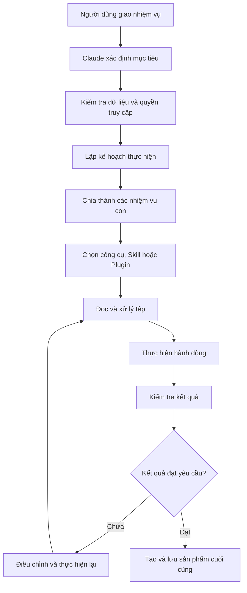
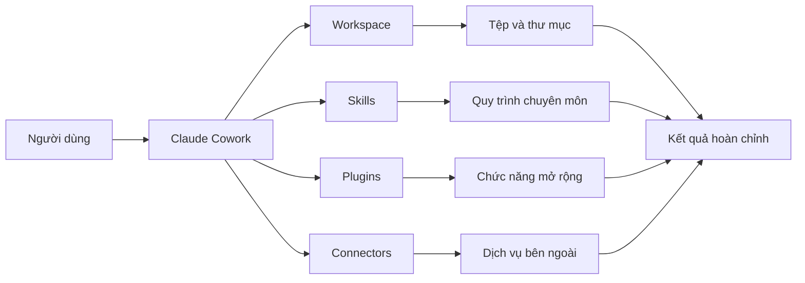

# 005 – Giới thiệu về Claude Cowork

## 1. Thông tin bài học

* **Chuyên đề:** Làm chủ Claude Cowork, Skills và Plugins để tự động hóa quy trình
* **Tên bài học:** Giới thiệu về Claude Cowork
* **Trọng tâm:** Môi trường làm việc cộng tác với AI và khả năng thực hiện quy trình nhiều bước

---

## 2. Ý tưởng chính

**Claude Cowork** là một môi trường làm việc với AI, trong đó Claude không chỉ trả lời câu hỏi mà còn có thể:

* Làm việc trực tiếp với các thư mục và tệp trên máy tính.
* Phân tích yêu cầu của người dùng.
* Tự chia một nhiệm vụ lớn thành nhiều nhiệm vụ nhỏ.
* Sử dụng công cụ, kỹ năng, plugin và trình kết nối.
* Thực hiện một quy trình gồm nhiều bước.
* Tạo ra sản phẩm đầu ra như báo cáo, bảng tính hoặc bài thuyết trình.

Điểm khác biệt quan trọng là Claude Cowork chuyển AI từ một **công cụ hỏi đáp** thành một **cộng sự có khả năng thực thi công việc**.

---

## 3. Mục tiêu học tập

Sau khi hoàn thành bài học, người học có thể:

1. Giải thích Claude Cowork là gì.
2. Phân biệt Claude Cowork với Claude Chat.
3. Hiểu khái niệm không gian làm việc của tác nhân AI.
4. Hiểu cách Claude thực hiện một nhiệm vụ nhiều bước.
5. Nhận biết vai trò của thư mục, tệp, công cụ, Skills, Plugins và Connectors.
6. Hình dung cách áp dụng Claude Cowork vào công việc thực tế.

---

# 4. Claude Cowork là gì?

Claude Cowork là một môi trường làm việc dựa trên tác nhân AI, được thiết kế để Claude có thể thực hiện công việc thay vì chỉ tạo ra một câu trả lời bằng văn bản.

Trong mô hình chatbot truyền thống, người dùng nhập yêu cầu và nhận lại phản hồi. Với Claude Cowork, người dùng có thể chỉ định một thư mục làm việc, sau đó yêu cầu Claude phân tích dữ liệu, tạo nhiệm vụ và thực hiện hành động trực tiếp trên các tệp trong thư mục đó.

### Ví dụ

Giả sử một thư mục chứa:

```text
Bao-cao-tai-chinh/
├── doanh-thu-2025.xlsx
├── chi-phi-2025.xlsx
├── du-lieu-khach-hang.csv
└── mau-bao-cao.pptx
```

Người dùng có thể yêu cầu:

> Phân tích tình hình kinh doanh, xác định các chỉ số quan trọng và tạo một bài thuyết trình tóm tắt kết quả.

Claude Cowork có thể thực hiện các bước:

1. Đọc danh sách tệp.
2. Mở các bảng dữ liệu.
3. Kiểm tra cấu trúc dữ liệu.
4. Tính toán các chỉ số.
5. Phát hiện xu hướng và bất thường.
6. Viết phần nhận xét.
7. Tạo biểu đồ.
8. Tạo bài thuyết trình.
9. Lưu kết quả vào thư mục làm việc.

---

# 5. Claude Cowork và Claude Chat

## Bảng so sánh

| Tiêu chí             | Claude Chat                                | Claude Cowork                                                    |
| -------------------- | ------------------------------------------ | ---------------------------------------------------------------- |
| Mục đích chính       | Trò chuyện và trả lời câu hỏi              | Thực hiện công việc và quy trình                                 |
| Cách tương tác       | Nhập câu hỏi, nhận câu trả lời             | Giao nhiệm vụ, theo dõi quá trình thực hiện                      |
| Làm việc với tệp     | Đọc hoặc phân tích tệp được cung cấp       | Làm việc trong thư mục có nhiều tệp                              |
| Quy trình nhiều bước | Người dùng thường phải hướng dẫn từng bước | Claude có thể tự lập kế hoạch và chia nhỏ nhiệm vụ               |
| Công cụ hỗ trợ       | Chủ yếu dựa trên hội thoại                 | Skills, Plugins, Connectors và công cụ                           |
| Đầu ra               | Văn bản, phân tích, nội dung               | Báo cáo, tệp, bảng tính, bài thuyết trình và sản phẩm hoàn chỉnh |
| Vai trò của AI       | Trợ lý trả lời                             | Cộng sự thực thi                                                 |

## Khác biệt cốt lõi

### Claude Chat

```text
Người dùng → Nhập câu hỏi → Claude trả lời → Kết thúc
```

### Claude Cowork

```text
Người dùng
    ↓
Giao nhiệm vụ
    ↓
Claude phân tích mục tiêu
    ↓
Tạo kế hoạch và nhiệm vụ con
    ↓
Đọc tệp và sử dụng công cụ
    ↓
Thực hiện các hành động
    ↓
Kiểm tra kết quả
    ↓
Tạo sản phẩm hoàn chỉnh
```

---

# 6. Không gian làm việc của tác nhân AI

## 6.1. Agent Workspace là gì?

**Agent Workspace** có thể hiểu là không gian trong đó tác nhân AI:

* Nhận mục tiêu.
* Truy cập tài nguyên được cấp quyền.
* Làm việc với tệp và thư mục.
* Sử dụng công cụ phù hợp.
* Ghi lại kết quả.
* Điều phối nhiều bước công việc.

Thay vì chỉ tương tác với một hộp trò chuyện, người dùng cung cấp cho Claude một **bối cảnh làm việc hoàn chỉnh**.

Bối cảnh đó có thể bao gồm:

```text
Agent Workspace
├── Mục tiêu
├── Hướng dẫn
├── Thư mục làm việc
├── Dữ liệu đầu vào
├── Skills
├── Plugins
├── Connectors
└── Quy tắc đầu ra
```

## 6.2. Các thành phần của Workspace

### Mục tiêu

Mô tả kết quả cuối cùng cần đạt được.

Ví dụ:

> Tạo báo cáo phân tích đối thủ cạnh tranh cho ba công ty trong ngành thương mại điện tử.

### Thư mục làm việc

Nơi chứa dữ liệu đầu vào và kết quả đầu ra.

### Hướng dẫn

Bao gồm:

* Định dạng kết quả.
* Ngôn ngữ.
* Độ dài.
* Đối tượng người đọc.
* Các nguyên tắc phải tuân thủ.

### Công cụ

Các khả năng giúp Claude đọc, phân tích, chỉnh sửa hoặc tạo nội dung.

### Quyền truy cập

Claude chỉ nên làm việc trong phạm vi mà người dùng đã cấp quyền.

---

# 7. Mô hình thực thi nhiệm vụ

Claude Cowork hoạt động theo một **Task-execution model**, tức là mô hình thực hiện nhiệm vụ.

Thay vì chờ người dùng hướng dẫn từng thao tác, tác nhân AI có thể tự tạo các nhiệm vụ con, sử dụng công cụ, Skills, Plugins và Connectors để hoàn thành mục tiêu.

## Quy trình tổng quát



## Ví dụ chia nhỏ nhiệm vụ

### Yêu cầu ban đầu

> Tạo báo cáo nghiên cứu thị trường về ứng dụng học ngoại ngữ.

### Các nhiệm vụ con có thể được tạo

```text
1. Xác định phạm vi nghiên cứu
2. Thu thập thông tin về thị trường
3. Xác định các đối thủ chính
4. So sánh tính năng và giá
5. Phân tích điểm mạnh, điểm yếu
6. Tìm khoảng trống thị trường
7. Đề xuất chiến lược sản phẩm
8. Viết báo cáo
9. Tạo bài thuyết trình
10. Kiểm tra và lưu kết quả
```

---

# 8. Làm việc với tệp và thư mục cục bộ

Một trong những khả năng quan trọng nhất của Claude Cowork là làm việc trong thư mục được người dùng chỉ định.

Claude có thể được giao một nhiệm vụ, truy cập các tệp trong phạm vi được cấp quyền và tạo kết quả trực tiếp trong thư mục làm việc.

## Các thao tác phổ biến

Claude Cowork có thể hỗ trợ:

* Đọc nhiều tệp.
* Phân loại tài liệu.
* Đổi tên tệp theo quy tắc.
* Trích xuất dữ liệu.
* Tổng hợp thông tin.
* Tạo cấu trúc thư mục.
* Chuyển đổi định dạng.
* Tạo báo cáo.
* Tạo bảng tính.
* Tạo bài thuyết trình.
* Kiểm tra tính nhất quán của dữ liệu.

## Ví dụ tổ chức thư mục

### Trước khi xử lý

```text
Downloads/
├── invoice1.pdf
├── report-final.docx
├── image001.png
├── invoice2.pdf
└── customer-data.xlsx
```

### Sau khi xử lý

```text
Project/
├── Hoa-don/
│   ├── invoice1.pdf
│   └── invoice2.pdf
├── Bao-cao/
│   └── report-final.docx
├── Du-lieu/
│   └── customer-data.xlsx
└── Hinh-anh/
    └── image001.png
```

---

# 9. Skills, Plugins và Connectors

## 9.1. Skills

**Skill** là một bộ hướng dẫn hoặc năng lực chuyên biệt giúp tác nhân AI thực hiện một loại công việc theo quy trình nhất định.

Ví dụ:

* Tạo bài thuyết trình PowerPoint.
* Xây dựng mô hình tài chính.
* Phân tích dữ liệu Excel.
* Viết báo cáo nghiên cứu.
* Kiểm tra chất lượng nội dung.
* Chuẩn hóa cấu trúc tài liệu.

Skill có thể được mô tả trong một tệp Markdown, sau đó cung cấp cho tác nhân để hướng dẫn cách thực hiện công việc. Người học có thể sử dụng Skill có sẵn hoặc tự xây dựng Skill riêng cho quy trình của doanh nghiệp.

## 9.2. Plugins

**Plugin** mở rộng khả năng của Claude bằng cách cung cấp các chức năng bổ sung.

Plugin có thể hỗ trợ:

* Xử lý dữ liệu.
* Tạo tài liệu.
* Tương tác với một hệ thống.
* Thực hiện một thao tác chuyên biệt.
* Kết nối quy trình AI với phần mềm bên ngoài.

## 9.3. Connectors

**Connector** giúp Claude kết nối với các dịch vụ hoặc nguồn dữ liệu khác.

Ví dụ:

* Gmail.
* Google Drive.
* Hệ thống quản lý tài liệu.
* Kho dữ liệu.
* Công cụ quản lý dự án.
* Dịch vụ lưu trữ đám mây.

## Mối quan hệ giữa các thành phần



---

# 10. Kiến trúc tác nhân

Claude Cowork sử dụng tư duy kiến trúc tác nhân tương tự các công cụ thực thi công việc bằng AI.

Một tác nhân thường có các thành phần:

```text
Tác nhân AI
├── Mục tiêu
├── Bộ lập kế hoạch
├── Bộ nhớ ngữ cảnh
├── Công cụ
├── Skills
├── Connectors
├── Cơ chế thực hiện
└── Cơ chế đánh giá kết quả
```

## Một tác nhân và nhiều tác nhân

### Mô hình một tác nhân

Một tác nhân chịu trách nhiệm toàn bộ quy trình.

```text
Claude Agent
├── Phân tích
├── Xử lý dữ liệu
├── Viết báo cáo
└── Kiểm tra kết quả
```

### Mô hình nhiều tác nhân

Các tác nhân có thể được phân chia theo vai trò.

```text
Tác nhân điều phối
├── Tác nhân nghiên cứu
├── Tác nhân phân tích dữ liệu
├── Tác nhân viết nội dung
├── Tác nhân thiết kế
└── Tác nhân kiểm tra chất lượng
```

Mỗi tác nhân xử lý một phần công việc, sau đó kết quả được tổng hợp thành sản phẩm cuối cùng.

---

# 11. Ứng dụng thực tế

## 11.1. Phân tích tài chính

Claude Cowork có thể:

* Đọc dữ liệu doanh thu và chi phí.
* Tính toán tỷ suất lợi nhuận.
* So sánh kết quả giữa các kỳ.
* Xây dựng kịch bản dự báo.
* Tạo biểu đồ.
* Tạo báo cáo quản trị.

## 11.2. Nghiên cứu đối thủ cạnh tranh

Quy trình có thể gồm:

1. Xác định danh sách đối thủ.
2. Thu thập thông tin.
3. So sánh sản phẩm.
4. So sánh giá.
5. Phân tích định vị thương hiệu.
6. Đánh giá ưu và nhược điểm.
7. Tìm cơ hội khác biệt hóa.
8. Viết báo cáo chiến lược.

## 11.3. Marketing

Claude Cowork có thể hỗ trợ:

* Phân tích khách hàng mục tiêu.
* Lập lịch nội dung.
* Viết nội dung chiến dịch.
* Tạo nhiều phiên bản quảng cáo.
* Tổng hợp kết quả chiến dịch.
* Chuẩn bị báo cáo hiệu suất.

## 11.4. Quản lý tài liệu

Các công việc phổ biến:

* Phân loại tài liệu.
* Đặt lại tên tệp.
* Tạo mục lục.
* Tổng hợp nhiều tài liệu.
* Phát hiện nội dung trùng lặp.
* Chuẩn hóa mẫu biểu.

## 11.5. Nghiên cứu chuyên sâu

Claude có thể phối hợp nhiều bước như:

```text
Đặt câu hỏi nghiên cứu
        ↓
Thu thập tài liệu
        ↓
Đánh giá độ tin cậy
        ↓
Trích xuất dữ kiện
        ↓
So sánh các nguồn
        ↓
Tổng hợp kết luận
        ↓
Tạo báo cáo
```

---

# 12. Tại sao bài học này quan trọng?

Bài học này thay đổi cách người học nhìn nhận AI.

## Tư duy cũ

> AI là công cụ để hỏi và nhận câu trả lời.

## Tư duy mới

> AI là cộng sự có thể tiếp nhận mục tiêu, lập kế hoạch, sử dụng công cụ và tạo ra sản phẩm hoàn chỉnh.

Sự thay đổi này rất quan trọng vì trong môi trường làm việc thực tế, giá trị không chỉ nằm ở câu trả lời mà còn nằm ở khả năng:

* Hoàn thành công việc.
* Tiết kiệm thời gian.
* Chuẩn hóa quy trình.
* Giảm thao tác thủ công.
* Tạo đầu ra có thể sử dụng ngay.
* Tái sử dụng quy trình cho nhiều dự án.

---

# 13. Những điểm cần lưu ý

## 13.1. Kiểm soát quyền truy cập

Chỉ nên cấp cho tác nhân quyền truy cập vào những thư mục và dữ liệu thực sự cần thiết.

## 13.2. Sao lưu dữ liệu

Trước khi cho phép AI chỉnh sửa hàng loạt tệp, nên:

* Tạo bản sao lưu.
* Sử dụng thư mục thử nghiệm.
* Kiểm tra kết quả trước khi ghi đè.
* Bật cơ chế kiểm duyệt nếu có.

## 13.3. Không phụ thuộc hoàn toàn vào AI

Kết quả vẫn cần được con người kiểm tra, đặc biệt trong các lĩnh vực:

* Tài chính.
* Pháp lý.
* Y tế.
* Bảo mật.
* Dữ liệu cá nhân.
* Quyết định kinh doanh quan trọng.

## 13.4. Viết yêu cầu rõ ràng

Một nhiệm vụ tốt nên xác định:

```text
Mục tiêu
+ Dữ liệu đầu vào
+ Phạm vi làm việc
+ Các bước hoặc nguyên tắc
+ Định dạng đầu ra
+ Tiêu chí chất lượng
```

### Ví dụ yêu cầu chưa tốt

> Phân tích dữ liệu này.

### Ví dụ yêu cầu tốt

> Đọc các tệp Excel trong thư mục `Sales-2026`, tổng hợp doanh thu theo tháng và khu vực, xác định ba khu vực tăng trưởng cao nhất, tạo biểu đồ và lưu báo cáo dưới dạng Markdown. Không chỉnh sửa các tệp dữ liệu gốc.

---

# 14. Kiến thức trọng tâm

## Claude Cowork và Claude Chat

Claude Chat chủ yếu phục vụ hội thoại, trong khi Claude Cowork tập trung vào việc thực hiện nhiệm vụ trong một môi trường làm việc.

## Agent Workspace

Không gian làm việc của tác nhân bao gồm mục tiêu, hướng dẫn, dữ liệu, công cụ, quyền truy cập và quy tắc đầu ra.

## Task-execution model

Claude có thể:

1. Hiểu mục tiêu.
2. Lập kế hoạch.
3. Chia nhỏ nhiệm vụ.
4. Chọn công cụ.
5. Thực hiện các bước.
6. Kiểm tra kết quả.
7. Tạo sản phẩm cuối cùng.

## Skills, Plugins và Connectors

* **Skills:** Cung cấp kiến thức và quy trình chuyên biệt.
* **Plugins:** Mở rộng chức năng.
* **Connectors:** Kết nối với dữ liệu và dịch vụ bên ngoài.

---

# 15. Câu hỏi ôn tập

1. Claude Cowork khác Claude Chat ở điểm nào?
2. Tại sao Claude Cowork được gọi là môi trường thực thi nhiệm vụ?
3. Agent Workspace bao gồm những thành phần nào?
4. Claude có thể làm gì với một thư mục cục bộ?
5. Task-execution model hoạt động theo những bước nào?
6. Skill có vai trò gì trong Claude Cowork?
7. Plugin khác Connector như thế nào?
8. Vì sao một nhiệm vụ lớn cần được chia thành các nhiệm vụ con?
9. Những rủi ro nào có thể xảy ra khi cho AI chỉnh sửa tệp?
10. Làm thế nào để viết một yêu cầu tự động hóa rõ ràng?

---

# 16. Bài tập thực hành

## Bài tập 1: Thiết kế Workspace

Hãy thiết kế một cấu trúc thư mục cho nhiệm vụ:

> Phân tích kết quả học tập của một lớp và tạo báo cáo tổng kết.

Gợi ý:

```text
Student-Analysis/
├── Input/
├── Templates/
├── Output/
└── Instructions/
```

## Bài tập 2: Viết yêu cầu cho Claude Cowork

Viết một yêu cầu bao gồm:

* Mục tiêu.
* Thư mục làm việc.
* Dữ liệu đầu vào.
* Các bước cần thực hiện.
* Định dạng đầu ra.
* Quy tắc an toàn.

## Bài tập 3: Chia nhỏ quy trình

Chia nhiệm vụ sau thành ít nhất tám nhiệm vụ con:

> Nghiên cứu ba đối thủ cạnh tranh và tạo bài thuyết trình chiến lược.

---

# 17. Tóm tắt bài học

Claude Cowork là một môi trường cộng tác với AI, trong đó Claude có thể làm việc với tệp, thư mục và các công cụ để hoàn thành quy trình nhiều bước.

Ba ý tưởng quan trọng nhất của bài học là:

1. **Claude Cowork không chỉ là chatbot:** Đây là môi trường thực thi công việc.
2. **Claude hoạt động trong một Workspace:** Workspace cung cấp mục tiêu, dữ liệu, công cụ và phạm vi làm việc.
3. **Claude sử dụng mô hình thực thi nhiệm vụ:** AI có thể lập kế hoạch, tạo nhiệm vụ con, thực hiện hành động, kiểm tra và tạo sản phẩm hoàn chỉnh.

```text
Từ hỏi đáp
    ↓
Đến lập kế hoạch
    ↓
Đến sử dụng công cụ
    ↓
Đến thực hiện quy trình
    ↓
Đến tạo sản phẩm hoàn chỉnh
```

Claude Cowork đại diện cho sự chuyển đổi từ **AI hỗ trợ suy nghĩ** sang **AI hỗ trợ thực hiện công việc thực tế**.

---

# Bài luyện tập

## Mục tiêu


## Đề bài


## Yêu cầu hoàn thành

- [ ] 
- [ ] 
- [ ] 

## Kết quả / lời giải


## Ghi chú
