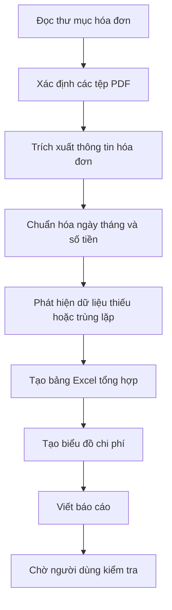
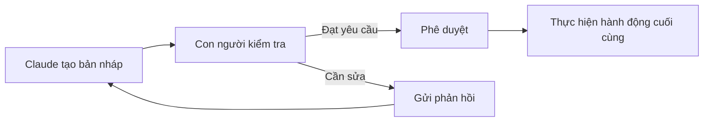
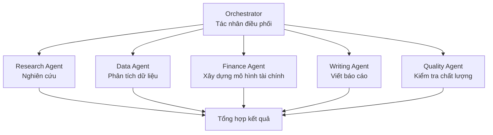
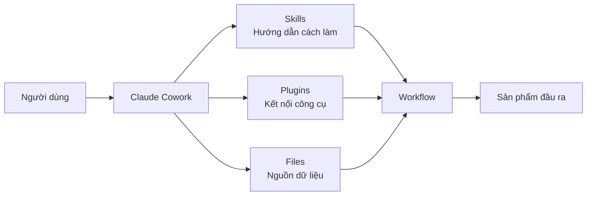
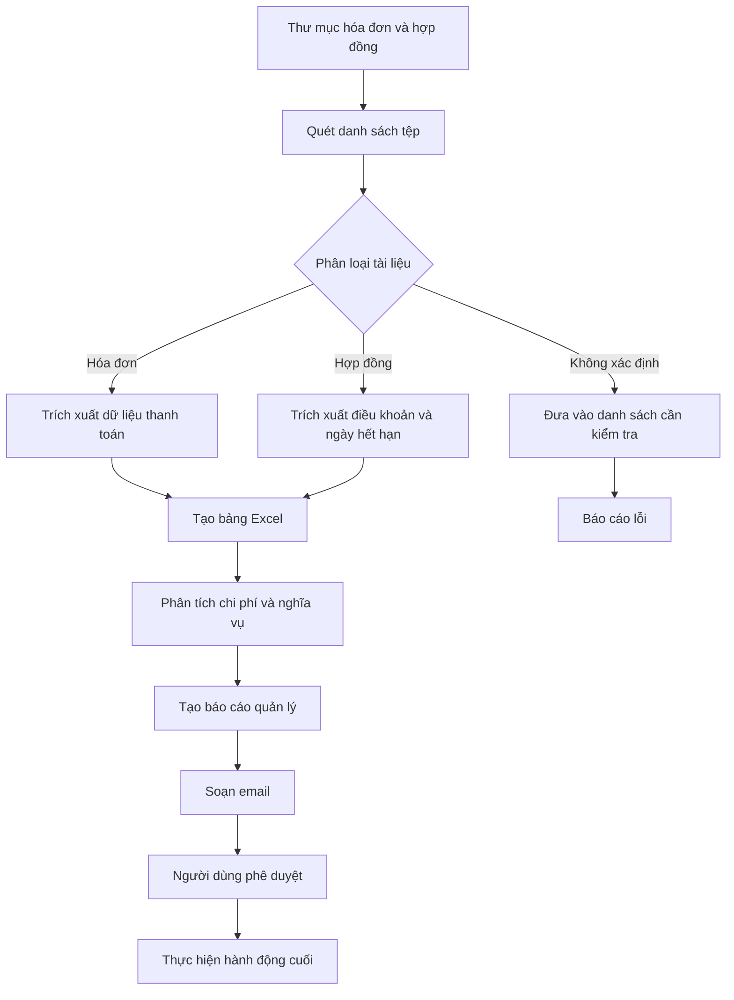

# 006 — Khả năng của Claude Cowork và cách thức hoạt động

## 1. Thông tin bài học

* **Chuyên đề:** Làm chủ Claude Cowork, Skills và Plugins để tự động hóa quy trình
* **Tên bài học:** Claude Cowork Capabilities & How It Works
* **Trọng tâm:** Tìm hiểu cách Claude Cowork tương tác với tệp, thư mục, kỹ năng, plugin và các dịch vụ được kết nối.

---

## 2. Ý tưởng chính

Claude Cowork không chỉ trả lời câu hỏi như một chatbot thông thường. Công cụ này có thể tiếp nhận một nhiệm vụ, xây dựng kế hoạch, chia nhiệm vụ thành các bước nhỏ và thực hiện công việc trong một môi trường làm việc được kiểm soát.

Claude Cowork có thể:

* Đọc và chỉnh sửa tệp trong thư mục được cấp quyền.
* Phối hợp nhiều tác nhân AI để thực hiện các phần việc khác nhau.
* Tạo tài liệu chuyên nghiệp.
* Phân tích dữ liệu và tổng hợp nghiên cứu.
* Quản lý tệp và thư mục.
* Viết mã và tự động hóa quy trình.
* Chạy các công việc định kỳ theo lịch.
* Kết nối với các công cụ hoặc dịch vụ thông qua Skills và Plugins.

---

## 3. Mục tiêu học tập

Sau khi hoàn thành bài học, người học có thể:

1. Hiểu vai trò của không gian làm việc dành cho tác nhân AI.
2. Mô tả cách Claude Cowork lập kế hoạch và thực thi nhiệm vụ.
3. Hiểu cách các tệp được sử dụng làm ngữ cảnh cho Claude.
4. Phân biệt Claude Cowork với Claude Chat và Claude Code.
5. Nhận biết vai trò của con người trong việc kiểm tra và phê duyệt kết quả.
6. Xác định các nhóm công việc phù hợp để tự động hóa bằng Claude Cowork.
7. Hiểu vì sao Claude Cowork có thể tiêu thụ nhiều token hơn một cuộc trò chuyện thông thường.

---

# 4. Claude Cowork là gì?

Claude Cowork là một môi trường làm việc có khả năng hỗ trợ thực hiện các nhiệm vụ phức tạp trên tệp, thư mục và các dịch vụ được kết nối.

Thay vì chỉ đặt câu hỏi và nhận câu trả lời, người dùng có thể giao cho Claude một mục tiêu hoàn chỉnh, chẳng hạn:

> Hãy đọc toàn bộ hóa đơn trong thư mục này, trích xuất thông tin quan trọng, tạo bảng tổng hợp Excel và viết báo cáo về tổng chi phí theo từng tháng.

Claude Cowork có thể phân tích yêu cầu, xây dựng kế hoạch và thực hiện lần lượt các bước cần thiết để tạo ra sản phẩm cuối cùng.

---

# 5. Cách Claude Cowork hoạt động

Quy trình tổng quát của Claude Cowork gồm năm bước chính.


## Bước 1: Người dùng mô tả nhiệm vụ

Người dùng cung cấp:

* Mục tiêu cần đạt được.
* Thư mục hoặc tệp liên quan.
* Định dạng đầu ra mong muốn.
* Các điều kiện và giới hạn.
* Tiêu chí đánh giá kết quả.

Ví dụ:

> Phân tích các tệp doanh thu trong thư mục `Sales`, tạo biểu đồ tăng trưởng theo quý và xuất báo cáo PowerPoint dành cho ban quản lý.

## Bước 2: Claude xây dựng kế hoạch

Claude xác định:

* Những tệp nào cần đọc.
* Dữ liệu nào cần trích xuất.
* Các bước xử lý cần thực hiện.
* Công cụ hoặc kỹ năng nào cần sử dụng.
* Sản phẩm đầu ra nào cần tạo.

## Bước 3: Chia nhiệm vụ thành các công việc nhỏ

Một nhiệm vụ lớn có thể được chia thành các phần như:

1. Kiểm tra cấu trúc thư mục.
2. Đọc các tệp dữ liệu.
3. Làm sạch và chuẩn hóa dữ liệu.
4. Phân tích các chỉ số.
5. Tạo biểu đồ.
6. Viết nhận xét.
7. Tạo báo cáo cuối cùng.
8. Kiểm tra chất lượng đầu ra.

## Bước 4: Thực thi trong môi trường được kiểm soát

Claude thực hiện các công việc trong một môi trường riêng biệt hoặc môi trường ảo.

Điều này giúp:

* Giới hạn phạm vi truy cập.
* Giảm nguy cơ ảnh hưởng đến toàn bộ máy tính.
* Quản lý các tệp đầu vào và đầu ra.
* Theo dõi các bước thực hiện.
* Tăng khả năng kiểm tra và khôi phục khi có lỗi.

## Bước 5: Con người xem xét kết quả

Những hành động quan trọng nên có bước kiểm tra của con người, đặc biệt khi liên quan đến:

* Gửi email.
* Xóa hoặc ghi đè tệp.
* Thay đổi dữ liệu quan trọng.
* Công bố báo cáo.
* Gửi tài liệu cho khách hàng.
* Chạy mã trên hệ thống thật.
* Thực hiện giao dịch hoặc quyết định tài chính.

---

# 6. Các khái niệm quan trọng

## 6.1. Agent Workspace — Không gian làm việc của tác nhân

Agent Workspace là môi trường mà Claude sử dụng để:

* Tiếp nhận yêu cầu.
* Truy cập các tệp được cấp quyền.
* Lập kế hoạch.
* Sử dụng công cụ.
* Thực hiện nhiệm vụ.
* Lưu sản phẩm đầu ra.
* Theo dõi trạng thái công việc.

Có thể hình dung Agent Workspace giống như một bàn làm việc kỹ thuật số dành cho nhân viên AI.

```text
Agent Workspace
├── Yêu cầu của người dùng
├── Tệp và thư mục được cấp quyền
├── Kế hoạch thực hiện
├── Skills và Plugins
├── Các nhiệm vụ đang chạy
├── Kết quả trung gian
└── Sản phẩm cuối cùng
```

Claude không nên được cấp quyền truy cập toàn bộ máy tính nếu công việc chỉ liên quan đến một thư mục cụ thể.

---

## 6.2. Task Instructions — Chỉ dẫn nhiệm vụ

Chất lượng kết quả phụ thuộc rất lớn vào chất lượng của yêu cầu đầu vào.

Một chỉ dẫn nhiệm vụ tốt nên bao gồm:

| Thành phần    | Nội dung                                           |
| ------------- | -------------------------------------------------- |
| Mục tiêu      | Claude cần tạo ra kết quả gì?                      |
| Nguồn dữ liệu | Tệp, thư mục hoặc dịch vụ nào được sử dụng?        |
| Quy trình     | Các bước bắt buộc phải thực hiện                   |
| Đầu ra        | Word, Excel, PowerPoint, PDF, mã nguồn hay báo cáo |
| Tiêu chuẩn    | Mức độ chi tiết, độ chính xác, định dạng           |
| Giới hạn      | Không xóa tệp, không gửi email khi chưa phê duyệt  |
| Kiểm tra      | Điều kiện nào cần con người xác nhận?              |

### Ví dụ chỉ dẫn chưa tốt

> Hãy phân tích thư mục này.

Yêu cầu này không cho biết:

* Cần phân tích nội dung gì.
* Đầu ra mong muốn là gì.
* Tệp nào quan trọng.
* Sử dụng tiêu chí nào.

### Ví dụ chỉ dẫn tốt hơn

> Hãy đọc tất cả hóa đơn PDF trong thư mục `Invoices/2026`, trích xuất ngày, mã hóa đơn, nhà cung cấp, số tiền trước thuế, thuế và tổng thanh toán. Sau đó tạo một tệp Excel tổng hợp, nhóm chi phí theo tháng và nhà cung cấp. Không thay đổi hoặc xóa các tệp gốc. Trình bày danh sách tệp không đọc được để tôi kiểm tra.

---

## 6.3. Files as Context — Tệp làm ngữ cảnh

Trong Claude Cowork, tệp không chỉ là tài liệu đính kèm. Chúng có thể trở thành nguồn ngữ cảnh trực tiếp cho quá trình làm việc.

Claude có thể sử dụng:

* Tài liệu Word.
* Bảng tính Excel.
* Bài thuyết trình PowerPoint.
* Tệp PDF.
* Tệp văn bản.
* Tệp CSV.
* Mã nguồn.
* Hình ảnh.
* Hợp đồng.
* Hóa đơn.
* Biên bản cuộc họp.
* Tài liệu nghiên cứu.

Ví dụ, khi được cấp một thư mục dự án, Claude có thể:

1. Đọc tài liệu yêu cầu.
2. Kiểm tra bảng kế hoạch.
3. Phân tích dữ liệu.
4. Đọc mã nguồn.
5. Tổng hợp tất cả thông tin thành báo cáo.

### Lưu ý về bảo mật

Không nên đưa vào thư mục làm việc những dữ liệu không cần thiết, chẳng hạn:

* Mật khẩu.
* Khóa API.
* Thông tin ngân hàng.
* Hồ sơ sức khỏe.
* Dữ liệu khách hàng nhạy cảm.
* Tài liệu nội bộ không liên quan.
* Tệp cấu hình chứa thông tin bí mật.

Nguyên tắc nên áp dụng là:

> Chỉ cấp đúng dữ liệu Claude cần để hoàn thành nhiệm vụ.

---

## 6.4. Workflow Execution — Thực thi quy trình

Workflow Execution là quá trình Claude thực hiện một chuỗi bước có liên quan để hoàn thành mục tiêu.

Ví dụ về quy trình xử lý hóa đơn:



Một quy trình tốt cần có:

* Đầu vào rõ ràng.
* Các bước xử lý có thứ tự.
* Tiêu chí kiểm tra.
* Cơ chế xử lý lỗi.
* Bước phê duyệt.
* Đầu ra xác định trước.

---

## 6.5. Human Review Checkpoints — Điểm kiểm tra của con người

Claude Cowork có thể tự động hóa nhiều phần việc, nhưng con người vẫn cần kiểm soát các quyết định quan trọng.

### Các mức độ kiểm tra

| Mức độ     | Ví dụ                                                          |
| ---------- | -------------------------------------------------------------- |
| Thấp       | Định dạng lại tài liệu, đổi tên bản sao của tệp                |
| Trung bình | Phân tích dữ liệu, tạo báo cáo nội bộ                          |
| Cao        | Gửi email, chỉnh sửa hợp đồng, cập nhật dữ liệu thật           |
| Rất cao    | Xóa dữ liệu, giao dịch tài chính, triển khai hệ thống sản xuất |

### Quy trình phê duyệt đề xuất



Người dùng nên yêu cầu Claude tạo bản nháp trước khi:

* Gửi email.
* Xuất bản nội dung.
* Thay đổi tài liệu chính thức.
* Chạy thao tác hàng loạt.
* Thay đổi tệp nguồn.
* Gửi báo cáo cho bên ngoài.

---

# 7. Phối hợp nhiều tác nhân AI

Một khả năng quan trọng của mô hình tác nhân là chia công việc cho nhiều tác nhân phụ.

Có thể hình dung cấu trúc này theo mô hình **Orchestrator–Worker**.



## Tác nhân điều phối

Tác nhân điều phối có nhiệm vụ:

* Hiểu yêu cầu tổng thể.
* Chia nhiệm vụ.
* Giao việc cho từng tác nhân.
* Theo dõi tiến độ.
* Kết hợp kết quả.
* Kiểm tra đầu ra cuối cùng.

## Các tác nhân thực thi

Mỗi tác nhân có thể đảm nhiệm một vai trò riêng:

* Tác nhân nghiên cứu thị trường.
* Tác nhân phân tích dữ liệu.
* Tác nhân xây dựng mô hình tài chính.
* Tác nhân viết báo cáo.
* Tác nhân tạo bài thuyết trình.
* Tác nhân kiểm tra chất lượng.

Cách tổ chức này đặc biệt hữu ích với các nhiệm vụ phức tạp cần nhiều loại chuyên môn.

---

# 8. Các khả năng chính của Claude Cowork

## 8.1. Tạo tài liệu

Claude Cowork có thể hỗ trợ tạo:

* Tài liệu Word.
* Bảng tính Excel.
* Bài thuyết trình PowerPoint.
* Báo cáo PDF.
* Biên bản cuộc họp.
* Kế hoạch dự án.
* Báo cáo kinh doanh.
* Hồ sơ đề xuất.
* Tài liệu hướng dẫn.

Claude có thể kết hợp nội dung từ nhiều tệp để tạo một sản phẩm hoàn chỉnh với cấu trúc và định dạng chuyên nghiệp.

---

## 8.2. Phân tích dữ liệu

Claude Cowork có thể hỗ trợ:

* Làm sạch dữ liệu.
* Chuẩn hóa dữ liệu.
* Phát hiện giá trị thiếu.
* Phát hiện bản ghi trùng lặp.
* Thực hiện phân tích thống kê.
* Tính toán các chỉ số.
* Tạo bảng tổng hợp.
* Tạo biểu đồ.
* Viết nhận xét từ kết quả phân tích.

### Quy trình phân tích dữ liệu mẫu

```text
Dữ liệu thô
   ↓
Kiểm tra cấu trúc
   ↓
Làm sạch dữ liệu
   ↓
Chuẩn hóa dữ liệu
   ↓
Phân tích thống kê
   ↓
Trực quan hóa
   ↓
Viết kết luận
   ↓
Xuất báo cáo
```

---

## 8.3. Nghiên cứu và tổng hợp thông tin

Claude Cowork có thể:

* Thu thập thông tin từ nhiều nguồn.
* Phân tích bản ghi cuộc họp hoặc bản chép lời.
* So sánh tài liệu.
* Tổng hợp các phát hiện.
* Xác định điểm giống và khác nhau.
* Viết báo cáo nghiên cứu.
* Trích dẫn và tổ chức nguồn tham khảo.

Ví dụ:

> Nghiên cứu năm đối thủ cạnh tranh, tổng hợp sản phẩm, mức giá, khách hàng mục tiêu, điểm mạnh, điểm yếu và đề xuất ba hướng phát triển sản phẩm.

Kết quả có thể được trình bày dưới dạng:

* Báo cáo Word.
* Bảng so sánh Excel.
* Bài thuyết trình PowerPoint.
* Bản tóm tắt điều hành.

---

## 8.4. Quản lý tệp

Claude Cowork có thể hỗ trợ:

* Phân loại tệp vào các thư mục.
* Đổi tên nhiều tệp theo quy tắc.
* Phát hiện tệp trùng lặp.
* Chuyển đổi định dạng.
* Tạo mục lục tệp.
* Sắp xếp hóa đơn và hợp đồng.
* Trích xuất dữ liệu từ nhiều tài liệu.
* Tạo bảng thống kê tài liệu.

### Ví dụ quy tắc đổi tên

```text
Trước:
invoice1.pdf
scan_002.pdf
document-final.pdf

Sau:
2026-01-15_ABC-Invoice_INV-001.pdf
2026-01-22_XYZ-Invoice_INV-002.pdf
2026-02-03_DEF-Contract_CTR-015.pdf
```

Claude nên tạo bản xem trước danh sách thay đổi trước khi đổi tên hoặc di chuyển hàng loạt.

---

## 8.5. Lập trình và tự động hóa

Claude Cowork có thể hỗ trợ:

* Viết script.
* Xây dựng công cụ nhỏ.
* Xử lý dữ liệu tự động.
* Tạo pipeline.
* Kiểm tra và sửa lỗi mã nguồn.
* Tạo chương trình chuyển đổi tệp.
* Kết nối API.
* Tự động hóa các công việc lặp lại.

Ví dụ:

> Viết một script Python đọc tất cả tệp CSV trong thư mục, hợp nhất dữ liệu, loại bỏ bản ghi trùng lặp và tạo báo cáo tổng hợp.

---

## 8.6. Công việc định kỳ

Claude Cowork có thể được sử dụng trong các quy trình chạy theo lịch, chẳng hạn:

* Tổng hợp tin tức đối thủ mỗi sáng.
* Tạo báo cáo doanh thu hằng tuần.
* Kiểm tra thư mục hóa đơn cuối mỗi tháng.
* Theo dõi thay đổi trên các nguồn thông tin.
* Tổng hợp phản hồi khách hàng.
* Tạo báo cáo vận hành.
* Kiểm tra tình trạng dự án.

### Ví dụ

```text
Lịch chạy: 10:00 mỗi ngày

1. Thu thập tin tức về đối thủ.
2. Loại bỏ các tin đã xuất hiện trước đó.
3. Phân loại tin theo sản phẩm, giá và chiến lược.
4. Tóm tắt các thay đổi quan trọng.
5. Đề xuất những vấn đề cần theo dõi.
6. Tạo báo cáo.
7. Chờ người dùng phê duyệt trước khi gửi.
```

---

# 9. Vai trò của Skills và Plugins

## Skills

Skill là một tập hợp hướng dẫn, kiến thức hoặc quy trình giúp Claude thực hiện một loại nhiệm vụ theo cách nhất quán.

Ví dụ:

* Skill tạo báo cáo tài chính.
* Skill phân tích hợp đồng.
* Skill làm sạch dữ liệu.
* Skill tạo bài thuyết trình.
* Skill kiểm tra mã nguồn.
* Skill xử lý hóa đơn.

Một Skill tốt có thể bao gồm:

```text
Skill
├── Mục tiêu
├── Điều kiện đầu vào
├── Quy trình thực hiện
├── Công cụ được phép sử dụng
├── Tiêu chuẩn đầu ra
├── Quy tắc xử lý lỗi
└── Điểm cần con người phê duyệt
```

## Plugins

Plugin giúp Claude kết nối với các công cụ hoặc dịch vụ bên ngoài.

Ví dụ:

* Dịch vụ email.
* Lịch làm việc.
* Kho lưu trữ tệp.
* Hệ thống quản lý dự án.
* Cơ sở dữ liệu.
* Công cụ thiết kế.
* Kho mã nguồn.
* Dịch vụ tìm kiếm.

### Mối quan hệ giữa Cowork, Skill và Plugin



* **Cowork** điều phối toàn bộ quá trình.
* **Skill** hướng dẫn Claude cách thực hiện nhiệm vụ.
* **Plugin** cung cấp khả năng kết nối với công cụ.
* **Files** cung cấp dữ liệu và ngữ cảnh.
* **Workflow** mô tả chuỗi hành động cần thực hiện.

---

# 10. Claude Cowork khác gì Claude Chat và Claude Code?

| Tiêu chí                | Claude Chat                         | Claude Cowork                                   | Claude Code                          |
| ----------------------- | ----------------------------------- | ----------------------------------------------- | ------------------------------------ |
| Mục đích chính          | Hỏi đáp và tạo nội dung             | Thực hiện quy trình công việc                   | Phát triển phần mềm                  |
| Phạm vi                 | Cuộc trò chuyện                     | Tệp, thư mục và dịch vụ kết nối                 | Kho mã nguồn và môi trường lập trình |
| Lập kế hoạch nhiều bước | Có thể hỗ trợ                       | Là chức năng trọng tâm                          | Tập trung vào nhiệm vụ kỹ thuật      |
| Thao tác với tệp        | Thường giới hạn ở tệp được cung cấp | Làm việc trực tiếp trong phạm vi được cấp quyền | Đọc và chỉnh sửa mã nguồn            |
| Phân tích dữ liệu       | Phù hợp với tác vụ nhỏ              | Phù hợp với quy trình nhiều bước                | Phù hợp khi cần viết mã xử lý        |
| Tạo tài liệu            | Có                                  | Mạnh                                            | Không phải trọng tâm                 |
| Lập trình               | Có thể hỗ trợ                       | Có thể tự động hóa bằng script                  | Chuyên sâu                           |
| Công việc định kỳ       | Không phải trọng tâm                | Phù hợp                                         | Có thể xây dựng bằng mã              |
| Đối tượng sử dụng       | Người dùng phổ thông                | Nhân sự tri thức và vận hành                    | Nhà phát triển                       |

## Khi nào nên dùng Claude Chat?

Sử dụng Claude Chat khi cần:

* Hỏi một câu hỏi.
* Giải thích một khái niệm.
* Viết một đoạn nội dung.
* Tóm tắt một tài liệu.
* Trao đổi và phát triển ý tưởng.
* Thực hiện nhiệm vụ ngắn, ít bước.

## Khi nào nên dùng Claude Cowork?

Sử dụng Claude Cowork khi cần:

* Làm việc trên nhiều tệp.
* Thực hiện một quy trình nhiều bước.
* Tạo nhiều sản phẩm đầu ra.
* Phân tích dữ liệu và tạo báo cáo.
* Quản lý thư mục.
* Phối hợp nhiều loại nhiệm vụ.
* Tự động hóa công việc lặp lại.

## Khi nào nên dùng Claude Code?

Sử dụng Claude Code khi cần:

* Hiểu một codebase.
* Sửa lỗi.
* Viết tính năng.
* Chạy kiểm thử.
* Refactor mã nguồn.
* Làm việc với Git.
* Xây dựng phần mềm.

---

# 11. Ví dụ thực tế: Xử lý hóa đơn và hợp đồng

## Bài toán

Một thư mục chứa:

* Hóa đơn PDF.
* Hợp đồng Word.
* Biên nhận được quét thành hình ảnh.
* Bảng theo dõi thanh toán.
* Tài liệu từ nhiều nhà cung cấp.

## Yêu cầu

Claude Cowork cần:

1. Đọc các tài liệu.
2. Phân loại hóa đơn và hợp đồng.
3. Trích xuất dữ liệu quan trọng.
4. Tạo bảng Excel tổng hợp.
5. Đánh dấu hóa đơn chưa thanh toán.
6. Xác định hợp đồng sắp hết hạn.
7. Tạo báo cáo quản lý.
8. Chuẩn bị bản nháp email.
9. Chờ người dùng phê duyệt trước khi gửi.

## Quy trình thực hiện



## Đầu ra dự kiến

* `Invoice_Summary.xlsx`
* `Contract_Expiry_Report.xlsx`
* `Management_Report.docx`
* `Exceptions_List.csv`
* Bản nháp email thông báo.
* Thư mục chứa các tệp đã được phân loại.

---

# 12. Chi phí token

Claude Cowork có thể sử dụng nhiều token hơn Claude Chat vì hệ thống phải xử lý:

* Chỉ dẫn của người dùng.
* Nội dung của nhiều tệp.
* Các bước lập kế hoạch.
* Kết quả trung gian.
* Trao đổi giữa các tác nhân.
* Nội dung do công cụ trả về.
* Quá trình kiểm tra và sửa lỗi.
* Sản phẩm đầu ra dài.

```text
Tổng token sử dụng
≈ Chỉ dẫn
+ Nội dung tệp
+ Kế hoạch
+ Kết quả công cụ
+ Kết quả trung gian
+ Các vòng kiểm tra
+ Nội dung đầu ra
```

Một quy trình dài với nhiều tệp Excel, PDF, PowerPoint hoặc nhiều tác nhân có thể tiêu thụ nhiều tài nguyên hơn đáng kể so với một câu hỏi đơn giản.

## Cách giảm mức sử dụng token

* Chỉ cung cấp các tệp cần thiết.
* Chia thư mục theo từng dự án.
* Loại bỏ tệp trùng lặp.
* Đưa ra yêu cầu rõ ràng ngay từ đầu.
* Giới hạn phạm vi nghiên cứu.
* Yêu cầu đầu ra có cấu trúc.
* Sử dụng mẫu tài liệu có sẵn.
* Chia nhiệm vụ lớn thành các giai đoạn hợp lý.
* Không yêu cầu đọc lại toàn bộ dữ liệu khi chỉ cần cập nhật một phần.

---

# 13. Hạn chế và rủi ro cần lưu ý

Claude Cowork có khả năng mạnh nhưng không nên được xem là hoàn toàn tự chủ trong mọi tình huống.

## Các rủi ro phổ biến

### Truy cập quá nhiều dữ liệu

Nếu cấp quyền cho một thư mục quá rộng, Claude có thể tiếp xúc với các tệp không liên quan hoặc nhạy cảm.

### Ghi đè hoặc thay đổi tệp

Các thao tác đổi tên, di chuyển hoặc chỉnh sửa hàng loạt có thể tạo ra ảnh hưởng lớn nếu không được kiểm tra.

### Sai sót trong trích xuất dữ liệu

Tài liệu được quét mờ, bố cục phức tạp hoặc dữ liệu thiếu có thể làm kết quả không chính xác.

### Kết luận nghiên cứu chưa đầy đủ

Claude có thể bỏ sót nguồn, hiểu sai ngữ cảnh hoặc đưa ra kết luận cần được kiểm chứng.

### Chi phí tài nguyên cao

Quy trình dài, nhiều tệp và nhiều tác nhân có thể tiêu thụ lượng token lớn.

### Hành động bên ngoài hệ thống

Gửi email, cập nhật cơ sở dữ liệu hoặc xuất bản nội dung cần có sự phê duyệt rõ ràng.

---

# 14. Nguyên tắc sử dụng an toàn

Áp dụng các nguyên tắc sau khi xây dựng quy trình Claude Cowork:

1. **Cấp quyền tối thiểu:** Chỉ cấp quyền cho thư mục cần thiết.
2. **Không chứa dữ liệu bí mật:** Loại bỏ mật khẩu, khóa API và thông tin nhạy cảm.
3. **Sao lưu dữ liệu:** Tạo bản sao trước các thao tác hàng loạt.
4. **Ưu tiên tạo bản nháp:** Không thực hiện ngay hành động khó hoàn tác.
5. **Đặt điểm phê duyệt:** Yêu cầu con người kiểm tra trước các hành động quan trọng.
6. **Ghi lại thay đổi:** Yêu cầu báo cáo các tệp đã tạo, sửa, di chuyển hoặc xóa.
7. **Kiểm tra mẫu trước:** Chạy thử trên một số ít tệp trước khi xử lý toàn bộ thư mục.
8. **Xác thực kết quả:** Đối chiếu số liệu với nguồn gốc.
9. **Giới hạn phạm vi:** Đặt rõ số lượng tệp, thời gian và nguồn dữ liệu.
10. **Có phương án khôi phục:** Đảm bảo có thể hoàn tác khi xảy ra lỗi.

---

# 15. Mẫu yêu cầu dành cho Claude Cowork

```text
Vai trò:
Bạn là chuyên viên phân tích dữ liệu và lập báo cáo.

Mục tiêu:
Phân tích dữ liệu bán hàng trong thư mục Sales/2026.

Nguồn dữ liệu:
- Các tệp Excel theo từng tháng.
- Tệp CSV chứa thông tin khách hàng.
- Tệp Word mô tả mục tiêu kinh doanh.

Nhiệm vụ:
1. Kiểm tra cấu trúc và chất lượng dữ liệu.
2. Hợp nhất các bảng bán hàng.
3. Loại bỏ bản ghi trùng lặp.
4. Tính doanh thu theo tháng, sản phẩm và khu vực.
5. So sánh kết quả với mục tiêu.
6. Tạo biểu đồ tăng trưởng.
7. Viết báo cáo quản lý.
8. Tạo bài thuyết trình không quá 10 trang.

Đầu ra:
- sales_cleaned.xlsx
- sales_analysis.xlsx
- management_report.docx
- sales_review.pptx
- processing_log.txt

Giới hạn:
- Không sửa hoặc xóa tệp gốc.
- Không gửi email.
- Không sử dụng dữ liệu ngoài thư mục đã cấp.
- Liệt kê các vấn đề dữ liệu chưa thể xử lý.

Điểm phê duyệt:
Trình bày bản tóm tắt kết quả và chờ tôi kiểm tra trước khi tạo phiên bản báo cáo cuối cùng.
```

---

# 16. Câu hỏi ôn tập

1. Claude Cowork khác Claude Chat ở điểm nào?
2. Agent Workspace có vai trò gì?
3. Vì sao tệp được xem là một phần của ngữ cảnh?
4. Claude chia một nhiệm vụ lớn thành các nhiệm vụ nhỏ như thế nào?
5. Mô hình Orchestrator–Worker hoạt động ra sao?
6. Skills khác Plugins như thế nào?
7. Tại sao cần các điểm kiểm tra của con người?
8. Những hành động nào không nên được thực hiện tự động hoàn toàn?
9. Vì sao Claude Cowork sử dụng nhiều token hơn trò chuyện thông thường?
10. Làm thế nào để giảm phạm vi truy cập dữ liệu?
11. Khi nào nên sử dụng Claude Cowork thay vì Claude Code?
12. Cần làm gì trước khi xử lý hàng loạt tệp?
13. Một chỉ dẫn nhiệm vụ tốt cần có những thành phần nào?
14. Những loại đầu ra chuyên nghiệp nào Claude Cowork có thể tạo?
15. Hãy đề xuất một quy trình Cowork có thể áp dụng vào công việc hoặc học tập của bạn.

---

# 17. Bài tập thực hành

## Bài tập 1: Thiết kế quy trình quản lý tài liệu

Giả sử bạn có một thư mục gồm 200 tài liệu dự án.

Hãy viết yêu cầu để Claude Cowork:

* Phân loại tài liệu.
* Đổi tên theo quy tắc.
* Tạo danh mục tệp.
* Phát hiện tệp trùng lặp.
* Không xóa hoặc thay đổi tệp khi chưa được phê duyệt.

## Bài tập 2: Thiết kế quy trình phân tích dữ liệu

Chuẩn bị một thư mục gồm ba tệp CSV bán hàng.

Yêu cầu Claude:

1. Hợp nhất dữ liệu.
2. Phát hiện dữ liệu thiếu.
3. Tính tổng doanh thu.
4. Tạo biểu đồ.
5. Viết kết luận.
6. Xuất kết quả thành Excel và PDF.

## Bài tập 3: Xác định điểm cần phê duyệt

Với quy trình gửi báo cáo doanh thu hằng tuần, hãy xác định:

* Bước nào Claude có thể tự thực hiện.
* Bước nào cần con người kiểm tra.
* Bước nào bắt buộc phải có phê duyệt.
* Cách xử lý khi dữ liệu không đầy đủ.

---

# 18. Tóm tắt bài học

Claude Cowork là một môi trường làm việc dựa trên tác nhân AI, có khả năng lập kế hoạch, sử dụng tệp làm ngữ cảnh, phối hợp nhiều tác nhân và thực hiện các quy trình nhiều bước.

Các khả năng nổi bật gồm:

* Tạo Word, Excel, PowerPoint và PDF.
* Phân tích và trực quan hóa dữ liệu.
* Nghiên cứu và tổng hợp nhiều nguồn.
* Quản lý tệp và thư mục.
* Viết mã và tự động hóa.
* Thực hiện công việc định kỳ.
* Kết nối dịch vụ thông qua Skills và Plugins.

Quy trình tổng quát có thể ghi nhớ như sau:

```text
Yêu cầu
   ↓
Lập kế hoạch
   ↓
Chia nhiệm vụ
   ↓
Đọc tệp và sử dụng công cụ
   ↓
Thực thi workflow
   ↓
Kiểm tra chất lượng
   ↓
Con người phê duyệt
   ↓
Xuất sản phẩm cuối cùng
```

Điểm quan trọng nhất là Claude Cowork không chỉ là công cụ trò chuyện. Đây là một hệ thống hỗ trợ thực hiện công việc. Tuy nhiên, mức độ tự động hóa càng cao thì yêu cầu về quản lý quyền truy cập, bảo mật dữ liệu, kiểm tra kết quả và phê duyệt của con người càng quan trọng.

---

# Bài luyện tập

## Mục tiêu


## Đề bài


## Yêu cầu hoàn thành

- [ ] 
- [ ] 
- [ ] 

## Kết quả / lời giải


## Ghi chú
