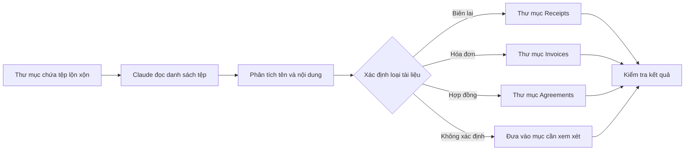
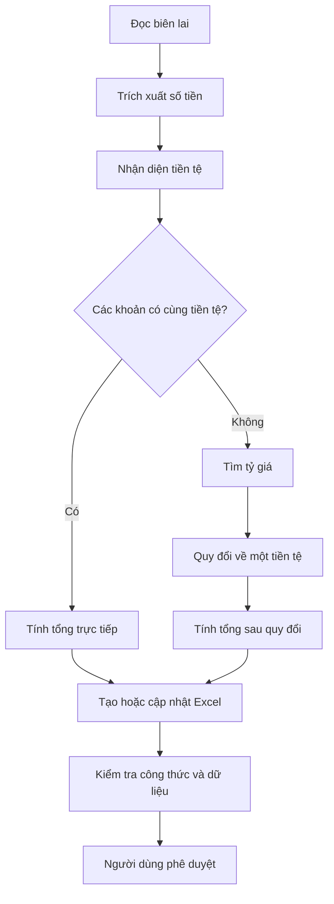
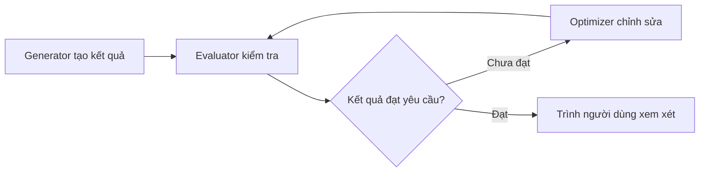
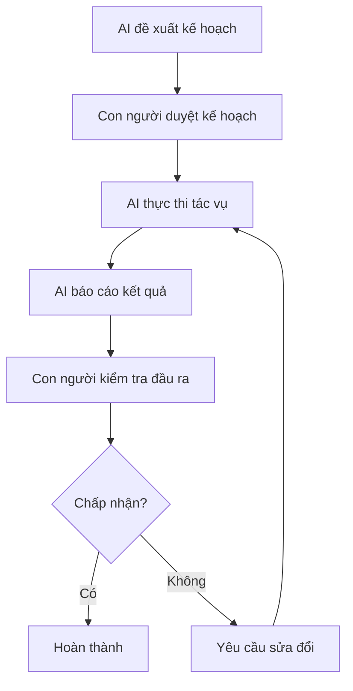

# 007 – Thực hành: Tổ chức tệp và sử dụng kỹ năng Excel

## 1. Thông tin bài học

| Nội dung        | Chi tiết                                                          |
| --------------- | ----------------------------------------------------------------- |
| **Chuyên đề**   | Làm chủ Claude Cowork, Skills và Plugins để tự động hóa quy trình |
| **Tên bài học** | Thực hành tổ chức tệp và sử dụng kỹ năng Excel                    |
| **Hình thức**   | Demo thực hành                                                    |
| **Trọng tâm**   | Quản lý tệp tự động, phân tích bảng tính và kiểm tra kết quả      |
| **Công cụ**     | Claude Cowork, File System, Excel Skill, Web Search               |

---

## 2. Ý tưởng chính

Trong bài học này, chúng ta sử dụng **Claude Cowork** để thực hiện một quy trình tự động hóa gồm hai phần:

1. Phân loại và tổ chức một thư mục chứa nhiều tệp lộn xộn.
2. Đọc dữ liệu từ các hóa đơn, biên lai và tạo bảng tổng hợp bằng Excel.

Claude Cowork có thể làm việc trực tiếp trong một thư mục được người dùng cấp quyền. Tác nhân có khả năng mở tệp Excel, phân tích dữ liệu, tạo tài liệu và thực hiện các tác vụ liên quan đến tệp trên máy tính.

Điểm quan trọng là người dùng không giao toàn quyền kiểm soát cho AI. Những thao tác có khả năng ảnh hưởng đến dữ liệu, chẳng hạn như di chuyển hoặc xóa tệp, cần được người dùng xem xét và phê duyệt.

---

## 3. Mục tiêu học tập

Sau khi hoàn thành bài học, học viên có thể:

* Giao cho Claude một thư mục chứa các tệp chưa được sắp xếp.
* Yêu cầu Claude nhận diện và phân loại tệp theo nội dung.
* Tự động tạo các thư mục như `Receipts`, `Invoices` và `Agreements`.
* Trích xuất số tiền từ biên lai hoặc hóa đơn.
* Tạo bảng Excel tổng hợp dữ liệu.
* Phát hiện dữ liệu sử dụng nhiều loại tiền tệ.
* Chuyển đổi tiền tệ và cập nhật bảng tính.
* Kiểm tra kết quả trước khi chấp nhận các thay đổi.
* Hiểu vai trò của con người trong quy trình tự động hóa bằng AI.

---

# 4. Các khái niệm trọng tâm

## 4.1. Tự động hóa tổ chức tệp

### Khái niệm

Tự động hóa tổ chức tệp là quá trình sử dụng AI để:

* Đọc tên và nội dung tệp.
* Nhận diện loại tài liệu.
* Phân loại tài liệu theo nhóm.
* Tạo cấu trúc thư mục phù hợp.
* Đổi tên, sao chép hoặc di chuyển tệp.
* Báo cáo các tệp không thể xử lý.

Trong ví dụ của bài học, thư mục doanh nghiệp nhỏ chứa ba loại tài liệu:

* Biên lai.
* Hóa đơn.
* Hợp đồng.

Claude được yêu cầu tạo các thư mục tương ứng, sau đó chuyển từng tài liệu vào đúng vị trí. Tác nhân tự xây dựng danh sách công việc gồm đọc tệp, phân loại, tạo thư mục, di chuyển tệp và trích xuất dữ liệu.

### Cấu trúc thư mục ban đầu

```text
Small Business/
├── delta-airlines-receipt.pdf
├── restaurant-receipt.pdf
├── openai-invoice.pdf
├── blue-peak-invoice.pdf
├── software-development-agreement.docx
└── consulting-agreement.docx
```

### Cấu trúc thư mục sau khi tổ chức

```text
Small Business/
├── Receipts/
│   ├── delta-airlines-receipt.pdf
│   └── restaurant-receipt.pdf
│
├── Invoices/
│   ├── openai-invoice.pdf
│   └── blue-peak-invoice.pdf
│
├── Agreements/
│   ├── software-development-agreement.docx
│   └── consulting-agreement.docx
│
└── receipts-summary.xlsx
```

### Quy trình xử lý



### Những tình huống cần lưu ý

#### Tệp đang được mở

Nếu một tài liệu đang mở trong Word hoặc một chương trình khác, Claude có thể không di chuyển được tệp đó.

Trong bản demo, một số tệp Word bị khóa vì đang được mở. Sau khi người dùng đóng các tài liệu, tác nhân mới có thể tiếp tục tổ chức chúng.

#### Di chuyển tệp có thể cần quyền xóa

Ở cấp độ hệ thống tệp, thao tác di chuyển đôi khi được thực hiện theo quy trình:

```text
Sao chép tệp sang thư mục mới
              ↓
Xác minh bản sao
              ↓
Xóa tệp ở vị trí cũ
```

Vì vậy, Claude có thể yêu cầu quyền xóa tệp khỏi thư mục ban đầu. Người dùng cần đọc kỹ yêu cầu trước khi chọn **Allow**.

#### Luôn tạo bản sao lưu

Trước khi giao cho AI thao tác trên một thư mục quan trọng, nên:

* Sao lưu toàn bộ thư mục.
* Thử nghiệm trên bản sao.
* Không cấp quyền cho thư mục hệ thống.
* Kiểm tra danh sách tệp trước và sau khi xử lý.
* Không cho phép xóa vĩnh viễn khi chưa hiểu rõ tác động.

---

## 4.2. Áp dụng kỹ năng Excel

### Excel Skill là gì?

**Excel Skill** là tập hợp các hướng dẫn và khả năng giúp tác nhân AI làm việc với bảng tính, chẳng hạn như:

* Tạo tệp `.xlsx`.
* Đọc dữ liệu trong bảng.
* Viết dữ liệu vào các ô.
* Tạo công thức.
* Tính tổng.
* Định dạng bảng.
* Kiểm tra lỗi công thức.
* Cập nhật dữ liệu hiện có.

Skills có thể được hiểu là các tệp hướng dẫn bằng Markdown mô tả tác nhân phải thực hiện một loại công việc như thế nào. Trong bài học, các skill cho phép Claude tạo PowerPoint, viết bảng tính Excel và xử lý nhiều dạng tài liệu khác.

### Nhiệm vụ trong bản demo

Claude được giao các nhiệm vụ:

1. Tìm tất cả biên lai trong thư mục.
2. Đọc tên doanh nghiệp.
3. Trích xuất số tiền.
4. Nhận diện loại tiền tệ.
5. Ghi dữ liệu vào Excel.
6. Tính tổng.
7. Cảnh báo nếu dữ liệu sử dụng nhiều loại tiền tệ.

### Bảng dữ liệu ban đầu

| Tài liệu   | Đơn vị cung cấp | Số tiền | Tiền tệ |
| ---------- | --------------- | ------: | ------- |
| Biên lai 1 | Delta Airlines  |  607,00 | USD     |
| Biên lai 2 | Nhà hàng        |  305,00 | CAD     |

Claude nhận ra rằng hai khoản tiền sử dụng hai loại tiền tệ khác nhau và cảnh báo rằng không nên cộng trực tiếp USD với CAD.

### Vì sao không được cộng trực tiếp?

Phép tính sau không có ý nghĩa tài chính chính xác:

```text
607 USD + 305 CAD = 912
```

Mặc dù phép cộng số học đúng, kết quả không có một đơn vị tiền tệ thống nhất.

Cần chuyển đổi tất cả các khoản tiền về cùng một loại tiền tệ:

```text
Số tiền quy đổi = Số tiền gốc × Tỷ giá
```

Ví dụ, nếu:

```text
1 USD = 1,43 CAD
```

thì:

```text
607 USD × 1,43 = 868,01 CAD
```

Tổng sau quy đổi:

```text
868,01 CAD + 305 CAD = 1.173,01 CAD
```

> Tỷ giá trên chỉ là ví dụ minh họa. Khi thực hiện công việc thực tế, cần sử dụng tỷ giá hiện hành và ghi rõ thời điểm lấy tỷ giá.

### Bảng Excel sau khi cập nhật

| Nhà cung cấp   | Số tiền gốc | Tiền tệ gốc | Tỷ giá sang CAD |  Số tiền CAD |
| -------------- | ----------: | ----------- | --------------: | -----------: |
| Delta Airlines |      607,00 | USD         |            1,43 |       868,01 |
| Nhà hàng       |      305,00 | CAD         |            1,00 |       305,00 |
| **Tổng cộng**  |             |             |                 | **1.173,01** |

### Công thức Excel có thể sử dụng

Giả sử:

* Cột B chứa số tiền gốc.
* Cột C chứa loại tiền tệ.
* Cột D chứa tỷ giá.
* Cột E chứa số tiền sau quy đổi.

Công thức tại ô `E2`:

```excel
=B2*D2
```

Công thức tổng:

```excel
=SUM(E2:E3)
```

Có thể tự động xử lý khoản tiền đã là CAD:

```excel
=IF(C2="CAD",B2,B2*D2)
```

---

## 4.3. Tìm kiếm tỷ giá và cập nhật bảng tính

Trong bước tiếp theo, người dùng yêu cầu Claude chuyển toàn bộ số tiền USD sang CAD.

Tác nhân thực hiện quy trình:

1. Tìm tỷ giá USD/CAD trên Internet.
2. Nạp kỹ năng xử lý tệp `.xlsx`.
3. Mở bảng tính hiện có.
4. Thêm cột tỷ giá.
5. Tính số tiền sau quy đổi.
6. Cập nhật tổng.
7. Xác minh bảng tính không có lỗi.

Bản demo cho thấy Claude sử dụng Web Search để tìm tỷ giá, sau đó dùng Excel Skill để ghi trực tiếp vào bảng tính.

### Quy trình tổng quát



---

## 4.4. Quy trình kiểm tra đầu ra

Claude không chỉ tạo kết quả mà còn có thể thực hiện một bước đánh giá sau khi hoàn thành.

Quy trình này có thể được mô tả bằng mô hình:

```text
Tạo kết quả
    ↓
Đánh giá kết quả
    ↓
Phát hiện vấn đề
    ↓
Điều chỉnh
    ↓
Kiểm tra lại
```

Trong bài học, tác nhân tạo danh sách công việc bao gồm:

* Đọc và phân loại tệp.
* Tạo thư mục.
* Di chuyển tệp.
* Trích xuất số tiền.
* Tạo bảng tính.
* Kiểm tra tệp Excel có lỗi hay không.

Bước xác minh cuối cùng giúp phát hiện các vấn đề như công thức sai, dữ liệu thiếu hoặc tổng số tiền không hợp lý.

### Evaluator–Optimizer Loop

Có thể hiểu quy trình này gồm hai vai trò:

| Vai trò       | Nhiệm vụ                             |
| ------------- | ------------------------------------ |
| **Generator** | Tạo kết quả ban đầu                  |
| **Evaluator** | Kiểm tra độ chính xác và tính đầy đủ |
| **Optimizer** | Sửa kết quả dựa trên đánh giá        |



Tuy nhiên, việc AI tự đánh giá không đảm bảo kết quả luôn chính xác. Người dùng vẫn phải thực hiện bước kiểm tra độc lập.

---

# 5. Human in the Loop – Con người trong vòng kiểm soát

## 5.1. Khái niệm

**Human in the Loop** là mô hình trong đó AI thực hiện phần lớn công việc, nhưng con người vẫn kiểm soát những quyết định quan trọng.

Trong bản demo, Claude phải xin phép trước khi thực hiện các thao tác có thể làm thay đổi hoặc xóa dữ liệu. Điều này giúp ngăn tác nhân tự ý xóa nhầm tệp.

## 5.2. Những thao tác nên yêu cầu phê duyệt

* Xóa tệp.
* Ghi đè tệp hiện có.
* Đổi tên hàng loạt.
* Di chuyển tài liệu quan trọng.
* Gửi email.
* Chia sẻ dữ liệu ra bên ngoài.
* Truy cập Internet.
* Sử dụng dữ liệu tài chính.
* Thực hiện chuyển đổi tiền tệ.
* Chỉnh sửa bảng tính gốc.

## 5.3. Ba mức kiểm soát



### Mức 1 – Duyệt trước khi thực hiện

Người dùng kiểm tra:

* AI sẽ truy cập thư mục nào?
* AI sẽ tạo thư mục nào?
* Tệp nào sẽ được đổi tên?
* Tệp nào sẽ được di chuyển hoặc xóa?

### Mức 2 – Duyệt trong quá trình thực hiện

AI phải dừng lại khi cần:

* Quyền xóa tệp.
* Quyền truy cập Internet.
* Quyền mở ứng dụng khác.
* Quyền chỉnh sửa tài liệu gốc.

### Mức 3 – Duyệt kết quả cuối cùng

Người dùng kiểm tra:

* Tệp đã nằm đúng thư mục chưa?
* Có tệp nào bị bỏ sót không?
* Dữ liệu được trích xuất chính xác không?
* Đơn vị tiền tệ có đúng không?
* Tỷ giá có nguồn và thời điểm rõ ràng không?
* Công thức Excel có hoạt động không?

---

# 6. Hướng dẫn thực hành

## Bước 1: Chuẩn bị thư mục thử nghiệm

Tạo một thư mục:

```text
Small Business Demo/
```

Thêm vào thư mục:

* Hai biên lai.
* Hai hóa đơn.
* Hai hợp đồng.
* Một số tệp có tên chưa rõ ràng.

Nên sử dụng bản sao của dữ liệu, không sử dụng tài liệu gốc.

---

## Bước 2: Cấp quyền truy cập thư mục

Trong Claude Cowork:

1. Chọn **Choose Folder**.
2. Chọn thư mục `Small Business Demo`.
3. Kiểm tra đúng đường dẫn.
4. Chọn **Allow** để cấp quyền.

Claude Cowork chỉ có thể làm việc với thư mục mà người dùng đã chọn và cho phép truy cập. Trong demo, người dùng chọn thư mục doanh nghiệp nhỏ trên Desktop trước khi bắt đầu tác vụ.

---

## Bước 3: Viết yêu cầu tổ chức tệp

### Prompt mẫu

```text
Hãy kiểm tra tất cả các tệp trong thư mục này.

1. Phân loại các tệp thành:
   - Receipts
   - Invoices
   - Agreements
   - Needs Review

2. Tạo các thư mục tương ứng nếu chúng chưa tồn tại.

3. Lập danh sách tệp và thư mục đích trước khi di chuyển.

4. Không xóa hoặc ghi đè bất kỳ tệp nào nếu chưa có sự cho phép của tôi.

5. Sau khi tôi phê duyệt, hãy di chuyển các tệp vào đúng thư mục.

6. Cuối cùng, hãy báo cáo:
   - Số lượng tệp trong mỗi nhóm.
   - Những tệp không thể phân loại.
   - Những lỗi phát sinh.
```

### Tại sao prompt này an toàn hơn?

Prompt buộc AI:

* Lập kế hoạch trước.
* Không tự ý xóa tệp.
* Tách riêng tài liệu không chắc chắn.
* Báo cáo kết quả sau khi xử lý.
* Chờ người dùng phê duyệt trước thao tác quan trọng.

---

## Bước 4: Yêu cầu tạo bảng tổng hợp Excel

### Prompt mẫu

```text
Hãy đọc tất cả các biên lai trong thư mục Receipts và tạo tệp
receipts-summary.xlsx.

Bảng cần có các cột:

- Tên tệp
- Ngày giao dịch
- Nhà cung cấp
- Mô tả
- Số tiền gốc
- Loại tiền tệ
- Tỷ giá quy đổi
- Tiền tệ đích
- Số tiền sau quy đổi
- Ghi chú

Yêu cầu:

1. Không cộng trực tiếp các khoản tiền khác loại tiền tệ.
2. Đánh dấu các trường không đọc được.
3. Ghi rõ nguồn và thời điểm của tỷ giá.
4. Thêm dòng tổng cộng.
5. Kiểm tra công thức trước khi hoàn thành.
6. Không sửa các tệp biên lai gốc.
```

---

## Bước 5: Kiểm tra bảng tính

Kiểm tra lần lượt:

### Kiểm tra dữ liệu

* Tên nhà cung cấp có đúng không?
* Số tiền có bao gồm thuế không?
* AI có nhầm số tiền tạm tính với tổng tiền không?
* Ngày giao dịch có đúng định dạng không?
* Loại tiền tệ được nhận diện chính xác không?

### Kiểm tra công thức

* Công thức quy đổi có tham chiếu đúng ô không?
* Tỷ giá có bị đảo chiều không?
* Tổng có bao gồm tất cả các dòng không?
* Dữ liệu trống có gây lỗi không?
* Công thức có bị thay thế bằng giá trị tĩnh không?

### Kiểm tra định dạng

* Số tiền có đúng số chữ số thập phân không?
* Cột ngày tháng có định dạng thống nhất không?
* Loại tiền tệ có được ghi rõ không?
* Dòng tổng có dễ nhận biết không?

---

# 7. Mẫu quy trình làm việc an toàn

```text
1. Sao lưu thư mục
2. Cấp quyền cho bản sao
3. Yêu cầu AI phân tích
4. Xem kế hoạch AI đề xuất
5. Phê duyệt thao tác an toàn
6. Từ chối thao tác không rõ ràng
7. Kiểm tra cấu trúc thư mục
8. Kiểm tra bảng Excel
9. Đối chiếu với tài liệu gốc
10. Chỉ chấp nhận sau khi xác minh
```

### Công thức tổng quát

```text
Tự động hóa đáng tin cậy
=
AI thực thi
+
Quyền truy cập có giới hạn
+
Điểm kiểm tra của con người
+
Xác minh kết quả
```

---

# 8. Những rủi ro và hạn chế

## 8.1. Phân loại sai tài liệu

Một hợp đồng có thể bị nhận diện thành hóa đơn nếu trong nội dung có số tiền và điều khoản thanh toán.

**Giải pháp:** tạo thư mục `Needs Review` cho những tệp có độ tin cậy thấp.

---

## 8.2. Trích xuất sai số tiền

Một biên lai có thể chứa:

* Subtotal.
* Tax.
* Tip.
* Total.
* Amount Paid.
* Remaining Balance.

AI có thể lấy nhầm một trong các giá trị trên.

**Giải pháp:** yêu cầu trích xuất cả nhãn và giá trị, sau đó ưu tiên trường `Total` hoặc `Amount Paid`.

---

## 8.3. Cộng sai tiền tệ

Không được cộng trực tiếp USD, CAD, EUR hoặc VND.

**Giải pháp:** chuẩn hóa về một đơn vị tiền tệ trước khi tính tổng.

---

## 8.4. Tỷ giá thay đổi

Tỷ giá có thể khác nhau theo:

* Thời điểm.
* Ngân hàng.
* Nguồn dữ liệu.
* Phí chuyển đổi.
* Tỷ giá mua hoặc bán.

**Giải pháp:** lưu thêm các trường:

```text
exchange_rate
exchange_rate_source
exchange_rate_timestamp
target_currency
```

---

## 8.5. Tệp bị khóa

Tệp đang mở có thể không được đổi tên hoặc di chuyển.

**Giải pháp:** đóng ứng dụng đang sử dụng tệp, sau đó yêu cầu AI thử lại.

---

## 8.6. Nguy cơ mất dữ liệu

Di chuyển, đổi tên hoặc ghi đè hàng loạt có thể gây mất dữ liệu.

**Giải pháp:**

* Luôn dùng thư mục bản sao.
* Không cho phép xóa vĩnh viễn.
* Tạo nhật ký thay đổi.
* Yêu cầu AI xuất kế hoạch trước khi thực hiện.

---

## 8.7. Dữ liệu nhạy cảm

Hóa đơn và hợp đồng có thể chứa:

* Tên khách hàng.
* Địa chỉ.
* Số tài khoản.
* Thông tin thanh toán.
* Điều khoản bảo mật.
* Dữ liệu cá nhân.

**Giải pháp:** kiểm tra chính sách bảo mật và không sử dụng dữ liệu thật trong môi trường thử nghiệm khi chưa được phép.

---

# 9. Ứng dụng thực tế

## Đối với cá nhân

* Sắp xếp biên lai chi tiêu.
* Tổng hợp học phí.
* Quản lý hóa đơn điện, nước và Internet.
* Phân loại tài liệu học tập.
* Tạo báo cáo chi tiêu tháng.

## Đối với doanh nghiệp

* Phân loại hóa đơn nhà cung cấp.
* Tổng hợp chi phí công tác.
* Quản lý hợp đồng.
* Chuẩn bị dữ liệu kế toán.
* Phát hiện hóa đơn trùng lặp.
* Chuẩn hóa tên tệp.
* Tạo báo cáo tài chính sơ bộ.

## Đối với nhóm dự án

* Phân loại tài liệu theo khách hàng.
* Tách hợp đồng, biên bản và báo giá.
* Tạo bảng theo dõi thanh toán.
* Tổng hợp ngân sách.
* Phát hiện tài liệu thiếu thông tin.

---

# 10. Bài tập thực hành

## Bài tập 1: Phân loại tệp

Chuẩn bị 12 tệp gồm:

* 4 biên lai.
* 3 hóa đơn.
* 3 hợp đồng.
* 2 tệp không rõ loại.

Yêu cầu Claude:

* Tạo cấu trúc thư mục.
* Phân loại từng tệp.
* Đưa tệp không chắc chắn vào `Needs Review`.
* Xuất báo cáo kết quả.

---

## Bài tập 2: Tổng hợp chi phí

Tạo bảng Excel gồm các trường:

```text
Date
Vendor
Category
Original Amount
Original Currency
Exchange Rate
Target Currency
Converted Amount
Source File
Notes
```

Sau đó:

* Quy đổi tất cả về VND hoặc USD.
* Tính tổng theo loại chi phí.
* Tính tổng theo tháng.
* Đánh dấu dữ liệu thiếu.

---

## Bài tập 3: Kiểm tra lỗi

Cố tình tạo một số lỗi:

* Một tệp đang mở.
* Một biên lai không có ngày.
* Một hóa đơn có hai số tiền.
* Hai tệp trùng tên.
* Một khoản tiền dùng EUR.
* Một tệp không đọc được.

Quan sát cách Claude xử lý và đánh giá xem tác nhân có yêu cầu người dùng hỗ trợ đúng lúc hay không.

---

# 11. Câu hỏi ôn tập

## Câu 1

Mục đích chính của tự động hóa tổ chức tệp là gì?

**Trả lời:** Giảm công việc thủ công bằng cách để AI đọc, phân loại, đổi tên và sắp xếp tài liệu theo một cấu trúc xác định.

---

## Câu 2

Tại sao không nên cộng trực tiếp 500 USD với 300 CAD?

**Trả lời:** Vì hai khoản tiền sử dụng hai đơn vị khác nhau. Cần quy đổi về cùng một loại tiền tệ trước khi tính tổng.

---

## Câu 3

Excel Skill hỗ trợ Claude thực hiện những công việc nào?

**Trả lời:** Đọc, tạo, chỉnh sửa và kiểm tra bảng tính; trích xuất dữ liệu; tạo công thức; tính tổng; định dạng và xác minh lỗi.

---

## Câu 4

Tại sao cần Human in the Loop?

**Trả lời:** Vì AI có thể phân loại sai, trích xuất sai dữ liệu hoặc thực hiện thao tác ảnh hưởng đến tệp. Con người cần duyệt những hành động quan trọng và kiểm tra đầu ra cuối cùng.

---

## Câu 5

Điều gì có thể xảy ra khi một tệp đang được mở?

**Trả lời:** Hệ điều hành có thể khóa tệp, khiến Claude không thể di chuyển, đổi tên hoặc xóa tệp đó.

---

## Câu 6

Evaluator–Optimizer Loop là gì?

**Trả lời:** Là vòng lặp trong đó một tác nhân tạo kết quả, một bước khác đánh giá kết quả, sau đó hệ thống sửa và kiểm tra lại cho đến khi đạt yêu cầu.

---

# 12. Kết luận

Bài học minh họa một quy trình tự động hóa rất thực tế:

```text
Tệp lộn xộn
    ↓
AI đọc và phân loại
    ↓
Tạo cấu trúc thư mục
    ↓
Trích xuất dữ liệu tài chính
    ↓
Tạo bảng Excel
    ↓
Chuẩn hóa tiền tệ
    ↓
Kiểm tra kết quả
    ↓
Con người phê duyệt
```

Claude Cowork có thể giúp giảm đáng kể thời gian dành cho các tác vụ lặp lại như tổ chức tài liệu và tổng hợp số liệu. Tuy nhiên, hiệu quả của quy trình phụ thuộc vào ba yếu tố:

1. **Yêu cầu rõ ràng:** mô tả chính xác cách phân loại và định dạng đầu ra.
2. **Quyền truy cập có giới hạn:** chỉ cấp quyền cho những thư mục cần thiết.
3. **Kiểm tra của con người:** luôn đối chiếu kết quả với tài liệu gốc.

Nguyên tắc quan trọng nhất là:

> **Hãy để AI thực hiện công việc lặp lại, nhưng con người vẫn phải chịu trách nhiệm kiểm tra và phê duyệt kết quả.**
