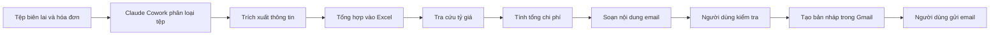
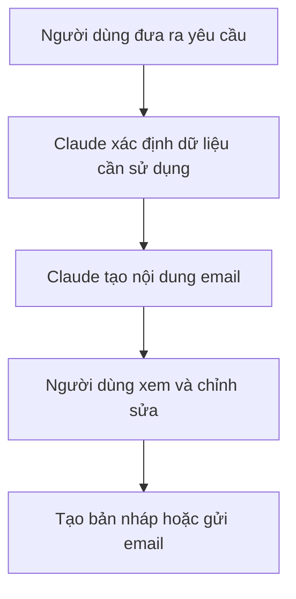
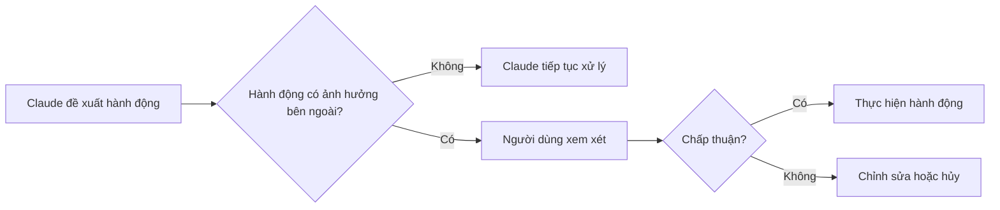
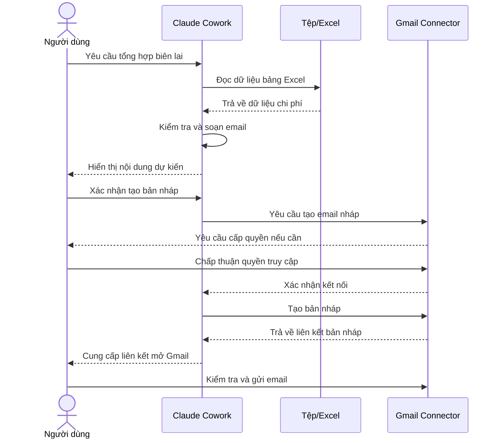
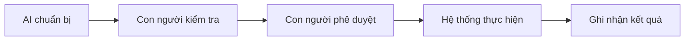

# 009 — Thực hành: Kết nối Gmail và gửi email

## 1. Thông tin bài học

| Thuộc tính         | Nội dung                                                          |
| ------------------ | ----------------------------------------------------------------- |
| **Chuyên đề**      | Làm chủ Claude Cowork, Skills và Plugins để tự động hóa quy trình |
| **Tên bài học**    | Kết nối Gmail và gửi email                                        |
| **Hình thức**      | Thực hành                                                         |
| **Ứng dụng chính** | Gmail Connector                                                   |
| **Mức độ**         | Cơ bản                                                            |
| **Đầu ra**         | Một email nháp chứa nội dung tổng hợp từ dữ liệu công việc        |

---

## 2. Ý tưởng chính

Bài học hướng dẫn cách kết nối Gmail với Claude Cowork và sử dụng dữ liệu đã được xử lý trong một tác vụ trước đó để soạn email.

Trong ví dụ minh họa, Claude đã:

1. Phân loại các tệp biên lai, hóa đơn và hợp đồng.
2. Tạo các thư mục tương ứng.
3. Trích xuất dữ liệu từ biên lai.
4. Tổng hợp dữ liệu vào một bảng tính Excel.
5. Tra cứu tỷ giá chuyển đổi từ USD sang CAD.
6. Tính tổng chi phí.
7. Sử dụng Gmail Connector để tạo một email tóm tắt.

Điểm quan trọng nhất là Claude không chỉ tạo nội dung email mà còn có thể chuyển nội dung đó thành một bản nháp trực tiếp trong Gmail để người dùng kiểm tra trước khi gửi.

---

## 3. Mục tiêu học tập

Sau khi hoàn thành bài học, người học có thể:

* Kết nối tài khoản Gmail với Claude Cowork.
* Hiểu cách Claude sử dụng các dịch vụ được kết nối.
* Yêu cầu Claude tìm và sử dụng dữ liệu từ tệp hoặc tác vụ trước đó.
* Soạn email dựa trên dữ liệu trong Excel.
* Tạo email nháp trực tiếp trong Gmail.
* Phân biệt giữa thao tác **tạo bản nháp** và **gửi email**.
* Kiểm tra nội dung trước khi cho phép Claude thực hiện hành động.
* Hiểu vai trò của con người trong quy trình tự động hóa.

---

# 4. Bối cảnh của bài thực hành

Ở bài thực hành trước, Claude Cowork đã được yêu cầu tổ chức một thư mục chứa nhiều loại tài liệu khác nhau.

Claude đã phân loại các tệp thành những nhóm như:

```text
Tài liệu ban đầu
├── Biên lai
├── Hóa đơn
├── Hợp đồng
└── Tệp khác
```

Sau đó, Claude trích xuất thông tin từ các biên lai và đưa chúng vào một bảng tính.

Ví dụ, bảng tính có thể chứa các cột:

| Ngày  | Nhà cung cấp   | Loại chi phí   | Số tiền gốc | Loại tiền | Số tiền quy đổi |
| ----- | -------------- | -------------- | ----------: | --------- | --------------: |
| 02/01 | Nhà cung cấp A | Văn phòng phẩm |         250 | USD       |         340 CAD |
| 05/01 | Nhà cung cấp B | Phần mềm       |         400 | USD       |         544 CAD |
| 08/01 | Nhà cung cấp C | Di chuyển      |         216 | CAD       |         216 CAD |

Claude cũng có thể sử dụng công cụ tìm kiếm để lấy tỷ giá và thực hiện chuyển đổi tiền tệ.

Tổng số tiền trong ví dụ minh họa vào khoảng:

> **1.178 CAD**

Bước tiếp theo là sử dụng kết quả này để tạo email báo cáo.

---

# 5. Sơ đồ tổng thể của quy trình



Quy trình trên kết hợp ba nhóm năng lực:

* Làm việc với tệp.
* Xử lý và tổng hợp dữ liệu.
* Tương tác với dịch vụ bên ngoài thông qua Connector.

---

# 6. Khái niệm trọng tâm

## 6.1. Thiết lập Gmail Connector

### Gmail Connector là gì?

Gmail Connector là cầu nối cho phép Claude tương tác với Gmail sau khi người dùng cấp quyền.

Thông qua Connector, Claude có thể thực hiện một số tác vụ như:

* Tìm kiếm email liên quan.
* Đọc thông tin cần thiết trong email.
* Soạn nội dung email.
* Tạo bản nháp trong Gmail.
* Gửi email khi được người dùng cho phép.

Connector không có nghĩa là Claude tự động được toàn quyền truy cập tài khoản. Người dùng vẫn phải:

1. Chủ động kết nối tài khoản.
2. Đăng nhập Google.
3. Xem các quyền được yêu cầu.
4. Chấp thuận hoặc từ chối quyền truy cập.
5. Xác nhận những hành động quan trọng.

---

## 6.2. Quy trình soạn email

Một quy trình soạn email bằng Claude thường gồm năm bước:



Trong bài thực hành này, Claude phải hiểu được rằng:

* “Bản tổng hợp” là bảng Excel đã được tạo trước đó.
* Nội dung cần gửi là tổng số tiền của các biên lai.
* Gmail là công cụ cần sử dụng.
* Địa chỉ email do người dùng cung cấp là người nhận.
* Người dùng cần có cơ hội xem lại nội dung trước khi gửi.

---

## 6.3. Human-in-the-loop

**Human-in-the-loop** là mô hình trong đó con người vẫn tham gia kiểm tra hoặc phê duyệt những hành động quan trọng do AI đề xuất.

Trong quy trình email, Claude có thể:

* Tìm dữ liệu.
* Tính toán.
* Viết nội dung.
* Chuẩn bị bản nháp.

Tuy nhiên, con người nên kiểm tra:

* Địa chỉ người nhận.
* Chủ đề email.
* Nội dung email.
* Số liệu tài chính.
* Tệp đính kèm.
* Thông tin riêng tư hoặc nhạy cảm.
* Giọng điệu của email.
* Quyền truy cập mà Claude đang yêu cầu.

### Mô hình kiểm soát



Việc gửi email là một hành động có ảnh hưởng bên ngoài, vì vậy nên có bước xác nhận.

---

# 7. Các bước thực hành chi tiết

## Bước 1: Mở phần cài đặt của Claude

Trong giao diện Claude:

1. Nhấp vào tên hoặc ảnh đại diện của tài khoản.
2. Chọn **Settings**.
3. Tìm mục quản lý tài khoản và dịch vụ kết nối.

Tại đây, người dùng có thể xem các thông tin như:

* Gói tài khoản.
* Mức sử dụng hiện tại.
* Giới hạn sử dụng theo tuần.
* Các Connector đã được kích hoạt.
* Quyền truy cập của từng Connector.

> Giới hạn sử dụng có thể khác nhau tùy thuộc vào gói tài khoản và chính sách tại thời điểm sử dụng.

---

## Bước 2: Mở mục Connectors

Trong trang cài đặt, chọn:

```text
Settings → Connectors
```

Khu vực này có thể hiển thị các dịch vụ như:

* Gmail.
* Google Calendar.
* GitHub.
* Google Drive.
* Các dịch vụ bên ngoài khác.

Connector giúp Claude trao đổi dữ liệu với các hệ thống bên ngoài thông qua một giao diện được kiểm soát.

---

## Bước 3: Kết nối Gmail

Tại Gmail Connector:

1. Nhấn **Connect**.
2. Chọn **Continue** khi hệ thống yêu cầu xác nhận.
3. Chọn tài khoản Google cần kết nối.
4. Đọc các quyền truy cập được yêu cầu.
5. Chọn **Allow** hoặc **Continue** để cấp quyền.

Sau khi hoàn tất, Gmail sẽ xuất hiện trong danh sách các dịch vụ đã kết nối.

Ví dụ:

```text
Connected services
├── GitHub — Connected
├── Gmail — Connected
└── Google Calendar — Not connected
```

Người dùng thường có thể:

* Xem chi tiết kết nối.
* Kết nối lại tài khoản.
* Hủy quyền truy cập.
* Ngắt kết nối dịch vụ.

---

## Bước 4: Quay lại tác vụ chứa bảng Excel

Sau khi kết nối Gmail, quay lại phiên làm việc trước đó — nơi Claude đã:

* Sắp xếp các tệp.
* Trích xuất thông tin biên lai.
* Tạo bảng tổng hợp.
* Tính tổng chi phí.

Việc tiếp tục trong cùng một không gian làm việc giúp Claude hiểu được cụm từ như:

* “Bảng tính vừa tạo”.
* “Tổng số tiền vừa tính”.
* “Các biên lai trước đó”.
* “Bản tổng hợp chi phí”.

Nếu mở một phiên làm việc hoàn toàn mới, người dùng nên chỉ rõ tên tệp hoặc cung cấp lại tệp cần sử dụng.

---

## Bước 5: Viết yêu cầu cho Claude

Một câu lệnh cơ bản có thể là:

```text
Hãy soạn một email tóm tắt tổng số tiền của tất cả các biên lai
trong bảng tính vừa tạo và gửi bản tóm tắt tới địa chỉ email của tôi.
Trước khi gửi, hãy cho tôi xem nội dung để kiểm tra.
```

Một câu lệnh rõ ràng hơn:

```text
Hãy sử dụng bảng Excel tổng hợp biên lai vừa tạo để viết một email báo cáo.

Yêu cầu:
- Tóm tắt số lượng biên lai.
- Nêu tổng số tiền theo CAD.
- Nhắc rằng các khoản USD đã được quy đổi sang CAD.
- Trình bày ngắn gọn, chuyên nghiệp.
- Tạo bản nháp trong Gmail.
- Không gửi email cho đến khi tôi xác nhận.
```

---

## Bước 6: Claude lập kế hoạch thực hiện

Sau khi nhận lệnh, Claude có thể tạo kế hoạch như sau:

```text
1. Xác định bảng tính tổng hợp biên lai.
2. Đọc các số liệu cần thiết.
3. Kiểm tra tổng số tiền.
4. Soạn chủ đề email.
5. Viết nội dung email.
6. Hiển thị email để người dùng xem.
7. Tạo bản nháp trong Gmail sau khi được chấp thuận.
```

Kế hoạch giúp người dùng hiểu:

* Claude đang sử dụng nguồn dữ liệu nào.
* Công cụ nào sẽ được gọi.
* Hành động nào sắp được thực hiện.
* Hành động nào cần cấp quyền.

---

## Bước 7: Kiểm tra nội dung email

Claude có thể tạo một email tương tự:

```text
Chủ đề: Tổng hợp chi phí biên lai

Chào Ryan,

Dưới đây là bản tổng hợp các biên lai kinh doanh đã được xử lý.

Tổng chi phí sau khi quy đổi sang đô la Canada là khoảng 1.178 CAD.
Các khoản chi bằng USD đã được quy đổi sang CAD theo tỷ giá được
tra cứu tại thời điểm lập báo cáo.

Thông tin chi tiết được lưu trong bảng tính tổng hợp biên lai.

Trân trọng,
Ryan
```

Trước khi xác nhận, cần kiểm tra:

| Hạng mục     | Câu hỏi kiểm tra                                    |
| ------------ | --------------------------------------------------- |
| Người nhận   | Địa chỉ email có chính xác không?                   |
| Chủ đề       | Chủ đề có rõ nội dung không?                        |
| Số liệu      | Tổng số tiền có khớp bảng tính không?               |
| Loại tiền    | Đã ghi đúng CAD, USD hoặc loại tiền liên quan chưa? |
| Tỷ giá       | Có cần nêu ngày áp dụng tỷ giá không?               |
| Tệp đính kèm | Bảng Excel có cần được đính kèm không?              |
| Giọng điệu   | Nội dung có phù hợp với người nhận không?           |
| Bảo mật      | Email có chứa dữ liệu nhạy cảm không?               |

---

## Bước 8: Cấp quyền cho hành động Gmail

Khi Claude chuẩn bị truy cập Gmail, giao diện có thể yêu cầu người dùng:

* Cho phép một lần.
* Luôn cho phép đối với loại hành động này.
* Từ chối.
* Kết nối lại Gmail.

Ví dụ:

```text
Claude muốn sử dụng Gmail để tạo một email nháp.
```

Người dùng cần xem kỹ loại hành động:

```text
Tạo bản nháp  ≠  Gửi email
```

### So sánh hai hành động

| Hành động        | Ảnh hưởng                                     |
| ---------------- | --------------------------------------------- |
| **Tạo bản nháp** | Email được lưu trong Gmail nhưng chưa gửi     |
| **Gửi email**    | Email được chuyển đến người nhận ngay lập tức |

Trong môi trường học tập hoặc công việc, nên ưu tiên tạo bản nháp trước.

---

## Bước 9: Kết nối lại khi phiên xác thực hết hạn

Trong quá trình thực hành, Gmail có thể yêu cầu kết nối lại do:

* Phiên đăng nhập đã hết hạn.
* Quyền truy cập chưa được cấp đầy đủ.
* Trình duyệt chặn cửa sổ xác thực.
* Tài khoản Google đã thay đổi.
* Connector vừa được kích hoạt nhưng chưa đồng bộ.
* Quyền truy cập đã bị thu hồi.

Khi đó:

1. Chọn **Reconnect Gmail**.
2. Đăng nhập lại tài khoản Google.
3. Chọn đúng tài khoản.
4. Xem và cấp lại quyền.
5. Quay lại Claude để tiếp tục tác vụ.

Đây là một bước xác thực thông thường và không nhất thiết có nghĩa là tác vụ bị lỗi hoàn toàn.

---

## Bước 10: Mở bản nháp trong Gmail

Sau khi tạo thành công, Claude có thể hiển thị một liên kết như:

```text
Open your draft in Gmail
```

Khi mở liên kết, người dùng sẽ thấy email nháp trong Gmail.

Tại đây có thể:

* Chỉnh sửa chủ đề.
* Chỉnh sửa nội dung.
* Thêm người nhận.
* Thêm CC hoặc BCC.
* Đính kèm bảng Excel.
* Kiểm tra số liệu lần cuối.
* Nhấn **Send** để gửi.

---

# 8. Quy trình hoàn chỉnh



---

# 9. Cấu trúc một câu lệnh tốt

Một câu lệnh tự động hóa email nên có các thành phần sau:

```text
Nguồn dữ liệu
+ Nội dung cần tổng hợp
+ Người nhận
+ Định dạng email
+ Hành động được phép
+ Điểm dừng để kiểm tra
```

## Công thức

```text
Hãy sử dụng [nguồn dữ liệu]
để tạo [nội dung email]
gửi cho [người nhận].

Email cần có [các thông tin bắt buộc].
Hãy sử dụng giọng điệu [phong cách].
Chỉ tạo bản nháp và chờ tôi kiểm tra trước khi gửi.
```

## Ví dụ

```text
Hãy sử dụng tệp Receipt Summary.xlsx để tạo email báo cáo cho bộ phận kế toán.

Email cần:
- Nêu tổng số biên lai.
- Nêu tổng chi phí bằng CAD.
- Giải thích rằng các khoản USD đã được quy đổi.
- Có phần ghi chú về tỷ giá.
- Có tiêu đề ngắn gọn.
- Có bảng tóm tắt nếu phù hợp.

Hãy tạo bản nháp trong Gmail và không gửi cho đến khi tôi xác nhận.
```

---

# 10. Các cấp độ tự động hóa

## Cấp độ 1: Chỉ tạo nội dung

Claude viết email nhưng không truy cập Gmail.

```text
Dữ liệu → Claude viết email → Người dùng sao chép vào Gmail
```

### Ưu điểm

* An toàn.
* Không cần cấp quyền Gmail.
* Người dùng kiểm soát toàn bộ.

### Hạn chế

* Cần sao chép nội dung thủ công.
* Không tối ưu cho quy trình lặp lại.

---

## Cấp độ 2: Tạo bản nháp

Claude tạo nội dung và lưu trực tiếp vào Gmail Drafts.

```text
Dữ liệu → Claude viết email → Tạo Gmail Draft → Người dùng gửi
```

Đây là mức phù hợp với phần lớn công việc chuyên nghiệp vì cân bằng giữa:

* Tốc độ.
* Khả năng tự động hóa.
* Sự kiểm soát của con người.

---

## Cấp độ 3: Tự động gửi

Claude soạn và gửi email mà không yêu cầu xác nhận từng lần.

```text
Dữ liệu → Claude viết email → Tự động gửi
```

Mức này chỉ nên được sử dụng khi:

* Quy trình đã được kiểm thử kỹ.
* Người nhận được giới hạn rõ ràng.
* Nội dung có mẫu cố định.
* Dữ liệu đầu vào đáng tin cậy.
* Hậu quả của sai sót ở mức thấp.
* Có cơ chế ghi log và kiểm tra.

---

# 11. Vì sao không nên loại bỏ con người quá sớm?

Trong video, người hướng dẫn đề cập rằng có thể giảm hoặc loại bỏ bước con người xác nhận.

Tuy nhiên, việc tự động gửi email có thể gây ra các rủi ro:

* Gửi nhầm người.
* Gửi sai số liệu.
* Gửi nhầm tệp.
* Làm lộ dữ liệu tài chính.
* Sử dụng tỷ giá không phù hợp.
* Viết sai tên người nhận.
* Dùng giọng điệu không phù hợp.
* Gửi nội dung chưa hoàn thiện.
* Tạo ra cam kết ngoài ý muốn.
* Gửi email lặp lại nhiều lần.

Do đó, quy trình an toàn nên là:



---

# 12. Thực hành tốt về quyền truy cập

## 12.1. Cấp quyền tối thiểu

Chỉ cấp những quyền cần thiết cho công việc.

Ví dụ, nếu mục tiêu là tạo bản nháp thì không nên tự động cấp quyền gửi email trong mọi tình huống nếu chưa cần thiết.

---

## 12.2. Kiểm tra tài khoản đang kết nối

Trước khi xác nhận, cần kiểm tra:

* Đúng tài khoản Gmail cá nhân hay công việc chưa?
* Có đang sử dụng tài khoản chứa dữ liệu nhạy cảm không?
* Email sẽ được gửi dưới danh nghĩa tài khoản nào?
* Connector có đang sử dụng đúng hồ sơ trình duyệt không?

---

## 12.3. Hạn chế sử dụng “Always allow”

Tùy chọn **Always allow** giúp giảm số lần xác nhận, nhưng đồng thời làm giảm một lớp kiểm soát.

Nên sử dụng khi:

* Tác vụ được thực hiện thường xuyên.
* Loại hành động có rủi ro thấp.
* Phạm vi truy cập rõ ràng.
* Quy trình đã được thử nghiệm.
* Người dùng hiểu quyền đang được cấp.

Không nên sử dụng khi:

* Tác vụ liên quan đến dữ liệu tài chính.
* Email gửi cho khách hàng.
* Nội dung mang tính pháp lý.
* Người nhận thay đổi liên tục.
* AI có thể tự xác định người nhận.
* Hành động không thể dễ dàng hoàn tác.

---

## 12.4. Ngắt kết nối khi không còn sử dụng

Sau khi hoàn tất dự án, người dùng có thể quay lại:

```text
Settings → Connectors → Gmail → Disconnect
```

Điều này giúp giảm các quyền truy cập không còn cần thiết.

---

# 13. Những lỗi thường gặp

## 13.1. Gmail chưa được kết nối

### Dấu hiệu

* Claude không thể tạo bản nháp.
* Hệ thống yêu cầu kích hoạt Gmail Connector.
* Không xuất hiện hành động Gmail trong kế hoạch.

### Cách xử lý

* Mở Settings.
* Chọn Connectors.
* Kết nối Gmail.
* Quay lại tác vụ và thực hiện lại.

---

## 13.2. Gmail yêu cầu kết nối lại

### Nguyên nhân

* Phiên đăng nhập hết hạn.
* Quyền truy cập bị thu hồi.
* Thay đổi mật khẩu.
* Thay đổi tài khoản Google.
* Cookie hoặc cửa sổ xác thực bị chặn.

### Cách xử lý

* Chọn Reconnect.
* Đăng nhập lại.
* Kiểm tra đúng tài khoản.
* Cấp lại quyền cần thiết.

---

## 13.3. Claude sử dụng sai bảng tính

### Nguyên nhân

* Có nhiều tệp Excel trong thư mục.
* Tên tệp không rõ ràng.
* Người dùng chỉ nói “bảng vừa tạo”.
* Tác vụ được thực hiện trong phiên mới.

### Cách xử lý

Nêu chính xác tên tệp:

```text
Hãy sử dụng tệp Receipt Summary.xlsx trong thư mục Reports.
```

---

## 13.4. Số liệu trong email không chính xác

### Nguyên nhân

* Tổng tiền chưa bao gồm tất cả dòng.
* Loại tiền bị trộn lẫn.
* Tỷ giá được áp dụng sai.
* Một số biên lai bị trùng.
* Một số dòng không được trích xuất.
* Làm tròn số không thống nhất.

### Cách xử lý

Yêu cầu Claude:

```text
Trước khi viết email, hãy kiểm tra lại tổng số tiền bằng cách cộng
các dòng trong bảng và cho biết số dòng đã được tính.
```

---

## 13.5. Claude gửi email thay vì tạo bản nháp

Để tránh nhầm lẫn, câu lệnh phải nêu rõ:

```text
Chỉ tạo bản nháp. Không gửi email cho đến khi tôi xác nhận bằng một yêu cầu riêng.
```

---

## 13.6. Thiếu tệp đính kèm

Việc Claude sử dụng dữ liệu trong bảng tính không đồng nghĩa với việc bảng tính tự động được đính kèm vào email.

Cần ghi rõ:

```text
Hãy đính kèm tệp Receipt Summary.xlsx vào bản nháp email.
```

Sau khi tạo bản nháp, vẫn nên kiểm tra lại tệp đính kèm trong Gmail.

---

# 14. Mẫu quy trình áp dụng trong công việc

## 14.1. Báo cáo chi phí hàng tháng

```text
Biên lai
→ Trích xuất dữ liệu
→ Phân loại chi phí
→ Quy đổi tiền tệ
→ Tính tổng
→ Tạo báo cáo Excel
→ Soạn email
→ Quản lý phê duyệt
→ Gửi phòng kế toán
```

---

## 14.2. Gửi báo cáo bán hàng

```text
Dữ liệu CRM
→ Tổng hợp doanh thu
→ So sánh mục tiêu
→ Xác định vấn đề
→ Tạo bảng tóm tắt
→ Soạn email cho quản lý
→ Kiểm tra
→ Gửi
```

---

## 14.3. Theo dõi hóa đơn quá hạn

```text
Danh sách hóa đơn
→ Lọc hóa đơn quá hạn
→ Tìm thông tin khách hàng
→ Tạo email nhắc thanh toán
→ Tạo bản nháp
→ Nhân viên kiểm tra
→ Gửi cho khách hàng
```

---

## 14.4. Gửi biên bản cuộc họp

```text
Nội dung cuộc họp
→ Tóm tắt quyết định
→ Trích xuất nhiệm vụ
→ Xác định người phụ trách
→ Viết email
→ Tạo bản nháp
→ Người tổ chức kiểm tra
→ Gửi cho người tham dự
```

---

# 15. Giá trị của bài học

Tự động hóa email là một trong những trường hợp sử dụng có giá trị cao vì email xuất hiện trong hầu hết các quy trình công việc.

Claude Cowork có thể giúp giảm thời gian ở các công đoạn:

* Tìm kiếm thông tin.
* Đọc tài liệu.
* Tổng hợp dữ liệu.
* Kiểm tra dữ liệu.
* Viết email.
* Định dạng nội dung.
* Tạo bản nháp.
* Chuẩn bị tệp đính kèm.

Thay vì thực hiện thủ công:

```text
Mở bảng tính
→ Đọc từng dòng
→ Tính tổng
→ Mở Gmail
→ Viết email
→ Sao chép số liệu
→ Đính kèm tệp
→ Gửi
```

Người dùng có thể chuyển sang:

```text
Cung cấp mục tiêu
→ Claude chuẩn bị
→ Người dùng kiểm tra
→ Gửi
```

Giá trị lớn nhất không chỉ nằm ở việc viết email nhanh hơn mà ở khả năng nối nhiều bước thành một quy trình thống nhất.

---

# 16. Những điểm cần ghi nhớ

1. Gmail phải được kết nối trước khi Claude có thể tạo bản nháp hoặc gửi email.
2. Người dùng cần xem kỹ các quyền truy cập được yêu cầu.
3. Cần chỉ rõ nguồn dữ liệu mà Claude phải sử dụng.
4. Tạo bản nháp an toàn hơn gửi tự động.
5. Phải kiểm tra người nhận, số liệu và tệp đính kèm.
6. Không nên loại bỏ bước xác nhận trong các tác vụ quan trọng.
7. Connector có thể yêu cầu kết nối lại khi phiên xác thực hết hạn.
8. “Luôn cho phép” chỉ nên dùng với các quy trình đã được kiểm thử.
9. AI có thể tự động hóa thao tác, nhưng trách nhiệm cuối cùng vẫn thuộc về người dùng.
10. Một câu lệnh rõ ràng sẽ tạo ra kết quả chính xác và an toàn hơn.

---

# 17. Câu hỏi ôn tập

## Câu 1

Gmail Connector có vai trò gì trong Claude Cowork?

**Trả lời:**
Gmail Connector cho phép Claude tương tác với Gmail sau khi được người dùng cấp quyền, chẳng hạn như tìm kiếm email, soạn nội dung, tạo bản nháp hoặc gửi email.

---

## Câu 2

Tại sao nên yêu cầu Claude tạo bản nháp thay vì gửi email ngay?

**Trả lời:**
Bản nháp cho phép người dùng kiểm tra địa chỉ người nhận, nội dung, số liệu, tệp đính kèm và giọng điệu trước khi email được gửi ra ngoài.

---

## Câu 3

Human-in-the-loop là gì?

**Trả lời:**
Đây là mô hình trong đó con người tham gia kiểm tra, chỉnh sửa hoặc phê duyệt các hành động quan trọng trước khi AI thực hiện.

---

## Câu 4

Claude có thể tự động hiểu “bảng tính vừa tạo” trong mọi tình huống không?

**Trả lời:**
Không. Claude có thể hiểu tốt khi tác vụ được tiếp tục trong cùng một phiên hoặc không gian làm việc. Trong phiên mới, nên chỉ rõ tên và vị trí của tệp.

---

## Câu 5

Điểm khác nhau giữa tạo bản nháp và gửi email là gì?

**Trả lời:**
Tạo bản nháp chỉ lưu email trong Gmail để kiểm tra, còn gửi email sẽ chuyển nội dung trực tiếp đến người nhận.

---

## Câu 6

Tại sao Connector có thể yêu cầu kết nối lại?

**Trả lời:**
Có thể do phiên xác thực hết hạn, quyền truy cập bị thay đổi, tài khoản Google đã được chuyển đổi hoặc trình duyệt chưa hoàn tất quá trình xác thực.

---

## Câu 7

Khi nào có thể cân nhắc sử dụng tùy chọn “Always allow”?

**Trả lời:**
Khi quy trình đã được kiểm thử, phạm vi hành động rõ ràng, tác vụ có rủi ro thấp và người dùng hiểu đầy đủ quyền đang cấp.

---

## Câu 8

Những thông tin nào cần được kiểm tra trước khi gửi email tài chính?

**Trả lời:**
Cần kiểm tra người nhận, tổng số tiền, loại tiền, tỷ giá, thời điểm áp dụng tỷ giá, dữ liệu nguồn và tệp đính kèm.

---

# 18. Bài tập thực hành

## Bài tập 1: Tạo email báo cáo chi phí

Chuẩn bị một bảng tính có các cột:

* Ngày.
* Loại chi phí.
* Nhà cung cấp.
* Số tiền.
* Loại tiền.
* Ghi chú.

Yêu cầu Claude:

1. Tính tổng chi phí.
2. Phân loại chi phí.
3. Viết email tóm tắt.
4. Tạo bản nháp trong Gmail.
5. Không gửi email khi chưa được xác nhận.

---

## Bài tập 2: Kiểm tra lỗi dữ liệu

Thêm vào bảng tính:

* Một dòng bị trùng.
* Một dòng thiếu loại tiền.
* Một dòng có số tiền bất thường.

Yêu cầu Claude:

```text
Hãy kiểm tra dữ liệu trước khi tạo email. Liệt kê các dòng có thể
bị lỗi và không gửi email cho đến khi các lỗi được xử lý.
```

Mục tiêu của bài tập là hiểu rằng tự động hóa tốt phải bao gồm bước kiểm tra dữ liệu, không chỉ tạo đầu ra.

---

## Bài tập 3: Thiết kế quy trình phê duyệt

Thiết kế quy trình:

```text
Claude tạo báo cáo
→ Claude tạo bản nháp
→ Nhân viên kiểm tra
→ Quản lý phê duyệt
→ Email được gửi
```

Xác định:

* Ai là người kiểm tra số liệu?
* Ai có quyền gửi?
* Khi nào cần sửa?
* Hành động nào có thể tự động hóa?
* Hành động nào bắt buộc phải có con người?

---

# 19. Mẫu prompt hoàn chỉnh

```text
Hãy sử dụng bảng Excel tổng hợp biên lai trong tác vụ hiện tại để
chuẩn bị một email báo cáo chi phí.

Trước khi viết email:
1. Kiểm tra số lượng biên lai.
2. Kiểm tra có dòng nào bị trùng hoặc thiếu dữ liệu hay không.
3. Tính lại tổng số tiền.
4. Xác nhận tất cả các khoản tiền đã được quy đổi sang CAD.
5. Ghi rõ tỷ giá hoặc ngày áp dụng tỷ giá nếu dữ liệu có sẵn.

Email cần:
- Có chủ đề rõ ràng.
- Có lời chào chuyên nghiệp.
- Nêu tổng số biên lai.
- Nêu tổng chi phí bằng CAD.
- Tóm tắt các nhóm chi phí chính.
- Nhắc đến tệp Excel chi tiết.
- Có lời kết ngắn gọn.

Hãy tạo bản nháp trong Gmail và đính kèm bảng Excel.
Không gửi email cho đến khi tôi kiểm tra và đưa ra yêu cầu gửi riêng.
```

---

# 20. Tóm tắt bài học

Bài học minh họa cách Claude Cowork kết nối một quy trình xử lý tệp với Gmail.

Quy trình bắt đầu từ các biên lai và hóa đơn, sau đó Claude phân loại tài liệu, trích xuất dữ liệu, tạo bảng Excel, tra cứu tỷ giá, tính tổng chi phí và viết email báo cáo.

Sau khi Gmail Connector được kích hoạt, Claude có thể tạo email nháp trực tiếp trong Gmail. Người dùng mở bản nháp, kiểm tra nội dung và quyết định có gửi hay không.

Mô hình được khuyến nghị là:

```text
AI xử lý dữ liệu
→ AI chuẩn bị email
→ Con người kiểm tra
→ Con người phê duyệt
→ Hệ thống gửi
```

Đây là một mẫu tự động hóa có thể áp dụng ngay cho nhiều công việc như:

* Báo cáo chi phí.
* Báo cáo bán hàng.
* Theo dõi hóa đơn.
* Nhắc thanh toán.
* Gửi biên bản cuộc họp.
* Báo cáo tiến độ dự án.
* Gửi tài liệu cho khách hàng hoặc đồng nghiệp.

> **Nguyên tắc cốt lõi:** Hãy để AI giảm công việc thủ công, nhưng luôn duy trì sự kiểm soát của con người đối với những hành động có ảnh hưởng ra bên ngoài.
