# 010 – Nền tảng về Token và Cửa sổ ngữ cảnh

## 1. Thông tin bài học

| Nội dung      | Chi tiết                                                        |
| ------------- | --------------------------------------------------------------- |
| **Chuyên đề** | Claude Cowork, Skills & Plugins Mastery for Workflow Automation |
| **Chủ đề**    | Token và cửa sổ ngữ cảnh                                        |
| **Mức độ**    | Nền tảng                                                        |
| **Ứng dụng**  | Claude Cowork, kỹ năng, plugin, MCP, agent và dự án dài hạn     |

---

## 2. Ý tưởng chính

**Token** và **cửa sổ ngữ cảnh** là hai khái niệm nền tảng giúp chúng ta hiểu cách mô hình ngôn ngữ lớn tiếp nhận, xử lý và tạo ra nội dung.

Việc hiểu rõ hai khái niệm này giúp người dùng:

* Quản lý lượng thông tin gửi vào mô hình.
* Hạn chế vượt quá giới hạn ngữ cảnh.
* Kiểm soát chi phí sử dụng API.
* Xây dựng quy trình làm việc dài hạn hiệu quả hơn.
* Điều phối nhiều AI agent trong một hệ thống.
* Tổ chức tài liệu, kỹ năng và công cụ hợp lý.

---

## 3. Mục tiêu học tập

Sau khi hoàn thành bài học, người học có thể:

1. Giải thích token là gì.
2. Hiểu cách văn bản được chia thành token.
3. Phân biệt từ, ký tự, token và token ID.
4. Giải thích cửa sổ ngữ cảnh là gì.
5. Nhận biết những thành phần chiếm không gian ngữ cảnh.
6. Hiểu ảnh hưởng của token đến chi phí và hiệu suất.
7. Áp dụng các chiến lược quản lý ngữ cảnh cho dự án dài hạn.
8. Hiểu vì sao AI agent không thể luôn đọc toàn bộ dữ liệu cùng lúc.

---

# Phần I – Token là gì?

## 4. Định nghĩa token

**Token** là một đơn vị văn bản mà mô hình ngôn ngữ sử dụng để xử lý và tạo ra ngôn ngữ.

Một token có thể là:

* Một từ hoàn chỉnh.
* Một phần của từ.
* Một ký tự.
* Một dấu câu.
* Một khoảng trắng kết hợp với từ.
* Một chuỗi ký hiệu đặc biệt.

Mô hình AI không trực tiếp “nhìn thấy” câu chữ giống con người. Trước khi xử lý, văn bản sẽ được chia thành các token và chuyển thành các con số.

---

## 5. Quy trình token hóa

Quá trình biến văn bản thành token được gọi là **tokenization – token hóa**.

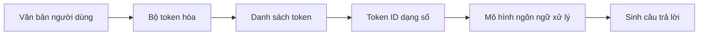

### Ví dụ

Người dùng nhập:

> Welcome to the bootcamp!

Hệ thống có thể chia câu này thành các token gần giống như sau:

```text
Welcome | to | the | boot | camp | !
```

Như vậy, một từ ghép như `bootcamp` có thể bị chia thành hai token:

```text
boot + camp
```

Dấu chấm than `!` cũng có thể được tính là một token riêng.

> Cách chia token cụ thể phụ thuộc vào bộ token hóa của từng mô hình. Không phải mô hình nào cũng chia văn bản giống nhau.

---

## 6. Token ID là gì?

Sau khi chia văn bản thành token, mỗi token được ánh xạ thành một con số gọi là **token ID**.

Ví dụ minh họa:

| Token   | Token ID minh họa |
| ------- | ----------------: |
| Welcome |             15496 |
| to      |               284 |
| the     |               262 |
| boot    |             10214 |
| camp    |              4639 |
| !       |                 0 |

Các con số trên chỉ nhằm minh họa. Token ID thực tế thay đổi tùy theo mô hình và bộ token hóa.

### Mô hình xử lý ngôn ngữ như thế nào?

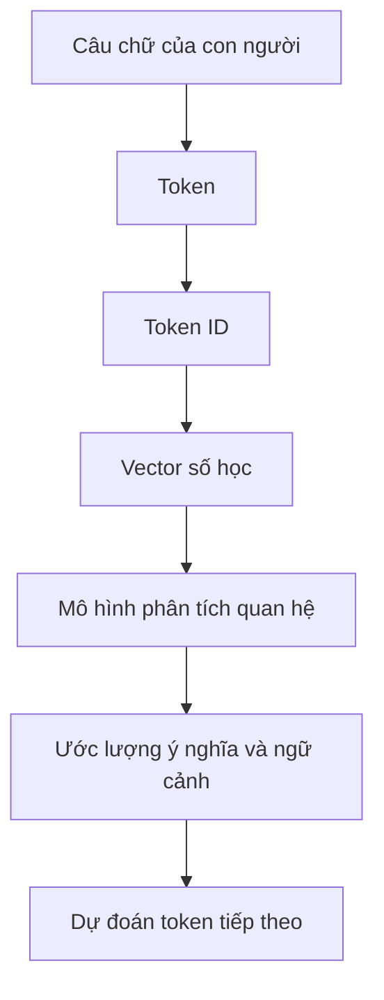

Về bản chất, mô hình ngôn ngữ học các mối quan hệ giữa những biểu diễn số của token. Từ đó, mô hình có thể:

* Nhận biết ngữ pháp.
* Phân tích ngữ nghĩa.
* Theo dõi ngữ cảnh.
* Suy luận mối liên hệ.
* Dự đoán token phù hợp tiếp theo.

---

## 7. Token không hoàn toàn giống từ

Một sai lầm phổ biến là cho rằng:

```text
1 từ = 1 token
```

Điều này không phải lúc nào cũng đúng.

### Một số trường hợp

| Nội dung                    | Khả năng token hóa                      |
| --------------------------- | --------------------------------------- |
| Một từ tiếng Anh thông dụng | Có thể là một token                     |
| Một từ dài hoặc hiếm        | Có thể bị chia thành nhiều token        |
| Dấu câu                     | Có thể là token riêng                   |
| Số, mã nguồn hoặc URL       | Thường tạo ra nhiều token               |
| Tiếng Việt có dấu           | Có thể có tỷ lệ token cao hơn tiếng Anh |
| Từ ghép                     | Có thể bị tách thành nhiều phần         |

Ví dụ:

```text
automation
```

có thể là một token ở một số bộ token hóa, nhưng cũng có thể được chia thành:

```text
auto | mation
```

Tương tự, mã nguồn như:

```python
calculate_total_price()
```

có thể được chia thành nhiều token nhỏ:

```text
calculate | _ | total | _ | price | ( | )
```

---

## 8. Các quy đổi token mang tính ước lượng

Đối với tiếng Anh, có thể sử dụng một số quy tắc ước lượng:

* Khoảng **4 ký tự tiếng Anh ≈ 1 token**.
* Khoảng **750 từ tiếng Anh ≈ 1.000 token**.
* Khoảng **1.000 token ≈ 750 từ tiếng Anh**.

Tuy nhiên, đây chỉ là các con số gần đúng.

### Công thức ước lượng

```text
Số token ≈ Số ký tự tiếng Anh ÷ 4
```

Hoặc:

```text
Số token ≈ Số từ tiếng Anh × 1,33
```

### Ví dụ

Một tài liệu có 3.000 từ tiếng Anh:

```text
3.000 × 1,33 ≈ 3.990 token
```

Có thể làm tròn thành khoảng:

```text
4.000 token
```

### Lưu ý đối với tiếng Việt

Do tiếng Việt sử dụng dấu thanh, ký tự Unicode và nhiều từ được tạo thành từ các âm tiết cách nhau bằng khoảng trắng, tỷ lệ token có thể khác đáng kể so với tiếng Anh.

Vì vậy, không nên áp dụng cứng nhắc quy tắc:

```text
750 từ = 1.000 token
```

cho mọi ngôn ngữ và mọi mô hình.

---

# Phần II – Cửa sổ ngữ cảnh

## 9. Cửa sổ ngữ cảnh là gì?

**Cửa sổ ngữ cảnh – context window** là tổng số token tối đa mà mô hình có thể xem xét trong một lần xử lý.

Nó thường bao gồm cả:

* Chỉ dẫn hệ thống.
* Lịch sử hội thoại.
* Câu hỏi hiện tại.
* Nội dung tệp được đưa vào.
* Kết quả từ công cụ.
* Định nghĩa kỹ năng.
* Thông tin plugin và connector.
* Nội dung do mô hình tạo ra.

Có thể hình dung cửa sổ ngữ cảnh giống như **bàn làm việc tạm thời** của AI.

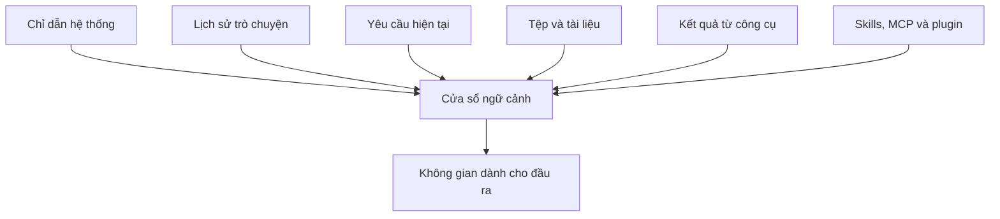

---

## 10. Công thức đơn giản

Có thể biểu diễn giới hạn ngữ cảnh như sau:

```text
Token đầu vào + Token đầu ra ≤ Giới hạn cửa sổ ngữ cảnh
```

Trong đó:

```text
Token đầu vào =
Chỉ dẫn hệ thống
+ lịch sử hội thoại
+ câu hỏi
+ tài liệu
+ kết quả công cụ
+ thông tin kỹ năng
```

### Ví dụ

Giả sử một mô hình có cửa sổ ngữ cảnh 100.000 token:

| Thành phần                    |    Số token |
| ----------------------------- | ----------: |
| Chỉ dẫn hệ thống              |       5.000 |
| Lịch sử trò chuyện            |      25.000 |
| Tài liệu đính kèm             |      50.000 |
| Yêu cầu hiện tại              |       2.000 |
| Không gian dự kiến cho đầu ra |      18.000 |
| **Tổng cộng**                 | **100.000** |

Nếu tiếp tục bổ sung tài liệu, hệ thống phải thực hiện một hoặc nhiều hành động:

* Loại bỏ phần hội thoại cũ.
* Tóm tắt nội dung trước đó.
* Chỉ lấy các đoạn tài liệu liên quan.
* Giảm độ dài câu trả lời.
* Chia nhiệm vụ thành nhiều bước.
* Từ chối thêm nội dung nếu đã đạt giới hạn.

---

## 11. Ví dụ trực quan về cửa sổ ngữ cảnh

```text
┌───────────────────────────────────────────────────────┐
│                 CỬA SỔ NGỮ CẢNH                       │
├───────────────────────────────────────────────────────┤
│ 1. Chỉ dẫn hệ thống                                   │
│ 2. Hướng dẫn của ứng dụng                             │
│ 3. Định nghĩa skill và công cụ                        │
│ 4. Lịch sử trò chuyện                                 │
│ 5. Tài liệu được truy xuất                            │
│ 6. Câu hỏi hiện tại                                   │
│ 7. Không gian cho câu trả lời                         │
└───────────────────────────────────────────────────────┘
```

Cửa sổ ngữ cảnh càng lớn thì mô hình có thể xem xét càng nhiều dữ liệu trong một lần xử lý. Tuy nhiên, cửa sổ lớn không đồng nghĩa với việc mọi thông tin đều được sử dụng hiệu quả như nhau.

---

## 12. Cửa sổ ngữ cảnh lớn mang lại lợi ích gì?

Một cửa sổ ngữ cảnh lớn có thể hỗ trợ:

* Cuộc hội thoại dài hơn.
* Tài liệu dài hơn.
* Phân tích nhiều tệp.
* Xem xét một phần lớn của kho mã nguồn.
* So sánh nhiều tài liệu.
* Thực hiện nhiệm vụ có nhiều điều kiện.
* Duy trì thông tin xuyên suốt một dự án.
* Điều phối nhiều agent và công cụ.

### Ví dụ ứng dụng

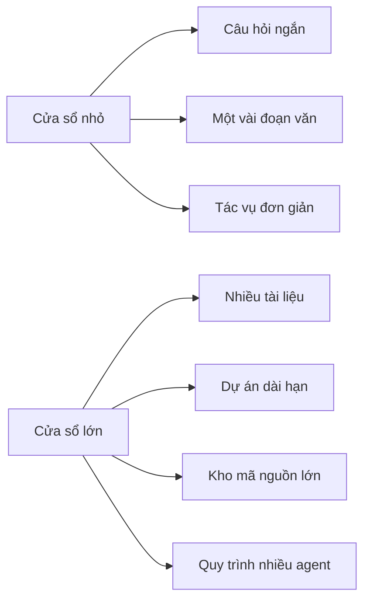

---

## 13. Ước lượng số trang

Một số phép quy đổi thường được sử dụng để hình dung quy mô ngữ cảnh:

|         Số token | Quy mô tài liệu ước lượng                               |
| ---------------: | ------------------------------------------------------- |
|      1.000 token | Khoảng 750 từ tiếng Anh                                 |
|     10.000 token | Một tài liệu dài hoặc một chương sách                   |
|    128.000 token | Hàng trăm trang văn bản                                 |
|    400.000 token | Khoảng một nghìn trang, tùy định dạng                   |
|  1.000.000 token | Hàng nghìn trang văn bản                                |
| 10.000.000 token | Có thể tương đương một kho tài liệu hoặc kho mã rất lớn |

Các con số trên chỉ để hình dung. Số trang thực tế phụ thuộc vào:

* Cỡ chữ.
* Khoảng cách dòng.
* Hình ảnh và bảng biểu.
* Mật độ nội dung.
* Ngôn ngữ.
* Định dạng tài liệu.
* Mã nguồn hay văn bản tự nhiên.

---

# Phần III – Context trong Claude Cowork

## 14. Context của một tác vụ Cowork

Trong Claude Cowork, context không chỉ là nội dung người dùng nhập vào ô trò chuyện. Nó có thể bao gồm:

* Mục tiêu của nhiệm vụ.
* Chỉ dẫn do người dùng cung cấp.
* Tệp và thư mục được cấp quyền truy cập.
* Kỹ năng đang được sử dụng.
* Connector đang hoạt động.
* Công cụ MCP.
* Kết quả của các thao tác trước đó.
* Trạng thái hiện tại của quy trình.
* Các bản tóm tắt được hệ thống tạo ra.
* Nội dung đầu ra đang được xây dựng.

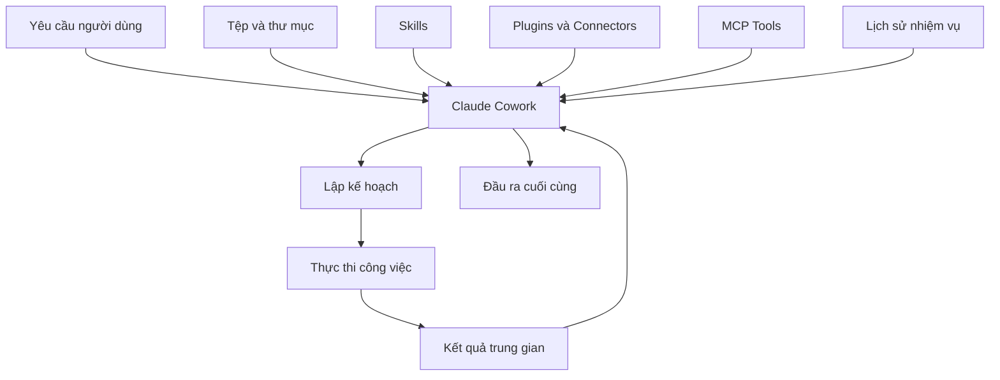

Mỗi thành phần trên đều có thể tiêu thụ token trong cửa sổ ngữ cảnh.

---

## 15. Vì sao Cowork phải quản lý context?

Giả sử người dùng giao cho Cowork một thư mục chứa 500 tài liệu.

Cowork không nhất thiết đưa toàn bộ 500 tài liệu vào mô hình cùng một lúc. Thay vào đó, hệ thống có thể:

1. Liệt kê tên và metadata của các tệp.
2. Phân loại sơ bộ.
3. Tìm kiếm các tài liệu có liên quan.
4. Đọc từng phần cần thiết.
5. Tóm tắt kết quả.
6. Đưa bản tóm tắt vào context.
7. Tiếp tục thực hiện bước tiếp theo.

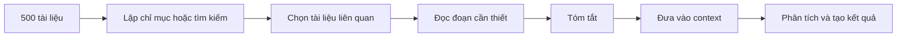

Đây là cách sử dụng context hiệu quả hơn so với việc nạp toàn bộ dữ liệu một cách không chọn lọc.

---

# Phần IV – Context compaction

## 16. Compaction là gì?

**Context compaction** là quá trình rút gọn nội dung cũ để giải phóng không gian trong cửa sổ ngữ cảnh.

Thay vì giữ nguyên toàn bộ lịch sử, hệ thống có thể thay thế nhiều thông điệp bằng một bản tóm tắt ngắn hơn.

### Trước khi compact

```text
Tin nhắn 1: Người dùng mô tả dự án.
Tin nhắn 2: AI phân tích yêu cầu.
Tin nhắn 3: Người dùng chỉnh phạm vi.
Tin nhắn 4: AI đề xuất cấu trúc.
Tin nhắn 5: Người dùng thay đổi tên tệp.
Tin nhắn 6: AI cập nhật kế hoạch.
...
```

### Sau khi compact

```text
Tóm tắt dự án:
- Mục tiêu: tổ chức 500 tài liệu.
- Phạm vi: chỉ xử lý PDF và DOCX.
- Quy tắc đặt tên: YYYY-MM-DD_chu-de.
- Không xóa tệp gốc.
- Người dùng đã duyệt cấu trúc thư mục.
```

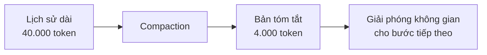

---

## 17. Lợi ích và rủi ro của compaction

### Lợi ích

* Kéo dài cuộc hội thoại.
* Giảm lượng token cần xử lý.
* Giảm chi phí.
* Giữ lại các quyết định quan trọng.
* Cho phép dự án tiếp tục qua nhiều giai đoạn.

### Rủi ro

* Một số chi tiết nhỏ có thể bị mất.
* Bản tóm tắt có thể thiếu ngoại lệ quan trọng.
* Ngữ cảnh tinh tế có thể bị đơn giản hóa.
* Mô hình có thể quên chính xác câu chữ ban đầu.
* Thông tin sai trong bản tóm tắt có thể ảnh hưởng các bước sau.

Vì vậy, với những thông tin quan trọng, người dùng nên lưu chúng trong:

* Tệp yêu cầu chính thức.
* Tài liệu đặc tả.
* Checklist.
* Quy tắc dự án.
* README.
* Skill hoặc template có cấu trúc.

---

# Phần V – Chi phí và hiệu suất

## 18. Token ảnh hưởng đến chi phí như thế nào?

Khi sử dụng API của mô hình ngôn ngữ, chi phí thường được tính dựa trên:

* Số token đầu vào.
* Số token đầu ra.
* Loại mô hình.
* Cơ chế cache.
* Chế độ xử lý bổ sung.
* Nhà cung cấp dịch vụ.

Công thức tổng quát:

```text
Chi phí =
Token đầu vào × đơn giá đầu vào
+
Token đầu ra × đơn giá đầu ra
```

### Ví dụ minh họa

Giả sử:

* 100.000 token đầu vào.
* 10.000 token đầu ra.
* Giá đầu vào: 2 USD cho một triệu token.
* Giá đầu ra: 10 USD cho một triệu token.

Ta có:

```text
Chi phí đầu vào
= 100.000 ÷ 1.000.000 × 2
= 0,20 USD
```

```text
Chi phí đầu ra
= 10.000 ÷ 1.000.000 × 10
= 0,10 USD
```

```text
Tổng chi phí = 0,30 USD
```

Đây chỉ là ví dụ minh họa; giá thực tế phụ thuộc vào từng mô hình và thời điểm sử dụng.

---

## 19. Context càng lớn có luôn càng tốt không?

Không.

Một cửa sổ ngữ cảnh lớn có nhiều lợi ích, nhưng cũng có một số đánh đổi:

| Lợi ích                        | Đánh đổi                              |
| ------------------------------ | ------------------------------------- |
| Đọc được nhiều tài liệu hơn    | Chi phí đầu vào cao hơn               |
| Duy trì hội thoại dài hơn      | Thời gian xử lý có thể tăng           |
| Giảm nhu cầu chia nhỏ tài liệu | Thông tin không liên quan gây nhiễu   |
| Hỗ trợ nhiệm vụ phức tạp       | Khó kiểm soát nguồn thông tin         |
| Có thể phân tích kho mã lớn    | Mô hình có thể bỏ sót chi tiết ở giữa |

Nguyên tắc quan trọng:

> Không nên đưa vào context mọi thứ có thể đưa vào. Chỉ nên đưa vào những gì cần thiết cho nhiệm vụ hiện tại.

---

## 20. “Lost in the middle”

Khi context rất dài, mô hình có thể chú ý tốt hơn đến thông tin ở đầu và cuối, nhưng bỏ sót hoặc sử dụng không hiệu quả thông tin nằm ở giữa.

Hiện tượng này thường được gọi là:

> **Lost in the middle – thất lạc thông tin ở giữa ngữ cảnh.**

Ví dụ:

```text
[Quy tắc quan trọng ở đầu]
        ↓
[Hàng trăm trang nội dung]
        ↓
[Ngoại lệ quan trọng nằm ở giữa]
        ↓
[Yêu cầu mới nhất ở cuối]
```

Mô hình có thể nhớ yêu cầu mới nhất nhưng bỏ qua ngoại lệ nằm sâu trong phần giữa.

### Cách hạn chế

* Đưa quy tắc quan trọng vào phần tóm tắt.
* Lặp lại các ràng buộc quan trọng khi cần.
* Chia tài liệu thành các phần rõ ràng.
* Gắn tiêu đề và metadata.
* Chỉ truy xuất các đoạn liên quan.
* Yêu cầu mô hình dẫn nguồn cho kết luận.
* Dùng checklist để xác nhận đầu ra.

---

# Phần VI – Chiến lược quản lý context

## 21. Chỉ cung cấp thông tin liên quan

Không nên đưa toàn bộ dữ liệu vào mô hình khi chỉ cần một phần nhỏ.

### Không tối ưu

```text
Đọc toàn bộ 500 tài liệu và tìm hóa đơn của tháng 5.
```

### Tối ưu hơn

```text
Tìm các tệp có tên, metadata hoặc nội dung liên quan đến hóa đơn tháng 5.
Chỉ đọc những tệp phù hợp và lập bảng tổng hợp.
```

---

## 22. Chia nhiệm vụ thành nhiều giai đoạn

Thay vì giao một nhiệm vụ quá lớn, có thể chia thành:

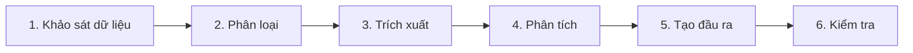

### Ví dụ

Thay vì yêu cầu:

> Đọc toàn bộ kho tài liệu, phân loại, đổi tên, tạo báo cáo và gửi email.

Nên chia thành:

1. Kiểm kê toàn bộ tệp.
2. Đề xuất quy tắc phân loại.
3. Trình bày danh sách thay đổi dự kiến.
4. Chờ người dùng duyệt.
5. Thực hiện đổi tên và di chuyển.
6. Tạo báo cáo.
7. Soạn email.
8. Kiểm tra trước khi gửi.

---

## 23. Tóm tắt định kỳ

Trong một dự án dài, nên tạo bản tóm tắt sau mỗi giai đoạn.

Một bản tóm tắt tốt nên có:

```markdown
## Trạng thái dự án

### Đã hoàn thành
- ...

### Quyết định đã chốt
- ...

### Tệp quan trọng
- ...

### Vấn đề còn tồn tại
- ...

### Bước tiếp theo
- ...

### Điều không được thay đổi
- ...
```

Bản tóm tắt này giúp:

* Phục hồi context khi mở phiên làm việc mới.
* Giảm phụ thuộc vào lịch sử hội thoại.
* Hạn chế mất thông tin khi compaction.
* Chuyển giao công việc giữa nhiều agent.

---

## 24. Lưu “nguồn sự thật duy nhất”

Với dự án dài hạn, nên có một tài liệu đóng vai trò **single source of truth – nguồn sự thật duy nhất**.

Ví dụ:

```text
project/
├── README.md
├── REQUIREMENTS.md
├── DECISIONS.md
├── TASKS.md
├── CHANGELOG.md
└── docs/
```

### Vai trò của từng tệp

| Tệp               | Mục đích                 |
| ----------------- | ------------------------ |
| `README.md`       | Tổng quan dự án          |
| `REQUIREMENTS.md` | Yêu cầu chính thức       |
| `DECISIONS.md`    | Các quyết định đã chốt   |
| `TASKS.md`        | Công việc đang thực hiện |
| `CHANGELOG.md`    | Lịch sử thay đổi         |
| `docs/`           | Tài liệu chi tiết        |

Nhờ đó, AI không cần phụ thuộc hoàn toàn vào trí nhớ của cuộc hội thoại.

---

## 25. Sử dụng truy xuất thay vì nạp toàn bộ

Trong hệ thống có nhiều tài liệu, có thể sử dụng phương pháp:

1. Lập chỉ mục dữ liệu.
2. Tìm kiếm theo câu hỏi.
3. Lấy các đoạn liên quan.
4. Đưa các đoạn này vào context.
5. Yêu cầu mô hình trả lời.

Đây là ý tưởng nền tảng của **RAG – Retrieval-Augmented Generation**.

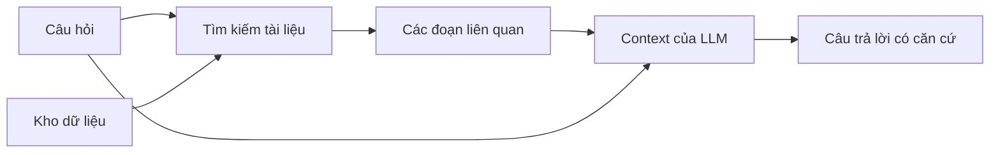

---

## 26. Quản lý context khi sử dụng nhiều agent

Trong hệ thống nhiều agent, không nên để tất cả agent nhận toàn bộ context giống nhau.

Mỗi agent chỉ nên nhận thông tin cần thiết cho vai trò của mình.

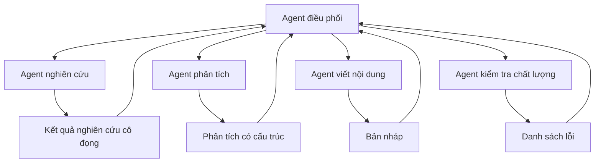

### Ví dụ phân chia context

| Agent            | Context cần thiết                              |
| ---------------- | ---------------------------------------------- |
| Agent nghiên cứu | Câu hỏi, nguồn dữ liệu, tiêu chí tìm kiếm      |
| Agent phân tích  | Kết quả nghiên cứu, mô hình phân tích          |
| Agent viết       | Dàn ý, đối tượng độc giả, giọng văn            |
| Agent kiểm tra   | Yêu cầu gốc, bản nháp, checklist               |
| Agent điều phối  | Trạng thái và kết quả tóm tắt của tất cả agent |

Cách này giúp:

* Giảm token.
* Giảm nhiễu.
* Tăng tính chuyên môn hóa.
* Dễ kiểm tra sai sót.
* Dễ thay thế từng agent.

---

# Phần VII – Những hiểu lầm phổ biến

## 27. Context window không phải bộ nhớ vĩnh viễn

Cửa sổ ngữ cảnh chỉ là lượng thông tin mô hình có thể xử lý trong một lần hoặc một phiên làm việc.

Nó không đồng nghĩa với:

* Bộ nhớ dài hạn.
* Cơ sở dữ liệu.
* Toàn bộ lịch sử người dùng.
* Khả năng nhớ mọi cuộc hội thoại trước đó.
* Khả năng tự động truy cập mọi tệp.

```text
Context window ≠ Long-term memory
Context window ≠ Database
Context window ≠ File storage
```

---

## 28. Mô hình có context lớn không có nghĩa là hiểu hoàn hảo

Ngay cả khi toàn bộ tài liệu nằm trong cửa sổ ngữ cảnh, mô hình vẫn có thể:

* Bỏ sót một chi tiết.
* Hiểu sai mối quan hệ.
* Suy luận không chính xác.
* Trích dẫn nhầm vị trí.
* Nhầm phiên bản tài liệu.
* Ưu tiên thông tin mới hơn.
* Bị nhiễu bởi tài liệu không liên quan.

Do đó, cần kết hợp:

* Context phù hợp.
* Prompt rõ ràng.
* Cấu trúc dữ liệu tốt.
* Kiểm tra đầu ra.
* Dẫn nguồn.
* Human-in-the-loop.

---

## 29. Nhiều token không đồng nghĩa với câu trả lời tốt hơn

Việc cung cấp quá nhiều nội dung có thể khiến:

* Nhiệm vụ trở nên mơ hồ.
* Mô hình khó nhận biết ưu tiên.
* Các tài liệu mâu thuẫn nhau.
* Chi phí tăng.
* Thời gian xử lý tăng.
* Chất lượng câu trả lời giảm.

### Nguyên tắc

```text
Context tốt = Đúng thông tin + Đủ thông tin + Có cấu trúc
```

Không phải:

```text
Context tốt = Càng nhiều thông tin càng tốt
```

---

# Phần VIII – Quy trình thực hành đề xuất

## 30. Quy trình quản lý context cho dự án dài

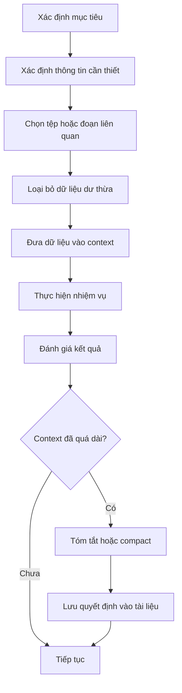

---

## 31. Checklist trước khi gửi context cho AI

### Mục tiêu

* [ ] Tôi đã mô tả rõ đầu ra cần tạo.
* [ ] Tôi đã xác định phạm vi công việc.
* [ ] Tôi đã nêu các điều không được thay đổi.

### Dữ liệu

* [ ] Chỉ các tài liệu liên quan mới được cung cấp.
* [ ] Tài liệu có tên và cấu trúc rõ ràng.
* [ ] Phiên bản tài liệu đã được xác định.
* [ ] Các nguồn mâu thuẫn đã được ghi chú.

### Context

* [ ] Lịch sử không cần thiết đã được tóm tắt.
* [ ] Quyết định quan trọng đã được lưu riêng.
* [ ] Có đủ không gian cho đầu ra.
* [ ] Không đưa dữ liệu trùng lặp quá nhiều lần.

### Kiểm tra

* [ ] Yêu cầu mô hình dẫn nguồn khi cần.
* [ ] Có bước review của con người.
* [ ] Không tự động thực hiện hành động quan trọng nếu chưa duyệt.

---

# Phần IX – Ví dụ thực tế

## 32. Ví dụ 1: Phân tích nhiều tài liệu

### Yêu cầu chưa tối ưu

> Đọc tất cả tài liệu trong thư mục và cho tôi biết những gì quan trọng.

Vấn đề:

* Không xác định “quan trọng” nghĩa là gì.
* Có thể đưa quá nhiều tài liệu vào context.
* Không có định dạng đầu ra.
* Khó xác minh kết quả.

### Yêu cầu tối ưu hơn

> Quét thư mục hợp đồng. Xác định các tài liệu có ngày hết hạn trong 90 ngày tới. Với mỗi tài liệu, trích xuất tên hợp đồng, đối tác, ngày hết hạn và điều khoản gia hạn. Chỉ đọc đầy đủ những tệp có khả năng phù hợp. Trình bày kết quả dưới dạng bảng và ghi rõ tên tệp nguồn.

---

## 33. Ví dụ 2: Làm việc với kho mã nguồn

### Cách không tối ưu

> Đọc toàn bộ codebase và sửa lỗi đăng nhập.

### Cách tối ưu

> Trước tiên, xác định các tệp liên quan đến đăng nhập, xác thực, middleware và quản lý phiên. Sau đó mô tả luồng đăng nhập hiện tại, xác định nguyên nhân lỗi, đề xuất bản vá nhỏ nhất và liệt kê các bài kiểm thử cần chạy. Không thay đổi mã cho đến khi đã trình bày kế hoạch.

Quy trình này tránh việc phải nạp toàn bộ kho mã không liên quan vào context.

---

## 34. Ví dụ 3: Điều phối nhiều agent

### Nhiệm vụ

Tạo báo cáo thị trường từ 300 tài liệu.

### Phân công

```text
Agent 1: Tìm nguồn phù hợp.
Agent 2: Trích xuất số liệu.
Agent 3: Phân tích xu hướng.
Agent 4: Viết báo cáo.
Agent 5: Kiểm tra tính nhất quán.
```

Agent điều phối chỉ giữ:

* Mục tiêu.
* Tiêu chí.
* Bản tóm tắt của từng agent.
* Các quyết định.
* Trạng thái công việc.

Nhờ đó, không cần sao chép toàn bộ 300 tài liệu vào context của mọi agent.

---

# Phần X – Kết luận

## 35. Những điểm cần ghi nhớ

### Token

* Token là đơn vị văn bản mà mô hình xử lý.
* Một token không nhất thiết tương ứng với một từ.
* Văn bản được chuyển thành token và token ID.
* Token ảnh hưởng đến chi phí và giới hạn sử dụng.

### Cửa sổ ngữ cảnh

* Là tổng số token mô hình có thể xem xét cùng lúc.
* Bao gồm cả đầu vào, lịch sử, tài liệu, công cụ và đầu ra.
* Context lớn hỗ trợ nhiệm vụ phức tạp hơn.
* Context lớn vẫn cần được quản lý cẩn thận.

### Quản lý context

* Chỉ đưa vào thông tin liên quan.
* Chia nhiệm vụ lớn thành nhiều bước.
* Tóm tắt định kỳ.
* Lưu quyết định trong tài liệu.
* Dùng truy xuất để lấy đúng đoạn cần thiết.
* Phân chia context theo vai trò của từng agent.
* Luôn có bước kiểm tra của con người.

---

## 36. Sơ đồ tổng kết

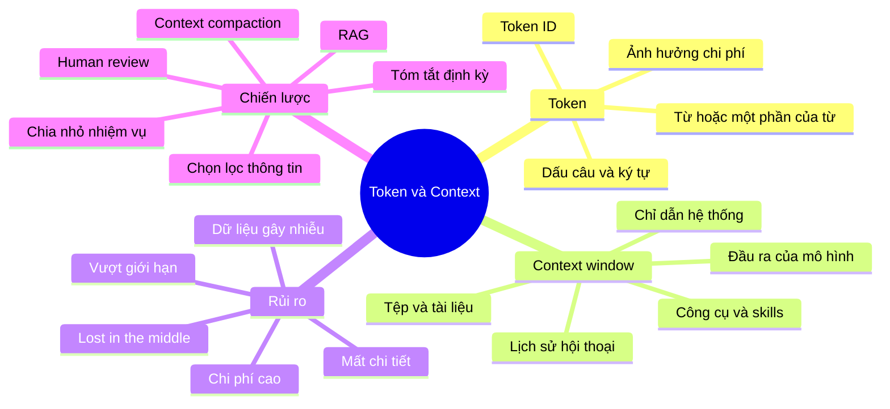

---

## 37. Câu hỏi ôn tập

1. Token là gì?
2. Tại sao một từ có thể được chia thành nhiều token?
3. Token ID có vai trò gì?
4. Cửa sổ ngữ cảnh là gì?
5. Những thành phần nào có thể chiếm không gian trong context?
6. Token đầu vào và token đầu ra có quan hệ như thế nào với giới hạn context?
7. Vì sao không nên đưa toàn bộ dữ liệu vào mô hình?
8. Context compaction là gì?
9. Context compaction có thể làm mất những thông tin nào?
10. Vì sao context window không phải là bộ nhớ dài hạn?
11. RAG giúp quản lý context như thế nào?
12. Nên phân phối context cho nhiều agent ra sao?
13. “Lost in the middle” là hiện tượng gì?
14. Vì sao cửa sổ ngữ cảnh lớn không đảm bảo câu trả lời chính xác?
15. Những thông tin nào nên được lưu trong tài liệu dự án thay vì chỉ giữ trong cuộc trò chuyện?

---

## 38. Bài tập thực hành

### Bài tập 1 – Ước lượng token

Chọn một tài liệu tiếng Anh khoảng 1.500 từ và:

1. Ước lượng số token.
2. Kiểm tra bằng một công cụ tokenizer.
3. So sánh kết quả thực tế với công thức ước lượng.
4. Giải thích nguyên nhân chênh lệch.

### Bài tập 2 – Rút gọn context

Cho một đoạn hội thoại dài, hãy tạo bản tóm tắt gồm:

* Mục tiêu.
* Quyết định đã chốt.
* Ràng buộc.
* Công việc đã hoàn thành.
* Bước tiếp theo.

Mục tiêu là giảm ít nhất 70% độ dài nhưng vẫn giữ đủ thông tin để tiếp tục dự án.

### Bài tập 3 – Thiết kế quy trình agent

Thiết kế hệ thống gồm bốn agent để phân tích một thư mục có 200 tài liệu:

* Agent tìm kiếm.
* Agent trích xuất.
* Agent phân tích.
* Agent kiểm tra.

Với mỗi agent, hãy xác định:

* Context đầu vào.
* Công cụ được phép sử dụng.
* Đầu ra bắt buộc.
* Thông tin cần gửi lại agent điều phối.

---

## 39. Tóm tắt bài học

Token và cửa sổ ngữ cảnh là mô hình tài nguyên cơ bản của mọi tương tác với mô hình ngôn ngữ lớn.

Token quyết định cách văn bản được biểu diễn, lượng dữ liệu được xử lý và chi phí sử dụng. Cửa sổ ngữ cảnh xác định lượng thông tin tối đa mà mô hình có thể xem xét trong một lần xử lý.

Trong các quy trình Claude Cowork, skills, plugin, connector, MCP và hệ thống nhiều agent, việc quản lý context tốt là điều kiện quan trọng để:

* Giảm chi phí.
* Hạn chế nhiễu thông tin.
* Tránh mất các quyết định quan trọng.
* Tăng độ chính xác.
* Duy trì dự án dài hạn.
* Kiểm soát các hành động do AI thực hiện.

Nguyên tắc cốt lõi của bài học là:

> **Không cung cấp nhiều context nhất có thể; hãy cung cấp đúng context cần thiết, tại đúng thời điểm và cho đúng tác vụ.**
