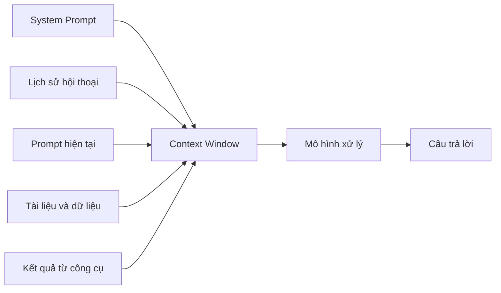
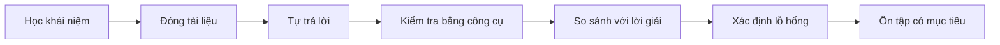
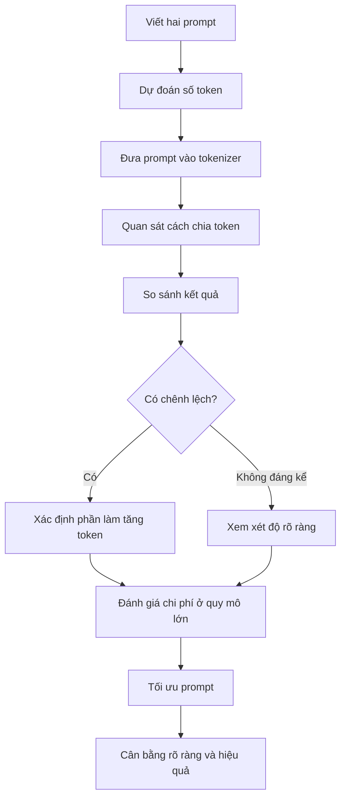

# 011 — Bài thực hành: Hiểu về Token và Context Window

## 1. Thông tin bài học

| Nội dung         | Chi tiết                                                           |
| ---------------- | ------------------------------------------------------------------ |
| **Chuyên mục**   | Claude Cowork, Skills & Plugins Mastery for Workflow Automation    |
| **Loại bài học** | Câu hỏi thực hành và tự đánh giá                                   |
| **Chủ đề chính** | Token và cửa sổ ngữ cảnh                                           |
| **Mục tiêu**     | Kiểm tra khả năng hiểu và áp dụng kiến thức trước khi xem lời giải |

---

## 2. Ý tưởng chính

Bài học này là một bài tự kiểm tra ngắn nhằm giúp bạn xác nhận mức độ hiểu biết của mình về:

* Token là gì.
* Cách một câu lệnh được chia thành các token.
* Việc thêm hoặc bớt từ ảnh hưởng như thế nào đến số lượng token.
* Mối liên hệ giữa token, context window, chi phí và hiệu suất xử lý.

Bạn nên tự thực hiện bài tập trước khi xem phần lời giải ở bài học tiếp theo.

---

## 3. Mục tiêu học tập

Sau khi hoàn thành bài thực hành, bạn có thể:

1. Tự đánh giá kiến thức về token và context window.
2. Sử dụng công cụ tokenizer để phân tích một prompt.
3. So sánh số token giữa hai prompt có cùng ý nghĩa.
4. Nhận biết những điểm còn chưa rõ trong mô hình tư duy của mình.
5. Chuẩn bị các câu hỏi để đối chiếu với bài giải.
6. Hiểu rằng cách viết prompt có thể ảnh hưởng đến lượng tài nguyên mà mô hình sử dụng.

---

## 4. Kiến thức cần nhớ

### 4.1. Token là gì?

Token là một đơn vị văn bản mà mô hình ngôn ngữ sử dụng để xử lý thông tin.

Một token có thể là:

* Một từ hoàn chỉnh.
* Một phần của từ.
* Một dấu câu.
* Một khoảng trắng kết hợp với từ.
* Một ký tự đặc biệt.

Ví dụ minh họa:

```text
Artificial intelligence is useful.
```

Câu trên không nhất thiết được chia thành đúng năm token. Cách phân chia phụ thuộc vào bộ tokenizer và mô hình đang được sử dụng.

> **Lưu ý:** Số từ không luôn bằng số token.

---

### 4.2. Context window là gì?

Context window, hay **cửa sổ ngữ cảnh**, là tổng lượng token tối đa mà mô hình có thể xem xét trong một lần xử lý.

Context window có thể bao gồm:

* System prompt.
* Nội dung cuộc trò chuyện trước đó.
* Prompt hiện tại của người dùng.
* Nội dung tài liệu được cung cấp.
* Kết quả từ công cụ.
* Câu trả lời do mô hình tạo ra.

Sơ đồ tổng quát:



Có thể hình dung đơn giản:

```text
Context Window
├── Chỉ dẫn hệ thống
├── Lịch sử trò chuyện
├── Dữ liệu được cung cấp
├── Câu hỏi hiện tại
└── Phần token dành cho câu trả lời
```

Nếu tổng số token vượt quá giới hạn context window, một phần nội dung có thể phải được:

* Cắt bỏ.
* Tóm tắt.
* Chia thành nhiều lần xử lý.
* Truy xuất lại khi cần thiết.

---

## 5. Kỹ thuật tự đánh giá

### 5.1. Active recall — chủ động nhớ lại

Thay vì đọc lại lý thuyết ngay lập tức, hãy tự trả lời câu hỏi bằng trí nhớ.

Ví dụ:

* Token là gì?
* Một từ có luôn tương ứng với một token không?
* Context window bao gồm những thành phần nào?
* Điều gì xảy ra khi vượt giới hạn context window?
* Prompt dài hơn có thể ảnh hưởng đến chi phí như thế nào?

Quy trình thực hành:



---

### 5.2. Knowledge verification — xác minh kiến thức

Không nên chỉ dự đoán số token bằng cảm giác. Hãy sử dụng công cụ tokenizer để kiểm tra.

Quá trình xác minh gồm bốn bước:

1. Đưa prompt vào công cụ tokenizer.
2. Ghi lại số token.
3. Quan sát cách công cụ chia văn bản.
4. So sánh kết quả giữa các phiên bản prompt.

Điều quan trọng không phải là đoán chính xác ngay từ đầu, mà là hiểu vì sao kết quả thực tế khác với dự đoán của bạn.

---

## 6. Bài thực hành chính

### Yêu cầu

Sử dụng một công cụ tokenizer để phân tích hai prompt sau.

### Prompt 1 — Trực tiếp

```text
Explain the difference between supervised and unsupervised learning in AI.
```

### Prompt 2 — Lịch sự hơn

```text
Please explain the difference between supervised and unsupervised learning in AI. Thank you.
```

Hai prompt truyền đạt gần như cùng một yêu cầu. Tuy nhiên, prompt thứ hai có thêm các từ thể hiện sự lịch sự:

* `Please`
* `Thank you`

---

## 7. Nhiệm vụ cần thực hiện

### Bước 1: Dự đoán

Trước khi sử dụng công cụ, hãy dự đoán:

* Prompt nào có nhiều token hơn?
* Chênh lệch khoảng bao nhiêu token?
* Số token tăng có tương ứng chính xác với số từ được thêm không?

Ghi lại dự đoán:

```text
Dự đoán của tôi:

- Prompt 1: ______ token
- Prompt 2: ______ token
- Chênh lệch: ______ token
```

---

### Bước 2: Phân tích Prompt 1

Dán Prompt 1 vào công cụ tokenizer.

Ghi lại:

```text
Số từ: ______________________
Số token: ___________________
Các token đáng chú ý: _______
```

Quan sát xem những cụm từ như sau được chia thế nào:

* `supervised`
* `unsupervised`
* `learning`
* `AI`

---

### Bước 3: Phân tích Prompt 2

Thực hiện tương tự với Prompt 2.

```text
Số từ: ______________________
Số token: ___________________
Các token đáng chú ý: _______
```

Đặc biệt quan sát:

* Từ `Please` tạo ra bao nhiêu token?
* Cụm `Thank you` tạo ra bao nhiêu token?
* Dấu chấm có được tính như một token riêng hay không?

---

### Bước 4: So sánh kết quả

Hoàn thành bảng sau:

| Tiêu chí                | Prompt 1 |   Prompt 2 |
| ----------------------- | -------: | ---------: |
| Số từ                   |          |            |
| Số token                |          |            |
| Số ký tự                |          |            |
| Mức độ trực tiếp        |      Cao | Trung bình |
| Có từ lịch sự           |    Không |         Có |
| Truyền đạt đúng yêu cầu |       Có |         Có |

Công thức chênh lệch:

```text
Token tăng thêm = Số token của Prompt 2 − Số token của Prompt 1
```

---

## 8. Câu hỏi suy ngẫm

Sau khi có kết quả, hãy trả lời các câu hỏi sau.

### Câu 1

Prompt thứ hai có nhiều token hơn prompt thứ nhất không? Vì sao?

### Câu 2

Số từ tăng thêm có bằng chính xác số token tăng thêm không?

### Câu 3

Việc thêm `Please` và `Thank you` có làm thay đổi ý định chính của prompt không?

### Câu 4

Trong một yêu cầu rất ngắn, lượng token tăng thêm có đáng kể không?

### Câu 5

Nếu một hệ thống gửi hàng triệu prompt mỗi ngày, những từ không cần thiết có thể ảnh hưởng như thế nào đến:

* Tổng chi phí?
* Độ trễ?
* Khả năng sử dụng context window?

### Câu 6

Có nên luôn loại bỏ mọi từ lịch sự khỏi prompt không? Hãy giải thích.

### Câu 7

Điều gì quan trọng hơn trong thực tế?

* Prompt ngắn nhất có thể.
* Prompt rõ ràng nhất có thể.
* Sự cân bằng giữa rõ ràng và hiệu quả.

---

## 9. Phân tích nguyên tắc

### 9.1. Prompt dài hơn thường sử dụng nhiều token hơn

Khi thêm từ vào prompt, số token thường tăng. Tuy nhiên, mức tăng không nhất thiết bằng số từ được thêm bởi vì tokenizer xử lý các mảnh văn bản, không xử lý trực tiếp theo số từ.

```text
Thêm từ
   ↓
Tăng số token
   ↓
Tăng lượng dữ liệu đầu vào
   ↓
Có thể tăng chi phí và độ trễ
```

---

### 9.2. Lịch sự và hiệu quả không nhất thiết đối lập

Các từ như `please` hoặc `thank you` không phải lúc nào cũng gây hại. Chúng có thể:

* Làm giọng điệu tự nhiên hơn.
* Phù hợp với giao tiếp trong môi trường công việc.
* Giúp prompt dễ đọc hơn.
* Tạo ra phong cách giao tiếp mong muốn.

Tuy nhiên, trong các workflow tự động có quy mô lớn, nên tránh những nội dung dài dòng không mang thêm thông tin cần thiết.

So sánh:

```text
Prompt hiệu quả ≠ Prompt ngắn nhất
Prompt hiệu quả = Rõ ràng + Đủ ngữ cảnh + Ít dư thừa
```

---

### 9.3. Tác động ở quy mô lớn

Giả sử một prompt có thêm `n` token và được gửi `m` lần:

```text
Tổng token tăng thêm = n × m
```

Ví dụ minh họa:

```text
5 token dư thừa × 1.000.000 yêu cầu
= 5.000.000 token tăng thêm
```

Vì vậy, một thay đổi rất nhỏ trong một prompt có thể trở nên đáng kể khi được sử dụng trong:

* Chatbot có nhiều người dùng.
* Hệ thống chăm sóc khách hàng.
* Agent tự động.
* Quy trình xử lý tài liệu hàng loạt.
* API chạy hàng triệu yêu cầu.

---

## 10. Phản ánh về phát biểu của Sam Altman

Bài thực hành yêu cầu bạn suy ngẫm về một bài viết hoặc phát biểu của Sam Altman liên quan đến việc người dùng nói `please` và `thank you` với mô hình AI.

Điểm cần suy ngẫm không chỉ là vài token được thêm vào một câu lệnh, mà còn là tác động khi hành vi đó được lặp lại trên quy mô rất lớn.

Hãy xem xét hai góc nhìn:

### Góc nhìn về tài nguyên

Mỗi từ được thêm vào đều phải được:

* Chuyển thành token.
* Truyền đến hệ thống.
* Đưa vào context window.
* Xử lý bởi mô hình.
* Tính vào khối lượng sử dụng.

Ở quy mô hàng triệu hoặc hàng tỷ yêu cầu, lượng token bổ sung có thể tạo ra chi phí tính toán đáng kể.

### Góc nhìn về hành vi con người

Việc sử dụng ngôn ngữ lịch sự có thể giúp con người:

* Duy trì thói quen giao tiếp tích cực.
* Cảm thấy tự nhiên hơn khi tương tác.
* Hình thành yêu cầu có giọng điệu rõ ràng và hợp tác.
* Tránh đưa sự cộc lốc trong giao tiếp với AI sang giao tiếp với con người.

Do đó, vấn đề không nên được hiểu đơn giản là:

```text
Lịch sự = lãng phí token
```

Cách hiểu hợp lý hơn là:

```text
Tối ưu prompt
= Cân bằng giữa hiệu quả kỹ thuật,
  sự rõ ràng
  và trải nghiệm giao tiếp
```

---

## 11. Những lỗi tư duy thường gặp

### Lỗi 1: Cho rằng một từ luôn bằng một token

Điều này không chính xác. Một từ dài hoặc ít phổ biến có thể được chia thành nhiều token.

### Lỗi 2: Cho rằng prompt càng ngắn thì càng tốt

Prompt quá ngắn có thể thiếu ngữ cảnh và tạo ra câu trả lời không đúng yêu cầu.

### Lỗi 3: Chỉ chú ý đến token đầu vào

Tổng mức sử dụng còn có thể bao gồm cả token mà mô hình tạo ra trong câu trả lời.

### Lỗi 4: Cho rằng vài token không bao giờ quan trọng

Vài token gần như không đáng kể đối với một yêu cầu đơn lẻ, nhưng có thể trở thành con số lớn khi nhân với hàng triệu yêu cầu.

### Lỗi 5: Cố đoán token mà không kiểm tra

Số token phụ thuộc vào tokenizer và mô hình. Kết quả nên được kiểm tra bằng đúng công cụ phù hợp với mô hình dự định sử dụng.

---

## 12. Bài tập mở rộng

### Bài tập 1: So sánh prompt ngắn và dài

Phân tích hai prompt:

```text
Summarize this article.
```

```text
Please carefully read the following article and provide me with a concise summary of its most important points. Thank you.
```

Hãy so sánh:

* Số token.
* Độ rõ ràng.
* Khả năng tạo ra kết quả đúng yêu cầu.
* Phần nội dung nào thực sự cần thiết.

---

### Bài tập 2: Tối ưu prompt

Rút gọn prompt sau mà không làm mất yêu cầu:

```text
Hello, I hope you are doing well. Could you please help me by carefully reading the following document and then providing me with a short and concise summary of the most important points contained inside it? Thank you very much for your help.
```

Phiên bản tối ưu của bạn:

```text
____________________________________________________
____________________________________________________
```

---

### Bài tập 3: Tính tác động quy mô lớn

Giả sử phiên bản dài hơn sử dụng thêm 6 token và hệ thống xử lý 500.000 yêu cầu mỗi tháng.

```text
Token tăng thêm mỗi tháng = 6 × 500.000
                         = __________________ token
```

Tiếp tục tính lượng token tăng thêm trong một năm:

```text
Token tăng thêm mỗi năm = __________________ × 12
                        = __________________ token
```

---

## 13. Bảng tự đánh giá

Đánh dấu vào cột phù hợp:

| Nội dung                                          | Chưa hiểu | Hiểu một phần | Đã hiểu |
| ------------------------------------------------- | :-------: | :-----------: | :-----: |
| Tôi có thể giải thích token là gì                 |     ☐     |       ☐       |    ☐    |
| Tôi hiểu từ và token không giống nhau             |     ☐     |       ☐       |    ☐    |
| Tôi có thể giải thích context window              |     ☐     |       ☐       |    ☐    |
| Tôi biết cách sử dụng tokenizer                   |     ☐     |       ☐       |    ☐    |
| Tôi có thể so sánh hai prompt theo số token       |     ☐     |       ☐       |    ☐    |
| Tôi hiểu tác động của token ở quy mô lớn          |     ☐     |       ☐       |    ☐    |
| Tôi biết cách tối ưu prompt mà vẫn giữ độ rõ ràng |     ☐     |       ☐       |    ☐    |

---

## 14. Sơ đồ tổng kết



---

## 15. Kết luận

Bài thực hành này giúp bạn chuyển từ việc chỉ biết khái niệm token sang trực tiếp quan sát cách văn bản được token hóa.

Những điểm quan trọng cần ghi nhớ:

* Token không hoàn toàn tương đương với từ.
* Prompt có thêm từ thường sử dụng thêm token.
* Một vài token tăng thêm ít ảnh hưởng đến một yêu cầu đơn lẻ.
* Ở quy mô lớn, những token dư thừa có thể làm tăng đáng kể lượng tài nguyên sử dụng.
* Không nên tối ưu prompt bằng cách loại bỏ mọi từ một cách máy móc.
* Một prompt tốt cần rõ ràng, đủ thông tin và không dài dòng không cần thiết.
* Tự kiểm tra trước khi xem lời giải giúp phát hiện lỗ hổng kiến thức và tăng khả năng ghi nhớ lâu dài.

> **Nguyên tắc cốt lõi:** Đừng chỉ cố viết prompt ngắn nhất. Hãy viết prompt ngắn gọn nhất nhưng vẫn đủ rõ ràng để mô hình hoàn thành đúng nhiệm vụ.

---

# Bài luyện tập

## Mục tiêu


## Đề bài


## Yêu cầu hoàn thành

- [ ] 
- [ ] 
- [ ] 

## Kết quả / lời giải


## Ghi chú
