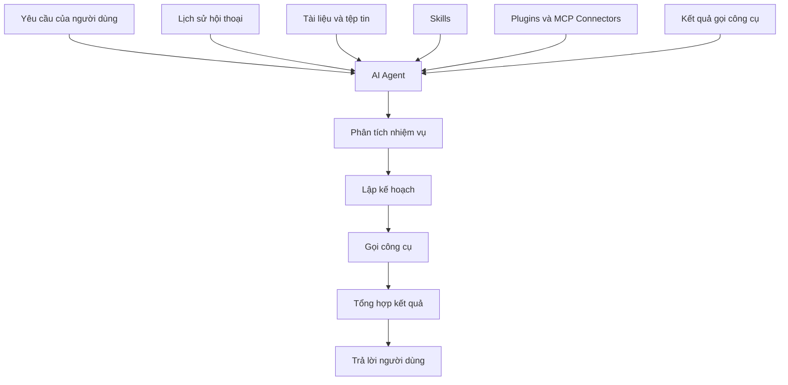
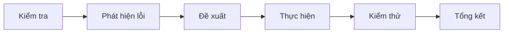
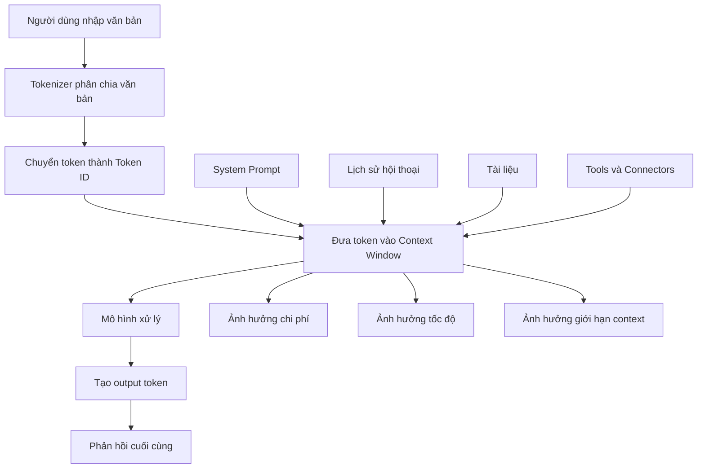

# 012 – Lời giải bài thực hành: Hiểu về Token và Context Window

## 1. Thông tin bài học

* **Chuyên đề:** Claude Cowork, Kỹ năng và Plugin trong tự động hóa quy trình
* **Loại bài:** Lời giải bài thực hành
* **Chủ đề chính:** Token, cách đếm token và quản lý cửa sổ ngữ cảnh
* **Mức độ:** Cơ bản

---

## 2. Ý tưởng chính

Bài học này trình bày lời giải cho bài thực hành về **token** và **context window**.

Thông qua công cụ tokenizer, chúng ta sẽ quan sát:

* Một câu được mô hình chia thành token như thế nào.
* Vì sao hai câu có ý nghĩa gần giống nhau lại có số token khác nhau.
* Token ảnh hưởng như thế nào đến chi phí, tốc độ và khả năng xử lý ngữ cảnh của mô hình AI.
* Vì sao cần tối ưu nội dung khi làm việc với AI Agent, Claude Cowork, MCP và các công cụ kết nối.

---

## 3. Mục tiêu học tập

Sau khi hoàn thành bài học, người học có thể:

1. So sánh câu trả lời của mình với lời giải tham khảo.
2. Hiểu cách một tokenizer chia văn bản thành các token.
3. Nhận biết rằng token không hoàn toàn tương ứng với từ.
4. Hiểu mối quan hệ giữa token, chi phí và cửa sổ ngữ cảnh.
5. Phát hiện và sửa các hiểu lầm phổ biến về token.
6. Biết cách viết yêu cầu hiệu quả hơn khi làm việc với AI Agent.

---

# 4. Ôn lại khái niệm quan trọng

## 4.1. Token là gì?

**Token** là một đơn vị văn bản mà mô hình ngôn ngữ sử dụng để xử lý thông tin.

Một token có thể là:

* Một từ hoàn chỉnh.
* Một phần của từ.
* Một dấu câu.
* Một khoảng trắng kết hợp với từ.
* Một ký tự đặc biệt.
* Một chuỗi ký tự hoặc mã số.

Ví dụ minh họa:

```text
Explain the difference between AI and machine learning.
```

Câu trên không nhất thiết được chia thành đúng số token bằng số từ. Dấu chấm cuối câu cũng có thể được xem là một token riêng.

> Token là đơn vị xử lý của mô hình, không phải đơn vị ngôn ngữ giống như từ hoặc câu.

---

## 4.2. Token ID là gì?

Sau khi văn bản được chia thành token, mỗi token được ánh xạ thành một con số gọi là **Token ID**.

Ví dụ minh họa:

```text
"Explain" → 849
" the"    → 279
"."       → 13
```

Các con số trên chỉ mang tính minh họa. Token ID thực tế phụ thuộc vào:

* Mô hình đang sử dụng.
* Bộ tokenizer của mô hình.
* Phiên bản tokenizer.
* Ngôn ngữ và nội dung đầu vào.

Mô hình không trực tiếp nhìn thấy câu chữ như con người. Phía sau hệ thống, văn bản thường được chuyển thành một chuỗi số:

```text
Văn bản
   ↓
Tokenizer
   ↓
Danh sách token
   ↓
Token ID
   ↓
Mô hình ngôn ngữ xử lý
```

---

# 5. Lời giải bài thực hành

## 5.1. Yêu cầu bài thực hành

Người học được yêu cầu:

1. Mở công cụ tokenizer.
2. Sao chép câu lệnh thứ nhất vào công cụ.
3. Quan sát số token và cách câu được chia nhỏ.
4. Thay thế bằng phiên bản lịch sự hơn.
5. So sánh số token giữa hai phiên bản.

---

## 5.2. Thử nghiệm thứ nhất: Prompt ngắn gọn

Prompt đầu tiên có dạng ngắn gọn, chẳng hạn:

```text
Explain the difference between AI and machine learning.
```

Trong ví dụ của bài giảng, công cụ hiển thị khoảng:

```text
13 tokens
```

Mỗi vùng màu trong tokenizer đại diện cho một token riêng biệt.

Khi nhấp vào từng token, công cụ có thể hiển thị:

* Nội dung token.
* Token ID.
* Vị trí token trong câu.
* Cách tokenizer phân tách từ và dấu câu.

### Điều cần quan sát

Dấu chấm ở cuối câu có thể trở thành một token riêng:

```text
.
```

Điều này cho thấy:

> Token không chỉ bao gồm các từ mang ý nghĩa mà còn có thể bao gồm dấu câu, khoảng trắng và những phần rất nhỏ của văn bản.

---

## 5.3. Thử nghiệm thứ hai: Prompt lịch sự hơn

Prompt thứ hai được bổ sung các từ lịch sự như:

```text
Please explain the difference between AI and machine learning. Thank you.
```

Trong ví dụ của bài giảng, số token tăng từ khoảng:

```text
13 tokens
```

lên:

```text
17 tokens
```

### Bảng so sánh

| Phiên bản  | Đặc điểm                       | Số token minh họa |
| ---------- | ------------------------------ | ----------------: |
| Prompt 1   | Ngắn gọn, đi thẳng vào yêu cầu |         Khoảng 13 |
| Prompt 2   | Thêm “Please” và “Thank you”   |         Khoảng 17 |
| Chênh lệch | Có thêm nội dung cần xử lý     |    Khoảng 4 token |

> Số token chính xác có thể khác nhau tùy theo mô hình và tokenizer được lựa chọn.

---

## 5.4. Vì sao “Thank you” có thể tạo nhiều token?

Con người thường xem “Thank you” là hai từ. Tuy nhiên, tokenizer có thể chia nó theo nhiều cách khác nhau:

```text
Thank
 you
.
```

Hoặc:

```text
 Thank
 you
.
```

Khoảng trắng đứng trước từ cũng có thể là một phần của token.

Vì vậy:

```text
Số từ ≠ Số token
```

---

# 6. Token ảnh hưởng như thế nào đến người dùng?

## 6.1. Ảnh hưởng đến chi phí

Các dịch vụ AI thường tính mức sử dụng dựa trên:

* **Input token:** Token được gửi vào mô hình.
* **Output token:** Token do mô hình tạo ra.
* **Cached token:** Token được tái sử dụng từ bộ nhớ đệm, nếu nền tảng hỗ trợ.
* **Reasoning token:** Token nội bộ phục vụ suy luận, tùy mô hình và nhà cung cấp.

Công thức khái quát:

```text
Tổng chi phí
= Chi phí input token
+ Chi phí output token
+ Các loại token bổ sung nếu có
```

Ví dụ:

```text
Prompt dài hơn
→ Nhiều input token hơn
→ Chi phí có thể tăng
```

Tuy nhiên, một vài từ lịch sự trong một cuộc hội thoại cá nhân thường tạo ra mức chênh lệch rất nhỏ. Tác động trở nên đáng kể khi được nhân lên trên:

* Hàng triệu người dùng.
* Hàng tỷ yêu cầu.
* Các quy trình tự động chạy liên tục.
* Hệ thống AI Agent gửi lại toàn bộ lịch sử nhiều lần.

---

## 6.2. Ảnh hưởng đến tốc độ

Prompt càng dài, mô hình càng phải xử lý nhiều dữ liệu đầu vào.

```text
Nhiều token đầu vào
        ↓
Nhiều dữ liệu cần xử lý
        ↓
Có thể tăng thời gian phản hồi
        ↓
Có thể tăng tài nguyên tính toán
```

Tốc độ thực tế còn phụ thuộc vào:

* Loại mô hình.
* Nhà cung cấp.
* Độ dài đầu ra.
* Tải của hệ thống.
* Cơ chế cache.
* Tool calling.
* Khả năng suy luận của mô hình.

---

## 6.3. Ảnh hưởng đến context window

**Context window** là tổng lượng token mà mô hình có thể xem xét trong một lần xử lý.

Context có thể bao gồm:

```text
System instruction
+ Yêu cầu của người dùng
+ Lịch sử hội thoại
+ Nội dung tài liệu
+ Kết quả tìm kiếm
+ Mô tả công cụ
+ Kết quả gọi công cụ
+ Nội dung mô hình tạo ra
```

Công thức khái quát:

```text
Tổng token trong context
= System prompt
+ Conversation history
+ User input
+ Documents
+ Tool definitions
+ Tool results
+ Output được tạo
```

Nếu tổng lượng token vượt quá giới hạn, hệ thống có thể:

* Loại bỏ một phần lịch sử cũ.
* Tóm tắt nội dung trước đó.
* Không đọc được toàn bộ tài liệu.
* Từ chối yêu cầu vì vượt giới hạn.
* Tạo câu trả lời thiếu thông tin.
* Quên các chi tiết quan trọng đã xuất hiện trước đó.

---

# 7. Vì sao quản lý context đặc biệt quan trọng với AI Agent?

Một chatbot thông thường có thể chỉ cần trả lời một câu hỏi. Tuy nhiên, một AI Agent phải xử lý nhiều lớp thông tin hơn.

Ví dụ, một Agent đang xây dựng mô hình tài chính có thể cần biết:

* Mục tiêu dự án.
* Các quy tắc tính toán.
* Dữ liệu Excel.
* Tài liệu hướng dẫn.
* Các kỹ năng được cài đặt.
* Công cụ tạo biểu đồ.
* Connector kết nối Google Drive.
* MCP server đang khả dụng.
* Các thao tác đã thực hiện.
* Những quyết định trước đó của người dùng.
* Định dạng đầu ra mong muốn.

## Sơ đồ context của AI Agent



Nếu context chứa quá nhiều thông tin không liên quan, Agent có thể:

* Tốn nhiều token hơn.
* Xử lý chậm hơn.
* Bị phân tán khỏi nhiệm vụ chính.
* Chọn sai công cụ.
* Bỏ sót yêu cầu quan trọng.
* Tạo kết quả kém nhất quán.

---

# 8. Các quyết định quản lý context

## 8.1. Chỉ cung cấp dữ liệu liên quan

Không nên gửi toàn bộ dự án nếu nhiệm vụ chỉ liên quan đến một tệp.

### Chưa tối ưu

```text
Đây là toàn bộ 150 tệp trong dự án. Hãy sửa màu của nút đăng nhập.
```

### Tối ưu hơn

```text
Hãy sửa màu nút đăng nhập trong LoginButton.tsx theo token
color.primary. Không thay đổi kích thước hoặc hành vi của nút.
```

---

## 8.2. Tách nhiệm vụ lớn thành các bước

Thay vì yêu cầu Agent thực hiện toàn bộ quy trình trong một lần, có thể chia thành:

```text
Bước 1: Kiểm tra dữ liệu
Bước 2: Phát hiện lỗi
Bước 3: Đề xuất phương án
Bước 4: Thực hiện sửa đổi
Bước 5: Kiểm thử
Bước 6: Tổng kết thay đổi
```

Sơ đồ:



Cách làm này giúp:

* Giảm sự mơ hồ.
* Dễ kiểm soát chất lượng.
* Tạo điểm kiểm tra cho con người.
* Tránh việc Agent thực hiện quá nhiều thay đổi cùng lúc.

---

## 8.3. Tóm tắt lịch sử khi dự án kéo dài

Sau một cuộc hội thoại dài, nên tạo bản tóm tắt gồm:

* Mục tiêu dự án.
* Những việc đã hoàn thành.
* Quyết định đã thống nhất.
* Các tệp đã thay đổi.
* Vấn đề còn tồn tại.
* Bước tiếp theo.

Ví dụ:

```markdown
## Trạng thái dự án

- Đã hoàn thành API đăng nhập.
- Đã thêm xác thực JWT.
- Chưa xử lý refresh token.
- Không thay đổi cấu trúc bảng users.
- Bước tiếp theo: viết unit test cho auth service.
```

Bản tóm tắt này có thể thay thế nhiều đoạn hội thoại cũ, giúp tiết kiệm context.

---

## 8.4. Tránh lặp lại thông tin không cần thiết

### Dài dòng

```text
Xin chào. Tôi hy vọng bạn đang có một ngày thật tuyệt vời. Tôi rất cảm
ơn sự hỗ trợ của bạn. Tôi muốn nhờ bạn, nếu có thể, vui lòng giúp tôi...
```

### Hiệu quả hơn

```text
Hãy kiểm tra tệp sales.xlsx và tóm tắt doanh thu theo quý.
```

Điều này không có nghĩa là người dùng bắt buộc phải giao tiếp cộc lốc. Mục tiêu là:

> Giữ lại sự lịch sự cần thiết nhưng loại bỏ những phần không đóng góp cho nhiệm vụ.

---

# 9. Những hiểu lầm phổ biến

## Hiểu lầm 1: Một từ luôn bằng một token

**Không chính xác.**

Một từ có thể:

* Là một token.
* Bị chia thành nhiều token.
* Kết hợp với khoảng trắng thành một token.
* Được xử lý khác nhau giữa các tokenizer.

```text
Số từ không thể dùng để suy ra chính xác số token.
```

---

## Hiểu lầm 2: Token chỉ tính cho câu hỏi của người dùng

**Không chính xác.**

Context còn có thể chứa:

* System prompt.
* Lịch sử hội thoại.
* Tài liệu đính kèm.
* Mô tả các công cụ.
* Kết quả gọi API.
* Nội dung đầu ra.
* Dữ liệu được Agent tự tạo trong quá trình làm việc.

---

## Hiểu lầm 3: Chỉ cần quan tâm đến input token

**Không chính xác.**

Một yêu cầu ngắn vẫn có thể tốn nhiều token nếu mô hình tạo câu trả lời rất dài.

```text
Tổng mức sử dụng = Input token + Output token
```

Trong một số hệ thống còn có thêm các loại token khác.

---

## Hiểu lầm 4: Context window là bộ nhớ vĩnh viễn

**Không chính xác.**

Context window chỉ là lượng thông tin mô hình có thể xem xét trong một lần xử lý. Nó không đồng nghĩa với:

* Bộ nhớ lâu dài.
* Cơ sở dữ liệu.
* Kho lưu trữ dự án.
* Khả năng nhớ vĩnh viễn tất cả cuộc hội thoại.

Muốn duy trì thông tin lâu dài, hệ thống có thể cần:

* Database.
* Vector database.
* Memory service.
* File storage.
* Bản tóm tắt trạng thái.
* Cơ chế truy xuất dữ liệu.

---

## Hiểu lầm 5: Càng cung cấp nhiều context càng tốt

**Không phải lúc nào cũng đúng.**

Context tốt phải đáp ứng hai điều kiện:

```text
Đủ thông tin + Đúng thông tin
```

Quá ít context khiến mô hình thiếu dữ liệu. Quá nhiều context không liên quan có thể làm tăng:

* Chi phí.
* Độ trễ.
* Nhiễu thông tin.
* Nguy cơ mô hình bỏ sót chỉ dẫn chính.

---

## Hiểu lầm 6: Không bao giờ nên nói “please” hoặc “thank you”

Đây là cách hiểu quá cực đoan.

Thêm một vài từ lịch sự sẽ tạo thêm token, nhưng trong một yêu cầu cá nhân, mức tăng thường rất nhỏ. Điều quan trọng hơn là tránh:

* Các đoạn mở đầu dài.
* Lặp lại yêu cầu nhiều lần.
* Gửi lại tài liệu không liên quan.
* Yêu cầu mô hình tạo đầu ra dài hơn mức cần thiết.
* Giữ toàn bộ lịch sử khi chỉ cần một bản tóm tắt.

Một prompt tốt vẫn có thể vừa lịch sự vừa hiệu quả:

```text
Vui lòng kiểm tra tệp này và liệt kê năm lỗi quan trọng nhất.
Trình bày kết quả dưới dạng bảng ngắn gọn.
```

---

# 10. Mô hình tư duy tổng quát



---

# 11. Nguyên tắc tối ưu prompt

Một prompt hiệu quả thường gồm bốn thành phần:

```text
Mục tiêu
+ Context liên quan
+ Ràng buộc
+ Định dạng đầu ra
```

## Ví dụ chưa tối ưu

```text
Bạn có thể giúp tôi xem tệp này được không? Tôi muốn biết có vấn đề gì
không. Hãy xem thật kỹ và cho tôi biết mọi thứ bạn nghĩ đến.
```

## Ví dụ tối ưu

```text
Kiểm tra tệp sales.xlsx.

Yêu cầu:
1. Phát hiện ô trống trong các cột bắt buộc.
2. Tìm bản ghi trùng lặp theo order_id.
3. Tính tổng doanh thu theo quý.
4. Trình bày kết quả bằng bảng Markdown.
5. Không chỉnh sửa tệp gốc.
```

Prompt thứ hai dài hơn một chút nhưng hiệu quả hơn vì:

* Mục tiêu rõ ràng.
* Phạm vi được giới hạn.
* Giảm số lần hỏi lại.
* Hạn chế kết quả lan man.
* Giảm khả năng phải thực hiện lại nhiệm vụ.

> Tối ưu token không có nghĩa là luôn viết prompt ngắn nhất. Prompt tốt là prompt sử dụng số token hợp lý để tạo ra kết quả chính xác ngay từ đầu.

---

# 12. Checklist quản lý token và context

Trước khi gửi yêu cầu cho AI Agent, hãy kiểm tra:

* [ ] Mục tiêu đã rõ ràng chưa?
* [ ] Có thông tin nào không liên quan đang được gửi kèm không?
* [ ] Có đang lặp lại nội dung đã cung cấp trước đó không?
* [ ] Có thể thay lịch sử dài bằng một bản tóm tắt không?
* [ ] Đã chỉ định tệp hoặc dữ liệu cần sử dụng chưa?
* [ ] Đã giới hạn phạm vi thay đổi chưa?
* [ ] Đã mô tả định dạng đầu ra chưa?
* [ ] Có cần yêu cầu đầu ra dài đến mức đó không?
* [ ] Agent có thực sự cần tất cả các tool và connector hiện tại không?
* [ ] Có điểm kiểm tra của con người trước hành động quan trọng không?

---

# 13. Câu hỏi tự kiểm tra

## Câu 1

Token có luôn tương ứng với một từ không?

**Đáp án:** Không. Một token có thể là một từ, một phần của từ, dấu câu, khoảng trắng kết hợp với từ hoặc ký tự đặc biệt.

---

## Câu 2

Vì sao thêm “please” và “thank you” làm số token tăng?

**Đáp án:** Vì các từ và dấu câu bổ sung cũng phải được tokenizer chuyển thành token để mô hình xử lý.

---

## Câu 3

Những thành phần nào có thể chiếm context window?

**Đáp án:** System prompt, yêu cầu người dùng, lịch sử hội thoại, tài liệu, mô tả công cụ, kết quả gọi công cụ và nội dung đầu ra.

---

## Câu 4

Prompt ngắn nhất có luôn là prompt tốt nhất không?

**Đáp án:** Không. Prompt quá ngắn có thể thiếu yêu cầu, khiến mô hình trả lời sai hoặc phải hỏi lại. Prompt tốt cần rõ ràng, đầy đủ và không chứa nội dung dư thừa.

---

## Câu 5

Vì sao context management quan trọng với AI Agent?

**Đáp án:** Vì Agent phải xử lý mục tiêu, lịch sử, tệp tin, kỹ năng, công cụ và kết quả trung gian. Context không được quản lý tốt sẽ làm tăng chi phí, độ trễ và nguy cơ sai lệch.

---

# 14. Bài tập thực hành mở rộng

Hãy thử nhập ba prompt sau vào một tokenizer và so sánh kết quả.

### Prompt A

```text
Summarize this document.
```

### Prompt B

```text
Please summarize this document. Thank you.
```

### Prompt C

```text
Summarize this document in five bullet points. Focus on the main findings,
risks, and recommended actions. Do not include background information.
```

Sau đó trả lời:

1. Prompt nào có ít token nhất?
2. Prompt nào mô tả kết quả rõ nhất?
3. Prompt nào có khả năng giảm số lần trao đổi lại?
4. Việc sử dụng nhiều token hơn trong Prompt C có hợp lý không?
5. Bạn sẽ lựa chọn prompt nào cho một quy trình tự động?

### Kết luận dự kiến

Prompt C có thể sử dụng nhiều input token hơn nhưng vẫn hiệu quả hơn trong thực tế vì nó:

* Giảm sự mơ hồ.
* Kiểm soát độ dài đầu ra.
* Giảm số lần sửa lại.
* Tạo kết quả phù hợp ngay từ lần đầu.

---

# 15. Tại sao bài học này quan trọng?

Những hiểu lầm nhỏ về token có thể trở thành vấn đề lớn khi xây dựng:

* Quy trình AI tự động.
* Hệ thống RAG.
* AI Agent nhiều bước.
* Plugin và Skill.
* MCP Connector.
* Trợ lý phân tích tài liệu.
* Quy trình xử lý Excel.
* Hệ thống tạo PowerPoint tự động.
* Chatbot có lịch sử dài.

Hiểu đúng về token và context window giúp người học:

* Kiểm soát chi phí.
* Cải thiện tốc độ.
* Giảm nội dung dư thừa.
* Tăng độ chính xác.
* Thiết kế quy trình bền vững hơn.
* Biết khi nào cần tóm tắt, chia nhỏ hoặc truy xuất dữ liệu.

---

# 16. Tổng kết bài học

Trong bài học này, chúng ta đã:

1. Sử dụng tokenizer để quan sát cách văn bản được chia thành token.
2. So sánh một prompt ngắn với một prompt có thêm từ ngữ lịch sự.
3. Thấy rằng nội dung bổ sung sẽ làm số token tăng.
4. Hiểu rằng token ảnh hưởng đến chi phí, tốc độ và context window.
5. Nhận biết context của AI Agent còn bao gồm tệp, công cụ, connector và kết quả trung gian.
6. Học cách tối ưu context mà không làm mất đi những thông tin quan trọng.
7. Sửa các hiểu lầm phổ biến về token và bộ nhớ của mô hình.

## Công thức ghi nhớ

```text
Prompt hiệu quả
= Đủ rõ ràng
+ Đủ context
+ Không dư thừa
+ Có ràng buộc
+ Có định dạng đầu ra
```

## Thông điệp chính

> Đừng chỉ cố viết prompt ngắn nhất. Hãy viết prompt sử dụng context một cách có chủ đích để mô hình hiểu đúng và hoàn thành nhiệm vụ ngay từ lần đầu.
