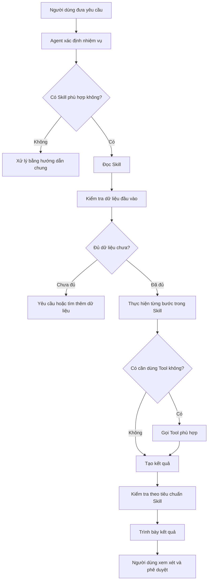
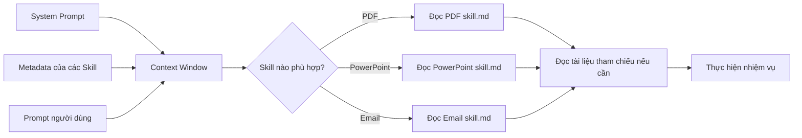
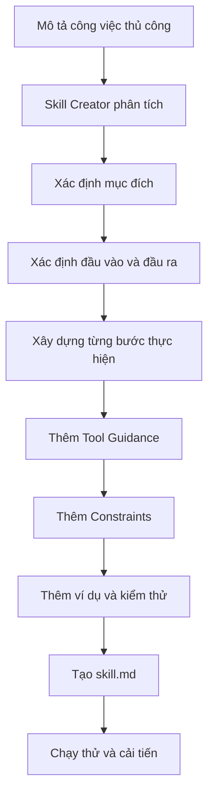
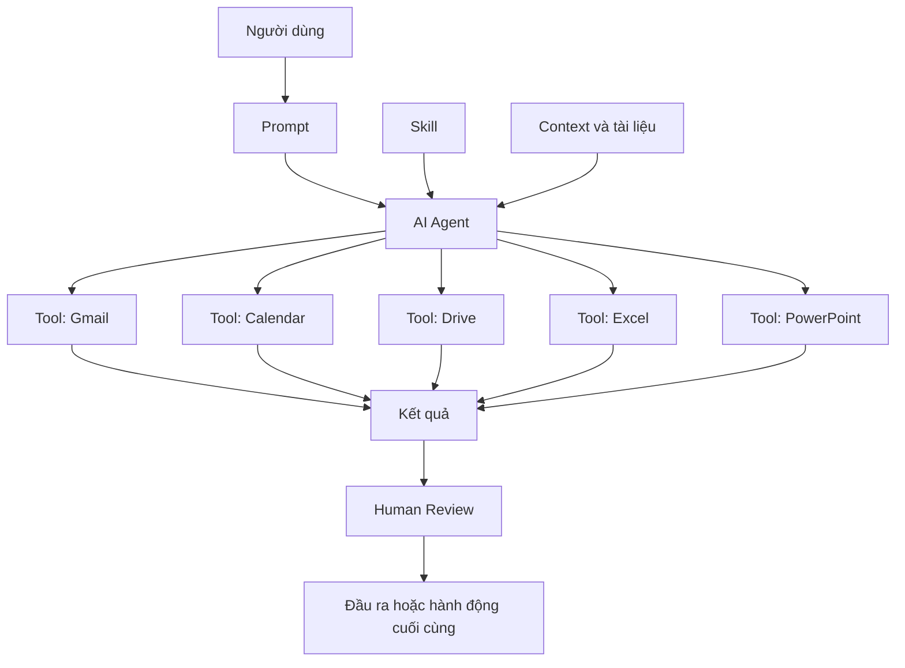

# 013 – Agent Skills: Kỹ năng dành cho AI Agent

## 1. Tổng quan bài học

**Phần học:** Claude Cowork, Skills & Plugins Mastery for Workflow Automation

**Chủ đề chính:** Hiểu cách **Skills** đóng gói kiến thức, quy trình và hướng dẫn sử dụng công cụ để AI Agent có thể thực hiện công việc một cách nhất quán, tái sử dụng được và dễ chia sẻ.

Trong Claude Cowork, một **Skill** cung cấp cho Claude kiến thức chuyên biệt và quy trình thực hiện một nhiệm vụ cụ thể. Thay vì phải giải thích lại toàn bộ yêu cầu trong mỗi phiên làm việc, người dùng có thể định nghĩa quy trình một lần trong tệp Skill và sử dụng lại nhiều lần.

---

## 2. Mục tiêu học tập

Sau khi hoàn thành bài học này, người học có thể:

* Giải thích được khái niệm **Agent Skill**.
* Hiểu các thành phần chính của một Skill.
* Biết cách Skill hướng dẫn Agent sử dụng công cụ.
* Phân biệt Skill tích hợp sẵn, Skill tùy chỉnh và Skill của đối tác.
* Hiểu cách Claude tải Skill động để tiết kiệm Context Window.
* Biết cách thiết kế một Skill có thể tái sử dụng.
* Nhận biết lợi ích và rủi ro khi cài đặt Skill từ bên thứ ba.

---

# 3. Agent Skill là gì?

## 3.1. Định nghĩa

**Agent Skill** là một gói hướng dẫn giúp AI Agent thực hiện một nhiệm vụ hoặc đảm nhiệm một vai trò chuyên biệt.

Một Skill thường mô tả:

* Skill dùng để làm gì.
* Khi nào nên sử dụng Skill.
* Dữ liệu đầu vào cần có.
* Các bước cần thực hiện.
* Công cụ nào được phép sử dụng.
* Các quy tắc và giới hạn phải tuân thủ.
* Đầu ra cần được trình bày như thế nào.
* Cách kiểm tra chất lượng kết quả.

Có thể xem Skill như một **quy trình vận hành chuẩn dành cho AI Agent**.

> **Prompt thông thường** yêu cầu Agent thực hiện một công việc tại thời điểm hiện tại.
> **Skill** dạy Agent cách thực hiện loại công việc đó trong nhiều phiên làm việc khác nhau.

---

## 3.2. Ví dụ đơn giản

Không sử dụng Skill:

```text
Hãy tạo một bài thuyết trình.

Bài thuyết trình phải có:
- Trang tiêu đề
- Mục lục
- Mỗi slide chỉ có một ý chính
- Không sử dụng quá nhiều chữ
- Có hình minh họa
- Có slide tổng kết
- Kiểm tra lỗi chính tả
- Xuất ra định dạng PowerPoint
```

Mỗi lần tạo bài thuyết trình, người dùng phải lặp lại các hướng dẫn trên.

Khi sử dụng Skill:

```text
Hãy tạo bài thuyết trình về Agent Skills bằng PowerPoint Skill.
```

PowerPoint Skill đã chứa sẵn:

* Quy tắc bố cục.
* Cách chia nội dung thành slide.
* Tiêu chuẩn thiết kế.
* Cách chọn hình minh họa.
* Quy trình kiểm tra.
* Định dạng đầu ra.

---

# 4. Vì sao cần sử dụng Skills?

## 4.1. Vấn đề của Prompt đơn lẻ

Khi chỉ dùng Prompt thông thường, người dùng thường phải:

1. Giải thích lại bối cảnh.
2. Mô tả quy trình.
3. Nhắc lại tiêu chuẩn đầu ra.
4. Chỉ định công cụ cần sử dụng.
5. Nhắc Agent kiểm tra kết quả.
6. Sửa các lỗi không nhất quán.

Điều này dẫn đến:

* Prompt dài.
* Tốn Context Window.
* Kết quả không ổn định.
* Khó chia sẻ quy trình cho người khác.
* Dễ bỏ sót yêu cầu.
* Mất thời gian giải thích lại.

## 4.2. Giải pháp bằng Skills

Skill cho phép:

```text
Định nghĩa một lần
        ↓
Lưu thành quy trình
        ↓
Tái sử dụng nhiều lần
        ↓
Chia sẻ cho nhiều Agent hoặc nhiều dự án
```

Các hướng dẫn chi tiết, ví dụ, lỗi thường gặp và quy trình kiểm tra có thể được định nghĩa một lần trong Skill thay vì nhồi toàn bộ vào từng Prompt.

---

# 5. Cấu trúc của một Skill

Một Skill thường được lưu trong tệp:

```text
skill.md
```

Tệp này sử dụng Markdown để mô tả cách Agent thực hiện nhiệm vụ.

## 5.1. Cấu trúc tổng quát

```text
Skill
├── Metadata
│   ├── Name
│   └── Description
│
├── Purpose
├── When to use
├── Required inputs
├── Instructions
├── Tool guidance
├── Constraints
├── Output expectations
├── Examples
├── Validation rules
└── Additional references
```

---

## 5.2. Metadata

Metadata nằm ở phần đầu của Skill, thường bao gồm:

* `name`: Tên Skill.
* `description`: Skill làm gì và khi nào nên sử dụng.

Ví dụ:

```yaml
---
name: linkedin-post-writer
description: Tạo bài đăng LinkedIn có cấu trúc rõ ràng, phần mở đầu thu hút và lời kêu gọi hành động phù hợp.
---
```

Metadata giúp Agent nhận biết nhanh:

* Agent đang có những Skill nào.
* Skill nào phù hợp với yêu cầu hiện tại.
* Khi nào cần đọc toàn bộ nội dung của Skill.

Claude không nhất thiết tải toàn bộ mọi Skill ngay từ đầu. Trước tiên, hệ thống có thể chỉ cung cấp tên và mô tả ngắn; khi nhiệm vụ phù hợp, Claude mới đọc toàn bộ tệp `skill.md`.

---

## 5.3. Purpose – Mục đích

Phần này trả lời câu hỏi:

> Skill này tồn tại để giải quyết vấn đề gì?

Ví dụ:

```markdown
## Purpose

Skill này giúp tạo các bài đăng LinkedIn dành cho chuyên gia công nghệ,
có phần mở đầu thu hút, nội dung dễ đọc và lời kêu gọi hành động rõ ràng.
```

Purpose nên:

* Cụ thể.
* Có phạm vi rõ ràng.
* Gắn với một kết quả thực tế.
* Tránh mô tả quá rộng.

Không nên viết:

```text
Skill này dùng để viết nội dung.
```

Nên viết:

```text
Skill này dùng để tạo bài đăng LinkedIn chia sẻ kiến thức chuyên môn,
tối ưu khả năng đọc và khuyến khích người đọc tương tác.
```

---

## 5.4. Instructions – Hướng dẫn thực hiện

Instructions là phần cốt lõi của Skill.

Nó mô tả từng bước Agent phải thực hiện.

Ví dụ:

```markdown
## Instructions

1. Xác định đối tượng đọc.
2. Xác định thông điệp chính.
3. Tạo ba phương án mở đầu.
4. Chọn phương án có tính thu hút cao nhất.
5. Viết nội dung bằng các đoạn ngắn.
6. Bổ sung ví dụ hoặc số liệu khi phù hợp.
7. Kết thúc bằng một câu hỏi hoặc lời kêu gọi hành động.
8. Kiểm tra lỗi chính tả và độ rõ ràng trước khi trả kết quả.
```

Một hướng dẫn tốt cần:

* Có thứ tự rõ ràng.
* Sử dụng động từ hành động.
* Chỉ định điều kiện.
* Nêu cách xử lý ngoại lệ.
* Có bước kiểm tra cuối cùng.

---

## 5.5. Constraints – Các ràng buộc

Constraints xác định những điều Agent:

* Phải thực hiện.
* Không được thực hiện.
* Chỉ được thực hiện khi có điều kiện.

Ví dụ:

```markdown
## Constraints

- Không sử dụng thông tin chưa được xác minh như một sự thật.
- Không bịa số liệu, nguồn tham khảo hoặc trích dẫn.
- Không sử dụng quá năm hashtag.
- Không tạo nội dung xúc phạm hoặc gây hiểu nhầm.
- Không gửi hoặc đăng bài nếu chưa được người dùng phê duyệt.
```

Ràng buộc giúp giảm:

* Sai lệch.
* Hành động ngoài ý muốn.
* Nội dung không nhất quán.
* Rủi ro khi Agent sử dụng công cụ bên ngoài.

---

## 5.6. Input Expectations – Yêu cầu đầu vào

Skill cần xác định dữ liệu đầu vào cần thiết.

Ví dụ:

```markdown
## Required Inputs

- Chủ đề bài viết.
- Đối tượng độc giả.
- Mục tiêu bài viết.
- Giọng văn mong muốn.
- Độ dài dự kiến.

## Optional Inputs

- Tài liệu tham khảo.
- Từ khóa.
- Ví dụ cá nhân.
- Sản phẩm hoặc dịch vụ cần giới thiệu.
```

Việc phân biệt đầu vào bắt buộc và tùy chọn giúp Agent:

* Biết khi nào đã đủ dữ liệu.
* Biết dữ liệu nào có thể tự suy luận.
* Biết khi nào cần hỏi lại.
* Tránh thực hiện công việc với thông tin thiếu nghiêm trọng.

---

## 5.7. Output Expectations – Yêu cầu đầu ra

Output Expectations mô tả kết quả cuối cùng phải có cấu trúc như thế nào.

Ví dụ:

```markdown
## Output Format

Trả kết quả theo cấu trúc:

1. Hook
2. Nội dung chính
3. Bài học hoặc kết luận
4. Lời kêu gọi hành động
5. Hashtag

Độ dài từ 150 đến 250 từ.
```

Đầu ra càng được mô tả rõ thì kết quả càng ổn định.

---

## 5.8. Examples – Ví dụ

Ví dụ giúp Agent hiểu:

* Kết quả tốt trông như thế nào.
* Kết quả không tốt có đặc điểm gì.
* Giọng văn cần sử dụng.
* Cách xử lý các trường hợp khác nhau.

Một Skill có thể chứa:

```markdown
## Good Example

Tôi từng nghĩ rằng để xây dựng một sản phẩm AI,
điều quan trọng nhất là chọn mô hình mạnh nhất.

Sau ba lần triển khai thất bại, tôi nhận ra vấn đề thực sự
nằm ở dữ liệu, quy trình đánh giá và trải nghiệm người dùng.

...

## Bad Example

Sản phẩm của chúng tôi có nhiều tính năng AI tuyệt vời.
Hãy sử dụng sản phẩm ngay hôm nay.
```

Phần giải thích nên nêu rõ lý do:

```markdown
Ví dụ không tốt vì:

- Không có câu mở đầu thu hút.
- Chỉ liệt kê tính năng.
- Không có câu chuyện.
- Không mang lại giá trị cụ thể cho người đọc.
```

Trong ví dụ Skill viết LinkedIn của bài giảng, Skill không chỉ cung cấp quy trình mà còn chứa các mẫu Hook, cách điều chỉnh giọng văn, những cách viết không hiệu quả và bước tự đánh giá kết quả.

---

# 6. Hướng dẫn sử dụng công cụ trong Skill

Skill không nhất thiết là một công cụ.

Skill là **hướng dẫn cho Agent về cách và khi nào sử dụng công cụ**.

## 6.1. Phân biệt Skill và Tool

| Thành phần | Vai trò                                         |
| ---------- | ----------------------------------------------- |
| Skill      | Mô tả cách thực hiện công việc                  |
| Tool       | Thực hiện một hành động cụ thể                  |
| Connector  | Kết nối Agent với dịch vụ bên ngoài             |
| Plugin     | Có thể đóng gói nhiều Tool, Skill và tài nguyên |
| Prompt     | Yêu cầu cụ thể của người dùng                   |

Ví dụ:

```text
Skill: Quy trình soạn và gửi email chuyên nghiệp
Tool: Gmail
Connector: Kết nối Claude với tài khoản Gmail
Prompt: Gửi email xác nhận cuộc họp cho khách hàng
```

---

## 6.2. Một Skill có thể hướng dẫn Tool như thế nào?

Ví dụ:

```markdown
## Tool Usage

1. Sử dụng công cụ tìm kiếm Gmail để xác định chuỗi email liên quan.
2. Đọc toàn bộ chuỗi hội thoại trước khi soạn phản hồi.
3. Tạo bản nháp thay vì gửi ngay.
4. Hiển thị nội dung để người dùng kiểm tra.
5. Chỉ sử dụng thao tác gửi khi người dùng xác nhận rõ ràng.
```

Đây chính là cách kết hợp:

```text
Skill + Tool + Human Review
```

---

## 6.3. Quy trình thực thi mẫu



---

# 7. Skills và Context Window

## 7.1. Vấn đề của việc tải toàn bộ Skill

Giả sử Agent có 100 Skill và mỗi Skill dài 3.000 token.

Nếu tải tất cả cùng lúc:

```text
100 × 3.000 = 300.000 token
```

Điều này có thể:

* Chiếm phần lớn Context Window.
* Làm tăng chi phí.
* Giảm không gian dành cho tài liệu của người dùng.
* Làm Agent khó tập trung vào nhiệm vụ chính.
* Tăng khả năng nhiễu thông tin.

---

## 7.2. Dynamic Loading – Tải động

Thay vì tải toàn bộ nội dung, hệ thống có thể chỉ tải:

```text
Tên Skill + Mô tả ngắn
```

Khi người dùng đưa ra yêu cầu phù hợp, Agent mới đọc nội dung đầy đủ của Skill.



Quy trình này có thể được hiểu như sau:

1. System Prompt được nạp.
2. Metadata của các Skill được cung cấp.
3. Người dùng gửi Prompt.
4. Agent xác định Skill phù hợp.
5. Agent đọc toàn bộ `skill.md`.
6. Skill có thể dẫn đến các tệp tham chiếu khác.
7. Agent thực hiện nhiệm vụ.
8. Chỉ nội dung cần thiết mới chiếm Context Window.

Bài giảng mô tả rằng Claude có thể nhận biết Skill thông qua metadata, sau đó đọc toàn bộ `skill.md` và các tệp liên quan như `forms.md` khi nhiệm vụ thực sự cần đến chúng.

---

# 8. Các loại Agent Skill

## 8.1. Built-in Skills – Skill tích hợp sẵn

Đây là các Skill được nền tảng cung cấp mặc định.

Ví dụ:

* Xử lý bảng tính.
* Tạo tài liệu.
* Tạo bài thuyết trình.
* Xử lý PDF.
* Tổ chức tệp.
* Phân tích dữ liệu.

### Ưu điểm

* Có thể sử dụng ngay.
* Được thiết kế theo chuẩn của nền tảng.
* Thường có độ ổn định cao.
* Không cần tự xây dựng từ đầu.

---

## 8.2. Custom Skills – Skill tùy chỉnh

Custom Skill được người dùng hoặc tổ chức tự xây dựng.

Ví dụ:

* Skill viết báo cáo theo mẫu của công ty.
* Skill kiểm tra Pull Request.
* Skill phân loại hóa đơn.
* Skill tạo nội dung cho thương hiệu.
* Skill kiểm tra dữ liệu chiêm tinh.
* Skill tạo đề kiểm tra tiếng Anh.
* Skill viết tài liệu kỹ thuật cho dự án.

### Ưu điểm

* Phù hợp với quy trình riêng.
* Có thể chứa thuật ngữ nội bộ.
* Áp dụng tiêu chuẩn riêng của tổ chức.
* Giảm thời gian đào tạo Agent.

---

## 8.3. Partner Skills – Skill của đối tác

Đây là Skill được phát triển bởi các nền tảng hoặc tổ chức bên ngoài.

Ví dụ:

* Figma.
* Notion.
* Công cụ quản lý dự án.
* Hệ thống CRM.
* Nền tảng viết nội dung.
* Công cụ lập trình.

Các Skill này thường hướng dẫn Agent cách làm việc hiệu quả với dịch vụ của đối tác.

Bài giảng chia Skills thành ba nhóm chính: Skill tích hợp sẵn, Skill tùy chỉnh và Skill do đối tác cung cấp.

---

# 9. Tính tái sử dụng và chia sẻ

## 9.1. Tái sử dụng giữa nhiều phiên làm việc

Skill cho phép cùng một quy trình được áp dụng nhất quán:

```text
Phiên 1: Tạo báo cáo doanh thu tháng 1
Phiên 2: Tạo báo cáo doanh thu tháng 2
Phiên 3: Tạo báo cáo doanh thu tháng 3
```

Cả ba phiên đều có thể sử dụng cùng một:

```text
monthly-sales-report-skill
```

Nhờ đó, các báo cáo có cùng:

* Cấu trúc.
* Cách tính toán.
* Định dạng.
* Tiêu chuẩn trình bày.
* Quy trình kiểm tra.

---

## 9.2. Tái sử dụng giữa nhiều dự án

Một Skill tổng quát có thể được dùng cho nhiều dự án.

Ví dụ:

```text
code-review-skill
├── Dự án thương mại điện tử
├── Dự án AI
├── Ứng dụng di động
└── Hệ thống backend
```

Skill có thể chứa quy trình chung, còn thông tin riêng của từng dự án được cung cấp qua:

* Prompt.
* Tệp cấu hình.
* Tài liệu tham chiếu.
* Biến đầu vào.

---

## 9.3. Chia sẻ trong nhóm

Một nhóm có thể xây dựng thư viện Skill:

```text
team-skills/
├── meeting-summary/
│   └── skill.md
├── pull-request-review/
│   └── skill.md
├── customer-support/
│   └── skill.md
├── sales-report/
│   └── skill.md
└── presentation-builder/
    └── skill.md
```

Lợi ích:

* Thành viên mới nhanh chóng tiếp cận quy trình.
* Giảm sự phụ thuộc vào kiến thức truyền miệng.
* Tiêu chuẩn làm việc được thống nhất.
* Có thể quản lý phiên bản Skill.
* Dễ kiểm tra và cải tiến quy trình.

---

# 10. Ví dụ một Skill hoàn chỉnh

```markdown
---
name: meeting-summary
description: Tóm tắt biên bản cuộc họp, xác định quyết định, công việc cần làm, người phụ trách và thời hạn.
---

# Meeting Summary Skill

## Purpose

Chuyển nội dung cuộc họp thành bản tóm tắt ngắn gọn,
có thể sử dụng để theo dõi công việc.

## Required Inputs

- Nội dung cuộc họp hoặc bản ghi âm đã chuyển thành văn bản.

## Optional Inputs

- Danh sách người tham gia.
- Tên dự án.
- Múi giờ.
- Ngày họp.

## Instructions

1. Đọc toàn bộ nội dung cuộc họp.
2. Xác định mục tiêu của cuộc họp.
3. Tách các chủ đề thảo luận chính.
4. Xác định các quyết định đã được thống nhất.
5. Trích xuất từng công việc cần thực hiện.
6. Gắn người phụ trách và thời hạn nếu được đề cập.
7. Ghi rõ các vấn đề chưa được giải quyết.
8. Kiểm tra rằng không có quyết định nào bị suy diễn.

## Constraints

- Không tự tạo thời hạn nếu cuộc họp không đề cập.
- Không gán người phụ trách dựa trên suy đoán.
- Không trình bày ý kiến cá nhân như quyết định chung.
- Đánh dấu rõ thông tin chưa xác định.

## Output Format

# Tóm tắt cuộc họp

## Mục tiêu

## Nội dung chính

## Quyết định

## Công việc cần thực hiện

| Công việc | Người phụ trách | Thời hạn | Trạng thái |
|---|---|---|---|

## Vấn đề chưa giải quyết

## Cuộc họp tiếp theo
```

---

# 11. Ví dụ: Skill xử lý Excel

Một Excel Skill có thể quy định:

```markdown
## Workflow

1. Kiểm tra tên các Sheet.
2. Xác định hàng tiêu đề.
3. Phát hiện cột trống và dữ liệu thiếu.
4. Kiểm tra kiểu dữ liệu.
5. Chuẩn hóa ngày tháng và tiền tệ.
6. Không sửa dữ liệu gốc trực tiếp.
7. Tạo một Sheet kết quả mới.
8. Tạo bảng tổng hợp.
9. Tạo biểu đồ khi biểu đồ giúp làm rõ dữ liệu.
10. Ghi chú mọi giả định.
```

Prompt của người dùng có thể rất ngắn:

```text
Phân tích file doanh thu này bằng Excel Analysis Skill.
```

Agent sẽ biết cần:

* Đọc bảng tính.
* Làm sạch dữ liệu.
* Tính các chỉ số.
* Trình bày kết quả.
* Không ghi đè lên dữ liệu gốc.
* Kiểm tra trước khi xuất file.

---

# 12. Skill Creator – Skill tạo ra Skill khác

Một khái niệm đáng chú ý là **Skill Creator**.

Đây là một Skill chuyên giúp người dùng:

* Phân tích quy trình hiện tại.
* Xác định đầu vào và đầu ra.
* Tách quy trình thành các bước.
* Xây dựng ràng buộc.
* Viết tệp `skill.md`.
* Kiểm tra chất lượng Skill.
* Tạo ví dụ kiểm thử.

Quy trình:



Đây là một hình thức:

> Agent sử dụng Skill để tạo thêm Skill cho Agent.

---

# 13. Những đặc điểm của một Skill tốt

## 13.1. Mục đích cụ thể

Skill nên tập trung vào một nhiệm vụ hoặc một nhóm nhiệm vụ liên quan.

Không tốt:

```text
Skill làm mọi công việc văn phòng.
```

Tốt hơn:

```text
Skill tạo báo cáo hiệu suất bán hàng hằng tháng từ bảng tính.
```

---

## 13.2. Các bước có thể thực thi

Mỗi bước cần rõ ràng và có thể kiểm tra.

Không tốt:

```text
Hãy phân tích dữ liệu thật kỹ.
```

Tốt hơn:

```text
1. Kiểm tra dữ liệu trùng lặp.
2. Tính tỷ lệ dữ liệu thiếu theo từng cột.
3. Xác định các giá trị ngoại lệ.
4. Tạo bảng thống kê mô tả.
5. Nêu ba phát hiện quan trọng nhất.
```

---

## 13.3. Có ranh giới rõ ràng

Skill cần nói rõ Agent không được làm gì.

Ví dụ:

```markdown
- Không xóa dữ liệu gốc.
- Không gửi email khi chưa được duyệt.
- Không tự tạo số liệu.
- Không thay đổi công thức mà không ghi chú.
```

---

## 13.4. Có bước kiểm tra

Một Skill chất lượng cao thường có phần:

```markdown
## Final Checklist

- [ ] Đã sử dụng đúng dữ liệu đầu vào.
- [ ] Không có thông tin bị bịa đặt.
- [ ] Đầu ra đúng cấu trúc.
- [ ] Đã xử lý các trường hợp thiếu dữ liệu.
- [ ] Các phép tính đã được kiểm tra.
- [ ] Các hành động quan trọng đã được người dùng phê duyệt.
```

---

## 13.5. Có thể bảo trì

Skill nên:

* Chia thành các phần rõ ràng.
* Tránh lặp lại hướng dẫn.
* Có số phiên bản.
* Ghi lại ngày cập nhật.
* Có ví dụ kiểm thử.
* Có thể mở rộng bằng tệp tham chiếu.

Ví dụ:

```text
sales-report/
├── skill.md
├── formulas.md
├── output-template.md
├── examples/
│   ├── good-report.md
│   └── bad-report.md
└── tests/
    └── sample-input.xlsx
```

---

# 14. Rủi ro khi sử dụng Skill

## 14.1. Skill chứa hướng dẫn sai

Một Skill được viết không chính xác có thể khiến Agent lặp lại lỗi trong mọi lần sử dụng.

Ví dụ:

* Công thức tài chính sai.
* Cách xử lý dữ liệu sai.
* Quy trình bảo mật không đầy đủ.
* Tiêu chuẩn đầu ra không phù hợp.

---

## 14.2. Skill của bên thứ ba không đáng tin cậy

Trước khi cài Skill từ nguồn bên ngoài, cần kiểm tra:

* Ai là tác giả?
* Skill có yêu cầu quyền truy cập nào?
* Skill sử dụng những Tool nào?
* Có hành động gửi, xóa hoặc sửa dữ liệu không?
* Có chứa liên kết hoặc tệp tham chiếu đáng ngờ không?
* Có yêu cầu tải dữ liệu lên dịch vụ khác không?
* Nội dung Skill có phù hợp với chính sách tổ chức không?

---

## 14.3. Quyền công cụ quá rộng

Một Skill soạn email không nhất thiết cần quyền:

* Xóa email.
* Truy cập toàn bộ Drive.
* Thay đổi Calendar.
* Gửi email tự động.

Áp dụng nguyên tắc:

> Chỉ cấp quyền tối thiểu cần thiết để hoàn thành nhiệm vụ.

---

## 14.4. Tự động hóa mà không có Human Review

Các hành động quan trọng cần có bước xác nhận:

```text
Agent chuẩn bị kết quả
        ↓
Con người kiểm tra
        ↓
Con người phê duyệt
        ↓
Agent thực hiện hành động
```

Đặc biệt với:

* Gửi email.
* Xóa tệp.
* Cập nhật cơ sở dữ liệu.
* Đăng bài công khai.
* Tạo giao dịch.
* Sửa mã nguồn Production.
* Chia sẻ tài liệu bí mật.

---

# 15. Quy trình xây dựng một Custom Skill

## Bước 1: Chọn quy trình lặp lại

Tìm những công việc:

* Được thực hiện thường xuyên.
* Có nhiều bước.
* Có tiêu chuẩn rõ ràng.
* Dễ xảy ra sai sót.
* Cần kết quả nhất quán.

## Bước 2: Xác định mục tiêu

Trả lời:

```text
Skill này tạo ra kết quả gì?
Ai sẽ sử dụng?
Trong trường hợp nào?
```

## Bước 3: Xác định đầu vào

Phân loại:

* Bắt buộc.
* Tùy chọn.
* Có thể lấy bằng Tool.
* Không được phép tự suy đoán.

## Bước 4: Viết quy trình

Biến công việc thành các bước tuần tự:

```text
Nhận dữ liệu
    ↓
Kiểm tra dữ liệu
    ↓
Xử lý
    ↓
Tạo kết quả
    ↓
Đánh giá
    ↓
Trình bày
```

## Bước 5: Thêm hướng dẫn công cụ

Xác định:

* Khi nào dùng Tool.
* Tool nào được ưu tiên.
* Thao tác nào cần xác nhận.
* Cách xử lý khi Tool thất bại.

## Bước 6: Thêm Constraints

Liệt kê:

* Điều bắt buộc.
* Điều cấm.
* Giới hạn quyền.
* Quy tắc bảo mật.
* Điều kiện dừng.

## Bước 7: Định nghĩa đầu ra

Mô tả:

* Định dạng.
* Cấu trúc.
* Độ dài.
* Ngôn ngữ.
* Tên tệp.
* Tiêu chuẩn chất lượng.

## Bước 8: Thêm ví dụ

Cung cấp:

* Ví dụ tốt.
* Ví dụ không tốt.
* Trường hợp dữ liệu thiếu.
* Trường hợp ngoại lệ.

## Bước 9: Kiểm thử

Chạy Skill với:

* Dữ liệu bình thường.
* Dữ liệu thiếu.
* Dữ liệu sai định dạng.
* Yêu cầu nằm ngoài phạm vi.
* Tool không hoạt động.
* Yêu cầu có rủi ro.

## Bước 10: Cải tiến và quản lý phiên bản

Ví dụ:

```yaml
version: 1.2.0
last_updated: 2026-07-19
```

---

# 16. Mối quan hệ giữa Prompt, Skill, Tool và Agent



Có thể ghi nhớ bằng công thức:

```text
Prompt = Việc cần làm
Skill = Cách thực hiện
Tool = Phương tiện thực hiện
Context = Thông tin để thực hiện
Agent = Thành phần điều phối và ra quyết định
Human Review = Lớp kiểm soát cuối cùng
```

---

# 17. Tình huống ứng dụng

## 17.1. Nhân sự

Skill có thể:

* Phân tích CV.
* Chuẩn hóa mô tả công việc.
* Tạo bộ câu hỏi phỏng vấn.
* Tóm tắt đánh giá ứng viên.

## 17.2. Marketing

Skill có thể:

* Tạo bài đăng mạng xã hội.
* Xây dựng lịch nội dung.
* Phân tích phản hồi khách hàng.
* Viết nội dung theo giọng thương hiệu.

## 17.3. Lập trình

Skill có thể:

* Kiểm tra Pull Request.
* Viết Unit Test.
* Phân tích lỗi CI.
* Tạo tài liệu API.
* Kiểm tra quy tắc kiến trúc.

## 17.4. Dữ liệu

Skill có thể:

* Làm sạch dữ liệu.
* Phân tích bảng tính.
* Tạo báo cáo.
* Kiểm tra chất lượng dữ liệu.
* Phát hiện cột trống và giá trị bất thường.

## 17.5. Quản lý dự án

Skill có thể:

* Tóm tắt cuộc họp.
* Tạo Task.
* Cập nhật báo cáo tiến độ.
* Phân tích rủi ro.
* Chuẩn bị Weekly Review.

---

# 18. So sánh Prompt dài và Skill

| Tiêu chí             | Prompt dài            | Skill                    |
| -------------------- | --------------------- | ------------------------ |
| Khả năng tái sử dụng | Thấp                  | Cao                      |
| Tính nhất quán       | Trung bình            | Cao                      |
| Khả năng chia sẻ     | Khó                   | Dễ                       |
| Bảo trì              | Khó                   | Có thể quản lý phiên bản |
| Context sử dụng      | Lặp lại nhiều         | Có thể tải động          |
| Hướng dẫn Tool       | Thường không đầy đủ   | Có thể mô tả chi tiết    |
| Kiểm soát chất lượng | Phụ thuộc từng Prompt | Định nghĩa sẵn           |
| Phù hợp cho nhóm     | Hạn chế               | Rất phù hợp              |

---

# 19. Câu hỏi ôn tập

1. Agent Skill là gì?
2. Skill khác Prompt thông thường như thế nào?
3. Hai trường metadata quan trọng của một Skill là gì?
4. Vì sao Agent không nên tải toàn bộ mọi Skill vào Context Window?
5. Dynamic Loading hoạt động như thế nào?
6. Skill có phải là một Tool không?
7. Tool Usage Guidance trong Skill có vai trò gì?
8. Ba nhóm Skills chính là gì?
9. Vì sao Skill cần có Constraints?
10. Khi nào cần Human Review?
11. Một Skill tốt cần có những thành phần nào?
12. Vì sao cần kiểm tra Skill của bên thứ ba trước khi sử dụng?
13. Skill Creator là gì?
14. Tại sao nên bổ sung ví dụ tốt và ví dụ không tốt vào Skill?
15. Làm thế nào để kiểm thử một Custom Skill?

---

# 20. Bài tập thực hành

## Yêu cầu

Hãy thiết kế một Skill có tên:

```text
professional-email-drafter
```

Skill phải có:

* Metadata.
* Purpose.
* Required Inputs.
* Instructions.
* Tool Usage Guidance.
* Constraints.
* Output Format.
* Final Checklist.

## Tình huống

Skill được sử dụng để:

* Đọc một chuỗi email.
* Xác định nội dung cần phản hồi.
* Soạn email chuyên nghiệp.
* Tạo bản nháp.
* Không được gửi email khi chưa có xác nhận của người dùng.

## Gợi ý cấu trúc

```markdown
---
name: professional-email-drafter
description: ...
---

# Professional Email Drafter

## Purpose

## Required Inputs

## Instructions

## Tool Usage

## Constraints

## Output Format

## Final Checklist
```

---

# 21. Kết luận

Agent Skills là một trong những thành phần quan trọng nhất để xây dựng quy trình AI có khả năng tái sử dụng.

Một Skill tốt không chỉ nói cho Agent biết **phải làm gì**, mà còn xác định:

* Khi nào thực hiện.
* Thực hiện theo thứ tự nào.
* Sử dụng Tool nào.
* Không được làm gì.
* Kết quả phải có cấu trúc ra sao.
* Cách kiểm tra kết quả.
* Khi nào cần con người phê duyệt.

Có thể tóm tắt toàn bộ bài học bằng sơ đồ:

```text
Kiến thức chuyên môn
        +
Quy trình từng bước
        +
Hướng dẫn sử dụng Tool
        +
Ràng buộc an toàn
        +
Tiêu chuẩn đầu ra
        +
Ví dụ và kiểm tra
        ↓
      SKILL
        ↓
Quy trình AI nhất quán, tái sử dụng và có thể chia sẻ
```

## Ghi nhớ

> **Define once, use many times.**
> Định nghĩa quy trình một lần và sử dụng lại nhiều lần.

Skills giúp biến AI từ một hệ thống chỉ phản hồi Prompt thành một Agent có thể thực hiện quy trình chuyên nghiệp, có tiêu chuẩn và có khả năng mở rộng.
