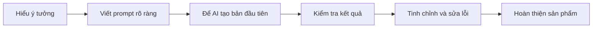
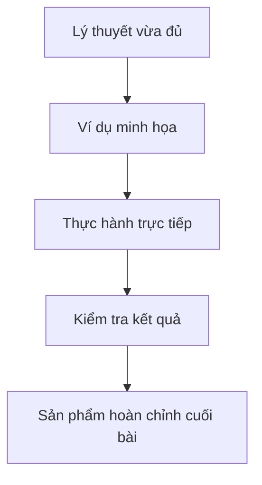

# Bài 1: Giới Thiệu Giảng Viên

## Mục Tiêu Bài Học

Sau bài này, bạn sẽ:

* Biết giảng viên là ai, xuất phát điểm và hành trình đến với **Vibe Coding**.
* Hiểu vì sao một người **không xuất thân từ dân lập trình chuyên nghiệp** vẫn có thể hướng dẫn bạn tạo ra ứng dụng thật bằng AI.
* Nắm được cách tiếp cận xuyên suốt khóa học: **thực hành trước, lý thuyết vừa đủ, có sản phẩm thật ở cuối mỗi bài**.

---

## 1. Giảng Viên Là Ai?

Giảng viên khóa học này là người đã tự học và tự xây dựng nhiều sản phẩm số như:

* Website.
* Công cụ nội bộ.
* Ứng dụng nhỏ phục vụ công việc.
* Các sản phẩm thử nghiệm bằng AI.

Điểm đặc biệt không nằm ở việc giảng viên thuộc lòng cú pháp lập trình, mà nằm ở khả năng kết hợp giữa:

* **Tư duy sản phẩm**.
* **Khả năng mô tả yêu cầu rõ ràng**.
* **Kỹ năng làm việc cùng AI để tạo ra sản phẩm thật**.

Các công cụ được sử dụng trong quá trình này gồm:

* ChatGPT.
* Claude.
* Google AI Studio.
* Google Stitch.
* Antigravity.
* Các công cụ hỗ trợ triển khai và kiểm thử sản phẩm.

---

## 2. Điểm Khác Biệt Của Giảng Viên

Thay vì tiếp cận lập trình theo hướng học cú pháp từ đầu, giảng viên tiếp cận Vibe Coding theo hướng thực chiến:

| Năng lực                   | Ý nghĩa                                                                  |
| -------------------------- | ------------------------------------------------------------------------ |
| Mô tả rõ điều mình muốn    | Giúp AI hiểu đúng yêu cầu và tạo ra kết quả gần với mong muốn            |
| Tư duy sản phẩm            | Biết người dùng cần gì, luồng sử dụng ra sao, tính năng nào quan trọng   |
| Kiểm tra kết quả AI tạo ra | Không phụ thuộc hoàn toàn vào AI, mà biết xem xét, sửa lỗi và tinh chỉnh |
| Chia nhỏ vấn đề            | Biến một ý tưởng lớn thành từng bước nhỏ để AI có thể xử lý hiệu quả     |

Đây cũng chính là bộ kỹ năng cốt lõi mà khóa học muốn truyền tải cho bạn.

Bạn không chỉ học “viết code”, mà học cách **làm việc cùng AI để tạo ra sản phẩm thật**.

---

## 3. Vì Sao Giảng Viên Chọn Dạy Vibe Coding?

| Lý do                         | Giải thích                                                                                                 |
| ----------------------------- | ---------------------------------------------------------------------------------------------------------- |
| Rào cản kỹ thuật đã giảm mạnh | AI hiện có thể hỗ trợ viết phần lớn code, người học chỉ cần biết mô tả, kiểm tra và điều chỉnh             |
| Nhu cầu thực tế rất lớn       | Nhiều người muốn có app, website hoặc công cụ riêng nhưng không có thời gian học lập trình trong nhiều năm |
| Kinh nghiệm thực chiến        | Giảng viên đã tự tay xây nhiều sản phẩm bằng chính quy trình sẽ dạy trong khóa học                         |
| Phù hợp người mới bắt đầu     | Không yêu cầu nền tảng lập trình chuyên sâu, chỉ cần biết dùng máy tính cơ bản                             |
| Tập trung vào sản phẩm thật   | Mục tiêu cuối cùng không phải học lý thuyết suông, mà là tạo ra thứ có thể chạy được                       |

---

## 4. Tư Duy Cốt Lõi Của Khóa Học

Khóa học được xây dựng theo triết lý:

> **Học bằng cách làm ra sản phẩm thật.**

Thay vì học quá nhiều khái niệm trừu tượng ngay từ đầu, bạn sẽ đi theo vòng lặp thực hành:

Vòng lặp này sẽ xuất hiện nhiều lần trong khóa học, từ những bài đơn giản đến các dự án hoàn chỉnh hơn.

---

## 5. Cách Tiếp Cận Giảng Dạy

Mỗi bài học trong khóa sẽ được thiết kế theo cấu trúc dễ theo dõi:

Cách học này giúp bạn không bị ngợp bởi thuật ngữ kỹ thuật, đồng thời vẫn hiểu được bản chất của việc xây dựng sản phẩm bằng AI.

---

## 6. Ba Nguyên Tắc Học Trong Khóa Này

### 1. Thực Hành Trước

Bạn sẽ được hướng dẫn làm trực tiếp trên các công cụ thật, thay vì chỉ nghe lý thuyết.

Ví dụ:

* Tạo landing page.
* Viết prompt yêu cầu AI chỉnh giao diện.
* Tạo ứng dụng desktop đơn giản.
* Đưa sản phẩm lên internet.
* Đóng gói và chia sẻ sản phẩm cho người khác dùng.

### 2. Lý Thuyết Vừa Đủ

Khóa học vẫn giải thích các khái niệm quan trọng, nhưng chỉ ở mức cần thiết để bạn có thể làm được việc.

Bạn sẽ hiểu:

* Prompt là gì.
* PRD là gì.
* Frontend và backend khác nhau thế nào.
* Deploy nghĩa là gì.
* Vì sao cần kiểm tra sản phẩm sau khi AI viết code.

### 3. Có Sản Phẩm Thật Sau Mỗi Giai Đoạn

Mỗi phần học đều hướng đến một đầu ra cụ thể.

Bạn không chỉ “biết thêm kiến thức”, mà sẽ có thứ nhìn thấy được, chạy được và có thể tiếp tục phát triển.

---

## 7. Bạn Sẽ Học Được Gì Từ Giảng Viên?

Sau khi đi theo phương pháp của giảng viên, bạn sẽ học được:

* Cách tư duy như một **product owner** trước khi nhờ AI viết code.
* Cách biến ý tưởng mơ hồ thành yêu cầu rõ ràng.
* Cách viết **prompt** để AI hiểu đúng ý.
* Cách viết **PRD** cho một sản phẩm nhỏ.
* Cách yêu cầu AI sửa lỗi, nâng cấp tính năng và cải thiện giao diện.
* Cách dùng các công cụ như ChatGPT, Claude, Google AI Studio, Google Stitch, Vercel và Antigravity.
* Cách biến một ý tưởng cá nhân thành **ứng dụng thật, chạy được và có thể chia sẻ cho người khác dùng**.

---

## 8. Người Mới Có Học Được Không?

Câu trả lời là: **Có**.

Bạn không cần phải là lập trình viên chuyên nghiệp để bắt đầu khóa học này.

Điều bạn cần là:

* Biết sử dụng máy tính cơ bản.
* Có ý tưởng hoặc nhu cầu tạo công cụ riêng.
* Sẵn sàng thực hành từng bước.
* Không ngại thử, sai, sửa và làm lại.
* Biết đặt câu hỏi rõ ràng cho AI.

Vibe Coding không yêu cầu bạn phải giỏi code ngay từ đầu. Điều quan trọng hơn là bạn biết **mình muốn tạo ra điều gì** và biết cách hướng dẫn AI đi đúng hướng.

---

## Điều Cần Ghi Nhớ

* Bạn không cần là lập trình viên để học khóa này.
* Giảng viên tiếp cận Vibe Coding từ góc độ người dùng thực tế, tự học và tự xây sản phẩm.
* Kỹ năng quan trọng nhất không phải là thuộc cú pháp, mà là biết mô tả yêu cầu, kiểm tra kết quả và tinh chỉnh sản phẩm.
* Triết lý giảng dạy của khóa học là: **thực hành trước, lý thuyết vừa đủ, có sản phẩm thật sau mỗi bài**.

---

## Tóm Tắt Bài Học

Bài học này giúp bạn hiểu giảng viên là ai, vì sao giảng viên chọn dạy Vibe Coding và tại sao phương pháp này phù hợp với người mới bắt đầu.

Bạn cũng đã nắm được tinh thần chính của khóa học: không học lập trình theo kiểu khô khan, mà học cách dùng AI như một cộng sự để từng bước tạo ra sản phẩm thật.

Ở bài tiếp theo, bạn sẽ được giới thiệu toàn bộ lộ trình khóa học, từ tư duy sản phẩm, viết prompt, viết PRD, cho đến việc xây dựng và triển khai ứng dụng thực tế.

---

# Bài luyện tập

## Mục tiêu

## Đề bài

## Yêu cầu hoàn thành

- [ ] 
- [ ] 
- [ ] 

## Kết quả / lời giải

## Ghi chú
