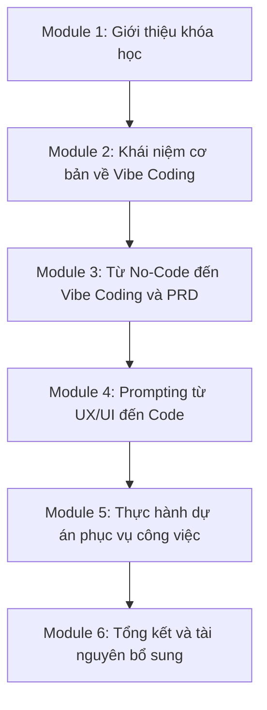
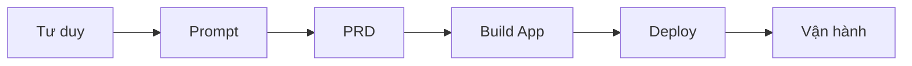
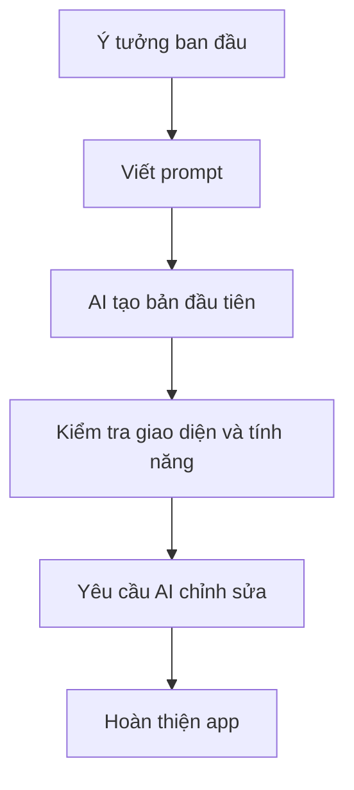

# Bài 2: Giới Thiệu Nội Dung Khóa Học

## Mục Tiêu Bài Học

Sau bài này, bạn sẽ:

* Nắm được **lộ trình tổng thể** của khóa học: từ tư duy, prompt, PRD đến build app thật.
* Biết rõ **6 module** và **20 bài học** sẽ đưa bạn đi qua những giai đoạn nào.
* Hiểu được **kết quả đầu ra** sau khi hoàn thành khóa học.

---

## 1. Lộ Trình Tổng Thể

Khóa học được thiết kế cho người mới bắt đầu, đi theo đúng trình tự cần thiết để bạn có thể tự tạo ứng dụng bằng AI.

Bạn sẽ bắt đầu từ việc hiểu Vibe Coding là gì, sau đó học cách viết yêu cầu rõ ràng, tạo PRD, thực hành build app, deploy app lên internet và cuối cùng là biết cách vận hành sản phẩm thật.

Nói đơn giản, hành trình học sẽ đi theo chuỗi:

---

## 2. Tổng Quan 6 Module

| Module | Tên module                                                |   Bài học | Trọng tâm                                                             |
| ------ | --------------------------------------------------------- | --------: | --------------------------------------------------------------------- |
| 1      | Giới Thiệu                                                |   Bài 1-3 | Làm quen giảng viên, nội dung khóa học và cách học                    |
| 2      | Tổng Quan Và Các Khái Niệm Cơ Bản Về Vibe Coding          |   Bài 4-5 | Hiểu Vibe Coding là gì và tạo app đầu tiên                            |
| 3      | Các Khái Niệm Lập Trình Cơ Bản Từ No-Code Đến Vibe Coding |   Bài 6-9 | Hiểu quy trình sản phẩm số, viết PRD và dùng chatbot tạo PRD          |
| 4      | Kỹ Năng Prompting Vibe Code                               | Bài 10-14 | Thực hành build app từ UX/UI đến code thật                            |
| 5      | Thực Hành Dự Án Vibe Code Phục Vụ Công Việc               | Bài 15-18 | Build app phục vụ công việc, deploy, kết nối API key và dùng AI Agent |
| 6      | Tổng Kết Và Quà Tặng                                      | Bài 19-20 | Tổng kết kiến thức, nhận tài nguyên và định hướng học tiếp            |

---

## 3. Chi Tiết Từng Giai Đoạn Học

### Module 1: Giới Thiệu

Module đầu tiên giúp bạn hiểu khóa học này dành cho ai, giảng viên là ai và bạn sẽ học theo phương pháp nào.

Trọng tâm của module này là giúp bạn có cái nhìn tổng quan trước khi bắt đầu thực hành.

Bạn sẽ nắm được:

* Vì sao người không chuyên lập trình vẫn có thể tạo ứng dụng bằng AI.
* Khóa học gồm những phần nào.
* Cách học hiệu quả khi làm việc cùng AI.
* Tinh thần chính của khóa học: **thực hành trước, lý thuyết vừa đủ, có sản phẩm thật**.

---

### Module 2: Tổng Quan Về Vibe Coding

Module này giúp bạn hiểu Vibe Coding là gì và vì sao nó đang thay đổi cách tạo phần mềm.

Bạn sẽ học:

* Vibe Coding là gì.
* AI hỗ trợ lập trình như thế nào.
* Người học cần đóng vai trò gì khi làm việc cùng AI.
* Cách tạo ứng dụng đầu tiên bằng công cụ AI.

Mục tiêu của module này là giúp bạn vượt qua cảm giác “lập trình rất khó” và thấy rằng bạn có thể bắt đầu tạo sản phẩm thật ngay cả khi chưa giỏi code.

---

### Module 3: Từ No-Code Đến Vibe Coding Và PRD

Ở module này, bạn bắt đầu học cách biến một ý tưởng thành yêu cầu rõ ràng để AI có thể thực hiện.

Bạn sẽ học:

* No-code, low-code và vibe coding khác nhau thế nào.
* Một sản phẩm số thường gồm những phần nào.
* PRD là gì và vì sao PRD quan trọng.
* Cách dùng chatbot để hỗ trợ viết PRD.

Đây là module nền tảng rất quan trọng, vì AI chỉ tạo ra kết quả tốt khi bạn biết mô tả đúng điều mình muốn.

---

### Module 4: Kỹ Năng Prompting Từ UX/UI Đến Code

Module này tập trung vào thực hành nhiều hơn. Bạn sẽ học cách viết prompt để AI tạo giao diện, logic và tính năng ứng dụng.

Các dự án thực hành gồm:

* App học tiếng Anh.
* App tối ưu hình ảnh sản phẩm thương mại.
* App tạo thumbnail YouTube tự động.
* Giao diện ứng dụng chuyên nghiệp hơn bằng prompt UX/UI.

Bạn sẽ bắt đầu thấy rõ quy trình:

---

### Module 5: Thực Hành Dự Án Phục Vụ Công Việc

Module này đưa bạn đến gần hơn với việc tạo sản phẩm có thể dùng trong thực tế.

Bạn sẽ học:

* Build app soạn văn bản.
* Deploy ứng dụng lên Vercel.
* Kết nối API key AI.
* Làm việc với AI Agent như Antigravity.
* Biến ứng dụng local thành ứng dụng có thể chia sẻ cho người khác dùng.

Đây là phần giúp bạn hiểu rằng một app không chỉ cần “chạy được trên máy mình”, mà còn cần được đưa lên internet và vận hành như một sản phẩm thật.

---

### Module 6: Tổng Kết Và Quà Tặng

Module cuối giúp bạn hệ thống lại toàn bộ kiến thức đã học.

Bạn sẽ:

* Ôn lại quy trình Vibe Coding từ đầu đến cuối.
* Nhận tài nguyên, prompt mẫu và template hỗ trợ.
* Biết cách tiếp tục tự học sau khóa học.
* Có định hướng để tự xây thêm các ứng dụng khác trong tương lai.

---

## 4. Ba Kỹ Năng Cốt Lõi Bạn Sẽ Có

| Kỹ năng               | Bạn sẽ làm được gì                                                                  |
| --------------------- | ----------------------------------------------------------------------------------- |
| **Tư duy sản phẩm**   | Biến một ý tưởng mơ hồ thành yêu cầu rõ ràng để AI hiểu đúng                        |
| **Prompting**         | Viết prompt hiệu quả cho ChatGPT, Claude, Google AI Studio và các công cụ AI coding |
| **Vận hành sản phẩm** | Deploy app, kết nối API key, kiểm tra lỗi và chia sẻ sản phẩm cho người khác dùng   |

---

## 5. Các Dự Án Thực Hành Trong Khóa Học

Xuyên suốt khóa học, bạn sẽ không chỉ học lý thuyết mà còn tự tay build nhiều ứng dụng thật.

| Dự án                        | Mục tiêu                                                    |
| ---------------------------- | ----------------------------------------------------------- |
| App học tiếng Anh            | Làm quen với việc tạo app bằng Google AI Studio             |
| App tối ưu hình ảnh sản phẩm | Ứng dụng AI vào bán hàng online và thương mại điện tử       |
| App tạo Thumbnail YouTube    | Thực hành tạo công cụ hỗ trợ sáng tạo nội dung              |
| App soạn văn bản             | Tạo công cụ nhập thông tin và xuất văn bản hoàn chỉnh       |
| Các app deploy trên Vercel   | Biết cách đưa ứng dụng lên internet để người khác dùng được |

---

## 6. Kết Quả Sau Khi Hoàn Thành Khóa Học

Sau khi hoàn thành khóa học, bạn sẽ:

* Biết cách biến một ý tưởng thành PRD rõ ràng.
* Tự tay build được nhiều ứng dụng thật bằng AI.
* Biết cách đưa ứng dụng lên internet miễn phí bằng Vercel.
* Biết cách kết nối API key để app có tính năng AI thật.
* Biết cách dùng AI Agent như Antigravity để hỗ trợ code và tự động hóa công việc.
* Có một quy trình lặp lại được để tự tạo thêm các ứng dụng khác trong tương lai.

---

## Điều Cần Ghi Nhớ

* Khóa học đi theo trình tự: **tư duy → prompt → PRD → build app → deploy → vận hành**.
* Bạn sẽ có nhiều sản phẩm thật, không chỉ học lý thuyết.
* Mỗi module là nền tảng cho module tiếp theo, nên hãy học theo đúng thứ tự.
* Mục tiêu cuối cùng là giúp bạn có khả năng tự tạo công cụ, app và sản phẩm số bằng AI.

---

## Tóm Tắt Bài Học

Bài học này giúp bạn nắm được toàn bộ lộ trình của khóa học **Vibe Coding Cơ Bản Cho Người Mới Bắt Đầu**.

Bạn đã biết khóa học gồm **6 module**, **20 bài học**, đi từ tư duy nền tảng đến thực hành build app, deploy và vận hành sản phẩm thật.

Ở bài tiếp theo, bạn sẽ tiếp tục làm rõ cách học trong khóa này và chuẩn bị bước vào phần nền tảng quan trọng nhất: **Vibe Coding là gì và vì sao nó giúp người mới có thể tạo ứng dụng bằng AI**.

---

# Bài luyện tập

## Mục tiêu

## Đề bài

## Yêu cầu hoàn thành

- [ ] 
- [ ] 
- [ ] 

## Kết quả / lời giải

## Ghi chú
