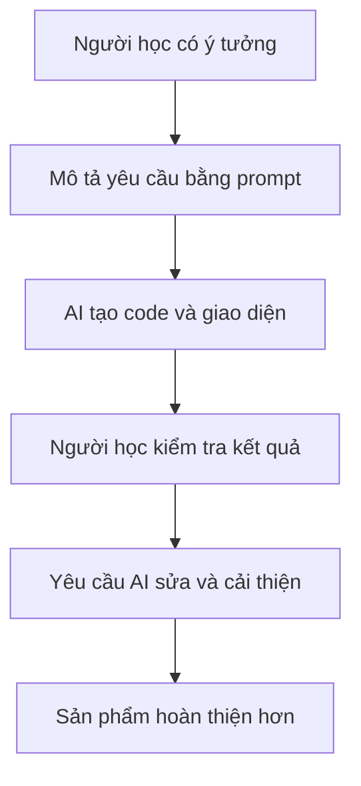
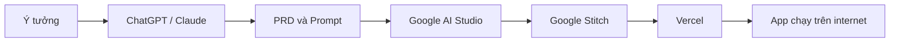
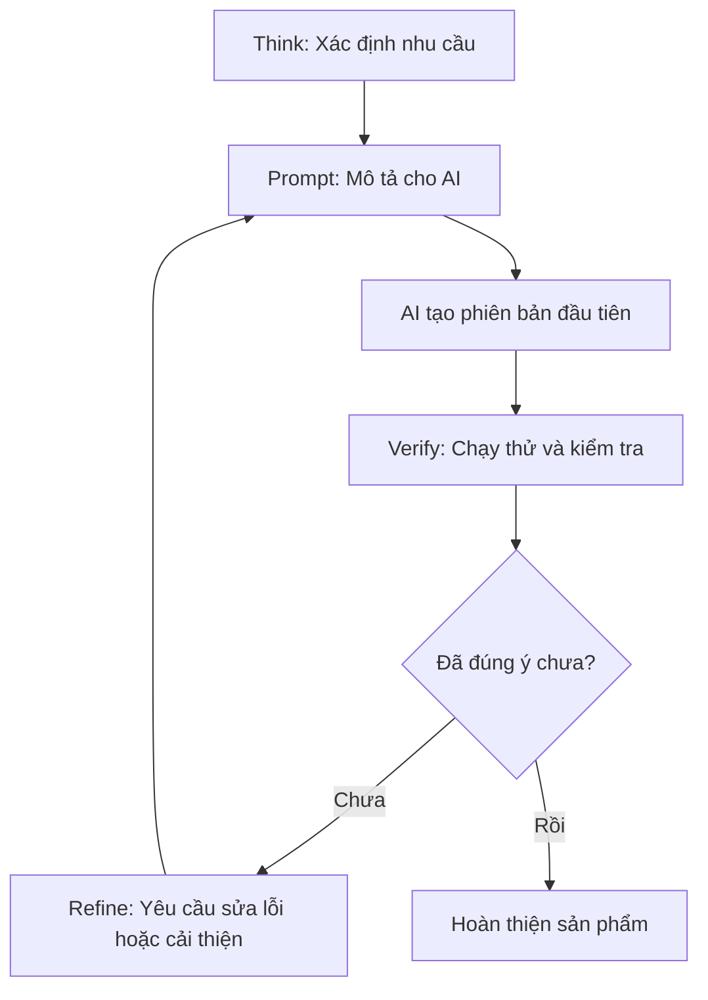

# Bài 4: Tổng Quan Và Các Khái Niệm Cơ Bản Về Vibe Coding

## Mục Tiêu Bài Học

Sau bài này, bạn sẽ:

* Hiểu **Vibe Coding là gì** và vì sao nó khác với lập trình truyền thống.
* Hiểu **AI hỗ trợ lập trình như thế nào** trong quá trình tạo ứng dụng.
* Nắm được **quy trình làm app bằng prompt** từ lúc có ý tưởng đến khi có sản phẩm chạy được.
* Biết vì sao người mới bắt đầu có thể dùng AI để tạo ra sản phẩm thật mà không cần học lập trình theo cách truyền thống ngay từ đầu.

---

## 1. Vibe Coding Là Gì?

**Vibe Coding** là cách tạo phần mềm bằng việc mô tả điều bạn muốn bằng **ngôn ngữ tự nhiên**, sau đó để AI hỗ trợ viết code, tạo giao diện, sửa lỗi và hoàn thiện sản phẩm.

Thay vì tự viết từng dòng code, bạn sẽ nói cho AI biết:

* Bạn muốn tạo ứng dụng gì.
* Ứng dụng đó dành cho ai.
* Người dùng sẽ thao tác như thế nào.
* Giao diện cần có những phần nào.
* Kết quả cuối cùng mong muốn là gì.

Có thể hiểu đơn giản:

```text
Vibe Coding = Ý tưởng + Mô tả rõ ràng + AI tạo sản phẩm + Kiểm tra + Tinh chỉnh
```

Ví dụ, thay vì tự code một website từ đầu, bạn có thể nói với AI:

> Tôi muốn tạo một landing page giới thiệu quán cà phê, có ảnh menu, form đặt bàn, thông tin liên hệ và giao diện ấm áp, hiện đại.

Từ yêu cầu đó, AI có thể giúp bạn tạo giao diện, bố cục trang, nội dung mẫu và phần logic cơ bản.

---

## 2. Bản Chất Của Vibe Coding

Vibe Coding không có nghĩa là “bấm một nút là có app hoàn hảo”.

Bản chất đúng hơn là: bạn đóng vai trò **người định hướng sản phẩm**, còn AI đóng vai trò **trợ lý kỹ thuật**.



Trong quy trình này, AI có thể viết code rất nhanh, nhưng bạn vẫn là người quyết định:

* App có đúng mục tiêu không.
* Giao diện có dễ dùng không.
* Tính năng có đúng nhu cầu không.
* Nội dung có phù hợp không.
* Kết quả cuối cùng đã đủ tốt để dùng chưa.

---

## 3. Vibe Coding Khác Gì So Với Lập Trình Truyền Thống?

| Lập trình truyền thống                                  | Vibe Coding                                         |
| ------------------------------------------------------- | --------------------------------------------------- |
| Phải học cú pháp ngôn ngữ lập trình trong thời gian dài | Mô tả yêu cầu bằng ngôn ngữ tự nhiên                |
| Tự viết từng dòng code                                  | AI hỗ trợ viết phần lớn code                        |
| Debug dựa nhiều vào kinh nghiệm cá nhân                 | Copy lỗi và nhờ AI phân tích, sửa lỗi               |
| Cần hiểu sâu nhiều kiến thức kỹ thuật ngay từ đầu       | Người mới vẫn có thể tạo sản phẩm chạy được         |
| Tốc độ phụ thuộc vào khả năng viết code                 | Tốc độ phụ thuộc vào khả năng mô tả yêu cầu rõ ràng |
| Thường bắt đầu từ code                                  | Thường bắt đầu từ ý tưởng, prompt và PRD            |
| Khó thấy kết quả nhanh nếu mới học                      | Có thể thấy sản phẩm đầu tiên sau vài giờ thực hành |

Điểm quan trọng cần nhớ:

> Vibe Coding không thay thế hoàn toàn tư duy lập trình, nhưng giúp người mới bắt đầu tạo sản phẩm nhanh hơn rất nhiều.

Bạn vẫn cần học cách suy nghĩ rõ ràng, chia nhỏ vấn đề, kiểm tra lỗi và cải thiện sản phẩm. Nhưng bạn không còn phải bắt đầu bằng việc ghi nhớ quá nhiều cú pháp phức tạp.

---

## 4. AI Hỗ Trợ Lập Trình Như Thế Nào?

Trong Vibe Coding, AI có thể hỗ trợ ở nhiều giai đoạn khác nhau.

| Giai đoạn          | AI có thể hỗ trợ gì?                                             |
| ------------------ | ---------------------------------------------------------------- |
| Lên ý tưởng        | Gợi ý tính năng, đối tượng người dùng, hướng phát triển sản phẩm |
| Viết PRD           | Biến ý tưởng mơ hồ thành tài liệu yêu cầu rõ ràng                |
| Thiết kế giao diện | Gợi ý layout, màu sắc, bố cục, trải nghiệm người dùng            |
| Viết code          | Tạo frontend, backend, logic xử lý, kết nối API                  |
| Sửa lỗi            | Đọc thông báo lỗi, phân tích nguyên nhân và đề xuất cách sửa     |
| Tối ưu sản phẩm    | Cải thiện UI, tốc độ, luồng sử dụng và trải nghiệm người dùng    |
| Deploy             | Hướng dẫn đưa app lên internet để người khác dùng được           |

---

## 5. Vai Trò Của Các Công Cụ Trong Khóa Học

Trong khóa học này, bạn sẽ làm quen với nhiều công cụ AI và công cụ triển khai sản phẩm.

| Công cụ              | Vai trò chính                                                           |
| -------------------- | ----------------------------------------------------------------------- |
| **ChatGPT / Claude** | Trò chuyện, lên ý tưởng, viết PRD, viết prompt chi tiết, giải thích lỗi |
| **Google AI Studio** | Build ứng dụng thật từ prompt, có thể chạy thử nhanh                    |
| **Google Stitch**    | Thiết kế giao diện UI/UX chuyên nghiệp bằng AI                          |
| **Vercel**           | Deploy ứng dụng lên internet miễn phí                                   |
| **Antigravity**      | AI Agent hỗ trợ code, sửa lỗi và tự động hóa các tác vụ kỹ thuật        |

Quy trình tổng thể có thể hình dung như sau:



Trong đó:

* **ChatGPT / Claude** giúp bạn suy nghĩ và viết yêu cầu rõ ràng.
* **Google AI Studio** giúp bạn tạo app nhanh từ prompt.
* **Google Stitch** giúp cải thiện giao diện.
* **Vercel** giúp đưa app lên internet.
* **Antigravity** giúp hỗ trợ code sâu hơn khi dự án phức tạp hơn.

---

## 6. Quy Trình Làm App Bằng Prompt

Vibe Coding không phải là viết một prompt duy nhất rồi chờ AI tạo ra sản phẩm hoàn hảo.

Đó là một vòng lặp gồm 4 bước chính:

| Bước | Tên bước   | Việc cần làm                                                   |
| ---- | ---------- | -------------------------------------------------------------- |
| 1    | **Think**  | Xác định rõ app dùng để làm gì, cho ai dùng, cần tính năng nào |
| 2    | **Prompt** | Viết yêu cầu rõ ràng cho AI, tốt nhất là dựa trên PRD          |
| 3    | **Verify** | Chạy thử app, kiểm tra giao diện, tính năng và lỗi             |
| 4    | **Refine** | Mô tả lỗi hoặc yêu cầu chỉnh sửa để AI cải thiện sản phẩm      |

Sơ đồ quy trình:



---

## 7. Ví Dụ Về Một Vòng Lặp Vibe Coding

Giả sử bạn muốn tạo một app ghi chú công việc đơn giản.

### Bước 1: Think

Bạn xác định:

* App dành cho cá nhân.
* Có thể thêm, sửa, xóa công việc.
* Có trạng thái: chưa làm, đang làm, hoàn thành.
* Giao diện đơn giản, dễ nhìn.
* Chạy được trên trình duyệt.

### Bước 2: Prompt

Bạn viết prompt cho AI:

```text
Hãy tạo một ứng dụng quản lý công việc cá nhân bằng React.
Ứng dụng có các chức năng:
- Thêm công việc mới.
- Sửa tên công việc.
- Xóa công việc.
- Đánh dấu trạng thái: chưa làm, đang làm, hoàn thành.
- Giao diện sạch, hiện đại, dễ dùng trên máy tính và điện thoại.
```

### Bước 3: Verify

Bạn chạy thử app và kiểm tra:

* Nút thêm công việc có hoạt động không.
* Có sửa được công việc không.
* Có xóa được không.
* Giao diện có bị lỗi trên điện thoại không.
* Dữ liệu có bị mất khi thao tác không.

### Bước 4: Refine

Nếu app chưa tốt, bạn tiếp tục yêu cầu AI sửa:

```text
Giao diện hiện tại hơi khó nhìn trên điện thoại.
Hãy chỉnh lại layout responsive, làm nút bấm lớn hơn, khoảng cách giữa các item rõ hơn.
Giữ nguyên toàn bộ chức năng hiện có.
```

Đây chính là cách Vibe Coding hoạt động trong thực tế: làm từng bước, kiểm tra từng phần, rồi cải thiện dần.

---

## 8. Vì Sao Người Mới Nên Học Vibe Coding?

Vibe Coding phù hợp với người mới vì:

* **Không cần nền tảng lập trình sâu ngay từ đầu**: bạn có thể bắt đầu bằng việc mô tả ý tưởng.
* **Thấy kết quả nhanh**: có thể tạo app chạy được sau vài giờ thực hành.
* **Ứng dụng trực tiếp vào công việc**: tạo công cụ cá nhân, app nội bộ, landing page, chatbot, form tự động.
* **Tăng khả năng tự học**: khi gặp lỗi, bạn có thể nhờ AI giải thích và hướng dẫn sửa.
* **Dễ biến ý tưởng thành sản phẩm thử nghiệm**: rất phù hợp để làm MVP, demo hoặc công cụ phục vụ nhu cầu cá nhân.

---

## 9. Hiểu Đúng Về Vibe Coding

Vibe Coding rất mạnh, nhưng bạn cần hiểu đúng để học hiệu quả.

| Hiểu sai                                | Hiểu đúng                                               |
| --------------------------------------- | ------------------------------------------------------- |
| Chỉ cần viết một câu là có app hoàn hảo | Cần mô tả rõ, kiểm tra và tinh chỉnh nhiều vòng         |
| Không cần hiểu gì về sản phẩm           | Cần biết app phục vụ ai và giải quyết vấn đề gì         |
| AI luôn làm đúng                        | AI có thể sai, nên bạn phải kiểm tra kết quả            |
| Không cần học thêm kiến thức kỹ thuật   | Vẫn nên học dần các khái niệm cơ bản để làm app tốt hơn |
| Prompt càng dài càng tốt                | Prompt cần rõ ràng, có cấu trúc và đúng trọng tâm       |

Điều quan trọng nhất không phải là bạn biết bao nhiêu cú pháp, mà là bạn có biết **ra yêu cầu rõ ràng** và **đánh giá kết quả AI tạo ra** hay không.

---

## 10. Công Thức Cơ Bản Khi Làm Vibe Coding

Khi viết prompt để tạo app, bạn có thể dùng công thức đơn giản sau:

```text
Tôi muốn tạo [loại ứng dụng]
Dành cho [đối tượng người dùng]
Để giải quyết [vấn đề cụ thể]
Ứng dụng cần có [các tính năng chính]
Giao diện theo phong cách [mô tả UI/UX]
Kết quả mong muốn là [đầu ra cụ thể]
```

Ví dụ:

```text
Tôi muốn tạo một app học từ vựng tiếng Anh.
Dành cho người mới bắt đầu học TOEIC.
Để giúp họ ghi nhớ từ vựng theo chủ đề.
Ứng dụng cần có danh sách từ, nghĩa tiếng Việt, ví dụ, nút đánh dấu đã thuộc và phần ôn tập.
Giao diện đơn giản, sáng sủa, dễ dùng trên điện thoại.
Kết quả mong muốn là một app chạy được trên trình duyệt.
```

---

## Điều Cần Ghi Nhớ

* **Vibe Coding** là cách tạo phần mềm bằng cách mô tả ý tưởng cho AI bằng ngôn ngữ tự nhiên.
* AI có thể hỗ trợ viết code, tạo giao diện, sửa lỗi, viết PRD và deploy sản phẩm.
* Người học vẫn giữ vai trò quan trọng: định hướng, kiểm tra và tinh chỉnh.
* Quy trình cốt lõi gồm 4 bước: **Think → Prompt → Verify → Refine**.
* Prompt càng rõ ràng, sản phẩm AI tạo ra càng gần đúng ý.
* Bạn không cần giỏi code ngay từ đầu, nhưng cần biết quan sát, mô tả lỗi và cải thiện kết quả.

---

## Tóm Tắt Bài Học

Bài học này giúp bạn hiểu tổng quan về **Vibe Coding**: một cách tạo phần mềm mới, bắt đầu từ ý tưởng và ngôn ngữ tự nhiên thay vì bắt đầu bằng cú pháp lập trình.

Bạn đã biết Vibe Coding khác gì với lập trình truyền thống, AI hỗ trợ lập trình ở những giai đoạn nào, và quy trình làm app bằng prompt gồm những bước nào.

Trong bài tiếp theo, bạn sẽ thực hành tạo ứng dụng đầu tiên để trực tiếp trải nghiệm vòng lặp:

```text
Think → Prompt → Verify → Refine
```
