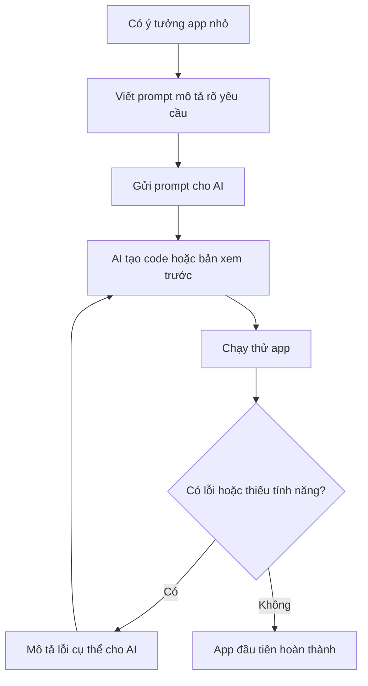
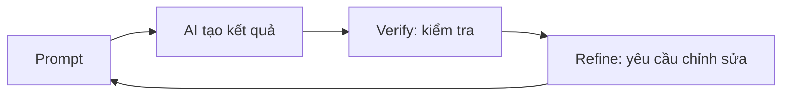

# Bài 5: Thực Hành Vibe Coding — Tạo Ra App Đầu Tiên

## Mục Tiêu Bài Học

Sau bài này, bạn sẽ:

* Tự tay tạo ra **app đầu tiên** bằng AI.
* Hiểu rõ vòng lặp làm app cơ bản:

```text
Ý tưởng → Prompt → Kiểm tra → Chỉnh sửa → Hoàn thiện
```

* Biết cách chọn công cụ phù hợp cho người mới bắt đầu.
* Hiểu rằng prompt **không hoàn hảo ngay từ lần đầu** là chuyện rất bình thường.

---

## 1. Chuẩn Bị Trước Khi Bắt Đầu

Trước khi viết prompt đầu tiên, bạn cần chuẩn bị một vài thứ đơn giản:

| Việc cần chuẩn bị       | Ghi chú                                           |
| ----------------------- | ------------------------------------------------- |
| Tài khoản công cụ AI    | Có thể dùng ChatGPT, Claude hoặc Google AI Studio |
| Ý tưởng app đơn giản    | Nên chọn app nhỏ, quen thuộc, dễ kiểm tra         |
| Tâm lý sẵn sàng thử sai | Lần đầu thường chưa đúng 100%, cần chỉnh dần      |

Một số công cụ phù hợp cho người mới:

| Công cụ          | Phù hợp khi nào?                                            |
| ---------------- | ----------------------------------------------------------- |
| ChatGPT          | Muốn hỏi, sửa prompt, giải thích code, tạo app đơn giản     |
| Claude           | Muốn tạo code dài, chỉnh sửa giao diện, viết app nhiều file |
| Google AI Studio | Muốn thử Gemini, tạo thử nhanh bằng tài khoản Google        |

> Ở bài đầu tiên, chưa cần chọn công cụ quá phức tạp. Quan trọng nhất là bạn hiểu được cách giao tiếp với AI để biến ý tưởng thành app chạy được.

---

## 2. Chọn Ý Tưởng App Đầu Tiên

Với người mới, app đầu tiên nên có 3 tiêu chí:

* **Nhỏ**: không quá nhiều chức năng.
* **Rõ ràng**: dễ mô tả bằng lời.
* **Dễ kiểm tra**: nhìn vào là biết đúng hay sai.

Một số ý tưởng phù hợp:

| Ý tưởng app          | Tính năng chính                                     |
| -------------------- | --------------------------------------------------- |
| To-do List cá nhân   | Thêm, xóa, đánh dấu hoàn thành công việc            |
| Landing page cá nhân | Ảnh đại diện, giới thiệu ngắn, liên kết mạng xã hội |
| Máy tính đơn giản    | Cộng, trừ, nhân, chia                               |
| Ghi chú nhanh        | Nhập ghi chú, hiển thị danh sách ghi chú            |
| Bộ đếm thói quen     | Tăng, giảm, reset số lần thực hiện                  |

Trong bài này, ta sẽ thực hành với ví dụ:

> **App To-do List cá nhân**

---

## 3. Vì Sao Nên Bắt Đầu Với To-do List?

To-do List là app rất phù hợp cho bài thực hành đầu tiên vì:

* Có giao diện đơn giản.
* Có đủ thao tác cơ bản: thêm, xóa, cập nhật trạng thái.
* Dễ kiểm tra bằng mắt.
* Không cần backend.
* Không cần đăng nhập.
* Không cần database.

Một app To-do List cơ bản chỉ cần:

```text
Ô nhập công việc
→ Nút thêm
→ Danh sách công việc
→ Nút hoàn thành
→ Nút xóa
```

---

## 4. Viết Prompt Đầu Tiên

### Prompt Yếu

Ví dụ prompt quá ngắn:

```text
Làm cho tôi một app to-do list.
```

Prompt này chưa đủ rõ vì AI không biết:

* App chạy ở đâu?
* Có cần giao diện đẹp không?
* Có cần lưu dữ liệu không?
* Có những nút nào?
* Công việc hoàn thành hiển thị ra sao?

---

### Prompt Tốt Hơn

```text
Hãy đóng vai một lập trình viên frontend giỏi.

Tôi muốn tạo một ứng dụng web To-do List đơn giản với các yêu cầu sau:

- Có ô nhập công việc và nút "Thêm".
- Danh sách công việc hiển thị bên dưới.
- Mỗi công việc có nút đánh dấu "Hoàn thành" và nút "Xóa".
- Công việc đã hoàn thành hiển thị gạch ngang chữ.
- Giao diện đơn giản, màu sắc nhẹ nhàng, dễ nhìn.
- Chỉ cần chạy được trên trình duyệt.
- Không cần đăng nhập.
- Không cần lưu dữ liệu vào server.
```

Prompt này tốt hơn vì có đủ 3 phần quan trọng:

| Thành phần        | Ví dụ trong prompt                              |
| ----------------- | ----------------------------------------------- |
| Vai trò của AI    | “Hãy đóng vai một lập trình viên frontend giỏi” |
| Yêu cầu tính năng | Thêm, xóa, hoàn thành công việc                 |
| Giới hạn phạm vi  | Chạy trên trình duyệt, không cần server         |

---

## 5. Quy Trình Thực Hành Từ Prompt Đến App



Các bước thực hành:

1. Mở công cụ AI bạn muốn dùng.
2. Dán prompt To-do List đã chuẩn bị.
3. Nhận kết quả từ AI.
4. Chạy thử app.
5. Kiểm tra các thao tác chính:

   * Thêm công việc.
   * Đánh dấu hoàn thành.
   * Xóa công việc.
6. Nếu app chưa đúng, mô tả lỗi cho AI.
7. Lặp lại cho đến khi app chạy đúng yêu cầu.

---

## 6. Kiểm Tra App Sau Khi AI Tạo Xong

Sau khi AI tạo app, đừng vội cho rằng app đã hoàn hảo. Hãy kiểm tra từng thao tác.

| Việc cần kiểm tra    | Câu hỏi kiểm tra                                      |
| -------------------- | ----------------------------------------------------- |
| Thêm công việc       | Nhập nội dung rồi bấm “Thêm” có hiện ra không?        |
| Xóa công việc        | Bấm “Xóa” thì công việc có biến mất không?            |
| Hoàn thành công việc | Bấm “Hoàn thành” thì chữ có bị gạch ngang không?      |
| Giao diện            | Chữ có dễ đọc không? Nút có dễ bấm không?             |
| Trường hợp rỗng      | Nếu chưa nhập gì mà bấm “Thêm” thì app xử lý thế nào? |

Đây là bước rất quan trọng trong Vibe Coding.

AI có thể tạo code rất nhanh, nhưng người dùng vẫn cần kiểm tra kết quả.

---

## 7. Cách Mô Tả Lỗi Hiệu Quả Cho AI

Khi app bị lỗi, đừng chỉ nói chung chung như:

```text
Nó bị lỗi.
```

Hãy mô tả rõ:

* Bạn đã làm gì?
* Kết quả thực tế là gì?
* Bạn muốn kết quả đúng là gì?

### Ví dụ so sánh

| Cách mô tả kém   | Cách mô tả tốt                                                                                               |
| ---------------- | ------------------------------------------------------------------------------------------------------------ |
| “Nó bị lỗi.”     | “Khi tôi bấm nút Xóa, công việc không biến mất khỏi danh sách.”                                              |
| “Giao diện xấu.” | “Chữ trong danh sách quá nhỏ, khó đọc. Hãy tăng cỡ chữ và thêm khoảng cách giữa các dòng.”                   |
| “Sửa lại đi.”    | “Hãy giữ nguyên các tính năng hiện tại, chỉ sửa lỗi nút Xóa không hoạt động.”                                |
| “Không đúng ý.”  | “Tôi muốn nút Hoàn thành đổi trạng thái qua lại: bấm lần đầu là hoàn thành, bấm lần nữa là chưa hoàn thành.” |

---

## 8. Công Thức Mô Tả Lỗi

Bạn có thể dùng công thức sau:

```text
Khi tôi [hành động],
app đang [kết quả hiện tại],
nhưng tôi muốn [kết quả mong muốn].
Hãy sửa đúng phần này và giữ nguyên các phần khác.
```

Ví dụ:

```text
Khi tôi nhập công việc rồi bấm nút "Thêm",
app không hiển thị công việc mới trong danh sách,
nhưng tôi muốn công việc vừa nhập xuất hiện ngay bên dưới ô nhập.
Hãy sửa đúng phần này và giữ nguyên giao diện hiện tại.
```

Công thức này giúp AI hiểu đúng vấn đề và sửa đúng chỗ hơn.

---

## 9. Vòng Lặp Quan Trọng Trong Vibe Coding

Trong Vibe Coding, bạn hiếm khi có kết quả hoàn hảo ngay từ prompt đầu tiên.

Quy trình thường sẽ là:



Ý nghĩa của từng bước:

| Bước           | Ý nghĩa                                |
| -------------- | -------------------------------------- |
| Prompt         | Mô tả điều bạn muốn AI tạo             |
| AI tạo kết quả | AI sinh code, giao diện hoặc bản demo  |
| Verify         | Bạn kiểm tra xem kết quả có đúng không |
| Refine         | Bạn yêu cầu AI sửa lỗi hoặc cải thiện  |

> Đây không phải là thất bại. Đây chính là cách làm việc bình thường khi xây sản phẩm với AI.

---

## 10. Kết Quả Mong Đợi Sau Bài Học

Sau khi hoàn thành bài thực hành, bạn nên có:

* Một app To-do List chạy được trên trình duyệt.
* Kinh nghiệm viết prompt đầu tiên.
* Kinh nghiệm kiểm tra app sau khi AI tạo.
* Biết cách mô tả lỗi cụ thể cho AI.
* Hiểu rằng tạo app bằng AI là một quá trình lặp lại, không phải một lần là xong.

---

## Điều Cần Ghi Nhớ

* Hãy chọn app nhỏ, rõ ràng cho lần thực hành đầu tiên.
* Prompt càng rõ về tính năng, giao diện và phạm vi, AI càng làm đúng ý.
* Đừng mô tả lỗi mơ hồ. Hãy nói rõ hành động, hiện tượng và kết quả mong muốn.
* Vòng lặp **Prompt → Verify → Refine** là kỹ năng cốt lõi của Vibe Coding.
* Không cần biết code sâu vẫn có thể tạo ra sản phẩm chạy thật, miễn là biết mô tả và kiểm tra đúng cách.

---

## Tóm Tắt Bài Học

Trong bài này, bạn đã thực hành quy trình tạo app đầu tiên bằng AI thông qua ví dụ **To-do List cá nhân**.

Bạn đã học cách chọn ý tưởng nhỏ, viết prompt rõ ràng, kiểm tra kết quả và mô tả lỗi để AI chỉnh sửa. Đây là nền tảng quan trọng cho toàn bộ hành trình Vibe Coding sau này.

Ở các bài tiếp theo, bạn sẽ học cách chuyên nghiệp hóa quy trình này bằng cách viết yêu cầu rõ hơn, thiết kế sản phẩm trước khi code và dùng AI như một cộng sự phát triển phần mềm thực thụ.

---

# Bài luyện tập

## Mục tiêu


## Đề bài


## Yêu cầu hoàn thành

- [ ] 
- [ ] 
- [ ] 

## Kết quả / lời giải


## Ghi chú
