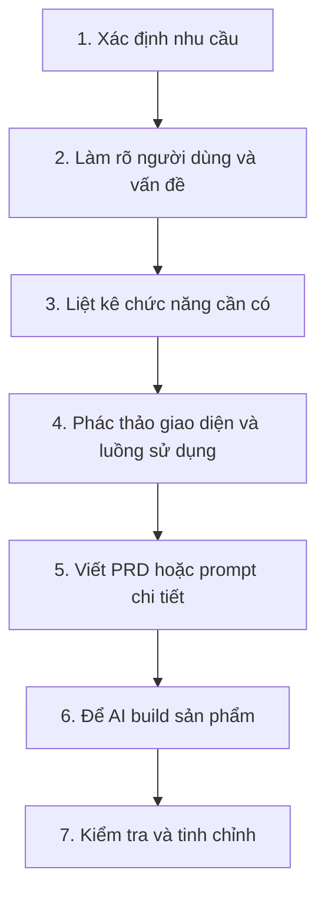
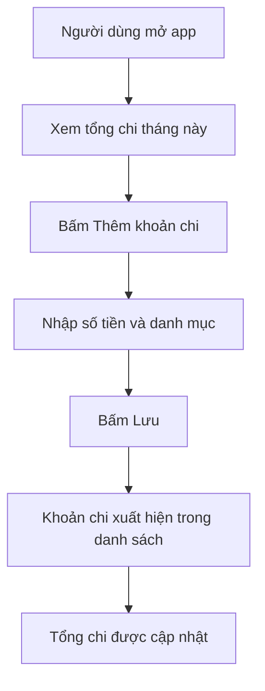

# Bài 6: Từ Ý Tưởng Đến Sản Phẩm

## Quy Trình Phát Triển Sản Phẩm Số Với AI

## Mục Tiêu Bài Học

Sau bài này, bạn sẽ:

* Biết cách biến một **ý tưởng mơ hồ** thành một sản phẩm cụ thể.
* Biết cách xác định: người dùng, vấn đề, chức năng, giao diện và luồng sử dụng.
* Hiểu quy trình phát triển sản phẩm số cơ bản mà người không chuyên vẫn có thể áp dụng nhờ AI.
* Chuẩn bị nền tảng tư duy trước khi học viết **PRD** ở bài tiếp theo.

---

## 1. Vì Sao Cần Quy Trình, Không Chỉ Có Ý Tưởng?

Nhiều người có ý tưởng rất hay, nhưng khi đưa thẳng cho AI thì kết quả lại không đúng ý.

Vấn đề thường không nằm ở việc AI “kém”, mà nằm ở chỗ:

> Ý tưởng ban đầu chưa được làm rõ đủ.

Khi ý tưởng còn mơ hồ, prompt cũng sẽ mơ hồ. Khi prompt mơ hồ, AI rất dễ hiểu sai hoặc tự đoán theo hướng khác.

```text
Ý tưởng mơ hồ → Prompt mơ hồ → Sản phẩm không đúng ý

Ý tưởng rõ ràng → Prompt rõ ràng → Sản phẩm đúng ý hơn ngay từ đầu
```

Vì vậy, trước khi yêu cầu AI viết code, bạn cần có một bước trung gian:

> **Làm rõ ý tưởng bằng quy trình phát triển sản phẩm cơ bản.**

---

## 2. Bốn Câu Hỏi Làm Rõ Ý Tưởng

Trước khi viết prompt, hãy trả lời 4 câu hỏi sau:

| Câu hỏi                            | Mục đích                              |
| ---------------------------------- | ------------------------------------- |
| **Ai** sẽ dùng sản phẩm này?       | Xác định đối tượng người dùng         |
| Sản phẩm giải quyết **vấn đề gì**? | Biết lý do sản phẩm tồn tại           |
| Sản phẩm cần **chức năng gì**?     | Liệt kê tính năng cụ thể              |
| Sản phẩm **trông như thế nào**?    | Hình dung giao diện và luồng thao tác |

Bốn câu hỏi này giúp bạn chuyển từ kiểu nghĩ:

```text
Tôi muốn làm một app quản lý chi tiêu.
```

thành:

```text
Tôi muốn làm một app giúp cá nhân ghi lại khoản chi hằng ngày,
xem tổng chi theo tháng, phân loại chi tiêu và theo dõi tiền đã dùng.
```

Cách mô tả thứ hai rõ ràng hơn rất nhiều.

---

## 3. Ví Dụ Minh Họa: App Quản Lý Chi Tiêu Cá Nhân

Giả sử bạn có ý tưởng:

> “Tôi muốn làm app quản lý chi tiêu.”

Ta sẽ làm rõ ý tưởng bằng 4 câu hỏi:

| Câu hỏi           | Trả lời                                                                    |
| ----------------- | -------------------------------------------------------------------------- |
| Ai dùng?          | Chính bản thân người dùng, dùng hằng ngày trên điện thoại hoặc máy tính    |
| Vấn đề gì?        | Không nhớ đã tiêu bao nhiêu tiền trong tháng, không biết tiền đi đâu       |
| Chức năng gì?     | Thêm khoản chi, phân loại khoản chi, xem tổng chi theo tháng               |
| Giao diện ra sao? | Trang chủ hiển thị tổng chi tháng này, bên dưới là danh sách các khoản chi |

Sau khi làm rõ, ý tưởng đã trở nên cụ thể hơn:

```text
App quản lý chi tiêu cá nhân cho người dùng hằng ngày.
Người dùng có thể thêm khoản chi, chọn danh mục, xem danh sách khoản chi
và theo dõi tổng số tiền đã tiêu trong tháng hiện tại.
```

Đây là nguyên liệu tốt hơn rất nhiều để viết prompt hoặc PRD.

---

## 4. Quy Trình Phát Triển Sản Phẩm Số Với AI

Một quy trình đơn giản cho người mới có thể đi theo 7 bước:



Trong phát triển phần mềm truyền thống, một sản phẩm thường cần nhiều vai trò:

| Vai trò         | Công việc                                    |
| --------------- | -------------------------------------------- |
| Product Manager | Xác định sản phẩm cần làm gì                 |
| Designer        | Thiết kế giao diện và trải nghiệm người dùng |
| Developer       | Viết code                                    |
| Tester          | Kiểm tra lỗi                                 |

Với Vibe Coding, quy trình này được rút gọn lại. Bạn không cần làm tất cả theo cách chuyên nghiệp ngay từ đầu, nhưng bạn cần hiểu tư duy cơ bản:

```text
Bạn nghĩ rõ sản phẩm → AI hỗ trợ thiết kế/code → Bạn kiểm tra và chỉnh sửa
```

---

## 5. Xác Định Chức Năng: Đủ Dùng, Không Dư Thừa

Người mới thường mắc một lỗi rất phổ biến:

> Muốn app đầu tiên có quá nhiều chức năng.

Ví dụ, vừa bắt đầu làm app quản lý chi tiêu đã muốn có:

* Đăng nhập tài khoản.
* Đồng bộ dữ liệu.
* Biểu đồ thống kê.
* Xuất file Excel.
* Nhắc nhở chi tiêu.
* AI phân tích tài chính.
* Kết nối ngân hàng.

Những tính năng này có thể hay, nhưng chưa nên làm ngay ở phiên bản đầu tiên.

Nguyên tắc nên nhớ:

> Phiên bản đầu tiên chỉ cần đủ dùng và chạy được.

---

## 6. Chức Năng Cốt Lõi Và Chức Năng Mở Rộng

Với app quản lý chi tiêu cá nhân, có thể chia tính năng thành 2 nhóm:

| Chức năng cốt lõi làm trước | Chức năng mở rộng làm sau        |
| --------------------------- | -------------------------------- |
| Thêm khoản chi              | Biểu đồ thống kê chi tiêu        |
| Xem danh sách khoản chi     | Đặt ngân sách giới hạn mỗi tháng |
| Xem tổng chi trong tháng    | Xuất báo cáo Excel/PDF           |
| Chọn danh mục chi tiêu      | Đăng nhập và đồng bộ dữ liệu     |
| Xóa khoản chi sai           | AI gợi ý cách tiết kiệm tiền     |

Phiên bản đầu tiên nên tập trung vào nhóm bên trái.

Nếu app chưa thêm được khoản chi, chưa xem được danh sách, chưa tính được tổng tiền, thì chưa nên vội làm biểu đồ hay AI phân tích.

---

## 7. Phác Thảo Giao Diện Và Luồng Sử Dụng

Bạn không cần biết thiết kế chuyên nghiệp. Chỉ cần mô tả được người dùng sẽ thao tác như thế nào.

Ví dụ luồng sử dụng app quản lý chi tiêu:

```text
Người dùng mở app
→ Thấy tổng chi tiêu tháng này ở đầu trang
→ Bấm nút "Thêm khoản chi"
→ Nhập số tiền
→ Chọn danh mục chi tiêu
→ Bấm "Lưu"
→ Khoản chi mới xuất hiện trong danh sách
→ Tổng chi tiêu tự động cập nhật
```

Luồng này giúp AI hiểu sản phẩm tốt hơn rất nhiều so với việc chỉ nói:

```text
Làm app quản lý chi tiêu.
```

---

## 8. Sơ Đồ Luồng Sử Dụng



Sơ đồ này không cần quá đẹp hay phức tạp. Mục tiêu của nó là giúp bạn và AI cùng hiểu:

* Người dùng bắt đầu từ đâu.
* Người dùng bấm gì.
* Dữ liệu thay đổi như thế nào.
* Kết quả cuối cùng là gì.

---

## 9. Từ Ý Tưởng Đến Prompt Rõ Ràng

Sau khi làm rõ ý tưởng, bạn có thể viết prompt tốt hơn.

### Prompt mơ hồ

```text
Làm cho tôi app quản lý chi tiêu.
```

### Prompt rõ hơn

```text
Hãy đóng vai một lập trình viên frontend.

Tôi muốn tạo một app quản lý chi tiêu cá nhân đơn giản chạy trên trình duyệt.

Người dùng là cá nhân muốn ghi lại khoản chi hằng ngày.

App cần có các chức năng:
- Hiển thị tổng chi tiêu trong tháng hiện tại.
- Có nút "Thêm khoản chi".
- Cho phép nhập số tiền, nội dung chi tiêu và danh mục.
- Sau khi bấm "Lưu", khoản chi xuất hiện trong danh sách.
- Danh sách hiển thị số tiền, nội dung, danh mục và ngày tạo.
- Có thể xóa khoản chi nếu nhập sai.

Giao diện:
- Đơn giản, dễ nhìn.
- Tổng chi nằm ở đầu trang.
- Form thêm khoản chi nằm bên dưới.
- Danh sách khoản chi nằm cuối trang.

Phạm vi:
- Không cần đăng nhập.
- Không cần backend.
- Không cần lưu dữ liệu vào server.
- Chỉ cần chạy được trên trình duyệt.
```

Prompt này rõ hơn vì AI đã biết:

* Ai dùng app.
* App giải quyết vấn đề gì.
* Cần có chức năng nào.
* Giao diện sắp xếp ra sao.
* Không cần làm những gì.

---

## 10. Checklist Làm Rõ Ý Tưởng Trước Khi Prompt

Trước khi nhờ AI build app, hãy tự kiểm tra:

| Câu hỏi                                     | Đã rõ chưa? |
| ------------------------------------------- | ----------- |
| Ai là người dùng chính?                     |             |
| Người dùng đang gặp vấn đề gì?              |             |
| App giúp giải quyết vấn đề đó như thế nào?  |             |
| Phiên bản đầu tiên cần những chức năng nào? |             |
| Chức năng nào để làm sau?                   |             |
| Màn hình đầu tiên trông như thế nào?        |             |
| Người dùng thao tác theo luồng nào?         |             |
| Có cần đăng nhập không?                     |             |
| Có cần lưu dữ liệu không?                   |             |
| Có cần backend không?                       |             |

Nếu trả lời được phần lớn câu hỏi này, prompt của bạn sẽ rõ hơn rất nhiều.

---

## Điều Cần Ghi Nhớ

* Ý tưởng rõ ràng là nền tảng để prompt hiệu quả.
* Đừng đưa một ý tưởng quá mơ hồ cho AI rồi kỳ vọng AI hiểu đúng hoàn toàn.
* Luôn trả lời 4 câu hỏi: **Ai dùng, vấn đề gì, chức năng gì, giao diện ra sao**.
* Ưu tiên chức năng cốt lõi trước, chức năng mở rộng để sau.
* Mô tả luồng sử dụng theo trình tự thao tác thực tế của người dùng.
* AI làm tốt hơn khi bạn cung cấp bối cảnh rõ hơn.

---

## Tóm Tắt Bài Học

Trong bài này, bạn đã học cách biến một ý tưởng mơ hồ thành một sản phẩm cụ thể hơn bằng quy trình phát triển sản phẩm số với AI.

Thay vì chỉ nói “làm app quản lý chi tiêu”, bạn đã biết cách làm rõ:

* Ai sẽ dùng sản phẩm.
* Sản phẩm giải quyết vấn đề gì.
* Phiên bản đầu tiên cần chức năng nào.
* Giao diện và luồng sử dụng nên hoạt động ra sao.

Đây là bước nền tảng trước khi viết prompt lớn hoặc PRD. Ở bài tiếp theo, bạn sẽ học cách đóng gói toàn bộ những thông tin này thành một tài liệu **PRD** để AI hiểu đúng yêu cầu và build sản phẩm chính xác hơn.

---

# Bài luyện tập

## Mục tiêu


## Đề bài


## Yêu cầu hoàn thành

- [ ] 
- [ ] 
- [ ] 

## Kết quả / lời giải


## Ghi chú
