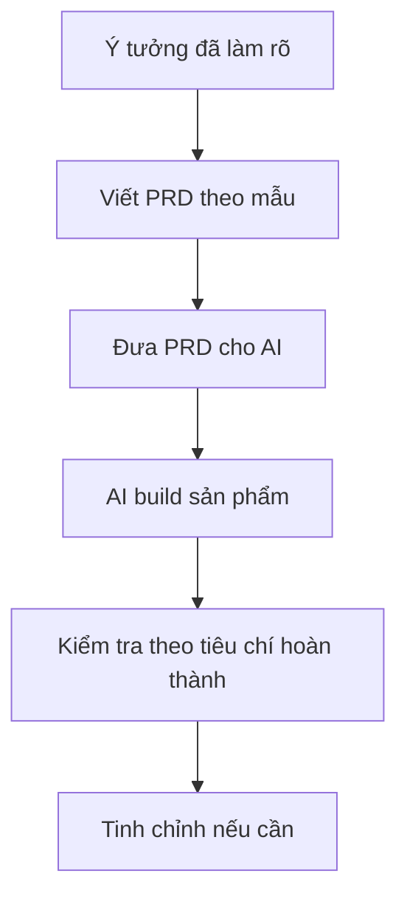

# Bài 7: PRD Là Gì — Bản Thiết Kế Giúp AI Hiểu Đúng Ý Bạn & Tự Động Code Ngay Lần Đầu

## Mục Tiêu Bài Học

Sau bài này, bạn sẽ:

- Hiểu **PRD (Product Requirements Document)** là gì và vì sao nó quan trọng trong Vibe Coding.
- Biết cách viết PRD để AI hiểu yêu cầu rõ hơn, giảm lỗi khi sinh code.
- Có sẵn một **mẫu PRD** có thể áp dụng ngay cho bất kỳ dự án nào.

---

## 1. PRD Là Gì?

**PRD (Product Requirements Document)**, hay **Tài liệu Yêu Cầu Sản Phẩm**, là bản mô tả chi tiết về một sản phẩm:

- Sản phẩm là gì?
- Dành cho ai?
- Giải quyết vấn đề nào?
- Có những chức năng gì?
- Giao diện ra sao?
- Khi nào được xem là hoàn thành?

Trong phát triển phần mềm truyền thống, PRD giúp **Product Manager, Designer và Developer** cùng hiểu đúng một mục tiêu.

Trong **Vibe Coding**, PRD còn quan trọng hơn vì nó chính là bản mô tả bạn đưa cho AI để AI hiểu rõ sản phẩm trước khi bắt đầu code.

```text
PRD tốt = AI hiểu đúng ý bạn ngay từ lần đầu = Ít phải sửa đi sửa lại
````

---

## 2. Vì Sao Không Prompt Trực Tiếp Mà Cần PRD?

Nếu chỉ prompt ngắn kiểu:

```text
Hãy làm cho tôi một app quản lý công việc.
```

AI sẽ phải tự đoán rất nhiều thứ:

* App dành cho ai?
* Có cần đăng nhập không?
* Có cần lưu dữ liệu không?
* Giao diện kiểu gì?
* Có những chức năng nào?
* Khi nào được xem là hoàn thành?

Khi AI phải đoán quá nhiều, kết quả thường lệch ý.

| Prompt ngắn, không có PRD                 | Có PRD trước khi prompt                                             |
| ----------------------------------------- | ------------------------------------------------------------------- |
| AI phải tự đoán nhiều chi tiết còn thiếu  | AI có đủ thông tin để tạo đúng hơn ngay từ đầu                      |
| Dễ phải sửa đi sửa lại nhiều lần          | Giảm đáng kể số vòng lặp sửa lỗi                                    |
| Khó tái sử dụng cho lần sau               | PRD có thể lưu lại, chỉnh sửa và dùng cho phiên bản sau             |
| Khó giữ nhất quán khi làm nhiều tính năng | PRD giúp giữ nhất quán về tên gọi, dữ liệu, giao diện và luồng dùng |

---

## 3. Cấu Trúc Một PRD Cơ Bản

Một PRD dành cho Vibe Coding không cần quá phức tạp như tài liệu doanh nghiệp.

Bạn chỉ cần 6 phần chính:

| Phần                     | Nội dung                                                       |
| ------------------------ | -------------------------------------------------------------- |
| 1. Tổng quan sản phẩm    | Tên sản phẩm, mô tả ngắn gọn trong 1-2 câu                     |
| 2. Đối tượng người dùng  | Ai sẽ dùng sản phẩm này                                        |
| 3. Vấn đề cần giải quyết | Vì sao sản phẩm này cần tồn tại                                |
| 4. Danh sách chức năng   | Liệt kê từng chức năng cụ thể, có thể chia theo mức độ ưu tiên |
| 5. Yêu cầu giao diện     | Mô tả bố cục, phong cách thiết kế, các màn hình chính          |
| 6. Tiêu chí hoàn thành   | Điều kiện để biết sản phẩm đã đúng yêu cầu                     |

---

## 4. Mẫu PRD Có Thể Áp Dụng Ngay

Bạn có thể dùng mẫu sau cho hầu hết dự án Vibe Coding nhỏ và vừa:

```text
# PRD: [Tên sản phẩm]

## 1. Tổng quan
[Mô tả ngắn gọn sản phẩm trong 1-2 câu]

## 2. Đối tượng người dùng
[Ai sẽ dùng sản phẩm này]

## 3. Vấn đề cần giải quyết
[Vì sao sản phẩm này cần tồn tại]

## 4. Danh sách chức năng
- [Chức năng 1 - mô tả cụ thể]
- [Chức năng 2 - mô tả cụ thể]
- [Chức năng 3 - mô tả cụ thể]

## 5. Yêu cầu giao diện
- Bố cục: [Mô tả các khu vực chính trên màn hình]
- Phong cách: [Ví dụ: tối giản, hiện đại, màu sắc chủ đạo]
- Các màn hình: [Liệt kê từng màn hình/trang]

## 6. Tiêu chí hoàn thành
- [Điều kiện 1 để coi là hoàn thành]
- [Điều kiện 2 để coi là hoàn thành]
```

---

## 5. Ví Dụ PRD Thực Tế: App To-Do List

```text
# PRD: To-Do List Cá Nhân

## 1. Tổng quan
Ứng dụng web quản lý công việc cá nhân đơn giản, chạy trên trình duyệt.

## 2. Đối tượng người dùng
Cá nhân dùng để ghi nhớ và theo dõi công việc hằng ngày.

## 3. Vấn đề cần giải quyết
Người dùng dễ quên công việc cần làm nếu không ghi lại ở một nơi cố định.

## 4. Danh sách chức năng
- Thêm công việc mới qua ô nhập liệu và nút "Thêm".
- Đánh dấu công việc đã hoàn thành bằng cách gạch ngang chữ.
- Xóa công việc khỏi danh sách.
- Hiển thị số lượng công việc chưa hoàn thành.

## 5. Yêu cầu giao diện
- Bố cục: ô nhập liệu ở trên cùng, danh sách công việc bên dưới.
- Phong cách: tối giản, màu sắc nhẹ nhàng, ưu tiên trắng và xanh nhạt.
- Chỉ có một màn hình duy nhất.

## 6. Tiêu chí hoàn thành
- Có thể thêm, đánh dấu hoàn thành và xóa công việc mà không bị lỗi.
- Giao diện hiển thị đúng trên trình duyệt máy tính.
- Số lượng công việc chưa hoàn thành được cập nhật chính xác.
```

---

## 6. Quy Trình Dùng PRD Trong Vibe Coding



Quy trình này giúp bạn không bắt đầu bằng một câu prompt mơ hồ, mà bắt đầu bằng một bản mô tả rõ ràng.

```text
Ý tưởng → PRD → Prompt → Code → Kiểm tra → Sản phẩm hoàn chỉnh
```

---

## 7. Cách Biến PRD Thành Prompt Cho AI

Sau khi có PRD, bạn có thể đưa cho AI bằng prompt như sau:

```text
Bạn là Senior Fullstack Developer.

Dưới đây là PRD của sản phẩm tôi muốn xây dựng.
Hãy đọc kỹ PRD, sau đó tạo ứng dụng theo đúng yêu cầu.

Yêu cầu:
- Bám sát chức năng trong PRD.
- Không tự thêm chức năng ngoài phạm vi.
- Tạo giao diện đúng mô tả.
- Đảm bảo các tiêu chí hoàn thành đều chạy được.

[ Dán PRD vào đây ]
```

Nếu làm với Claude, ChatGPT, Cursor hoặc Google AI Studio, cách này đều áp dụng được.

---

## Điều Cần Ghi Nhớ

* **PRD là bản tóm tắt yêu cầu sản phẩm**, giúp AI hiểu đúng ý bạn trước khi code.
* PRD tốt gồm 6 phần: **tổng quan, người dùng, vấn đề, chức năng, giao diện, tiêu chí hoàn thành**.
* Viết PRD trước khi prompt giúp giảm lỗi, giảm số lần sửa và giữ sản phẩm nhất quán hơn.
* PRD có thể lưu lại, chỉnh sửa và tái sử dụng cho các phiên bản sau.
* Trong Vibe Coding, PRD càng rõ thì AI càng dễ tạo ra sản phẩm đúng ngay từ lần đầu.

---

## Tóm Tắt Bài Học

PRD là cầu nối giữa **ý tưởng trong đầu bạn** và **sản phẩm mà AI tạo ra**.

Nếu ý tưởng còn mơ hồ, AI sẽ phải tự đoán. Nhưng nếu bạn viết PRD rõ ràng, AI sẽ hiểu sản phẩm cần làm gì, dành cho ai, giao diện ra sao và khi nào được xem là hoàn thành.

Ở bài tiếp theo, bạn sẽ thực hành dùng ChatGPT và Claude để tạo PRD thực tế cho một app cụ thể của chính mình.

---

# Bài luyện tập

## Mục tiêu


## Đề bài


## Yêu cầu hoàn thành

- [ ] 
- [ ] 
- [ ] 

## Kết quả / lời giải


## Ghi chú
