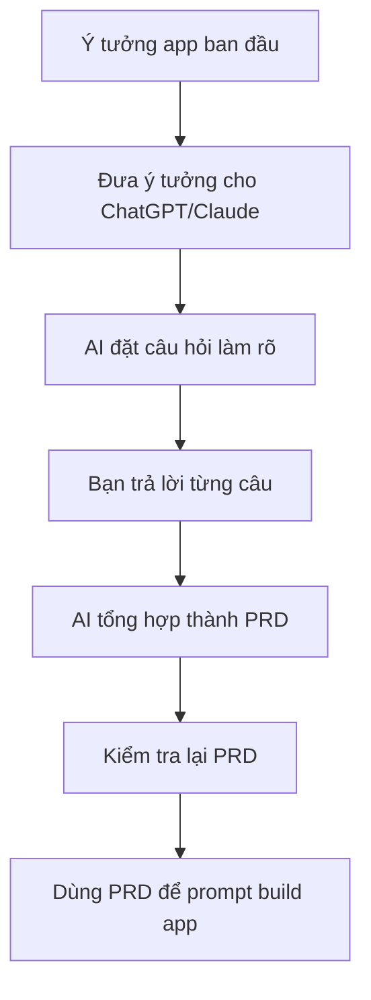

# Bài 8: Thực Hành Dùng ChatGPT/Claude Tạo PRD Cho App Của Chính Bạn

## Mục Tiêu Bài Học

Sau bài này, bạn sẽ:

* Biết cách **dùng ChatGPT hoặc Claude như một trợ lý viết PRD**, thay vì tự viết từ đầu.
* Thực hành tạo PRD thực tế cho một ý tưởng app của chính mình.
* Biết cách yêu cầu AI **đặt câu hỏi ngược** để làm rõ ý tưởng còn mơ hồ.

---

## 1. Vì Sao Nên Nhờ AI Viết PRD Thay Vì Tự Viết?

Ở Bài 7, bạn đã biết cấu trúc cơ bản của một bản PRD.

Tuy nhiên, thay vì tự điền từng phần một cách thủ công, bạn có thể nhờ ChatGPT hoặc Claude đóng vai trò như một **Product Manager ảo**.

AI có thể giúp bạn:

* Đặt câu hỏi để làm rõ ý tưởng.
* Phát hiện những phần còn thiếu trong yêu cầu.
* Sắp xếp ý tưởng thành tài liệu có cấu trúc.
* Biến một ý tưởng mơ hồ thành một bản PRD rõ ràng hơn.
* Chuẩn bị đầu vào tốt hơn cho bước build app bằng AI.

Nói đơn giản:

```text
Ý tưởng mơ hồ
→ AI đặt câu hỏi làm rõ
→ Bạn trả lời
→ AI tổng hợp thành PRD
→ Dùng PRD để build app
```

### Sơ Đồ Quy Trình



---

## 2. Prompt Mẫu Để Nhờ AI Tạo PRD

Bạn có thể dùng prompt sau:

```text
Hãy đóng vai một Product Manager giàu kinh nghiệm.

Tôi có một ý tưởng app như sau: [mô tả ngắn gọn ý tưởng của bạn].

Hãy giúp tôi:

1. Đặt các câu hỏi cần thiết để làm rõ ý tưởng:
   - Đối tượng người dùng
   - Vấn đề cần giải quyết
   - Chức năng cần có
   - Phong cách giao diện

2. Sau khi tôi trả lời, hãy tổng hợp thành một bản PRD đầy đủ theo cấu trúc:
   - Tổng quan
   - Đối tượng người dùng
   - Vấn đề cần giải quyết
   - Danh sách chức năng
   - Yêu cầu giao diện
   - Tiêu chí hoàn thành

Hãy hỏi tôi từng câu một, đừng hỏi dồn dập quá nhiều câu cùng lúc.
```

Điểm quan trọng của prompt này là bạn không yêu cầu AI viết PRD ngay lập tức.

Thay vào đó, bạn yêu cầu AI **hỏi ngược lại trước**.

Điều này giúp quá trình viết PRD trở thành một cuộc trò chuyện dẫn dắt, thay vì một bản tài liệu được AI tự đoán quá nhiều.

---

## 3. Ví Dụ Thực Hành: App Ghi Chú Công Việc Cho Freelancer

### Bước 1: Đưa Ý Tưởng Ban Đầu Cho AI

Ví dụ bạn có ý tưởng:

```text
Tôi muốn làm một app giúp freelancer ghi chú công việc và deadline cho từng khách hàng.
```

Đây là một ý tưởng tốt, nhưng vẫn còn khá chung chung.

AI chưa biết rõ:

* Người dùng cụ thể là ai?
* App cần có những chức năng nào?
* Dữ liệu cần lưu gồm những gì?
* Có cần đăng nhập không?
* Có cần nhắc deadline không?
* Giao diện nên đơn giản hay nhiều màu sắc?

Vì vậy, AI cần hỏi ngược lại.

---

### Bước 2: AI Đặt Câu Hỏi Làm Rõ

| Câu hỏi AI có thể đặt ra                             | Câu trả lời mẫu                                   |
| ---------------------------------------------------- | ------------------------------------------------- |
| Freelancer sẽ quản lý bao nhiêu khách hàng cùng lúc? | Khoảng 5–10 khách hàng                            |
| Mỗi công việc cần ghi những thông tin gì?            | Tên công việc, khách hàng, deadline, trạng thái   |
| Có cần thông báo nhắc deadline không?                | Chưa cần ở phiên bản đầu tiên                     |
| Có cần đăng nhập tài khoản không?                    | Chưa cần, lưu dữ liệu local trước                 |
| Giao diện nên đơn giản hay nhiều màu sắc?            | Đơn giản, dễ nhìn, ưu tiên rõ ràng hơn là bắt mắt |

---

### Bước 3: AI Tổng Hợp Thành PRD

Sau khi bạn trả lời, AI có thể tạo PRD theo cấu trúc:

```text
1. Tổng quan sản phẩm
2. Đối tượng người dùng
3. Vấn đề cần giải quyết
4. Danh sách chức năng
5. Yêu cầu giao diện
6. Tiêu chí hoàn thành
```

Lúc này, PRD sẽ rõ hơn rất nhiều so với ý tưởng ban đầu.

---

## 4. Kỹ Thuật Đặt Câu Hỏi Ngược Cho AI

Khi ý tưởng còn mơ hồ, đừng vội yêu cầu AI viết PRD ngay.

Hãy dùng prompt kiểu này:

```text
Trước khi viết PRD, hãy chỉ ra 3 điểm còn chưa rõ trong ý tưởng của tôi
và hỏi tôi để làm rõ từng điểm đó.
```

Hoặc chi tiết hơn:

```text
Tôi có ý tưởng app sau: [mô tả ý tưởng].

Trước khi viết PRD, hãy đóng vai Product Manager và phản biện ý tưởng này.

Hãy giúp tôi:
1. Chỉ ra những điểm còn mơ hồ.
2. Đặt từng câu hỏi để làm rõ.
3. Không tự giả định nếu tôi chưa cung cấp thông tin.
4. Sau khi tôi trả lời đủ, hãy tổng hợp thành PRD.
```

Cách này giúp bạn tránh một lỗi rất thường gặp:

> PRD nhìn có vẻ đầy đủ, nhưng bên trong lại chứa nhiều giả định sai của AI.

---

## 5. Kiểm Tra Chất Lượng PRD Trước Khi Dùng

Sau khi AI tạo PRD, đừng dùng ngay để build app.

Hãy kiểm tra lại bằng checklist sau:

| Tiêu chí kiểm tra                                         | Đạt / Chưa đạt |
| --------------------------------------------------------- | -------------- |
| Đối tượng người dùng được mô tả cụ thể, không chung chung |                |
| Vấn đề cần giải quyết rõ ràng                             |                |
| Danh sách chức năng có chia mức độ ưu tiên                |                |
| Có phân biệt chức năng “phải có” và “có thì tốt”          |                |
| Không có chức năng nào bạn không hiểu hoặc không cần      |                |
| Yêu cầu giao diện đủ rõ để hình dung được layout          |                |
| Tiêu chí hoàn thành có thể kiểm tra được                  |                |
| PRD không chứa giả định sai so với ý tưởng ban đầu        |                |

Nếu có mục nào chưa đạt, hãy tiếp tục yêu cầu AI chỉnh sửa.

Ví dụ:

```text
Phần chức năng vẫn còn quá rộng.
Hãy rút gọn PRD này thành phiên bản MVP đơn giản nhất,
chỉ giữ những chức năng bắt buộc để app chạy được.
```

---

## 6. Từ PRD Đến Prompt Build App

Khi đã có PRD hoàn chỉnh, bạn có thể dùng chính PRD đó làm prompt đầu vào cho công cụ build app.

Ví dụ:

```text
Dưới đây là PRD cho ứng dụng của tôi:

[Dán toàn bộ nội dung PRD vào đây]

Hãy build ứng dụng này theo đúng PRD trên, dùng HTML/CSS/JavaScript đơn giản,
chạy được trực tiếp trên trình duyệt.

Yêu cầu:
- Code rõ ràng, dễ hiểu.
- Giao diện đúng với mô tả trong PRD.
- Chỉ làm các chức năng thuộc MVP.
- Không tự thêm chức năng ngoài PRD.
```

Điểm quan trọng là:

```text
PRD càng rõ
→ Prompt build app càng rõ
→ AI code càng đúng
→ Ít phải sửa lại
```

---

## 7. Mini Exercise: Tự Tạo PRD Cho App Của Bạn

Hãy chọn một ý tưởng app đơn giản, ví dụ:

* App quản lý chi tiêu cá nhân.
* App ghi chú học tập.
* App theo dõi thói quen.
* App quản lý khách hàng nhỏ.
* App tạo lịch đăng bài mạng xã hội.

Sau đó dùng prompt sau:

```text
Hãy đóng vai Product Manager.

Tôi muốn làm một app: [mô tả ý tưởng app của bạn].

Trước khi viết PRD, hãy hỏi tôi từng câu một để làm rõ:
- Người dùng là ai?
- Họ đang gặp vấn đề gì?
- App cần giúp họ làm gì?
- Phiên bản đầu tiên cần có chức năng nào?
- Giao diện nên trông như thế nào?

Sau khi tôi trả lời đủ, hãy tổng hợp thành PRD hoàn chỉnh.
```

---

## Điều Cần Ghi Nhớ

* Nên nhờ AI đặt câu hỏi ngược thay vì tự viết PRD một mình.
* Trả lời càng cụ thể, PRD AI tạo ra càng chính xác.
* Không nên để AI tự đoán quá nhiều thông tin quan trọng.
* Luôn kiểm tra chất lượng PRD bằng checklist trước khi dùng để build app.
* PRD hoàn chỉnh có thể dùng trực tiếp làm prompt cho bước tạo sản phẩm.

---

## Tóm Tắt Bài Học

Trong bài này, bạn đã học cách dùng ChatGPT hoặc Claude như một **Product Manager ảo** để hỗ trợ viết PRD.

Thay vì tự mò mẫm viết tài liệu từ đầu, bạn có thể đưa ý tưởng ban đầu cho AI, yêu cầu AI đặt câu hỏi làm rõ, sau đó để AI tổng hợp thành một bản PRD hoàn chỉnh.

Đây là một kỹ năng rất quan trọng trong Vibe Coding, vì PRD chính là cây cầu nối giữa:

```text
Ý tưởng trong đầu bạn
→ Yêu cầu rõ ràng
→ Prompt build app
→ Sản phẩm chạy được
```

Ở bài tiếp theo, bạn sẽ học cách xây dựng một **chatbot PRD cá nhân chuyên biệt**, giúp quá trình làm rõ ý tưởng và tạo PRD trở nên nhanh hơn, tự động hơn và có thể tái sử dụng cho nhiều dự án khác nhau.
