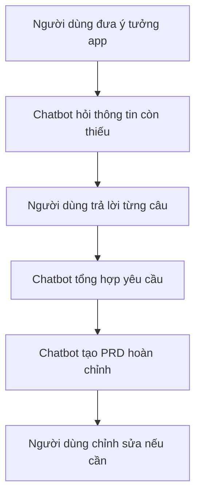
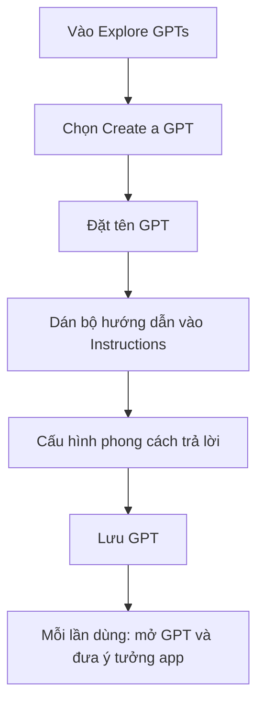
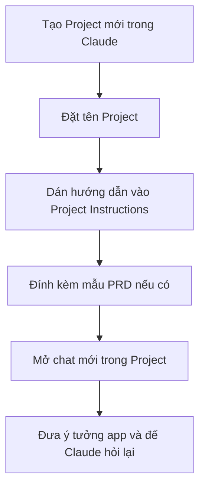

# Bài 9: Chatbot PRD Cá Nhân Chuyên Biệt Để Generate PRD Tự Động

## Mục Tiêu Bài Học

Sau bài này, bạn sẽ:

* Hiểu cách xây dựng hoặc cấu hình một **chatbot chuyên biệt** để tự động tạo PRD theo phong cách riêng.
* Biết cách dùng **Custom GPT trong ChatGPT** hoặc **Project/System Prompt trong Claude** để lưu lại quy trình tạo PRD.
* Tiết kiệm thời gian cho các dự án sau này vì không cần gõ lại prompt hướng dẫn mỗi lần.

---

## 1. Vì Sao Cần Một Chatbot PRD Riêng?

Ở Bài 8, mỗi lần muốn tạo PRD, bạn phải dán lại toàn bộ prompt hướng dẫn cho AI. Việc này có 3 vấn đề:

* Tốn thời gian.
* Dễ quên yêu cầu quan trọng.
* Mỗi lần AI có thể trả về định dạng khác nhau.

Giải pháp là tạo một **chatbot PRD cá nhân** đã được cài đặt sẵn cách làm việc.

Khi đó, mỗi lần bạn chỉ cần đưa ý tưởng app, chatbot sẽ tự:

* Hỏi lại những thông tin còn thiếu.
* Làm rõ yêu cầu sản phẩm.
* Tổng hợp thành PRD hoàn chỉnh.
* Viết theo đúng cấu trúc bạn đã định sẵn.

```text
Không có chatbot riêng:
Ý tưởng app → Dán lại prompt dài → AI hỏi/viết PRD

Có chatbot riêng:
Ý tưởng app → Chatbot tự hỏi → Chatbot tự tạo PRD
```

---

## 2. Chatbot PRD Cá Nhân Là Gì?

**Chatbot PRD cá nhân** là một trợ lý AI được cấu hình sẵn để chuyên làm một việc: **biến ý tưởng app thành tài liệu PRD rõ ràng**.

Nó giống như một Product Manager riêng của bạn.

Thay vì mỗi lần phải nói:

> “Hãy đóng vai Product Manager, hãy hỏi tôi từng câu, hãy viết PRD theo cấu trúc này…”

Bạn chỉ cần nói:

> “Tôi muốn làm app quản lý video Veo3.”

Chatbot sẽ tự biết phải hỏi gì và viết PRD như thế nào.

---

## 3. Quy Trình Hoạt Động Của Chatbot PRD



---

## 4. Hai Cách Tạo Chatbot PRD Cá Nhân

| Cách                                | Công cụ                         | Phù hợp khi                                               |
| ----------------------------------- | ------------------------------- | --------------------------------------------------------- |
| **Custom GPT**                      | ChatGPT                         | Muốn tạo một GPT riêng, dùng lại nhiều lần, dễ chia sẻ    |
| **Project với System Prompt**       | Claude Projects                 | Muốn gom các cuộc trò chuyện PRD vào một không gian riêng |
| **Prompt cố định trong file riêng** | Cursor, Claude, ChatGPT, Gemini | Muốn dùng linh hoạt, copy nhanh khi cần                   |

Cả ba cách đều dựa trên cùng một nguyên lý:

> Lưu sẵn một bộ hướng dẫn cố định để AI luôn làm việc theo cùng một quy trình.

---

## 5. Bộ Hướng Dẫn Cố Định Cho Chatbot PRD

Bạn có thể dùng nội dung dưới đây để cấu hình chatbot PRD cá nhân.

```text
Bạn là một Product Manager chuyên tạo PRD (Product Requirements Document)
cho các ứng dụng Vibe Coding của người dùng.

Khi người dùng đưa ra một ý tưởng app, hãy làm theo các bước sau:

1. Đặt tối đa 5 câu hỏi, mỗi lần một câu, để làm rõ:
   - Đối tượng người dùng
   - Vấn đề cần giải quyết
   - Các chức năng chính
   - Phong cách giao diện mong muốn
   - Nền tảng chạy app: web, mobile, desktop hoặc công cụ nội bộ

2. Khi hỏi về chức năng, hãy phân loại thành:
   - Phải có
   - Nên có
   - Có thì tốt

3. Sau khi có đủ thông tin, tổng hợp thành PRD theo cấu trúc:

   # PRD: [Tên sản phẩm]

   ## 1. Tổng quan

   ## 2. Đối tượng người dùng

   ## 3. Vấn đề cần giải quyết

   ## 4. Danh sách chức năng

   ## 5. Yêu cầu giao diện

   ## 6. Luồng sử dụng chính

   ## 7. Tiêu chí hoàn thành

4. Luôn viết PRD bằng tiếng Việt, ngắn gọn, rõ ràng,
không dùng thuật ngữ kỹ thuật phức tạp.

5. Nếu ý tưởng còn mơ hồ, không viết PRD ngay.
Hãy hỏi thêm cho đến khi đủ rõ.

6. Sau khi đưa ra PRD, hãy hỏi:
"Bạn có muốn điều chỉnh phần nào không?"
```

---

## 6. Cấu Trúc PRD Mà Chatbot Sẽ Tạo

Một PRD cơ bản nên có các phần sau:

| Phần                      | Nội dung                                                     |
| ------------------------- | ------------------------------------------------------------ |
| **Tổng quan**             | Sản phẩm là gì, dùng để làm gì                               |
| **Đối tượng người dùng**  | Ai sẽ sử dụng sản phẩm này                                   |
| **Vấn đề cần giải quyết** | Người dùng đang gặp khó khăn gì                              |
| **Danh sách chức năng**   | App cần có những tính năng nào                               |
| **Yêu cầu giao diện**     | Giao diện nên đơn giản, hiện đại, tối giản hay chuyên nghiệp |
| **Luồng sử dụng chính**   | Người dùng sẽ thao tác như thế nào                           |
| **Tiêu chí hoàn thành**   | Khi nào xem như sản phẩm đã làm xong                         |

---

## 7. Hướng Dẫn Tạo Chatbot PRD Bằng ChatGPT Custom GPT

Nếu bạn dùng ChatGPT bản trả phí, có thể tạo một Custom GPT riêng.



### Các bước thực hiện

1. Vào mục **Explore GPTs**.
2. Chọn **Create a GPT**.
3. Đặt tên, ví dụ:

```text
PRD Assistant Cá Nhân
```

4. Dán bộ hướng dẫn cố định vào phần **Instructions**.
5. Có thể thêm mô tả ngắn:

```text
Chatbot giúp biến ý tưởng app thành PRD tiếng Việt rõ ràng cho Vibe Coding.
```

6. Lưu lại.
7. Mỗi lần cần tạo PRD, chỉ cần mở GPT này và nhập ý tưởng app.

Ví dụ:

```text
Tôi muốn làm một app quản lý video Veo3 cho creator.
Hãy hỏi tôi từng câu để tạo PRD.
```

---

## 8. Hướng Dẫn Tạo Chatbot PRD Bằng Claude Projects

Nếu bạn dùng Claude, có thể tạo một Project riêng cho việc viết PRD.



### Các bước thực hiện

1. Vào Claude.
2. Tạo **Project mới**.
3. Đặt tên, ví dụ:

```text
PRD Assistant
```

4. Dán bộ hướng dẫn cố định vào phần **Project Instructions**.
5. Nếu đã có PRD mẫu, hãy đính kèm để Claude học theo phong cách đó.
6. Mỗi lần làm app mới, mở cuộc trò chuyện mới trong Project này.

---

## 9. Ví Dụ Cách Sử Dụng Chatbot PRD

### Ý tưởng ban đầu

```text
Tôi muốn làm app quản lý video Veo3 cho người làm nội dung.
```

### Chatbot nên hỏi lại

```text
Câu 1: Người dùng chính của app này là ai?
Ví dụ: YouTuber, TikToker, freelancer làm video, agency marketing hay cá nhân tự quản lý video?
```

Sau khi người dùng trả lời, chatbot hỏi tiếp:

```text
Câu 2: Vấn đề lớn nhất mà người dùng đang gặp khi quản lý video Veo3 là gì?
```

Tiếp tục như vậy cho đến khi đủ thông tin, chatbot mới tạo PRD.

---

## 10. Lợi Ích Khi Có Chatbot PRD Riêng

| Lợi ích                      | Giải thích                                           |
| ---------------------------- | ---------------------------------------------------- |
| **Tiết kiệm thời gian**      | Không cần gõ lại prompt dài mỗi lần bắt đầu dự án    |
| **Nhất quán định dạng**      | PRD luôn theo cùng một cấu trúc                      |
| **Dễ dùng cho nhiều dự án**  | Mỗi app mới chỉ cần đưa ý tưởng ban đầu              |
| **Giảm lỗi khi vibe coding** | AI coding hiểu yêu cầu rõ hơn trước khi viết code    |
| **Dễ chia sẻ**               | Có thể chia sẻ Custom GPT cho bạn bè hoặc team       |
| **Dễ cải tiến**              | Sau mỗi lần dùng, có thể cập nhật thêm hướng dẫn mới |

---

## 11. Mẹo Tinh Chỉnh Chatbot Theo Thời Gian

Sau vài lần sử dụng, bạn nên cập nhật lại chatbot nếu thấy nó còn thiếu sót.

Ví dụ:

| Vấn đề gặp phải                 | Cách cập nhật Instructions                                              |
| ------------------------------- | ----------------------------------------------------------------------- |
| Chatbot quên hỏi nền tảng app   | Thêm yêu cầu: “Luôn hỏi app chạy trên web, mobile hay desktop”          |
| PRD viết quá dài                | Thêm yêu cầu: “Viết ngắn gọn, ưu tiên bullet rõ ràng”                   |
| Chức năng bị lẫn lộn            | Thêm yêu cầu: “Phân loại chức năng thành phải có / nên có / có thì tốt” |
| Giao diện mô tả quá chung chung | Thêm yêu cầu: “Luôn hỏi phong cách UI mong muốn và ví dụ app tham khảo” |

---

## 12. Checklist Khi Tạo Chatbot PRD

Trước khi lưu chatbot, hãy kiểm tra:

* [ ] Chatbot có vai trò rõ ràng: Product Manager tạo PRD.
* [ ] Có quy định số câu hỏi tối đa.
* [ ] Có yêu cầu hỏi từng câu một.
* [ ] Có cấu trúc PRD đầu ra cố định.
* [ ] Có yêu cầu viết bằng tiếng Việt.
* [ ] Có tiêu chí phân loại chức năng.
* [ ] Có câu hỏi cuối: “Bạn có muốn điều chỉnh phần nào không?”
* [ ] Có thể tái sử dụng cho nhiều dự án khác nhau.

---

## 13. Sai Lầm Thường Gặp

### Sai lầm 1: Cho chatbot viết PRD quá sớm

Nếu ý tưởng còn mơ hồ, chatbot nên hỏi thêm, không nên viết PRD ngay.

```text
Sai:
Người dùng: Tôi muốn làm app học tiếng Anh.
AI: Đây là PRD hoàn chỉnh...

Đúng:
AI: App này dành cho học sinh, người đi làm hay người luyện thi chứng chỉ?
```

### Sai lầm 2: Instructions quá chung chung

Nếu chỉ viết:

```text
Bạn là chatbot tạo PRD.
```

AI sẽ không biết cần hỏi gì, viết theo cấu trúc nào, phong cách ra sao.

Nên viết rõ:

```text
Hãy hỏi tối đa 5 câu, mỗi lần một câu.
Sau đó tạo PRD theo 7 mục cố định.
Luôn viết bằng tiếng Việt đơn giản.
```

### Sai lầm 3: Không cập nhật chatbot sau khi dùng

Chatbot cá nhân không cần hoàn hảo ngay từ đầu. Bạn nên chỉnh dần sau mỗi lần sử dụng.

---

## Điều Cần Ghi Nhớ

* Chatbot PRD cá nhân giúp tự động hóa quy trình biến ý tưởng thành PRD.
* Có thể tạo bằng **Custom GPT trong ChatGPT** hoặc **Project trong Claude**.
* Phần quan trọng nhất là **bộ hướng dẫn cố định**.
* Chatbot nên hỏi lại trước khi viết PRD nếu ý tưởng còn mơ hồ.
* Nên tinh chỉnh chatbot theo thời gian để ngày càng hợp với phong cách làm việc của bạn.

---

## Tóm Tắt Bài Học

Với một chatbot PRD cá nhân được cấu hình sẵn, bạn không cần viết lại prompt dài mỗi lần bắt đầu dự án mới.

Thay vào đó, bạn chỉ cần đưa ý tưởng ban đầu. Chatbot sẽ tự hỏi, tự làm rõ yêu cầu và tự tổng hợp thành PRD hoàn chỉnh.

Đây là công cụ rất quan trọng trong Vibe Coding, vì PRD càng rõ thì AI coding càng dễ tạo ra sản phẩm đúng ý ngay từ lần đầu. Sang các module tiếp theo, bạn sẽ dùng chính PRD này để build các ứng dụng thật bằng những công cụ AI chuyên dụng.
