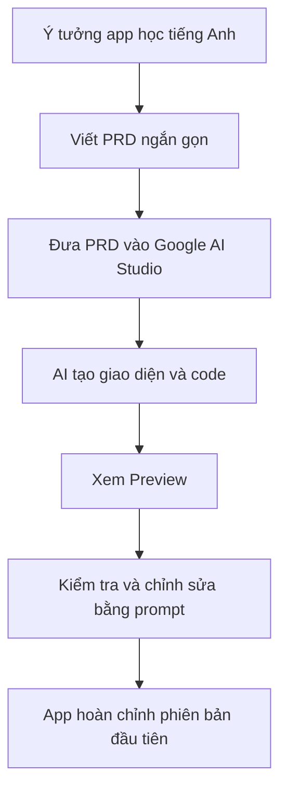
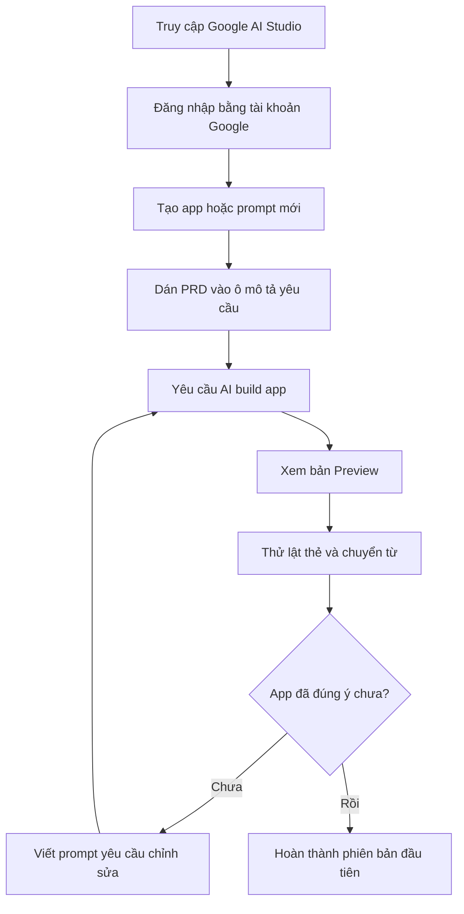
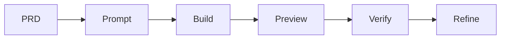

# Bài 10: Thực Hành Build English Learning App Với Google AI Studio

## Mục Tiêu Bài Học

Sau bài này, bạn sẽ:

* Biết cách dùng **Google AI Studio** để build một ứng dụng thật từ prompt.
* Tự tay tạo ra một **app học tiếng Anh** đơn giản, chạy được ngay trong trình duyệt.
* Hiểu Google AI Studio khác gì so với việc chat thông thường với ChatGPT hoặc Claude.

---

## 1. Google AI Studio Là Gì?

**Google AI Studio** là công cụ của Google cho phép bạn tạo ứng dụng bằng cách mô tả yêu cầu bằng ngôn ngữ tự nhiên.

Thay vì chỉ nhận câu trả lời dạng văn bản, bạn có thể yêu cầu AI tạo ra một ứng dụng có giao diện, logic xử lý và bản xem trước chạy trực tiếp trong trình duyệt.

| Tiêu chí                      | Google AI Studio                             |
| ----------------------------- | -------------------------------------------- |
| Chi phí                       | Có thể dùng bằng tài khoản Google            |
| Đầu ra                        | App chạy thử trực tiếp, có thể xem code      |
| Phù hợp với                   | Ứng dụng nhỏ, giao diện web, prototype nhanh |
| Yêu cầu cài đặt               | Không cần cài thêm phần mềm                  |
| Người mới có dùng được không? | Có, chỉ cần biết mô tả yêu cầu rõ ràng       |

---

## 2. Vì Sao Dùng Google AI Studio Trong Vibe Coding?

Trong các bài trước, bạn đã học cách viết PRD để AI hiểu đúng sản phẩm cần làm.

Ở bài này, bạn sẽ đưa PRD đó vào Google AI Studio để biến ý tưởng thành ứng dụng thật.



Điểm quan trọng là:

> Không prompt theo kiểu “làm đại một app học tiếng Anh”, mà hãy đưa yêu cầu rõ ràng bằng PRD.

---

## 3. Chuẩn Bị PRD Cho App Học Tiếng Anh

Trước khi mở Google AI Studio, hãy chuẩn bị một PRD ngắn gọn như sau:

```text
# PRD: App Học Từ Vựng Tiếng Anh

## 1. Tổng quan
Ứng dụng web giúp người mới học ghi nhớ từ vựng tiếng Anh qua flashcard.

## 2. Đối tượng người dùng
Người tự học tiếng Anh cơ bản, muốn ôn từ vựng mỗi ngày.

## 3. Vấn đề cần giải quyết
Người học khó nhớ từ vựng nếu chỉ đọc qua danh sách, cần cách ôn tập tương tác.

## 4. Danh sách chức năng
- Hiển thị flashcard: mặt trước là từ tiếng Anh, mặt sau là nghĩa tiếng Việt.
- Có nút "Lật thẻ" để xem nghĩa.
- Có nút "Từ tiếp theo" để chuyển sang từ khác.
- Có sẵn danh sách khoảng 10-15 từ vựng chủ đề cơ bản.

## 5. Yêu cầu giao diện
- Flashcard nằm ở giữa màn hình.
- Các nút điều hướng nằm bên dưới.
- Phong cách đơn giản, màu sắc tươi sáng.
- Chữ to, dễ đọc trên cả máy tính và điện thoại.

## 6. Tiêu chí hoàn thành
- Người dùng lật được thẻ để xem nghĩa.
- Người dùng chuyển được sang từ tiếp theo.
- App chạy được ngay trong trình duyệt.
- Giao diện không bị vỡ trên điện thoại.
```

---

## 4. Các Bước Thực Hành Trong Google AI Studio



Các bước thực hành:

1. Truy cập Google AI Studio.
2. Đăng nhập bằng tài khoản Google.
3. Tạo một app hoặc prompt mới.
4. Dán PRD đã chuẩn bị vào ô mô tả.
5. Yêu cầu AI build app theo PRD.
6. Xem bản preview.
7. Kiểm tra chức năng lật thẻ, chuyển từ.
8. Nếu chưa đúng, tiếp tục prompt để chỉnh sửa.

---

## 5. Prompt Mẫu Đưa Vào Google AI Studio

Bạn có thể dùng prompt sau:

```text
Dựa trên PRD dưới đây, hãy build một ứng dụng web flashcard học từ vựng tiếng Anh.

[Dán PRD từ phần trên vào đây]

Yêu cầu kỹ thuật:
- Dùng HTML, CSS, JavaScript thuần.
- App phải chạy được ngay trong trình duyệt.
- Không cần kết nối cơ sở dữ liệu.
- Dữ liệu từ vựng được viết cố định trong code.
- Giao diện responsive, hiển thị tốt trên điện thoại và máy tính.
- Thiết kế đơn giản, màu sắc tươi sáng, chữ dễ đọc.
```

---

## 6. Kiểm Tra Kết Quả Sau Khi AI Tạo App

Sau khi Google AI Studio tạo xong app, đừng vội xem là hoàn thành. Hãy kiểm tra theo đúng tiêu chí trong PRD.

| Việc cần kiểm tra   | Cách kiểm tra                             | Prompt sửa nếu chưa đúng                                                        |
| ------------------- | ----------------------------------------- | ------------------------------------------------------------------------------- |
| Lật thẻ             | Bấm nút “Lật thẻ”                         | “Khi bấm Lật thẻ, nghĩa tiếng Việt chưa hiện đúng. Hãy sửa lại logic lật thẻ.”  |
| Chuyển từ           | Bấm “Từ tiếp theo”                        | “Bấm Từ tiếp theo nhưng flashcard không đổi. Hãy sửa chức năng chuyển từ.”      |
| Giao diện mobile    | Thu nhỏ màn hình hoặc xem trên điện thoại | “Hãy tối ưu giao diện mobile, tăng cỡ chữ và căn giữa flashcard.”               |
| Dữ liệu từ vựng     | Kiểm tra có đủ 10-15 từ không             | “Hãy bổ sung thêm từ vựng tiếng Anh cơ bản về chào hỏi, gia đình và công việc.” |
| Trải nghiệm sử dụng | Dùng thử như người học thật               | “Hãy làm giao diện dễ dùng hơn, nút rõ ràng hơn và thẻ nổi bật hơn.”            |

---

## 7. Ví Dụ Prompt Chỉnh Sửa Sau Khi Có Bản Đầu Tiên

Nếu giao diện chưa đẹp:

```text
Giao diện hiện tại hơi đơn giản. Hãy thiết kế lại flashcard đẹp hơn:
- Thẻ nằm giữa màn hình.
- Có bo góc và bóng nhẹ.
- Màu nền tươi sáng.
- Nút bấm rõ ràng, dễ nhìn.
- Trên điện thoại không bị tràn màn hình.
```

Nếu chức năng chưa đúng:

```text
Hiện tại khi bấm "Từ tiếp theo", thẻ vẫn đang hiển thị mặt sau của từ cũ.
Hãy sửa lại để mỗi khi chuyển sang từ mới, flashcard tự quay về mặt trước.
```

Nếu muốn thêm tính năng:

```text
Hãy thêm nút "Đã thuộc".
Khi người dùng bấm nút này, từ hiện tại sẽ được loại khỏi danh sách ôn tập.
Nếu đã thuộc hết toàn bộ từ, hiển thị thông báo chúc mừng.
```

---

## 8. Mở Rộng App Sau Khi Hoàn Thành Phiên Bản Đầu Tiên

Sau khi phiên bản cơ bản chạy tốt, bạn có thể mở rộng app bằng các tính năng sau:

* Thêm nút **Đánh dấu đã thuộc**.
* Thêm nhiều chủ đề từ vựng:

  * Chào hỏi
  * Gia đình
  * Công việc
  * Du lịch
  * Ẩm thực
* Thêm điểm số hoặc số từ đã học.
* Thêm chế độ ôn lại từ chưa thuộc.
* Thêm phát âm cho từng từ nếu công cụ hỗ trợ.
* Thêm giao diện chọn chủ đề trước khi học.

---

## 9. Quy Trình Làm Việc Cần Ghi Nhớ



Trong Vibe Coding, bạn không chỉ prompt một lần rồi chờ kết quả hoàn hảo.

Bạn cần làm theo vòng lặp:

| Bước    | Ý nghĩa                    |
| ------- | -------------------------- |
| PRD     | Làm rõ sản phẩm cần build  |
| Prompt  | Đưa yêu cầu rõ ràng cho AI |
| Build   | Để AI tạo app              |
| Preview | Xem bản chạy thử           |
| Verify  | Kiểm tra đúng/sai          |
| Refine  | Prompt chỉnh sửa tiếp      |

---

## Điều Cần Ghi Nhớ

* Google AI Studio giúp bạn build và xem trước ứng dụng trong cùng một giao diện.
* PRD càng rõ thì app AI tạo ra càng đúng ý.
* Không nên chỉ prompt một câu quá chung chung như “làm app học tiếng Anh”.
* Luôn kiểm tra app theo tiêu chí hoàn thành.
* Sau khi có bản cơ bản, hãy mở rộng từng tính năng nhỏ thay vì yêu cầu quá nhiều cùng lúc.

---

## Tóm Tắt Bài Học

Trong bài này, bạn đã thực hành build một **English Learning App** đơn giản bằng Google AI Studio.

Bạn đã đi qua quy trình:

```text
Ý tưởng → PRD → Prompt → AI build app → Preview → Kiểm tra → Chỉnh sửa
```

Kết quả cuối bài là một app flashcard học từ vựng tiếng Anh có thể chạy ngay trong trình duyệt.

Ở bài tiếp theo, bạn sẽ tiếp tục thực chiến với một dự án có tính ứng dụng thương mại hơn: **ứng dụng tối ưu hình ảnh sản phẩm**.

---

# Bài luyện tập

## Mục tiêu


## Đề bài


## Yêu cầu hoàn thành

- [ ] 
- [ ] 
- [ ] 

## Kết quả / lời giải


## Ghi chú
