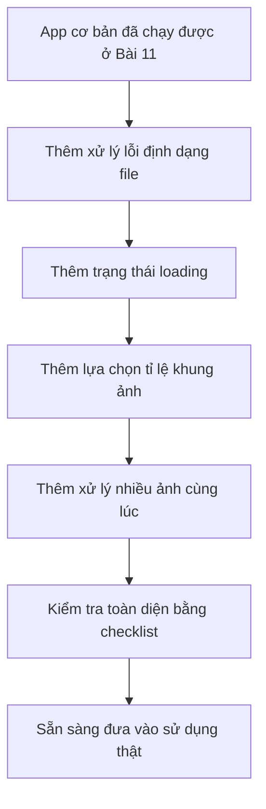

# Bài 12: Hoàn Chỉnh Ứng Dụng Tạo Ảnh Sản Phẩm AI — Sẵn Sàng Đưa Vào Vận Hành

## Mục Tiêu Bài Học

Sau bài này, bạn sẽ:

* Hoàn thiện app tối ưu ảnh sản phẩm ở **Bài 11** với các tính năng nâng cao hơn.
* Biết cách đánh giá một ứng dụng đã **đủ tốt để dùng thật** hay chưa.
* Nắm được checklist cơ bản trước khi coi một sản phẩm là **sẵn sàng vận hành**.

---

## 1. Từ “Chạy Được” Đến “Sẵn Sàng Vận Hành”

Ở Bài 11, app đã có các chức năng cốt lõi:

* Tải ảnh sản phẩm lên.
* Cắt ảnh thành khung vuông.
* Tải ảnh đã xử lý xuống máy.

Tuy nhiên, một ứng dụng **chạy được** chưa chắc đã **sẵn sàng dùng thật**.

Khi đưa vào vận hành, app cần xử lý tốt hơn các tình huống thực tế: người dùng chọn sai file, ảnh có nhiều kích thước khác nhau, thao tác nhiều lần liên tục, hoặc cần biết hệ thống đang xử lý đến đâu.

| Yếu tố cần bổ sung        | Vì sao cần                                                      |
| ------------------------- | --------------------------------------------------------------- |
| Xử lý lỗi cơ bản          | Người dùng có thể tải sai định dạng file, cần thông báo rõ ràng |
| Giao diện hoàn thiện      | Có trạng thái loading, thông báo thành công hoặc thất bại       |
| Tối ưu cho nhiều loại ảnh | Ảnh ngang, ảnh dọc, ảnh vuông đều cần xử lý hợp lý              |
| Trải nghiệm mượt mà       | Không giật, không đứng hình, phản hồi nhanh khi thao tác        |

---

## 2. Bổ Sung Tính Năng Nâng Cao

Tiếp tục từ app đã có ở Bài 11, bạn sẽ dùng prompt để nâng cấp từng tính năng một.

Nguyên tắc quan trọng là:

> Không yêu cầu AI sửa quá nhiều thứ cùng lúc.
> Hãy chia nhỏ tính năng, prompt từng bước, kiểm tra từng bước.

---

### Tính Năng 1: Xử Lý File Không Đúng Định Dạng

Người dùng có thể vô tình tải lên file không phải ảnh, ví dụ: `.pdf`, `.docx`, `.zip`.

App cần kiểm tra định dạng file trước khi xử lý.

**Prompt mẫu:**

```text
Hãy thêm kiểm tra: nếu người dùng tải lên file không phải ảnh, 
không phải định dạng .jpg hoặc .png, hãy hiển thị thông báo lỗi rõ ràng:

"Vui lòng chọn file ảnh định dạng JPG hoặc PNG."

Không cho ứng dụng tiếp tục xử lý file sai định dạng.
```

**Kết quả mong muốn:**

* File `.jpg` xử lý bình thường.
* File `.png` xử lý bình thường.
* File không hợp lệ hiển thị lỗi rõ ràng.
* App không bị treo hoặc báo lỗi kỹ thuật khó hiểu.

---

### Tính Năng 2: Thêm Trạng Thái Đang Xử Lý

Khi người dùng bấm nút cắt ảnh, app cần cho họ biết hệ thống đang làm việc.

Nếu không có trạng thái loading, người dùng có thể tưởng app bị lỗi hoặc bấm nhiều lần liên tục.

**Prompt mẫu:**

```text
Khi ảnh đang được xử lý, hãy hiển thị biểu tượng loading 
hoặc dòng chữ:

"Đang xử lý ảnh..."

Trong thời gian xử lý, hãy tạm thời vô hiệu hóa nút "Cắt ảnh" 
để tránh người dùng bấm nhiều lần.
```

**Kết quả mong muốn:**

* Có thông báo “Đang xử lý ảnh...”.
* Nút xử lý không bị bấm lặp lại liên tục.
* Sau khi xử lý xong, trạng thái loading biến mất.
* Người dùng hiểu rõ app đang hoạt động.

---

### Tính Năng 3: Hỗ Trợ Nhiều Tỉ Lệ Khung Ảnh

Ở Bài 11, app chỉ cắt ảnh theo khung vuông. Nhưng trong thực tế, mỗi nền tảng bán hàng hoặc mạng xã hội có thể cần tỉ lệ ảnh khác nhau.

Ví dụ:

| Tỉ lệ        | Phù hợp với                           |
| ------------ | ------------------------------------- |
| Vuông `1:1`  | Shopee, Lazada, ảnh sản phẩm phổ biến |
| Dọc `4:5`    | Facebook, Instagram, ảnh quảng cáo    |
| Ngang `16:9` | Banner, website, ảnh giới thiệu       |

**Prompt mẫu:**

```text
Hãy thêm 3 lựa chọn tỉ lệ khung ảnh khi cắt:

1. Vuông (1:1)
2. Dọc (4:5)
3. Ngang (16:9)

Người dùng chọn tỉ lệ mong muốn trước khi bấm nút "Cắt ảnh".
Sau khi chọn, ảnh được cắt theo đúng tỉ lệ đã chọn.
```

**Kết quả mong muốn:**

* Có giao diện chọn tỉ lệ ảnh.
* Người dùng biết rõ mình đang chọn kiểu khung nào.
* Ảnh đầu ra đúng theo tỉ lệ đã chọn.
* App xử lý hợp lý với ảnh ngang, ảnh dọc và ảnh vuông.

---

### Tính Năng 4: Xử Lý Nhiều Ảnh Cùng Lúc

Khi dùng thật, người bán hàng thường không chỉ xử lý một ảnh. Họ có thể cần tối ưu nhiều ảnh sản phẩm cùng lúc.

Vì vậy, app nên hỗ trợ upload nhiều ảnh và xử lý lần lượt.

**Prompt mẫu:**

```text
Hãy nâng cấp ứng dụng để hỗ trợ tải lên nhiều ảnh cùng lúc.

Yêu cầu:
- Người dùng có thể chọn nhiều file ảnh.
- App hiển thị danh sách ảnh đã chọn.
- Mỗi ảnh được xử lý theo tỉ lệ khung đã chọn.
- Người dùng có thể tải xuống từng ảnh đã xử lý.
- Nếu có file sai định dạng, chỉ báo lỗi cho file đó, không làm hỏng toàn bộ quá trình.
```

**Kết quả mong muốn:**

* Chọn được nhiều ảnh.
* Hiển thị preview hoặc danh sách ảnh.
* Xử lý từng ảnh rõ ràng.
* Không bị lỗi toàn bộ chỉ vì một file sai.
* Có thể tải xuống từng ảnh sau khi xử lý.

---

## 3. Quy Trình Hoàn Thiện Sản Phẩm



Quy trình này không chỉ áp dụng cho app tối ưu ảnh sản phẩm. Bạn có thể dùng lại cho hầu hết các ứng dụng khác:

```text
Chạy được → Xử lý lỗi → Cải thiện trải nghiệm → Test nhiều trường hợp → Sẵn sàng vận hành
```

---

## 4. Checklist Trước Khi Coi Là “Sẵn Sàng Vận Hành”

Trước khi kết luận app đã hoàn thiện, hãy kiểm tra từng mục sau.

| Hạng mục kiểm tra                                               | Đạt / Chưa đạt |
| --------------------------------------------------------------- | -------------- |
| Tải ảnh đúng định dạng hoạt động bình thường                    |                |
| Tải sai định dạng hiển thị thông báo lỗi rõ ràng                |                |
| Có trạng thái loading khi đang xử lý ảnh                        |                |
| Chọn được các tỉ lệ khung ảnh khác nhau                         |                |
| Ảnh đầu ra đúng theo tỉ lệ đã chọn                              |                |
| Xử lý được nhiều ảnh liên tiếp mà không bị lỗi                  |                |
| File sai định dạng không làm hỏng toàn bộ app                   |                |
| Giao diện hiển thị tốt trên cả điện thoại và máy tính           |                |
| Không có lỗi kỹ thuật hiện ra ngoài giao diện người dùng        |                |
| Người dùng mới có thể hiểu cách dùng mà không cần hướng dẫn dài |                |

Nếu tất cả mục trên đều **Đạt**, ứng dụng đã đủ tốt để chuyển sang bước tiếp theo: **deploy lên internet** ở Bài 16.

---

## 5. Kỹ Thuật Prompt Để Rà Soát Lỗi Toàn Diện

Sau khi đã thêm các tính năng nâng cao, bạn có thể nhờ AI rà soát lại toàn bộ ứng dụng.

Đây là một kỹ thuật rất quan trọng trong Vibe Coding: dùng AI không chỉ để viết code, mà còn để kiểm tra lại sản phẩm.

**Prompt mẫu:**

```text
Hãy rà soát lại toàn bộ code của ứng dụng này và chỉ ra:

1. Các trường hợp có thể gây lỗi mà chưa được xử lý.
2. Các phần giao diện có thể gây khó hiểu cho người dùng mới.
3. Các tình huống người dùng thao tác sai có thể làm app bị lỗi.
4. Các điểm nên cải thiện để app sẵn sàng dùng thật hơn.

Sau đó đề xuất cách khắc phục cụ thể cho từng vấn đề tìm thấy.
```

---

## 6. Ví Dụ Các Trường Hợp Cần Test Thực Tế

Khi test app, không nên chỉ thử một ảnh đẹp và đúng định dạng. Hãy cố tình thử nhiều tình huống khác nhau.

| Trường hợp test                      | Mục đích                                     |
| ------------------------------------ | -------------------------------------------- |
| Tải ảnh `.jpg`                       | Kiểm tra định dạng hợp lệ                    |
| Tải ảnh `.png`                       | Kiểm tra định dạng hợp lệ                    |
| Tải file `.pdf`                      | Kiểm tra báo lỗi định dạng                   |
| Tải ảnh rất lớn                      | Kiểm tra hiệu năng                           |
| Tải ảnh rất nhỏ                      | Kiểm tra xử lý ảnh đầu vào kém               |
| Tải nhiều ảnh cùng lúc               | Kiểm tra xử lý hàng loạt                     |
| Chọn từng tỉ lệ `1:1`, `4:5`, `16:9` | Kiểm tra kết quả đầu ra                      |
| Bấm nút xử lý nhiều lần liên tục     | Kiểm tra trạng thái loading và chống lỗi lặp |

---

## 7. Điều Cần Ghi Nhớ

* **“Chạy được”** và **“sẵn sàng vận hành”** là hai mức độ khác nhau.
* Một app dùng thật cần có xử lý lỗi, trạng thái rõ ràng và trải nghiệm mượt mà.
* Nên nâng cấp app theo từng bước nhỏ để dễ kiểm soát lỗi.
* Checklist giúp bạn đánh giá sản phẩm khách quan hơn.
* Có thể nhờ AI rà soát lại code để phát hiện thiếu sót trước khi deploy.

---

## Tóm Tắt Bài Học

Trong bài này, bạn đã hoàn thiện ứng dụng tối ưu ảnh sản phẩm từ phiên bản cơ bản thành phiên bản gần hơn với thực tế vận hành.

Ứng dụng đã được bổ sung các phần quan trọng:

* Kiểm tra định dạng file.
* Hiển thị trạng thái đang xử lý.
* Hỗ trợ nhiều tỉ lệ khung ảnh.
* Xử lý nhiều ảnh cùng lúc.
* Có checklist kiểm tra trước khi đưa vào sử dụng thật.

Đây là quy trình bạn nên áp dụng cho bất kỳ ứng dụng nào trong Vibe Coding:

```text
Làm cho chạy được trước
→ Bổ sung xử lý lỗi
→ Cải thiện trải nghiệm người dùng
→ Kiểm tra bằng checklist
→ Chuẩn bị deploy
```

Ở bài tiếp theo, bạn sẽ áp dụng tư duy này để xây dựng một ứng dụng AI tạo **Thumbnail YouTube tự động**.

---

# Bài luyện tập

## Mục tiêu


## Đề bài


## Yêu cầu hoàn thành

- [ ] 
- [ ] 
- [ ] 

## Kết quả / lời giải


## Ghi chú
