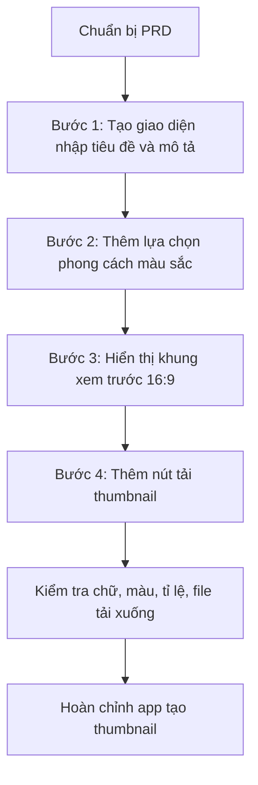

# Bài 13: Xây Dựng Ứng Dụng AI Tạo Thumbnail YouTube Tự Động Bằng Vibe Coding

## Mục Tiêu Bài Học

Sau bài này, bạn sẽ:

- Build được một ứng dụng AI tạo **thumbnail YouTube tự động**.
- Biết cách kết hợp **tiêu đề video**, **mô tả nội dung** và **yêu cầu hình ảnh** trong cùng một prompt.
- Hiểu cách thiết kế giao diện cho một công cụ sáng tạo nội dung.
- Biết kiểm tra thumbnail theo các tiêu chí quan trọng như: chữ rõ, đúng tỉ lệ, không bị cắt và tải xuống được.

---

## 1. Bài Toán: Vì Sao Cần App Tạo Thumbnail Tự Động?

Người làm YouTube thường mất nhiều thời gian để thiết kế thumbnail cho mỗi video.

Một thumbnail tốt cần:

- Có chữ nổi bật.
- Bố cục dễ nhìn.
- Màu sắc thu hút.
- Đúng tỉ lệ chuẩn YouTube.
- Truyền tải nhanh nội dung video.

Với Vibe Coding, ta có thể tạo một ứng dụng cho phép người dùng nhập **tiêu đề video**, thêm **mô tả ngắn**, chọn **phong cách màu sắc**, sau đó app tự động tạo khung thumbnail để xem trước và tải xuống.

```mermaid
flowchart TD
    A["Người dùng nhập tiêu đề video"] --> B["Nhập mô tả nội dung"]
    B --> C["Chọn phong cách màu sắc"]
    C --> D["App tạo bản xem trước thumbnail"]
    D --> E["Người dùng kiểm tra chữ, bố cục, màu sắc"]
    E --> F["Tải thumbnail .png"]
````

---

## 2. Viết PRD Cho App Tạo Thumbnail YouTube

PRD giúp AI hiểu rõ app cần làm gì, dành cho ai và hoàn thành khi nào.

```text
# PRD: Công Cụ Tạo Thumbnail YouTube Tự Động

## 1. Tổng quan

Ứng dụng web giúp nhà sáng tạo nội dung nhập tiêu đề video và nhận về gợi ý thumbnail có chữ nổi bật, bố cục thu hút.

## 2. Đối tượng người dùng

Người làm kênh YouTube cá nhân, không có kỹ năng thiết kế đồ họa chuyên sâu.

## 3. Vấn đề cần giải quyết

Thiết kế thumbnail thủ công tốn thời gian và đòi hỏi kỹ năng thiết kế mà nhiều nhà sáng tạo nội dung không có.

## 4. Danh sách chức năng

- Nhập tiêu đề video.
- Nhập mô tả ngắn về nội dung/chủ đề video.
- Chọn phong cách màu sắc:
  - Rực rỡ.
  - Tối giản.
  - Chuyên nghiệp.
- Xem trước thumbnail theo đúng tỉ lệ chuẩn YouTube 16:9.
- Tải xuống thumbnail dưới dạng ảnh .png.

## 5. Yêu cầu giao diện

- Bố cục chia 2 khu vực:
  - Bên trái: khu vực nhập liệu.
  - Bên phải: khu vực xem trước thumbnail.
- Phong cách hiện đại, rõ ràng, phù hợp với công cụ sáng tạo nội dung.

## 6. Tiêu chí hoàn thành

- Người dùng nhập được tiêu đề video.
- Người dùng chọn được phong cách màu sắc.
- App hiển thị thumbnail đúng tỉ lệ 16:9.
- Chữ trên thumbnail rõ, không bị cắt.
- Người dùng tải được thumbnail dưới dạng ảnh .png.
```

---

## 3. Kỹ Thuật Prompt Kết Hợp Văn Bản Và Hình Ảnh

Thumbnail khác với các app nhập liệu thông thường vì nó kết hợp cả:

| Thành phần     | Vai trò                                    |
| -------------- | ------------------------------------------ |
| Tiêu đề video  | Là chữ chính xuất hiện trên thumbnail      |
| Mô tả nội dung | Giúp AI hiểu chủ đề video                  |
| Phong cách màu | Quyết định cảm giác thị giác của thumbnail |
| Bố cục         | Giúp thumbnail rõ ràng, dễ đọc             |
| Tỉ lệ 16:9     | Đúng chuẩn hiển thị của YouTube            |

Khi viết prompt cho app thumbnail, cần nhấn mạnh các yếu tố sau:

```text
Khi tạo giao diện thumbnail, hãy đảm bảo:

- Tiêu đề video hiển thị bằng chữ to, đậm.
- Chữ có viền hoặc bóng đổ để nổi bật trên mọi nền ảnh.
- Chữ luôn nằm trong vùng an toàn, không bị cắt ở viền ảnh.
- Màu chữ tương phản rõ với màu nền.
- Khung thumbnail giữ đúng tỉ lệ 16:9.
- Bố cục phù hợp với thumbnail YouTube, dễ đọc ngay cả khi thu nhỏ.
```

---

## 4. Quy Trình Thực Hành



---

## 5. Prompt Mẫu Cho Từng Bước

### Bước 1: Tạo Giao Diện Nhập Liệu

```text
Hãy build giao diện với ô nhập "Tiêu đề video" và ô nhập "Mô tả ngắn nội dung video".

Bố cục gồm 2 cột:
- Cột bên trái là form nhập liệu.
- Cột bên phải là khu vực xem trước thumbnail.
```

---

### Bước 2: Thêm Lựa Chọn Phong Cách Màu Sắc

```text
Hãy thêm 3 nút lựa chọn phong cách màu:

- "Rực rỡ": nền cam - đỏ, chữ trắng nổi bật.
- "Tối giản": nền trắng - đen, chữ đen hoặc trắng tương phản.
- "Chuyên nghiệp": nền xanh dương đậm, chữ trắng hoặc vàng.

Khi chọn phong cách, nền khung xem trước đổi màu tương ứng.
```

---

### Bước 3: Hiển Thị Khung Xem Trước Thumbnail 16:9

```text
Hãy hiển thị khung xem trước thumbnail theo đúng tỉ lệ 16:9.

Yêu cầu:
- Tiêu đề video hiển thị chữ to, đậm.
- Chữ nằm trong vùng an toàn, không sát mép.
- Màu chữ tương phản với nền.
- Có thể thêm bóng đổ hoặc viền chữ để dễ đọc.
- Tiêu đề có thể nằm ở giữa hoặc phía dưới khung.
```

---

### Bước 4: Thêm Nút Tải Thumbnail

```text
Hãy thêm nút "Tải thumbnail" để xuất khung xem trước hiện tại thành file ảnh .png.

File tải xuống cần giữ đúng:
- Nội dung đang xem trước.
- Màu nền đã chọn.
- Tiêu đề đã nhập.
- Tỉ lệ 16:9.
```

---

## 6. Kiểm Tra Kết Quả Theo Đặc Thù Thumbnail

| Việc cần kiểm tra                                | Vì sao quan trọng                                         |
| ------------------------------------------------ | --------------------------------------------------------- |
| Chữ có bị cắt ở viền ảnh không?                  | YouTube có thể hiển thị thumbnail nhỏ trên nhiều thiết bị |
| Chữ có đủ tương phản với nền không?              | Thumbnail mờ nhạt sẽ khó thu hút người xem                |
| Tỉ lệ ảnh có đúng 16:9 không?                    | Sai tỉ lệ có thể khiến YouTube cắt hoặc làm méo ảnh       |
| File tải xuống có đúng nội dung xem trước không? | Đảm bảo tính năng xuất ảnh hoạt động chính xác            |
| Thumbnail có dễ đọc khi thu nhỏ không?           | Người xem thường nhìn thumbnail ở kích thước nhỏ          |

---

## 7. Checklist Hoàn Thành App

Trước khi coi app đã hoàn chỉnh, hãy kiểm tra:

```text
[ ] Có ô nhập tiêu đề video.
[ ] Có ô nhập mô tả ngắn nội dung video.
[ ] Có ít nhất 3 phong cách màu sắc.
[ ] Khung xem trước đúng tỉ lệ 16:9.
[ ] Chữ trên thumbnail rõ, to, dễ đọc.
[ ] Chữ không bị sát mép hoặc bị cắt.
[ ] Màu chữ tương phản tốt với nền.
[ ] Nút tải thumbnail hoạt động.
[ ] File tải xuống đúng nội dung đang xem trước.
```

---

## 8. Điều Cần Ghi Nhớ

* Ứng dụng có yếu tố **hình ảnh + văn bản** cần đặc biệt chú ý đến độ tương phản và vùng an toàn của chữ.
* Thumbnail YouTube phải giữ đúng tỉ lệ **16:9**.
* Chữ trên thumbnail cần rõ ngay cả khi ảnh bị thu nhỏ.
* Vẫn áp dụng nguyên tắc Vibe Coding: chia nhỏ yêu cầu thành từng bước prompt dễ kiểm soát.
* Kiểm tra kết quả theo đúng đặc thù sản phẩm, không chỉ kiểm tra app có chạy hay không.

---

## Tóm Tắt Bài Học

Qua bài này, bạn đã biết cách xây dựng một công cụ tạo **thumbnail YouTube tự động** bằng Vibe Coding.

Đây là một dạng ứng dụng rất thực tế cho người làm nội dung, vì nó kết hợp nhiều yếu tố quan trọng:

* Nhập liệu văn bản.
* Thiết kế giao diện.
* Xem trước kết quả trực quan.
* Xuất ảnh để sử dụng thật.

Trong bài tiếp theo, bạn sẽ học cách nâng tầm giao diện các ứng dụng đã tạo bằng một công cụ thiết kế UI chuyên nghiệp: **Google Stitch**.

---

# Bài luyện tập

## Mục tiêu


## Đề bài


## Yêu cầu hoàn thành

- [ ] 
- [ ] 
- [ ] 

## Kết quả / lời giải


## Ghi chú
