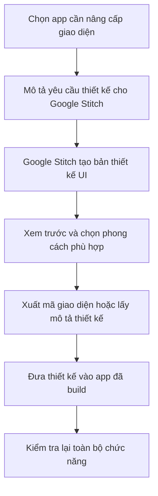

# Bài 14: Thiết Kế Giao Diện Ứng Dụng AI Chuyên Nghiệp Với Google Stitch

## Mục Tiêu Bài Học

Sau bài này, bạn sẽ:

* Hiểu **Google Stitch** là gì và vai trò của nó trong quy trình Vibe Coding.
* Biết cách dùng Google Stitch để thiết kế giao diện UI/UX chuyên nghiệp hơn cho ứng dụng đã build.
* Biết cách đưa thiết kế từ Google Stitch vào ứng dụng thực tế mà không làm hỏng chức năng cũ.

---

## 1. Google Stitch Là Gì?

**Google Stitch** là công cụ AI của Google chuyên hỗ trợ **thiết kế giao diện người dùng**.

Thay vì bắt đầu từ code, bạn mô tả giao diện mong muốn bằng ngôn ngữ tự nhiên. Sau đó, Google Stitch sẽ tạo ra bản thiết kế trực quan, hiện đại và có thể dùng làm nền tảng để triển khai vào app thật.

Nói đơn giản:

```text
Google Stitch = Mô tả giao diện bằng chữ → AI tạo thiết kế UI chuyên nghiệp
```

---

## 2. Google AI Studio Khác Google Stitch Như Thế Nào?

| Tiêu chí       | Google AI Studio                              | Google Stitch                                        |
| -------------- | --------------------------------------------- | ---------------------------------------------------- |
| Trọng tâm      | Build ứng dụng chạy được                      | Thiết kế giao diện chuyên nghiệp                     |
| Mục tiêu chính | Tạo app có logic, chức năng, giao diện cơ bản | Tạo UI đẹp, hiện đại, có tính sản phẩm               |
| Đầu ra         | Ứng dụng chạy thử được                        | Bản thiết kế giao diện, có thể xuất mã UI            |
| Khi nào dùng   | Khi cần tạo app nhanh từ ý tưởng              | Khi cần nâng cấp giao diện cho app đã có             |
| Phù hợp với    | Làm prototype, MVP, app thử nghiệm            | Làm giao diện đẹp hơn trước khi đưa vào sử dụng thật |

---

## 3. Vì Sao Cần Thiết Kế Riêng?

Các app đã build ở Bài 10-13 có thể đã chạy tốt về chức năng, ví dụ:

* App học tiếng Anh.
* App tối ưu ảnh sản phẩm.
* App tạo thumbnail YouTube.
* App tạo ảnh sản phẩm AI.

Tuy nhiên, một app **chạy được** chưa chắc đã tạo cảm giác **chuyên nghiệp**.

Google Stitch giúp bạn cải thiện các yếu tố như:

* Bố cục rõ ràng hơn.
* Màu sắc đồng bộ hơn.
* Khoảng cách giữa các phần hợp lý hơn.
* Giao diện giống sản phẩm thương mại thật hơn.
* Trải nghiệm người dùng tốt hơn trên cả máy tính và điện thoại.

---

## 4. Quy Trình Dùng Google Stitch



---

## 5. Ví Dụ Prompt Thiết Kế Giao Diện Với Google Stitch

Bạn có thể dùng prompt sau cho app tạo thumbnail YouTube:

```text
Hãy thiết kế giao diện cho một ứng dụng web tạo Thumbnail YouTube, gồm:

- Thanh điều hướng trên cùng với tên ứng dụng.
- Khu vực nhập liệu bên trái:
  + Ô nhập tiêu đề video.
  + Ô nhập mô tả ngắn.
  + 3 nút chọn phong cách màu.
- Khu vực xem trước bên phải:
  + Khung ảnh tỉ lệ 16:9.
  + Nút "Tải thumbnail" bên dưới.

Phong cách thiết kế:
- Hiện đại.
- Tối giản.
- Tông màu chính là tím và trắng.
- Phù hợp cho nhà sáng tạo nội dung trẻ.

Yêu cầu responsive:
- Hiển thị tốt trên máy tính.
- Hiển thị tốt trên điện thoại.
```

---

## 6. Cách Đưa Thiết Kế Từ Google Stitch Vào App Thật

Sau khi có thiết kế từ Google Stitch, bạn có hai cách chính để áp dụng vào ứng dụng.

| Cách                                               | Khi nào dùng                                    | Ưu điểm                      |
| -------------------------------------------------- | ----------------------------------------------- | ---------------------------- |
| **Xuất mã giao diện và ghép thủ công**             | Khi bạn muốn kiểm soát chính xác từng phần code | Ít rủi ro làm hỏng logic     |
| **Dùng thiết kế làm tham chiếu rồi prompt lại AI** | Khi bạn muốn AI tự cập nhật giao diện nhanh hơn | Nhanh, phù hợp với người mới |

---

## 7. Prompt Áp Dụng Thiết Kế Vào App Hiện Có

Khi muốn dùng ChatGPT, Claude hoặc Google AI Studio để cập nhật lại giao diện, bạn có thể dùng prompt sau:

```text
Đây là mô tả giao diện mới tôi muốn áp dụng cho ứng dụng hiện tại:

[Dán mô tả thiết kế đã tạo từ Google Stitch]

Hãy cập nhật giao diện của ứng dụng theo đúng mô tả trên.

Yêu cầu quan trọng:
- Chỉ thay đổi phần giao diện: màu sắc, bố cục, khoảng cách, typography.
- Giữ nguyên toàn bộ logic và chức năng hiện có.
- Không được xóa, đổi tên hoặc làm hỏng các hàm xử lý cũ.
- Sau khi cập nhật, ứng dụng vẫn phải hoạt động giống như trước.
```

---

## 8. Nguyên Tắc Quan Trọng: Không Đánh Đổi Chức Năng Lấy Giao Diện

Khi nâng cấp UI, lỗi thường gặp là AI làm giao diện đẹp hơn nhưng lại vô tình làm hỏng chức năng đang hoạt động.

Ví dụ:

| Rủi ro                             | Hậu quả                                               |
| ---------------------------------- | ----------------------------------------------------- |
| AI đổi tên biến hoặc hàm xử lý     | Nút bấm không còn hoạt động                           |
| AI xóa logic cũ khi thay giao diện | App mất chức năng chính                               |
| AI thay cấu trúc HTML quá nhiều    | CSS đẹp nhưng JS bị lỗi                               |
| AI bỏ qua responsive               | Giao diện đẹp trên máy tính nhưng lỗi trên điện thoại |

Vì vậy, khi prompt, luôn nhấn mạnh:

```text
Chỉ thay đổi giao diện.
Giữ nguyên 100% chức năng và logic xử lý hiện có.
```

---

## 9. Checklist Sau Khi Nâng Cấp Giao Diện

Sau khi áp dụng thiết kế mới, hãy kiểm tra lại:

* App có mở lên bình thường không?
* Các nút bấm còn hoạt động không?
* Dữ liệu nhập vào có xử lý đúng không?
* Chức năng tải ảnh, tạo ảnh, tải file có còn chạy không?
* Giao diện có hiển thị tốt trên điện thoại không?
* Có lỗi nào xuất hiện trong console không?
* Giao diện mới có đúng với thiết kế từ Google Stitch không?

---

## 10. Điều Cần Ghi Nhớ

* **Google Stitch** phù hợp để thiết kế UI/UX chuyên nghiệp.
* **Google AI Studio** phù hợp để build app chạy được.
* Có thể dùng Stitch để nâng cấp giao diện cho các app đã tạo.
* Khi cập nhật UI, phải yêu cầu AI giữ nguyên logic cũ.
* Sau khi đổi giao diện, luôn kiểm tra lại toàn bộ chức năng.

---

## Tóm Tắt Bài Học

Google Stitch giúp các ứng dụng bạn tự build trở nên chuyên nghiệp hơn về mặt giao diện mà không cần học thiết kế chuyên sâu.

Nếu Google AI Studio giúp bạn tạo ra một app **chạy được**, thì Google Stitch giúp app đó trở nên **đẹp hơn, rõ ràng hơn và giống sản phẩm thật hơn**.

Đây là bước hoàn thiện quan trọng trước khi đưa sản phẩm ra sử dụng thực tế. Sang Module 5, bạn sẽ tiếp tục thực hành các dự án phục vụ công việc và học cách đưa ứng dụng lên internet để người khác có thể sử dụng thật.
