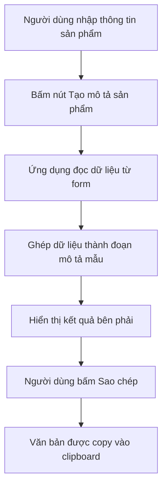
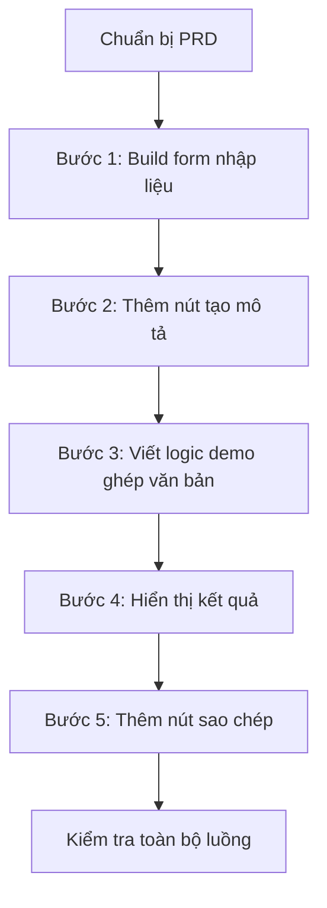

# Bài 15: Thực Hành Build App Soạn Văn Bản

## Nhập Thông Tin, Xuất Văn Bản Hoàn Chỉnh

## Mục Tiêu Bài Học

Sau bài này, bạn sẽ:

* Build được một ứng dụng dạng **nhập dữ liệu → sinh văn bản hoàn chỉnh**.
* Hiểu cách thiết kế form nhập liệu có cấu trúc để tạo prompt tốt cho AI.
* Biết cách làm bản demo trước khi kết nối AI API thật.
* Chuẩn bị nền tảng để học kết nối AI API ở Bài 17.

---

# 1. Bài Toán: App Soạn Văn Bản Dùng Để Làm Gì?

Trong công việc hằng ngày, rất nhiều nội dung được viết theo khuôn mẫu, ví dụ:

* Email xin nghỉ phép.
* Mô tả sản phẩm bán hàng.
* Bài đăng mạng xã hội.
* Tin nhắn chăm sóc khách hàng.
* Nội dung quảng cáo ngắn.

Nếu mỗi lần đều phải viết từ đầu, người dùng sẽ mất nhiều thời gian. Vì vậy, ta có thể tạo một ứng dụng cho phép người dùng:

```text
Nhập thông tin cần thiết → Bấm nút tạo → Nhận văn bản hoàn chỉnh
```

Trong bài này, ta thực hành với ví dụ:

> **App soạn mô tả sản phẩm bán hàng**

---

# 2. Luồng Hoạt Động Của App



---

# 3. PRD Cho App Soạn Mô Tả Sản Phẩm

```text
# PRD: Công Cụ Soạn Mô Tả Sản Phẩm Bán Hàng

## 1. Tổng quan
Ứng dụng web giúp người bán hàng nhập thông tin cơ bản về sản phẩm
và nhận về đoạn mô tả sản phẩm hoàn chỉnh, hấp dẫn.

## 2. Đối tượng người dùng
Người bán hàng online cần viết mô tả sản phẩm nhanh,
nhưng không giỏi viết lách.

## 3. Vấn đề cần giải quyết
Viết mô tả sản phẩm hấp dẫn tốn thời gian,
và không phải ai cũng có kỹ năng viết nội dung tốt.

## 4. Danh sách chức năng
- Form nhập thông tin sản phẩm.
- Nút "Tạo mô tả sản phẩm".
- Khu vực hiển thị văn bản kết quả.
- Nút "Sao chép" để copy văn bản.

## 5. Yêu cầu giao diện
- Bố cục gồm 2 phần:
  - Bên trái: form nhập liệu.
  - Bên phải: kết quả văn bản.
- Giao diện gọn gàng, rõ ràng, dễ sử dụng.

## 6. Tiêu chí hoàn thành
- Người dùng điền đầy đủ form.
- Bấm nút tạo mô tả.
- Nhận được đoạn mô tả sản phẩm hợp lý.
- Có thể sao chép kết quả thành công.
```

---

# 4. Thiết Kế Form Nhập Liệu Có Cấu Trúc

Điểm quan trọng nhất của app dạng này là **form nhập liệu phải đủ rõ**.

Nếu form quá sơ sài, AI hoặc logic tạo nội dung sẽ không có đủ thông tin để viết hay.

| Trường thông tin     | Mục đích                                      |
| -------------------- | --------------------------------------------- |
| Tên sản phẩm         | Xác định sản phẩm chính cần mô tả             |
| Đặc điểm nổi bật     | Cung cấp ý chính để triển khai thành nội dung |
| Đối tượng khách hàng | Giúp chọn cách viết phù hợp với người đọc     |
| Tông giọng văn       | Quyết định phong cách nội dung                |

Ví dụ form:

| Trường               | Kiểu nhập           |
| -------------------- | ------------------- |
| Tên sản phẩm         | Ô nhập văn bản ngắn |
| Đặc điểm nổi bật     | Ô nhập nhiều dòng   |
| Đối tượng khách hàng | Ô nhập văn bản ngắn |
| Tông giọng văn       | Menu chọn           |

---

# 5. Các Bước Thực Hành



---

# 6. Prompt Mẫu Cho Từng Bước

## Bước 1: Build Form Nhập Liệu

```text
Hãy build một form nhập liệu với 4 trường:

- Tên sản phẩm: ô nhập văn bản ngắn.
- Đặc điểm nổi bật: ô nhập văn bản nhiều dòng.
- Đối tượng khách hàng: ô nhập văn bản ngắn.
- Tông giọng văn: menu chọn gồm Vui vẻ, Chuyên nghiệp, Sang trọng.

Giao diện chia làm 2 cột:
- Bên trái là form nhập liệu.
- Bên phải là khu vực hiển thị kết quả.
```

---

## Bước 2: Thêm Nút Tạo Mô Tả

```text
Hãy thêm nút "Tạo mô tả sản phẩm".

Khi người dùng bấm nút này, ứng dụng sẽ lấy dữ liệu đã nhập từ form
và chuẩn bị tạo đoạn mô tả sản phẩm.
```

---

## Bước 3: Tạo Logic Demo Chưa Dùng AI Thật

```text
Hãy viết logic demo để ghép các thông tin đã nhập thành một đoạn mô tả mẫu.

Chưa cần kết nối AI thật ở bước này.

Ví dụ:
- Tên sản phẩm sẽ được đưa vào câu mở đầu.
- Đặc điểm nổi bật sẽ được triển khai thành phần lợi ích.
- Đối tượng khách hàng sẽ được nhắc đến trong đoạn mô tả.
- Tông giọng văn sẽ ảnh hưởng đến cách viết.
```

---

## Bước 4: Hiển Thị Kết Quả

```text
Hãy hiển thị đoạn mô tả sản phẩm đã tạo trong khung kết quả bên phải.

Nếu người dùng chưa nhập đủ thông tin,
hãy hiển thị thông báo yêu cầu điền đầy đủ form.
```

---

## Bước 5: Thêm Nút Sao Chép

```text
Hãy thêm nút "Sao chép" bên dưới khung kết quả.

Khi bấm nút này:
- Copy toàn bộ văn bản kết quả vào clipboard.
- Hiển thị thông báo ngắn: "Đã sao chép!".
```

---

# 7. Ví Dụ Dữ Liệu Đầu Vào Và Kết Quả

## Dữ liệu người dùng nhập

| Trường               | Nội dung                                          |
| -------------------- | ------------------------------------------------- |
| Tên sản phẩm         | Bình giữ nhiệt inox 500ml                         |
| Đặc điểm nổi bật     | Giữ nóng 8 giờ, giữ lạnh 12 giờ, thiết kế nhỏ gọn |
| Đối tượng khách hàng | Dân văn phòng, học sinh, người hay di chuyển      |
| Tông giọng văn       | Chuyên nghiệp                                     |

## Kết quả demo có thể tạo ra

```text
Bình giữ nhiệt inox 500ml là lựa chọn tiện lợi cho dân văn phòng,
học sinh và những người thường xuyên di chuyển.

Sản phẩm có khả năng giữ nóng lên đến 8 giờ, giữ lạnh đến 12 giờ,
giúp bạn luôn có đồ uống phù hợp trong suốt ngày dài. Với thiết kế nhỏ gọn,
bình dễ dàng mang theo khi đi học, đi làm hoặc đi du lịch.

Đây là sản phẩm phù hợp cho những ai cần một chiếc bình bền đẹp,
tiện dụng và hỗ trợ tốt cho sinh hoạt hằng ngày.
```

---

# 8. Vì Sao Chưa Kết Nối AI Thật Ở Bài Này?

Ở bài này, ta cố tình làm bản demo bằng logic ghép câu đơn giản trước.

Lý do:

* Dễ kiểm tra giao diện và luồng thao tác.
* Dễ phát hiện lỗi form, lỗi nút bấm, lỗi hiển thị.
* Không bị rối bởi lỗi API key, lỗi mạng hoặc lỗi gọi AI.
* Có nền tảng ổn định trước khi học kết nối AI thật ở Bài 17.

Có thể hiểu đơn giản:

```text
Làm app chạy đúng trước → Sau đó mới làm app thông minh hơn
```

---

# 9. Checklist Kiểm Tra Sau Khi Build

| Hạng mục                              | Đã đạt? |
| ------------------------------------- | ------- |
| Form có đủ 4 trường thông tin         | ☐       |
| Người dùng nhập được dữ liệu          | ☐       |
| Có nút "Tạo mô tả sản phẩm"           | ☐       |
| Bấm nút tạo ra văn bản kết quả        | ☐       |
| Kết quả hiển thị rõ ràng bên phải     | ☐       |
| Có nút "Sao chép"                     | ☐       |
| Copy văn bản vào clipboard thành công | ☐       |
| Có thông báo "Đã sao chép!"           | ☐       |

---

# 10. Điều Cần Ghi Nhớ

* App dạng **nhập thông tin → xuất văn bản** rất phổ biến trong công việc thực tế.
* Chất lượng văn bản đầu ra phụ thuộc nhiều vào chất lượng form đầu vào.
* Nên build bản demo trước khi kết nối AI thật.
* Chia nhỏ prompt theo từng bước sẽ giúp AI code đúng hơn và dễ sửa lỗi hơn.

---

# Tóm Tắt Bài Học

Trong bài này, bạn đã học cách xây dựng một app soạn văn bản tự động theo luồng:

```text
Nhập thông tin sản phẩm → Tạo mô tả → Hiển thị kết quả → Sao chép văn bản
```

Đây là dạng app rất thực tế, có thể áp dụng cho nhiều nhu cầu như viết email, mô tả sản phẩm, bài đăng quảng cáo hoặc nội dung chăm sóc khách hàng.

Ở bài tiếp theo, bạn sẽ học cách đưa ứng dụng đã build lên internet bằng **Vercel**, để có thể truy cập và chia sẻ từ bất kỳ đâu.
