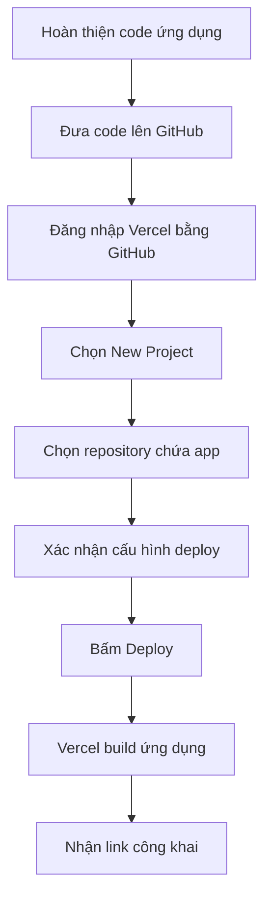

# Bài 16: Deploy To Production — Publish App Lên Vercel Miễn Phí

## Mục Tiêu Bài Học

Sau bài này, bạn sẽ:

* Hiểu **deploy / triển khai** là gì.
* Biết vì sao cần deploy để người khác có thể dùng app của bạn.
* Biết cách đưa ứng dụng web lên internet bằng **Vercel**.
* Có được một đường link thật để chia sẻ ứng dụng cho bất kỳ ai.

---

## 1. Deploy Là Gì? Vì Sao Cần Thiết?

Trong các bài trước, app của bạn thường chỉ chạy được trên máy cá nhân hoặc trong bản preview của công cụ AI.

**Deploy** là quá trình đưa ứng dụng lên một máy chủ trên internet, để người khác có thể truy cập bằng đường link.

```text
Chưa deploy:
App chỉ chạy trên máy của bạn

Đã deploy:
App chạy trên internet, ai có link cũng dùng được
```

### So Sánh Trước Và Sau Khi Deploy

| Trạng thái  | Người dùng được app | Cách truy cập                    |
| ----------- | ------------------- | -------------------------------- |
| Chưa deploy | Chỉ bạn             | Mở trên máy cá nhân hoặc preview |
| Đã deploy   | Bất kỳ ai có link   | Truy cập qua trình duyệt         |

---

## 2. Vercel Là Gì?

**Vercel** là nền tảng giúp bạn deploy ứng dụng web lên internet rất nhanh, đặc biệt phù hợp với các dự án cá nhân, landing page, app React, Next.js hoặc HTML/CSS/JS đơn giản.

Bạn có thể truy cập tại [Vercel](https://vercel.com).

### Vì Sao Nên Dùng Vercel?

| Ưu điểm                      | Giải thích                                              |
| ---------------------------- | ------------------------------------------------------- |
| Miễn phí cho dự án cá nhân   | Phù hợp với app nhỏ, demo, sản phẩm học tập             |
| Kết nối trực tiếp với GitHub | Cập nhật code lên GitHub là Vercel có thể tự deploy lại |
| Có link công khai ngay       | Link thường có dạng `ten-app.vercel.app`                |
| Không cần tự quản lý server  | Không phải cấu hình máy chủ phức tạp                    |
| Deploy nhanh                 | Thường chỉ mất vài chục giây đến vài phút               |

---

## 3. Chuẩn Bị Trước Khi Deploy

Trước khi đưa app lên Vercel, bạn cần chuẩn bị một vài thứ cơ bản.

| Việc cần chuẩn bị        | Ghi chú                                |
| ------------------------ | -------------------------------------- |
| Tài khoản GitHub         | Dùng để lưu trữ code của app           |
| Tài khoản Vercel         | Có thể đăng nhập bằng tài khoản GitHub |
| Code ứng dụng hoàn chỉnh | App nên chạy ổn ở local hoặc preview   |
| Tên dự án rõ ràng        | Giúp link deploy dễ nhớ hơn            |

---

## 4. Quy Trình Deploy Lên Vercel



---

## 5. Các Bước Chi Tiết

### Bước 1: Tải Code Lên GitHub

Trước tiên, bạn cần đưa source code của ứng dụng lên GitHub.

Nếu chưa quen dùng Git, bạn có thể dùng cách đơn giản hơn:

* Tạo repository mới trên GitHub.
* Chọn **Upload files**.
* Kéo thả toàn bộ code dự án vào.
* Bấm **Commit changes**.

Nếu dùng Git trong terminal, quy trình thường là:

```bash
git init
git add .
git commit -m "Initial deploy"
git branch -M main
git remote add origin <repository-url>
git push -u origin main
```

---

### Bước 2: Đăng Nhập Vercel

Truy cập [Vercel](https://vercel.com), sau đó chọn:

```text
Continue with GitHub
```

Việc này giúp Vercel đọc được danh sách repository trong GitHub của bạn.

---

### Bước 3: Tạo Dự Án Mới

Trong dashboard Vercel:

```text
Add New → Project
```

Sau đó chọn repository chứa code ứng dụng bạn muốn deploy.

---

### Bước 4: Xác Nhận Cấu Hình

Với các app phổ biến như:

* React
* Next.js
* Vite
* HTML/CSS/JS thuần

Vercel thường tự nhận diện đúng cấu hình.

Ví dụ với app React/Vite, Vercel có thể tự nhận:

| Mục              | Ví dụ           |
| ---------------- | --------------- |
| Framework Preset | Vite            |
| Build Command    | `npm run build` |
| Output Directory | `dist`          |

Thông thường, nếu Vercel đã tự điền đúng, bạn chỉ cần bấm:

```text
Deploy
```

---

### Bước 5: Nhận Link Công Khai

Sau khi build xong, Vercel sẽ cung cấp một link dạng:

```text
https://ten-du-an.vercel.app
```

Đây là link thật để bạn gửi cho người khác dùng thử app.

---

## 6. Kiểm Tra Sau Khi Deploy

Sau khi có link, không nên dừng lại ngay. Bạn cần kiểm tra app trên chính link thật, vì môi trường production đôi khi khác với môi trường preview/local.

| Việc cần kiểm tra           | Mục đích                                         |
| --------------------------- | ------------------------------------------------ |
| Mở link trên máy tính       | Kiểm tra giao diện desktop                       |
| Mở link trên điện thoại     | Kiểm tra responsive                              |
| Thử toàn bộ chức năng chính | Đảm bảo app không chỉ mở được mà còn dùng được   |
| Gửi link cho người khác     | Kiểm tra người ngoài có truy cập được không      |
| Kiểm tra lỗi console nếu có | Phát hiện lỗi JavaScript hoặc lỗi tải tài nguyên |

---

## 7. Cập Nhật App Sau Khi Đã Deploy

Một điểm mạnh của Vercel là sau khi kết nối với GitHub, mỗi lần bạn cập nhật code lên GitHub, Vercel có thể tự động build lại.


Điều này có nghĩa là bạn không cần tạo link mới mỗi lần sửa app. Người dùng vẫn truy cập cùng một link, nhưng nội dung app đã được cập nhật.

---

## 8. Checklist Deploy App Lên Vercel

Trước khi coi app là đã deploy thành công, hãy kiểm tra nhanh checklist sau:

```text
[ ] App đã chạy ổn ở local hoặc preview
[ ] Code đã được đưa lên GitHub
[ ] Đã đăng nhập Vercel bằng GitHub
[ ] Đã chọn đúng repository
[ ] Vercel build thành công
[ ] Đã nhận được link .vercel.app
[ ] Link mở được trên máy tính
[ ] Link mở được trên điện thoại
[ ] Chức năng chính hoạt động bình thường
[ ] Đã gửi link cho người khác kiểm tra thử
```

---

## 9. Lỗi Thường Gặp Khi Deploy

| Lỗi                                  | Nguyên nhân thường gặp             | Cách xử lý                                     |
| ------------------------------------ | ---------------------------------- | ---------------------------------------------- |
| Build failed                         | Thiếu package hoặc lỗi code        | Xem log lỗi trong Vercel                       |
| Trang trắng                          | Sai cấu hình build/output          | Kiểm tra `Build Command` và `Output Directory` |
| App chạy local được nhưng deploy lỗi | Biến môi trường chưa cấu hình      | Thêm Environment Variables trong Vercel        |
| Hình ảnh không hiển thị              | Sai đường dẫn file                 | Kiểm tra lại đường dẫn ảnh trong project       |
| Link mở được nhưng tính năng lỗi     | Khác biệt giữa local và production | Test lại toàn bộ luồng trên link thật          |

---

## Điều Cần Ghi Nhớ

* **Deploy** là bước biến app từ “chỉ chạy trên máy bạn” thành “chạy trên internet”.
* **Vercel** giúp deploy app web miễn phí và rất nhanh.
* App nên được đưa lên **GitHub** trước khi deploy.
* Sau khi deploy, luôn kiểm tra app trên **link thật**.
* Khi cập nhật code lên GitHub, Vercel có thể tự động cập nhật app trên cùng một link.

---

## Tóm Tắt Bài Học

Deploy là cột mốc quan trọng giúp ứng dụng cá nhân trở thành một sản phẩm thật có thể chia sẻ cho người khác. Với Vercel, bạn không cần biết nhiều về server hay hạ tầng kỹ thuật, chỉ cần đưa code lên GitHub, kết nối với Vercel và bấm deploy.

Sau bài này, bạn đã biết cách đưa app lên internet miễn phí và có một đường link thật để chia sẻ. Ở bài tiếp theo, bạn sẽ học cách kết nối **API Key AI thật** vào ứng dụng, giúp app có khả năng sinh nội dung thông minh thay vì chỉ dùng dữ liệu mẫu cố định.
