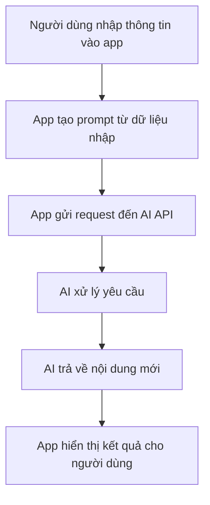
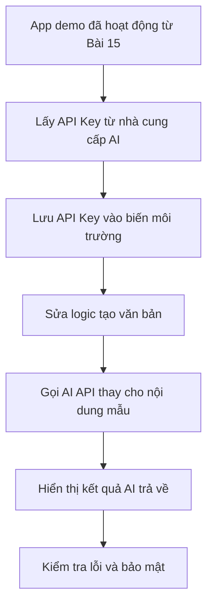
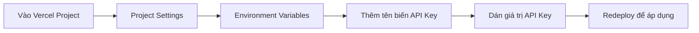

# Bài 17: Thực Hành Kết Nối AI API Key — Kích Hoạt Não Cho App

## Mục Tiêu Bài Học

Sau bài này, bạn sẽ:

* Hiểu **API Key** là gì và vì sao app cần API Key để gọi AI thật.
* Biết cách lấy API Key từ nhà cung cấp AI như Claude, OpenAI hoặc Google AI Studio.
* Biết cách kết nối API Key vào ứng dụng đã build.
* Biết cách bảo mật API Key để tránh bị lộ khi đưa code lên GitHub hoặc deploy lên Vercel.

---

## 1. API Key Là Gì?

**API Key** giống như một chiếc **chìa khóa truy cập**. Nó cho phép ứng dụng của bạn gửi yêu cầu đến hệ thống AI và nhận lại kết quả do AI tạo ra.

Ví dụ:

* App gửi thông tin người dùng nhập vào.
* AI xử lý yêu cầu.
* AI trả về nội dung mới.
* App hiển thị kết quả cho người dùng.

```text
Chưa có API Key:
App chỉ ghép câu theo khuôn mẫu có sẵn.

Có API Key:
App gọi AI thật và sinh nội dung mới theo từng yêu cầu.
```

Nói đơn giản, API Key là bước giúp app chuyển từ:

> **Demo tĩnh** → **Ứng dụng AI thật**

---

## 2. Vì Sao Cần API Key?

Ở các bài trước, app có thể đã tạo nội dung bằng cách ghép câu mẫu. Cách này phù hợp để demo, nhưng chưa thật sự thông minh.

Khi kết nối API Key, app có thể:

| Trước khi có API Key      | Sau khi có API Key                     |
| ------------------------- | -------------------------------------- |
| Nội dung lặp lại theo mẫu | Nội dung được AI tạo mới               |
| Logic đơn giản            | Linh hoạt theo dữ liệu người dùng nhập |
| Phù hợp để demo           | Có thể dùng cho sản phẩm thật          |
| Không cần tài khoản API   | Cần API Key từ nhà cung cấp AI         |

---

## 3. Lấy API Key Từ Đâu?

Bạn có thể lấy API Key từ các nhà cung cấp AI phổ biến sau:

| Nhà cung cấp     | Nơi lấy API Key         | Ghi chú                                               |
| ---------------- | ----------------------- | ----------------------------------------------------- |
| Anthropic Claude | `console.anthropic.com` | Cần tài khoản và credit để sử dụng API                |
| OpenAI ChatGPT   | `platform.openai.com`   | Tài khoản API khác với tài khoản ChatGPT thông thường |
| Google AI Studio | `aistudio.google.com`   | Có thể có gói miễn phí với giới hạn sử dụng           |

Lưu ý quan trọng:

> Tài khoản dùng để **chat với AI** và tài khoản dùng để **lấy API Key** có thể là hai hệ thống khác nhau.

Ví dụ:

```text
chat.openai.com      -> dùng để chat với ChatGPT
platform.openai.com  -> dùng để lấy API Key cho app
```

---

## 4. Luồng Hoạt Động Khi App Gọi AI API



Ví dụ với app soạn văn bản:

```text
Người dùng nhập:
- Tên sản phẩm
- Đặc điểm nổi bật
- Đối tượng khách hàng
- Tông giọng văn

App gửi dữ liệu đó đến AI.

AI trả về:
Một đoạn mô tả sản phẩm hoàn chỉnh.
```

---

## 5. Nguyên Tắc Bảo Mật API Key

API Key giống như mật khẩu. Nếu bị lộ, người khác có thể dùng key đó và bạn có thể phải trả tiền cho phần sử dụng của họ.

Vì vậy, cần nhớ:

| Nên làm                                   | Không nên làm                                     |
| ----------------------------------------- | ------------------------------------------------- |
| Lưu API Key trong **biến môi trường**     | Viết thẳng API Key vào code                       |
| Thêm file chứa key vào `.gitignore`       | Đẩy file chứa key lên GitHub                      |
| Đặt giới hạn chi tiêu trong tài khoản API | Dùng chung một API Key cho nhiều dự án công khai  |
| Kiểm tra kỹ trước khi deploy              | Gửi API Key qua tin nhắn hoặc email không bảo mật |

Ví dụ sai:

```js
const apiKey = "sk-abc123...";
```

Ví dụ đúng:

```js
const apiKey = process.env.OPENAI_API_KEY;
```

---

## 6. Prompt Mẫu Để Nhờ AI Viết Code Kết Nối API

Bạn có thể dùng prompt sau khi muốn nhờ AI sửa app demo thành app gọi AI thật:

```text
Ứng dụng hiện tại đang tạo mô tả sản phẩm bằng cách ghép câu theo khuôn mẫu cố định.

Hãy thay thế phần đó bằng việc gọi API của [tên nhà cung cấp AI], với yêu cầu:

- Gửi các thông tin người dùng đã nhập gồm:
  tên sản phẩm, đặc điểm nổi bật, đối tượng khách hàng, tông giọng văn
  thành một prompt rõ ràng gửi đến AI.

- Nhận kết quả trả về và hiển thị trong khung kết quả như cũ.

- API Key phải được đọc từ biến môi trường, không được hardcode trong code.

- Xử lý trường hợp lỗi, ví dụ:
  hết hạn mức sử dụng, API Key sai, mất kết nối mạng,
  bằng thông báo rõ ràng cho người dùng.
```

---

## 7. Kết Nối API Key Vào App Soạn Văn Bản

Quy trình tổng quát:



---

## 8. Ví Dụ Cấu Hình Biến Môi Trường

Thông thường, bạn sẽ tạo file `.env.local` ở project local.

Ví dụ:

```env
OPENAI_API_KEY=your_api_key_here
```

Sau đó, trong code chỉ đọc key bằng biến môi trường:

```js
const apiKey = process.env.OPENAI_API_KEY;
```

Không đưa file `.env.local` lên GitHub.

Trong `.gitignore`, cần có:

```gitignore
.env
.env.local
```

---

## 9. Cấu Hình API Key Trên Vercel

Khi deploy lên Vercel, biến môi trường trên máy cá nhân **không tự động chuyển lên Vercel**.

Bạn cần cấu hình lại trong dashboard của Vercel.



Ví dụ:

| Tên biến            | Giá trị                         |
| ------------------- | ------------------------------- |
| `OPENAI_API_KEY`    | API Key lấy từ OpenAI           |
| `ANTHROPIC_API_KEY` | API Key lấy từ Anthropic        |
| `GEMINI_API_KEY`    | API Key lấy từ Google AI Studio |

Tên biến trên Vercel phải khớp với tên biến mà code đang đọc.

---

## 10. Kiểm Tra Sau Khi Kết Nối API Key

Sau khi kết nối xong, hãy kiểm tra các điểm sau:

| Việc cần kiểm tra                           | Mục đích                                   |
| ------------------------------------------- | ------------------------------------------ |
| App sinh nội dung mới mỗi lần bấm tạo       | Xác nhận app đang gọi AI thật              |
| Nội dung không lặp lại y hệt như bản demo   | Đảm bảo không còn dùng dữ liệu mẫu         |
| API Key không xuất hiện trong code          | Tránh lộ key khi đưa lên GitHub            |
| File `.env.local` đã nằm trong `.gitignore` | Tránh commit nhầm key                      |
| App trên Vercel gọi AI thành công           | Xác nhận đã cấu hình biến môi trường đúng  |
| Có thông báo lỗi rõ ràng khi API lỗi        | Giúp người dùng hiểu chuyện gì đang xảy ra |

---

## 11. Những Lỗi Thường Gặp

| Lỗi                                      | Nguyên nhân thường gặp                    | Cách xử lý                                         |
| ---------------------------------------- | ----------------------------------------- | -------------------------------------------------- |
| App chạy local được nhưng lên Vercel lỗi | Chưa cấu hình biến môi trường trên Vercel | Thêm API Key trong Project Settings                |
| Báo lỗi unauthorized                     | API Key sai hoặc hết hạn                  | Kiểm tra lại key                                   |
| App không trả kết quả                    | Request gửi sai định dạng                 | Kiểm tra code gọi API                              |
| Bị lộ API Key trên GitHub                | Hardcode key hoặc commit file `.env`      | Xóa key, tạo key mới, thêm `.env` vào `.gitignore` |
| Gọi API quá tốn tiền                     | Không giới hạn usage                      | Đặt usage limit trong tài khoản nhà cung cấp       |

---

## 12. Checklist Thực Hành

Trước khi kết thúc bài, hãy đảm bảo bạn đã làm được:

* [ ] Lấy được API Key từ nhà cung cấp AI.
* [ ] Tạo file `.env.local` để lưu API Key trên máy cá nhân.
* [ ] Thêm `.env.local` vào `.gitignore`.
* [ ] Sửa app để đọc API Key từ biến môi trường.
* [ ] Thay logic tạo nội dung mẫu bằng logic gọi AI API.
* [ ] Hiển thị kết quả AI trả về trong giao diện app.
* [ ] Xử lý lỗi cơ bản khi API không hoạt động.
* [ ] Cấu hình biến môi trường trên Vercel.
* [ ] Redeploy app sau khi thêm biến môi trường.
* [ ] Kiểm tra chắc chắn API Key không bị lộ trong code công khai.

---

## Điều Cần Ghi Nhớ

* **API Key** là chìa khóa giúp app gọi AI thật.
* Không bao giờ hardcode API Key trực tiếp trong code.
* Không đưa file `.env`, `.env.local` lên GitHub.
* Biến môi trường trên máy cá nhân và trên Vercel là hai nơi riêng biệt.
* Sau khi thêm API Key trên Vercel, cần **redeploy** để thay đổi có hiệu lực.
* Luôn đặt giới hạn sử dụng để tránh phát sinh chi phí ngoài ý muốn.

---

## Tóm Tắt Bài Học

Trong bài này, bạn đã học cách kết nối **AI API Key** vào ứng dụng. Đây là bước giúp app chuyển từ bản demo ghép nội dung cố định thành một ứng dụng AI thật, có khả năng sinh nội dung linh hoạt theo dữ liệu người dùng nhập.

Ở bài tiếp theo, bạn sẽ được giới thiệu về **Antigravity** — một AI Agent hỗ trợ code và tự động hóa công việc hiệu quả hơn.
