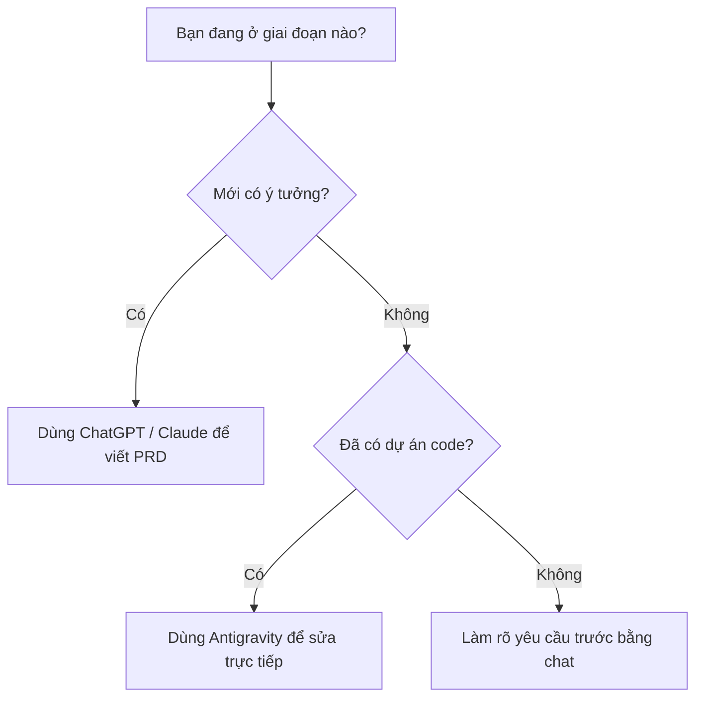
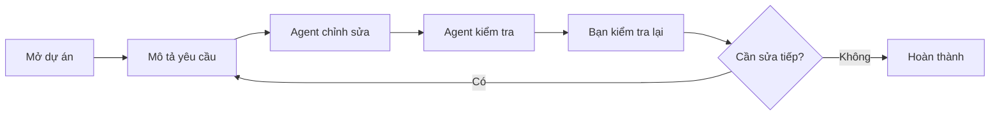

# Bài 18: Hướng Dẫn Sử Dụng AI Agent Với Antigravity

## Mục Tiêu Bài Học

Sau bài này, bạn sẽ:

- Làm quen với khái niệm **AI Agent** và cách nó khác với việc chat thông thường với AI.
- Biết cách dùng **Antigravity** để hỗ trợ code và tự động hóa các công việc lặp lại.
- Hiểu khi nào nên dùng **AI Agent** thay vì tiếp tục thao tác thủ công qua chat.

---

## 1. AI Agent Là Gì? Khác Gì Với Chat Thông Thường?

Khi bạn chat với ChatGPT hoặc Claude, AI thường trả lời từng câu hỏi rồi **dừng lại, chờ bạn** thực hiện bước tiếp theo như copy code, dán vào công cụ khác, chạy thử, kiểm tra lỗi và báo lại.

Với **AI Agent**, AI có thể **tự thực hiện nhiều bước liên tiếp** thay bạn: đọc file, sửa code, chạy thử, kiểm tra lỗi và tự sửa lại mà không cần bạn can thiệp ở từng bước nhỏ.

| Chat thông thường | AI Agent, ví dụ Antigravity |
|---|---|
| Trả lời một câu hỏi rồi dừng lại chờ bạn | Tự thực hiện chuỗi hành động liên tiếp |
| Bạn phải copy, dán, chạy thử, báo lỗi thủ công | Agent tự đọc code, tự sửa, tự kiểm tra lại |
| Phù hợp để lên ý tưởng, viết PRD, hỏi đáp | Phù hợp để chỉnh sửa và hoàn thiện ứng dụng thật |

```mermaid
flowchart TD
    A["Chat thông thường"] --> B["AI trả lời"]
    B --> C["Bạn tự copy code"]
    C --> D["Bạn tự chạy thử"]
    D --> E["Bạn báo lỗi lại cho AI"]

    F["AI Agent"] --> G["AI đọc dự án"]
    G --> H["AI chỉnh sửa code"]
    H --> I["AI chạy thử"]
    I --> J["AI tự sửa lỗi nếu có"]
````

---

## 2. Antigravity Là Gì?

**Antigravity** là công cụ **AI Agent hỗ trợ lập trình**, cho phép AI trực tiếp thao tác trên dự án của bạn.

Thay vì chỉ trả lời trong khung chat, Antigravity có thể:

* Đọc code hiện có.
* Chỉnh sửa file trong dự án.
* Thêm tính năng mới.
* Chạy thử ứng dụng.
* Kiểm tra lỗi.
* Tự sửa lỗi dựa trên kết quả kiểm tra.

```mermaid
flowchart LR
    A["Bạn mô tả yêu cầu"] --> B["Antigravity đọc code hiện tại"]
    B --> C["Tự chỉnh sửa hoặc thêm code"]
    C --> D["Tự kiểm tra kết quả"]
    D --> E{"Có lỗi không?"}
    E -- "Có" --> C
    E -- "Không" --> F["Báo cáo hoàn thành"]
```

Nói đơn giản:

```text
Chat AI = AI tư vấn cho bạn làm
AI Agent = AI trực tiếp làm cùng bạn trên dự án
```

---

## 3. Khi Nào Nên Dùng AI Agent Thay Vì Chat Thông Thường?

Không phải lúc nào cũng cần dùng AI Agent. Tùy từng giai đoạn, bạn nên chọn công cụ phù hợp.

| Tình huống                                                                       | Nên dùng                                     |
| -------------------------------------------------------------------------------- | -------------------------------------------- |
| Mới lên ý tưởng, cần viết PRD, cần trao đổi để làm rõ yêu cầu                    | Chat thông thường, ví dụ ChatGPT hoặc Claude |
| Đã có PRD rõ ràng, cần chỉnh sửa nhiều phần trong dự án có sẵn                   | AI Agent, ví dụ Antigravity                  |
| Cần thêm một tính năng mới vào ứng dụng đang chạy, phải sửa nhiều file liên quan | AI Agent                                     |
| Chỉ cần hỏi nhanh một khái niệm, không cần thao tác trên code                    | Chat thông thường                            |
| Cần debug lỗi trong dự án thật                                                   | AI Agent                                     |
| Cần giải thích một đoạn code để hiểu tư duy                                      | Chat thông thường hoặc AI Agent              |



---

## 4. Quy Trình Cơ Bản Khi Dùng Antigravity

Quy trình làm việc với Antigravity có thể hiểu theo 5 bước:

1. **Mở dự án đã có sẵn**

   Ví dụ: app soạn văn bản ở Bài 15, đã kết nối API ở Bài 17.

2. **Mô tả yêu cầu rõ ràng**

   Yêu cầu càng chi tiết, Agent càng ít phải tự đoán.

3. **Để Agent tự thực hiện**

   Agent có thể đọc code, chỉnh sửa file và chạy thử ứng dụng.

4. **Xem lại kết quả**

   Đọc báo cáo của Agent và kiểm tra trực tiếp trên ứng dụng.

5. **Yêu cầu điều chỉnh tiếp nếu cần**

   Đây chính là vòng lặp quen thuộc:

```text
Prompt → Verify → Refine
```



---

## 5. Prompt Mẫu Khi Làm Việc Với Antigravity

Bạn có thể dùng prompt mẫu sau:

```text
Dự án hiện tại là ứng dụng soạn mô tả sản phẩm, đã kết nối API AI.

Hãy thêm tính năng mới: cho phép người dùng chọn "Độ dài mô tả" 
(Ngắn / Trung bình / Dài) trước khi bấm tạo.

Độ dài này cần được đưa vào yêu cầu gửi tới AI khi sinh nội dung.

Sau khi chỉnh sửa xong, hãy tự kiểm tra: chọn thử cả 3 độ dài 
và xác nhận kết quả trả về có độ dài tương ứng hợp lý.
```

Điểm khác biệt so với các bài trước là bạn **không cần tự copy code rồi dán vào từng file**. Agent sẽ tự thao tác trực tiếp trên dự án.

---

## 6. Cấu Trúc Prompt Tốt Cho AI Agent

Khi làm việc với AI Agent, prompt nên có đủ 4 phần:

| Thành phần | Ý nghĩa                                                |
| ---------- | ------------------------------------------------------ |
| Bối cảnh   | Dự án hiện tại là gì, đang ở trạng thái nào            |
| Yêu cầu    | Bạn muốn Agent thêm, sửa hoặc kiểm tra điều gì         |
| Ràng buộc  | Những điều không được làm sai hoặc không được thay đổi |
| Kiểm tra   | Agent cần tự test gì sau khi sửa xong                  |

Ví dụ:

```text
Bối cảnh:
Dự án là app soạn mô tả sản phẩm, đã có form nhập thông tin và nút tạo nội dung.

Yêu cầu:
Thêm lựa chọn độ dài mô tả: Ngắn, Trung bình, Dài.

Ràng buộc:
Không thay đổi giao diện chính quá nhiều. Không làm mất tính năng tạo mô tả hiện tại.

Kiểm tra:
Sau khi sửa xong, hãy chạy thử cả 3 lựa chọn và xác nhận prompt gửi tới AI có chứa thông tin độ dài.
```

---

## 7. Lưu Ý Khi Dùng AI Agent

| Lưu ý                                                           | Vì sao quan trọng                                         |
| --------------------------------------------------------------- | --------------------------------------------------------- |
| Luôn kiểm tra lại kết quả thực tế, không chỉ tin vào báo cáo    | Agent có thể báo hoàn thành nhưng thực tế vẫn còn lỗi nhỏ |
| Nên làm việc trên bản sao hoặc nhánh riêng nếu dự án quan trọng | Tránh Agent chỉnh sửa nhầm và làm hỏng bản đang chạy tốt  |
| Mô tả yêu cầu càng cụ thể càng tốt                              | Giảm rủi ro Agent hiểu sai ý định ban đầu                 |
| Chia nhỏ yêu cầu lớn thành nhiều bước                           | Dễ kiểm soát kết quả và dễ sửa lỗi hơn                    |
| Đọc lại phần code hoặc file Agent đã sửa                        | Giúp bạn hiểu dự án và tránh phụ thuộc hoàn toàn vào AI   |

---

## 8. Ví Dụ Thực Tế Trong Khóa Học

Giả sử ở các bài trước bạn đã có:

```text
Bài 15: App soạn văn bản
Bài 17: App đã kết nối AI API Key
Bài 18: Dùng Antigravity để thêm tính năng mới
```

Bạn có thể yêu cầu Antigravity:

```text
Hãy thêm chức năng lưu lịch sử các văn bản đã tạo.

Yêu cầu:
- Sau mỗi lần người dùng tạo văn bản, lưu kết quả vào danh sách lịch sử.
- Hiển thị lịch sử ở bên dưới khu vực kết quả.
- Mỗi mục lịch sử cần có nút sao chép lại nội dung.
- Không làm mất chức năng tạo văn bản hiện tại.

Sau khi sửa xong, hãy chạy thử và kiểm tra:
- Tạo được văn bản mới.
- Văn bản được thêm vào lịch sử.
- Nút sao chép hoạt động đúng.
```

---

## Điều Cần Ghi Nhớ

* **AI Agent**, ví dụ Antigravity, khác chat thông thường ở chỗ nó có thể tự thực hiện nhiều bước liên tiếp trên dự án thật.
* Nên dùng chat thông thường để **lên ý tưởng, viết PRD, hỏi đáp**.
* Nên dùng AI Agent để **trực tiếp chỉnh sửa, debug và hoàn thiện dự án đã có**.
* Luôn kiểm tra lại kết quả thực tế sau khi Agent báo cáo hoàn thành.
* Prompt càng rõ ràng, Agent càng ít mắc sai sót khi tự thao tác.

---

## Tóm Tắt Bài Học

Antigravity đại diện cho một bước tiến xa hơn của **Vibe Coding**: từ việc bạn chủ động hỏi đáp với AI, sang việc AI chủ động thao tác trực tiếp trên dự án thay bạn.

Đây là công cụ rất hữu ích để hoàn thiện và mở rộng các ứng dụng đã build trong suốt khóa học.

Đến đây, **Module 5** đã hoàn tất. Bạn đã có đầy đủ kỹ năng từ:

```text
Ý tưởng → PRD → Build app → Kết nối AI API → Deploy → Dùng AI Agent để mở rộng sản phẩm
```

Sang **Module 6**, khóa học sẽ tổng kết lại toàn bộ kiến thức và trao tặng bạn những tài nguyên bổ sung để tiếp tục thực hành.

---

# Bài luyện tập

## Mục tiêu


## Đề bài


## Yêu cầu hoàn thành

- [ ] 
- [ ] 
- [ ] 

## Kết quả / lời giải


## Ghi chú
