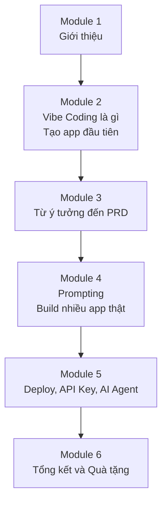
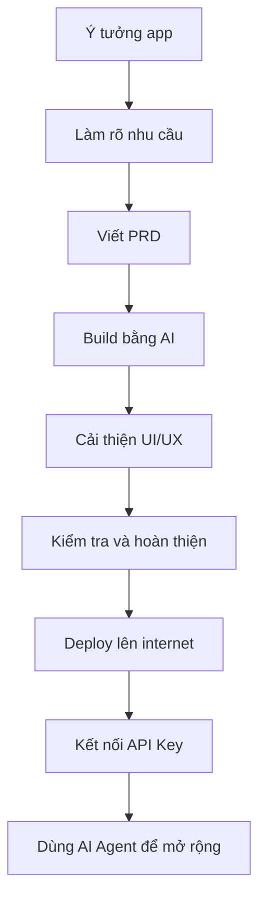

# Bài 19: Tổng Kết Và Quà Tặng

## Mục Tiêu Bài Học

Sau bài này, bạn sẽ:

* Nhìn lại toàn bộ hành trình kiến thức đã học qua **6 module** của khóa học.
* Có một **quy trình hoàn chỉnh, lặp lại được** để tự tạo ra bất kỳ ứng dụng nào mình cần trong tương lai.
* Biết cách học tiếp và tiếp tục thực hành sau khi kết thúc khóa học.

---

## 1. Tổng Kết Hành Trình Khóa Học

Trong khóa học này, bạn đã đi từ bước làm quen với Vibe Coding đến việc tự tạo, hoàn thiện và đưa ứng dụng lên internet.



Bạn đã từng bước học cách:

* Hiểu **Vibe Coding** là gì.
* Biến ý tưởng thành yêu cầu rõ ràng.
* Viết **PRD** để AI hiểu đúng sản phẩm cần build.
* Dùng công cụ AI để tạo app thật.
* Thiết kế giao diện chuyên nghiệp hơn.
* Deploy app lên internet.
* Kết nối API Key để app dùng AI thật.
* Dùng AI Agent để hỗ trợ sửa code, mở rộng và bảo trì dự án.

Một số ứng dụng bạn đã thực hành trong khóa học:

* App to-do list.
* App học tiếng Anh.
* Công cụ tối ưu ảnh sản phẩm.
* Công cụ tạo thumbnail YouTube.
* App soạn văn bản.
* App kết nối AI API thật.

---

## 2. Quy Trình Vibe Coding Hoàn Chỉnh

Đây là quy trình tổng hợp bạn có thể áp dụng cho **bất kỳ ý tưởng app nào** trong tương lai.

| Bước | Việc cần làm                                                                      | Bài học liên quan |
| ---- | --------------------------------------------------------------------------------- | ----------------- |
| 1    | Làm rõ ý tưởng: ai dùng, giải quyết vấn đề gì, cần chức năng gì, giao diện ra sao | Bài 6             |
| 2    | Viết PRD hoặc dùng chatbot PRD cá nhân để tạo PRD                                 | Bài 7-9           |
| 3    | Build app bằng công cụ AI phù hợp như Google AI Studio                            | Bài 10-13         |
| 4    | Nâng cấp giao diện chuyên nghiệp bằng Google Stitch                               | Bài 14            |
| 5    | Hoàn thiện, kiểm tra lỗi và tối ưu trải nghiệm                                    | Bài 12, 15        |
| 6    | Deploy app lên internet bằng Vercel                                               | Bài 16            |
| 7    | Kết nối API Key để app có khả năng sinh nội dung thông minh                       | Bài 17            |
| 8    | Dùng AI Agent như Antigravity để mở rộng và bảo trì dự án                         | Bài 18            |

Sơ đồ quy trình:



---

## 3. Ba Bài Học Quan Trọng Nhất

### 1. Prompt càng rõ, kết quả càng đúng

AI không đọc được suy nghĩ của bạn. Muốn AI tạo ra sản phẩm đúng ý, bạn cần mô tả rõ:

* App dành cho ai?
* Người dùng cần làm gì?
* Giao diện gồm những phần nào?
* Dữ liệu đầu vào là gì?
* Kết quả đầu ra cần như thế nào?
* Tiêu chí hoàn thành là gì?

Prompt mơ hồ thường tạo ra sản phẩm mơ hồ. Prompt rõ ràng giúp giảm lỗi ngay từ đầu.

---

### 2. Chia nhỏ yêu cầu phức tạp

Không nên yêu cầu AI làm tất cả mọi thứ trong một lần.

Thay vào đó, hãy chia dự án thành các bước nhỏ:

```text
Ý tưởng lớn
→ PRD
→ Giao diện
→ Chức năng chính
→ Xử lý lỗi
→ Tối ưu UI
→ Deploy
→ Kết nối API
```

Cách làm này giúp bạn dễ kiểm soát tiến độ, dễ phát hiện lỗi và dễ yêu cầu AI sửa đúng phần cần sửa.

---

### 3. Luôn kiểm tra kết quả thực tế

Một kỹ năng rất quan trọng khi làm việc với AI là **verify**.

Không nên chỉ tin vào câu trả lời kiểu:

> "Tôi đã sửa xong."

Bạn cần tự kiểm tra:

* App có chạy thật không?
* Nút bấm có hoạt động không?
* Dữ liệu nhập vào có được xử lý đúng không?
* Giao diện có bị lỗi trên màn hình nhỏ không?
* Link deploy có truy cập được không?
* API Key có bị lộ ra frontend không?

AI giúp bạn làm nhanh hơn, nhưng bạn vẫn là người chịu trách nhiệm kiểm tra sản phẩm cuối cùng.

---

## 4. Bạn Có Thể Làm Gì Tiếp Theo?

Sau khi hoàn thành khóa học, bạn nên tiếp tục thực hành bằng các dự án thật, nhỏ nhưng có ích.

Một số hướng đi tiếp theo:

* Chọn một vấn đề trong công việc hằng ngày và tạo app giải quyết nó.
* Build thêm nhiều app nhỏ để rèn kỹ năng viết PRD và prompt.
* Thử nghiệm thêm các công cụ AI Agent nâng cao.
* Chia sẻ app đã deploy cho bạn bè, đồng nghiệp để lấy phản hồi.
* Cải thiện sản phẩm dựa trên phản hồi thực tế.
* Tạo portfolio cá nhân gồm các app bạn đã build bằng Vibe Coding.

---

## 5. Checklist Sau Khi Hoàn Thành Khóa Học

Bạn có thể dùng checklist này để tự đánh giá mình đã sẵn sàng áp dụng Vibe Coding vào thực tế chưa.

| Câu hỏi kiểm tra                                     | Đã làm được? |
| ---------------------------------------------------- | ------------ |
| Tôi có thể giải thích Vibe Coding là gì không?       | ☐            |
| Tôi có biết cách làm rõ một ý tưởng app không?       | ☐            |
| Tôi có thể viết PRD cơ bản cho một app không?        | ☐            |
| Tôi biết cách dùng AI để build app từ prompt không?  | ☐            |
| Tôi biết cách kiểm tra và sửa lỗi app không?         | ☐            |
| Tôi biết cách deploy app lên internet không?         | ☐            |
| Tôi hiểu API Key là gì và cách bảo mật cơ bản không? | ☐            |
| Tôi biết khi nào nên dùng AI Agent không?            | ☐            |

---

## Điều Cần Ghi Nhớ

* Bạn đã có một **quy trình 8 bước hoàn chỉnh** để biến ý tưởng thành ứng dụng thật.
* Kỹ năng cốt lõi không phải là thuộc lòng code, mà là biết **mô tả rõ ràng, chia nhỏ vấn đề, kiểm tra và tinh chỉnh**.
* Vibe Coding không thay thế tư duy sản phẩm. Nó giúp bạn biến tư duy đó thành sản phẩm nhanh hơn.
* Việc học không dừng lại ở đây. Cách tiến bộ tốt nhất là tiếp tục build các dự án thật của chính bạn.

---

## Tóm Tắt Bài Học

Trong bài này, bạn đã nhìn lại toàn bộ hành trình của khóa học: từ lúc mới làm quen với Vibe Coding, học cách viết PRD, build app bằng AI, cải thiện giao diện, deploy sản phẩm, kết nối API Key và sử dụng AI Agent.

Điều quan trọng nhất bạn mang theo sau khóa học không chỉ là một vài công cụ cụ thể, mà là một **quy trình làm sản phẩm có thể lặp lại**. Từ đây, bất cứ khi nào có một ý tưởng mới, bạn đều có thể bắt đầu bằng cách làm rõ yêu cầu, viết PRD, dùng AI để build, kiểm tra, deploy và tiếp tục cải thiện.

Bài 20 sẽ cung cấp các file quà tặng và tài nguyên bổ sung để bạn tiếp tục hành trình Vibe Coding sau khóa học.
