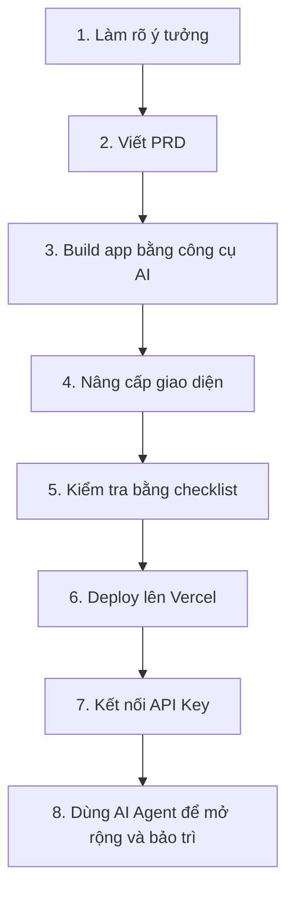

# Bài 20: Quà Tặng

## Mục Tiêu Bài Học

Bài học cuối cùng này cung cấp cho bạn các **tài nguyên bổ sung** để tiếp tục thực hành sau khi kết thúc khóa học.

Sau bài này, bạn sẽ có:

* Bộ mẫu PRD có thể dùng ngay cho mọi ý tưởng app.
* Prompt cố định để tạo chatbot PRD cá nhân.
* Checklist kiểm tra trước khi deploy sản phẩm.
* Bảng tổng hợp các công cụ đã học trong khóa.
* Quy trình 8 bước có thể áp dụng cho mọi dự án Vibe Coding sau này.

---

## 1. Bộ Mẫu PRD Có Thể Dùng Ngay

Bạn có thể copy mẫu dưới đây mỗi khi muốn bắt đầu một dự án mới.

```text
# PRD: [Tên sản phẩm]

## 1. Tổng quan
[Mô tả ngắn gọn sản phẩm trong 1-2 câu]

## 2. Đối tượng người dùng
[Ai sẽ dùng sản phẩm này]

## 3. Vấn đề cần giải quyết
[Vì sao sản phẩm này cần tồn tại]

## 4. Danh sách chức năng
- [Chức năng 1 - mô tả cụ thể] (phải có)
- [Chức năng 2 - mô tả cụ thể] (nên có)
- [Chức năng 3 - mô tả cụ thể] (có thì tốt)

## 5. Yêu cầu giao diện
- Bố cục: [mô tả các khu vực chính trên màn hình]
- Phong cách: [ví dụ: tối giản, hiện đại, màu sắc chủ đạo]
- Các màn hình: [liệt kê từng màn hình/trang]

## 6. Tiêu chí hoàn thành
- [Điều kiện 1 để coi là hoàn thành]
- [Điều kiện 2 để coi là hoàn thành]
```

---

## 2. Bộ Hướng Dẫn Cố Định Cho Chatbot PRD Cá Nhân

Bạn có thể dùng prompt này để tạo một chatbot chuyên viết PRD cho các dự án Vibe Coding.

```text
Bạn là một Product Manager chuyên tạo PRD (Product Requirements Document)
cho các ứng dụng Vibe Coding của người dùng.

Khi người dùng đưa ra một ý tưởng app, hãy làm theo các bước sau:

1. Đặt tối đa 5 câu hỏi, mỗi lần một câu, để làm rõ:
   - Đối tượng người dùng
   - Vấn đề cần giải quyết
   - Các chức năng chính (phân biệt: phải có / nên có / có thì tốt)
   - Phong cách giao diện mong muốn
   - Nền tảng chạy app (web/mobile/desktop)

2. Sau khi có đủ thông tin, tổng hợp thành PRD theo đúng cấu trúc chuẩn.
3. Luôn viết bằng tiếng Việt, ngắn gọn, rõ ràng, không dùng thuật ngữ kỹ thuật phức tạp.
4. Sau khi đưa ra PRD, hỏi người dùng: "Bạn có muốn điều chỉnh phần nào không?"
```

---

## 3. Checklist "Sẵn Sàng Vận Hành" Trước Khi Deploy

Trước khi đưa app lên internet, hãy kiểm tra nhanh các hạng mục sau:

| Hạng mục kiểm tra                                                       | Đạt / Chưa đạt |
| ----------------------------------------------------------------------- | -------------- |
| Toàn bộ chức năng cốt lõi hoạt động đúng, không lỗi                     |                |
| Có xử lý thông báo lỗi rõ ràng cho các tình huống sai định dạng dữ liệu |                |
| Có trạng thái loading khi xử lý các tác vụ mất thời gian                |                |
| Giao diện hiển thị tốt trên cả điện thoại và máy tính                   |                |
| Không có API Key hoặc thông tin nhạy cảm nào lộ ra trong code công khai |                |
| Đã thử nghiệm bởi ít nhất một người dùng khác ngoài bản thân            |                |

---

## 4. Bảng Tổng Hợp Công Cụ Đã Học Trong Khóa Học

| Công cụ          | Vai trò chính                          | Dùng ở bài học |
| ---------------- | -------------------------------------- | -------------- |
| ChatGPT / Claude | Trò chuyện, lên ý tưởng, viết PRD      | Bài 8-9        |
| Google AI Studio | Build ứng dụng thật từ prompt          | Bài 10-13      |
| Google Stitch    | Thiết kế giao diện UI/UX chuyên nghiệp | Bài 14         |
| GitHub           | Lưu trữ code để chuẩn bị deploy        | Bài 16         |
| Vercel           | Deploy ứng dụng lên internet miễn phí  | Bài 16         |
| API Key          | Kết nối AI thật vào ứng dụng           | Bài 17         |
| Antigravity      | AI Agent hỗ trợ code và tự động hóa    | Bài 18         |

---

## 5. Quy Trình 8 Bước Áp Dụng Cho Mọi Dự Án Tương Lai



Quy trình này là khung làm việc bạn có thể lặp lại cho nhiều loại sản phẩm khác nhau:

| Bước | Việc cần làm       | Kết quả đầu ra                               |
| ---- | ------------------ | -------------------------------------------- |
| 1    | Làm rõ ý tưởng     | Biết app dành cho ai và giải quyết vấn đề gì |
| 2    | Viết PRD           | Có bản mô tả sản phẩm rõ ràng                |
| 3    | Build app bằng AI  | Có phiên bản app chạy được                   |
| 4    | Nâng cấp giao diện | App đẹp hơn, dễ dùng hơn                     |
| 5    | Kiểm tra checklist | App ổn định hơn trước khi ra mắt             |
| 6    | Deploy lên Vercel  | Có link để chia sẻ                           |
| 7    | Kết nối API Key    | App có khả năng dùng AI thật                 |
| 8    | Dùng AI Agent      | Mở rộng, sửa lỗi và bảo trì nhanh hơn        |

---

## 6. Lời Kết

Cảm ơn bạn đã đồng hành cùng khóa học **"Vibe Coding Cơ Bản Cho Người Mới Bắt Đầu"**.

Từ con số 0, bạn đã có trong tay một quy trình hoàn chỉnh và bộ tài nguyên có thể tái sử dụng để tự tạo ra các ứng dụng phục vụ công việc, học tập và cuộc sống.

Điều quan trọng nhất bây giờ là: **tiếp tục thực hành**.

Mỗi dự án mới sẽ giúp bạn:

* Mô tả ý tưởng rõ hơn.
* Viết prompt tốt hơn.
* Làm việc với AI hiệu quả hơn.
* Tự tin hơn khi biến ý tưởng thành sản phẩm thật.

Chúc bạn thành công trên hành trình Vibe Coding của riêng mình!
