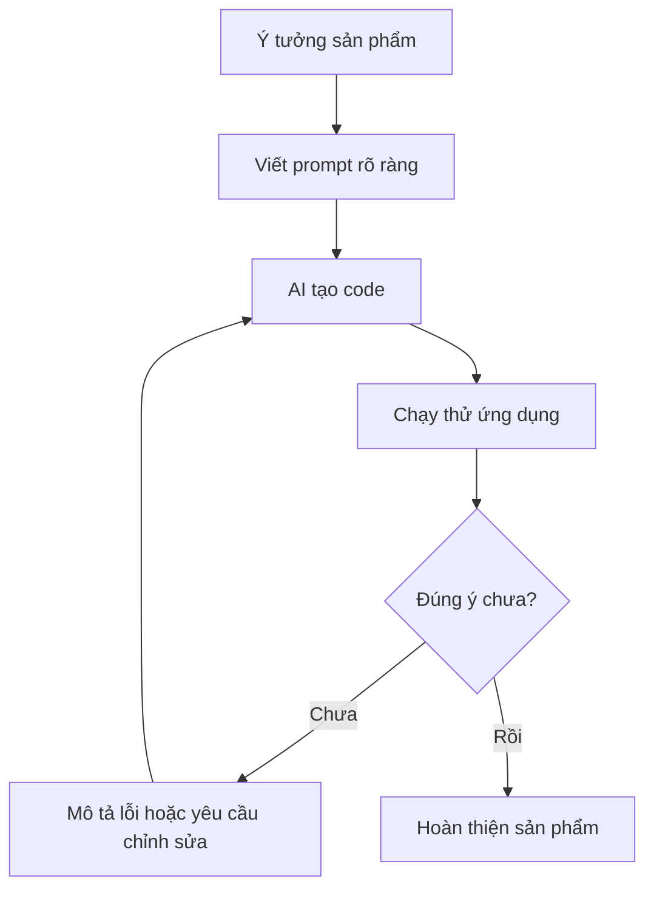
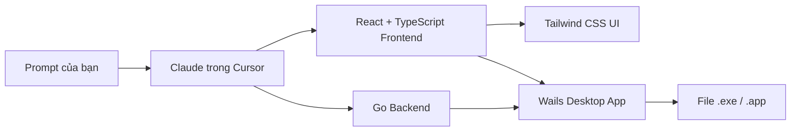
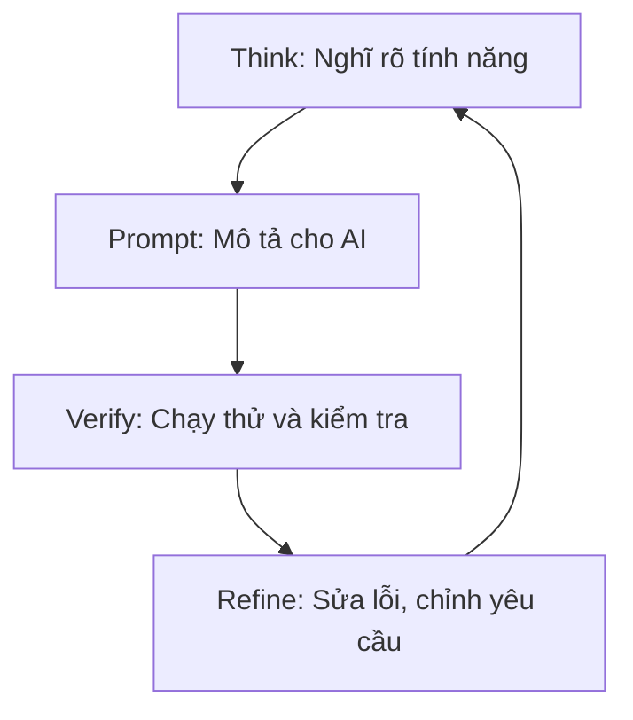
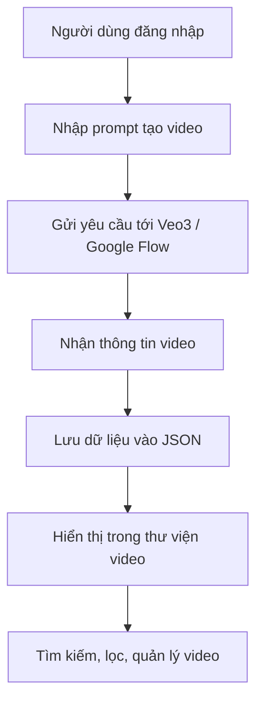

# Chương 01: Cách Mạng Vibe Coding

## Mục Tiêu Chương

Sau chương này, bạn sẽ hiểu:

* **Vibe Coding** là gì và vì sao nó thay đổi cách tạo phần mềm.
* Vì sao **prompt** là kỹ năng quan trọng nhất khi làm việc với AI.
* Bộ công nghệ sẽ dùng trong khóa học và lý do chọn chúng.
* Dự án xuyên suốt khóa học: **Veo3 Manager Video**.

---

## 1. Vibe Coding Là Gì?

Trước đây, để tạo phần mềm, bạn thường phải học lập trình trong thời gian dài, tự viết hàng ngàn dòng code, hiểu cú pháp, framework, database, debug và triển khai sản phẩm.

Quy tắc **10.000 giờ luyện tập**, được Malcolm Gladwell phổ biến trong cuốn *Outliers*, thường được dùng để nói rằng muốn đạt trình độ chuyên gia trong một lĩnh vực, bạn cần rất nhiều thời gian rèn luyện.

Nhưng hiện nay, AI đã làm thay đổi cách tạo phần mềm.

**Vibe Coding** là cách bạn mô tả điều mình muốn bằng ngôn ngữ tự nhiên, sau đó để AI viết code, sửa lỗi và hỗ trợ xây dựng sản phẩm.

```text
Vibe Coding = Nghĩ ý tưởng + mô tả rõ ràng + để AI viết code + kiểm tra + tinh chỉnh.
```

Thay vì phải tự viết từng dòng code, bạn có thể nói:

> “Tôi muốn tạo một app desktop quản lý video AI, có đăng nhập, danh sách video, tìm kiếm, lọc trạng thái và lưu dữ liệu bằng file JSON.”

AI sẽ dựa trên mô tả đó để tạo cấu trúc dự án, viết backend, frontend, giao diện và logic xử lý.

---

## 2. Vì Sao Đây Là Một Cuộc Cách Mạng?

Vibe Coding làm giảm mạnh rào cản tạo phần mềm.

Trước đây:

| Trước Khi Có AI                    | Với Vibe Coding                             |
| ---------------------------------- | ------------------------------------------- |
| Phải học cú pháp lập trình lâu dài | Có thể mô tả bằng ngôn ngữ tự nhiên         |
| Phải tự viết từng dòng code        | AI viết phần lớn code                       |
| Debug bằng kinh nghiệm cá nhân     | Copy lỗi gửi lại cho AI để sửa              |
| Làm app cần nhiều kỹ năng kỹ thuật | Người mới vẫn có thể tạo prototype          |
| Tốc độ phụ thuộc vào khả năng code | Tốc độ phụ thuộc vào khả năng mô tả yêu cầu |



Điểm quan trọng là: AI có thể viết code rất nhanh, nhưng **bạn vẫn là người quyết định sản phẩm cần làm gì**.

---

## 3. Prompt Quyết Định Mọi Thứ

Trong Vibe Coding, kỹ năng quan trọng nhất không phải là gõ code, mà là **viết prompt**.

AI giống như một đội kỹ thuật rất giỏi, nhưng chưa hiểu hết ý bạn. Nếu bạn mô tả mơ hồ, AI sẽ tự suy diễn. Nếu bạn mô tả rõ ràng, AI sẽ làm gần đúng hơn ngay từ đầu.

Ví dụ prompt yếu:

```text
Làm cho tôi một app quản lý video.
```

Prompt tốt hơn:

```text
Hãy đóng vai Senior Full-stack Developer có 10 năm kinh nghiệm.

Tôi muốn xây một ứng dụng desktop tên Veo3 Manager.
Ứng dụng dùng để quản lý video AI được tạo từ Veo3.

Yêu cầu:
- Có màn đăng ký và đăng nhập.
- Mỗi user chỉ thấy video của mình.
- Có danh sách video gồm title, prompt, status, createdAt.
- Có tìm kiếm theo tên video.
- Có lọc theo trạng thái: pending, processing, completed, failed.
- Dữ liệu lưu bằng file JSON trên máy.
- Giao diện dùng React + Tailwind, đơn giản, hiện đại, dễ dùng.
```

Nguyên tắc vàng:

> Hãy cho AI một vai trò rõ ràng, bối cảnh rõ ràng, yêu cầu rõ ràng và tiêu chí hoàn thành rõ ràng.

---

## 4. Bộ Công Nghệ Sẽ Dùng

Khóa học sẽ dùng các công nghệ phù hợp với Vibe Coding: dễ kiểm tra lỗi, phổ biến, nhiều tài liệu, AI viết tốt.

| Công nghệ              | Vai trò                   | Lý do chọn                                                |
| ---------------------- | ------------------------- | --------------------------------------------------------- |
| **Go / Golang**        | Backend xử lý logic chính | Báo lỗi rõ trước khi chạy, dễ gửi lỗi cho AI sửa          |
| **Wails**              | Đóng gói app desktop      | Biến app thành file `.exe` hoặc `.app` để người khác dùng |
| **React + TypeScript** | Xây giao diện frontend    | Phổ biến, AI viết tốt, dễ chia component                  |
| **Tailwind CSS**       | Thiết kế giao diện        | Viết UI nhanh, rõ ràng, ít phải tạo CSS thủ công          |
| **Claude Opus 4.6**    | AI viết code              | Model mạnh để đọc prompt, tạo code, sửa lỗi               |
| **Cursor IDE**         | Môi trường code có AI     | Giúp AI đọc, sửa và quản lý code trong dự án              |



Bạn không cần học thuộc toàn bộ công nghệ ngay từ đầu. Mục tiêu của khóa học là **tạo sản phẩm thật**, không phải học lý thuyết khô cứng.

---

## 5. Quy Trình Làm Việc Trong Vibe Coding

Vibe Coding không phải chỉ viết một prompt rồi chờ phép màu xảy ra. Nó là một vòng lặp gồm 4 bước.

| Bước | Tên bước   | Việc cần làm                                                    |
| ---- | ---------- | --------------------------------------------------------------- |
| 1    | **Think**  | Nghĩ rõ tính năng cần làm, dữ liệu đầu vào và kết quả mong muốn |
| 2    | **Prompt** | Viết yêu cầu rõ ràng cho AI                                     |
| 3    | **Verify** | Chạy thử, kiểm tra app có đúng ý không                          |
| 4    | **Refine** | Nếu sai hoặc lỗi, mô tả lại để AI sửa                           |



Mỗi vòng lặp giúp app tốt hơn một chút. Đây chính là cách làm việc thực tế khi xây sản phẩm bằng AI.

---

## 6. Dự Án Xuyên Suốt: Veo3 Manager Video

Trong toàn bộ khóa học, chúng ta sẽ xây một dự án duy nhất từ đầu đến cuối: **Veo3 Manager**.

**Veo3** là công cụ tạo video bằng AI của Google. Người dùng nhập mô tả, ví dụ:

```text
Cảnh hoàng hôn trên biển, sóng vỗ nhẹ, ánh sáng điện ảnh, âm thanh tự nhiên.
```

Sau đó Veo3 tạo ra video hoàn chỉnh.

**Veo3 Manager** là ứng dụng desktop giúp người dùng quản lý quá trình tạo và lưu trữ video AI.

Các chức năng chính:

* **Tạo video bằng AI**: nhập prompt và gửi yêu cầu tạo video.
* **Quản lý thư viện video**: xem danh sách video đã tạo.
* **Tìm kiếm và lọc**: tìm theo tên, lọc theo trạng thái.
* **Đăng ký / đăng nhập**: mỗi người dùng có tài khoản riêng.
* **Lưu dữ liệu local**: dùng file JSON trên máy, không cần server ngoài.
* **Đóng gói app**: build thành file `.exe` để chia sẻ.



---

## 7. Điều Cần Ghi Nhớ

* Vibe Coding là cách tạo phần mềm bằng cách mô tả ý tưởng cho AI.
* Prompt càng rõ, sản phẩm AI tạo ra càng đúng ý.
* Bạn không cần giỏi code ngay từ đầu, nhưng cần biết kiểm tra kết quả.
* AI là người viết code chính, còn bạn là người định hướng sản phẩm.
* Khóa học dùng Go, Wails, React, TypeScript, Tailwind, Claude và Cursor.
* Dự án xuyên suốt là **Veo3 Manager Video**, một app desktop quản lý video AI.

---

## Tóm Tắt Chương

Vibe Coding mở ra một cách làm phần mềm mới: thay vì bắt đầu bằng cú pháp lập trình, bạn bắt đầu bằng ý tưởng và ngôn ngữ tự nhiên.

Tuy nhiên, Vibe Coding không có nghĩa là bỏ qua tư duy. Bạn vẫn cần biết mình muốn gì, mô tả rõ ràng, kiểm tra kết quả và tinh chỉnh liên tục.

Trong các chương tiếp theo, bạn sẽ học cách chuẩn bị môi trường, chọn model AI, viết prompt hiệu quả, xây giao diện, xử lý lỗi, tối ưu app và cuối cùng đóng gói **Veo3 Manager** thành một sản phẩm desktop hoàn chỉnh.
