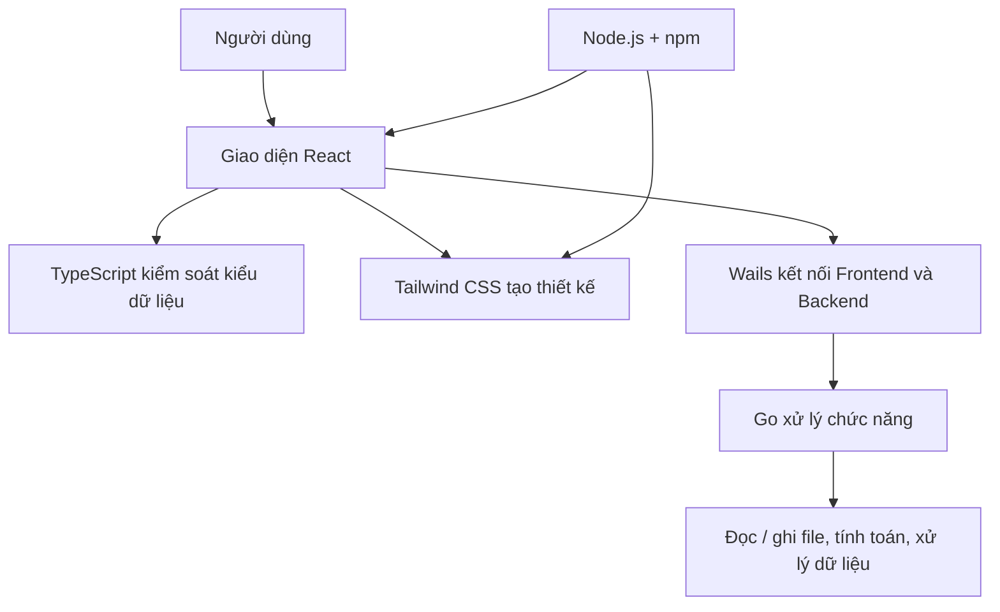
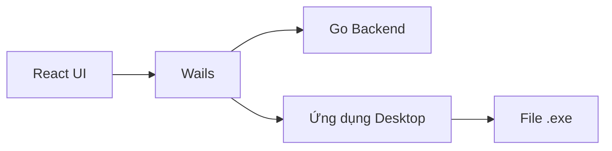
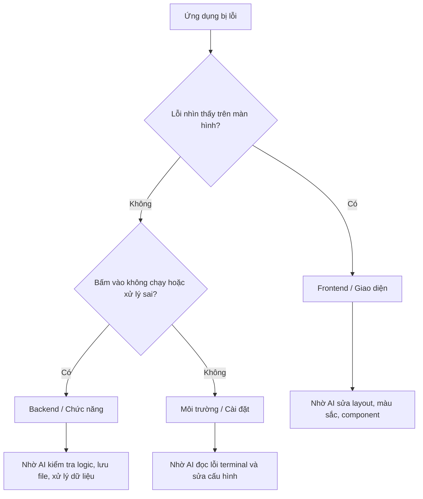

# 02 - Giới Thiệu Môi Trường

## Thông Tin Bài Học

| Mục | Chi Tiết |
|---|---|
| Bài | 02 |
| Chương | Chương 2 - Giới Thiệu Môi Trường |
| Chủ đề chính | Các công cụ và môi trường dùng trong Vibe Coding |
| Mục tiêu | Hiểu bức tranh tổng thể trước khi cài đặt ở Chương 3 |

---

## Mục Tiêu Chương Này

Sau bài học này, bạn sẽ:

- Hiểu **môi trường phát triển** là gì và vì sao cần cài đặt.
- Nắm được vai trò của các công cụ chính: **Go, Node.js, npm, React, TypeScript, Tailwind CSS, Wails**.
- Biết phân biệt lỗi thuộc **giao diện** hay **chức năng** để nhờ AI sửa đúng chỗ.
- Hiểu các nhóm công cụ Vibe Coding: **IDE có AI**, **Plugin AI**, và **CLI Agent**.
- Biết công cụ nào sẽ được dùng xuyên suốt khóa học.

---

## Tổng Quan Bài Học

Trước khi cài đặt bất cứ thứ gì, bạn cần hiểu **bức tranh tổng thể**.

AI có thể giúp bạn viết code, sửa lỗi, tạo giao diện, xây tính năng và giải thích vấn đề. Nhưng AI **không thể tự cài phần mềm vào máy tính của bạn**.

Để chạy được ứng dụng do AI tạo ra, máy tính của bạn cần có sẵn một số công cụ nền tảng. Các công cụ này tạo thành thứ gọi là **môi trường phát triển**.

---

## 1. Môi Trường Phát Triển Là Gì?

**Môi trường phát triển** là tập hợp các phần mềm bạn cài vào máy tính để có thể:

- Viết code.
- Chạy thử ứng dụng.
- Tải thư viện có sẵn.
- Kiểm tra lỗi.
- Đóng gói ứng dụng thành sản phẩm hoàn chỉnh.

Nói đơn giản:

> Môi trường phát triển giúp máy tính hiểu và chạy được những đoạn code mà AI viết ra.

---

## Tư Duy Vibe Coding

Trong Vibe Coding, bạn **không cần hiểu quá sâu** cách từng công cụ hoạt động bên trong.

Điều quan trọng là bạn biết:

- Công cụ đó dùng để làm gì.
- Khi lỗi xảy ra thì lỗi thuộc phần nào.
- Cần copy thông báo lỗi nào để đưa lại cho AI.
- Cần yêu cầu AI sửa giao diện, backend, hay cấu hình môi trường.

Bạn không cần tự sửa mọi thứ bằng tay. Bạn cần biết cách **ra lệnh đúng** để AI sửa giúp bạn.

---

## 2. Ba Nhóm Công Cụ Vibe Coding

```mermaid
flowchart TD
    A["Công cụ Vibe Coding"] --> B["IDE có AI tích hợp"]
    A --> C["Plugin / Extension AI"]
    A --> D["CLI - Công cụ dòng lệnh"]

    B --> B1["Cursor"]
    B --> B2["Antigravity"]
    B --> B3["Windsurf"]

    C --> C1["GitHub Copilot"]
    C --> C2["Continue"]
    C --> C3["Cody"]

    D --> D1["Claude Code"]
    D --> D2["Codex CLI"]
    D --> D3["Gemini CLI"]
````

---

## 2.1. IDE Có AI Tích Hợp

Đây là các phần mềm soạn thảo code đầy đủ, có AI được tích hợp trực tiếp bên trong.

Ví dụ:

* **Cursor**
* **Antigravity**
* **Windsurf**

Các IDE này thường có:

* Khu vực xem file dự án.
* Trình soạn thảo code.
* Cửa sổ chat với AI.
* Khả năng yêu cầu AI sửa nhiều file.
* Tính năng xem trước ứng dụng.

Phù hợp với:

* Người mới bắt đầu.
* Người muốn nhìn thấy toàn bộ dự án.
* Người muốn vừa chat với AI, vừa xem code, vừa chạy thử ứng dụng.

---

## 2.2. Plugin / Extension AI

Đây là các tiện ích mở rộng cài thêm vào editor có sẵn, phổ biến nhất là VS Code.

Ví dụ:

* **GitHub Copilot**
* **Continue**
* **Cody**
* **Amazon Q**

Phù hợp với:

* Người đã quen dùng VS Code.
* Người chỉ muốn thêm AI vào editor hiện tại.
* Người vẫn muốn tự kiểm soát nhiều thao tác hơn.

---

## 2.3. CLI - Công Cụ Dòng Lệnh

CLI là các công cụ AI chạy trực tiếp trong terminal.

Ví dụ:

* **Claude Code**
* **Codex CLI**
* **Gemini CLI**

Các công cụ này có thể:

* Đọc toàn bộ thư mục dự án.
* Tự tìm file cần sửa.
* Chạy lệnh kiểm tra.
* Sửa nhiều file cùng lúc.
* Hỗ trợ tự động hóa workflow mạnh hơn.

Phù hợp với:

* Người đã quen terminal.
* Người muốn làm việc nhanh.
* Người muốn dùng AI như một agent lập trình chuyên nghiệp.

---

## So Sánh Nhanh Các Nhóm Công Cụ

| Tiêu Chí             | IDE Có AI                     | Plugin AI                      | CLI Agent                          |
| -------------------- | ----------------------------- | ------------------------------ | ---------------------------------- |
| Ví dụ                | Cursor, Antigravity, Windsurf | GitHub Copilot, Continue, Cody | Claude Code, Codex CLI, Gemini CLI |
| Độ trực quan         | Rất cao                       | Cao                            | Thấp hơn                           |
| Phù hợp người mới    | Rất phù hợp                   | Phù hợp                        | Cần làm quen terminal              |
| Làm việc nhiều file  | Tốt                           | Trung bình                     | Rất mạnh                           |
| Tự động hóa workflow | Tốt                           | Hạn chế hơn                    | Rất mạnh                           |
| Cách sử dụng         | Chat trong editor             | Gợi ý/sửa code trong editor    | Giao việc qua terminal             |

---

## 3. AI Trợ Lý Và AI Tự Hành

Một khái niệm quan trọng trong Vibe Coding là mức độ bạn cho phép AI chủ động.

```mermaid
flowchart LR
    A["AI là Trợ Lý"] --> A1["Bạn giao việc nhỏ"]
    A1 --> A2["Bạn kiểm soát từng bước"]

    B["AI là Tác Nhân Tự Hành"] --> B1["Bạn giao mục tiêu lớn"]
    B1 --> B2["AI tự lập kế hoạch và thực thi"]
```

### AI Là Trợ Lý

Bạn yêu cầu AI làm từng việc nhỏ.

Ví dụ:

* “Tạo nút đăng nhập.”
* “Đổi màu nền sang xanh.”
* “Giải thích lỗi này.”
* “Sửa hàm lưu file.”

Cách này an toàn, dễ kiểm soát và phù hợp với người mới.

### AI Là Tác Nhân Tự Hành

Bạn giao cho AI một mục tiêu lớn hơn.

Ví dụ:

* “Xây toàn bộ màn hình quản lý video.”
* “Thêm chức năng lưu dữ liệu vào file.”
* “Kiểm tra toàn bộ app và sửa lỗi build.”

AI sẽ tự đọc dự án, lập kế hoạch, sửa file và chạy kiểm tra.

Trong khóa học này, bạn sẽ bắt đầu với AI như **trợ lý**, sau đó dần chuyển sang cách làm việc với AI như **agent tự hành**.

---

## 4. Tech Stack Sẽ Dùng Trong Khóa Học

Trong khóa học này, chúng ta sẽ xây dựng ứng dụng bằng bộ công nghệ sau:

| Công Cụ      | Vai Trò Chính                                        |
| ------------ | ---------------------------------------------------- |
| Go           | Xử lý chức năng bên trong ứng dụng                   |
| Node.js      | Chạy các công cụ frontend                            |
| npm          | Tải thư viện có sẵn                                  |
| React        | Xây dựng giao diện người dùng                        |
| TypeScript   | Giúp code chặt chẽ và ít lỗi hơn                     |
| Tailwind CSS | Thiết kế giao diện nhanh bằng class                  |
| Wails        | Ghép frontend React với backend Go thành app desktop |

Sơ đồ tổng thể:



---

## 4.1. Go - Xử Lý Chức Năng

**Go**, còn gọi là **Golang**, sẽ xử lý phần chức năng bên trong ứng dụng.

Go dùng để:

* Tính toán dữ liệu.
* Đọc file.
* Lưu file.
* Xử lý logic chính.
* Làm phần backend cho ứng dụng desktop.

Ví dụ trong dự án **Veo3 Manager**, Go có thể dùng để:

* Lưu danh sách prompt.
* Đọc dữ liệu từ ổ cứng.
* Quản lý file video.
* Xử lý dữ liệu trước khi hiển thị lên giao diện.

### Vì Sao Go Phù Hợp Với Vibe Coding?

Go thường báo lỗi rất rõ ràng.

Khi có lỗi, bạn chỉ cần copy thông báo lỗi và gửi lại cho AI:

```text
Ứng dụng đang báo lỗi Go như sau. Hãy đọc lỗi, tìm nguyên nhân và sửa giúp tôi.
```

AI có thể dựa vào lỗi đó để tìm đúng file và sửa lại code.

---

## 4.2. Node.js Và npm - Hỗ Trợ Frontend

### Node.js Là Gì?

**Node.js** là nền tảng giúp máy tính chạy được các công cụ phục vụ frontend.

Trong khóa học này, Node.js không phải thứ bạn dùng trực tiếp quá nhiều, nhưng nó rất quan trọng vì React, TypeScript và Tailwind cần Node.js để chạy.

### npm Là Gì?

**npm** là kho thư viện đi kèm với Node.js.

npm giúp bạn tải về các đoạn code có sẵn, ví dụ:

* Bộ icon.
* Bộ giao diện.
* Công cụ tạo lịch.
* Công cụ tạo biểu đồ.
* Thư viện xử lý form.

Ví dụ:

```text
Cài thêm thư viện icon cho app.
```

AI có thể dùng npm để cài thư viện phù hợp.

---

## 4.3. React - Xây Dựng Giao Diện

**React** dùng để tạo giao diện người dùng.

React phụ trách những thứ bạn nhìn thấy và tương tác được:

* Màn hình.
* Nút bấm.
* Ô nhập chữ.
* Danh sách.
* Thanh tìm kiếm.
* Modal.
* Bảng dữ liệu.

Ví dụ yêu cầu AI:

```text
Tạo cho tôi màn hình quản lý prompt gồm ô tìm kiếm, danh sách prompt và nút thêm mới.
```

AI sẽ dùng React để tạo giao diện đó.

---

## 4.4. TypeScript - Giúp Code Ít Lỗi Hơn

**TypeScript** là phiên bản chặt chẽ hơn của JavaScript.

Nó giúp quy định rõ dữ liệu trong ứng dụng.

Ví dụ:

* Tên prompt phải là chữ.
* Số lượng video phải là số.
* Ngày tạo phải là kiểu ngày tháng.
* Trạng thái chỉ được là một số giá trị nhất định.

TypeScript giúp AI viết code cẩn thận hơn, giảm lỗi vặt và dễ phát hiện sai sót trước khi chạy app.

---

## 4.5. Tailwind CSS - Định Dạng Thiết Kế

**Tailwind CSS** dùng để chỉnh giao diện nhanh bằng các class có sẵn.

Tailwind giúp chỉnh:

* Màu sắc.
* Khoảng cách.
* Kích thước.
* Bo góc.
* Căn giữa.
* Bố cục.
* Responsive trên nhiều màn hình.

Ví dụ bạn có thể nói với AI:

```text
Làm nút này màu đỏ, chữ màu trắng, bo góc lớn hơn và nằm ở giữa màn hình.
```

AI sẽ chuyển yêu cầu đó thành code Tailwind.

---

## 4.6. Wails - Đóng Gói Ứng Dụng Desktop

**Wails** là công cụ ghép phần giao diện và phần xử lý chức năng lại với nhau.

Trong dự án:

* **React** tạo giao diện.
* **Go** xử lý chức năng.
* **Wails** kết nối hai phần đó.

Kết quả cuối cùng là một ứng dụng desktop hoàn chỉnh.



Với Wails, bạn có thể xuất ra một file `.exe`. Người khác chỉ cần nhấp đúp để mở ứng dụng mà không cần cài thêm nhiều thứ phức tạp.

---

## 5. Cách Phân Loại Lỗi Để Nhờ AI Sửa Đúng Chỗ

Khi ứng dụng bị lỗi, bạn nên xác định lỗi thuộc phần nào.

Có 2 nhóm chính:

| Nhóm Lỗi             | Dấu Hiệu                                               | Cách Nói Với AI                             |
| -------------------- | ------------------------------------------------------ | ------------------------------------------- |
| Giao diện / Frontend | Nút lệch, chữ sai màu, layout xấu, màn hình bị vỡ      | “Sửa phần giao diện giúp tôi.”              |
| Chức năng / Backend  | Bấm nút không chạy, không lưu được file, tính toán sai | “Kiểm tra phần xử lý chức năng giúp tôi.”   |
| Môi trường / Cài đặt | Lệnh chạy lỗi, thiếu package, không build được         | “Kiểm tra lỗi môi trường/cài đặt giúp tôi.” |

Sơ đồ phân loại lỗi:



---

## 6. Công Thức Nhờ AI Sửa Lỗi

Khi gặp lỗi, bạn không cần mô tả quá phức tạp. Hãy dùng công thức sau:

```text
Tôi đang gặp lỗi khi chạy ứng dụng.

Hiện tượng:
[Mô tả điều bạn thấy]

Tôi đã thao tác:
[Mô tả bạn bấm gì / chạy lệnh gì]

Thông báo lỗi:
[Dán nguyên văn lỗi ở terminal hoặc màn hình]

Hãy tìm nguyên nhân và sửa giúp tôi.
```

Ví dụ:

```text
Tôi đang gặp lỗi khi bấm nút Lưu Prompt.

Hiện tượng:
Bấm nút nhưng dữ liệu không được lưu.

Tôi đã thao tác:
Nhập prompt mới rồi bấm nút Lưu.

Thông báo lỗi:
[dán lỗi ở đây]

Hãy kiểm tra phần backend Go và kết nối Wails giúp tôi.
```

---

## 7. Công Cụ Bạn Sẽ Dùng Hàng Ngày

Trong thực tế, bạn không cần mở quá nhiều công cụ.

Bạn chủ yếu sẽ dùng:

| Công Cụ                      | Dùng Để Làm Gì                                     |
| ---------------------------- | -------------------------------------------------- |
| Cursor / VS Code             | Xem code, chat với AI, chỉnh sửa dự án             |
| Terminal / CLI Agent         | Chạy lệnh, yêu cầu AI sửa nhiều file, kiểm tra lỗi |
| Trình duyệt hoặc app preview | Xem kết quả giao diện                              |
| Git                          | Lưu lịch sử thay đổi của dự án                     |

---

## 7.1. Cursor - Nơi Làm Việc Chính

**Cursor** là phần mềm làm việc chính trong khóa học.

Nó giống một trình soạn thảo code, nhưng có tích hợp AI.

Bạn có thể yêu cầu bằng tiếng Việt:

```text
Tạo cho tôi màn hình đăng nhập.
```

Hoặc:

```text
Sửa giao diện dashboard cho gọn hơn, chia thành sidebar bên trái và nội dung bên phải.
```

AI sẽ đọc dự án, tìm file cần sửa và đề xuất thay đổi. Việc của bạn là kiểm tra rồi bấm **Accept** nếu thay đổi hợp lý.

---

## 7.2. Terminal / CLI Agent - Nơi Chạy Lệnh Và Sửa Lỗi

Terminal dùng để:

* Chạy ứng dụng.
* Cài thư viện.
* Build app.
* Xem lỗi.
* Giao việc cho CLI agent.

Ví dụ:

```bash
npm install
```

```bash
wails dev
```

```bash
wails build
```

Khi terminal báo lỗi, bạn copy lỗi đó và đưa lại cho AI.

---

## 8. Bộ Công Cụ Sẽ Dùng Trong Khóa Học

Để thống nhất, khóa học sẽ sử dụng tổ hợp sau:

| Công Cụ                                | Vai Trò                                |
| -------------------------------------- | -------------------------------------- |
| Cursor / VS Code                       | Editor chính để xem và chỉnh sửa dự án |
| Claude Code hoặc CLI Agent tương đương | Agent AI chính hỗ trợ viết và sửa code |
| Node.js + npm                          | Cài thư viện và chạy frontend          |
| Go                                     | Xử lý logic backend                    |
| React + TypeScript                     | Xây dựng giao diện                     |
| Tailwind CSS                           | Thiết kế giao diện                     |
| Wails                                  | Đóng gói thành ứng dụng desktop        |
| Git                                    | Quản lý lịch sử thay đổi               |
| Trình duyệt / Preview                  | Xem thử giao diện                      |

---

## 9. Những Điều Cần Ghi Nhớ

* Môi trường phát triển là bộ công cụ giúp máy tính chạy được code do AI tạo ra.
* Vibe Coding không yêu cầu bạn hiểu sâu mọi công cụ ngay từ đầu.
* Bạn cần biết công cụ nào làm nhiệm vụ gì để nhờ AI sửa lỗi đúng chỗ.
* Có ba nhóm công cụ AI chính: IDE có AI, Plugin AI và CLI Agent.
* Khóa học sẽ dùng Cursor/VS Code, CLI Agent, Node.js, Go, React, TypeScript, Tailwind CSS và Wails.
* Lỗi giao diện thường thuộc frontend.
* Lỗi bấm không chạy, không lưu được, xử lý sai thường thuộc backend.
* Lỗi lệnh chạy không được thường thuộc môi trường hoặc cài đặt.

---

## Tóm Tắt

Trong bài học này, bạn đã hiểu bức tranh tổng thể về môi trường phát triển trong Vibe Coding.

Máy tính của bạn cần được cài một số công cụ nền tảng để có thể chạy ứng dụng do AI tạo ra. Mỗi công cụ có một vai trò riêng: Go xử lý chức năng, React tạo giao diện, TypeScript giảm lỗi, Tailwind CSS thiết kế giao diện, Node.js/npm hỗ trợ cài thư viện, và Wails đóng gói ứng dụng desktop.

Bạn cũng đã biết cách phân biệt các nhóm công cụ AI như Cursor, Copilot và CLI Agent. Ở chương tiếp theo, chúng ta sẽ bắt đầu cài đặt từng công cụ để chuẩn bị cho quá trình xây dựng ứng dụng thực tế.

---

# Bài luyện tập

## Mục tiêu


## Đề bài


## Yêu cầu hoàn thành

- [ ] 
- [ ] 
- [ ] 

## Kết quả / lời giải


## Ghi chú
