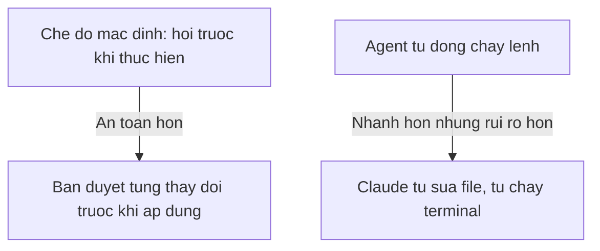

# Chương 03: Cài Đặt Môi Trường (Quan Trọng)

## Mục Tiêu Chương

Sau chương này, bạn sẽ:

* Biết cách cấu hình API key an toàn cho Claude và cho dịch vụ tạo video Veo3.
* Hiểu cách quản lý biến môi trường trong dự án **veo3-manager**.
* Biết cách giới hạn quyền hạn của Claude Code/Cursor Agent để tránh rủi ro khi mới bắt đầu.
* Tránh được những sai lầm phổ biến nhất khi vừa cài xong môi trường ở bài trước.

---

## 1. Vì Sao Bài Này Quan Trọng Nhất Chương 3

Phần lớn sự cố khi mới học vibe coding không đến từ việc AI viết sai code, mà đến từ:

* Để lộ **API key** của Claude hoặc Veo3.
* Cho phép Agent trong Cursor chạy lệnh nguy hiểm mà không kiểm soát.
* Không có Git nên không thể hoàn tác khi AI sửa sai.

> Kỹ năng quan trọng nhất của vibe coding không phải là prompt giỏi, mà là biết đặt giới hạn an toàn cho AI.

---

## 2. API Key: Chìa Khóa Cần Bảo Vệ

API key giống như chìa khóa nhà của tài khoản của bạn. Ai có key đó đều có thể dùng và tính phí vào tài khoản của bạn.

```text
Khong bao gio:
- Dan API key truc tiep vao code
- Commit API key len GitHub
- Chia se API key qua chat, email cong khai
```

### Lưu API Key Đúng Cách Bằng File `.env`

Trong dự án `veo3-manager`, mọi key nhạy cảm (Claude, Veo3/Google Flow) nằm trong file `.env` ở thư mục gốc:

```text
ANTHROPIC_API_KEY=sk-ant-xxxxxxxxxxxxxxxx
VEO3_API_KEY=xxxxxxxxxxxxxxxx
```

Thêm ngay `.env` vào file `.gitignore`:

```text
node_modules/
.env
dist/
build/
frontend/dist/
```

Trong code Go, đọc key từ biến môi trường thay vì viết cứng:

```go
// Dung: doc tu bien moi truong
apiKey := os.Getenv("VEO3_API_KEY")

// Sai: khong bao gio viet the nay
// apiKey := "xxxxxxxxxxxxxxxx"
```

---

## 3. Nếu Lỡ Để Lộ API Key

```text
1. Vao trang quan ly tai khoan (console) cua nha cung cap
2. Thu hoi (revoke) ngay key da lo
3. Tao key moi
4. Cap nhat key moi vao file .env
5. Xoa key cu khoi lich su Git neu da commit
```

---

## 4. Quyền Hạn Của Claude Trong Chế Độ Agent

Cursor có chế độ **Agent** - cho phép Claude tự đọc, sửa nhiều file và tự chạy lệnh terminal. Đây là chế độ mạnh nhất nhưng cũng rủi ro nhất nếu không kiểm soát.



### Nguyên Tắc An Toàn Khi Mới Bắt Đầu

* Luôn để Cursor **hỏi xác nhận** trước khi Claude chạy lệnh terminal hoặc xóa file, ít nhất trong giai đoạn học.
* Luôn làm việc trong dự án đã `git init` để có thể hoàn tác (undo) khi cần.
* Không bao giờ để Claude chạy các lệnh xóa hàng loạt (`rm -rf`, format ổ đĩa...) mà không đọc kỹ trước.
* Đọc kỹ mọi thay đổi liên quan đến: xóa file, ghi đè `.env`, gửi dữ liệu ra ngoài internet, thay đổi cấu hình hệ thống.

---

## 5. Biến Môi Trường Dùng Trong Veo3 Manager

| Biến môi trường     | Vai trò                                                    |
| ---------------------- | ---------------------------------------------------------------- |
| `ANTHROPIC_API_KEY`     | Xác thực với Claude khi dùng trực tiếp qua API (ngoài Cursor)       |
| `VEO3_API_KEY`          | Xác thực khi gọi dịch vụ tạo video Veo3 / Google Flow                |
| `APP_ENV`               | Xác định môi trường: `development` hay `production`                 |
| `DB_FILE_PATH`          | Đường dẫn tới file JSON lưu dữ liệu người dùng và video               |

---

## 6. Danh Sách Kiểm Tra Bảo Mật Trước Khi Code

```text
[ ] Du an veo3-manager da co file .gitignore chua .env
[ ] Khong co API key nao viet cung trong code Go hoac React
[ ] Da hieu Claude dang chay o che do hoi-xac-nhan, khong phai tu dong hoan toan
[ ] Du an da duoc khoi tao Git (git init) de co the hoan tac
[ ] Da doc ky moi lenh nguy hiem truoc khi cho phep Claude thuc thi
```

---

## 7. Điều Cần Ghi Nhớ

* API key của Claude và Veo3 phải nằm trong `.env`, không bao giờ viết cứng trong code.
* File `.env` luôn phải nằm trong `.gitignore`.
* Nếu lỡ để lộ key, thu hồi và tạo key mới ngay lập tức.
* Chế độ Agent trong Cursor mạnh nhưng rủi ro - người mới nên giữ chế độ hỏi-xác-nhận.
* Luôn có Git để có thể hoàn tác khi Claude sửa sai.

---

## Tóm Tắt Chương

Bài học này tập trung vào phần dễ bị bỏ qua nhưng quan trọng nhất sau khi cài đặt xong môi trường: quản lý API key an toàn cho cả Claude và Veo3, hiểu về biến môi trường, và kiểm soát quyền hạn của Claude khi chạy ở chế độ Agent trong Cursor. Nắm vững những nguyên tắc này giúp bạn tránh được các sự cố tốn kém trước khi bước sang Chương 4: chọn model AI phù hợp cho từng công việc trong dự án **Veo3 Manager**.
