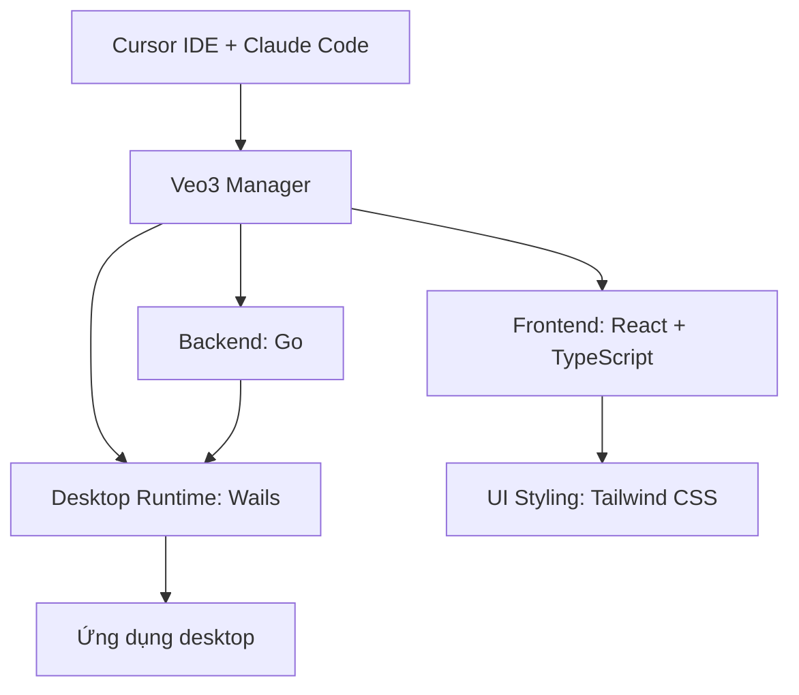
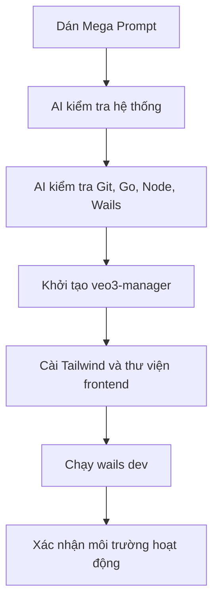

# Chương 03: Cài Đặt Môi Trường

## Thông Tin Chương

| Mục             | Chi Tiết                                                                           |
| --------------- | ---------------------------------------------------------------------------------- |
| Chương          | 03                                                                                 |
| Chủ đề          | Cài đặt môi trường phát triển                                                      |
| Dự án sử dụng   | **Veo3 Manager**                                                                   |
| Công nghệ chính | Git, Node.js, Go, Wails, React, TypeScript, Tailwind CSS, Cursor, Claude Code      |
| Mục tiêu        | Chuẩn bị môi trường sẵn sàng để bắt đầu xây dựng ứng dụng desktop bằng Vibe Coding |

---

## Mục Tiêu Chương

Sau chương này, bạn sẽ có thể:

* Cài đặt đầy đủ môi trường phát triển cho dự án **Veo3 Manager**.
* Kiểm tra được các công cụ quan trọng bằng Terminal.
* Hiểu vai trò của từng công cụ trong hệ sinh thái Go + React + Wails.
* Sử dụng Claude Code Chat để AI hỗ trợ thiết lập môi trường tự động.
* Khởi tạo dự án `veo3-manager` và chạy thử lần đầu.
* Biết cách nghiệm thu môi trường trước khi bắt đầu code thật.

---

## 1. Tổng Quan Môi Trường Cần Cài

Trong khóa học này, chúng ta sẽ xây dựng **Veo3 Manager**, một ứng dụng desktop sử dụng:

* **Go** cho backend.
* **React + TypeScript** cho frontend.
* **Wails** để đóng gói ứng dụng desktop.
* **Tailwind CSS** để xây giao diện nhanh.
* **Cursor IDE + Claude Code** để làm việc theo phong cách Vibe Coding.



---

## 2. Thứ Tự Cài Đặt Chuẩn

Bạn nên cài đặt theo đúng thứ tự sau:

```text
1. Git        - Quản lý phiên bản source code
2. Node.js    - Chạy frontend React + TypeScript
3. Go         - Viết backend cho Wails
4. Wails CLI  - Tạo, chạy và đóng gói desktop app
5. Cursor     - IDE tích hợp AI để Vibe Coding
6. Claude Code / Extension - Điều khiển AI hỗ trợ code và setup
```

Không nên bỏ bước hoặc cài lộn xộn, vì một số công cụ phía sau phụ thuộc vào công cụ phía trước.

---

## 3. Cài Đặt Git

Git là công cụ bắt buộc để quản lý source code và làm việc với hầu hết workflow lập trình hiện đại.

### Tải Git

| Hệ điều hành | Link tải                                                                   |
| ------------ | -------------------------------------------------------------------------- |
| Windows      | [https://git-scm.com/install/windows](https://git-scm.com/install/windows) |
| macOS        | [https://git-scm.com/install/mac](https://git-scm.com/install/mac)         |

### Kiểm Tra Git

Mở Terminal hoặc PowerShell và chạy:

```bash
git --version
```

Nếu hiển thị phiên bản Git, nghĩa là cài đặt thành công.

Ví dụ:

```text
git version 2.45.0
```

### Cấu Hình Git Lần Đầu

Chỉ cần làm một lần:

```bash
git config --global user.name "Ten Cua Ban"
git config --global user.email "email@cuaban.com"
```

Nếu gõ `git --version` mà báo không tìm thấy lệnh, hãy đóng toàn bộ Terminal rồi mở lại. Nếu vẫn lỗi, khởi động lại Cursor hoặc máy tính.

---

## 4. Cài Đặt Node.js

Node.js dùng để chạy phần frontend của **Veo3 Manager**, bao gồm React, TypeScript, Vite và Tailwind CSS.

### Cách Cài Đặt

1. Truy cập trang chủ Node.js.
2. Tải bản **LTS**.
3. Cài đặt như phần mềm thông thường.
4. Mở Terminal mới và kiểm tra.

### Kiểm Tra Node.js Và npm

```bash
node -v
npm -v
```

Kết quả mong đợi:

```text
v18.x.x hoặc cao hơn
npm x.x.x
```

Trong dự án này, Node.js nên đạt tối thiểu:

```text
Node.js >= 18
```

---

## 5. Cài Đặt Go

Go là ngôn ngữ backend chính của Wails. Phần xử lý logic phía desktop app sẽ được viết bằng Go.

### Cách Cài Đặt

1. Truy cập trang chủ Go.
2. Tải bản phù hợp với hệ điều hành.
3. Cài đặt theo hướng dẫn mặc định.
4. Mở Terminal mới và kiểm tra.

### Kiểm Tra Go

```bash
go version
```

Kết quả mong đợi có dạng:

```text
go version go1.23.0 windows/amd64
```

Yêu cầu tối thiểu cho khóa học:

```text
Go >= 1.21
```

---

## 6. Cài Đặt Wails CLI

Wails CLI là công cụ dòng lệnh giúp tạo, chạy và đóng gói ứng dụng desktop từ Go + React.

### Cài Đặt Wails CLI

```bash
go install github.com/wailsapp/wails/v2/cmd/wails@latest
```

### Kiểm Tra Wails

```bash
wails version
```

Nếu hiện phiên bản Wails, nghĩa là cài đặt thành công.

### Kiểm Tra Toàn Bộ Môi Trường Wails

```bash
wails doctor
```

Lệnh `wails doctor` sẽ kiểm tra:

* Go đã cài đúng chưa.
* Node.js có hoạt động không.
* npm có sẵn không.
* Các thư viện native cần thiết cho hệ điều hành.
* PATH và môi trường có vấn đề không.

Nếu có cảnh báo, hãy xử lý hết trước khi tiếp tục.

---

## 7. Cài Đặt Cursor IDE

Cursor là nơi bạn sẽ viết prompt, đọc code, chỉnh sửa file và làm việc với AI.

### Cách Cài Đặt

1. Truy cập: [https://www.cursor.com/](https://www.cursor.com/)
2. Tải bản phù hợp với hệ điều hành.
3. Cài đặt như ứng dụng thông thường.
4. Đăng nhập bằng Google hoặc GitHub.

Nếu Cursor hỏi có muốn import settings từ VS Code không, bạn nên chọn:

```text
YES
```

Việc này giúp giữ lại giao diện, extension và thói quen làm việc quen thuộc nếu bạn đã dùng VS Code trước đó.

---

## 8. Cài Đặt Claude Code Extension

Mặc dù Cursor đã có AI tích hợp, trong khóa học này bạn sẽ dùng thêm Claude Code để hỗ trợ workflow Vibe Coding tốt hơn.

### Cách Cài Đặt

1. Mở Cursor.
2. Vào tab **Extensions**.
3. Tìm:

```text
Claude Code
```

hoặc:

```text
Anthropic
```

4. Chọn **Install**.
5. Đăng nhập tài khoản Claude nếu được yêu cầu.

Sau bước này, bạn có thể dùng Claude Code Chat để yêu cầu AI kiểm tra, cài đặt, sửa lỗi và khởi tạo dự án.

---

## 9. Mega Prompt Cài Đặt Toàn Bộ Môi Trường

Trong Vibe Coding, bạn không nhất thiết phải tự gõ từng lệnh thủ công. Bạn có thể dùng prompt để yêu cầu AI kiểm tra và thiết lập môi trường theo từng bước.

Mở **Claude Code Chat**, dán prompt sau và nhấn Enter.

```text
Tôi muốn thiết lập toàn bộ môi trường phát triển cho dự án Veo3 Manager
sử dụng Go, Wails, React, TypeScript và Tailwind CSS.

Hãy thực hiện tuần tự các bước sau:

1. KIỂM TRA HỆ THỐNG

- Kiểm tra OS hiện tại: Windows, macOS hoặc Linux.
- Kiểm tra version và architecture của hệ điều hành.
- Kiểm tra Go đã cài chưa, yêu cầu Go >= 1.21.
- Nếu chưa có Go, hãy hướng dẫn tôi cài đặt.
- Kiểm tra Node.js đã cài chưa, yêu cầu Node.js >= 18 LTS.
- Nếu chưa có Node.js, hãy hướng dẫn tôi cài đặt.
- Kiểm tra Wails CLI đã cài chưa, yêu cầu Wails v2.
- Nếu chưa có Wails CLI, hãy cài bằng lệnh go install.
- Nếu gặp lỗi PATH hoặc biến môi trường, hãy hướng dẫn cách sửa cụ thể theo OS của tôi.

2. KHỞI TẠO DỰ ÁN

- Tạo dự án Wails mới tên `veo3-manager`.
- Sử dụng template React + TypeScript.
- Xóa các file mẫu mặc định như logo xoay hoặc ví dụ đếm số.
- Tạo file `.cursorrules` mô tả tech stack và quy ước coding.
- Tạo file `CLAUDE.md` tóm tắt thông tin dự án.

3. CÀI ĐẶT FRONTEND

- Cài Tailwind CSS và tạo file cấu hình cần thiết.
- Cài các thư viện hỗ trợ cần thiết cho frontend.
- Ưu tiên thư viện phục vụ quản lý state, thông báo và xử lý ngày tháng.

4. KHỞI CHẠY VÀ XÁC NHẬN

- Chạy ứng dụng ở chế độ phát triển bằng lệnh `wails dev`.
- Giải thích cho tôi màn hình console đang hiển thị gì.
- Báo cáo tiến độ từng bước.

Nếu gặp lỗi ở bước nào, hãy dừng lại và đề xuất cách sửa cụ thể cho OS của tôi.
```

---

## 10. Phân Tích Mega Prompt

Mega Prompt phía trên gồm 4 nhóm việc chính:

| Bước              | Mục Đích                                                | Kết Quả Mong Đợi              |
| ----------------- | ------------------------------------------------------- | ----------------------------- |
| Kiểm tra hệ thống | AI xác định OS, version, architecture và công cụ đã cài | Biết máy đã đủ điều kiện chưa |
| Khởi tạo dự án    | Tạo project Wails mới tên `veo3-manager`                | Có bộ khung app ban đầu       |
| Cài frontend      | Thêm Tailwind CSS và thư viện hỗ trợ                    | Frontend sẵn sàng phát triển  |
| Chạy thử          | Chạy `wails dev`                                        | Xác nhận app hoạt động        |



---

## 11. Lưu Ý Khi Chạy Lần Đầu

Lần chạy đầu tiên bằng lệnh:

```bash
wails dev
```

có thể mất từ:

```text
2 - 5 phút
```

Nguyên nhân là vì hệ thống cần tải dependency, build frontend và chuẩn bị môi trường desktop runtime.

Trong lúc này:

* Không tắt Terminal quá sớm.
* Không vội kết luận là bị treo.
* Nếu thấy tiến trình vẫn tải hoặc build, hãy đợi.
* Nếu lỗi xuất hiện rõ ràng, copy lỗi và đưa lại cho Claude Code Chat để xử lý.

---

## 12. ClaudeSuperKit Và Slash Commands

ClaudeSuperKit là bộ Slash Commands nâng cao dành cho Claude Code. Thay vì viết prompt dài cho những workflow phức tạp, bạn có thể dùng lệnh tắt.

Thông thường, bạn sẽ copy thư mục:

```text
.claude
```

vào thư mục gốc của dự án.

Sau đó Claude Code có thể nhận diện các lệnh tắt được định nghĩa sẵn.

### Một Số Slash Commands Quan Trọng

| Lệnh                    | Mô Tả                                                                                       | Khi Nào Dùng                                                                            |
| ----------------------- | ------------------------------------------------------------------------------------------- | --------------------------------------------------------------------------------------- |
| `/brainstorm [câu hỏi]` | Khám phá giải pháp, phân tích ưu và nhược điểm, đưa ra 2-3 hướng tiếp cận. Không viết code. | Khi cần suy nghĩ kiến trúc, chọn hướng làm hoặc phân tích ý tưởng trước khi triển khai. |
| `/plan:hard [nhiệm vụ]` | Lập kế hoạch triển khai chi tiết, chia phase, liệt kê rủi ro. Không viết code.              | Khi nhiệm vụ lớn, phức tạp, cần roadmap rõ trước khi bắt đầu.                           |
| `/fix:hard [mô tả lỗi]` | Gỡ lỗi phức tạp trên nhiều file, có thể dùng subagent để tìm nguyên nhân và sửa.            | Khi lỗi khó, liên quan nhiều phần hoặc chưa rõ nguyên nhân.                             |

ClaudeSuperKit rất mạnh, nhưng cần dùng đúng ngữ cảnh. Trước khi chạy lệnh lớn, bạn nên hiểu rõ mục tiêu và kiểm tra lại kết quả AI tạo ra.

---

## 13. Nghiệm Thu Môi Trường

Trong Vibe Coding, nguyên tắc quan trọng là:

> Tin tưởng AI, nhưng luôn kiểm tra lại kết quả.

Sau khi cài đặt xong, hãy dán prompt sau vào Claude Code Chat để nghiệm thu toàn bộ môi trường.

```text
Hãy kiểm tra tổng thể môi trường phát triển của tôi.

Xác nhận từng công cụ sau đang ở phiên bản nào:

- Git
- Go
- Node.js
- npm
- Wails CLI

Sau đó kiểm tra:

- Go có đạt yêu cầu tối thiểu Go >= 1.21 không.
- Node.js có đạt yêu cầu tối thiểu Node.js >= 18 không.
- Wails có đúng phiên bản v2 không.
- `wails doctor` còn cảnh báo đỏ nào không.
- Công cụ nào cần cập nhật hoặc cấu hình lại.

Hãy trả kết quả dưới dạng bảng rõ ràng.
Nếu có lỗi, hãy đề xuất cách sửa cụ thể theo hệ điều hành của tôi.
```

---

## 14. Checklist Kiểm Tra Cuối Chương

Trước khi sang bài tiếp theo, hãy đảm bảo tất cả mục dưới đây đều hoàn thành.

```text
[ ] git --version      -> Hiển thị phiên bản Git
[ ] node -v            -> Hiển thị phiên bản Node.js
[ ] npm -v             -> Hiển thị phiên bản npm
[ ] go version         -> Hiển thị phiên bản Go
[ ] wails version      -> Hiển thị phiên bản Wails
[ ] wails doctor       -> Không còn cảnh báo nghiêm trọng
[ ] Cursor mở được
[ ] Đã đăng nhập Cursor
[ ] Claude Code hoạt động trong Cursor
[ ] Dự án veo3-manager đã được tạo
[ ] Chạy được wails dev
```

---

## 15. Các Lỗi Thường Gặp

| Lỗi                                        | Nguyên Nhân Thường Gặp                   | Cách Khắc Phục                                                |
| ------------------------------------------ | ---------------------------------------- | ------------------------------------------------------------- |
| `'go' is not recognized`                   | Go chưa được thêm vào PATH               | Đóng Terminal, mở lại. Nếu vẫn lỗi, kiểm tra lại PATH của Go. |
| `go: command not found`                    | Terminal không tìm thấy Go               | Cài lại Go hoặc thêm Go vào biến môi trường.                  |
| `wails: command not found`                 | Thư mục Go bin chưa nằm trong PATH       | Thêm `$(go env GOPATH)/bin` vào PATH rồi mở Terminal mới.     |
| `node: command not found`                  | Node.js chưa cài hoặc PATH chưa cập nhật | Cài Node.js bản LTS, sau đó mở Terminal mới.                  |
| `npm: command not found`                   | npm chưa đi kèm hoặc Node.js cài lỗi     | Cài lại Node.js bản LTS.                                      |
| `wails doctor` báo thiếu thư viện hệ thống | Thiếu công cụ build native theo OS       | Làm theo hướng dẫn mà `wails doctor` in ra.                   |
| `wails dev` chạy rất lâu                   | Lần đầu tải dependency và build frontend | Đợi 2-5 phút, không tắt Terminal vội.                         |
| Cursor không nhận Git/Node/Go              | Cursor mở trước khi PATH cập nhật        | Tắt Cursor hoàn toàn rồi mở lại.                              |

---

## 16. Điều Cần Ghi Nhớ

* Môi trường chuẩn của khóa học gồm: **Git → Node.js → Go → Wails CLI → Cursor → Claude Code**.
* Luôn kiểm tra từng công cụ bằng lệnh version sau khi cài.
* `wails doctor` là lệnh quan trọng nhất để xác nhận môi trường Wails.
* Lỗi `not recognized` hoặc `command not found` thường liên quan đến PATH.
* Lần đầu chạy `wails dev` có thể lâu hơn bình thường.
* Vibe Coding không có nghĩa là bỏ kiểm tra. AI có thể hỗ trợ setup, nhưng bạn vẫn phải nghiệm thu kết quả.

---

## Tóm Tắt Chương

Trong chương này, bạn đã thiết lập môi trường phát triển cho **Veo3 Manager** với Git, Node.js, Go, Wails CLI, Cursor và Claude Code.

Bạn cũng đã học cách dùng **Mega Prompt** để yêu cầu AI kiểm tra hệ thống, khởi tạo dự án, cài đặt frontend và chạy thử ứng dụng bằng `wails dev`.

Sau khi hoàn thành checklist nghiệm thu, máy của bạn đã sẵn sàng để bước vào phần tiếp theo: cấu hình API key, biến môi trường và các thiết lập bảo mật trước khi bắt đầu xây dựng ứng dụng thật.
