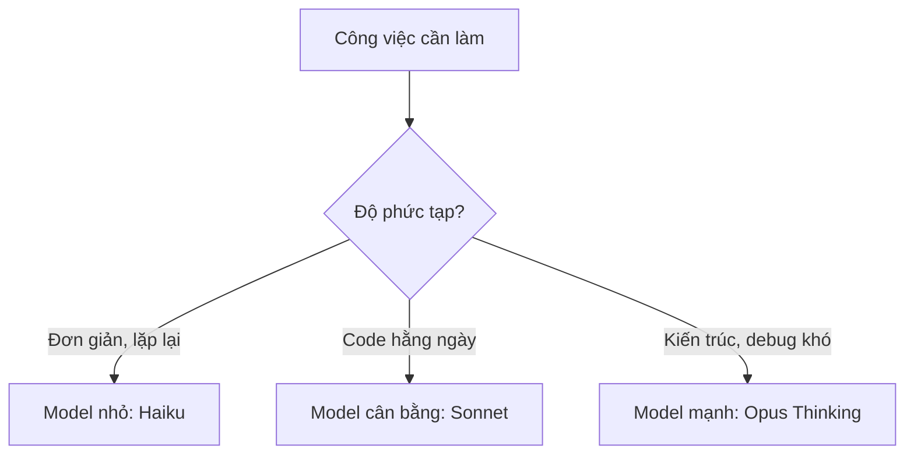
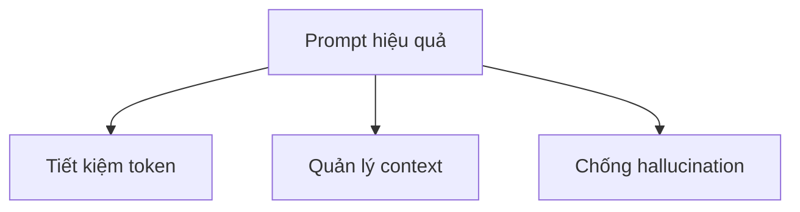

# Chương 04: Chọn Model AI

## Thông Tin Chương

| Mục             | Chi Tiết                                                                   |
| --------------- | -------------------------------------------------------------------------- |
| Chương          | 04                                                                         |
| Chủ đề          | Chọn model AI phù hợp khi Vibe Coding                                      |
| Công cụ chính   | Claude Web, Cursor, Claude Code                                            |
| Model trọng tâm | Claude Opus 4.6 Thinking                                                   |
| Dự án áp dụng   | **Veo3 Manager**                                                           |
| Mục tiêu        | Biết chọn đúng model, đúng giao diện làm việc và giao tiếp hiệu quả với AI |

---

## Mục Tiêu Chương

Sau chương này, bạn sẽ:

* Hiểu lý do khóa học sử dụng **Claude Opus 4.6 Thinking**.
* Biết vì sao nên dùng **giao diện Web** thay vì API trong khóa học.
* Hiểu sự khác biệt giữa các nhóm model như **Haiku**, **Sonnet**, **Opus**.
* Biết khi nào dùng model nhanh, khi nào dùng model mạnh.
* Áp dụng 3 nguyên tắc cốt lõi khi giao tiếp với AI.
* Biết 3 kỹ thuật prompting quan trọng khi lập trình với AI.

---

## 1. Vì Sao Cần Chọn Model AI?

Trong Vibe Coding, AI không chỉ viết code. AI còn giúp bạn:

* Phân tích yêu cầu.
* Thiết kế kiến trúc.
* Tìm lỗi.
* Refactor code.
* Viết giao diện.
* Đọc tài liệu.
* Đề xuất giải pháp kỹ thuật.

Vì vậy, chọn model đúng rất quan trọng.

Không có model nào là tốt nhất cho mọi việc. Model mạnh thường suy luận tốt hơn nhưng chậm hơn và tốn kém hơn. Model nhỏ phản hồi nhanh hơn nhưng dễ sai khi gặp bài toán phức tạp.



---

## 2. Tại Sao Khóa Học Chọn Claude Opus 4.6 Thinking?

Trong khóa học này, chúng ta ưu tiên **Claude Opus 4.6 Thinking** vì mục tiêu không chỉ là tạo vài đoạn code ngắn, mà là xây dựng một dự án hoàn chỉnh: **Veo3 Manager**.

Khi lập trình, ta cần AI có khả năng:

* Suy luận logic.
* Lập kế hoạch trước khi viết code.
* Hiểu nhiều file cùng lúc.
* Phân tích lỗi.
* Tự kiểm tra rủi ro.
* Giải thích quyết định kỹ thuật.

Claude Opus 4.6 Thinking phù hợp với các tác vụ này vì nó mạnh ở khả năng phân tích từng bước, giữ mạch lập luận tốt và xử lý các nhiệm vụ dài, phức tạp.

---

## 3. Điểm Mạnh Của Claude Opus 4.6 Thinking

| Điểm mạnh                        | Ý nghĩa khi lập trình                                  |
| -------------------------------- | ------------------------------------------------------ |
| Suy luận sâu                     | Phù hợp với bài toán kiến trúc, backend, luồng dữ liệu |
| Lập kế hoạch tốt                 | Có thể chia task lớn thành nhiều bước nhỏ              |
| Debug tốt hơn                    | Biết phân tích nguyên nhân thay vì chỉ sửa bề mặt      |
| Hiểu ngữ cảnh dài                | Hữu ích khi dự án có nhiều file                        |
| Kiểm tra lỗi trước khi xuất code | Giảm rủi ro sinh code sai logic                        |

Ví dụ, khi xây **Veo3 Manager**, model cần hiểu cùng lúc:

* Backend Go.
* Frontend React + TypeScript.
* Wails bridge.
* Cấu trúc thư mục.
* State management.
* API key.
* Lưu dữ liệu local.
* Đóng gói app desktop.

Đây là loại công việc nên dùng model mạnh.

---

## 4. Lưu Ý Khi Dùng Model Khác

Toàn bộ khóa học được thiết kế tối ưu cho **Claude Opus 4.6 Thinking**.

Nếu bạn dùng model khác, vẫn có thể làm được, nhưng có thể gặp các vấn đề như:

* AI hiểu sai yêu cầu.
* Code thiếu file.
* Tự bịa thư viện không tồn tại.
* Sửa lỗi vòng quanh nhưng không tìm đúng nguyên nhân.
* Không giữ được ngữ cảnh dự án dài.
* Kết quả không giống demo trong khóa học.

Vì vậy, nếu bạn là người mới, nên dùng đúng model được khuyến nghị để giảm lỗi không cần thiết.

---

## 5. Các Mức Model Thường Gặp

Claude thường có nhiều mức model khác nhau. Có thể hiểu đơn giản như sau:

| Mức model           | Đặc điểm                           | Khi nào dùng                             |
| ------------------- | ---------------------------------- | ---------------------------------------- |
| **Haiku**           | Nhanh, nhẹ, tiết kiệm              | Việc nhỏ, lặp lại, sửa text, format code |
| **Sonnet**          | Cân bằng giữa tốc độ và chất lượng | Code hằng ngày, tính năng rõ ràng        |
| **Opus / Thinking** | Mạnh nhất, suy luận sâu            | Kiến trúc, debug khó, refactor lớn       |

Quy tắc dễ nhớ:

```text
Việc nhỏ, rõ ràng        -> Haiku
Việc code hằng ngày      -> Sonnet
Việc khó, quan trọng     -> Opus Thinking
```

---

## 6. Chọn Model Theo Công Việc Trong Veo3 Manager

| Công việc                           | Model gợi ý    | Lý do                             |
| ----------------------------------- | -------------- | --------------------------------- |
| Thiết kế kiến trúc ban đầu          | Opus Thinking  | Ảnh hưởng toàn bộ dự án           |
| Khởi tạo Go + Wails + React         | Opus Thinking  | Cần hiểu nhiều công nghệ cùng lúc |
| Viết component UI đơn giản          | Sonnet         | Công việc rõ ràng, ít rủi ro      |
| Sửa text, đổi tên biến, format code | Haiku / Sonnet | Không cần suy luận sâu            |
| CRUD video                          | Sonnet         | Có thể làm theo pattern lặp lại   |
| Debug lỗi Wails khó                 | Opus Thinking  | Cần tìm nguyên nhân gốc           |
| Refactor nhiều file                 | Opus Thinking  | Rủi ro cao nếu sửa sai            |
| Polish giao diện Tailwind           | Sonnet         | Chủ yếu là chỉnh UI cục bộ        |
| Viết tài liệu dự án                 | Sonnet         | Cần rõ ràng, không quá nặng logic |

---

## 7. Vì Sao Khóa Học Dùng Giao Diện Web Thay Vì API?

Trong khóa học này, khuyến nghị dùng **Claude trên giao diện Web** thay vì gọi API trực tiếp.

Lý do chính là: Vibe Coding tạo ra rất nhiều token.

Khi bạn yêu cầu AI đọc code, sửa file, giải thích lỗi, viết component, refactor hoặc debug, lượng token đầu vào và đầu ra có thể rất lớn. Nếu dùng API, chi phí có thể tăng nhanh.

---

## 8. So Sánh Web Và API

| Tiêu chí              | Claude Web                          | Claude API                      |
| --------------------- | ----------------------------------- | ------------------------------- |
| Cách tính phí         | Gói cố định theo tháng              | Tính theo token                 |
| Phù hợp với người mới | Rất phù hợp                         | Cần hiểu billing và rate limit  |
| Dễ kiểm soát chi phí  | Dễ hơn                              | Khó hơn nếu dùng nhiều          |
| Tích hợp Artifacts    | Có                                  | Không giống giao diện Web       |
| Phù hợp khóa học này  | Có                                  | Không khuyến nghị cho người mới |
| Rủi ro rate limit     | Thấp hơn với người học thông thường | Có thể gặp nếu gọi nhiều        |

Với khóa học này, bạn nên dùng:

```text
Claude Pro trên giao diện Web
```

Không khuyến nghị dùng API trong giai đoạn học, trừ khi bạn đã hiểu rõ cách tính token, giới hạn tốc độ và chi phí.

---

## 9. Artifacts Là Gì Và Vì Sao Hữu Ích?

Trên giao diện Web, Claude hỗ trợ **Artifacts**, tức là khung hiển thị bên cạnh để xem trước nội dung AI tạo ra.

Artifacts hữu ích khi bạn làm:

* Giao diện HTML/CSS.
* Component React.
* Markdown bài học.
* File cấu hình.
* Tài liệu kỹ thuật.
* Mẫu UI thử nghiệm.

Với Vibe Coding, Artifacts giúp bạn nhìn kết quả nhanh hơn thay vì chỉ đọc code thô trong khung chat.

---

## 10. Ba Quy Tắc Giao Tiếp Với AI

Khi làm việc với AI, chất lượng câu trả lời phụ thuộc rất nhiều vào cách bạn viết prompt.

Có 3 quy tắc quan trọng cần nhớ:



---

## 11. Quy Tắc 1: Tránh Lãng Phí Token

AI xử lý văn bản bằng đơn vị gọi là **token**. Prompt càng dài, AI càng phải đọc nhiều. Nếu prompt dài nhưng lan man, AI dễ mất tập trung.

### Ví Dụ Sai

```text
Chào Claude, bạn có thể giúp mình viết một đoạn code nhỏ nhỏ bằng Go
để in ra một dòng chữ Hello World được không, nếu được thì bạn viết giúp mình nhé...
```

Prompt này không sai hoàn toàn, nhưng quá dài cho một yêu cầu đơn giản.

### Ví Dụ Đúng

```text
Viết hàm main in "Hello World" bằng Go.
```

Prompt tốt nên:

* Ngắn gọn.
* Rõ mục tiêu.
* Có ngôn ngữ lập trình cụ thể.
* Có đầu ra mong muốn.

---

## 12. Quy Tắc 2: Tránh Tràn Bộ Nhớ Ngữ Cảnh

AI có giới hạn ngữ cảnh, còn gọi là **context window**. Khi đoạn chat quá dài, AI có thể quên yêu cầu ban đầu hoặc nhầm lẫn giữa nhiều nhiệm vụ.

### Vấn Đề Thường Gặp

Bạn vừa yêu cầu AI:

* Tạo database.
* Viết backend.
* Sửa UI.
* Debug.
* Thêm tính năng mới.
* Refactor.
* Viết tài liệu.

Nếu tất cả nằm trong một đoạn chat quá dài, AI dễ bị loạn ngữ cảnh.

### Cách Giải Quyết

Khi bắt đầu một tính năng mới, hãy mở:

```text
New Chat
```

Nếu vẫn muốn tiếp tục chat cũ, hãy tóm tắt lại bối cảnh.

Ví dụ:

```text
Dựa vào cấu trúc database ở trên, hãy viết API CRUD cho bảng videos.
Không thay đổi schema hiện tại.
```

Hoặc:

```text
Tóm tắt lại trạng thái hiện tại của dự án, các file đã sửa và việc cần làm tiếp theo.
```

---

## 13. Quy Tắc 3: Ngăn Chặn Hallucination

**Hallucination** là khi AI tự tạo ra thông tin sai nhưng trình bày như thể đúng.

Trong lập trình, hallucination thường xuất hiện dưới dạng:

* Hàm không tồn tại.
* Thư viện không có thật.
* API sai tên.
* Cấu hình bịa.
* Lệnh terminal không đúng.
* Tài liệu không chính xác.

### Cách Giảm Hallucination

Thêm yêu cầu kiểm chứng vào prompt.

Ví dụ:

```text
Chỉ sử dụng thư viện chuẩn của Go.
Nếu dùng thư viện ngoài, phải cung cấp link tài liệu chính thức.
```

Hoặc:

```text
Trước khi viết code, hãy kiểm tra API của thư viện đang dùng.
Nếu không chắc, hãy nói rõ phần nào cần xác minh.
```

Hoặc:

```text
Không tự bịa tên hàm. Nếu chưa biết chính xác API, hãy đề xuất cách kiểm tra bằng tài liệu chính thức.
```

---

## 14. Ba Kỹ Thuật Prompting Hiệu Quả

Ngoài 3 quy tắc trên, bạn nên nắm 3 kỹ thuật prompting cơ bản sau.

---

## 15. Kỹ Thuật 1: Chỉ Định Vai Trò

Chỉ định vai trò giúp AI đặt mình vào đúng góc nhìn chuyên môn.

### Ví Dụ

```text
Hãy đóng vai Senior Go Developer.
Thiết kế cấu trúc backend cho ứng dụng desktop Wails quản lý video.
Ưu tiên code dễ bảo trì, rõ trách nhiệm từng package.
```

Kỹ thuật này hữu ích khi bạn cần:

* Thiết kế kiến trúc.
* Review code.
* Debug lỗi khó.
* Tối ưu hiệu năng.
* Viết code theo chuẩn production.

---

## 16. Kỹ Thuật 2: Yêu Cầu Suy Luận Từng Bước

Thay vì bảo AI viết code ngay, hãy yêu cầu AI phân tích trước.

### Prompt Tốt

```text
Hãy phân tích vấn đề trước, sau đó đề xuất giải pháp, rồi mới viết code.
```

Hoặc:

```text
Làm theo thứ tự:
1. Phân tích yêu cầu.
2. Chỉ ra rủi ro.
3. Đề xuất cấu trúc file.
4. Viết code.
5. Hướng dẫn cách kiểm tra.
```

Cách này giúp tránh lỗi “AI viết code quá sớm” khi chưa hiểu đủ vấn đề.

---

## 17. Kỹ Thuật 3: Cung Cấp Ví Dụ

Cung cấp ví dụ giúp AI hiểu chính xác định dạng bạn muốn.

### Ví Dụ Prompt

```text
Viết hàm parseVideoName(input string) trong Go.

Input mẫu:
"veo3_cat_video_2026.mp4"

Output mong muốn:
{
  "name": "cat video",
  "year": 2026,
  "extension": "mp4"
}
```

Kỹ thuật này gọi là **Few-Shot Prompting**. Đây là cách rất mạnh để yêu cầu AI tạo đúng định dạng dữ liệu.

---

## 18. Công Thức Prompt Dùng Trong Khóa Học

Bạn có thể dùng mẫu prompt sau cho hầu hết tác vụ lập trình:

```text
Hãy đóng vai Senior [ngôn ngữ/công nghệ] Developer.

Bối cảnh:
[Tóm tắt dự án hoặc file đang làm]

Mục tiêu:
[Việc cần làm]

Ràng buộc:
[Không được thay đổi gì, chỉ dùng thư viện nào, giữ cấu trúc nào]

Cách làm:
1. Phân tích yêu cầu.
2. Đề xuất giải pháp.
3. Viết code.
4. Hướng dẫn cách kiểm tra.

Nếu có điểm chưa chắc chắn, hãy hỏi lại trước khi sửa.
```

Ví dụ áp dụng cho Veo3 Manager:

```text
Hãy đóng vai Senior Go + Wails Developer.

Bối cảnh:
Tôi đang xây ứng dụng desktop Veo3 Manager bằng Go, Wails, React và TypeScript.

Mục tiêu:
Tạo backend service để lưu danh sách video vào file JSON local.

Ràng buộc:
- Không dùng database.
- Chỉ dùng thư viện chuẩn của Go.
- Code phải dễ mở rộng để sau này thêm search và tag.

Cách làm:
1. Phân tích yêu cầu.
2. Đề xuất cấu trúc file.
3. Viết code.
4. Hướng dẫn cách test bằng wails dev.
```

---

## 19. Sai Lầm Thường Gặp Khi Chọn Model

| Sai lầm                             | Hậu quả                                        |
| ----------------------------------- | ---------------------------------------------- |
| Luôn dùng model mạnh nhất           | Tốn tài nguyên, phản hồi chậm, không cần thiết |
| Luôn dùng model nhỏ nhất            | Dễ sai khi gặp bài toán khó                    |
| Không mở chat mới khi đổi tính năng | AI bị lẫn ngữ cảnh                             |
| Prompt quá dài nhưng thiếu mục tiêu | AI trả lời lan man                             |
| Không yêu cầu kiểm chứng            | AI dễ bịa thư viện, hàm hoặc lệnh              |
| Dùng API khi chưa hiểu token        | Dễ phát sinh chi phí cao                       |

---

## 20. Checklist Cuối Chương

Trước khi sang chương tiếp theo, hãy chắc chắn bạn hiểu các ý sau:

```text
[ ] Biết vì sao khóa học dùng Claude Opus 4.6 Thinking
[ ] Biết khi nào dùng Haiku, Sonnet, Opus
[ ] Hiểu vì sao khóa học ưu tiên Claude Web thay vì API
[ ] Biết token là gì ở mức cơ bản
[ ] Biết context window là gì
[ ] Biết hallucination là gì
[ ] Biết cách viết prompt ngắn gọn, rõ mục tiêu
[ ] Biết dùng role-playing trong prompt
[ ] Biết yêu cầu AI phân tích trước khi viết code
[ ] Biết cung cấp ví dụ input/output cho AI
```

---

## 21. Điều Cần Ghi Nhớ

* Vibe Coding không chỉ là bảo AI viết code, mà là biết điều khiển AI đúng cách.
* Model mạnh phù hợp với việc khó, nhưng không cần dùng cho mọi thứ.
* Với khóa học này, nên dùng **Claude Opus 4.6 Thinking trên giao diện Web** để có trải nghiệm ổn định.
* Không nên dùng API khi mới học, vì dễ tốn chi phí token.
* Prompt tốt cần rõ vai trò, bối cảnh, mục tiêu, ràng buộc và cách kiểm tra.
* AI có thể sai, vì vậy luôn yêu cầu kiểm chứng và tự chạy lại kết quả.

---

## Tóm Tắt Chương

Chương này giúp bạn hiểu cách chọn model AI khi Vibe Coding. Trong khóa học, **Claude Opus 4.6 Thinking** được chọn vì phù hợp với các tác vụ lập trình phức tạp như thiết kế kiến trúc, debug lỗi khó và xây dựng dự án nhiều file.

Bạn cũng đã hiểu lý do ưu tiên giao diện Web thay vì API để tránh chi phí token cao, đồng thời nắm được 3 quy tắc quan trọng khi giao tiếp với AI: tránh lãng phí token, tránh tràn context và giảm hallucination.

Từ chương sau, bạn sẽ bắt đầu áp dụng các nguyên tắc này vào việc viết prompt thực tế để xây dựng **Veo3 Manager** hiệu quả hơn.
