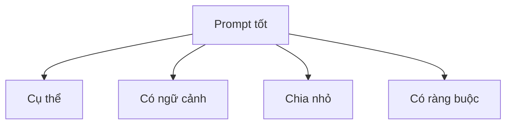
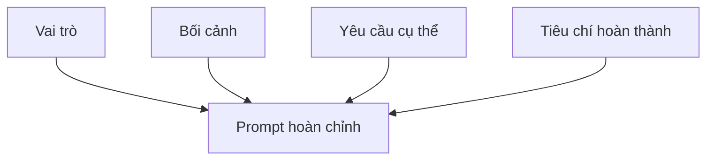
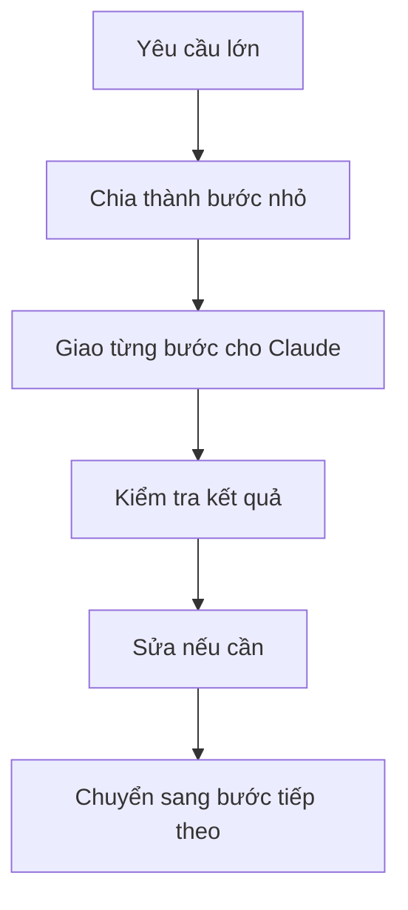
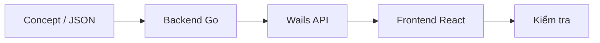

# Chương 05: Nghệ Thuật Viết Prompt

## Thông Tin Chương

| Mục           | Chi Tiết                                                               |
| ------------- | ---------------------------------------------------------------------- |
| Chương        | 05                                                                     |
| Chủ đề        | Nghệ thuật viết prompt                                                 |
| Dự án áp dụng | **Veo3 Manager**                                                       |
| Công cụ chính | Cursor, Claude Code, Claude Web                                        |
| Mục tiêu      | Biết cách giao việc rõ ràng cho AI để nhận kết quả đúng hơn, nhanh hơn |

---

## Mục Tiêu Chương

Sau chương này, bạn sẽ:

* Hiểu vì sao prompt là kỹ năng quan trọng nhất trong Vibe Coding.
* Biết công thức viết prompt hiệu quả cho AI agent như Claude trong Cursor.
* Biết cách chuyển một ý tưởng mơ hồ thành yêu cầu rõ ràng.
* Áp dụng prompt để chuẩn bị xây các tính năng của **Veo3 Manager**.
* Biết cách yêu cầu Claude hỏi lại khi thiếu thông tin.
* Biết chia nhỏ task lớn để tránh AI làm sai hoặc ảo giác.

---

## 1. Bản Chất Của Prompt Trong Vibe Coding

Trong Vibe Coding, giao tiếp với AI không phải là “xin AI viết giúp”, mà là **ra yêu cầu rõ ràng như giao việc cho một lập trình viên**.

AI có thể viết code rất nhanh, nhưng nó không tự biết chính xác bạn muốn gì nếu prompt thiếu ngữ cảnh.

```text
Prompt mơ hồ  -> AI tự suy đoán -> Kết quả dễ sai ý
Prompt rõ ràng -> AI hiểu đúng   -> Kết quả gần đúng ngay từ đầu
```

Đầu tư 2 phút viết prompt tốt thường giúp tiết kiệm 20 phút sửa lỗi sau đó.

---

## 2. Vì Sao Prompt Là Kỹ Năng Quan Trọng Nhất?

Claude không thiếu khả năng viết code. Thứ Claude thiếu là:

* Bối cảnh dự án của bạn.
* Stack công nghệ đang dùng.
* File nào được phép sửa.
* Logic nghiệp vụ thật sự mong muốn.
* Tiêu chí để biết task đã hoàn thành.
* Những điều không được làm.

Nếu prompt không rõ, Claude có thể:

* Tự đoán sai yêu cầu.
* Sửa nhầm file.
* Tạo thư viện không cần thiết.
* Viết code không khớp kiến trúc dự án.
* Làm quá nhiều thứ ngoài phạm vi bạn muốn.

---

## 3. Bốn Chữ Vàng Khi Viết Prompt

Một prompt tốt cần nhớ 4 nguyên tắc:

| Nguyên tắc    | Ý nghĩa                                       | Ví dụ                                                    |
| ------------- | --------------------------------------------- | -------------------------------------------------------- |
| **Cụ thể**    | Nói rõ đầu vào, logic xử lý và đầu ra         | “Tìm video theo title, không phân biệt hoa thường”       |
| **Ngữ cảnh**  | Cung cấp stack, dự án, file, dữ liệu hiện có  | “Dự án dùng Go, Wails v2, React, TypeScript”             |
| **Chia nhỏ**  | Mỗi prompt nên xử lý một logic hoặc component | “Chỉ làm ô tìm kiếm, chưa làm filter nâng cao”           |
| **Ràng buộc** | Ép khuôn cách AI trả lời hoặc code            | “Không dùng thư viện ngoài”, “Không sửa schema hiện tại” |



---

## 4. Công Thức 4 Thành Phần Của Prompt Tốt

Một prompt hiệu quả nên có 4 phần chính:

| Thành phần              | Câu hỏi cần trả lời                 |
| ----------------------- | ----------------------------------- |
| **Vai trò**             | Claude nên đóng vai ai?             |
| **Bối cảnh**            | Dự án đang làm là gì? Đã có gì rồi? |
| **Yêu cầu cụ thể**      | Chính xác cần làm gì?               |
| **Tiêu chí hoàn thành** | Làm sao biết kết quả đã đúng?       |



---

## 5. So Sánh Prompt Yếu Và Prompt Tốt

### Prompt Yếu

```text
Thêm tính năng tìm kiếm video.
```

Prompt này quá mơ hồ vì chưa nói rõ:

* Tìm kiếm ở màn nào?
* Tìm theo trường nào?
* Có phân biệt hoa thường không?
* Kết quả hiển thị ra sao?
* Có ảnh hưởng filter cũ không?

---

### Prompt Tốt

```text
Hãy đóng vai Senior Full-stack Developer, chuyên về Go, Wails và React.

Bối cảnh:
Dự án Veo3 Manager đã có màn hình danh sách video.
Mỗi video có các trường: title, prompt, status, createdAt.
Dữ liệu đang được lưu trong file JSON và đọc qua hàm GetVideoList() ở backend Go.

Yêu cầu:
- Thêm một ô tìm kiếm ở đầu trang danh sách video.
- Tìm kiếm theo title, không phân biệt hoa thường.
- Kết quả lọc ngay khi người dùng gõ, không cần bấm nút submit.
- Nếu không có kết quả, hiển thị dòng chữ "Không tìm thấy video nào".

Tiêu chí hoàn thành:
- Gõ "sunset" tìm ra video có title chứa từ "Sunset".
- Xóa hết chữ trong ô tìm kiếm thì hiển thị lại toàn bộ danh sách.
- Không làm vỡ tính năng lọc theo status đã có sẵn.

Nếu thông tin tôi cung cấp chưa đủ, hãy hỏi lại trước khi sửa code.
```

---

## 6. Kỹ Thuật 1: Kế Hoạch Trước, Code Sau

Đừng bắt AI viết code ngay khi task còn mơ hồ. Hãy yêu cầu nó phân tích và lập kế hoạch trước.

```text
Liệt kê các bước thực hiện tính năng quản lý video trong Veo3 Manager.
Chưa cần viết code.
Hãy cho tôi lộ trình triển khai theo từng phase.
```

Cách này phù hợp khi:

* Bạn chưa biết bắt đầu từ đâu.
* Tính năng có nhiều phần.
* Cần quyết định kiến trúc.
* Muốn tránh việc AI sửa code quá sớm.

---

## 7. Kỹ Thuật 2: Few-Shot Prompting

Few-Shot nghĩa là cho AI xem ví dụ mẫu trước, để nó làm theo đúng format hoặc style bạn muốn.

```text
Viết hàm xử lý video theo đúng style của đoạn code mẫu sau:

[Mẫu code]

Yêu cầu:
- Giữ cách đặt tên giống mẫu.
- Giữ cách xử lý lỗi giống mẫu.
- Không thêm thư viện ngoài.
```

Kỹ thuật này rất hữu ích khi bạn muốn AI:

* Viết theo style code hiện tại.
* Tạo JSON đúng format.
* Sinh TypeScript type từ dữ liệu mẫu.
* Viết component giống design có sẵn.

---

## 8. Kỹ Thuật 3: Phản Biện Và Tối Ưu

AI không chỉ dùng để viết code mới. Bạn có thể dùng AI như một reviewer.

```text
Hãy đóng vai Senior Developer.
Review đoạn code dưới đây.

Yêu cầu:
- Tìm lỗi logic.
- Tìm điểm yếu bảo mật.
- Tìm phần có thể gây khó bảo trì.
- Đề xuất phiên bản tối ưu hơn.

Chưa sửa code ngay, hãy liệt kê vấn đề trước.
```

Dùng kỹ thuật này khi:

* Code chạy được nhưng chưa chắc tốt.
* Bạn muốn tối ưu kiến trúc.
* Bạn nghi ngờ có lỗi bảo mật.
* Bạn chuẩn bị refactor.

---

## 9. Kỹ Thuật 4: Test-Driven Prompting

Với logic quan trọng, hãy yêu cầu AI viết test trước.

```text
Viết unit test cho hàm validateVideoInput trước.
Sau đó mới viết logic để pass toàn bộ test.

Điều kiện:
- title không được rỗng.
- prompt không được rỗng.
- status chỉ được là draft, processing, completed hoặc failed.
- Không dùng thư viện ngoài nếu không cần thiết.
```

Cách này giúp AI tập trung vào đầu ra đúng trước khi viết logic.

---

## 10. Kỹ Thuật 5: Tự Động Hóa Từ Dữ Liệu Có Sẵn

AI rất mạnh khi chuyển đổi dữ liệu từ dạng này sang dạng khác.

Ví dụ:

```text
Từ JSON sau, hãy tạo các type TypeScript tương ứng.

Yêu cầu:
- Giữ đúng tên field.
- Field nào có thể null thì dùng union type.
- Không thêm field không có trong JSON.

JSON:
[...]
```

Ứng dụng trong Veo3 Manager:

* JSON mẫu -> TypeScript type.
* Schema dữ liệu -> Go struct.
* Danh sách route -> React navigation.
* Log lỗi -> checklist debug.
* API response -> interface frontend.

---

## 11. Cho Claude Không Gian Để Hỏi Lại

Một prompt tốt không nhất thiết phải đầy đủ ngay từ đầu. Điều quan trọng là bạn phải ngăn Claude tự đoán khi thiếu dữ liệu.

Hãy thêm câu này vào cuối prompt:

```text
Nếu thông tin tôi cung cấp chưa đủ để làm đúng,
hãy hỏi lại tôi trước khi bắt đầu sửa code.
```

Câu này đặc biệt hữu ích khi dùng chế độ Agent trong Cursor, vì Agent có thể sửa nhiều file cùng lúc. Hỏi lại trước sẽ giảm rủi ro sửa sai hàng loạt.

---

## 12. Chia Nhỏ Yêu Cầu Lớn

Không nên yêu cầu:

```text
Xây toàn bộ Veo3 Manager cho tôi.
```

Yêu cầu này quá lớn, dễ khiến AI bỏ sót chi tiết hoặc tự bịa kiến trúc.

Hãy chia thành các bước nhỏ:

```text
Bước 1: Tạo cấu trúc dự án Go + Wails + React rỗng.
Bước 2: Tạo struct Video và hàm đọc/ghi file JSON.
Bước 3: Tạo API nội bộ để frontend gọi được backend.
Bước 4: Tạo giao diện danh sách video với dữ liệu mẫu.
Bước 5: Thêm tìm kiếm, filter và trạng thái video.
```



---

## 13. Quy Trình Vibe Coding Chuẩn

Khi xây một tính năng mới, nên đi theo luồng:

```text
1. Concept / JSON dữ liệu
2. Backend Go Structs
3. Logic lưu trữ hoặc xử lý
4. Wails API bridge
5. Frontend React UI
6. Kiểm tra và sửa lỗi
```



Ví dụ với tính năng quản lý video:

| Bước | Việc cần làm                        |
| ---- | ----------------------------------- |
| 1    | Định nghĩa dữ liệu Video            |
| 2    | Tạo Go struct                       |
| 3    | Viết hàm đọc/ghi JSON               |
| 4    | Expose hàm qua Wails                |
| 5    | Tạo React UI                        |
| 6    | Test thêm, sửa, xóa, tìm kiếm video |

---

## 14. Mẹo Quản Lý Context

Hội thoại quá dài sẽ khiến AI dễ quên code cũ hoặc lẫn yêu cầu.

Khi làm việc lâu, hãy thường xuyên yêu cầu Claude tóm tắt:

```text
Tóm tắt trạng thái hiện tại của dự án:
- File đã sửa
- Tính năng đã xong
- Lỗi còn lại
- Việc cần làm tiếp theo
```

Khi bắt đầu tính năng mới, nên mở:

```text
New Chat
```

Sau đó dán lại phần tóm tắt để AI có ngữ cảnh sạch hơn.

---

## 15. Vũ Khí Bí Mật: `/brainstorm`

Khi bạn bí ý tưởng kiến trúc hoặc chưa biết bắt đầu từ đâu, hãy dùng:

```text
/brainstorm [Thiết kế tính năng X]
```

Ví dụ:

```text
/brainstorm Thiết kế tính năng lưu lịch sử prompt cho Veo3 Manager
```

Claude sẽ không cắm đầu viết code ngay. Thay vào đó, nó sẽ:

* Hỏi ngược lại để làm rõ yêu cầu.
* Đưa ra 2-3 phương án.
* Phân tích ưu và nhược điểm.
* Gợi ý hướng phù hợp nhất.

Dùng `/brainstorm` khi:

* Tính năng còn mơ hồ.
* Có nhiều hướng triển khai.
* Bạn muốn chọn kiến trúc trước khi code.
* Bạn cần cố vấn kỹ thuật.

---

## 16. Mẫu Prompt Tái Sử Dụng

Bạn có thể dùng mẫu sau cho hầu hết task trong **Veo3 Manager**:

```text
[VAI TRÒ]
Hãy đóng vai [chức danh chuyên môn].

[BỐI CẢNH]
Dự án Veo3 Manager hiện tại có:
- [Mô tả phần đã có]
- [Stack công nghệ]
- [File hoặc module liên quan]

[YÊU CẦU]
- [Yêu cầu 1]
- [Yêu cầu 2]
- [Yêu cầu 3]

[RÀNG BUỘC]
- [Không được thay đổi gì]
- [Không dùng thư viện nào]
- [Giữ nguyên logic nào]

[TIÊU CHÍ HOÀN THÀNH]
- [Điều kiện 1 để biết đã xong]
- [Điều kiện 2 để biết đã xong]
- [Cách test hoặc kiểm tra]

Nếu thiếu thông tin, hãy hỏi lại trước khi sửa code.
```

---

## 17. Ví Dụ Prompt Hoàn Chỉnh Cho Veo3 Manager

```text
Hãy đóng vai Senior Go + Wails + React Developer.

Bối cảnh:
Tôi đang xây Veo3 Manager bằng Go, Wails v2, React, TypeScript và Tailwind CSS.
Dự án đã có màn hình danh sách video và backend đọc dữ liệu từ file JSON.

Yêu cầu:
- Thêm chức năng tạo video mới.
- Form gồm title, prompt và status.
- Khi submit, dữ liệu được lưu vào file JSON thông qua backend Go.
- Sau khi lưu thành công, frontend tự cập nhật danh sách video.

Ràng buộc:
- Không dùng database ở bước này.
- Không thay đổi cấu trúc Video hiện tại nếu không cần.
- Không thêm thư viện ngoài nếu thư viện chuẩn đủ dùng.

Tiêu chí hoàn thành:
- Người dùng nhập form và bấm Save thì video mới xuất hiện trong danh sách.
- Reload app vẫn thấy video đã lưu.
- Nếu title hoặc prompt rỗng thì hiển thị lỗi.
- Không làm hỏng tính năng tìm kiếm và lọc status hiện có.

Nếu thiếu thông tin, hãy hỏi lại trước khi sửa code.
```

---

## 18. Sai Lầm Thường Gặp Khi Viết Prompt

| Sai lầm                           | Hậu quả                                  |
| --------------------------------- | ---------------------------------------- |
| Prompt quá ngắn và mơ hồ          | AI tự đoán, dễ sai ý                     |
| Một prompt yêu cầu quá nhiều việc | AI bỏ sót hoặc sửa lan man               |
| Không cung cấp stack công nghệ    | AI chọn sai thư viện hoặc sai cách làm   |
| Không có tiêu chí hoàn thành      | Không biết kết quả đã đúng chưa          |
| Không đặt ràng buộc               | AI tự thêm dependency hoặc đổi kiến trúc |
| Không cho AI hỏi lại              | AI tự suy diễn khi thiếu thông tin       |
| Chat quá dài không tóm tắt        | AI quên yêu cầu ban đầu                  |

---

## 19. Checklist Prompt Tốt

Trước khi gửi prompt cho Claude, hãy kiểm tra:

```text
[ ] Có vai trò rõ ràng
[ ] Có bối cảnh dự án
[ ] Có stack công nghệ
[ ] Có yêu cầu cụ thể
[ ] Có ràng buộc
[ ] Có tiêu chí hoàn thành
[ ] Có cách kiểm tra kết quả
[ ] Có câu "Nếu thiếu thông tin, hãy hỏi lại"
[ ] Task đủ nhỏ để AI làm tốt trong một lượt
```

---

## 20. Điều Cần Ghi Nhớ

* Prompt là cách bạn “thiết kế đầu vào” cho AI.
* Đầu vào càng rõ, code đầu ra càng chất lượng.
* Một prompt tốt gồm: vai trò, bối cảnh, yêu cầu, ràng buộc và tiêu chí hoàn thành.
* Không dùng một Mega Prompt để bắt AI làm toàn bộ dự án.
* Hãy chia nhỏ task theo luồng: dữ liệu -> backend -> Wails API -> frontend -> kiểm tra.
* Khi bí hướng, dùng `/brainstorm` để Claude phân tích trước khi code.
* Khi thiếu thông tin, bắt Claude hỏi lại thay vì tự đoán.

---

## Tóm Tắt Chương

Chương này giúp bạn nắm kỹ năng quan trọng nhất của Vibe Coding: **viết prompt rõ ràng để điều khiển AI hiệu quả**.

Bạn đã học công thức prompt gồm vai trò, bối cảnh, yêu cầu cụ thể, ràng buộc và tiêu chí hoàn thành. Bạn cũng biết cách chia nhỏ task lớn, yêu cầu AI lập kế hoạch trước khi code, dùng Few-Shot, TDD, review code và tận dụng `/brainstorm` khi chưa rõ hướng triển khai.

Từ Chương 6 trở đi, bạn sẽ dùng những kỹ thuật này để bắt đầu xây dựng **Veo3 Manager** theo từng phần nhỏ, rõ ràng và dễ kiểm tra.
