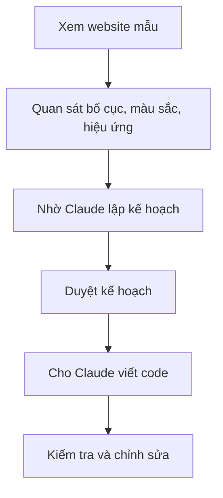
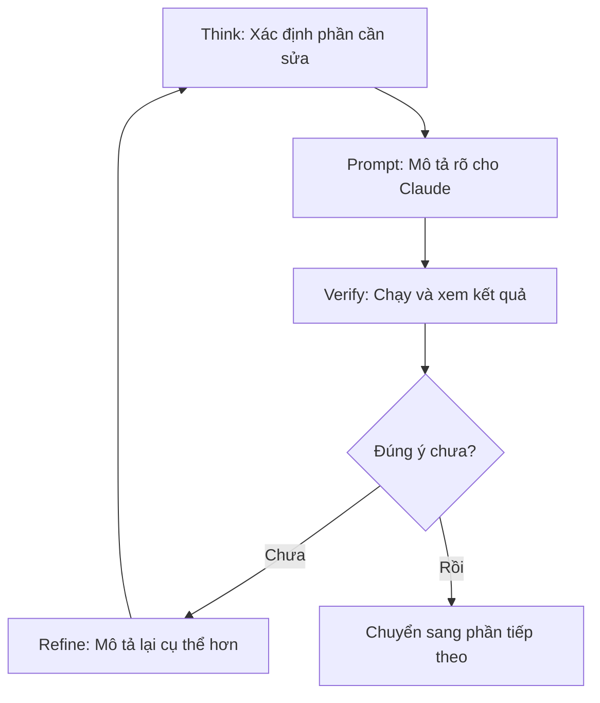

# Chương 06: Tạo Landing Page Đầu Tiên

## Thông Tin Chương

| Mục           | Chi Tiết                                       |
| ------------- | ---------------------------------------------- |
| Chương        | 06                                             |
| Chủ đề        | Tạo landing page đầu tiên bằng Vibe Coding     |
| Công nghệ     | React, TypeScript, Tailwind CSS, Framer Motion |
| Công cụ       | Cursor, Claude Code                            |
| Website mẫu   | [lebachhiep.com](https://lebachhiep.com)       |
| Dự án áp dụng | **Veo3 Manager**                               |

---

## Mục Tiêu Chương

Sau chương này, bạn sẽ:

* Hiểu tư duy **“Nhìn trước, làm sau”** khi xây giao diện bằng AI.
* Biết cách quan sát website mẫu trước khi yêu cầu Claude code.
* Tạo được landing page giới thiệu **Veo3 Manager** bằng React, TypeScript và Tailwind CSS.
* Biết dùng `/plan:hard` để Claude lên kế hoạch trước khi viết code.
* Biết yêu cầu Claude chỉnh từng phần cụ thể thay vì viết lại toàn bộ.
* Thực hành vòng lặp **Think - Prompt - Verify - Refine**.
* Biết kiểm tra giao diện trên desktop, mobile, light/dark mode và hiệu năng.

---

## 1. Vì Sao Bắt Đầu Bằng Landing Page?

Trước khi xây phần lõi phức tạp của **Veo3 Manager** bằng Go + Wails, chúng ta bắt đầu bằng một landing page.

Landing page là trang giới thiệu sản phẩm. Nó chưa cần backend, chưa cần database, chưa cần xử lý logic phức tạp. Đây là bài thực hành rất phù hợp để làm quen với Vibe Coding.

Lý do nên bắt đầu từ landing page:

* Kết quả hiển thị ngay trên trình duyệt.
* Dễ đánh giá đúng/sai bằng mắt.
* Không cần backend nên ít lỗi phức tạp.
* Giúp luyện kỹ năng viết prompt giao diện.
* Có thể dùng lại để giới thiệu sản phẩm ở chương phát hành.

---

## 2. Tư Duy “Nhìn Trước, Làm Sau”

Trước khi nhờ AI làm giao diện, bạn cần xem website mẫu để biết mình muốn gì.

Giống như xây nhà: trước khi nói với kiến trúc sư “làm cho tôi căn nhà đẹp”, bạn nên xem nhà mẫu trước. Với AI cũng vậy.



Trong chương này, website mẫu là:

```text
lebachhiep.com
```

Bạn không cần hiểu code của website mẫu. Việc cần làm là quan sát:

* Trang dùng nền sáng hay nền tối?
* Có những section nào?
* Menu hoạt động ra sao?
* Có hiệu ứng khi cuộn không?
* Trên điện thoại có đẹp không?
* Phong cách tổng thể là tối giản, hiện đại hay nhiều màu sắc?

---

## 3. Quan Sát Website Mẫu

Mở [lebachhiep.com](https://lebachhiep.com), cuộn từ đầu đến cuối và quan sát tổng thể.

Thông thường, một landing page sẽ có các phần như:

| Phần            | Vai trò                                       |
| --------------- | --------------------------------------------- |
| Header / Navbar | Thanh menu điều hướng                         |
| Hero            | Phần giới thiệu chính đầu trang               |
| About / Intro   | Giới thiệu sản phẩm, cá nhân hoặc thương hiệu |
| Features        | Các điểm nổi bật                              |
| Pricing         | Bảng giá hoặc gói dịch vụ                     |
| FAQ             | Câu hỏi thường gặp                            |
| Footer          | Thông tin cuối trang                          |

Bạn không cần ghi lại quá chi tiết. Ở bước tiếp theo, Claude sẽ phân tích cấu trúc và lập kế hoạch.

Mẹo: hãy chụp ảnh màn hình toàn bộ trang mẫu. Nếu Claude hỗ trợ đọc ảnh trong môi trường bạn dùng, ảnh sẽ giúp nó hiểu giao diện nhanh hơn.

---

## 4. Khởi Tạo Dự Án React + TypeScript + Tailwind

Trong Terminal của Cursor, chạy:

```bash
npm create vite@latest veo3-landing -- --template react-ts
cd veo3-landing
npm install
npm install -D tailwindcss postcss autoprefixer
npx tailwindcss init -p
```

Sau đó chạy thử:

```bash
npm run dev
```

Nếu terminal in ra địa chỉ local, ví dụ:

```text
http://localhost:5173
```

hãy mở địa chỉ đó trên trình duyệt.

---

## 5. Cài Framer Motion

Vì landing page cần hiệu ứng chuyển động, cài thêm Framer Motion:

```bash
npm install framer-motion
```

Framer Motion dùng để tạo các hiệu ứng như:

* Section hiện dần khi cuộn.
* Button có hover animation.
* Card nổi lên khi rê chuột.
* Menu mobile mở mượt hơn.
* Chuyển dark/light mode đẹp hơn.

---

## 6. Bước 1: Nhờ Claude Lên Kế Hoạch

Không nên bảo Claude “làm luôn” ngay từ đầu. Hãy yêu cầu nó lập kế hoạch trước.

Dán prompt sau vào Claude Code Chat:

```text
/plan:hard Mình muốn tạo một landing page lấy cảm hứng từ trang lebachhiep.com
cho sản phẩm Veo3 Manager.

Hãy tự phân tích cấu trúc trang web mẫu đó:
- Có bao nhiêu phần chính.
- Mỗi phần có vai trò gì.
- Bố cục tổng thể như thế nào.
- Màu sắc, spacing, typography và hiệu ứng có gì đáng chú ý.

Sau đó lên kế hoạch triển khai landing page bằng React, TypeScript, Tailwind CSS
và Framer Motion.

Yêu cầu:
- Nền tối mặc định, có nút chuyển sang nền sáng.
- Đẹp trên cả điện thoại và máy tính.
- Có hiệu ứng chuyển động khi cuộn trang.
- Mỗi section tách thành file riêng cho dễ quản lý.
- Nội dung cuối cùng sẽ thay bằng sản phẩm Veo3 Manager.

Chỉ lập kế hoạch, chưa viết code.
```

Sau khi Claude tạo kế hoạch, hãy kiểm tra:

```text
[ ] Có phân tích đủ các section chính không?
[ ] Có nói đến responsive không?
[ ] Có nói đến dark/light mode không?
[ ] Có nói đến animation không?
[ ] Có chia component rõ ràng không?
[ ] Có phù hợp với Veo3 Manager không?
```

Nếu thiếu, nhắn tiếp:

```text
Bổ sung thêm phần responsive mobile và dark/light mode vào kế hoạch.
```

---

## 7. Bước 2: Cho Claude Tạo Giao Diện Chính

Khi kế hoạch đã ổn, yêu cầu Claude bắt đầu làm.

```text
Đọc kế hoạch trong thư mục plans/ rồi bắt đầu triển khai landing page.

Yêu cầu:
- Tạo toàn bộ giao diện landing page theo kế hoạch.
- Lấy cảm hứng bố cục từ lebachhiep.com, nhưng thay nội dung theo sản phẩm Veo3 Manager.
- Dùng React, TypeScript, Tailwind CSS.
- Mỗi section tách thành file riêng.
- Nền tối mặc định.
- Giao diện phải đẹp trên desktop và mobile.
- Làm từng phần một, xong phần nào báo phần đó.

Nếu thiếu thông tin, hãy hỏi lại trước khi sửa code.
```

Cấu trúc component gợi ý:

```text
src/
  components/
    Header.tsx
    Hero.tsx
    Features.tsx
    HowItWorks.tsx
    Pricing.tsx
    FAQ.tsx
    Footer.tsx
    ThemeToggle.tsx
  App.tsx
  main.tsx
  index.css
```

---

## 8. Bước 3: Thêm Hiệu Ứng Chuyển Động

Sau khi giao diện chính đã chạy được, tiếp tục yêu cầu thêm animation.

```text
Giao diện chính đã xong. Bây giờ thêm hiệu ứng chuyển động bằng Framer Motion.

Yêu cầu:
- Section xuất hiện mượt khi cuộn đến.
- Button có hover animation.
- Card tính năng nổi nhẹ khi rê chuột.
- Menu mobile mở/đóng mượt.
- Dark/light mode chuyển màu tự nhiên.
- Không làm giật trang.
- Không thay đổi nội dung chính.

Sau khi sửa xong, hãy cho biết file nào đã thay đổi.
```

---

## 9. Vòng Lặp Think - Prompt - Verify - Refine

Vibe Coding không phải là gửi một prompt rồi xong. Quy trình thực tế là lặp lại nhiều lần.



Ví dụ prompt refine tốt:

```text
Phần Hero trên mobile đang bị chữ quá sát mép trên màn hình.

Hãy chỉ sửa phần Hero:
- Tăng padding-top trên màn hình nhỏ.
- Giữ nguyên layout desktop.
- Không thay đổi màu sắc và nội dung.
```

Ví dụ prompt không tốt:

```text
Làm đẹp hơn đi.
```

Lý do không tốt: quá mơ hồ, Claude có thể sửa lan sang nhiều phần khác.

---

## 10. Cách Yêu Cầu Chỉnh Từng Phần Cụ Thể

Khi muốn sửa giao diện, hãy nói rõ 3 ý:

```text
1. Sửa phần nào?
2. Sửa cái gì?
3. Giữ nguyên cái gì?
```

Ví dụ:

```text
Chỉ sửa section Features.

Yêu cầu:
- Các card trên desktop xếp 3 cột.
- Trên mobile xếp 1 cột.
- Tăng khoảng cách giữa icon và tiêu đề.
- Thêm hiệu ứng hover nổi nhẹ.

Giữ nguyên:
- Nội dung chữ hiện tại.
- Màu nền tổng thể.
- Header và Footer.
```

---

## 11. Bước 4: Sửa Lỗi Thường Gặp

Sau khi Claude code xong, có lỗi là chuyện bình thường. Quan trọng là biết mô tả lỗi rõ ràng.

| Lỗi Thường Gặp               | Cách Mô Tả Cho Claude                                              |
| ---------------------------- | ------------------------------------------------------------------ |
| Trang vỡ trên mobile         | “Trên mobile, phần Pricing bị tràn ngang và card chồng lên nhau.”  |
| Hiệu ứng bị giật             | “Khi cuộn trang, animation bị giật. Hãy tối ưu lại Framer Motion.” |
| Dark mode bị lạc màu         | “Section FAQ vẫn có nền trắng trong dark mode.”                    |
| Menu không cuộn đúng section | “Bấm link Features nhưng trang không cuộn đến phần Features.”      |
| Button không hoạt động       | “Nút Download không có hover và không dẫn đến section tải app.”    |
| Text quá dài trên mobile     | “Tiêu đề Hero bị xuống dòng xấu trên màn hình nhỏ.”                |

Prompt sửa lỗi mẫu:

```text
/fix:hard Trang landing page đang có các lỗi sau:

1. Trên mobile, section Pricing bị tràn ngang.
2. Khi bấm link FAQ trên menu, trang không cuộn đúng đến phần FAQ.
3. Trong light mode, một số chữ ở Footer bị quá nhạt, khó đọc.

Hãy sửa các lỗi trên và kiểm tra lại trên cả desktop lẫn mobile.
Không thay đổi nội dung chính nếu không cần thiết.
```

---

## 12. Bước 5: Thay Nội Dung Thành Veo3 Manager

Sau khi giao diện ổn, thay nội dung mẫu bằng nội dung sản phẩm thật.

Prompt mẫu:

```text
Thay toàn bộ nội dung landing page theo thông tin sau:

- Tên sản phẩm: Veo3 Manager
- Mô tả ngắn: Ứng dụng desktop giúp tạo, quản lý, tìm kiếm và lưu trữ video AI từ Veo3.
- Khách hàng mục tiêu: Creator, marketer, nhà làm nội dung, người dùng AI video.
- Tính năng chính:
  1. Tạo video bằng AI.
  2. Quản lý thư viện video.
  3. Lưu prompt và lịch sử tạo video.
  4. Tìm kiếm, lọc và phân loại video.
  5. Xuất dữ liệu và chuẩn bị phát hành sản phẩm.
- CTA chính: Tải Veo3 Manager
- CTA phụ: Xem tính năng

Yêu cầu:
- Giữ nguyên layout và animation.
- Chỉ thay nội dung chữ.
- Nội dung tiếng Việt, rõ ràng, chuyên nghiệp, dễ hiểu.
```

---

## 13. Nội Dung Gợi Ý Cho Landing Page

| Section      | Nội dung nên có                                                |
| ------------ | -------------------------------------------------------------- |
| Hero         | Veo3 Manager là gì, dành cho ai, nút tải app                   |
| Features     | Tạo video AI, quản lý thư viện, tìm kiếm/lọc                   |
| How It Works | Nhập prompt, tạo video, lưu vào thư viện                       |
| Pricing      | Miễn phí beta hoặc các gói giá tương lai                       |
| FAQ          | App chạy trên máy nào, dữ liệu lưu ở đâu, có cần API key không |
| Footer       | Bản quyền, liên hệ, link sản phẩm                              |

---

## 14. Kiểm Tra Trước Khi Hoàn Thành

Trước khi coi là xong, kiểm tra 5 phần sau.

### 1. Kiểm Tra Desktop

```text
[ ] Header không bị lệch
[ ] Hero hiển thị đẹp trong màn hình đầu tiên
[ ] Các section có khoảng cách hợp lý
[ ] Button rõ ràng, dễ bấm
[ ] Footer không bị rối
```

### 2. Kiểm Tra Mobile

Mở DevTools bằng F12, bật chế độ mobile và thử iPhone hoặc Samsung.

```text
[ ] Không bị tràn ngang
[ ] Menu mobile hoạt động
[ ] Card xếp dọc hợp lý
[ ] Text không quá nhỏ
[ ] Button dễ bấm bằng ngón tay
```

### 3. Kiểm Tra Hiệu Ứng

```text
[ ] Cuộn trang mượt
[ ] Section xuất hiện tự nhiên
[ ] Hover card không quá lố
[ ] Không có animation gây giật
```

### 4. Kiểm Tra Dark / Light Mode

```text
[ ] Không có section bị lạc màu
[ ] Text đủ tương phản
[ ] Button vẫn rõ ở cả 2 mode
[ ] Theme toggle hoạt động
```

### 5. Kiểm Tra Hiệu Năng

Trong Chrome DevTools:

```text
F12 -> Lighthouse -> Analyze page load
```

Mục tiêu:

```text
Performance >= 90
```

---

## 15. Checklist Cuối Chương

```text
[ ] Tạo được project veo3-landing bằng Vite
[ ] Cài Tailwind CSS thành công
[ ] Cài Framer Motion thành công
[ ] Dùng /plan:hard để lập kế hoạch trước
[ ] Tạo được landing page nhiều section
[ ] Có dark/light mode
[ ] Có animation khi cuộn
[ ] Giao diện responsive trên mobile
[ ] Nội dung đã đổi thành Veo3 Manager
[ ] npm run dev chạy không lỗi
[ ] Không có lỗi TypeScript nghiêm trọng
```

---

## 16. Điều Cần Ghi Nhớ

* Trước khi nhờ AI làm giao diện, hãy xem website mẫu trước.
* Không nên bắt Claude code ngay khi chưa có kế hoạch.
* `/plan:hard` dùng để lập kế hoạch, chưa viết code.
* Landing page nên chia thành nhiều section/component riêng.
* Khi sửa giao diện, hãy nói rõ phần nào cần sửa và phần nào giữ nguyên.
* Vòng lặp chuẩn là: **Think - Prompt - Verify - Refine**.
* Giao diện chỉ xong khi đã kiểm tra desktop, mobile, animation, theme và hiệu năng.

---

## Tóm Tắt Chương

Chương này là bài thực hành giao diện đầu tiên của khóa học. Bạn đã học cách quan sát website mẫu, dùng Claude lập kế hoạch, tạo landing page bằng React + TypeScript + Tailwind, thêm animation bằng Framer Motion và thay nội dung thành **Veo3 Manager**.

Quan trọng hơn, bạn đã bắt đầu làm quen với cách Vibe Coding thực tế: không giao việc mơ hồ, không bắt AI làm tất cả trong một lần, mà chia nhỏ, kiểm tra, chỉnh sửa và lặp lại cho đến khi sản phẩm đúng ý.

Chương tiếp theo sẽ nâng độ khó lên một bậc: bắt đầu xây ứng dụng desktop **Veo3 Manager** bằng Go, Wails và React.

---

# Bài luyện tập

## Mục tiêu


## Đề bài


## Yêu cầu hoàn thành

- [ ] 
- [ ] 
- [ ] 

## Kết quả / lời giải


## Ghi chú
