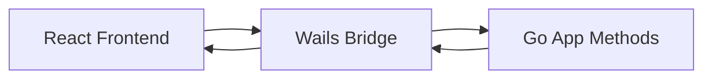
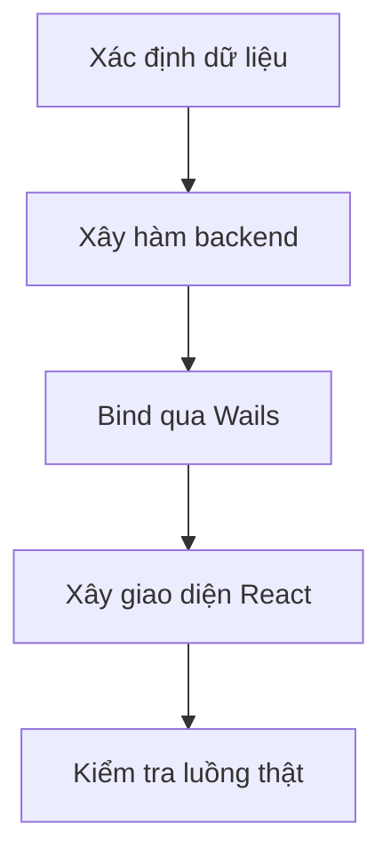
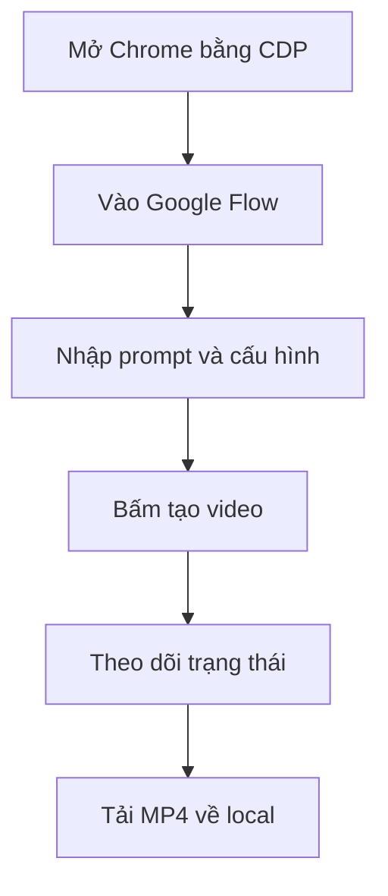
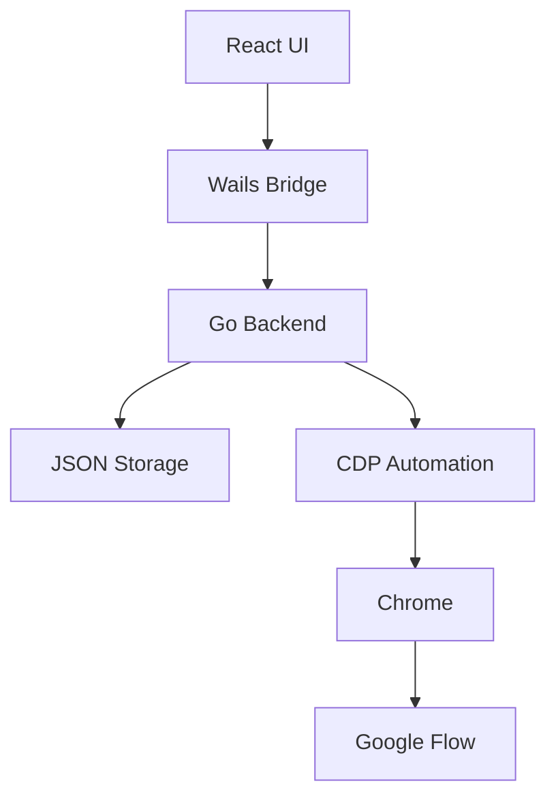
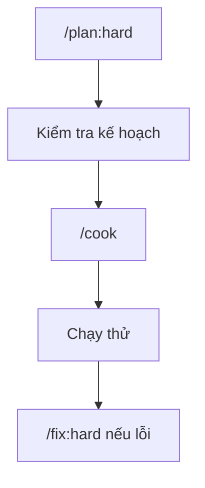
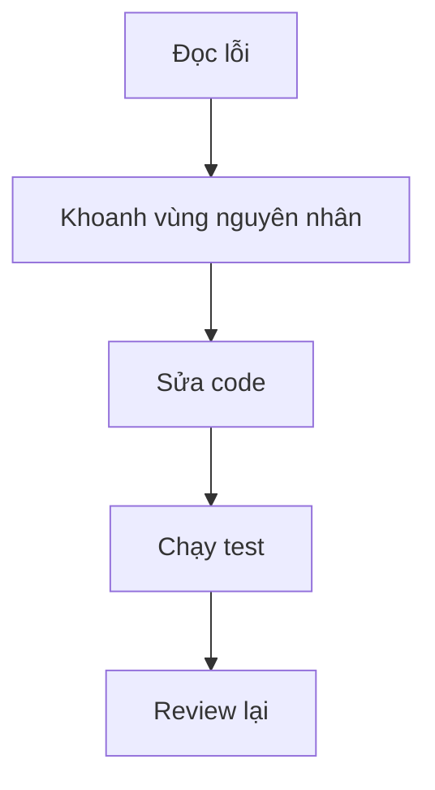
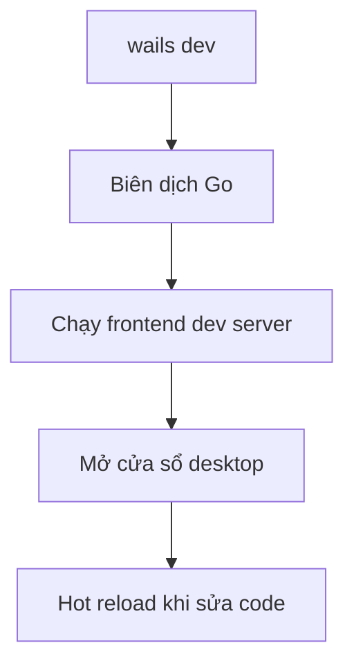

# Chương 06: Xây App Desktop Đầu Tiên

## Mục Tiêu Chương

Sau chương này, bạn sẽ:

* Hiểu tư duy **“Dữ liệu trước, giao diện sau”** khi làm việc với AI.
* Khởi tạo được dự án Wails cho ứng dụng desktop **Veo3 Manager**.
* Hiểu cách **Go backend** và **React frontend** giao tiếp với nhau qua Wails.
* Xây dựng cấu trúc dữ liệu video và lưu trữ bằng file JSON.
* Tích hợp Google Flow vào app desktop thông qua **CDP Browser Automation**.
* Xây giao diện CRUD cơ bản cho Veo3 Manager.
* Biết workflow làm việc với ClaudeSuperKit: `/plan:hard` → `/cook` → `/fix:hard`.
* Chạy thử app bằng `wails dev` và kiểm tra kết quả thật trên desktop.

---

## Tổng Quan Chương

Ở chương trước, bạn đã làm quen với việc tạo landing page bằng React. Đó là bước đầu để hiểu cách prompt AI xây giao diện.

Chương này nâng cấp lên một sản phẩm thật hơn: **desktop app Veo3 Manager**.

Ứng dụng này cho phép người dùng:

* Nhập prompt tạo video.
* Lưu danh sách video vào local.
* Quản lý trạng thái video.
* Điều khiển trình duyệt Chrome bằng CDP để thao tác với Google Flow.
* Tải video MP4 về máy.
* Xem lại lịch sử video đã tạo.

Tư duy chính của chương này là:

> Không bắt đầu bằng giao diện.
> Hãy bắt đầu bằng dữ liệu, luồng xử lý, rồi mới dựng giao diện.

---

## 1. Khởi Tạo Dự Án Wails

Trong terminal của Cursor, chạy:

```bash
wails init -n veo3-manager -t react-ts
cd veo3-manager
```

Lệnh này tạo ra một dự án desktop dùng:

* Go cho backend.
* React + TypeScript cho frontend.
* Wails làm cầu nối giữa backend và frontend.

Cấu trúc ban đầu:

```text
veo3-manager/
├── app.go              -> Logic chính của backend Go
├── main.go             -> Điểm khởi động ứng dụng
├── frontend/           -> Dự án React + TypeScript
│   ├── src/
│   └── package.json
├── wails.json          -> Cấu hình Wails
└── data/               -> Dữ liệu local, sẽ được tạo thêm
```

---

## 2. Cách Go Và React Giao Tiếp Qua Wails

Wails cho phép frontend React gọi trực tiếp các hàm Go đã được bind vào struct `App`.



Ví dụ:

Backend Go có hàm:

```go
func (a *App) GetVideoList() []Video {
    return videos
}
```

Frontend TypeScript có thể gọi:

```ts
const videos = await GetVideoList()
```

Điểm quan trọng là frontend không cần tự mở HTTP API như web app thông thường. Wails đã tạo bridge để React gọi Go như gọi hàm local.

---

## 3. Tư Duy Dữ Liệu Trước, Giao Diện Sau

Khi xây app với AI, nếu bạn yêu cầu AI dựng giao diện ngay từ đầu, rất dễ gặp tình trạng:

* Giao diện đẹp nhưng không có dữ liệu thật.
* Button bấm được nhưng không lưu gì.
* State frontend không khớp backend.
* Sau này phải sửa lại nhiều.

Vì vậy, thứ tự đúng nên là:



Với Veo3 Manager, dữ liệu trung tâm là `Video`.

Một video cần có:

| Trường           | Ý nghĩa                            |
| ---------------- | ---------------------------------- |
| `id`             | Mã định danh video                 |
| `title`          | Tiêu đề video                      |
| `prompt`         | Prompt dùng để tạo video           |
| `negativePrompt` | Nội dung muốn tránh, nếu có        |
| `status`         | Trạng thái xử lý                   |
| `aspectRatio`    | Tỷ lệ khung hình                   |
| `resolution`     | Độ phân giải                       |
| `duration`       | Thời lượng video                   |
| `tags`           | Nhãn phân loại                     |
| `videoPaths`     | Danh sách đường dẫn file MP4 local |
| `createdAt`      | Thời điểm tạo                      |
| `updatedAt`      | Thời điểm cập nhật                 |

Các trạng thái nên dùng:

| Status       | Ý nghĩa        |
| ------------ | -------------- |
| `pending`    | Đang chờ xử lý |
| `processing` | Đang tạo video |
| `completed`  | Đã hoàn thành  |
| `failed`     | Tạo thất bại   |

---

## 4. Google Flow Là Gì?

Google Flow là công cụ AI creative studio của Google, dùng model Veo để tạo video từ prompt văn bản.

Google Flow hỗ trợ:

* Text-to-video: nhập prompt, nhận video.
* Tỷ lệ khung hình: `16:9` hoặc `9:16`.
* Độ phân giải: `720p`, `1080p`, hoặc `4K`.
* Thời lượng: `4`, `6`, hoặc `8` giây.
* Âm thanh tự động phù hợp với nội dung video.

Các bước chuẩn bị:

1. Truy cập Google Flow.
2. Đăng nhập bằng tài khoản Google.
3. Kiểm tra credit còn lại.
4. Tạo thử một video thủ công để đảm bảo tài khoản hoạt động.

Lưu ý: thông tin về credit, gói trả phí và giới hạn sử dụng có thể thay đổi theo thời gian, nên khi quay bài học hoặc cập nhật giáo trình cần kiểm tra lại trên trang chính thức của Google.

---

## 5. CDP Browser Automation Là Gì?

CDP là viết tắt của **Chrome DevTools Protocol**.

Nó cho phép app điều khiển Chrome hoặc Chromium bằng code. Thay vì gọi API chính thức, app sẽ mở trình duyệt thật và thao tác trên giao diện Google Flow giống như người dùng.

Ví dụ app có thể tự động:

* Mở Chrome.
* Vào Google Flow.
* Kiểm tra trạng thái đăng nhập.
* Nhập prompt.
* Chọn tỷ lệ khung hình.
* Chọn độ phân giải.
* Bấm nút tạo video.
* Chờ video hoàn thành.
* Tải file MP4 về máy.

Luồng CDP Automation:



Ưu điểm:

* Không cần API key.
* Dùng được tài khoản Google đã đăng nhập.
* Tận dụng giao diện Google Flow như người dùng thật.
* Có thể tự động hóa toàn bộ quy trình tạo video.

Nhược điểm:

* Selector giao diện có thể thay đổi.
* Chrome phải được cài trên máy.
* Người dùng cần đăng nhập thủ công lần đầu.
* Nếu Google thay đổi UI, automation có thể lỗi.

Vì vậy, selector nên được tách ra file JSON riêng để dễ sửa mà không cần build lại app.

---

## 6. Kiến Trúc Veo3 Manager

Kiến trúc tổng quát:



Trong chương này, ta ưu tiên lưu trữ bằng JSON để dễ hiểu và dễ debug.

Không dùng database ở giai đoạn đầu. Lý do:

* JSON đủ đơn giản cho phiên bản đầu tiên.
* Dễ mở file kiểm tra bằng mắt.
* Phù hợp với người mới học app desktop.
* Giúp tập trung vào luồng dữ liệu và automation trước.

---

## 7. Prompt Backend: Xây Cấu Trúc Dữ Liệu Video

Dùng prompt sau với Claude Code:

```text
Hãy đóng vai Senior Go Developer đang làm việc với Wails.

Bối cảnh:
Dự án veo3-manager vừa được khởi tạo bằng:

wails init -n veo3-manager -t react-ts

Cần xây dựng phần lưu trữ dữ liệu video cho ứng dụng Veo3 Manager.

Yêu cầu:
- Tạo struct Video gồm các trường:
  ID, Title, Prompt, NegativePrompt, Status, AspectRatio,
  Resolution, Duration, Tags, VideoPaths, CreatedAt, UpdatedAt.
- Status chỉ nhận một trong bốn giá trị:
  pending, processing, completed, failed.
- Tạo hàm đọc danh sách video từ file data/videos.json.
- Tạo hàm lưu danh sách video vào file data/videos.json.
- Nếu file chưa tồn tại, tự tạo file với danh sách rỗng.
- Tạo hàm AddVideo để thêm video mới.
- Tạo hàm DeleteVideo để xóa video theo ID.
- Tạo hàm UpdateVideoStatus để cập nhật trạng thái video.
- Bind các hàm vào struct App để frontend gọi được qua Wails.

Tiêu chí hoàn thành:
- Chạy wails dev không báo lỗi biên dịch Go.
- File data/videos.json được tạo tự động nếu chưa tồn tại.
- Frontend có thể gọi GetVideoList và AddVideo qua Wails.
```

---

## 8. Prompt Frontend: Dựng Giao Diện Danh Sách Video

Sau khi backend đã có dữ liệu và hàm bind, mới yêu cầu AI dựng giao diện:

```text
Hãy đóng vai Senior React + TypeScript Developer.

Bối cảnh:
Backend Go đã có các hàm:
- GetVideoList()
- AddVideo(video)
- DeleteVideo(id)
- UpdateVideoStatus(id, status)

Các hàm này đã được bind qua Wails.

Yêu cầu:
- Tạo giao diện chính cho Veo3 Manager.
- App không có login, mở lên là vào thẳng màn hình chính.
- Có sidebar bên trái gồm:
  + Tạo Video Mới
  + Thư Viện Video
  + Cài Đặt
- Trang Tạo Video Mới gồm:
  + Textarea lớn nhập prompt
  + Textarea nhỏ nhập negative prompt
  + Chọn tỷ lệ khung hình: 16:9 hoặc 9:16
  + Chọn độ phân giải: 720p, 1080p, 4K
  + Chọn thời lượng: 4, 6, 8 giây
  + Ô nhập tags, phân cách bằng dấu phẩy
  + Nút Tạo Video
- Trang Thư Viện Video gồm:
  + Danh sách video dạng grid
  + Tìm kiếm theo prompt hoặc tags
  + Lọc theo trạng thái
  + Mỗi thẻ hiển thị prompt, status, tags, cấu hình, thời gian tạo
  + Nút xem chi tiết
  + Nút xóa có xác nhận
- Màu status:
  + pending: vàng
  + processing: xanh dương
  + completed: xanh lá
  + failed: đỏ
- Dùng Tailwind CSS để trình bày gọn gàng.
- Dùng Zustand cho state management.
- Dùng sonner cho toast notifications, không dùng react-hot-toast.

Tiêu chí hoàn thành:
- Thêm video mới thì video xuất hiện ngay trong thư viện.
- Filter và search hoạt động đúng.
- Xóa video có xác nhận.
- Giao diện không có login/authentication.
```

---

## 9. Workflow ClaudeSuperKit

Trong chương này, ta dùng workflow:



Ba lệnh chính:

| Lệnh         | Mục đích                                  |
| ------------ | ----------------------------------------- |
| `/plan:hard` | Lập kế hoạch kỹ thuật trước khi viết code |
| `/cook`      | Triển khai tính năng theo kế hoạch        |
| `/fix:hard`  | Phân tích nguyên nhân gốc và sửa lỗi      |

---

## 10. `/plan:hard`: Lập Kế Hoạch Dự Án

Trước khi viết code, dùng `/plan:hard` để Claude phân tích yêu cầu.

Prompt mẫu:

```text
/plan:hard Xây dựng desktop app Windows tự động tạo video AI hàng loạt từ Google Flow.

User nhập danh sách prompt, bấm Start, app tự lần lượt gửi prompt,
chờ video tạo xong, tải về máy. App hoạt động sau khi user đăng nhập Google lần đầu.

## Tech stack

Go + Wails v2.
React + TypeScript + Vite + Tailwind CSS.
Zustand cho state management.
Sonner cho toast notification.
go-rod/rod và go-rod/stealth cho Chrome automation qua CDP.
Lưu dữ liệu local bằng JSON, không dùng database ở phiên bản đầu.

## Yêu cầu chính

- Quản lý danh sách video.
- Mỗi video có prompt, negative prompt, status, cấu hình tạo video, tags, đường dẫn file MP4.
- Có giao diện tạo video mới.
- Có thư viện video.
- Có trang cài đặt Chrome/CDP.
- Queue có thể chạy tuần tự.
- Có thể pause, resume, stop.
- Config thay đổi trên UI có hiệu lực ở task tiếp theo.
- Không có login trong app.

## CDP Automation

Google Flow không có public API ổn định cho app này.
App cần điều khiển Chrome thật qua CDP.

Yêu cầu:
- Chrome chạy với remote debugging port.
- Có user-data-dir riêng để lưu session đăng nhập.
- Nếu chưa đăng nhập Google Flow, thông báo user đăng nhập thủ công.
- Tách selector Google Flow ra file JSON.
- Có timeout khi chờ video.
- Khi video hoàn thành, tải MP4 về local.
- Lưu đường dẫn file MP4 vào metadata JSON.

## Giao diện

App gồm 3 trang:
- Tạo Video Mới
- Thư Viện Video
- Cài Đặt

Yêu cầu Claude lập kế hoạch theo phase.
Không viết code ở bước này.
Không dùng SQLite.
Không thêm login/authentication.
```

Sau khi `/plan:hard` chạy xong, kiểm tra kế hoạch:

* Có đúng Wails không?
* Có đúng React + TypeScript không?
* Có đúng lưu JSON không?
* Có tránh login/authentication không?
* Có CDP Browser Automation không?
* Có tách selector config không?
* Có xử lý timeout và lỗi không?

Nếu kế hoạch sai, yêu cầu Claude sửa kế hoạch trước khi dùng `/cook`.

---

## 11. `/cook`: Xây Giao Diện Hoàn Chỉnh

Khi kế hoạch đã ổn, dùng `/cook` để triển khai.

Prompt mẫu:

```text
/cook Xây toàn bộ giao diện cho Veo3 Manager.

Đọc code hiện tại để hiểu backend Wails, cấu trúc dữ liệu JSON,
và các hàm đã bind từ Go sang frontend.

App KHÔNG có login/authentication.

## Bố cục chính

- App mở lên là vào thẳng giao diện chính.
- Sidebar bên trái, cao toàn màn hình.
- Menu gồm:
  + Tạo Video Mới
  + Thư Viện Video
  + Cài Đặt
- Nội dung chính bên phải có nền xám nhạt và padding hợp lý.

## Trang Tạo Video Mới

- Tiêu đề: "Tạo Video Mới".
- Textarea lớn nhập prompt.
- Textarea nhỏ nhập negative prompt.
- Chọn tỷ lệ khung hình:
  + 16:9 Ngang
  + 9:16 Dọc
- Chọn độ phân giải:
  + 720p
  + 1080p
  + 4K
- Chọn thời lượng:
  + 4 giây
  + 6 giây
  + 8 giây
- Ô nhập tags, phân cách bằng dấu phẩy.
- Nút "Tạo Video".
- Kiểm tra prompt không rỗng trước khi gửi.
- Nếu CDP chưa kết nối, hiện cảnh báo kèm link sang trang Cài Đặt.
- Sau khi gửi, nút chuyển sang trạng thái loading.
- Hiển thị trạng thái automation theo thời gian thực:
  + Đang mở trình duyệt...
  + Đang nhập prompt...
  + Đang chờ video...
  + Đang tải video...
  + Hoàn thành

## Trang Thư Viện Video

- Tiêu đề: "Thư Viện Video" kèm số lượng video.
- Có dropdown lọc trạng thái:
  + Tất cả
  + Đang chờ
  + Đang tạo
  + Hoàn thành
  + Lỗi
- Có ô tìm kiếm theo prompt hoặc tags.
- Hiển thị dạng grid:
  + 3 cột trên màn hình lớn
  + 2 cột trên màn hình trung bình
  + 1 cột trên màn hình nhỏ
- Mỗi thẻ video gồm:
  + Prompt rút gọn
  + Status badge có màu
  + Tags
  + Aspect ratio
  + Resolution
  + Duration
  + CreatedAt
  + Nút Xem chi tiết
  + Nút Xóa có xác nhận
- Khi trống, hiện:
  "Chưa có video nào"
  và nút "Tạo Video Đầu Tiên".

## Trang Cài Đặt

- Cấu hình CDP Browser:
  + Ô nhập đường dẫn Chrome/Chromium
  + Ô nhập CDP port, mặc định 9222
  + Nút "Kiểm tra kết nối"
  + Hiển thị kết quả thành công/thất bại
- Selector Config:
  + Hiển thị đường dẫn file selector config JSON
  + Nút mở file selector config
- Thư mục lưu video:
  + Ô nhập đường dẫn thư mục lưu MP4
  + Nút chọn thư mục bằng native dialog
- Nút "Lưu" ghi cấu hình vào config JSON.

## Yêu cầu kỹ thuật

- Dùng Zustand.
- Dùng sonner.
- Tách component rõ ràng.
- Không dùng react-hot-toast.
- Không thêm login.
- Không dùng database.
- Báo cáo tiến độ sau mỗi phần.
```

Nếu `/cook` bị gián đoạn, nhắn tiếp:

```text
Tiếp tục từ bước đang dở. Đọc code hiện tại rồi hoàn thiện phần còn thiếu.
```

---

## 12. `/fix:hard`: Xử Lý Lỗi Phát Sinh

Sau khi `/cook`, app gần như chắc chắn sẽ có lỗi. Đây là bình thường.

Các lỗi thường gặp:

| Lỗi                                  | Nguyên nhân phổ biến                            |
| ------------------------------------ | ----------------------------------------------- |
| CDP không kết nối được Chrome        | Chrome chưa cài, sai đường dẫn, port bị chiếm   |
| Selector không tìm thấy element      | Google Flow thay đổi giao diện                  |
| Polling không dừng                   | Thiếu timeout hoặc goroutine không thoát        |
| Tải video thất bại                   | URL hết hạn, cookie thiếu, Chrome chặn download |
| File JSON ghi sai                    | Sai đường dẫn dev/prod hoặc thiếu quyền ghi     |
| Trình duyệt yêu cầu đăng nhập lại    | Session Google hết hạn                          |
| UI không cập nhật sau khi thêm video | State frontend chưa refresh đúng                |
| Status hiển thị sai màu              | Mapping status chưa đồng bộ                     |

Prompt mẫu:

```text
/fix:hard Ứng dụng Veo3 Manager gặp lỗi sau:

[Mô tả lỗi]

Log terminal:
[Paste log nếu có]

Hành vi mong muốn:
[Mô tả app đúng ra phải làm gì]

Hãy:
- Phân tích nguyên nhân gốc.
- Xác định file và dòng code liên quan.
- Sửa lỗi.
- Chạy thử sau khi sửa.
- Đảm bảo bản sửa không gây lỗi mới.
```

Workflow của `/fix:hard`:



Nếu lỗi quá phức tạp, có thể dùng lại `/cook` để viết lại riêng phần đó:

```text
/cook Viết lại phần polling trạng thái video.
Phần hiện tại bị lỗi polling không dừng sau timeout.

Yêu cầu:
- Poll mỗi 10 giây.
- Timeout sau 5 phút.
- Nếu thành công thì cập nhật completed.
- Nếu lỗi thì cập nhật failed.
- Không để goroutine chạy mãi.
```

---

## 13. Chạy Thử Ứng Dụng

Chạy app bằng:

```bash
wails dev
```

Lệnh này sẽ:



Khác với landing page, lần này bạn đang chạy một ứng dụng desktop thật, không chỉ là trang web trong trình duyệt.

---

## 14. Checklist Nghiệm Thu

### Kiểm Tra Wails

```text
[ ] wails dev chạy không lỗi biên dịch Go
[ ] Cửa sổ desktop mở lên thành công
[ ] App vào thẳng giao diện chính, không có login
[ ] Sidebar hiển thị đủ 3 trang
```

### Kiểm Tra File JSON

```text
[ ] File data/videos.json được tạo tự động
[ ] File chứa danh sách rỗng khi chưa có video
[ ] Thêm video mới thì JSON có dữ liệu
[ ] Xóa video thì JSON được cập nhật
[ ] App restart vẫn đọc lại được dữ liệu cũ
```

### Kiểm Tra Trang Tạo Video

```text
[ ] Textarea prompt hoạt động
[ ] Không cho tạo video nếu prompt rỗng
[ ] Chọn aspect ratio hoạt động
[ ] Chọn resolution hoạt động
[ ] Chọn duration hoạt động
[ ] Tags được parse đúng theo dấu phẩy
[ ] Bấm Tạo Video thì video mới xuất hiện trong thư viện
```

### Kiểm Tra CDP Browser Automation

```text
[ ] Trang Cài Đặt có nút Kiểm tra kết nối
[ ] Chrome mở được với remote debugging port
[ ] App báo kết nối CDP thành công
[ ] Nếu chưa đăng nhập Google Flow, app yêu cầu đăng nhập thủ công
[ ] Sau khi đăng nhập, session được giữ lại cho lần sau
```

### Kiểm Tra Luồng Tạo Video

```text
[ ] App hiển thị trạng thái: Đang mở trình duyệt
[ ] App hiển thị trạng thái: Đang nhập prompt
[ ] App hiển thị trạng thái: Đang chờ video
[ ] App hiển thị trạng thái: Đang tải video
[ ] Video hoàn thành thì status chuyển completed
[ ] File MP4 được tải về thư mục local
[ ] Đường dẫn MP4 được lưu vào JSON
[ ] Nếu lỗi thì status chuyển failed và có thông báo lỗi
```

### Kiểm Tra Thư Viện Video

```text
[ ] Hiển thị đúng số lượng video
[ ] Search theo prompt hoạt động
[ ] Search theo tags hoạt động
[ ] Filter theo status hoạt động
[ ] Status badge hiển thị đúng màu
[ ] Xóa video có xác nhận
[ ] Trạng thái trống hiển thị "Chưa có video nào"
```

### Kiểm Tra Selector Config

```text
[ ] File selector config JSON tồn tại
[ ] Trang Cài Đặt hiển thị đường dẫn selector config
[ ] Có thể mở file selector config để chỉnh sửa
[ ] App đọc selector từ config thay vì hardcode toàn bộ trong code
```

---

## 15. Điều Cần Ghi Nhớ

* Wails giúp xây desktop app bằng Go + React mà không cần Electron.
* Frontend React có thể gọi hàm Go thông qua Wails Bridge.
* Khi làm app với AI, nên đi theo thứ tự: dữ liệu → backend → bridge → frontend → kiểm thử.
* Với app automation, không nên hardcode selector trực tiếp trong logic chính.
* CDP mạnh nhưng dễ hỏng nếu giao diện web bên ngoài thay đổi.
* JSON là lựa chọn tốt cho phiên bản đầu vì dễ đọc, dễ kiểm tra, dễ debug.
* `/plan:hard` dùng để lập kế hoạch, không viết code.
* `/cook` dùng để triển khai tính năng.
* `/fix:hard` dùng để phân tích nguyên nhân gốc và sửa lỗi.

---

## Tóm Tắt Chương

Chương này đánh dấu bước chuyển từ landing page sang ứng dụng desktop thật.

Bạn đã học cách khởi tạo dự án Wails, hiểu cơ chế giao tiếp giữa Go và React, thiết kế cấu trúc dữ liệu video, lưu trữ bằng JSON, xây giao diện CRUD cho Veo3 Manager và chuẩn bị nền tảng CDP Browser Automation để tự động hóa Google Flow.

Quan trọng hơn, bạn đã học một workflow làm việc thực tế với AI:

```text
/plan:hard -> kiểm duyệt kế hoạch -> /cook -> chạy thử -> /fix:hard
```

Từ chương sau, khi app bắt đầu phát sinh lỗi thật, bạn sẽ học kỹ hơn về **reverse debugging**: cách lần ngược từ triệu chứng về nguyên nhân gốc để sửa lỗi có hệ thống.
