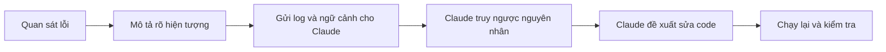
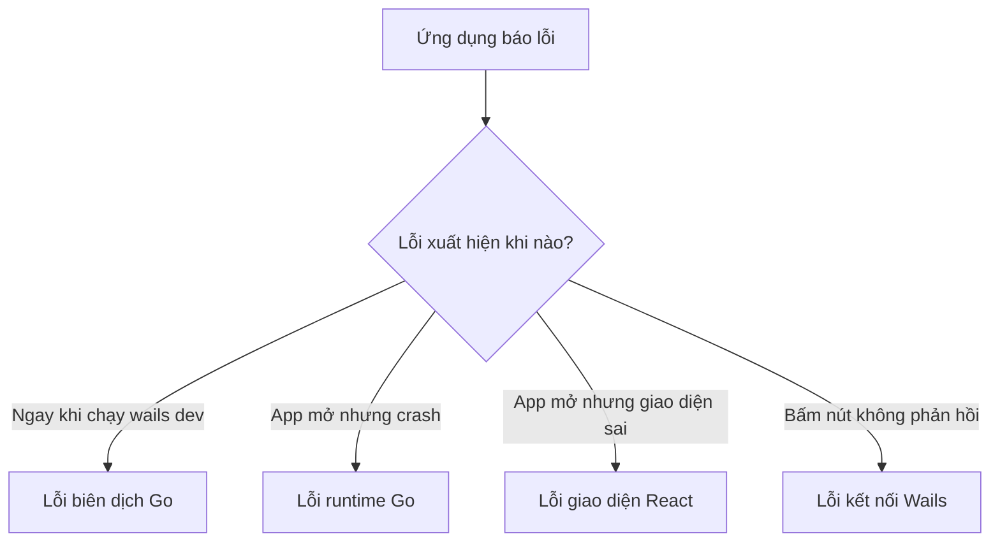
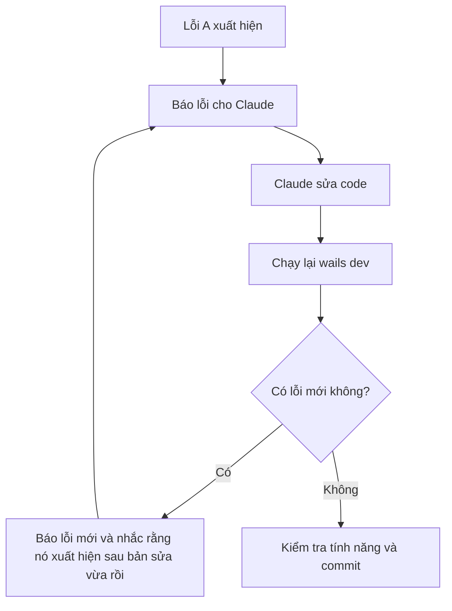

# Chương 07: Cách Xử Lý Lỗi - Reverse Debugging

## Mục Tiêu Chương

Sau chương này, bạn sẽ:

- Hiểu khái niệm **reverse debugging** khi làm việc với AI.
- Biết cách phân loại lỗi trong dự án **Veo3 Manager**.
- Biết cách báo lỗi cho Claude để AI sửa đúng chỗ.
- Biết xử lý khi AI sửa lỗi này nhưng lại phát sinh lỗi khác.
- Biết dùng Git để quay lại trạng thái an toàn khi debug bị rối.

---

## 1. Reverse Debugging Là Gì?

Trong lập trình truyền thống, bạn thường debug theo hướng:

```text
Đọc code -> Đoán nguyên nhân -> Kiểm tra -> Sửa lỗi
````

Nhưng trong **Vibe Coding**, bạn có thể xử lý lỗi theo hướng ngược lại:

```text
Quan sát hiện tượng -> Mô tả rõ cho AI -> AI truy ngược nguyên nhân -> AI đề xuất cách sửa
```

Đây chính là **reverse debugging**.

Bạn không cần tự đọc toàn bộ code Go, React hay Wails để tìm lỗi. Việc quan trọng nhất của bạn là **mô tả chính xác điều đang xảy ra**.



---

## 2. Bốn Nhóm Lỗi Thường Gặp Trong Veo3 Manager

Khi xây app desktop bằng **Wails + Go + React**, lỗi thường rơi vào 4 nhóm chính:

| Nhóm lỗi            | Dấu hiệu nhận biết                                             | Nơi thường gặp                            |
| ------------------- | -------------------------------------------------------------- | ----------------------------------------- |
| Lỗi biên dịch Go    | Chạy `wails dev` là báo lỗi, app không mở được                 | File `.go`, sai cú pháp, sai kiểu dữ liệu |
| Lỗi runtime Go      | App mở được nhưng bị crash hoặc xử lý sai                      | Đọc/ghi JSON, logic backend               |
| Lỗi giao diện React | App mở được nhưng giao diện sai, lệch layout, trắng trang      | Component React, CSS, Tailwind, props     |
| Lỗi kết nối Wails   | Bấm nút không phản hồi, frontend gọi backend không có tác dụng | Binding Wails, tên hàm, generated API     |



---

## 3. Công Thức Báo Lỗi Chuẩn Cho Claude

Lỗi phổ biến nhất của người mới là chỉ copy **dòng lỗi đỏ cuối cùng**. Thường như vậy là chưa đủ.

Hãy báo lỗi theo công thức sau:

```text
[HIỆN TƯỢNG]
Mô tả chính xác điều bạn nhìn thấy.

[THAO TÁC ĐÃ LÀM]
Liệt kê các bước trước khi lỗi xuất hiện.

[THÔNG BÁO LỖI]
Dán toàn bộ lỗi trong Terminal hoặc Console.

[CODE LIÊN QUAN]
Dán đoạn code đang làm việc, nếu có.

[KẾT QUẢ MONG ĐỢI]
Mô tả điều đáng lẽ phải xảy ra.
```

Ví dụ:

```text
[HIỆN TƯỢNG]
Bấm nút "Thêm Video Mới" nhưng danh sách video không cập nhật.

[THAO TÁC ĐÃ LÀM]
1. Mở app bằng wails dev
2. Nhập Title và Prompt
3. Bấm nút "Thêm Video Mới"

[THÔNG BÁO LỖI]
Terminal báo:
panic: runtime error: invalid memory address or nil pointer dereference

[CODE LIÊN QUAN]
Đây là hàm AddVideo hiện tại: ...

[KẾT QUẢ MONG ĐỢI]
Video mới phải xuất hiện ngay trong bảng danh sách.
```

---

## 4. Ba Trường Hợp Lỗi Thường Gặp

### Trường hợp 1: App báo lỗi đỏ hoặc bị sập

Đây là lỗi dễ báo nhất vì có log rõ ràng.

Prompt nên dùng:

```text
Tôi gặp lỗi khi chạy ứng dụng Veo3 Manager.

Đây là toàn bộ thông báo lỗi:
[Dán toàn bộ log lỗi]

Đây là đoạn code liên quan:
[Dán code]

Hãy tìm nguyên nhân thật sự và sửa code giúp tôi.
```

---

### Trường hợp 2: Code chạy được nhưng kết quả sai

Trường hợp này khó hơn vì không có lỗi đỏ để copy.

Bạn cần mô tả theo dạng:

```text
Đầu vào của tôi là X.
Kết quả tôi mong muốn là Y.
Nhưng hiện tại chương trình đang trả về Z.

Hãy kiểm tra đoạn code sau, tìm nguyên nhân và sửa lại cho đúng.
```

Ví dụ:

```text
Đầu vào của tôi là video title = "Demo Veo3" và status = "draft".

Kết quả mong muốn:
Video được thêm vào danh sách với trạng thái draft.

Kết quả hiện tại:
Video được thêm nhưng status bị rỗng.

Hãy kiểm tra logic lưu video trong đoạn code sau và sửa lại.
```

---

### Trường hợp 3: AI viết ra code không tồn tại

Đôi khi Claude gọi một hàm hoặc import một package không có thật trong dự án.

Ví dụ lỗi:

```text
undefined: SaveVideoToDatabase
```

Cách phản hồi:

```text
Hàm SaveVideoToDatabase không tồn tại trong dự án hiện tại.
Hãy kiểm tra lại codebase và viết lại bằng hàm/thư viện đang có sẵn.
Nếu cần tạo hàm mới, hãy giải thích rõ nên đặt ở file nào.
```

---

## 5. Vì Sao Không Nên Tự Đoán Nguyên Nhân

Một lỗi rất thường gặp là tự đoán nguyên nhân rồi yêu cầu Claude sửa theo hướng đó.

Không nên viết:

```text
Chắc do file JSON bị lỗi, sửa file JSON giúp tôi.
```

Nên viết:

```text
Khi tôi bấm nút "Thêm Video Mới", app không cập nhật danh sách.
Terminal hiện lỗi như sau: ...
Hãy kiểm tra nguyên nhân thật sự trong codebase.
```

Bạn nên mô tả **sự thật quan sát được**, không nên ép AI đi theo một giả thuyết chưa chắc đúng.

> Việc của bạn là mô tả triệu chứng. Việc của AI là truy ngược nguyên nhân.

---

## 6. Khi Claude Sửa Lỗi Này Nhưng Phát Sinh Lỗi Khác

Đây là chuyện rất bình thường khi dùng AI agent.

Luồng xử lý nên như sau:



Prompt nên dùng:

```text
Sau khi sửa lỗi trước đó, hiện tại xuất hiện lỗi mới.

Lỗi trước đó là:
[Mô tả ngắn lỗi cũ]

Lỗi mới là:
[Dán toàn bộ lỗi mới]

Hãy kiểm tra xem lỗi mới có phải do thay đổi vừa rồi gây ra không,
và sửa theo cách ít ảnh hưởng nhất đến phần code khác.
```

---

## 7. Dùng Lệnh `/fix:hard` Cho Lỗi Phức Tạp

Khi bạn đã thử báo lỗi vài lần nhưng vẫn chưa sửa được, có thể dùng lệnh dạng:

```text
/fix:hard [Mô tả chi tiết lỗi đang gặp]
```

Ví dụ:

```text
/fix:hard App Veo3 Manager chạy được nhưng khi bấm nút thêm video thì không lưu vào file JSON.
Tôi đã thử sửa nhiều lần nhưng vẫn phát sinh lỗi mới.
Hãy tự điều tra nguyên nhân, sửa code và chạy kiểm tra cho đến khi tính năng hoạt động.
```

Khi dùng dạng này, bạn đang yêu cầu Claude làm sâu hơn:

* Tự đọc codebase.
* Tự tìm nguyên nhân.
* Tự sửa code.
* Tự chạy lại kiểm tra.
* Không chỉ sửa theo một dòng lỗi đơn lẻ.

---

## 8. Thoát Khỏi Vòng Lặp “Sửa Mãi Không Xong”

Đôi khi bạn sẽ gặp vòng lặp:

```text
Dán lỗi -> AI sửa -> Chạy lại -> Lỗi mới -> AI sửa tiếp -> Lỗi khác nữa
```

Khi đó, đừng tiếp tục dán lỗi vô hạn. AI có thể đang bị rối ngữ cảnh.

Hãy làm 3 bước:

### Bước 1: Quay lại code sạch

Trước khi quay lại, kiểm tra trạng thái Git:

```bash
git status
```

Nếu bạn chắc chắn muốn bỏ các thay đổi chưa commit:

```bash
git checkout -- .
```

Hoặc với Git mới:

```bash
git restore .
```

### Bước 2: Mở chat mới

Bắt đầu một cuộc trò chuyện mới để AI không bị ảnh hưởng bởi các hướng sửa sai trước đó.

### Bước 3: Đổi cách tiếp cận

Thay vì nói “sửa tiếp lỗi này”, hãy mô tả lại mục tiêu từ đầu:

```text
Tôi muốn làm tính năng thêm video vào Veo3 Manager.

Cách cũ đang bị lỗi liên tục khi lưu JSON.
Hãy kiểm tra code hiện tại và đề xuất một cách triển khai đơn giản, ổn định hơn.
Ưu tiên sửa ít file, dễ hiểu, dễ kiểm tra.
```

---

## 9. Dùng Git Để An Toàn Khi Debug

Trước khi để Claude sửa lỗi phức tạp, hãy commit trạng thái hiện tại.

```bash
git add .
git commit -m "Before debugging video creation bug"
```

Nếu bản sửa làm mọi thứ tệ hơn, bạn có thể quay lại trạng thái sạch.

```bash
git checkout -- .
```

Nguyên tắc quan trọng:

```text
Không để AI sửa lỗi phức tạp trên một codebase chưa có điểm quay lại an toàn.
```

Git giống như “nút quay về” trong quá trình vibe coding. Bạn càng dùng Git tốt, bạn càng dám thử nghiệm nhiều hơn.

---

## 10. Checklist Báo Lỗi Nhanh

Trước khi gửi lỗi cho Claude, hãy kiểm tra:

* Đã copy toàn bộ lỗi chưa?
* Đã nói rõ lỗi xảy ra khi làm thao tác nào chưa?
* Đã mô tả kết quả mong muốn chưa?
* Đã gửi code liên quan chưa?
* Đã nói rõ lỗi xuất hiện sau thay đổi nào chưa?
* Đã commit code trước khi sửa lỗi lớn chưa?

---

## Điều Cần Ghi Nhớ

* **Reverse debugging** là đi từ hiện tượng lỗi về nguyên nhân.
* Bạn không cần tự đoán nguyên nhân trước khi hỏi AI.
* Hãy mô tả lỗi bằng dữ kiện thật: thao tác, log, code, kết quả mong muốn.
* Với lỗi không có log, hãy mô tả đầu vào, kết quả mong muốn và kết quả thực tế.
* Nếu AI gọi hàm không tồn tại, hãy yêu cầu AI kiểm tra lại codebase.
* Nếu sửa mãi không xong, hãy quay lại code sạch, mở chat mới và đổi cách làm.
* Luôn dùng Git trước khi để AI sửa lỗi phức tạp.

---

## Tóm Tắt Chương

Trong chương này, bạn đã học cách xử lý lỗi theo tư duy **reverse debugging**: quan sát hiện tượng thật, mô tả rõ ràng cho AI, sau đó để Claude truy ngược nguyên nhân và đề xuất cách sửa.

Khi xây dựng **Veo3 Manager**, lỗi có thể đến từ Go, React, Wails hoặc dữ liệu JSON. Thay vì hoảng hoặc đoán mò, bạn chỉ cần báo lỗi theo công thức chuẩn: **hiện tượng, thao tác đã làm, thông báo lỗi, code liên quan và kết quả mong đợi**.

Kỹ năng báo lỗi tốt sẽ giúp Claude sửa nhanh hơn, ít phá code hơn và giúp bạn kiểm soát quá trình vibe coding một cách an toàn hơn.
