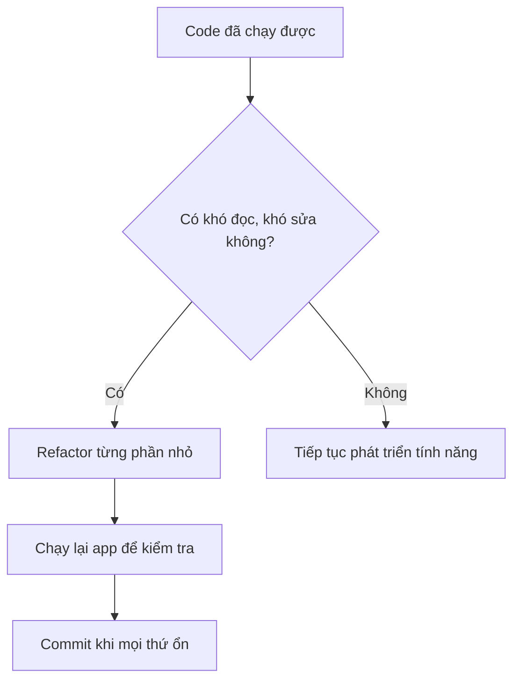
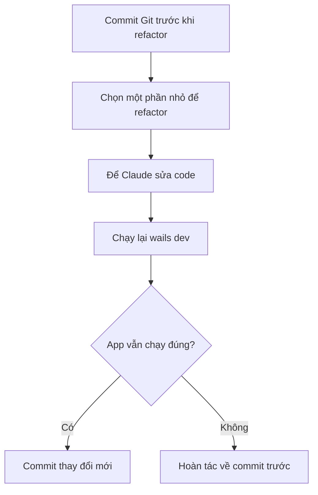
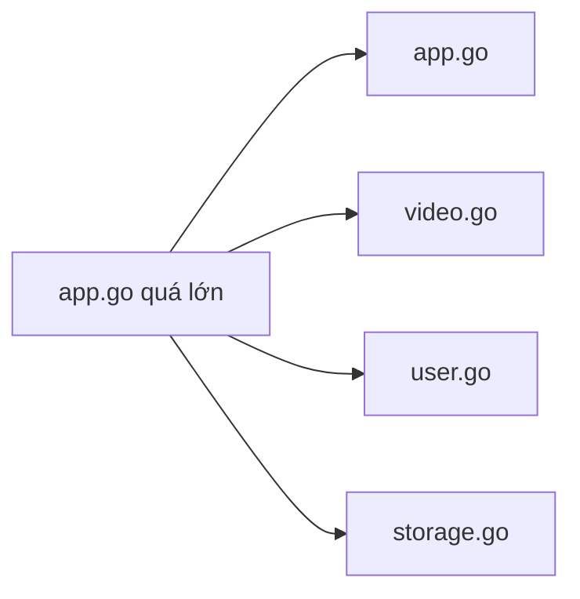
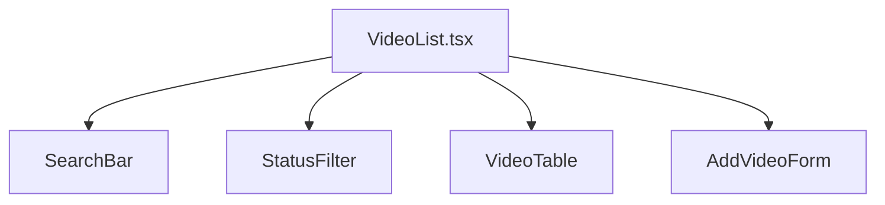

# Chương 08: Refactor Và Tối Ưu

## Mục Tiêu Chương

Sau chương này, bạn sẽ:

- Hiểu vì sao cần refactor sau khi đã có phiên bản chạy được của **Veo3 Manager**.
- Biết cách yêu cầu Claude refactor an toàn, từng phần nhỏ.
- Nắm được 5 kỹ thuật refactor cơ bản: tách file, làm phẳng điều kiện, trích xuất hàm, đặt tên rõ ràng, loại bỏ code chết.
- Biết tối ưu hiệu năng cơ bản cho backend Go và frontend React.
- Biết dùng AI để code review, tìm lỗi tiềm ẩn và cải thiện chất lượng codebase.

---

## 1. Vì Sao Cần Refactor?

Ở các chương trước, bạn đã xây được phiên bản đầu tiên của **Veo3 Manager**. Mục tiêu ban đầu là: **chạy được trước**.

Nhưng code do AI tạo nhanh thường có một số vấn đề:

- File quá dài, ví dụ `app.go` chứa quá nhiều logic.
- Component React quá lớn, khó đọc và khó sửa.
- Logic bị lặp lại ở nhiều nơi.
- Tên biến, tên hàm còn chung chung.
- Một hàm làm quá nhiều việc cùng lúc.
- Càng thêm tính năng mới càng dễ phát sinh lỗi.

```text
Refactor không phải là sửa lỗi.

Refactor là sắp xếp lại cấu trúc bên trong của code
để code dễ đọc hơn, dễ sửa hơn, dễ mở rộng hơn,
nhưng không làm thay đổi hành vi bên ngoài của ứng dụng.
````

Nói đơn giản:

```text
Trước refactor: App chạy được nhưng code rối.
Sau refactor: App vẫn chạy như cũ nhưng code gọn hơn, dễ phát triển hơn.
```

---

## 2. Khi Nào Nên Refactor?

Bạn nên refactor khi gặp các dấu hiệu sau:

| Dấu hiệu                                 | Ý nghĩa                                      |
| ---------------------------------------- | -------------------------------------------- |
| Một file vượt quá 200 dòng               | File đang chứa quá nhiều trách nhiệm         |
| Một component React quá dài              | Giao diện nên được tách thành nhiều phần nhỏ |
| Có nhiều đoạn code giống nhau            | Nên trích xuất thành hàm dùng lại            |
| Hàm có nhiều `if-else` lồng nhau         | Nên làm phẳng logic bằng early return        |
| Tên biến như `data`, `temp`, `process`   | Tên chưa nói rõ mục đích                     |
| Sợ thêm tính năng mới vì dễ hỏng code cũ | Codebase cần được dọn lại trước khi mở rộng  |



---

## 3. Nguyên Tắc An Toàn Khi Refactor Bằng AI

Refactor bằng AI rất nhanh, nhưng nếu làm quá rộng trong một lần, AI có thể sửa lan sang nhiều phần không cần thiết.

Vì vậy hãy nhớ 3 nguyên tắc:

1. **Luôn commit Git trước khi refactor.**
2. **Refactor từng phần nhỏ, không yêu cầu viết lại toàn bộ dự án ngay.**
3. **Sau mỗi lần refactor, chạy lại app để kiểm tra tính năng cũ vẫn hoạt động.**



Lệnh Git nên dùng trước khi refactor:

```bash
git status
git add .
git commit -m "Before refactor"
```

Nếu refactor làm hỏng app và bạn muốn quay lại trạng thái trước đó:

```bash
git restore .
```

---

## 4. Năm Kỹ Thuật Refactor Cơ Bản

### 4.1. Tách File Lớn

Nếu `app.go` chứa tất cả logic như video, user, storage, config, thì file này sẽ rất khó bảo trì.

Trước refactor:

```text
app.go
- Struct App
- Logic thêm video
- Logic xóa video
- Logic tìm kiếm
- Logic user
- Logic đọc/ghi JSON
```

Sau refactor:

```text
app.go
video.go
user.go
storage.go
```



Prompt mẫu:

```text
Hãy đóng vai Senior Go Developer.

Bối cảnh:
File app.go của dự án Veo3 Manager hiện đang chứa quá nhiều logic:
xử lý video, xử lý user và đọc/ghi file JSON đều nằm chung một file.

Yêu cầu:
- Tách logic xử lý Video sang file video.go
- Tách logic xử lý User sang file user.go
- Tách logic đọc/ghi file JSON sang file storage.go
- Giữ nguyên tên các hàm đã được bind qua Wails
- Không đổi API mà frontend đang gọi
- app.go chỉ giữ struct App và các hàm khởi tạo cần thiết

Tiêu chí hoàn thành:
- wails dev chạy không lỗi
- Các tính năng cũ vẫn hoạt động như trước
- Không thay đổi hành vi bên ngoài của ứng dụng
```

---

### 4.2. Làm Phẳng Cấu Trúc Điều Kiện

Một lỗi phổ biến là code có quá nhiều `if-else` lồng nhau.

Ví dụ code khó đọc:

```go
func AddVideo(video Video) error {
    if video.Title != "" {
        if video.Prompt != "" {
            if video.Status != "" {
                return saveVideo(video)
            } else {
                return errors.New("status is required")
            }
        } else {
            return errors.New("prompt is required")
        }
    } else {
        return errors.New("title is required")
    }
}
```

Có thể refactor bằng **early return**:

```go
func AddVideo(video Video) error {
    if video.Title == "" {
        return errors.New("title is required")
    }

    if video.Prompt == "" {
        return errors.New("prompt is required")
    }

    if video.Status == "" {
        return errors.New("status is required")
    }

    return saveVideo(video)
}
```

Prompt mẫu:

```text
Hãy kiểm tra các hàm trong backend Go.
Nếu có hàm nào dùng nhiều if-else lồng nhau, hãy refactor bằng early return.

Yêu cầu:
- Không thay đổi logic nghiệp vụ
- Không đổi tên hàm public đang được frontend gọi
- Giải thích ngắn gọn trước khi sửa
```

---

### 4.3. Trích Xuất Hàm

Nếu một đoạn logic xuất hiện nhiều lần, hãy trích xuất thành hàm riêng.

Ví dụ:

```text
Nhiều nơi đều format video status:
- Nếu status = draft thì hiển thị "Bản nháp"
- Nếu status = rendering thì hiển thị "Đang render"
- Nếu status = done thì hiển thị "Hoàn tất"
```

Thay vì viết lặp lại nhiều lần, hãy tạo hàm:

```ts
function formatVideoStatus(status: VideoStatus): string {
  switch (status) {
    case "draft":
      return "Bản nháp";
    case "rendering":
      return "Đang render";
    case "done":
      return "Hoàn tất";
    default:
      return "Không xác định";
  }
}
```

Prompt mẫu:

```text
Hãy tìm các đoạn logic bị lặp lại trong frontend React và backend Go.

Yêu cầu:
- Nếu logic lặp lại từ 2 lần trở lên, hãy đề xuất trích xuất thành hàm riêng
- Tên hàm phải rõ nghĩa
- Không thay đổi hành vi hiện tại
- Sau khi sửa, liệt kê các đoạn code đã được thay thế
```

---

### 4.4. Đặt Lại Tên Biến Và Hàm

Tên biến tốt giúp code dễ hiểu hơn rất nhiều.

Tên chưa tốt:

```text
data
temp
item
process
handle
doThing
```

Tên tốt hơn:

```text
videos
draftVideo
selectedVideo
processRenderQueue
handleAddVideo
saveVideoToJsonFile
```

Prompt mẫu:

```text
Hãy rà soát tên biến và tên hàm trong dự án.

Yêu cầu:
- Tìm các tên quá chung chung như data, temp, item, process, handle
- Đề xuất tên mới rõ nghĩa hơn
- Chỉ đổi tên khi chắc chắn không làm thay đổi logic
- Đảm bảo đổi tên đầy đủ ở mọi nơi được sử dụng
```

---

### 4.5. Loại Bỏ Code Chết

Code chết là code không còn được sử dụng nhưng vẫn nằm trong dự án.

Ví dụ:

* Hàm cũ không còn được gọi.
* Component React không còn import ở đâu.
* Biến được khai báo nhưng không dùng.
* File cũ còn sót lại sau khi đổi cấu trúc.

Prompt mẫu:

```text
Hãy tìm code chết trong dự án Veo3 Manager.

Yêu cầu:
- Tìm hàm, biến, component hoặc file không còn được sử dụng
- Trước khi xóa, hãy liệt kê danh sách đề xuất xóa
- Chỉ xóa những phần chắc chắn không ảnh hưởng đến app
- Sau khi xóa, chạy kiểm tra để đảm bảo app vẫn hoạt động
```

---

## 5. Refactor Frontend React: Tách Component

Nếu `VideoList.tsx` chứa toàn bộ giao diện, file này sẽ rất khó mở rộng.

Trước refactor:

```text
VideoList.tsx
- Ô tìm kiếm
- Bộ lọc trạng thái
- Bảng danh sách video
- Form thêm video mới
- Logic gọi API
- Logic state
```

Sau refactor:

```text
VideoList.tsx
SearchBar.tsx
StatusFilter.tsx
VideoTable.tsx
AddVideoForm.tsx
```



Prompt mẫu:

```text
Hãy đóng vai Senior React Developer.

Bối cảnh:
File VideoList.tsx hiện đang chứa toàn bộ giao diện:
bảng danh sách, ô tìm kiếm, bộ lọc trạng thái và form thêm video mới.

Yêu cầu:
- Tách thành các component riêng:
  SearchBar, StatusFilter, VideoTable, AddVideoForm
- VideoList.tsx chỉ đóng vai trò component cha
- Truyền dữ liệu qua props
- Không dùng biến toàn cục
- Không thay đổi giao diện hiện tại

Tiêu chí hoàn thành:
- Giao diện hiển thị giống trước khi tách
- Mỗi component có trách nhiệm rõ ràng
- Code dễ đọc hơn trước
```

---

## 6. Tối Ưu Backend: Giảm Đọc/Ghi File JSON Thừa

Trong phiên bản đầu, mỗi thao tác có thể đang đọc lại toàn bộ file `videos.json` nhiều lần.

Ví dụ chưa tối ưu:

```text
Thêm video:
1. Đọc videos.json để kiểm tra dữ liệu
2. Đọc lại videos.json để lấy danh sách
3. Thêm video mới
4. Ghi lại videos.json
```

Tối ưu hơn:

```text
Thêm video:
1. Đọc videos.json một lần
2. Kiểm tra dữ liệu trên danh sách đã đọc
3. Thêm video mới
4. Ghi lại videos.json một lần
```

Prompt mẫu:

```text
Hãy kiểm tra storage.go và video.go.

Yêu cầu:
- Tìm nơi đang đọc hoặc ghi file videos.json nhiều lần không cần thiết
- Tối ưu để mỗi thao tác chỉ đọc file một lần nếu có thể
- Không thay đổi format dữ liệu JSON hiện tại
- Không làm hỏng dữ liệu cũ
- Giải thích ngắn gọn thay đổi trước khi áp dụng
```

---

## 7. Tối Ưu Frontend: Tránh Re-render Thừa

Trong React, một component có thể bị render lại dù dữ liệu của nó không thay đổi.

Ví dụ:

```text
Người dùng gõ vào ô tìm kiếm
-> State searchKeyword thay đổi
-> Toàn bộ VideoList render lại
-> VideoTable cũng render lại dù danh sách video chưa đổi
```

Có thể tối ưu bằng:

* Tách state tìm kiếm ra khỏi component bảng.
* Dùng `React.memo` cho component bảng.
* Dùng `useMemo` cho danh sách đã lọc.
* Tránh truyền function mới không cần thiết xuống component con.

Prompt mẫu:

```text
Hãy kiểm tra component VideoList và VideoTable.

Yêu cầu:
- Tìm các trường hợp component bị render lại không cần thiết
- Nếu phù hợp, dùng React.memo, useMemo hoặc tách state để tối ưu
- Không tối ưu quá mức nếu chưa cần thiết
- Giữ giao diện và hành vi giống như cũ
- Giải thích ngắn gọn trước khi sửa
```

---

## 8. Mega Prompt: Refactor Và Tối Ưu Toàn Diện

Khi dự án đã có commit an toàn, bạn có thể dùng mega prompt để Claude làm theo từng bước.

Lưu ý: Mega prompt nên dùng khi bạn đã có Git commit sạch. Nếu dự án đang lỗi, hãy sửa lỗi trước rồi mới refactor.

```text
Tôi muốn refactor và tối ưu toàn bộ dự án Veo3 Manager.

Hãy thực hiện tuần tự các bước sau:

1. TÁCH FILE LỚN
- Tìm các file mã nguồn vượt quá 200 dòng.
- Phân tích nội dung và chia nhỏ thành nhiều file riêng biệt theo chức năng.
- Ví dụ: file xử lý video riêng, file giao diện riêng, file đọc/ghi dữ liệu riêng.
- Đảm bảo code vẫn hoạt động sau khi tách.

2. LÀM PHẲNG CẤU TRÚC ĐIỀU KIỆN
- Tìm các hàm có if-else lồng nhau nhiều cấp.
- Viết lại bằng kỹ thuật early return.
- Đảm bảo chức năng không thay đổi.

3. TRÍCH XUẤT HÀM
- Tìm các đoạn logic lặp lại ở nhiều nơi.
- Trích xuất thành hàm riêng biệt với tên rõ nghĩa.
- Thay thế các đoạn code lặp bằng lời gọi đến hàm mới.

4. ĐẶT LẠI TÊN BIẾN VÀ HÀM
- Tìm các biến hoặc hàm có tên chung chung như data, process, init, temp.
- Đề xuất tên mới rõ ràng hơn.
- Thực hiện đổi tên trên toàn bộ dự án, đảm bảo không bỏ sót.

5. LOẠI BỎ CODE CHẾT
- Tìm hàm, biến, component hoặc đoạn code không được sử dụng.
- Liệt kê trước khi xóa.
- Chỉ xóa những phần chắc chắn không ảnh hưởng đến app.

6. TỐI ƯU HIỆU NĂNG
- Frontend React:
  + Tìm component bị render lại không cần thiết.
  + Tối ưu để chỉ render lại khi dữ liệu liên quan thay đổi.
  + Tải các phần nặng khi cần, không tải tất cả ngay lúc mở app.

- Backend Go:
  + Tối ưu đọc/ghi file JSON.
  + Giảm số lần truy cập file.
  + Tránh xử lý tác vụ nặng làm app bị đứng.

7. CODE REVIEW TỔNG THỂ
- Đánh giá toàn bộ code dựa trên:
  + Khả năng đọc
  + Khả năng bảo trì
  + Hiệu năng
  + Bảo mật
- Chỉ ra điểm mạnh, điểm yếu và đề xuất cải thiện cụ thể.
- Chấm điểm codebase trên thang 10 và giải thích lý do.

Yêu cầu làm việc:
- Báo cáo tiến độ từng bước.
- Sau mỗi bước lớn, hãy dừng lại tóm tắt thay đổi.
- Nếu phát hiện vấn đề nghiêm trọng, hãy dừng lại và giải thích trước khi tiếp tục.
- Không thay đổi hành vi bên ngoài của ứng dụng nếu không được yêu cầu.
```

---

## 9. Code Review Bằng AI

Ngoài refactor, bạn có thể yêu cầu Claude review code như một senior developer.

Prompt mẫu:

```text
Hãy đóng vai Senior Fullstack Developer và review dự án Veo3 Manager.

Tập trung vào:
- Bug tiềm ẩn
- Code khó bảo trì
- Logic bị lặp
- Component React quá lớn
- Hàm Go có quá nhiều trách nhiệm
- Rủi ro mất dữ liệu khi đọc/ghi JSON
- Điểm có thể tối ưu hiệu năng

Yêu cầu output:
- Liệt kê vấn đề theo mức độ nghiêm trọng: High, Medium, Low
- Ghi rõ file liên quan
- Giải thích vì sao đó là vấn đề
- Đề xuất cách sửa cụ thể
- Không sửa code ngay, chỉ review trước
```

---

## 10. Checklist Sau Refactor

Trước khi xem refactor là hoàn tất, hãy kiểm tra:

```text
[ ] Đã commit Git trước khi refactor
[ ] Refactor từng phần nhỏ, không gộp quá nhiều thay đổi
[ ] wails dev chạy không lỗi
[ ] Tính năng thêm video vẫn hoạt động
[ ] Tính năng xem danh sách video vẫn hoạt động
[ ] Tính năng tìm kiếm vẫn hoạt động
[ ] Tính năng lọc trạng thái vẫn hoạt động
[ ] Backend đã tách file rõ ràng hơn
[ ] Frontend đã tách component rõ ràng hơn
[ ] Không còn code chết dễ thấy
[ ] Không còn đoạn logic lặp lại không cần thiết
[ ] Đã commit sau khi xác nhận refactor thành công
```

---

## 11. Điều Cần Ghi Nhớ

* Refactor là cải thiện cấu trúc code, không phải đổi hành vi ứng dụng.
* Code do AI sinh ra thường chạy được trước, nhưng cần refactor để dễ bảo trì.
* Luôn commit trước khi refactor.
* Refactor từng phần nhỏ để dễ kiểm soát.
* Backend Go nên tách theo chức năng: `video.go`, `user.go`, `storage.go`.
* Frontend React nên tách theo component: `SearchBar`, `StatusFilter`, `VideoTable`, `AddVideoForm`.
* Tối ưu backend bằng cách giảm đọc/ghi file JSON thừa.
* Tối ưu frontend bằng cách tránh re-render không cần thiết.
* Code review bằng AI giúp phát hiện lỗi tiềm ẩn trước khi thêm tính năng mới.

---

## Tóm Tắt Chương

Sau khi **Veo3 Manager** đã chạy được và bạn đã biết cách xử lý lỗi, bước tiếp theo là nâng cấp chất lượng codebase.

Chương này đã giới thiệu cách refactor an toàn bằng AI: bắt đầu từ Git commit, chia nhỏ phạm vi sửa, tách file backend Go, tách component React, làm phẳng logic điều kiện, trích xuất hàm, đặt tên rõ ràng và loại bỏ code chết.

Bạn cũng đã học cách tối ưu cơ bản cho ứng dụng: giảm đọc/ghi file JSON không cần thiết ở backend và tránh re-render thừa ở frontend.

Một codebase gọn gàng sẽ giúp các chương sau dễ triển khai hơn, đặc biệt khi **Veo3 Manager** bắt đầu có nhiều tính năng phức tạp hơn như quản lý trạng thái video, lịch sử prompt, tìm kiếm nâng cao và đồng bộ dữ liệu.

---

# Bài luyện tập

## Mục tiêu


## Đề bài


## Yêu cầu hoàn thành

- [ ] 
- [ ] 
- [ ] 

## Kết quả / lời giải


## Ghi chú
