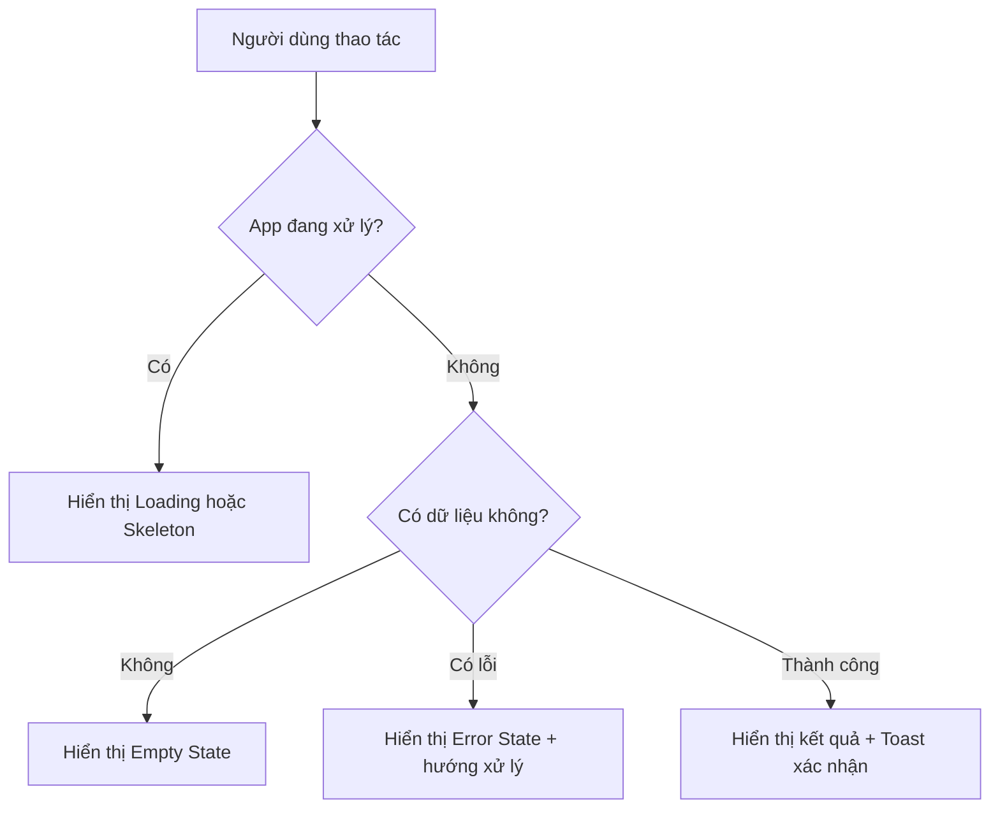
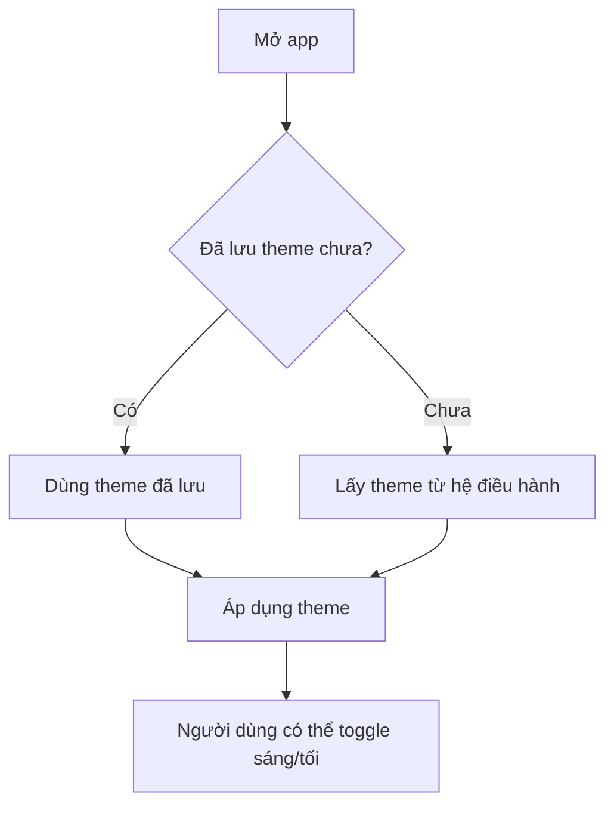
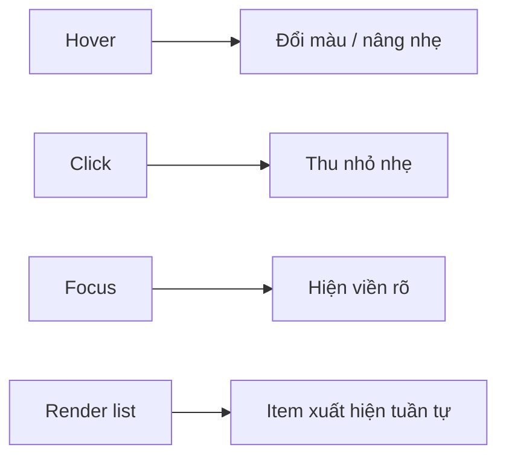
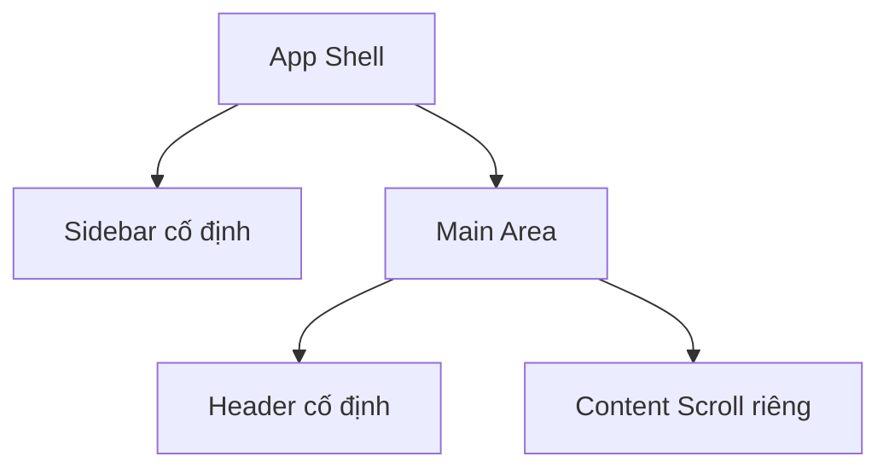

# Chương 09: UI/UX Polish

## Mục Tiêu Chương

Sau chương này, bạn sẽ:

* Biết cách biến app từ **“chạy được”** thành **“dùng sướng”**.
* Hiểu vì sao cần Design System thay vì hardcode màu sắc rải rác.
* Biết cách yêu cầu AI xử lý Dark Mode, Toast, Skeleton Loading và Micro-interactions.
* Hoàn thiện trải nghiệm người dùng cho **Veo3 Manager** trước khi đóng gói ở Chương 10.

---

## 1. “Chạy Được” Khác Với “Dùng Sướng”

Sau Chương 6-8, **Veo3 Manager** đã có các chức năng chính:

* Thêm video.
* Hiển thị danh sách video.
* Tìm kiếm, lọc trạng thái.
* Lưu dữ liệu bằng file JSON.
* Refactor backend và frontend để dễ mở rộng.

Nhưng một app **chạy đúng chức năng** chưa chắc đã tạo cảm giác chuyên nghiệp.

```text
Chạy được:
Bấm nút thì có kết quả đúng.

Dùng sướng:
Bấm nút biết ngay app đang xử lý,
biết khi nào xong,
biết lỗi ở đâu,
biết nên làm gì tiếp theo.
````

UI/UX Polish chính là bước nâng cấp từ một bài tập kỹ thuật thành một sản phẩm có cảm giác thương mại.

---

## 2. Vì Sao UI/UX Polish Quan Trọng Trong Vibe Coding?

Trong Vibe Coding, bạn không cần ngồi chỉnh từng pixel padding bằng tay. Việc của bạn là **chỉ đạo AI bằng tiêu chuẩn thẩm mỹ và trải nghiệm rõ ràng**.

Thay vì nói:

```text
Làm giao diện đẹp hơn.
```

Bạn nên nói:

```text
Thiết lập Design System, Dark Mode, Toast Notification,
Skeleton Loading, Micro-interactions, Responsive Layout
và Accessibility cho toàn bộ app.
```

Khi yêu cầu đủ rõ, AI có thể tự phân tích code hiện tại, lập kế hoạch nâng cấp và triển khai theo từng bước.

---

## 3. Bốn Trạng Thái UI Không Được Bỏ Quên

Một app chuyên nghiệp luôn cần xử lý đủ bốn trạng thái:

| Trạng thái | Câu hỏi cần trả lời                        | Ví dụ trong Veo3 Manager                    |
| ---------- | ------------------------------------------ | ------------------------------------------- |
| Loading    | Người dùng có biết app đang xử lý không?   | Đang tải danh sách video, đang lưu video    |
| Empty      | Khi chưa có dữ liệu thì hiển thị gì?       | Chưa có video nào                           |
| Error      | Khi lỗi xảy ra, người dùng có hiểu không?  | Lỗi đọc file JSON, lỗi backend              |
| Success    | Người dùng có biết thao tác đã xong không? | Thêm video thành công, xóa video thành công |



---

## 4. /cook: UI/UX Polish Toàn Diện

Dùng `/cook` để Claude tự phân tích giao diện hiện tại, lập kế hoạch nâng cấp và triển khai từng bước.

### Prompt Copy Vào Claude Code

```text
/cook Nâng cấp giao diện và trải nghiệm người dùng cho dự án Veo3 Manager.
Đọc kỹ đặc tả và triển khai tuần tự.

=== BƯỚC 1: DESIGN SYSTEM ===
- Thiết lập bộ màu semantic cho Tailwind CSS:
  màu chủ đạo, màu phụ, điểm nhấn, text phụ,
  nút xóa/cảnh báo, nền và chữ chính.
- Dùng biến màu để thay đổi theme dễ dàng.
- Chọn font phù hợp cho app desktop.
- Thiết lập bo góc nhất quán.
- Tạo các component cơ bản dùng lại được:
  Button:
  - Có trạng thái hover.
  - Có trạng thái active khi nhấn.
  - Có focus ring rõ ràng khi dùng bàn phím.

  Input:
  - Có label rõ ràng.
  - Có border dễ nhìn.
  - Có trạng thái focus rõ ràng.

Yêu cầu:
- Tất cả component phải dùng biến màu từ design system.
- Không hardcode mã màu trực tiếp trong component.

=== BƯỚC 2: DARK MODE ===
- Tạo Theme Provider bọc toàn bộ ứng dụng.
- Ưu tiên lựa chọn theme đã lưu của người dùng.
- Nếu lần đầu mở app, lấy theo cài đặt hệ điều hành.
- Khi chuyển theme, toàn bộ app đổi màu mượt mà.
- Tạo nút toggle sáng/tối với icon trực quan.
- Lưu lựa chọn theme cho lần mở app sau.

=== BƯỚC 3: TOAST NOTIFICATIONS ===
- Cài đặt thư viện thông báo sonner.
- Tích hợp Toaster vào app.
- Tạo helper gọi toast tiện lợi để dùng lại ở mọi nơi.
- Áp dụng toast cho các thao tác chính:
  - Thành công: hiển thị thông báo tích cực.
  - Lỗi: hiển thị thông báo kèm nội dung lỗi từ backend.
- Toast phải hỗ trợ Dark Mode tự động.

Nếu cần cài thêm thư viện, hãy liệt kê thư viện và giải thích lý do trước khi cài.

=== BƯỚC 4: SKELETON LOADING ===
- Tạo component skeleton cho thẻ video.
- Skeleton phải khớp layout thật của video card.
- Các vùng text dùng thanh ngang có độ dài khác nhau để trông tự nhiên.
- Hiển thị skeleton khi đang tải danh sách video.

=== BƯỚC 5: MICRO-INTERACTIONS ===
- Hover: phóng nhẹ hoặc đổi background, có transition mượt.
- Active: thu nhỏ nhẹ khi click để tạo cảm giác nút bấm bị lún.
- Danh sách video: animation xuất hiện tuần tự khi render từng item.
- Không dùng animation quá mạnh gây khó chịu.

=== BƯỚC 6: LAYOUT & RESPONSIVE ===
- Sidebar cố định bên trái, chiều cao toàn màn hình.
- Phần nội dung chính co giãn linh hoạt.
- Tạo vùng scroll riêng cho content.
- Header giữ nguyên, tránh lỗi double scrollbar.
- Khi cửa sổ nhỏ, tự động ẩn sidebar.
- Hiển thị nút hamburger menu trên màn hình nhỏ.

=== BƯỚC 7: ACCESSIBILITY ===
- Mọi input đều có label mô tả rõ ràng.
- Khi điều hướng bằng bàn phím, phần tử đang focus phải được tô sáng rõ.
- Kiểm tra độ tương phản màu trên cả Light Mode và Dark Mode.
- Đảm bảo các nút chính có aria-label nếu chỉ dùng icon.

Hãy báo cáo tiến độ từng bước.
Sau khi hoàn thành, chạy kiểm tra build/lint nếu dự án có cấu hình sẵn.
```

---

## 5. Phân Tích Prompt

### Bước 1: Design System

Design System là nền tảng của toàn bộ giao diện.

Thay vì mỗi component tự dùng màu riêng, app sẽ có bộ màu semantic như:

| Token       | Ý nghĩa                   |
| ----------- | ------------------------- |
| Primary     | Màu chính của thương hiệu |
| Secondary   | Màu phụ                   |
| Accent      | Màu nhấn                  |
| Background  | Nền app                   |
| Foreground  | Chữ chính                 |
| Muted       | Chữ phụ, nền phụ          |
| Destructive | Xóa, lỗi, cảnh báo        |

Khi làm tốt bước này, các bước sau như Dark Mode, Button, Input, Toast đều dễ triển khai hơn.

---

### Bước 2: Dark Mode

Dark Mode không chỉ là đổi nền đen chữ trắng.

Một Dark Mode tốt cần:

* Nhớ lựa chọn của người dùng.
* Tự lấy theme hệ điều hành ở lần mở đầu tiên.
* Chuyển màu mượt mà.
* Không làm mất tương phản.
* Không khiến icon, border, text phụ bị chìm.



---

### Bước 3: Toast Notifications

Toast dùng để thay thế `alert()`.

Thay vì chặn toàn bộ giao diện bằng popup, toast hiển thị nhẹ nhàng ở góc màn hình.

Ví dụ:

| Hành động              | Toast nên hiển thị                      |
| ---------------------- | --------------------------------------- |
| Thêm video thành công  | `Đã thêm video mới`                     |
| Xóa video thành công   | `Đã xóa video`                          |
| Lưu thất bại           | `Không thể lưu video: [lỗi từ backend]` |
| Không đọc được dữ liệu | `Không thể tải danh sách video`         |

Toast giúp người dùng luôn biết thao tác vừa rồi có thành công hay không.

---

### Bước 4: Skeleton Loading

Skeleton Loading tốt hơn spinner trong nhiều trường hợp vì nó cho người dùng cảm giác app đang chuẩn bị dữ liệu thật.

Thay vì:

```text
Đang tải...
```

App hiển thị khung gần giống card thật:

```text
[ thumbnail skeleton ]
[ title skeleton dài ]
[ status skeleton ngắn ]
[ description skeleton vừa ]
```

Điều này khiến app có cảm giác nhanh và ổn định hơn.

---

### Bước 5: Micro-interactions

Micro-interactions là các phản hồi nhỏ khi người dùng tương tác.

Ví dụ:

* Nút đổi màu khi hover.
* Nút thu nhỏ nhẹ khi click.
* Card video nâng nhẹ lên khi rê chuột.
* Danh sách video xuất hiện tuần tự.
* Input sáng border khi focus.



Các chi tiết này nhỏ, nhưng tạo cảm giác app có “soul”.

---

### Bước 6: Layout & Responsive

Với app desktop như **Veo3 Manager**, layout nên có cấu trúc rõ ràng:

* Sidebar bên trái.
* Header phía trên content.
* Main content có vùng scroll riêng.
* Không để toàn bộ body bị double scrollbar.
* Khi cửa sổ nhỏ, sidebar ẩn đi và dùng hamburger menu.



---

### Bước 7: Accessibility

Accessibility không chỉ dành cho người khuyết tật. Nó giúp app dễ dùng hơn với tất cả mọi người.

Cần kiểm tra:

* Input có label rõ ràng.
* Button có trạng thái focus.
* Icon button có `aria-label`.
* Màu chữ đủ tương phản với nền.
* Có thể dùng app bằng bàn phím.

---

## 6. Prompt Nhỏ: Thêm Loading Và Empty State

Nếu chưa muốn polish toàn diện, bạn có thể yêu cầu Claude làm từng phần nhỏ:

```text
Hãy đóng vai Senior React + TypeScript Developer chuyên về UX.

Bối cảnh:
Màn hình danh sách video của Veo3 Manager hiện tại chỉ hiển thị bảng trống nếu chưa có video,
và chưa có dấu hiệu rõ ràng khi đang gọi hàm AddVideo từ backend.

Yêu cầu:
- Khi đang gọi AddVideo, hiển thị spinner nhỏ trên nút "Thêm Video Mới".
- Vô hiệu hóa nút trong lúc đang xử lý.
- Khi danh sách video rỗng, hiển thị Empty State gồm:
  - Icon đơn giản.
  - Dòng chữ "Chưa có video nào".
  - Mô tả ngắn hướng dẫn người dùng tạo video đầu tiên.
  - Nút "Tạo Video Đầu Tiên".
- Khi tìm kiếm không có kết quả, hiển thị:
  "Không tìm thấy video phù hợp, thử từ khóa khác".

Tiêu chí hoàn thành:
- Loading, empty và search empty không bị hiển thị lẫn nhau.
- Không làm hỏng các chức năng thêm, tìm kiếm, lọc.
```

---

## 7. Prompt Nhỏ: Chuẩn Hóa Khoảng Trắng

```text
Hãy rà soát màn hình danh sách video và áp dụng nguyên tắc khoảng trắng:

- Khoảng cách giữa các section tối thiểu là 24px.
- Khoảng cách giữa các item trong danh sách tối thiểu là 12px.
- Tiêu đề màn hình dùng font lớn hơn và đậm hơn nội dung bên dưới.
- Nội dung phụ dùng màu muted text.
- Các card video có padding nhất quán.

Không đổi logic component.
Chỉ điều chỉnh class Tailwind liên quan đến spacing, typography và layout.
```

---

## 8. Prompt Nhỏ: Toast Cho Mọi Hành Động

```text
Hãy kiểm tra tất cả thao tác chính trong Veo3 Manager:
- Thêm video.
- Xóa video.
- Cập nhật video.
- Lưu thay đổi.
- Tải danh sách video.

Với mỗi thao tác:
- Khi thành công, hiển thị toast xác nhận ngắn gọn.
- Khi thất bại, hiển thị toast lỗi kèm nội dung lỗi từ backend nếu có.
- Không dùng alert().
- Toast tự biến mất sau vài giây.
- Toast phải hiển thị đúng ở cả Light Mode và Dark Mode.
```

---

## 9. Checklist Polish Trước Khi Đóng Gói

Trước khi sang Chương 10, hãy kiểm tra:

```text
[ ] App có Design System thay vì hardcode màu rải rác
[ ] Light Mode và Dark Mode hoạt động ổn định
[ ] Theme được lưu lại sau khi đóng/mở app
[ ] Mọi thao tác đang xử lý đều có loading state
[ ] Danh sách rỗng có Empty State rõ ràng
[ ] Lỗi hiển thị dễ hiểu, không chỉ log trong console
[ ] Thành công được xác nhận bằng toast
[ ] Skeleton Loading khớp layout thật
[ ] Button có hover, active và focus state
[ ] Input có label và focus state rõ ràng
[ ] Sidebar và content không gây double scrollbar
[ ] Layout không vỡ khi resize cửa sổ nhỏ
[ ] Màu chữ đủ tương phản trên cả Light và Dark Mode
[ ] Có thể dùng các thao tác chính bằng bàn phím
```

---

## 10. Điều Cần Ghi Nhớ

* UI/UX Polish là bước biến app từ **“chạy đúng”** thành **“dùng dễ chịu”**.
* Đừng yêu cầu AI “làm đẹp hơn” một cách mơ hồ. Hãy yêu cầu bằng tiêu chuẩn cụ thể.
* Design System giúp giao diện nhất quán và dễ mở rộng.
* Dark Mode nên dùng biến màu, không nên vá thủ công từng component.
* Toast tốt hơn `alert()` vì không làm gián đoạn luồng sử dụng.
* Skeleton Loading tạo cảm giác app nhanh hơn spinner đơn giản.
* Micro-interactions nhỏ nhưng làm app có cảm giác chuyên nghiệp hơn.
* Accessibility là tiêu chuẩn cơ bản, không phải phần phụ.

---

## Tóm Tắt Chương

Trong chương này, bạn đã học cách polish giao diện **Veo3 Manager** theo hướng chuyên nghiệp hơn: thiết lập Design System, Dark Mode, Toast Notifications, Skeleton Loading, Micro-interactions, Responsive Layout và Accessibility.

Đây là bước quan trọng trước khi đóng gói app ở Chương 10, vì người dùng không chỉ cần một app chạy đúng, mà còn cần một app dễ hiểu, dễ thao tác và tạo cảm giác đáng tin cậy.

