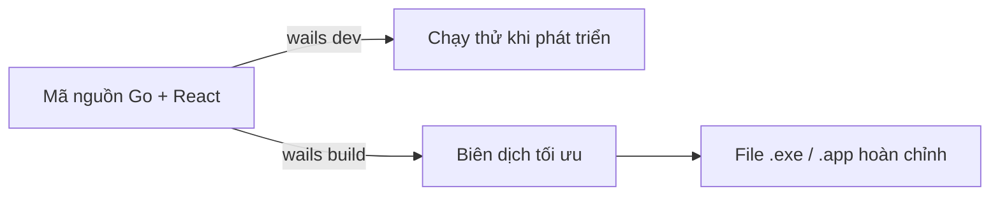
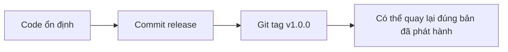

# Chương 10-1: Đóng Gói Và Phát Hành

## Mục Tiêu Chương

Sau chương này, bạn sẽ:

* Biết cách dùng `wails build` để đóng gói **Veo3 Manager** thành file cài đặt cho Windows và macOS.
* Hiểu cách cấu hình thông tin ứng dụng như tên, icon và phiên bản trước khi build.
* Biết cách kiểm thử bản build cuối cùng như một người dùng thật.
* Chuẩn bị sẵn sàng cho bước phát hành sản phẩm ở Chương 10-2.

---

## 1. Dev Mode Khác Gì Bản Build?

Từ Chương 6 đến Chương 9, bạn chủ yếu chạy ứng dụng bằng:

```bash
wails dev
````

Đây là chế độ dành cho phát triển. Nó có hot-reload, log chi tiết và giúp bạn chỉnh sửa nhanh.

Nhưng khi muốn đưa app cho người khác dùng, bạn cần build bản chính thức bằng:

```bash
wails build
```

```text
wails dev   -> Dành cho lập trình, test nhanh, hot-reload, nhiều log
wails build -> Dành cho người dùng cuối, tối ưu, đóng gói thành app hoàn chỉnh
```



---

## 2. Cấu Hình Thông Tin Ứng Dụng Trước Khi Build

Trước khi build, mở file `wails.json` ở thư mục gốc dự án.

Bạn cần kiểm tra các trường quan trọng như:

```json
{
  "name": "veo3-manager",
  "outputfilename": "Veo3Manager",
  "info": {
    "productName": "Veo3 Manager",
    "productVersion": "1.0.0",
    "copyright": "Copyright © 2026"
  }
}
```

Các trường này ảnh hưởng đến tên file build, tên app hiển thị với người dùng và thông tin phiên bản.

---

## 3. Prompt Cho Claude Cập Nhật `wails.json`

Bạn có thể yêu cầu Claude kiểm tra và cập nhật cấu hình build bằng prompt sau:

```text
Hãy đóng vai Senior Go/Wails Developer.

Bối cảnh:
Dự án Veo3 Manager đã hoàn thành các chức năng chính và chuẩn bị build bản phát hành đầu tiên.

Yêu cầu:
- Cập nhật file wails.json:
  - productName là "Veo3 Manager"
  - productVersion là "1.0.0"
  - outputfilename là "Veo3Manager"
- Kiểm tra thư mục build/ đã có icon ứng dụng chưa.
- Nếu chưa có build/appicon.png, hãy báo cho tôi biết cần chuẩn bị icon trước khi build chính thức.
- Không thay đổi logic backend hoặc frontend.

Tiêu chí hoàn thành:
- wails.json có đầy đủ thông tin cần thiết cho bản build chính thức.
- Không làm hỏng cấu hình Wails hiện tại.
```

---

## 4. Build Ứng Dụng Cho Windows

Để build bản Windows 64-bit, chạy:

```bash
wails build -platform windows/amd64
```

Sau khi build thành công, file thường nằm ở:

```text
build/bin/Veo3Manager.exe
```

Đây là file bạn có thể mở trực tiếp trên Windows.

---

## 5. Build Ứng Dụng Cho macOS

Để build bản macOS universal, chạy:

```bash
wails build -platform darwin/universal
```

Kết quả thường nằm ở:

```text
build/bin/Veo3Manager.app
```

Lưu ý quan trọng:

```text
Build cho hệ điều hành nào thì tốt nhất nên build trên chính hệ điều hành đó.

Windows -> build trên Windows
macOS   -> build trên macOS
```

Điều này giúp tránh lỗi tương thích, đặc biệt với icon, quyền hệ thống và đóng gói ứng dụng.

---

## 6. Kiểm Thử Bản Build Như Người Dùng Thật

Sau khi build xong, đừng kiểm thử bằng `wails dev` nữa.

Hãy mở trực tiếp file đã build:

```text
Windows: build/bin/Veo3Manager.exe
macOS:   build/bin/Veo3Manager.app
```

Checklist kiểm thử:

```text
[ ] Nhấp đúp vào app, ứng dụng mở bình thường
[ ] Thêm một video mới thành công
[ ] Dữ liệu được lưu đúng vào file JSON
[ ] Đóng app rồi mở lại, dữ liệu vẫn còn
[ ] Tìm kiếm hoạt động đúng
[ ] Lọc trạng thái hoạt động đúng
[ ] Empty State hiển thị đúng khi chưa có dữ liệu
[ ] Loading/Skeleton từ Chương 9 hiển thị đúng lúc
[ ] Toast thông báo thành công/lỗi hoạt động đúng
[ ] Dark Mode vẫn lưu lựa chọn sau khi mở lại app
[ ] App không xuất hiện lỗi trắng màn hình
[ ] Kích thước file build không quá nặng bất thường
```

---

## 7. Nếu Lỗi Chỉ Xảy Ra Ở Bản Build

Có những lỗi không xuất hiện khi chạy `wails dev`, nhưng lại xuất hiện sau khi `wails build`.

Khi gặp trường hợp này, hãy mô tả lỗi thật rõ trước khi yêu cầu AI sửa.

```text
Lỗi này chỉ xảy ra ở bản build bằng wails build,
không xảy ra khi chạy wails dev.

Hiện tượng:
[Mô tả lỗi nhìn thấy]

Thao tác gây lỗi:
[Các bước bấm cụ thể]

Thông báo lỗi:
[Nếu có log hoặc popup lỗi, copy vào đây]

Kết quả mong đợi:
[Mô tả app đáng lẽ phải hoạt động như thế nào]

Yêu cầu:
Hãy dùng reverse debugging để tìm nguyên nhân khác biệt giữa dev mode và production build,
sau đó đề xuất cách sửa an toàn.
```

---

## 8. Đánh Dấu Phiên Bản Bằng Git Tag

Sau khi bản build đã kiểm thử ổn định, hãy commit và đánh dấu phiên bản phát hành.

```bash
git add .
git commit -m "Release v1.0.0: Veo3 Manager first packaged build"
git tag v1.0.0
```

Git tag giúp bạn lưu lại đúng cột mốc phát hành.

Sau này, dù code ở nhánh phát triển đã thay đổi nhiều, bạn vẫn có thể quay lại bản `v1.0.0`.



---

## 9. Prompt Kiểm Tra Trước Khi Release

Trước khi gửi app cho người khác, bạn có thể yêu cầu Claude rà soát lần cuối:

```text
Hãy đóng vai Release Engineer cho dự án Wails.

Bối cảnh:
Veo3 Manager chuẩn bị phát hành bản v1.0.0.

Yêu cầu:
- Kiểm tra cấu hình wails.json.
- Kiểm tra icon app đã có chưa.
- Kiểm tra script build.
- Kiểm tra thư mục build/bin sau khi build.
- Đề xuất checklist kiểm thử bản release.
- Không sửa code nếu chưa cần thiết.

Mục tiêu:
Đảm bảo app sẵn sàng đóng gói và chia sẻ cho người dùng thật.
```

---

## 10. Điều Cần Ghi Nhớ

* `wails dev` dùng để phát triển, còn `wails build` dùng để tạo bản phát hành.
* Luôn cập nhật `wails.json` trước khi build chính thức.
* Nên chuẩn bị icon app trước khi đóng gói.
* Build cho Windows nên thực hiện trên Windows, build cho macOS nên thực hiện trên macOS.
* Luôn mở trực tiếp file `.exe` hoặc `.app` để kiểm thử như người dùng thật.
* Nếu lỗi chỉ xảy ra ở bản build, hãy mô tả rõ khác biệt giữa dev mode và production build.
* Mỗi bản phát hành ổn định nên được đánh dấu bằng Git tag.

---

## Tóm Tắt Chương

Trong chương này, bạn đã đưa **Veo3 Manager** từ một dự án đang phát triển thành một ứng dụng desktop có thể đóng gói và chia sẻ cho người khác sử dụng.

Bạn đã học cách cấu hình thông tin ứng dụng trong `wails.json`, build app bằng `wails build`, kiểm thử bản build như người dùng thật và đánh dấu phiên bản bằng Git tag.

Ở Chương 10-2, bạn sẽ tiếp tục bước cuối cùng: phát hành sản phẩm ra bên ngoài bằng landing page, file cài đặt và hướng dẫn sử dụng cho người dùng thật.

