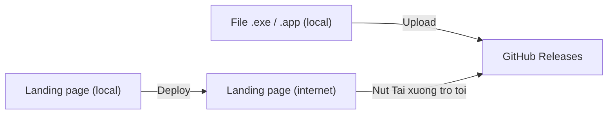
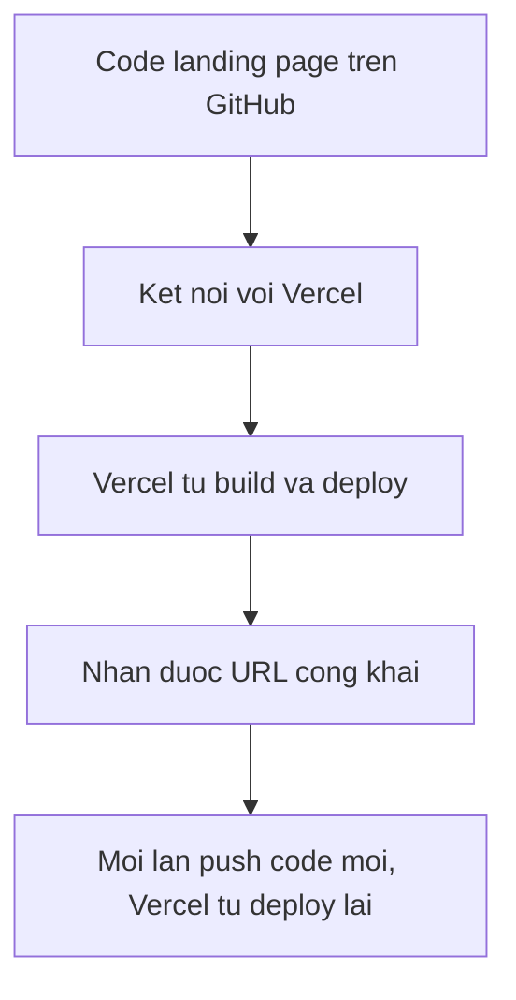
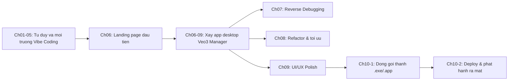

# Chương 10-2: Ra Mắt Sản Phẩm

## Mục Tiêu Chương

Sau chương này, bạn sẽ:

* Biết cách đưa landing page của **Veo3 Manager** (Chương 06) lên internet để ai cũng xem được.
* Biết cách dùng GitHub Releases để phân phối file cài đặt `.exe` / `.app` đã build ở Chương 10-1.
* Biết cách nối nút "Tải xuống" trên landing page với đúng file cài đặt.
* Có một checklist ra mắt hoàn chỉnh cho lần phát hành v1.0.0 đầu tiên.
* Nhìn lại toàn bộ hành trình Vibe Coding đã đi qua trong khóa học.

---

## 1. Hai Việc Còn Thiếu Trước Khi Ra Mắt

Tính đến cuối Chương 10-1, bạn đã có:

```text
[x] Landing page giới thiệu Veo3 Manager (Chương 06) - đang chạy local
[x] File cài đặt Veo3Manager.exe / Veo3Manager.app - đang nằm trong build/bin
[x] Git tag v1.0.0 đánh dấu phiên bản phát hành
```

Nhưng cả hai thứ quan trọng nhất vẫn chỉ nằm trên máy của bạn. Landing page chạy bằng `npm run dev` thì chỉ bạn xem được. File `.exe` nằm trong `build/bin` thì chỉ máy bạn cài được.



Ra mắt sản phẩm nghĩa là hoàn thành hai mũi tên còn thiếu trong sơ đồ trên: **deploy landing page** và **phân phối file cài đặt**.

---

## 2. Vì Sao Chọn GitHub Releases Để Phân Phối File Cài Đặt?

Có nhiều cách phân phối file cài đặt: Google Drive, Dropbox, server riêng... Trong chương này, ta chọn **GitHub Releases** vì:

* Bạn đã có sẵn Git tag `v1.0.0` từ Chương 10-1, rất tiện để gắn trực tiếp vào Release.
* Miễn phí, không giới hạn băng thông cho repo public.
* Người dùng thấy rõ version history, changelog từng lần phát hành.
* Link tải ổn định, không bị đổi như link chia sẻ Drive.

```text
Google Drive/Dropbox -> Phu hop chia se tam thoi, link de doi
GitHub Releases       -> Phu hop phat hanh chinh thuc, gan voi Git tag co san
```

---

## 3. Tạo GitHub Release Cho v1.0.0

Nếu code **Veo3 Manager** đã được đẩy lên GitHub, hãy tạo release từ tag đã có:

```bash
git push origin main
git push origin v1.0.0
```

Sau đó vào GitHub:

```text
Repository -> Releases -> Draft a new release
-> Chọn tag: v1.0.0
-> Release title: Veo3 Manager v1.0.0
-> Mô tả ngắn: Bản phát hành đầu tiên của Veo3 Manager
-> Kéo thả file Veo3Manager.exe và Veo3Manager.app (hoặc .dmg) vào phần Assets
-> Publish release
```

Sau khi publish, mỗi file asset sẽ có một link tải trực tiếp, dạng:

```text
https://github.com/<user>/<repo>/releases/download/v1.0.0/Veo3Manager.exe
```

Đây chính là link bạn sẽ gắn vào nút "Tải xuống" trên landing page.

```text
Luu y: Neu repo la private, nguoi ngoai se khong tai duoc file asset.
Muon phan phoi cong khai, repo (hoac it nhat phan Releases) can duoc public.
```

---

## 4. Nối Landing Page Với Link Tải Thật

Landing page ở Chương 06 có nút CTA "Tải Veo3 Manager" nhưng chưa trỏ đến file thật. Giờ là lúc cập nhật.

### Prompt Copy Vào Claude Code

```text
Hãy đóng vai Senior React + TypeScript Developer.

Bối cảnh: Landing page Veo3 Manager đã có nút "Tải Veo3 Manager" ở Hero
nhưng đang là link tạm hoặc chưa hoạt động. File cài đặt thật đã có sẵn
trên GitHub Releases tại:
- Windows: https://github.com/<user>/<repo>/releases/download/v1.0.0/Veo3Manager.exe
- macOS: https://github.com/<user>/<repo>/releases/download/v1.0.0/Veo3Manager.app.zip

Yêu cầu:
- Nút tải chính tự động phát hiện hệ điều hành của người dùng qua User Agent
  và gợi ý đúng bản (Windows/macOS). Nếu không nhận diện được, hiển thị cả hai lựa chọn.
- Thêm mục nhỏ dưới nút: "Hoặc chọn phiên bản khác: Windows | macOS".
- Không thay đổi layout hoặc animation hiện có, chỉ thay hành vi của nút.
- Nếu người dùng bấm nút, mở link tải trong tab mới hoặc bắt đầu download trực tiếp.

Tiêu chí hoàn thành:
- Bấm nút trên Windows tải đúng file .exe, trên macOS tải đúng file .app.zip.
- Không có link nào bị 404.
```

---

## 5. Deploy Landing Page Lên Internet

Với một landing page React tĩnh (không có backend riêng), **Vercel** là lựa chọn nhanh và miễn phí.



### Bước 1: Đẩy Code Landing Page Lên GitHub

```bash
cd veo3-landing
git init
git add .
git commit -m "Initial commit: Veo3 Manager landing page"
git branch -M main
git remote add origin https://github.com/<user>/veo3-landing.git
git push -u origin main
```

### Bước 2: Deploy Bằng Vercel

```text
1. Vào vercel.com, đăng nhập bằng GitHub.
2. Chọn "Add New Project".
3. Chọn repo veo3-landing.
4. Framework Preset: Vite (Vercel tự nhận diện).
5. Bấm Deploy.
```

Sau vài chục giây, Vercel trả về một URL dạng:

```text
https://veo3-landing.vercel.app
```

Đây là link công khai bạn có thể chia sẻ cho bất kỳ ai.

```text
Luu y: Moi lan ban push code moi len nhanh main,
Vercel se tu dong build va deploy lai ban moi nhat.
```

---

## 6. Kiểm Thử Ra Mắt Như Một Người Dùng Xa Lạ

Trước khi công bố, hãy tự đóng vai một người chưa từng biết đến **Veo3 Manager**.

```text
[ ] Mở URL landing page trên trình duyệt ẩn danh (chưa đăng nhập gì)
[ ] Đọc Hero, hiểu được app này dùng để làm gì trong 5 giây đầu
[ ] Bấm nút "Tải Veo3 Manager", file được tải đúng, không lỗi 404
[ ] Trên điện thoại, mở landing page, giao diện không vỡ
[ ] Cài file .exe (hoặc .app) vừa tải, app mở lên bình thường
[ ] Thêm thử một video, dữ liệu lưu đúng như đã kiểm thử ở Chương 10-1
[ ] Kiểm tra lại link GitHub Releases không bị để ở trạng thái Draft
```

Nếu có bước nào thất bại, hãy quay lại đúng chương liên quan (Chương 06 cho landing page, Chương 10-1 cho bản build) để sửa, sau đó deploy lại.

---

## 7. Prompt Nhỏ: Thêm Mục "Changelog" Cho Các Lần Phát Hành Sau

Từ v1.0.0 trở đi, mỗi lần cập nhật **Veo3 Manager** nên có ghi chú thay đổi rõ ràng. Có thể nhờ Claude thêm mục này ngay từ bây giờ để chuẩn bị cho tương lai.

```text
Hãy thêm một section "Changelog" hoặc "Có gì mới" vào landing page Veo3 Manager.

Yêu cầu:
- Hiển thị danh sách phiên bản, mới nhất ở trên cùng.
- Mỗi phiên bản gồm: số version, ngày phát hành, danh sách thay đổi ngắn gọn.
- Dữ liệu lấy từ một file JSON hoặc Markdown riêng trong project,
  không hardcode trực tiếp trong component.
- Với phiên bản v1.0.0, ghi: "Phát hành đầu tiên của Veo3 Manager".

Giữ nguyên các section khác.
```

---

## 8. Checklist Ra Mắt Phiên Bản v1.0.0

```text
[ ] Đã push code lên GitHub (cả app chính và landing page)
[ ] Đã tạo GitHub Release gắn với tag v1.0.0
[ ] Đã upload file Veo3Manager.exe và Veo3Manager.app vào Release
[ ] Repo/Release ở trạng thái public, ai cũng tải được
[ ] Landing page đã deploy, có URL công khai
[ ] Nút tải trên landing page trỏ đúng file, không bị 404
[ ] Đã tự kiểm thử toàn bộ luồng như một người dùng xa lạ
[ ] Đã kiểm tra landing page trên cả desktop và mobile
[ ] Đã lưu lại URL landing page và link GitHub Releases để chia sẻ
```

---

## 9. Điều Cần Ghi Nhớ

* Ra mắt sản phẩm gồm hai phần: **deploy landing page** và **phân phối file cài đặt**, cả hai đều phải công khai trên internet.
* GitHub Releases là nơi phù hợp để phân phối file cài đặt vì gắn liền với Git tag và version history.
* Vercel giúp deploy landing page React tĩnh chỉ trong vài bước, không cần cấu hình server riêng.
* Nút tải trên landing page phải trỏ đến đúng link thật, không phải link tạm hoặc placeholder.
* Luôn kiểm thử lại toàn bộ luồng như một người dùng hoàn toàn xa lạ trước khi công bố.
* Chuẩn bị sẵn cơ chế changelog để các lần phát hành sau minh bạch và dễ theo dõi.

---

## 10. Nhìn Lại Hành Trình Vibe Coding

Từ Chương 01 đến Chương 10-2, bạn đã đi qua toàn bộ vòng đời của một sản phẩm thật:



Bạn không chỉ học cách viết prompt. Bạn đã thực hành đúng quy trình của một người làm sản phẩm thật: lên kế hoạch, viết code cùng AI, tự debug khi gặp lỗi, refactor khi code rối, polish trải nghiệm người dùng, đóng gói và cuối cùng là đưa sản phẩm đến tay người dùng thật.

---

## Tóm Tắt Chương

Chương này khép lại khóa học bằng bước quan trọng nhất: đưa **Veo3 Manager** ra khỏi máy cá nhân để đến với người dùng thật. Bạn đã học cách tạo GitHub Release để phân phối file cài đặt, deploy landing page bằng Vercel, nối nút tải với đúng link thật, và kiểm thử toàn bộ luồng như một người dùng xa lạ trước khi công bố.

Từ đây, **Veo3 Manager** không còn là một bài tập trong khóa học, mà là một sản phẩm có thể chia sẻ cho bất kỳ ai trên internet. Hành trình tiếp theo là của riêng bạn: tiếp tục cải tiến, lắng nghe phản hồi người dùng thật, và áp dụng đúng quy trình Vibe Coding đã học được để phát triển sản phẩm xa hơn nữa.
