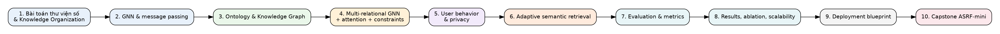

# Khóa học: Adaptive Semantic Retrieval cho Digital Library

Khóa học này biến nội dung kỹ thuật của bài nghiên cứu **“An adaptive semantic retrieval framework for digital libraries integrating graph neural networks, ontology, and user behavior”** thành một lộ trình học độc lập bằng tiếng Việt.

## Mục tiêu cuối khóa

Sau khi học xong, người học có thể:

- giải thích vì sao keyword search và KOS tĩnh gặp khó trong thư viện số;
- mô hình hóa tài nguyên thư viện thành **ontology + heterogeneous knowledge graph**;
- hiểu GNN, R-GCN/MR-GCN, attention và semantic regularization;
- thiết kế pipeline thu thập và biểu diễn hành vi người dùng có chú ý đến riêng tư;
- xây một cơ chế retrieval kết hợp **query expansion + semantic similarity + personalized ranking + feedback**;
- đọc đúng Precision, Recall, F1, MAP, nDCG/ARM, ablation và scalability results;
- thiết kế một bản **ASRF-mini** để thử nghiệm trên bộ dữ liệu nhỏ.



## Cấu trúc thư mục

```text
khoa_hoc_adaptive_semantic_retrieval/
├── README.md
├── lessons/                 # 10 bài lý thuyết/thiết kế
├── exercises/               # bài tập + lab + capstone
├── images/
│   ├── paper_figures/       # hình/bảng được cắt nguyên từ paper để đối chiếu
│   └── course_visuals/      # sơ đồ học tập được dựng lại cho khóa học
├── data/                    # bảng số liệu dùng trong phần thực nghiệm
└── source/                  # ghi chú nguồn, phạm vi và cách dùng
```

## Cách học khuyến nghị

Mỗi bài nên đi theo chu trình: **đọc lesson -> tự vẽ lại sơ đồ -> trả lời concept check -> làm mini exercise -> đối chiếu figure/table gốc**. Với phần GNN, nên tự tính một lượt message passing bằng số nhỏ trước khi nghĩ tới code. Với phần retrieval, nên tự viết scoring function trên 5–10 document mẫu trước khi làm hệ thống lớn.

## Lưu ý về kết quả thực nghiệm

Các con số Precision/Recall/MAP/response time trong khóa học được giữ theo thí nghiệm mô tả trong bài nghiên cứu. Chúng nên được hiểu là **kết quả của thiết lập thực nghiệm trong nguồn**, không phải cam kết hiệu năng chung cho mọi thư viện số hoặc mọi dataset.

Bắt đầu tại: [`lessons/01_digital_library_and_kos.md`](lessons/01_digital_library_and_kos.md)
