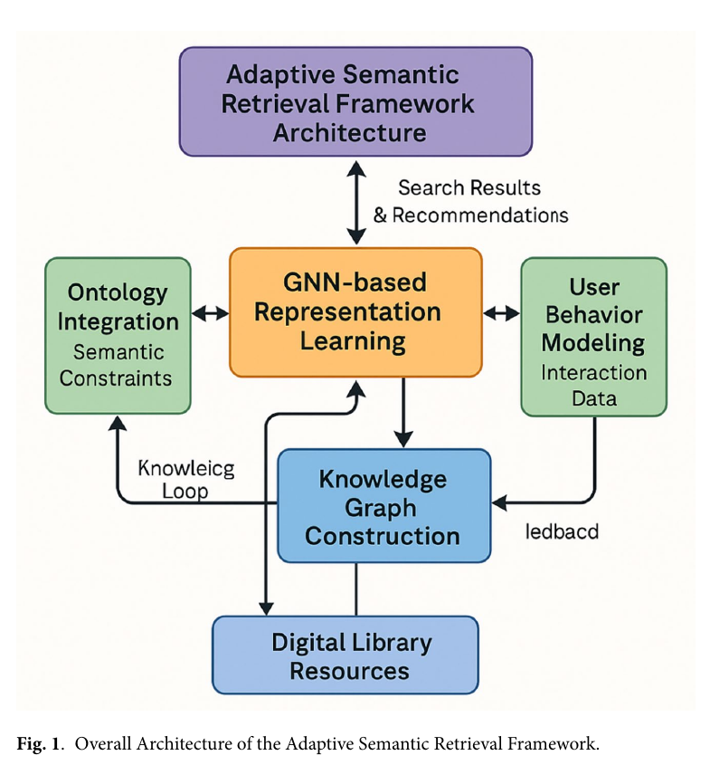

# Bài 01 — Bài toán thư viện số và giới hạn của Knowledge Organization truyền thống

## 1. Bài toán cốt lõi

Thư viện số hiện đại không chỉ lưu PDF. Nó phải quản lý **document, author, concept, collection, citation, annotation, rights, format, place, event** và nhiều quan hệ chéo giữa chúng. Khi kho dữ liệu lớn lên, ba vấn đề xuất hiện cùng lúc:

1. **Quan hệ đa chiều:** một tài liệu có thể thuộc nhiều chủ đề, liên quan nhiều tác giả, trích dẫn nhiều nguồn và nối tới nhiều concept.
2. **Từ vựng không đồng nhất:** người dùng tìm “graph search”, tài liệu có thể dùng “graph-based retrieval” hoặc “semantic retrieval”.
3. **Nhu cầu biến đổi theo ngữ cảnh:** cùng một truy vấn nhưng người mới học và chuyên gia có thể cần kết quả khác nhau.

Keyword matching xử lý tốt trường hợp từ trong query xuất hiện trực tiếp trong document, nhưng kém khi cần hiểu quan hệ ngữ nghĩa hoặc mối liên hệ gián tiếp.

## 2. Bốn họ Knowledge Organization System

Có thể nhìn KOS theo bốn mức tăng dần về năng lực biểu diễn:

| Nhóm | Ví dụ | Điểm mạnh | Giới hạn |
|---|---|---|---|
| Term-based | controlled vocabulary, subject heading | chuẩn hóa thuật ngữ | ít cấu trúc quan hệ |
| Classification-based | taxonomy, faceted classification | tổ chức hệ thống, dễ duyệt | khó biểu diễn quan hệ phức tạp |
| Relationship-based | thesaurus, semantic network | có quan hệ synonym/hierarchy/association | tập quan hệ thường bị giới hạn |
| Ontology-based | OWL ontology, knowledge graph | biểu diễn lớp, thuộc tính, quan hệ, ràng buộc, suy luận | tốn công xây dựng và bảo trì |

Mục tiêu của hệ thống adaptive không phải xóa bỏ KOS truyền thống, mà **giữ tính kỷ luật ngữ nghĩa của ontology đồng thời bổ sung khả năng học từ dữ liệu**.

## 3. Vì sao cần kiến trúc lai?

Một kiến trúc chỉ dựa vào ontology có thể rất “đúng” theo domain nhưng chậm thích nghi. Một kiến trúc chỉ dựa vào behavior có thể cá nhân hóa mạnh nhưng dễ lệch khỏi cấu trúc tri thức. GNN đứng ở giữa: nó học embedding từ topology và feature của graph, còn ontology đóng vai trò ràng buộc, behavior cung cấp tín hiệu thích nghi.

## 4. Năm khối chức năng cần nhớ

- **Knowledge Graph Construction:** gom tài nguyên thành graph thống nhất.
- **Ontology Integration:** áp lớp nghĩa chính thức và ràng buộc domain.
- **User Behavior Modeling:** biến tương tác thành signal có cấu trúc.
- **GNN-based Representation Learning:** học embedding theo quan hệ.
- **Adaptive Retrieval:** tìm kiếm/xếp hạng bằng ngữ nghĩa + personalization + feedback.

## 5. Ý tưởng then chốt

Hãy nhớ công thức tư duy:

> **Semantic structure + learned representation + behavioral adaptation = adaptive retrieval**

Không thành phần nào tự nó giải quyết toàn bộ bài toán. Điểm thiết kế quan trọng là **luồng thông tin hai chiều**: retrieval sinh feedback, feedback cập nhật representation; ontology hướng dẫn graph và embedding; graph mới lại có thể gợi ý quan hệ cần tinh chỉnh.

## Concept check

1. Tại sao taxonomy khó biểu diễn một tài liệu thuộc nhiều tuyến chủ đề đồng thời?
2. Vì sao ontology có thể tăng precision nhưng chưa chắc tăng recall tương ứng?
3. Nếu bỏ behavior, hệ thống còn “semantic” không? Còn “adaptive” đến mức nào?
