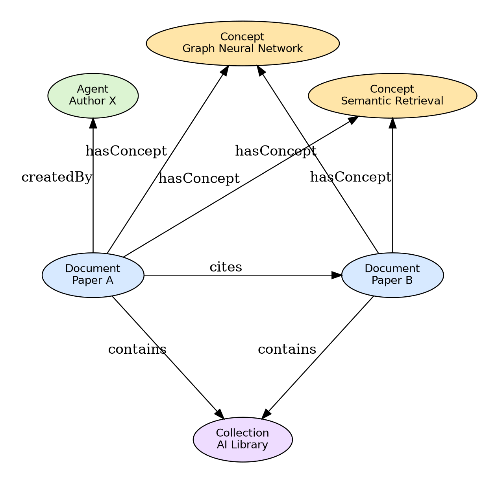

# Bài 02 — Graph Neural Network và Message Passing cho Knowledge Representation

## 1. Graph là cấu trúc tự nhiên của thư viện số

Biểu diễn cơ bản:

$$G=(V,E)$$

- $V$: node, ví dụ Document, Author, Concept.
- $E$: edge, ví dụ `createdBy`, `hasConcept`, `cites`.

Mỗi node $v_i$ có feature ban đầu $h_i^{(0)}$. GNN học representation mới bằng cách nhận thông tin từ hàng xóm.

## 2. Message passing

Dạng tổng quát:

$$
h_i^{(l+1)} = UPDATE\left(h_i^{(l)},\;AGGREGATE\{h_j^{(l)}:j\in N(i)\}\right)
$$

Trực giác: một document không chỉ được hiểu từ text của nó mà còn từ author, concept, citation và collection xung quanh.

### Ví dụ nhỏ

Giả sử `Paper A` có vector nội dung riêng nhưng đồng thời liên kết với concept `Graph Neural Network` và `Semantic Retrieval`. Sau một layer message passing, embedding của `Paper A` sẽ chứa tín hiệu từ hai concept này. Sau nhiều layer, nó còn nhận thông tin gián tiếp từ các document khác nối chung concept.

## 3. Từ GCN tới relation-aware GNN

GCN thông thường coi edge khá đồng nhất. Nhưng trong digital library, `cites` khác hẳn `hasConcept`. Vì vậy cần relation-specific transformation:

$$
h_i^{(l+1)}=\sigma\left(W_0^{(l)}h_i^{(l)}+\sum_{r\in R}\sum_{j\in N_r(i)}\frac{1}{c_{i,r}}W_r^{(l)}h_j^{(l)}\right)
$$

Trong đó:

- $R$ là tập loại quan hệ;
- $W_r$ là ma trận học riêng cho từng relation;
- $N_r(i)$ là hàng xóm nối với node $i$ bằng relation $r$.

Đây là lý do R-GCN/MR-GCN phù hợp với heterogeneous knowledge graph.

## 4. Attention: không phải hàng xóm nào cũng quan trọng như nhau

Relation-aware attention học trọng số $\alpha_{ij}^r$. Một citation trực tiếp vào phương pháp cốt lõi có thể quan trọng hơn một liên kết chung chung. Khi query thay đổi, ngữ cảnh quan trọng cũng có thể thay đổi.

## 5. Inductive capability

Điểm hữu ích của GNN là có thể tạo embedding cho node mới dựa trên feature và neighborhood của nó. Trong thư viện số, điều này quan trọng vì document mới được thêm liên tục.

## 6. Bài học thiết kế

GNN không thay thế ontology. GNN học **representation mềm**; ontology cung cấp **semantic constraints cứng/mềm**. Khi kết hợp, embedding vừa phản ánh dữ liệu vừa ít trôi khỏi cấu trúc domain.

## Concept check

- Một node mới chỉ có text nhưng chưa có nhiều edge sẽ gặp vấn đề gì?
- Vì sao dùng cùng một $W$ cho mọi relation có thể làm mất nghĩa?
- Ba layer GNN nghĩa là node có thể nhận thông tin từ phạm vi bao xa trong graph?
