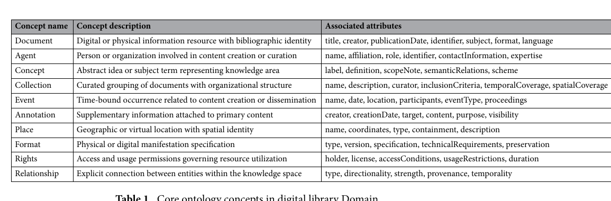
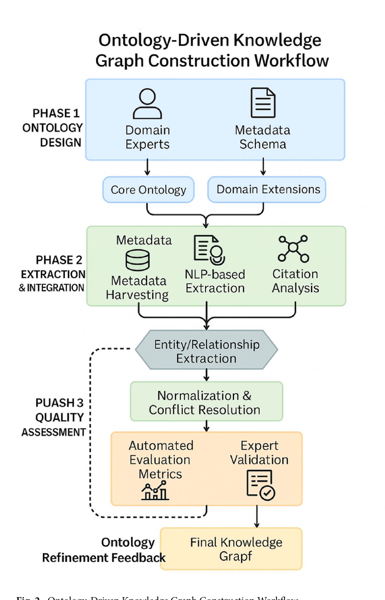

# Bài 03 — Ontology và quy trình xây Knowledge Graph

## 1. Ontology đóng vai trò schema ngữ nghĩa

Ontology định nghĩa **class, property, relationship, axiom** và tạo ngôn ngữ chung cho toàn bộ graph. Trong thiết kế của khóa học, các lớp lõi nên bao gồm:

- Document
- Agent
- Concept
- Collection
- Event
- Annotation
- Place
- Format
- Rights
- Relationship

## 2. Thiết kế theo kiến trúc modular

Tách hai phần:

- **Core ontology:** khái niệm dùng chung cho hầu hết thư viện.
- **Domain extension:** khái niệm riêng cho y khoa, pháp luật, văn hóa, khoa học máy tính…

Nhờ vậy hệ thống vừa tương thích chéo domain vừa cho phép mở rộng.

## 3. Pipeline xây graph

Ba pha:

### Pha 1 — Ontology design

Domain expert + metadata schema -> core ontology + domain extension.

### Pha 2 — Extraction & integration

Kết hợp:

- metadata harvesting;
- NLP-based entity/relation extraction;
- citation network analysis.

Sau đó thực hiện entity/relation extraction, normalization và conflict resolution.

### Pha 3 — Quality assessment

Kiểm tra tự động và expert validation, rồi dùng kết quả để refine ontology. Đây là vòng lặp quan trọng: ontology hướng dẫn extraction, nhưng dữ liệu thực tế cũng có thể gợi ý ontology cần cập nhật.

## 4. Entity resolution và conflict resolution

Một pipeline thực tế nên dùng nhiều tầng:

1. **Identifier exact match:** DOI, ISBN, internal ID.
2. **Textual similarity:** tên tác giả/tựa gần giống.
3. **Contextual disambiguation:** cùng tên nhưng khác affiliation, co-author hoặc topic.
4. **Confidence-weighted merge:** nguồn đáng tin hơn, dữ liệu mới hơn và extraction confidence cao hơn có quyền ưu tiên.

Không nên merge entity chỉ vì string giống nhau.

## 5. Provenance là bắt buộc

Mỗi edge nên lưu `source`, `timestamp`, `confidence`, `extraction_method`. Nếu graph không lưu provenance, ta khó audit vì sao một relation xuất hiện và khó sửa sai khi nguồn thay đổi.

## Mini design task

Thiết kế schema cho thư viện paper AI gồm 5 node type và ít nhất 7 relation type. Với mỗi relation, ghi rõ direction và metadata cần lưu.
